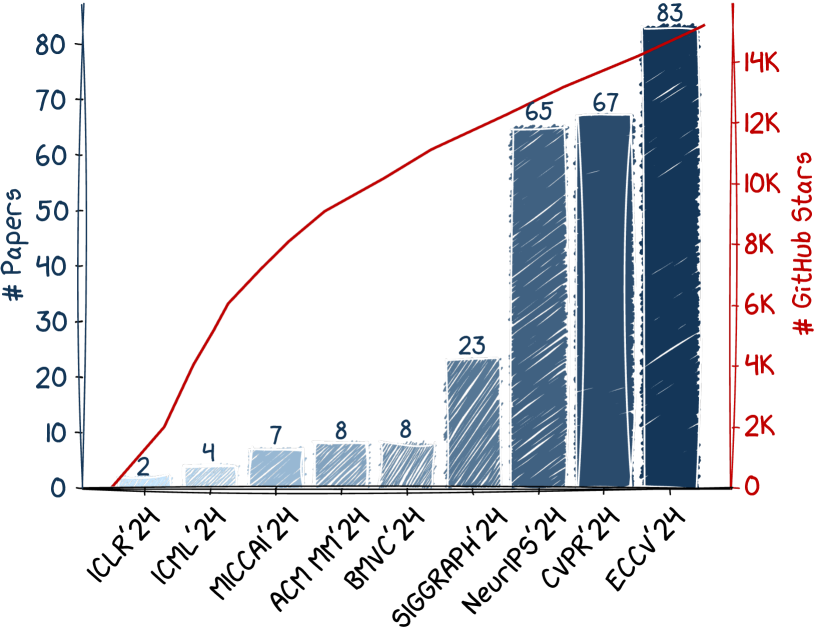
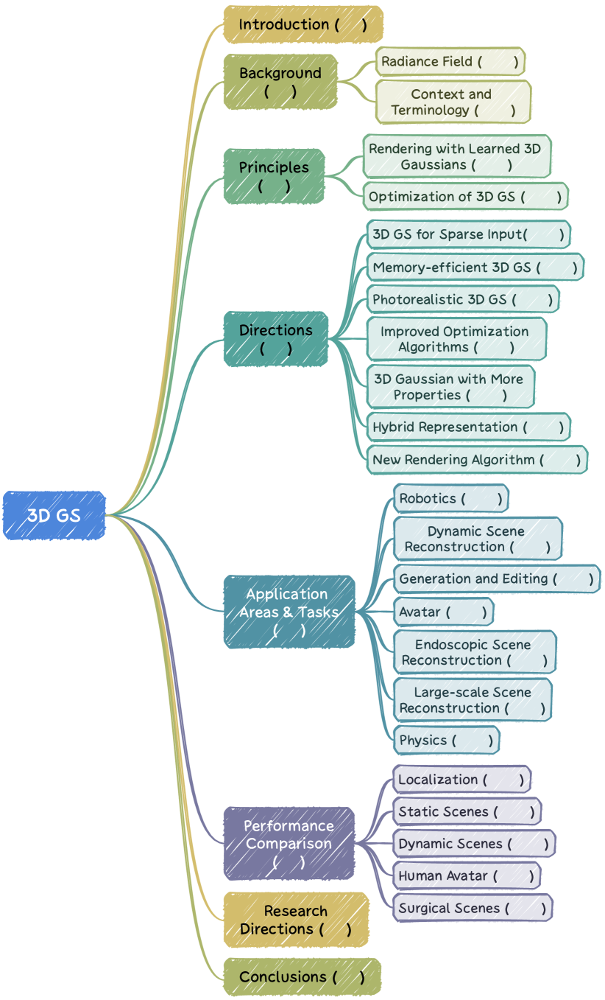
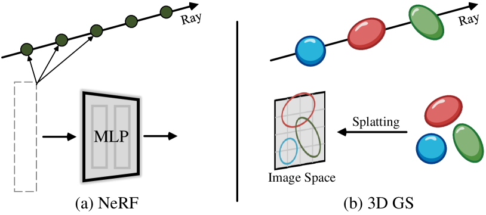
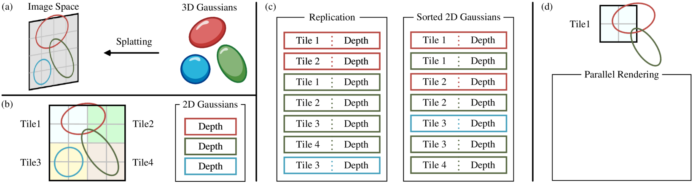
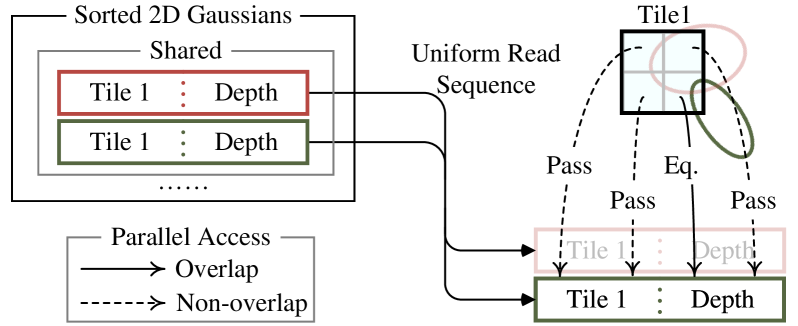
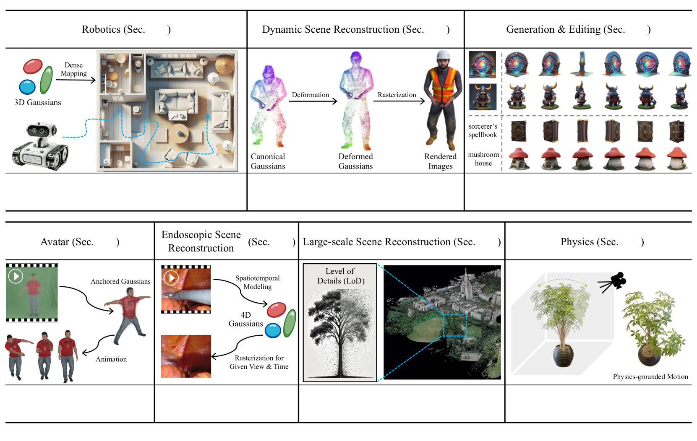

#### 초록
3D 가우시안 스플래팅(GS)은 명시적 방사장 및 컴퓨터 그래픽 분야에서 혁신적인 기술로 부상했습니다. 수백만 개의 학습 가능한 3D 가우시안을 사용하는 이 혁신적인 접근 방식은 공간 좌표를 픽셀 값에 매핑하기 위해 암시적, 좌표 기반 모델을 주로 사용하는 주류 신경 방사장 접근 방식과 크게 다릅니다. 3D GS는 명시적인 장면 표현과 미분 가능한 렌더링 알고리즘을 통해 실시간 렌더링 기능을 약속할 뿐만 아니라 전례 없는 수준의 편집성을 제공합니다. 이는 3D GS를 차세대 3D 재구성 및 표현을 위한 잠재적인 게임 체인저로 만듭니다. 본 논문에서는 3D GS 분야의 최근 발전과 중요한 기여에 대한 최초의 체계적인 개요를 제공합니다. 우리는 3D GS의 기본 원리와 출현 배경에 대한 자세한 탐색으로 시작하여 그 중요성을 이해하기 위한 토대를 마련합니다. 논의의 초점은 3D GS의 실제 적용 가능성입니다. 전례 없는 렌더링 속도를 가능하게 함으로써 3D GS는 가상 현실에서부터 인터랙티브 미디어에 이르기까지 다양한 응용 분야를 개척합니다. 이는 주요 3D GS 모델에 대한 비교 분석을 통해 보완되며, 성능과 실제 유용성을 강조하기 위해 다양한 벤치마크 작업에 걸쳐 평가됩니다. 이 설문조사는 현재의 과제를 식별하고 향후 연구를 위한 잠재적인 방향을 제시하며 결론을 맺습니다. 이 설문조사를 통해 우리는 초보자와 숙련된 연구자 모두에게 귀중한 자료를 제공하고 명시적 방사장 분야의 추가 탐색 및 발전을 촉진하는 것을 목표로 합니다.

## 1 서론
이미지 기반 3D 장면 재구성의 목표는 장면을 포착하는 뷰 또는 비디오 모음을 계산적으로 처리, 분석 및 조작할 수 있는 디지털 3D 모델로 변환하는 것입니다. 이 어렵고 오래 지속되는 문제는 기계가 실제 환경의 복잡성을 이해하는 데 근본적이며, 3D 모델링 및 애니메이션, 로봇 내비게이션, 역사 보존, 증강/가상 현실, 자율 주행과 같은 다양한 응용 분야를 촉진합니다.

3D 장면 재구성의 여정은 딥러닝이 급증하기 훨씬 전부터 시작되었으며, 초기 노력은 광장(light fields) 및 기본 장면 재구성 방법에 중점을 두었습니다 [1]–[3]. 그러나 이러한 초기 시도는 조밀한 샘플링과 구조화된 캡처에 대한 의존성으로 인해 복잡한 장면 및 조명 조건을 처리하는 데 상당한 어려움을 겪었습니다. 구조-모션(structure-from-motion) [4] 및 다중 뷰 스테레오 [5] 알고리즘의 후속 발전은 3D 장면 재구성을 위한 보다 견고한 프레임워크를 제공했습니다. 이러한 발전에도 불구하고 이러한 방법은 새로운 뷰 합성 및 텍스처 손실에 어려움을 겪었습니다. NeRF는 이러한 발전의 양자 도약입니다. 심층 신경망을 활용함으로써 NeRF는 공간 좌표를 색상 및 밀도에 직접 매핑할 수 있었습니다. NeRF의 성공은 연속적인 볼륨 장면 함수를 생성하여 전례 없는 충실도의 결과를 생성하는 능력에 달려 있었습니다. 그러나 모든 신기술과 마찬가지로 이 구현에는 대가가 따랐습니다. i) 계산 집약도. NeRF 기반 방법은 계산 집약적이며 [6]–[9] 특히 고해상도 출력을 위해 광범위한 훈련 시간과 상당한 렌더링 리소스가 필요한 경우가 많습니다. ii) 편집성. 암시적으로 표현된 장면을 조작하는 것은 어렵습니다. 신경망의 가중치에 대한 직접적인 수정이 장면의 기하학적 또는 외관 속성 변경과 직관적으로 관련되지 않기 때문입니다.

Figure 1:  The number of published papers and official GitHub stars on 3D GS. The set of statistics is sourced from [# Papers](https://github.com/Awesome3DGS/3D-Gaussian-Splatting-Papers) and [# GitHub Stars](https://star-history.com/#graphdeco-inria/gaussian-splatting&Date).

이러한 맥락에서 3D 가우시안 스플래팅(GS) [10]이 등장합니다. 이는 단순한 점진적 개선이 아니라 장면 표현 및 렌더링의 경계를 재정의하는 패러다임 전환 접근 방식입니다. NeRF가 사실적인 이미지를 생성하는 데 탁월했지만, 특히 대기 시간에 매우 민감한 애플리케이션(예: 가상 현실 및 자율 주행)의 경우 더 빠르고 효율적인 렌더링 방법의 필요성이 점점 더 분명해지고 있었습니다. 3D GS는 수백만 개의 학습 가능한 3D 가우시안을 사용하여 장면을 모델링하는 고급 명시적 장면 표현을 도입하여 이러한 요구를 해결했습니다. 암시적, 좌표 기반 모델 [11], [12]과 달리 3D GS는 명시적 표현과 고도로 병렬화된 워크플로우를 사용하여 보다 효율적인 계산 및 렌더링을 용이하게 합니다. 3D GS의 혁신은 미분 가능한 파이프라인과 점 기반 렌더링 기술 [13]–[17]의 이점을 독특하게 혼합한 데 있습니다. 학습 가능한 3D 가우시안으로 장면을 표현함으로써 고품질 이미지 합성에 필수적인 연속 볼륨 방사장의 강력한 피팅 기능을 유지하는 동시에 NeRF 기반 방법과 관련된 계산 오버헤드(예: 계산적으로 비싼 레이 마칭 및 빈 공간에서의 불필요한 계산)를 피합니다.

3D GS의 도입은 단순한 기술 발전이 아닙니다. 컴퓨터 비전 및 그래픽에서 장면 표현 및 렌더링에 접근하는 방식의 근본적인 변화를 나타냅니다. 시각적 품질을 손상시키지 않으면서 실시간 렌더링 기능을 가능하게 함으로써 3D GS는 가상 현실 및 증강 현실에서 실시간 영화 렌더링에 이르기까지 다양한 응용 분야에 수많은 가능성을 열어줍니다 [18]–[21]. 이 기술은 기존 애플리케이션을 향상시킬 뿐만 아니라 계산 제약으로 인해 이전에는 불가능했던 새로운 애플리케이션을 가능하게 할 수 있습니다. 또한 3D GS의 명시적 장면 표현은 객체 및 장면 역학을 제어하는 데 전례 없는 유연성을 제공하며, 이는 복잡한 기하학 및 다양한 조명 조건과 관련된 복잡한 시나리오에서 중요한 요소입니다 [22]–[24]. 이 수준의 편집성은 훈련 및 렌더링 프로세스의 효율성과 결합되어 3D GS를 관련 분야의 미래 발전을 형성하는 변혁적인 힘으로 만듭니다.

Figure 2: Structure of the overall review.

3D GS의 빠른 진화에 발맞춰 독자들이 따라갈 수 있도록 3D GS에 대한 첫 번째 설문조사를 제공합니다. 이 설문조사는 주제에 대한 가장 중요한 문헌을 체계적이고 시기적절하게 수집합니다. 3D GS는 매우 최근의 혁신임을 감안할 때 (그림 1), 이 설문조사는 특히 그 원칙과 도입 이후 등장한 다양한 개발 및 기여에 중점을 둡니다. 선택된 후속 작업은 주로 최고 수준의 컨퍼런스에서 가져와 3D GS의 이론적 토대, 주목할 만한 발전 및 새로운 응용 분야에 대한 철저하고 최신(2024년 12월) 분석을 제공합니다. 3D GS의 초기이지만 빠르게 진화하는 특성을 인정하여, 이 설문조사는 필연적으로 편향된 견해이지만, 우리는 이 분야의 현재 상태와 미래 잠재력을 모두 반영하는 균형 잡힌 관점을 제공하기 위해 노력합니다. 우리의 목표는 주요 연구 동향을 요약하고 빠르게 진화하는 이 분야를 이해하고 기여하고자 하는 연구자와 실무자 모두에게 귀중한 자료를 제공하는 것입니다. 기존 문헌 [25]–[28]과의 이 설문조사의 차이점은 다음과 같은 측면에서 분명합니다.

* 우리는 명확한 분류법과 프레임워크를 구축하여 3D GS를 매크로 수준 관점에서 조사하는 최초의 체계적이고 포괄적인 검토를 제공합니다. 이러한 높은 수준의 체계화는 연구자들이 논문별 검토에서는 분명하지 않을 수 있는 동향과 잠재적 방향을 식별하는 데 도움이 됩니다. 우리의 조직 구조는 3D GS 생태계 내에서 다양한 접근 방식이 서로 어떻게 관련되고 구축되는지 이해하기 위한 로드맵 역할을 합니다.

* 이 논문은 3D GS의 이론적 배경과 기본 원리를 철저히 탐구하는 최초이자 유일한 설문조사입니다. 포괄적인 적용 범위는 초보자에게 이 분야를 더 쉽게 접근하게 만들면서 경험이 풍부한 연구자에게 귀중한 통찰력을 제공합니다.

* 설문조사가 이 빠르게 진화하는 분야에서 관련성을 유지하고 장기적인 가치를 제공하도록 보장하기 위해 두 개의 동적 GitHub 저장소를 유지합니다. 하나는 설문조사의 조직 구조를 따르고 다른 하나는 분석 데이터와 함께 포괄적인 성능 비교를 포함합니다.

이 문서의 구조 요약은 그림 2에서 찾을 수 있으며, 다음과 같이 제시됩니다. 2절은 문제 공식화, 용어 및 관련 연구 도메인에 대한 간략한 배경을 제공합니다. 3절은 학습된 3D 가우시안을 사용한 렌더링 프로세스 및 3D GS의 최적화 세부 사항(즉, 3D 가우시안을 학습하는 방법)을 포함하여 3D GS의 필수 통찰력을 소개합니다. 4절은 원래 3D GS의 기능을 향상시키기 위한 몇 가지 유익한 방향을 제시합니다. 5절은 3D GS가 상당한 영향을 미친 다양한 응용 분야 및 작업을 공개하여 그 다양성을 보여줍니다. 6절은 성능 비교 및 분석을 수행합니다. 마지막으로 7절과 8절은 추가 연구를 위한 열린 질문을 강조하고 설문조사를 마무리합니다.

## 2 배경
이 섹션에서는 먼저 암시적 및 명시적 방사장을 포함한 방사장에 대한 간략한 공식을 제공합니다 (2.1절). 2.2절은 관련 렌더링 알고리즘 및 용어와의 연결을 추가로 설정합니다. 방사장, 장면 재구성 및 표현, 렌더링 방법에 대한 포괄적인 개요는 훌륭한 설문조사 [29]–[33]를 참조하십시오.

### 2.1 방사장
* 암시적 방사장. 암시적 방사장은 장면의 기하학을 명시적으로 정의하지 않고 장면의 빛 분포를 나타냅니다. 딥러닝 시대에는 신경망이 종종 연속적인 볼륨 장면 표현을 학습하는 데 사용됩니다 [34], [35]. 가장 대표적인 예는 NeRF [12]입니다. NeRF (그림 3a)에서는 하나 이상의 MLP가 공간 좌표 (x, y, z) 및 시야 방향 (θ, ϕ) 세트를 색상 c 및 볼륨 밀도 σ에 매핑하는 데 사용됩니다. (c, σ) ← MLP(x, y, z, θ, ϕ). (1) 이 형식은 복잡한 장면의 미분 가능하고 압축된 표현을 허용하지만, 볼륨 레이 마칭으로 인한 높은 계산 부하가 드는 경우가 많습니다. 일반적으로 색상 c는 방향 의존적이지만, 볼륨 밀도 σ는 그렇지 않습니다 [12].

* 명시적 방사장. 명시적 방사장은 복셀 그리드 또는 점 집합과 같은 이산 공간 구조에서 빛 분포를 직접 나타냅니다 [36], [37]. 이 구조의 각 요소는 해당 위치에 대한 방사 정보(radiance information)를 저장합니다. 이를 통해 방사 데이터에 직접적이고 종종 더 빠르게 접근할 수 있지만, 메모리 사용량이 많고 해상도가 낮을 수 있습니다. 암시적 방사장과 유사하게 명시적 방사장은 다음과 같이 작성됩니다. (c, σ) ← DataStructure(x, y, z, θ, ϕ), (2) 여기서 DataStructure는 볼륨, 포인트 클라우드 등의 형식일 수 있습니다. DataStructure는 방향 색상을 두 가지 주요 방식으로 인코딩합니다. 하나는 고차원 특징을 인코딩하여 나중에 경량 MLP에 의해 디코딩되는 방식입니다. 다른 하나는 구면 조화 함수(spherical harmonics) 또는 구면 가우시안(spherical Gaussians)과 같은 방향 기저 함수의 계수를 직접 저장하는 방식이며, 최종 색상은 이러한 계수와 시야 방향의 함수로 계산됩니다.

* 3D 가우시안 스플래팅: 두 세계의 최고. 3D GS [10]는 암시적 방사장의 장점을 가진 명시적 방사장입니다. 구체적으로, DataStructure의 기본 요소로 학습 가능한 3D 가우시안을 활용하여 두 패러다임의 강점을 활용합니다. 3D GS는 밀도 σ를 먼저 설정한 다음 해당 밀도를 기반으로 불투명도를 계산하는 접근 방식과 달리 각 가우시안에 대해 불투명도 α를 직접 인코딩합니다. 이전 재구성 작업에서와 같이 3D 가우시안은 다중 뷰 이미지의 감독 하에 장면을 표현하도록 최적화됩니다. 이러한 3D 가우시안 기반 미분 가능 파이프라인은 신경망 기반 최적화와 명시적, 구조화된 데이터 저장의 이점을 결합합니다. 이 하이브리드 접근 방식은 실시간, 고품질 렌더링을 달성하고 특히 복잡한 장면 및 고해상도 출력에 대해 더 적은 훈련 시간을 필요로 합니다.

### 2.2 맥락 및 용어
* 볼륨 렌더링은 카메라 광선을 따라 방사선을 통합하여 3D 볼륨 표현을 이미지로 변환하는 것을 목표로 합니다. 카메라 광선 $r(t)$는 $r(t) = o+td, t \in [t_{near}, t_{far}]$로 매개변수화할 수 있습니다. 여기서 $o$는 광선 원점(카메라 중심), $d$는 광선 방향, $t$는 근접 및 원거리 클리핑 평면 사이의 광선 거리를 나타냅니다. 픽셀 색상 $C(r)$은 광선 $r(t)$를 따라 선 적분을 통해 계산되며, 수학적으로 다음과 같이 표현됩니다 [12]: $C(r) = \int_{t_{near}}^{t_{far}} T(t) \sigma(r(t)) c(r(t), d) dt$, (3) 여기서 $\sigma(r(t))$는 점 $r(t)$에서의 볼륨 밀도이고, $c(r(t), d)$는 해당 점에서의 색상이며, $T(t)$는 투과율입니다. 레이 마칭은 광선을 따라 체계적으로 "단계별로" 이동하고 이산 간격으로 장면의 속성을 샘플링하여 볼륨 렌더링 적분을 직접 근사합니다. NeRF [12]는 레이 마칭과 동일한 정신을 공유하며 합성 이미지의 품질을 향상시키기 위해 중요 샘플링 및 위치 인코딩을 도입합니다. 고품질 결과를 제공하지만, 레이 마칭은 특히 고해상도 이미지의 경우 계산 비용이 많이 듭니다.

* 점 기반 렌더링은 또 다른 종류의 렌더링 알고리즘을 나타내며, 3D GS는 주목할 만한 구현을 도입합니다. 가장 간단한 형태 [38]는 고정된 크기로 포인트 클라우드를 래스터화하는데, 이는 구멍 및 렌더링 아티팩트와 같은 단점을 야기합니다. 선구적인 연구들은 다음과 같은 다양한 방법을 통해 이러한 한계를 해결했습니다. i) 공간적 범위 [14], [15], [39], [40]를 가진 점 프리미티브를 스플래팅하고, ii) 최근에는 후속 네트워크 기반 렌더링 [41], [42]을 위해 신경 특징을 점에 직접 임베딩하는 방식입니다. 3D GS는 암시적 신경 특징 대신 명시적 속성(예: 색상 및 불투명도)을 포함하는 3D 가우시안을 점 프리미티브로 사용합니다. 렌더링 접근 방식, 즉 점 기반 알파 블렌딩(식 5에 예시)은 NeRF 스타일 볼륨 렌더링(식 3)과 동일한 이미지 형성 모델 [10]을 공유하지만, 상당한 속도 이점을 보여줍니다. 이러한 이점은 근본적인 알고리즘적 차이에서 비롯됩니다. NeRF는 각 픽셀에 대한 광선을 따라 선 적분을 근사하며, 값비싼 샘플링이 필요합니다. 점 기반 방법은 래스터화를 사용하여 포인트 클라우드를 렌더링하며, 이는 본질적으로 병렬 계산 전략 [43]의 이점을 얻습니다.

## 3 3D 가우시안 스플래팅: 원리
3D GS는 심층 신경망에 의존하지 않고 실시간, 고해상도 이미지 렌더링에서 획기적인 발전을 제공합니다. 이 섹션은 3D GS의 필수 통찰력을 제공하는 것을 목표로 합니다. 먼저 3.1절에서 잘 구성된 3D 가우시안이 주어졌을 때 3D GS가 이미지를 합성하는 방법, 즉 3D GS의 순방향 프로세스를 자세히 설명합니다. 다음으로 3.2절에서 주어진 장면에 대해 잘 구성된 3D 가우시안을 얻는 방법, 즉 3D GS의 최적화 프로세스를 소개합니다.

### 3.1 학습된 3D 가우시안을 사용한 렌더링
(수백만 개의) 최적화된 3D 가우시안으로 표현된 장면을 가정해 봅시다. 목표는 지정된 카메라 포즈에서 이미지를 생성하는 것입니다. NeRF는 계산적으로 까다로운 볼륨 레이 마칭, 픽셀당 3D 공간 점 샘플링을 통해 이 작업을 수행합니다. 이러한 패러다임은 고해상도 이미지 합성에 어려움을 겪으며, 특히 컴퓨팅 리소스가 제한된 플랫폼에서는 실시간 렌더링을 달성하지 못합니다 [10]. 대조적으로, 3D GS는 이러한 3D 가우시안을 픽셀 기반 이미지 평면에 투영하는 것으로 시작하며, 이 프로세스를 "스플래팅" [39], [40] (그림 3b 참조)이라고 합니다. 그런 다음 3D GS는 이러한 가우시안을 정렬하고 각 픽셀에 대한 값을 계산합니다. 그림 3에서 볼 수 있듯이 NeRF와 3D GS의 렌더링은 서로 역방향 프로세스로 볼 수 있습니다. 다음에서는 3D GS의 장면 표현의 최소 요소인 3D 가우시안의 정의부터 시작하겠습니다. 다음으로, 이러한 3D 가우시안이 미분 가능 렌더링에 어떻게 사용될 수 있는지 설명합니다. 마지막으로, 빠른 렌더링의 핵심인 3D GS에서 사용되는 가속화 기술을 소개합니다.

* 3D 가우시안의 속성. 3D 가우시안은 중심(위치) $\mu$, 불투명도 $\alpha$, 3D 공분산 행렬 $\Sigma$, 그리고 색상 $c$로 특징지어집니다. $c$는 시점 의존적 외형을 위해 구면 조화 함수(spherical harmonics)로 표현됩니다. 모든 속성은 학습 가능하며 역전파를 통해 최적화됩니다.

* 절두체 컬링(Frustum Culling). 지정된 카메라 포즈가 주어지면, 이 단계는 카메라 절두체(frustum) 밖에 있는 3D 가우시안을 결정합니다. 이렇게 함으로써 주어진 시점 밖에 있는 3D 가우시안은 후속 계산에 관여하지 않습니다.

* 스플래팅(Splatting). 이 단계에서는 3D 공간의 3D 가우시안(타원체)이 2D 이미지 공간(타원)으로 투영됩니다. 투영은 두 가지 변환을 통해 진행됩니다. 첫째, 시점 변환을 사용하여 3D 가우시안을 월드 좌표에서 카메라 좌표로 변환하고, 그 다음 투영 변환의 근사를 통해 이 가우시안을 2D 이미지 공간으로 스플래팅합니다. 수학적으로, 3D 가우시안의 공간 분포를 설명하는 3D 공분산 행렬 $\Sigma$와 시점 변환 행렬 $W$가 주어지면, 투영된 2D 가우시안을 특징짓는 2D 공분산 행렬 $\Sigma'$는 다음을 통해 계산됩니다. $\Sigma' = J W \Sigma W^\top J^\top$, (4) 여기서 $J$는 투영 변환의 아핀 근사 [10], [39]의 자코비 행렬입니다. 왜 표준 카메라 내재(intrinsics) 기반 투영 변환이 여기에 사용되지 않는지 의아할 수 있습니다. 이는 그 매핑이 아핀이 아니므로 $\Sigma$를 직접 투영할 수 없기 때문입니다. 3D GS는 테일러 전개의 처음 두 항(J 포함)을 사용하여 투영 변환을 근사하는 [39]에서 제안된 아핀 변환을 채택합니다 ( [39]의 4.4절 참조).

Figure 3:  NeRFs _vs_. 3D GS. (a) NeRF samples along the ray and then queries the MLP to obtain corresponding colors and densities, which can be seen as a _backward_ mapping (ray tracing). (b) In contrast, 3D GS projects all 3D Gaussians into the image space (_i.e_., splatting) and then performs parallel rendering, which can be viewed as a _forward_ mapping (rasterization). Best viewed in color.

Figure 4: An illustration of the forward process of 3D GS (see Sec. [3.1](https://arxiv.org/html/2401.03890v6#S3.SS1 "3.1 Rendering with Learned 3D Gaussians ‣ 3 3D Gaussian Splatting: Principles ‣ A Survey on 3D Gaussian Splatting")). (a) The splatting step projects 3D Gaussians into image space. (b) 3D GS divides the image into multiple non-overlapping patches, _i.e_., tiles. (c) 3D GS replicates the Gaussians which cover several tiles, assigning each copy an identifier, _i.e_., a tile ID. (d) By rendering the sorted Gaussians, we can obtain all pixels within the tile. Note that the computational workflows for pixels and tiles are independent and can be done in parallel. Best viewed in color.

* 픽셀별 렌더링. 병렬 계산을 향상시키기 위해 여러 기술을 활용하는 3D GS의 최종 버전으로 들어가기 전에, 기본 작동 메커니즘에 대한 통찰력을 제공하기 위해 더 간단한 형태를 먼저 자세히 설명합니다. 픽셀 x의 위치가 주어지면, 모든 겹치는 가우시안에 대한 거리, 즉 이 가우시안의 깊이는 시야 변환 행렬 W를 통해 계산될 수 있으며, 정렬된 가우시안 목록 N을 형성합니다. 그런 다음, 이 픽셀의 최종 색상을 계산하기 위해 알파 블렌딩이 채택됩니다. $C = \sum_{n=1}^{|N|} c_n \alpha'_n \prod_{j=1}^{n-1} (1 - \alpha'_j)$ (5), 여기서 $c_n$은 학습된 색상입니다. 최종 불투명도 $\alpha'_n$은 학습된 불투명도 $\alpha_n$과 가우시안의 곱셈 결과이며, 다음과 같이 정의됩니다. $\alpha'_n = \alpha_n \times \exp \left( -\frac{1}{2} (x' - \mu'_n)^\top \Sigma'^{-1}_n (x' - \mu'_n) \right)$ (6), 여기서 $x'$ 및 $\mu'_n$은 투영된 공간의 좌표입니다. 필요한 정렬된 목록을 생성하는 것이 병렬화하기 어렵다는 점을 고려할 때, 설명된 렌더링 프로세스가 NeRF보다 느릴 수 있다는 합리적인 우려가 있습니다. 실제로 이러한 우려는 정당합니다. 이러한 단순한 픽셀별 접근 방식을 활용할 때 렌더링 속도가 크게 영향을 받을 수 있습니다. 실시간 렌더링을 달성하기 위해 3D GS는 병렬 계산을 수용하기 위해 여러 가지 양보를 합니다.

* 타일(패치). 각 픽셀에 대한 가우시안을 유도하는 계산 비용을 피하기 위해 3D GS는 타일 기반 래스터화 [43]에서 영감을 받아 픽셀 수준에서 패치 수준 세부 정보로 정밀도를 이동합니다. 구체적으로, 3D GS는 처음에 이미지를 여러 개의 겹치지 않는 패치(타일)로 나눕니다. 그림 4b는 타일의 그림을 제공합니다. 각 타일은 [10]에서 제안한 대로 16x16 픽셀로 구성됩니다. 3D GS는 이러한 투영된 가우시안과 어떤 타일이 교차하는지 추가로 결정합니다. 투영된 가우시안이 여러 타일을 덮을 수 있다는 점을 고려할 때, 논리적인 방법은 가우시안을 복제하고 각 복사본에 관련 타일에 대한 식별자(즉, 타일 ID)를 할당하는 것입니다.

* 병렬 렌더링. 복제 후, 3D GS는 각 가우시안에 대한 뷰 변환에서 얻은 깊이 값과 해당 타일 ID를 결합합니다. 이로 인해 상위 비트는 타일 ID를 나타내고 하위 비트는 깊이를 나타내는 정렬되지 않은 바이트 목록이 생성됩니다. 이렇게 함으로써 정렬된 목록은 렌더링(즉, 알파 합성)에 직접 활용될 수 있습니다. 그림 4c 및 그림 4d는 이러한 개념에 대한 시각적 시연을 제공합니다. 각 타일과 픽셀의 렌더링이 독립적으로 발생하여 이 프로세스가 병렬 계산에 매우 적합하다는 점을 강조할 가치가 있습니다. 추가적인 이점은 각 타일의 픽셀이 공통 공유 메모리에 액세스하고 균일한 읽기 순서를 유지할 수 있다는 것입니다 (그림 5). 이는 알파 합성을 효율적으로 병렬 실행할 수 있게 합니다. 원본 논문 [10]의 공식 구현에서 프레임워크는 CUDA 프로그래밍 아키텍처에서 타일 및 픽셀의 처리를 각각 블록 및 스레드와 유사하게 간주합니다. 요약하자면, 3D GS는 이미지 합성 품질의 높은 기준을 유지하면서 계산 효율성을 향상시키기 위해 렌더링 중에 여러 가지 근사치를 도입합니다.

### 3.2 3D 가우시안 스플래팅의 최적화
3D GS의 핵심에는 장면의 본질을 정확하게 포착하여 자유 시점 렌더링을 용이하게 하는 풍부한 3D 가우시안 컬렉션을 구축하기 위한 최적화 절차가 있습니다. 한편으로는 3D 가우시안의 속성을 미분 가능한 래스터화를 통해 최적화하여 주어진 장면의 텍스처에 맞도록 해야 합니다. 다른 한편으로는 주어진 장면을 잘 표현할 수 있는 3D 가우시안의 수가 미리 알려져 있지 않습니다. 3.2.1절에서는 각 가우시안의 속성을 최적화하는 방법을 소개하고, 3.2.2절에서는 가우시안의 밀도를 적응적으로 제어하는 방법을 소개합니다. 두 절차는 최적화 워크플로우 내에서 상호 연동됩니다. 최적화 프로세스에 많은 수동으로 설정된 하이퍼파라미터가 있으므로 명확성을 위해 대부분의 하이퍼파라미터 표기는 생략합니다.

Figure 5: An illustration of the tile based parallel (at the pixel-level) rendering. All the pixels within a tile (Tile1 here) access the same ordered Gaussian list stored in a shared memory for rendering. As the system processes each Gaussian sequentially, every pixel in the tile evaluates the Gaussian’s contribution according to the distance (_i.e_., the exp term in Eq. [6](https://arxiv.org/html/2401.03890v6#S3.E6 "In 3.1 Rendering with Learned 3D Gaussians ‣ 3 3D Gaussian Splatting: Principles ‣ A Survey on 3D Gaussian Splatting")). Therefore, the rendering for a tile can be completed by iterating through the list of Gaussians just once. The computation for the red Gaussian follows a similar way and is omitted here for simplicity.

### 3.2.1 파라미터 최적화
* 손실 함수. 이미지 합성이 완료되면 렌더링된 이미지와 실제 이미지 간의 차이를 측정할 수 있습니다. 모든 학습 가능한 매개변수는 $\ell_1$ 및 D-SSIM 손실 함수를 사용하여 확률적 경사 하강법으로 최적화됩니다. $L = (1 - \lambda)L_1 + \lambda L_{\text{D-SSIM}}$ (7), 여기서 $\lambda \in [0, 1]$은 가중치 인자입니다.

* 매개변수 업데이트. 3D 가우시안의 대부분의 속성은 역전파를 통해 직접 최적화할 수 있습니다. 공분산 행렬 $\Sigma$를 직접 최적화하면 공분산 행렬과 일반적으로 관련된 물리적 해석을 따르지 않는 비양의 반정치 행렬이 발생할 수 있다는 점에 유의해야 합니다. 이 문제를 해결하기 위해 3D GS는 쿼터니언 $q$와 3D 벡터 $s$를 최적화하도록 선택합니다. 여기서 $q$와 $s$는 각각 회전과 스케일을 나타냅니다. 이 접근 방식을 통해 공분산 행렬 $\Sigma$는 다음과 같이 재구성됩니다. $\Sigma = R S S^\top R^\top$, (8) 여기서 $R$은 쿼터니언 $q$에서 파생된 회전 행렬이고, $S$는 $\text{diag}(s)$로 주어진 스케일링 행렬입니다. 보시다시피, 불투명도 $\alpha$를 얻기 위한 복잡한 계산 그래프, 즉 $q$ 및 $s \to \Sigma$, $\Sigma \to \Sigma'$, 그리고 $\Sigma' \to \alpha$가 있습니다. 자동 미분 비용을 피하기 위해 3D GS는 $q$ 및 $s$에 대한 기울기를 유도하여 최적화 중에 직접 계산합니다.

### 3.2.2 밀도 제어
* 초기화. 3D GS는 SfM 또는 무작위 초기화에서 얻은 초기 희소 점 집합으로 시작합니다. 좋은 초기화는 수렴 및 재구성 품질에 필수적입니다 [44]. 그런 다음, 점 밀집화 및 가지치기가 3D 가우시안의 밀도를 제어하는 데 사용됩니다.

* 점 밀집화. 점 밀집화 단계에서 3D GS는 가우시안 밀도를 적응적으로 증가시켜 장면의 세부 사항을 더 잘 포착합니다. 이 프로세스는 누락된 기하학적 특징이 있는 영역이나 가우시안이 너무 넓게 퍼져 있는 영역에 중점을 둡니다. 밀집화 절차는 정기적인 간격으로(즉, 특정 수의 훈련 반복 후) 수행되며, 큰 시점 공간 위치 기울기(즉, 특정 임계값 이상)를 가진 가우시안에 초점을 맞춥니다. 여기에는 재구성되지 않은 영역에서 작은 가우시안을 복제하거나, 과도하게 재구성된 영역에서 큰 가우시안을 두 개의 작은 가우시안으로 분할하여 스케일을 특정 인자로 줄이는 것이 포함됩니다. 이 단계는 3D 공간에서 가우시안의 최적 분포 및 표현을 찾아 재구성의 전체 품질을 향상시킵니다.

* 점 가지치기. 점 가지치기 단계는 불필요하거나 영향력이 적은 가우시안을 제거하는 것을 포함하며, 이는 정규화 프로세스로 볼 수 있습니다. 이는 거의 투명한(지정된 임계값 미만의 $\alpha$를 가진) 가우시안과 월드 공간 또는 시점 공간에서 지나치게 큰 가우시안을 제거하여 수행됩니다. 또한, 입력 카메라 근처에서 가우시안 밀도의 부당한 증가를 방지하기 위해 특정 반복 횟수 후 가우시안의 알파 값을 0에 가깝게 설정합니다. 이는 필요한 가우시안의 밀도를 제어하면서 증가시키고 중복된 가우시안을 제거할 수 있게 합니다. 이 프로세스는 계산 리소스를 절약하는 데 도움이 될 뿐만 아니라 모델의 가우시안이 장면 표현에 정확하고 효과적으로 유지되도록 합니다.

## 4 3D 가우시안 스플래팅: 방향
3D GS가 인상적인 성과를 거두었지만, 데이터 및 하드웨어 요구 사항, 렌더링 및 최적화 알고리즘, 다운스트림 작업에서의 응용 등 개선할 여지가 많습니다. 다음 섹션에서는 몇 가지 확장된 버전을 자세히 설명하고자 합니다. 이는 다음과 같습니다. i) 희소 입력용 3D GS [45]–[55] (4.1절), ii) 메모리 효율적인 3D GS [56]–[64] (4.2절), iii) 사실적인 3D GS [65]–[80] (4.3절), iv) 개선된 최적화 알고리즘 [22], [77], [81]–[86] (4.4절), v) 더 많은 속성을 가진 3D 가우시안 [87]–[93] (4.5절), vi) 하이브리드 표현 [94]–[96] (4.6절), 그리고 vii) 새로운 렌더링 알고리즘 (4.7절). 몇 가지 주요 방향을 신중하게 선택했지만, 이는 필연적으로 편향된 관점임을 인정합니다. 더 포괄적인 컬렉션은 Github에 있습니다.

### 4.1 희소 입력용 3D GS
3D GS의 주목할 만한 문제점은 불충분한 관측 데이터가 있는 영역에서 아티팩트가 나타나는 것입니다. 이 문제는 희소한 데이터가 종종 재구성의 부정확성을 야기하는 방사장 렌더링의 일반적인 한계입니다. 실용적인 관점에서, 제한된 시점에서 장면을 재구성하는 것은 특히 최소한의 입력으로 기능을 향상시킬 잠재력 때문에 상당한 관심사입니다.

기존 방법은 두 가지 주요 그룹으로 분류할 수 있습니다. i) 정규화 기반 방법은 세부 정보 및 전역 일관성을 향상시키기 위해 깊이 정보와 같은 추가 제약 조건을 도입합니다 [46], [49], [51], [55]. 예를 들어, DNGaussian [49]은 희소 입력에서 기하학적 저하 문제를 해결하기 위해 깊이 정규화된 접근 방식을 도입했습니다. FSGS [46]는 초기화를 위한 가우시안 역풀링 프로세스를 고안하고 깊이 정규화도 도입했습니다. MVSplat [51]은 기하학적 단서를 제공하기 위해 비용 볼륨 표현을 제안했습니다. 불행히도, 제한된 수의 뷰, 심지어 단 하나의 뷰를 다룰 때 정규화 기술의 효능은 감소하는 경향이 있습니다. 이는 ii) 학습된 사전 지식을 사용하는 일반화 가능성 기반 방법 [47], [48], [53], [97]으로 이어집니다. 한 가지 접근 방식은 생성 모델을 통해 추가 뷰를 합성하는 것인데, 이는 기존 재구성 파이프라인에 원활하게 통합될 수 있습니다 [98]. 그러나 이 증강 전략은 계산 집약적이며 사용된 생성 모델의 기능에 본질적으로 제한됩니다. 또 다른 잘 알려진 패러다임은 피드포워드 가우시안 모델을 사용하여 3D 가우시안 세트의 속성을 직접 생성합니다. 이 패러다임은 일반적으로 훈련을 위해 여러 뷰가 필요하지만, 단 하나의 입력 이미지로 3D 장면을 재구성할 수 있습니다. 예를 들어, PixelSplat [47]은 조밀한 확률 분포에서 가우시안을 샘플링할 것을 제안했습니다. Splatter Image [48]는 입력 이미지를 픽셀당 3D 가우시안에 매핑하는 2D 이미지-투-이미지 네트워크를 도입했습니다. 그러나 생성된 픽셀 정렬 가우시안이 공간에 거의 균등하게 분포되어 있기 때문에 적절한 수의 가우시안으로 고주파 세부 정보와 부드러운 영역을 표현하는 데 어려움을 겪습니다.

희소 입력에 대한 3D GS의 과제는 깊이 정보, 생성 모델 또는 피드포워드 가우시안 모델을 통해 사전 지식을 모델링하는 데 중점을 둡니다. 근본적인 절충점은 사용 가능한 뷰에 대한 과적합과 일반화를 위한 학습된 사전 지식 사용 간에 있습니다. 향후 연구는 학습된 신뢰도 측정, 상황 인식 사전 선택, 사용자 선호도 등을 통해 이 절충점을 제어하는 적응형 메커니즘을 탐색할 수 있습니다. 또한, 현재 방법은 정적 장면에 중점을 두는 반면, 이러한 접근 방식을 동적 시나리오로 확장하는 것은 특히 시간적 일관성과 모션으로 인한 아티팩트 처리에서 흥미로운 연구 분야를 제시합니다.

### 4.2 메모리 효율적인 3D GS
3D GS는 놀라운 기능을 보여주지만, 확장성은 특히 NeRF 기반 방법과 비교할 때 상당한 과제를 제기합니다. 후자는 학습된 MLP의 매개변수만 저장하는 단순성에서 이점을 얻습니다. 이러한 확장성 문제는 대규모 장면 관리의 맥락에서 특히 심각해지며, 계산 및 메모리 요구 사항이 크게 증가합니다. 결과적으로 모델 훈련 및 저장 모두에서 메모리 사용을 최적화해야 하는 긴급한 필요성이 있습니다.

최근 연구는 메모리 효율성을 해결하기 위해 두 가지 주요 방향을 추구했습니다. 첫째, 여러 접근 방식이 3D 가우시안의 수를 줄이는 데 중점을 둡니다 [58], [62], [63]. 이러한 방법은 볼륨 기반 마스킹 [58]과 같이 영향이 적은 가우시안을 전략적으로 가지치기하거나, 클러스터링 [22], 해시 그리드 [62] 등을 통해 얻은 "로컬 앵커" 내에 저장된 동일한 속성을 사용하여 인접한 가우시안을 나타냅니다. 둘째, 연구원들은 가우시안 속성을 압축하는 방법 [58], [61], [62]을 개발했습니다. 예를 들어, Niedermayr et al. [61]은 색상 및 가우시안 매개변수를 압축된 코드북으로 압축하고, 효과적인 양자화 및 미세 조정을 위해 민감도 측정값을 사용했습니다. HAC [62]는 가우시안 분포를 사용하여 각 양자화된 속성의 확률을 예측한 다음 적응형 양자화 모듈을 고안했습니다. 이러한 방향은 상호 배타적이지 않습니다. 대신, 하나의 프레임워크는 여러 전략을 결합한 하이브리드 접근 방식을 사용할 수 있습니다.

현재 압축 기술은 상당한 저장 공간 절감 비율(종종 10~20배)을 달성했지만, 몇 가지 과제가 남아 있습니다. 이 분야는 특히 양자화 인식 훈련 프로토콜, 장면 불가지론적 재사용 가능한 코드북 개발 등을 통해 훈련 단계에서 메모리 효율성을 향상시켜야 합니다. 또한, 압축 효율성과 시각적 충실도 간의 절충점을 최적화하는 것은 여전히 열린 문제입니다.

### 4.3 사실적인 3D GS
3D GS의 현재 렌더링 파이프라인 (3.1절)은 간단하며 여러 단점을 포함합니다. 예를 들어, 단순한 가시성 알고리즘은 가우시안의 깊이/블렌딩 순서에 급격한 변화를 초래할 수 있습니다 [10]. 앤티앨리어싱, 반사 및 아티팩트와 같은 측면을 포함한 렌더링된 이미지의 시각적 충실도는 더욱 최적화될 수 있습니다.

최근 연구는 시각적 품질의 세 가지 주요 측면을 다루는 데 중점을 두었습니다. 앤티앨리어싱은 3D GS의 렌더링 알고리즘에 특정한 반면, 반사 및 블러 처리는 3D 재구성의 더 넓은 과제를 나타냅니다. i) 앤티앨리어싱. 개별 픽셀을 단일 점이 아닌 영역으로 보는 이산 샘플링 패러다임으로 인해 3D GS는 해상도가 변동할 때 앤티앨리어싱에 취약하여 흐림 또는 들쭉날쭉한 가장자리를 유발합니다. 훈련 및 추론 단계에서 해결책이 등장했습니다. 연구자들은 샘플링 속도 관점에서 훈련 시간 개선을 개발하고 다중 스케일 가우시안 [67], 2D Mip 필터 [65], 조건부 로지스틱 함수 [78]와 같은 방식을 도입했습니다. 2D 스케일 적응형 필터링 [80]과 같은 추론 시간 솔루션은 기존 3D GS 프레임워크에 통합할 수 있는 향상된 충실도를 제공합니다. ii) 반사. 반사 재료의 사실적인 렌더링을 달성하는 것은 3D 장면 재구성에서 어렵고 오래 지속되는 문제입니다. 최근 연구는 반사 재료를 모델링하는 다양한 접근 방식 [68], [73], [99]을 도입했으며 재조명 가능한 가우시안 표현 [23]을 가능하게 했지만, 물리적으로 정확한 스펙큘러 효과를 달성하는 것은 여전히 어렵습니다. iii) 블러. 3D GS는 신중하게 큐레이션된 데이터 세트에서 탁월하지만, 실제 캡처는 종종 모션 블러 및 초점 흐림과 같은 블러로 인해 어려움을 겪습니다. 최근 접근 방식은 훈련 중에 블러 모델링을 명시적으로 통합하여 거칠게-세밀하게 커널 최적화 [74] 및 광도 번들 조정 [75]과 같은 기술을 사용하여 이 문제를 해결했습니다.

3D GS에서 이루어진 근사치(3.1절)는 계산 효율성에 기여하지만, 앨리어싱, 조명 추정의 어려움 등을 야기하기도 합니다. 현재의 해결책은 인상적이지만, 일반적으로 개별 문제를 해결할 뿐 보편적인 해결책을 제공하지는 않습니다. 실용적인 중간 접근 방식은 먼저 특정 문제(예: 앨리어싱, 블러)를 감지한 다음 대상 최적화 전략을 적용하는 것입니다. 궁극적인 목표는 3D GS에 대한 근본적인 개선 또는 완전히 새로운 아키텍처를 통해 이러한 한계를 극복하는 고급 재구성 시스템을 개발하는 것입니다.

### 4.4 개선된 최적화 알고리즘
3D GS의 최적화는 재구성 품질에 영향을 미치는 여러 가지 과제를 제시합니다. 여기에는 수렴 속도 문제, 부적절한 가우시안으로 인한 시각적 아티팩트, 그리고 최적화 중 더 나은 정규화의 필요성이 포함됩니다. 원시적인 최적화 방법(3.2절)은 일부 영역에서는 과도한 재구성을, 다른 영역에서는 불완전한 표현을 초래하여 흐림 및 시각적 불일치를 야기할 수 있습니다.

3D GS의 최적화를 개선하는 데에는 세 가지 주요 방향이 있습니다. i) 추가 정규화(예: 주파수 [84] 및 기하학 [22], [77]). 기하학 인식 접근 방식은 특히 성공적이었으며, 로컬 앵커 포인트 [22], 깊이 및 표면 제약 [100]–[102], 가우시안 볼륨 [103] 등을 통합하여 장면 구조를 보존했습니다. ii) 최적화 절차 개선 [44], [101], [104]. 밀도 제어의 원래 전략(3.2.2절)이 가치 있는 것으로 입증되었지만, 개선의 여지가 상당합니다. 예를 들어, GaussianPro [44]는 고급 가우시안 밀집화 전략을 통해 텍스처 없는 표면 및 대규모 장면에서의 조밀한 초기화 문제를 해결합니다. iii) 제약 완화. 외부 도구/알고리즘에 의존하는 것은 오류를 발생시키고 시스템의 성능 잠재력을 제한할 수 있습니다. 예를 들어, 초기화 프로세스에 일반적으로 사용되는 SfM은 오류가 발생하기 쉽고 복잡한 장면에 어려움을 겪습니다. 최근 연구는 스트림 연속성 [81], [105]을 활용하는 COLMAP 없는 접근 방식을 탐색하기 시작했으며, 잠재적으로 인터넷 규모의 자세가 없는 비디오 데이터 세트에서 학습을 가능하게 합니다.

인상적이지만 기존 방법은 주로 처음부터 장면을 정확하게 재구성하기 위해 가우시안을 최적화하는 데 중점을 두었으며, 확립된 "메타 표현"을 통해 몇 샷 방식으로 장면을 재구성하는 도전적이지만 유망한 해결책을 간과했습니다. 이러한 해결책은 장면별 및 일반 지식을 결합하는 적응형 메타 학습 전략을 가능하게 할 수 있습니다. 추가 통찰력은 7절의 "대규모 데이터에서 물리적 사전 지식 학습"을 참조하십시오.

### 4.5 더 많은 속성을 가진 3D 가우시안
인상적이기는 하지만, 3D 가우시안의 속성(3.1절)은 새로운 뷰 합성에만 사용되도록 설계되었습니다. 언어적 [87]–[89], 의미/인스턴스 [90]–[92], 시공간적 [93] 속성과 같은 추가 속성으로 3D 가우시안을 보강함으로써 3D GS는 다양한 영역을 혁신할 수 있는 상당한 잠재력을 보여줍니다.

여기서는 특별히 설계된 속성을 가진 3D 가우시안을 사용하는 몇 가지 흥미로운 응용 프로그램을 나열합니다. i) 언어 임베딩 장면 표현 [87]–[89]. 현재 언어 임베딩 장면 표현의 높은 계산 및 메모리 요구 사항으로 인해 Shi et al. [87]은 원래의 고차원 임베딩 대신 효율적인 언어 임베딩으로 3D 가우시안을 보강하는 양자화 방식을 제안했습니다. 이 방법은 또한 불확실성 값에 따라 다른 뷰에서 의미론적 특징을 부드럽게 하여 의미론적 모호성을 완화하고 개방형 어휘 쿼리의 정밀도를 향상시켰습니다. ii) 장면 이해 및 편집 [90]–[92]. Feature 3DGS [90]는 3D GS를 2D 기반 모델에서 특징 필드 증류와 통합했습니다. 저차원 특징 필드를 학습하고 업샘플링을 위해 경량 컨볼루션 디코더를 적용함으로써 Feature 3DGS는 더 빠른 훈련 및 렌더링 속도를 달성하면서 고품질 특징 필드 증류를 가능하게 하여 의미론적 분할 및 언어 기반 편집과 같은 응용 프로그램을 지원했습니다. iii) 시공간 모델링 [93], [106]. 3D 장면의 복잡한 공간 및 시간 역학을 캡처하기 위해 Yang et al. [93]은 시공간을 통합된 개체로 개념화하고 4D 가우시안 컬렉션을 사용하여 동적 장면의 시공간 볼륨을 근사화했습니다. 제안된 4D 가우시안 표현 및 해당 렌더링 파이프라인은 공간 및 시간에서 임의의 회전을 모델링할 수 있으며 종단 간 훈련을 허용합니다.

### 4.6 하이브리드 표현
3D 가우시안에 추가 속성을 보강하는 대신, 다운스트림 작업에 적응하기 위한 또 다른 유망한 방법은 특정 응용 프로그램에 맞게 구조화된 정보(예: 공간 MLP 및 그리드)를 도입하는 것입니다.

다음으로 특별히 고안된 구조화된 정보를 가진 3D GS의 다양한 흥미로운 용도를 보여줍니다. i) 얼굴 표정 모델링. 희소한 뷰 조건에서 고충실도 3D 헤드 아바타를 생성하는 과제를 고려하여 Gaussian Head Avatar [96]는 제어 가능한 3D 가우시안과 MLP 기반 변형 필드를 도입했습니다. 구체적으로, 중립 3D 가우시안을 변형 필드와 함께 최적화하여 세부적인 얼굴 표정과 역학을 포착하여 세부 충실도와 표정 정확도를 모두 보장했습니다. ii) 시공간 모델링. Yang et al. [94]은 변형 가능한 3D 가우시안으로 동적 장면을 재구성할 것을 제안했습니다. 변형 가능한 3D 가우시안은 정식 공간에서 학습되며, 시공간 역학을 모델링하는 변형 필드(즉, 공간 MLP)와 결합됩니다. 제안된 방법은 추가 계산 비용 없이 시간적 부드러움을 향상시키기 위해 어닐링 스무딩 훈련 메커니즘도 통합했습니다. iii) 스타일 전송. Saroha et al. [107]은 실시간 신경 장면 스타일링을 위한 고급 접근 방식인 GS in style을 제안했습니다. 렌더링 속도를 손상시키지 않고 여러 뷰에서 일관된 스타일화된 외형을 유지하기 위해 사전 훈련된 3D 가우시안을 다중 해상도 해시 그리드 및 작은 MLP와 결합하여 스타일화된 뷰를 생성했습니다. 요약하자면, 구조화된 정보를 통합하는 것은 3D 가우시안의 희소성과 무질서와 호환되지 않는 작업에 적응하기 위한 보완적인 부분으로 사용될 수 있습니다.

### 4.7 3D 가우시안을 위한 새로운 렌더링 알고리즘
3D GS의 래스터화 기반 파이프라인은 인상적인 실시간 성능을 제공하지만, 여전히 비효율적인 고도로 왜곡된 카메라 처리(로봇 공학에 중요), 보조 광선(반사 및 그림자와 같은 광학 효과), 그리고 확률적 광선 샘플링(다양한 기존 파이프라인에 필요)을 포함하는 내재적 한계를 겪습니다. 또한, 가우시안이 겹치지 않고 중심만 사용하여 정확하게 정렬될 수 있다는 가정은 실제로는 종종 위반되어 카메라 움직임이 정렬 순서를 변경할 때 시간적 아티팩트를 유발합니다.

최근 연구 [108]–[110]는 대안으로 레이 트레이싱 기반 렌더링 알고리즘을 탐색했습니다. 예를 들어, GaussianTracer [108]는 가우시안 프리미티브를 위한 새로운 레이 트레이싱 구현을 도입하고, 가우시안의 불균일한 밀도와 얽힌 특성에 따라 여러 가속화 전략을 고안했습니다. EVER [109]는 물리적으로 정확하고 일정한 밀도의 타원체 표현을 고안하여 다소 만족스러운 근사치에 의존하는 대신 볼륨 렌더링 적분을 정확하게 계산할 수 있게 했습니다. 이 발전은 팝핑 아티팩트를 제거합니다.

근본적인 패러다임 변화 덕분에 고급 광학 효과(반사, 굴절, 그림자, 전역 조명 등), 복잡한 카메라 모델 지원(고도로 왜곡된 렌즈, 롤링 셔터 효과 등), 실제 방향성 외형 평가를 통한 물리적으로 정확한 렌더링(타일 기반 근사치 대비), 그리고 그 이상을 포함한 몇 가지 흥미로운 가능성이 나타날 수 있습니다. 이러한 기능은 현재 추가 계산 비용이 들지만, 역 렌더링, 물리적 재료 모델링, 재조명 및 복잡한 장면 재구성에 대한 향후 연구를 위한 필수적인 구성 요소를 제공합니다.

Figure 6: Typical applications benefited from GS (Sec. [5](https://arxiv.org/html/2401.03890v6#S5 "5 Application Areas and Tasks ‣ A Survey on 3D Gaussian Splatting")). Some images are borrowed from [[132](https://arxiv.org/html/2401.03890v6#bib.bib132), [135](https://arxiv.org/html/2401.03890v6#bib.bib135), [154](https://arxiv.org/html/2401.03890v6#bib.bib154), [160](https://arxiv.org/html/2401.03890v6#bib.bib160), [146](https://arxiv.org/html/2401.03890v6#bib.bib146), [166](https://arxiv.org/html/2401.03890v6#bib.bib166)]and redrawn.

## 5 응용 분야 및 작업
3D GS의 급속한 발전으로 인해 로봇 공학 (5.1절), 동적 장면 재구성 및 표현 (5.2절), 생성 및 편집 (5.3절), 아바타 (5.4절), 의료 시스템 (5.5절), 대규모 장면 재구성 (5.6절), 물리학 (5.7절) 및 기타 과학 분야 [24], [174]–[176]와 같은 여러 도메인에 걸쳐 광범위한 혁신적인 응용 프로그램이 등장했습니다 (그림 6). 여기에서는 3D GS의 변혁적인 영향과 잠재력을 강조하는 주요 사례를 소개하고 Github에서 더 포괄적인 컬렉션을 제공합니다.

### 5.1 로봇 공학
로봇 공학에서 장면 표현의 발전은 암시적 신경 모델을 통한 밀집 매핑 및 환경 상호 작용을 혁신한 NeRF의 출현에 의해 깊이 형성되었습니다. 그러나 NeRF의 계산 비용은 실시간 로봇 응용 프로그램에서 중요한 병목 현상을 야기합니다. 암시적 표현에서 명시적 표현으로의 전환은 최적화를 가속화할 뿐만 아니라 공간 및 구조적 장면 데이터에 대한 직접적인 액세스를 가능하게 하여 3D GS를 로봇 공학을 위한 변혁적인 도구로 만듭니다. 고충실도 재구성과 계산 효율성의 균형을 맞추는 능력은 3D GS를 동적 실제 환경에서 로봇 인식, 조작 및 내비게이션 발전을 위한 초석으로 만듭니다.

로봇 시스템에 GS를 통합하면 세 가지 핵심 영역에서 상당한 발전이 이루어졌습니다. SLAM에서 GS 기반 방법 [111]–[117], [123], [124], [177]–[182]은 실시간 밀집 매핑에서 뛰어나지만 본질적인 절충점에 직면합니다. 시각 SLAM 프레임워크, 특히 RGB-D 변형 [112], [114], [178]은 기하학적 충실도를 위해 깊이 감독을 활용하지만 저텍스처 또는 모션 저하 환경에서는 실패합니다. RGB 전용 접근 방식 [113], [115], [183]은 깊이 센서를 우회하지만 스케일 모호성 및 드리프트에 어려움을 겪습니다. LiDAR 통합 [159], [177], [182]과 같은 다중 센서 융합 전략은 보정 복잡성 비용으로 비정형 환경에서 견고성을 향상시킵니다. 의미론적 SLAM [116], [117], [123]은 객체 수준 의미론을 통해 장면 이해를 확장하지만, 색상 기반 방법의 조명 민감도 또는 특징 기반 방법의 계산 오버헤드로 인해 확장성 문제에 직면합니다. 3D GS 기반 조작 [118]–[122]은 NeRF 기반 방법에서 보조 자세 추정의 필요성을 우회하여 가우시안 속성에 인코딩된 기하학적 및 의미론적 속성을 통해 정적 환경에서 빠른 단일 단계 작업(예: 잡기)을 가능하게 합니다. 환경 역학이 실시간 맵 업데이트를 요구하는 다단계 조작 [118], [120]은 동적 조정(예: 객체 움직임 및 상호 작용), 재료 준수 등을 명시적으로 모델링해야 합니다.

로봇 공학에서 3D GS의 발전은 세 가지 중요한 과제에 직면해 있습니다. 첫째, 동적이고 비정형적인 환경에서의 적응성은 여전히 중요합니다. 실제 장면은 거의 정적이지 않으므로 시스템은 정확도를 희생하지 않고 움직임, 폐색 및 센서 노이즈 속에서 표현을 지속적으로 업데이트해야 합니다. 둘째, 현재 의미론적 매핑 방법은 비용이 많이 들고 장면별 최적화 프로세스에 의존하므로 실제 배포를 위한 일반화 가능성과 확장성이 제한됩니다. 셋째, MLP 매개변수를 다운스트림 의사 결정에 대한 입력 기능으로 사용할 수 있는 NeRF 기반 시스템과 달리 3D 가우시안의 고유한 공간 순서 부족은 기능 집계를 복잡하게 하며, 아직 표준화된 프레임워크가 확립되지 않았습니다. 고충실도 재구성과 실행 가능한 의미/물리적 이해 간의 격차를 해소하는 것이 3D GS의 다음 개척지를 정의할 것입니다. 이는 수동 매핑을 넘어 구체화된 지능으로 나아갈 것입니다.

### 5.2 동적 장면 재구성
동적 장면 재구성은 시간이 지남에 따라 변화하는 장면의 3차원 구조와 외형을 캡처하고 표현하는 프로세스를 의미합니다 [184]–[187]. 여기에는 장면 내 객체의 기하학, 움직임 및 시각적 측면이 진화함에 따라 정확하게 반영하는 디지털 모델을 생성하는 것이 포함됩니다. 동적 장면 재구성은 VR/AR, 3D 애니메이션 및 자율 주행과 같은 다양한 응용 분야에서 중요합니다 [188]–[190].

3D GS를 동적 장면에 적용하는 핵심은 시간적 차원을 모델링하는 것으로, 이는 시간이 지남에 따라 변하는 장면을 표현할 수 있게 합니다. 동적 장면 재구성을 위한 3D GS 기반 방법 [93]–[95], [106], [125]–[130], [191]–[199]은 4.5절과 4.6절에서 논의된 바와 같이 일반적으로 두 가지 주요 범주로 나눌 수 있습니다. 첫 번째 범주는 변형을 모델링하기 위해 공간 MLP 또는 그리드와 같은 추가 필드를 활용합니다 (4.6절). 예를 들어, Yang et al. [94]은 동적 장면에 맞춘 변형 가능한 3D 가우시안을 처음으로 제안했습니다. 이 3D 가우시안은 정식 공간에서 학습되며, 암시적 변형 필드(MLP로 구현됨)를 사용하여 시공간 변형을 모델링하는 데 사용될 수 있습니다. GaGS [132]는 가우시안 분포 집합의 복셀화를 고안한 다음, 희소 컨볼루션을 사용하여 기하학 인식 특징을 추출하고, 이를 변형 학습에 활용합니다. 반면, 두 번째 범주는 특수 설계된 렌더링 프로세스를 통해 장면 변화를 3D 가우시안 표현에 인코딩할 수 있다는 아이디어를 기반으로 합니다 (4.5절). 예를 들어, Luiten et al. [125]은 3D 가우시안의 속성을 시간 변화 없이 유지하면서 위치와 방향을 변경할 수 있도록 동적 3D 가우시안을 도입하여 동적 장면을 모델링했습니다. Yang et al. [93]은 4D 가우시안 표현을 설계했는데, 여기서 추가 속성은 4D 회전 및 구면 조화 함수를 나타내는 데 사용되어 장면의 시공간 볼륨을 근사화합니다.

3D GS는 가우시안별 변형을 모델링하여 동적 장면 재구성을 발전시키지만, 미세한 기본 요소에 대한 의존성은 확장성 및 견고성을 제한합니다. 현재 방법은 계산 효율성과 정밀도 사이의 균형을 맞추는 데 어려움을 겪습니다. 소규모 재구성은 동적 및 정적 요소를 통합하지만 대규모 환경에서는 다루기 어려워 종종 수동으로 영역을 분할하기 위한 수동적 사전 지식이 필요합니다. 이는 비정형 환경에서 장벽이 됩니다. 또한, 객체 수준 모션 추론의 부재는 긴 시퀀스에 걸쳐 아티팩트 및 낮은 일반화를 초래합니다. 향후 연구는 가우시안을 지속적인 엔티티로 계층적으로 그룹화하는 객체 중심 프레임워크를 우선시하여 고유한 모션 분리(동적 vs. 정적)를 통해 효율적인 대규모 재구성을 가능하게 할 수 있습니다.

### 5.3 생성 및 편집
콘텐츠 생성 및 편집은 현대 AI 시스템에서 두 가지 근본적이고 본질적으로 상호 연결된 기능입니다. 생성은 처음부터 또는 조건부 입력을 통해 새로운 디지털 콘텐츠를 합성할 수 있게 하는 반면 [200]–[202], 편집은 기존 콘텐츠를 정밀하게 제어하여 다듬고, 조정하고, 조작하는 중요한 기능을 제공합니다 [203]. 이러한 기능은 초기 콘텐츠 생성과 반복적인 개선을 결합하여 전문 콘텐츠 제작에서 대화형 소비자 도구에 이르는 응용 프로그램을 가능하게 함으로써 창의적인 워크플로우를 혁신합니다.

최근 생성 분야의 발전 [133]–[138], [204]–[227]은 세 가지 주요 접근 방식의 등장을 이끌었습니다. 최적화 기반 방법 [133], [134], [204]은 확산 사전 지식(그레디언트)을 추출하여 스코어 함수로 3D 모델 업데이트를 안내합니다. 이러한 방법은 인상적인 충실도를 보여주지만, 최적화 프로세스 중에 여러 시점을 비교해야 하므로 상당한 계산 오버헤드에 직면합니다. 재구성 기반 방법 [135], [225], [227]은 사전 훈련된 다중 뷰 확산 모델을 활용하여 생성 문제를 다중 뷰 재구성 작업으로 재구성합니다. 이 접근 방식은 직관적이고 간단한 솔루션을 제공하지만, 뷰 일관성 유지에 대한 근본적인 한계에 직면합니다. 서로 다른 시점 간의 엄격한 기하학적 제약의 부족은 종종 특히 복잡한 시각적 특징이 있는 영역에서 일관성 없는 표면 기하학과 저하된 텍스처 품질을 초래합니다. 직접 3D 생성 방법은 3D 표현에 대한 확산 모델을 훈련합니다 [138], [220], [226]. 학습된 3D 확산 모델은 다중 뷰 일관성을 용이하게 하지만, 까다로운 계산 비용은 향상된 생성 다양성에 필요한 훈련 규모 확장을 방해합니다.

현재 편집 작업 [90]–[92], [126]–[128], [140]–[143], [228]–[239]은 두 가지 주요 범주로 나뉩니다. 첫 번째 범주는 2D 이미지 편집 모델(예: 확산 기반 편집기)을 활용하여 3D 가우시안을 반복적으로 개선합니다. 초기 노력 [141], [142], [233]은 생성 방법과 유사하게 최적화 또는 재구성 기반 전략을 채택하지만, 작업별 제어 신호를 도입합니다. 그러나 2D 편집을 각 뷰에 독립적으로 적용하면 종종 다중 뷰 불일치가 발생합니다. 후속 연구 [140], [238]–[240]는 반복적인 개선 또는 교차 뷰 주의를 통해 이를 완화하지만, 정렬을 위한 계산 비용이 증가합니다. 주목할 만한 과제는 의도하지 않은 객체 변형인데, 이는 2D 편집 모델의 약한 3D 기하학적 사전 지식과 2D 편집을 기본 3D 구조와 조화시키는 어려움에 기인합니다. 두 번째 범주는 3D GS의 명시적인 특성을 활용하여 의미 [91], [92], [143], [232] 및 핵심 점 [128]과 같은 임베딩된 속성을 기반으로 직접 조작을 가능하게 합니다. 그러나 이 범주는 필수적인 과제 때문에 아직 충분히 탐구되지 않았습니다. 즉, 가우시안의 내재적인 순서 부족은 효율적인 인덱싱 방식 설계를 복잡하게 하는 반면, 속성(예: 텍스처 및 기하학) 편집은 그럴듯함을 보존하기 위해 신중한 정규화 및 정렬이 필요합니다.

### 5.4 아바타
아바타는 가상 공간에서 사용자를 디지털로 표현한 것으로, 물리적 영역과 디지털 영역을 연결하여 몰입형 상호 작용, 정체성 표현 및 원격 협업을 가능하게 합니다. 엔터테인먼트(게임, 가상 인플루언서), 기업(AI 에이전트, 가상 회의), 의료 및 교육에 이르기까지 메타버스 경제의 기반이 됩니다. AR 및 VR의 발전은 사회적, 산업적, 창의적 환경을 재정의하는 데 아바타의 역할을 증폭시킵니다.

3D GS는 주로 전신 모델링과 헤드 중심 모델링의 두 가지 방향으로 인간 아바타 재구성을 위한 강력한 도구로 등장했습니다. 전신 아바타의 경우 [139], [144]–[147], [241]–[252], 현재 방법은 일반적으로 정식 공간에 3D 가우시안을 고정하고 매개변수 바디 모델(예: SMPL) 또는 케이지 기반 리깅을 통해 변형하여 동적 움직임을 모델링합니다. 이러한 접근 방식은 하이브리드 변형 전략을 채택합니다. 선형 블렌드 스키닝은 관절 회전과 같은 강체 골격 변환을 처리하는 반면, 자세 조건 변형 필드는 근육 떨림과 같은 보조 비강체 효과를 설명합니다. 헤드 아바타의 경우 [23], [148]–[151], [253]–[256], 복잡한 얼굴 표정, 미세한 기하학(예: 주름, 머리카락 [257]), 그리고 동적 음성 기반 애니메이션을 모델링하는 데 중점을 둡니다. 기술은 주로 매개변수 형태 변형 가능한 얼굴 모델(예: FLAME)을 변형 가능한 3D 가우시안과 결합하고, 확산 전략 및 표정 인식 변형 필드를 사용하여 강체 헤드 자세를 비강체 얼굴 움직임과 분리합니다. 두 방향 모두 3D GS의 속도 이점과 편집성을 활용하여 효율적인 훈련, 실시간 렌더링, 변형에 대한 정밀한 제어를 가능하게 하는 동시에 프레임 간 대응, 토폴로지 유연성 및 다중 뷰 일관성 문제를 해결합니다.

어려운 장면(예: 가려짐, 희소한 단일 뷰 입력 또는 헐렁한 옷)에서의 재구성 및 아바타 상호 작용성 향상은 중요한 과제이자 기회입니다. 데이터에서 직접 스키닝 가중치를 학습하여 사전 정의된 사전 지식을 우회하는 매개변수 모델 없는 방법은 이러한 시나리오에서 유망한 가능성을 보여줍니다. 이에 보완적으로 생성 모델은 제한된 설정에서 내재된 모호성을 완화할 수 있습니다. 물리학 기반 제약 조건을 추가로 통합하면 정적 재구성과 반응성 있고 사실적인 상호 작용 간의 격차를 해소하여 AR, 구현된 AI 등에서 응용 프로그램을 잠금 해제할 수 있습니다.

### 5.5 내시경 장면 재구성
수술 3D 재구성은 로봇 보조 최소 침습 수술에서 근본적인 작업으로, 동적 수술 장면의 정밀 모델링을 통해 수술 중 내비게이션, 수술 전 계획 및 교육 시뮬레이션을 향상시키는 것을 목표로 합니다. 이 영역에 동적 방사장을 통합하는 선구적인 최근 발전은 수술 도구에 의한 가려짐 및 내시경 탐사의 제한된 공간 내에서 희소한 시야 다양성과 같은 단일 시점 비디오 재구성의 내재적 과제를 극복하는 데 중점을 두었습니다 [258]–[260]. 진전에도 불구하고 조직 변형성 및 위상 변화에 대한 높은 충실도 요구와 대기 시간에 민감한 응용 프로그램에서 유용성을 높이기 위한 더 빠른 렌더링에 대한 시급한 요구가 여전히 남아 있습니다 [152]–[154]. 내시경 비디오에서 변형 가능한 조직을 재구성하는 이러한 즉각성과 정밀도의 통합은 로봇 수술을 환자 외상 감소 및 AR/VR 응용 프로그램으로 추진하여 궁극적으로 더 직관적인 수술 환경을 조성하고 수술 자동화 및 로봇 숙련도의 미래를 육성하는 데 필수적입니다.

내시경 장면 재구성은 일반 동적 장면과 비교하여 고유한 과제를 제시합니다. 여기에는 좁은 공간에서 제한된 카메라 이동성으로 인한 희소한 훈련 데이터, 중요한 영역을 가리는 빈번한 도구 폐색, 단일 뷰 기하학적 모호성이 포함됩니다. 기존 접근 방식은 주로 깊이 안내를 사용하여 조직의 기하학을 추론했습니다 [152]–[154]. 예를 들어, EndoGS [154]는 깊이 안내 감독을 시공간 가중치 마스크 및 표면 정렬 정규화 항과 통합하여 도구 폐색을 해결하면서 3D 조직 렌더링의 품질과 속도를 향상시켰습니다. EndoGaussian [153]은 두 가지 새로운 전략을 도입했습니다. 즉, 조밀한 초기화를 위한 전체 가우시안 초기화와 표면 역학 모델링을 위한 시공간 가우시안 추적입니다. Zhao et al. [155]은 이러한 방법이 재구성 미흡으로 인해 어려움을 겪는다고 주장하고 주파수 관점에서 이 문제를 완화할 것을 제안했습니다. 또한, EndoGSLAM [156] 및 Gaussian Pancake [157]는 내시경 장면을 위한 SLAM 시스템을 고안하고 상당한 속도 이점을 보여주었습니다.

내시경 3D 재구성의 발전은 데이터 및 역학 모델링 모두에서 목표 지향적인 노력을 필요로 합니다. 데이터 한계는 단일 시점 비디오에서 발생하는데, 이는 도구 폐색 및 제한된 카메라 이동성으로 인해 불량한 재구성 문제를 야기하여 중요한 조직 영역을 관찰하지 못하게 합니다. 깊이 추정기는 임시 해결책을 제공하지만, 다중 시점 카메라 시스템을 통합하면 근본적인 원인을 해결할 수 있습니다. 또한, 기존 데이터 세트는 종종 잘린 시퀀스(예: EndoNeRF [258]의 4~8초)를 특징으로 하며, 이는 장기간의 조직 변형 역학 또는 복잡한 수술 워크플로우를 캡처하지 못합니다. 더 길고 임상적으로 대표적인 시퀀스를 포함하도록 시간 범위를 확장하면 위에서 언급한 다운스트림 응용 프로그램에 도움이 될 것입니다. 현재 방법의 모델링 한계는 여전히 존재하며, 이는 종종 조직 역학을 객체 또는 3D 영역 수준이 아닌 가우시안 수준에서 표현합니다. 이는 의미론적으로 의미 있는 해부학적 상호 작용을 인코딩하는 능력을 감소시키고 추가 탐색이 필요합니다.

### 5.6 대규모 장면 재구성
대규모 장면 재구성은 자율 주행, 항공 측량 및 AR/VR과 같은 분야에서 중요한 구성 요소이며, 사실적인 시각적 품질과 실시간 렌더링 기능이 모두 요구됩니다. 3D GS가 등장하기 전에는 이 작업이 NeRF 기반 방법으로 접근되었는데, 이는 작은 장면에서는 효과적이지만, 더 넓은 영역(예: 1.5km2 이상)으로 확장될 때 세부 사항 및 렌더링 속도에서 종종 부족했습니다. 3D GS는 NeRF에 비해 상당한 이점을 보여주었지만, 3D GS를 대규모 환경에 직접 적용하는 것은 상당한 과제를 야기합니다. 3D GS는 광범위한 영역에서 시각적 품질을 유지하기 위해 엄청난 수의 가우시안을 필요로 하여 과도한 GPU 메모리 요구 사항과 렌더링 중 상당한 계산 부담을 초래합니다. 예를 들어, 2.7km2에 이르는 장면은 2천만 개 이상의 가우시안을 필요로 할 수 있으며, 가장 진보된 하드웨어(예: 40GB 메모리의 NVIDIA A100)의 한계를 뛰어넘습니다 [163].

강조된 과제를 해결하기 위해 연구원들은 두 가지 주요 영역에서 상당한 발전을 이루었습니다. i) 훈련을 위해, 대규모 장면을 여러 개의 독립적인 셀로 분할하는 분할 정복 전략 [162]–[165]이 채택되었습니다. 이는 광범위한 환경에 대한 병렬 최적화를 용이하게 합니다. 같은 정신으로 Zhao et al. [161]은 3D GS 훈련의 분산 구현을 제안했습니다. 추가적인 과제는 시각적 품질을 유지하는 것입니다. 대규모 장면은 종종 텍스처가 없는 표면을 특징으로 하여 가우시안 초기화 및 밀도 제어(3.2절)와 같은 최적화의 효과를 방해할 수 있습니다. 최적화 알고리즘을 개선하는 것이 이 문제를 완화하는 실행 가능한 솔루션을 제시합니다 [44], [164]. ii) 렌더링과 관련하여, 컴퓨터 그래픽의 세부 수준(LoD) 기술 채택이 매우 중요합니다. LoD는 시각적 품질과 계산 효율성의 균형을 맞추기 위해 3D 장면의 복잡도를 조정합니다. 현재 구현은 필수적인 가우시안만 래스터라이저에 공급하거나 [164], 옥트리 [165] 및 계층 구조 [162]와 같은 명시적 LoD 구조를 설계하는 것을 포함합니다. 또한, LiDAR와 같은 추가 입력 모달리티를 통합하면 재구성 프로세스를 더욱 향상시킬 수 있습니다 [158]–[160].

대규모 장면 재구성의 주요 과제 중 하나는 희소하거나 불완전한 캡처 데이터를 처리하는 것입니다. 이는 몇 샷 적응 방식(4.1절 참조) 또는 일반화 가능한 사전 지식("대규모 데이터에서 물리적 사전 지식 학습"의 7절 참조)을 통해 완화될 수 있습니다. 동시에, 메모리 및 계산 병목 현상은 GPU 클러스터 간의 매개변수 분할 및 병렬 배치 다중 뷰 최적화와 같은 분산 학습 전략 [161]을 통해 해결할 수 있습니다.

TABLE I: Comparison of localization methods (§[6.1](https://arxiv.org/html/2401.03890v6#S6.SS1 "6.1 Performance Benchmarking: Localization ‣ 6 Performance Comparison ‣ A Survey on 3D Gaussian Splatting")) on Replica [[261](https://arxiv.org/html/2401.03890v6#bib.bib261)] (static scenes), in terms of absolute trajectory error (ATE, cm). (The three best scores are marked in red, blue, and green, respectively. These notes also apply to the other tables.)

### 5.7 물리학
씨앗 분산 또는 유체 운동과 같은 복잡한 실제 역학의 시뮬레이션은 가상 현실, 애니메이션 및 과학 모델링과 같은 응용 분야에서 매우 중요하며, 사실성은 정확한 물리적 동작에 달려 있습니다. 비디오 확산 모델의 발전은 4D 콘텐츠 생성의 발전을 이끌었지만, 이러한 방법은 근본적인 물리 법칙을 위반하는 시각적으로 그럴듯한 결과를 생성할 수 있습니다. 3D GS는 물리적 제약 조건 및 속성을 장면 표현에 임베딩하여 시각적으로 설득력 있고 물리적으로 일관된 시뮬레이션을 가능하게 함으로써 유망한 해결책으로 부상합니다.

기존 방법은 물리학 기반 사전 지식을 프레임워크에 어떻게 공식화하고 통합하는지에 따라 다릅니다. 가장 일반적인 접근 방식은 물리 시뮬레이션 엔진(예: MLS-MPM [268])을 사용하여 역학 생성을 안내하는 것입니다. 재료점 방법 [268] 및 위치 기반 역학 [269]—유체, 입상 매체 및 파괴 고체와 같은 재료의 변형을 시뮬레이션하는 데 컴퓨터 그래픽에서 사용되는 수치적 방법—은 다양한 사용자 정의 [21], [143], [166]–[171]를 통해 커뮤니티에서 광범위하게 탐구되었습니다. 질량-스프링 시스템과 같은 분석적 재료 모델도 재료 속성을 3D 가우시안에 명시적으로 인코딩하여 변형을 근사하는 데 성공적인 것으로 나타났습니다 [172]. 이러한 방법 전반에 걸쳐 3D 가우시안은 이산 입자(연속 표현을 사용하는 한 가지 예외 [173] 제외)로 취급되며 선택한 시뮬레이터 내에서 계산 단위 역할을 합니다. 알려지지 않은 재료 속성 또는 물리적 매개변수는 일반적으로 조건부 생성 모델에서 비디오 기반 감독을 통해 학습됩니다.

물리학 기반 3D GS 프레임워크의 발전에도 불구하고, 중요한 한계는 여전히 존재합니다. 현재 시스템은 다양한 물리적 행동(예: 강체, 탄성체 또는 연성체 역학)을 응집력 있는 시뮬레이션으로 통합하고, 수동 개입 없이 복잡한 다중 객체 상호 작용을 처리하며, 환경 피드백 및 동적 조명 변화와 같은 장면 수준 상호 작용을 모델링하는 데 어려움을 겪습니다. 다중 객체 및 다중 재료 상호 작용이 가능한 적응형 물리 엔진을 통합하고, 대규모 데이터에서 학습된 사전 지식과 호환되는 새로운 시뮬레이션 아키텍처를 개발하며, 다양한 재료 및 동적 시나리오를 포함하도록 데이터 세트를 확장하는 것도 똑같이 중요합니다.

## 6 성능 비교

TABLE II:  Collection of representative datasets for 3D GS. Here PC represents point clouds.

TABLE III: Comparison of mapping methods (§[6.2](https://arxiv.org/html/2401.03890v6#S6.SS2 "6.2 Performance Benchmarking: Static Scenes ‣ 6 Performance Comparison ‣ A Survey on 3D Gaussian Splatting")) on Replica [[261](https://arxiv.org/html/2401.03890v6#bib.bib261)] (static scenes), in terms of PSNR, SSIM, and LPIPS. The results for FPS are taken from [[113](https://arxiv.org/html/2401.03890v6#bib.bib113)] using one 4090 GPU.

이 섹션에서는 이전에 논의했던 몇 가지 3D GS 알고리즘의 성능을 제시하여 더 많은 경험적 증거를 제공합니다. 수많은 작업에 걸쳐 3D GS의 다양한 응용 프로그램과 각 작업에 맞춤화된 알고리즘 설계로 인해 단일 작업 또는 데이터 세트에서 모든 3D GS 알고리즘을 균일하게 비교하는 것은 불가능합니다. 포괄성을 위해 5절의 분석에 따라 표 2에 대표적인 데이터 세트 모음을 제공합니다. 제한된 공간으로 인해 심층적인 성능 평가를 위해 몇 가지 대표적인 작업을 선택했습니다. 성능 점수는 달리 명시된 경우를 제외하고 주로 원본 논문에서 가져왔습니다. 이 섹션을 위한 Github 저장소도 유지 관리합니다.

### 6.1 성능 벤치마킹: 현지화
SLAM의 현지화 작업은 일반적으로 센서 데이터를 사용하여 환경 내에서 로봇 또는 장치의 정확한 위치와 방향을 결정하는 것을 포함합니다.

* 데이터 세트: Replica [261] 데이터 세트는 18개의 매우 상세한 3D 실내 장면 컬렉션입니다. 이러한 장면은 시각적으로 사실적일 뿐만 아니라 각 요소에 대한 조밀한 메시, 고품질 HDR 텍스처 및 상세한 의미론적 정보를 포함한 포괄적인 데이터를 제공합니다. [262]에 따라 방에 대한 세 시퀀스와 사무실에 대한 다섯 시퀀스가 평가에 사용됩니다.

* 벤치마킹 알고리즘: 성능 비교를 위해 최근 3D GS 기반 알고리즘 4개 [111]–[114]와 대표적인 SLAM 방법 6개 [262]–[267]를 포함합니다.

* 평가 지표: 절대 궤적 오차(ATE)의 제곱 평균 제곱근 오차(RMSE)는 SLAM 시스템 평가에서 일반적으로 사용되는 지표입니다 [275]. 이는 전체 궤적에 걸쳐 추정된 위치와 실제 위치 간의 유클리드 거리의 제곱 평균 제곱근을 측정합니다.

* 결과: 표 1에서 볼 수 있듯이, 최근 3D 가우시안 기반 현지화 알고리즘은 기존 NeRF 기반 밀집 시각 SLAM에 비해 분명한 이점을 가지고 있습니다. 예를 들어, SplaTAM [112]은 이전 최신 기술(SOTA) [266]에 비해 궤적 오차를 약 50% 개선하여 0.52cm에서 0.36cm로 감소시켰습니다. 우리는 이를 실제 센서의 노이즈를 처리할 수 있는 장면에 대해 재구성된 조밀하고 정확한 3D 가우시안 때문이라고 생각합니다. 이는 효과적인 장면 표현이 현지화 작업의 정확도를 향상시킬 수 있음을 나타냅니다.

### 6.2 성능 벤치마킹: 정적 장면
렌더링은 컴퓨터가 읽을 수 있는 정보(예: 장면에 있는 3D 객체)를 픽셀 기반 이미지로 변환하는 데 중점을 둡니다. 이 섹션은 정적 장면에서 렌더링 결과의 품질을 평가하는 데 중점을 둡니다.

* 데이터 세트: 6.1절과 동일한 데이터 세트, 즉 Replica [261]가 비교에 사용됩니다. 테스트 뷰는 [262]에서 수집한 것과 동일합니다.

* 벤치마킹 알고리즘: 성능 비교를 위해 3D 가우시안을 시스템에 도입한 4개의 최신 논문 [111]–[114]과 3개의 밀집 SLAM 방법 [263], [264], [266]을 포함합니다.

* 평가 지표: PSNR(Peak signal-to-noise ratio), SSIM(Structural similarity) [300], LPIPS(Learned perceptual image patch similarity) [301]는 RGB 렌더링 성능 측정에 사용됩니다.

* 결과: 표 3은 3D 가우시안 기반 시스템이 세 가지 밀집 SLAM 경쟁자보다 일반적으로 우수한 성능을 보임을 나타냅니다. 예를 들어, Gaussian-SLAM [114]은 새로운 SOTA를 구축하고 이전 방법보다 큰 폭으로 우수합니다. Point-SLAM [266]과 비교하여 GSSLAM [113]은 매우 경쟁력 있는 정확도를 달성하는 데 약 578배 더 빠릅니다. 깊이 유도 광선 샘플링과 같은 깊이 정보에 의존하여 새로운 뷰를 합성하는 이전 방법 [266]과 달리 3D GS 기반 시스템은 이러한 필요성을 제거하여 모든 뷰에 대한 고충실도 렌더링을 허용합니다.

### 6.3 성능 벤치마킹: 동적 장면
이 섹션은 동적 장면에서 렌더링 품질 평가에 중점을 둡니다.

* 데이터 세트: D-NeRF [184] 데이터 세트에는 각각 50~200프레임의 비디오가 포함되어 있으며, 고유한 시점에서 캡처됩니다. 복잡한 장면에서 비Lambertian 재료를 가진 합성 애니메이션 개체를 특징으로 합니다. 이 데이터 세트는 각 장면에 대해 50~200개의 훈련 이미지와 20개의 테스트 이미지를 제공하며, 단안 설정에서 모델을 평가하도록 설계되었습니다. 테스트 뷰는 원본 논문 [184]과 동일합니다.

* 벤치마킹 알고리즘: 성능 비교를 위해 3D GS [93]–[95], [126], [132]로 동적 장면을 모델링하는 5개의 최신 논문과 6개의 NeRF 기반 접근 방식 [37], [184], [187], [302]–[304]을 포함합니다.

* 평가 지표: 6.2절과 동일한 지표, 즉 PSNR, SSIM [300], LPIPS [301]가 평가에 사용됩니다.

* 결과: 표 4에서 3D GS 기반 방법이 기존 SOTA보다 분명한 차이로 우수한 성능을 보임을 관찰할 수 있습니다. 3D GS [10]의 정적 버전은 동적 장면을 재구성하지 못하여 성능이 급격히 저하됩니다. 역학을 모델링함으로써 D-3DGS [94]는 PSNR 측면에서 SOTA 방법인 FFDNeRF [187]보다 6.83dB 우수한 성능을 보입니다. 이러한 결과는 가우시안 변형을 모델링하여 장면 역학을 모델링하기 위해 추가 속성 또는 구조화된 정보를 도입하는 것의 효과를 나타냅니다.

TABLE IV: Comparison of reconstruction methods (§[6.3](https://arxiv.org/html/2401.03890v6#S6.SS3 "6.3 Performance Benchmarking: Dynamic Scenes ‣ 6 Performance Comparison ‣ A Survey on 3D Gaussian Splatting")) on D-NeRF [[184](https://arxiv.org/html/2401.03890v6#bib.bib184)] (dynamic scenes), in terms of PSNR, SSIM, and LPIPS. ∗ denotes results reported in [[95](https://arxiv.org/html/2401.03890v6#bib.bib95)].

### 6.4 성능 벤치마킹: 휴먼 아바타
휴먼 아바타 모델링은 주어진 다중 뷰 비디오에서 휴먼 아바타 모델을 생성하는 것을 목표로 합니다.

* 데이터 세트: ZJU-MoCap [292]은 비디오에서 인간 모델링의 일반적인 벤치마크로, 23개의 동기화된 카메라로 1024x1024 해상도로 캡처되었습니다. 6명의 피험자(즉, 377, 386, 387, 392, 393, 394)가 평가에 사용됩니다 [305]. [306]에 따른 동일한 테스트 뷰가 채택됩니다.

* 벤치마킹 알고리즘: 성능 비교를 위해 3D GS [145], [146], [249]로 휴먼 아바타를 모델링하는 3개의 최신 논문과 6개의 인간 렌더링 접근 방식 [292], [305]–[309]을 포함합니다.

* 평가 지표: PSNR, SSIM [300], LPIPS* [301]는 RGB 렌더링 성능 측정에 사용됩니다. 여기서 LPIPS*는 LPIPS x 1000과 같습니다.

* 결과: 표 5는 휴먼 아바타 모델링에서 최고의 솔루션의 수치 결과를 보여줍니다. 3D GS를 프레임워크에 도입하면 렌더링 품질과 속도 모두에서 일관된 성능 향상이 나타남을 관찰합니다. 예를 들어, GART [146]는 PSNR 측면에서 현재 SOTA인 Instant-NVR [306]보다 1.21dB 우수한 성능을 보입니다. 향상된 충실도, 추론 속도 및 편집성을 고려할 때, 3D GS 기반 아바타 모델링은 3D 애니메이션, 인터랙티브 게임 등의 분야를 혁신할 수 있습니다.

### 6.5 성능 벤치마킹: 수술 장면
내시경 비디오에서 3D 재구성은 로봇 보조 최소 침습 수술에 매우 중요하며, 수술 전 계획, AR/VR 시뮬레이션을 통한 훈련 및 수술 중 안내를 가능하게 합니다.

* 데이터 세트: EndoNeRF [258] 데이터 세트는 두 가지 샘플의 생체 내 전립선 절제술로 구성된 특수 스테레오 카메라 캡처 컬렉션을 제공합니다. 이는 도구 폐색 및 뚜렷한 비강체 변형이 있는 어려운 장면을 포함하여 실제 수술 복잡성을 나타내도록 맞춤 제작되었습니다. [260]과 동일한 테스트 뷰가 사용됩니다.

* 벤치마킹 알고리즘: 성능 비교를 위해 GS [152], [153], [155]로 동적 3D 내시경 장면을 재구성하는 3개의 최신 논문과 3개의 NeRF 기반 수술 재구성 접근 방식 [258]–[260]을 포함합니다.

* 평가 지표: PSNR, SSIM [300], LPIPS [301]가 평가에 채택됩니다. 또한 GPU 메모리 요구 사항도 보고됩니다.

TABLE V: Comparison of reconstruction methods (§[6.4](https://arxiv.org/html/2401.03890v6#S6.SS4 "6.4 Performance Benchmarking: Human Avatar ‣ 6 Performance Comparison ‣ A Survey on 3D Gaussian Splatting")) on ZJU-MoCap [[292](https://arxiv.org/html/2401.03890v6#bib.bib292)] (avatar), in terms of PSNR, SSIM, and LPIPS*. The results for non-GS methods are taken from [[146](https://arxiv.org/html/2401.03890v6#bib.bib146)].

TABLE VI: Comparison of reconstruction methods (§[6.5](https://arxiv.org/html/2401.03890v6#S6.SS5 "6.5 Performance Benchmarking: Surgical Scenes ‣ 6 Performance Comparison ‣ A Survey on 3D Gaussian Splatting")) on EndoNeRF [[258](https://arxiv.org/html/2401.03890v6#bib.bib258)] (surgical scenes), in terms of PSNR, SSIM, and LPIPS. The results for non-GS methods are taken from [[153](https://arxiv.org/html/2401.03890v6#bib.bib153)]. FPS and GPU usage for training (Mem.) are measured using one 4090 GPU [[153](https://arxiv.org/html/2401.03890v6#bib.bib153)].

* 결과: 표 6은 3D 가우시안의 명시적 표현을 도입하면 몇 가지 중요한 개선 사항이 있음을 보여줍니다. 예를 들어, EndoGaussian [153]은 모든 측정 기준에서 강력한 기준선인 LerPlane-32k [259]보다 우수한 성능을 보입니다. 특히, EndoGaussian은 약 224배의 속도 증가를 보여주면서 GPU 리소스의 10%만 소비합니다. 이러한 인상적인 결과는 GS 기반 방법의 효율성을 증명하며, 이는 처리를 가속화할 뿐만 아니라 GPU 부하를 최소화하여 하드웨어 요구 사항을 완화합니다. 이러한 속성은 최적화된 리소스 사용이 실제 유용성의 핵심 결정 요소가 될 수 있는 실제 수술 응용 프로그램 배포에 매우 중요합니다.

## 7 향후 연구 방향
3D GS에 대한 후속 연구가 인상적이고 3D GS에 의해 많은 분야가 혁신되었거나 혁신될 수 있음에도 불구하고, 3D GS가 여전히 상당한 개선의 여지가 있다는 일반적인 합의가 있습니다.

* 물리 및 의미 인식 장면 표현. 새로운 명시적 장면 표현 기술인 3D 가우시안은 단순한 새로운 뷰 합성을 넘어 변혁적인 잠재력을 제공합니다. 이는 물리 및 의미 인식 3D GS 시스템을 고안함으로써 장면 재구성 및 이해의 동시 발전을 위한 길을 열 수 있습니다. 물리 (5.7절) 및 의미 [310]–[315] 분야에서 상당한 진전이 이루어졌지만, 이들의 시너지 효과를 통한 통합에는 여전히 상당한 잠재력이 남아 있습니다. 이는 다양한 분야 및 다운스트림 응용 프로그램을 혁신할 준비가 되어 있습니다. 예를 들어, 객체의 일반적인 형태와 같은 사전 지식을 통합하면 광범위한 훈련 시점의 필요성을 줄이면서 [47], [48] 기하학/표면 재구성을 개선할 수 있습니다 [77], [316]. 장면 표현을 평가하는 중요한 지표는 생성된 장면의 품질이며, 이는 기하학, 텍스처 및 조명 충실도 [66], [128], [141]의 과제를 포함합니다. 3D GS 프레임워크 내에서 물리적 원리 및 의미 정보를 통합함으로써 품질이 향상되어 역학 모델링 [21], [166], 편집 [90], [92], 생성 [133], [134] 등을 용이하게 할 것으로 예상됩니다. 요약하자면, 이러한 고급 및 다목적 장면 표현을 추구하는 것은 계산 창의성 및 다양한 도메인에 걸쳐 실제 응용 분야에서 혁신을 위한 새로운 가능성을 열어줍니다.

* 대규모 데이터에서 물리적 사전 지식 학습. 물리 및 의미 인식 장면 표현의 잠재력을 탐구함에 따라, 대규모 데이터 세트를 활용하여 일반화 가능한 물리적 사전 지식을 학습하는 것이 유망한 방향으로 떠오릅니다. 목표는 실제 데이터에 내재된 물리적 속성 및 역학을 모델링하여 로봇 공학 및 시각 효과와 같은 다양한 영역에 적용할 수 있는 실행 가능한 통찰력으로 전환하는 것입니다. 이러한 일반화 가능한 사전 지식을 추출하기 위한 학습 프레임워크를 구축하면 최소한의 데이터 입력으로 새로운 객체 및 환경에 빠르게 적응할 수 있는 몇 샷 방식으로 특정 작업에 이러한 통찰력을 적용할 수 있습니다. 또한, 물리적 사전 지식을 통합하면 생성된 장면의 정확성과 품질뿐만 아니라 상호 작용 및 동적 품질도 향상될 수 있습니다. 이는 사용자가 실제 대응물과 일치하는 방식으로 가상 객체와 상호 작용하는 AR/VR 환경에서 특히 가치가 있습니다. 그러나 방대한 2D 및 3D 데이터 세트에서 물리 기반 지식을 캡처하고 증류하는 기존 연구는 아직 미미합니다. 관련 분야의 주목할 만한 노력에는 연속체 역학 기반 GS 시스템 (5.7절) 및 다중 뷰 스테레오 기반의 일반화 가능한 가우시안 표현 [317]이 포함됩니다. real2sim 및 sim2real에 대한 추가 탐색은 이 분야의 발전을 위한 실행 가능한 경로를 제공할 수 있습니다.

* 3D GS를 이용한 객체 내부 구조 모델링. 3D GS가 매우 사실적인 렌더링을 생성할 수 있음에도 불구하고, 현재 GS 프레임워크 내에서 객체의 내부 구조(예: 컴퓨터 단층 촬영에서 스캔된 객체의 경우)를 모델링하는 것은 주목할 만한 과제를 제시합니다. 스플래팅 및 밀도 제어 프로세스로 인해 3D 가우시안의 현재 표현은 비정돈적이며 객체의 실제 내부 구조와 잘 정렬될 수 없습니다. 더욱이, 다양한 응용 분야에서는 객체를 볼륨으로 표현하는 것을 강하게 선호합니다(예: 컴퓨터 단층 촬영). 그러나 3D GS의 무질서한 특성은 볼륨 모델링을 특히 어렵게 만듭니다. Li et al. [318]은 밀도 제어를 포함하는 3D 가우시안을 볼륨 표현의 기반으로 사용했으며 스플래팅 프로세스를 포함하지 않았습니다. X-Gaussian [319]은 빠른 훈련 및 추론을 위해 스플래팅 프로세스를 포함하지만 볼륨 표현을 생성할 수 없습니다. 3D GS를 사용하여 객체의 내부 구조를 모델링하는 것은 여전히 미해결 문제이며 추가 탐색이 필요합니다.

* 자율 주행 및 그 이상의 시뮬레이션을 위한 3D GS. 자율 주행을 위한 실제 데이터 세트를 수집하는 것은 비용이 많이 들고 물류적으로도 어렵지만, 효과적인 이미지 기반 인식 시스템을 훈련하는 데 매우 중요합니다. 이러한 문제를 완화하기 위해 시뮬레이션은 비용 효율적인 대안으로 부상하며, 다양한 환경에서 합성 데이터 세트 생성을 가능하게 합니다. 그러나 사실적이고 다양한 합성 데이터를 생성할 수 있는 시뮬레이터를 개발하는 것은 어려움이 많습니다. 여기에는 높은 수준의 품질 달성, 다양한 제어 방법 수용, 다양한 조명 조건의 정확한 시뮬레이션 등이 포함됩니다. 3D GS를 이용한 도시/거리 장면 재구성의 초기 노력 [188]–[190]은 고무적이었지만, 이는 전체 기능의 빙산의 일각에 불과합니다. 사용자 정의 객체 모델 통합, 물리 인식 장면 변화 모델링(예: 차량 바퀴의 회전), 제어 가능성 및 품질 향상(예: 다양한 조명 조건에서)과 같이 탐구해야 할 수많은 중요한 측면이 남아 있습니다. 이러한 기능을 숙달하는 것은 자율 시스템을 발전시킬 뿐만 아니라 물리적 공간에 대한 계산적 이해를 재정의할 것입니다. 이는 월드 모델, 공간 지능, 구현된 AI 등에 영향을 미칠 수 있는 도약입니다.

* 3D GS에 더 많은 가능성 부여. 3D GS의 상당한 잠재력에도 불구하고, 3D GS의 전체 응용 범위는 아직 크게 활용되지 않았습니다. 탐색할 유망한 방법은 3D 가우시안에 추가 속성(예: 4.5절에서 언급된 언어적 및 시공간적 속성)을 추가하고 특정 응용 프로그램에 맞게 구조화된 정보(예: 4.6절에서 언급된 공간 MLP 및 그리드)를 도입하는 것입니다. 또한, 최근 연구는 포인트 클라우드 등록 [320], 이미지 표현 및 압축 [60], 유체 합성 [171]과 같은 여러 영역에서 3D GS의 기능을 밝히기 시작했습니다. 이러한 발견은 학제 간 학자들이 3D GS를 더 탐구할 상당한 기회를 강조합니다.

## 8 결론
본 설문조사는 명시적 방사장, 컴퓨터 그래픽 및 컴퓨터 비전을 혁신하는 획기적인 기술인 3D GS에 대한 최초의 포괄적인 개요를 제시합니다. 이는 기존 NeRF 기반 방법과의 패러다임 전환을 설명하며, 실시간 렌더링 및 향상된 편집성 측면에서 3D GS의 장점을 강조합니다. 당사의 심층 분석 및 광범위한 정량적 연구는 실제 응용 프로그램, 특히 대기 시간에 매우 민감한 응용 프로그램에서 3D GS의 우수성을 입증합니다. 우리는 이 도메인 내의 원리, 향후 연구 방향 및 미해결 과제에 대한 통찰력을 제공합니다. 전반적으로 3D GS는 3D 재구성 및 표현의 미래 발전에 상당한 영향을 미칠 변혁적인 기술로 자리매김하고 있습니다. 이 설문조사는 빠르게 진화하는 이 분야의 추가 탐색 및 발전을 촉진하는 기본적인 자료 역할을 할 것입니다.