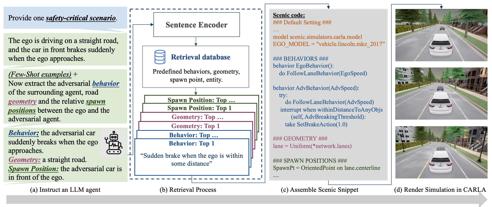
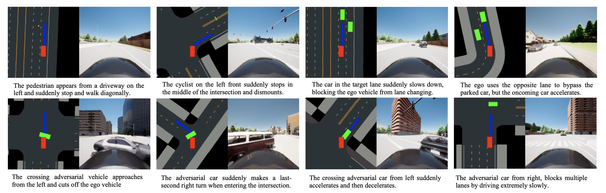
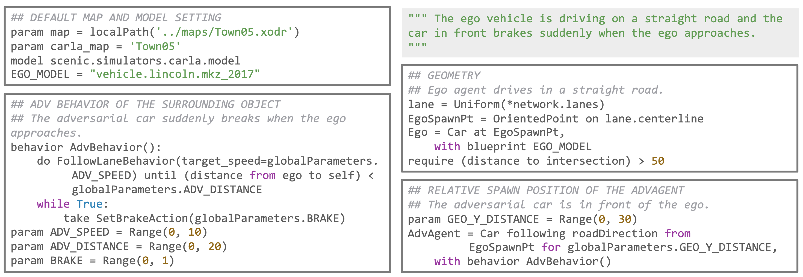
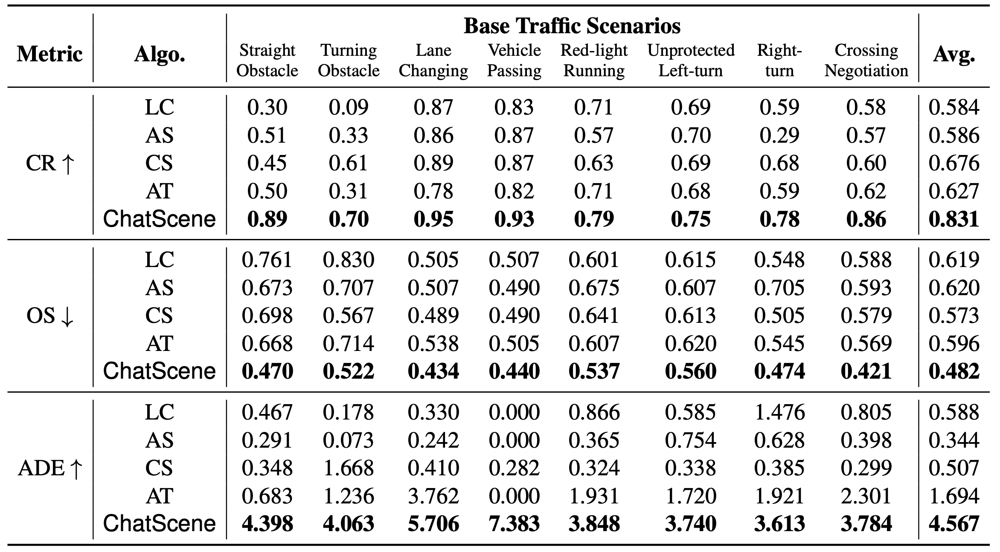
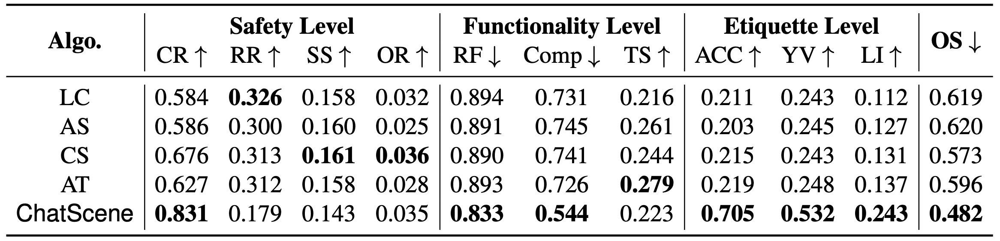
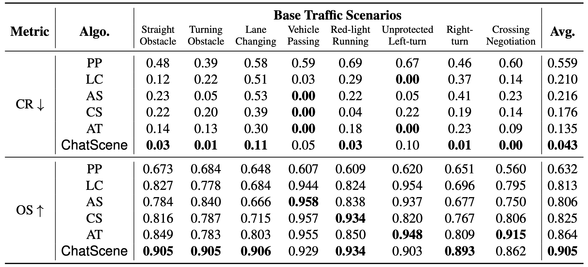

요약

우리는 LLM(대규모 언어 모델)의 기능을 활용하여 자율 주행 차량을 위한 안전 필수 시나리오를 생성하는 LLM 기반 에이전트인 ChatScene을 소개합니다. 이 에이전트는 비정형 언어 지침을 받아 먼저 LLM을 사용하여 텍스트로 설명된 교통 시나리오를 생성합니다. 이러한 시나리오 설명은 차량의 행동 및 위치와 같은 특정 세부 사항에 대한 여러 하위 설명으로 나뉩니다. 그런 다음 에이전트는 텍스트로 설명된 하위 시나리오를 도메인 특정 언어로 변환하여 시뮬레이터에서 예측 및 제어를 위한 실제 코드를 생성함으로써 CARLA 시뮬레이션 환경 내에서 다양하고 복잡한 시나리오를 생성하는 것을 용이하게 합니다. 우리 에이전트의 핵심 부분은 시나리오 설명 및 코드 쌍을 포함하는 지식 데이터베이스를 훈련하여 특정 텍스트 설명을 해당 도메인 특정 코드 스니펫으로 효율적으로 변환하는 포괄적인 지식 검색 구성 요소입니다. 광범위한 실험 결과는 자율 주행 차량의 안전을 개선하는 ChatScene의 효능을 강조합니다. 예를 들어, ChatScene에서 생성된 시나리오는 서로 다른 강화 학습 기반 자율 주행 차량을 대상으로 테스트했을 때 최신 기준선에 비해 충돌률이 15% 증가했습니다. 또한, ChatScene에서 생성된 안전 필수 시나리오를 사용하여 다양한 RL 기반 자율 주행 모델을 미세 조정함으로써 충돌률을 9% 줄여 현재 SOTA 방법을 능가할 수 있음을 보여줍니다. ChatScene은 교통 시나리오의 텍스트 설명과 실제 CARLA 시뮬레이션 간의 격차를 효과적으로 해소하여 자율 주행 차량의 안전 테스트 및 개선을 위한 안전 필수 시나리오를 편리하게 생성하는 통합된 방법을 제공합니다. 코드는 [https://github.com/javyduck/ChatScene](https://github.com/javyduck/ChatScene)에서 사용할 수 있습니다.

## 1 소개

그림 1: LLM 기반 지식 지원 안전 필수 시나리오 생성 에이전트 ChatScene 개요.

기계 학습(ML), 특히 심층 신경망(DNN)은 이미지 인식 [^1], 자연어 처리 [^2], 헬스케어 [^3]와 같은 수많은 응용 분야에서 놀라운 성능을 보였지만, 미묘하고 적대적인 교란에 놀라운 취약성을 보이기도 합니다. 이러한 교란은 잘못된 예측 [^4]을 유발하여 자율 주행(AD) [^5]과 같은 안전 필수 응용 분야에서 잠재적으로 치명적인 결과를 초래할 수 있습니다. 예를 들어, 실제 세계에서 _정지 표지판_에 겉으로는 무해해 보이는 스티커를 붙이면 자율 주행 차량(AV)은 이를 _속도 제한 80 표지판_으로 쉽게 오인할 수 있으며 [^6], 이는 위험한 운전 행동과 잠재적인 사고로 이어질 수 있습니다.

따라서 이러한 적대적 조작 가능성을 고려할 때, AV가 대규모 배포 전에 안전하고 신뢰할 수 있는 작동을 보장하기 위해 가능한 모든 안전 필수 시나리오에 걸쳐 철저한 테스트를 거치는 것이 중요합니다. 그러나 기존의 실제 테스트는 엄청나게 비쌀 뿐만 아니라 방대한 데이터 수집을 요구하며, 종종 충분한 안전 필수 시나리오를 축적하기 위해 차량을 수억 마일 주행해야 합니다. 결과적으로, 테스트를 위한 시뮬레이션 시나리오 생성은 비용 효율적이고 효율적인 대안으로 점점 더 많이 채택되고 있습니다.

예를 들어, Wachi 등 [^7]은 다중 에이전트 강화 학습을 사용하여 적대적 차량을 훈련시켜 CARLA 플랫폼 [^8] 내에서 규칙 기반 주행 알고리즘의 취약점을 드러내고자 합니다. Chen 등 [^9]은 앙상블 심층 강화 학습 기술을 사용하여 차선 변경 기동을 위한 적대적 시나리오 생성을 연구했으며, Feng 등 [^10]은 _Cut Following_ 및 _Cut-in_과 같은 추가 시나리오를 포함하는 고속도로 주행 시뮬레이션을 제공합니다. 그럼에도 불구하고 핵심 과제는 여전히 남아 있습니다. 이러한 방법들은 좁은 범위의 안전 필수 시나리오에만 국한되어 실제 상황의 복잡성을 완전히 포괄하지 못할 수 있습니다.

한편, 인터넷에서 방대한 양의 데이터로 훈련되고 수십억 개의 매개변수를 포함하는 LLM의 출현은 인간 지식을 포착하는 놀라운 능력을 보여주었습니다 [^11]. 이러한 모델은 지식 추출을 위한 효과적인 도구로 자리매김했습니다. 예를 들어, LLM은 교육 과정에서 핵심적인 역할을 하기 시작했으며 [^12], 의료 행위를 지원하기 위해 임상 지식을 종합하는 데 필수적인 역할을 하고 있습니다 [^13]. 법률 분야도 Chatlaw [^14]와 같은 도구가 법률 규정 및 사법 결정을 해석하면서 LLM의 혜택을 받고 있으며, 금융 부문에서는 BloombergGPT [^15]와 같은 모델이 복잡한 경제 데이터를 해독하는 데 활용되고 있습니다.

이는 자연스럽게 다음과 같은 몇 가지 중요한 질문으로 이어집니다. _더 넓고 복잡한 설명을 포착하는 안전 필수 시나리오를 자동으로 생성하는 LLM 기반 에이전트를 구축하는 것이 가능한가? 또한, AV 테스트에 사용할 수 있는 시나리오의 다양성과 포괄성을 강화하기 위해 에이전트가 이러한 텍스트 설명을 실제 시뮬레이션으로 자동으로 변환할 수 있는가?_

LLM 에이전트를 통해 안전 필수 운전 시나리오 설명을 생성하는 초기 질문을 다루는 것은 비교적 간단한 과정입니다. 모델에 *“안전 필수 운전 시나리오에 대한 몇 가지 설명을 제공해 주세요.”*와 같은 요청을 하면 됩니다. 두 번째 질문의 경우, Python과 유사한 구문을 사용하여 CARLA [^8] 내에서 장면을 스크립팅할 수 있는 도메인 특정 확률 프로그래밍 언어인 _Scenic_ [^16]의 최근 발전은 두 가지 유망한 연구 방향을 열었습니다. 첫째, LLM이 Scenic에서 자율적으로 스크립팅하도록 안내할 가능성, 둘째, 텍스트 시나리오 설명에서 파생된 Scenic 코드를 제작하기 위해 _CodeGen_ [^17]과 같은 언어-코드 모델을 미세 조정할 가능성입니다. 그럼에도 불구하고 이러한 방법은 주로 훈련에 사용할 수 있는 코드 예제의 부족으로 인해 실행 불가능한 코드가 생성되거나 Scenic에 존재하지 않는 API를 호출하는 등의 장애물에 자주 부딪힙니다.

대규모 언어 모델(LLM)의 직접적인 코드 생성 문제를 해결하기 위해, 우리는 대신 LLM을 활용하여 Scenic 코드 스니펫으로 구성된 검색 데이터베이스를 먼저 큐레이팅하는 간접적인 접근 방식을 채택합니다. 이러한 스니펫은 주변 차량의 적대적인 행동, 도로 기하학 등과 같은 운전 시나리오의 근본적인 요소를 캡슐화합니다. 구성 프로세스의 세부 사항은 [섹션 3.2](https://arxiv.org/html/2405.14062v1#S3.SS2)에서 소개됩니다. 그런 다음, [그림 1](https://arxiv.org/html/2405.14062v1#S1.F1)에 설명된 대로 평가 단계에서 우리 에이전트 ChatScene은 다음 네 단계 프로세스를 통해 설명을 해당 시뮬레이션에 매핑합니다.

1. 사용자의 지시가 주어지면 ChatScene은 LLM의 본질적인 광범위한 지식을 활용하여 안전 필수 시나리오에 대한 자연어 설명을 생성합니다.
    
2. ChatScene은 이 설명을 추가로 구문 분석하여 주변 차량의 적대적 행동과 같은 중요 시나리오 구성 요소와 일치하는 세부 특성을 추출합니다.
    
3. ChatScene은 이러한 특성을 임베딩으로 인코딩하여 미리 구성된 데이터베이스에서 해당 Scenic 코드 스니펫을 검색합니다.
    
4. 마지막으로, 검색된 스니펫은 완전하고 실행 가능한 Scenic 스크립트로 조립되어 CARLA 시뮬레이션 환경 내에서 설명된 시나리오를 실행할 수 있습니다.
    

추가적인 정량적 분석을 위해, 우리는 ChatScene을 활용하여 안전 필수 시나리오에 대한 다양한 텍스트 설명을 생성합니다. 그런 다음 이 설명들은 우리의 프레임워크에 의해 처리되어 시뮬레이션을 생성하며, 이 시뮬레이션은 Safebench 플랫폼 [^18]을 사용하여 평가됩니다. 이 플랫폼 내에서 자율 주행 차량은 강화 학습 하에서 훈련된 모델에 의해 제어되며, 우리의 시나리오 생성 에이전트는 주변의 적대적 객체(예: 보행자, 자전거 운전자 또는 차량)를 관리하는 것을 목표로 합니다. 프레임워크의 실제 적용을 보여주는 텍스트-시뮬레이션 매핑의 몇 가지 예는 [그림 2](https://arxiv.org/html/2405.14062v1#S1.F2)에 나와 있습니다.

그림 2: ChatScene 에이전트를 사용한 8가지 텍스트-시뮬레이션 사례. 설명을 명확하게 하기 위해 축약되었습니다.

우리의 기여는 다음과 같이 요약될 수 있습니다.

- 우리는 텍스트 설명을 먼저 제공한 다음 Scenic 프로그래밍 언어를 통해 CARLA에서 실행 가능한 시뮬레이션으로 신중하게 변환하여 안전 필수 시나리오를 생성할 수 있는 새로운 LLM 기반 에이전트인 ChatScene을 소개합니다.
    
- Scenic 코드 스니펫의 광범위한 검색 데이터베이스가 개발되었습니다. 이 데이터베이스는 LLM에 저장된 풍부한 지식을 활용하여 다양한 적대적 행동 및 교통 구성을 분류하며, 생성된 운전 시나리오의 다양성과 중요성을 크게 향상시킵니다.
    
- CARLA Challenge [^19]의 8가지 교통 시나리오에 대한 Safebench 평가에서, 우리 방법의 적대적 장면은 4가지 최신(SOTA) 기준선에 비해 충돌률을 15% 증가시켜 우리 프레임워크의 우수한 안전 필수 기능을 입증했습니다.
    
- 생성된 적대적 시나리오의 일부를 사용하여 자율 주행 차량을 미세 조정한 후, 우리가 생성한 나머지 시나리오 및 기존 기준선과 비교 평가를 수행한 결과, 평균 충돌률이 최소 9% 추가 감소하는 것으로 나타났습니다.
    
- 우리의 프레임워크는 검색 데이터베이스와 함께 직접적인 코드 생성을 용이하게 할 뿐만 아니라, 특히 자율 주행 애플리케이션을 위한 텍스트, 이미지, 비디오를 포함한 다중 모드 변환에 대한 향후 적응 가능성을 가지고 있습니다.
    

## 2 관련 연구

#### 안전 필수 시나리오 생성.

자율 주행 차량(AV)을 위한 안전 필수 시나리오 생성은 일반적으로 세 가지 주요 범주로 나뉩니다. 첫 번째는 _데이터 기반 생성_ [^20]으로, 차량 행동을 안내하기 위해 실제 데이터에 의존합니다. 이 접근 방식은 현실적이지만, 일반적으로 관련 데이터 수집의 희소성과 높은 비용, 그리고 수집된 데이터 세트 내에서 진정으로 위험한 시나리오가 드물다는 문제점을 겪습니다. 안전 필수 시나리오는 일반적으로 실제 시나리오 분포의 롱테일 분포에 속하기 때문입니다. 두 번째 범주는 _적대적 생성_ [^21]으로, 보행자나 다른 차량과 같은 주변 차량의 행동을 조작하여 AV에 대한 악의적인 공격을 의도적으로 수행합니다. 이 방법은 도전적인 환경을 만드는 데 효과적이지만, 계산적으로 비효율적일 수 있고 생성된 시나리오의 다양성이 부족할 수 있습니다. 세 번째 접근 방식인 _지식 기반 생성_ [^22]은 미리 정의된 교통 규칙이나 물리적 제약을 사용하여 시나리오를 생성합니다. 이 접근 방식은 더 체계적이고 더 다양한 시나리오를 제공할 수 있지만, 이러한 규칙을 시뮬레이션으로 인코딩하는 것이 복잡할 수 있으므로 구현하기 어려울 수 있습니다. 게다가 수동으로 생성된 규칙은 모든 안전 필수 상황을 커버하기 어려우므로, AV의 견고성을 테스트하는 데 중요한 적대적 공격이나 예상치 못한 행동을 일반적으로 통합하지 않기 때문에 덜 위험한 시나리오가 발생합니다.

우리 작업은 LLM에서 얻은 다양한 실제 지식 규칙을 통합하는 동시에 Scenic을 사용하여 주변 보행자 및 차량의 속도와 같은 주변 환경의 매개변수를 적대적으로 최적화하여 생성된 시나리오의 위험과 복잡성을 높임으로써 후자 두 범주의 장점을 시너지 효과를 냅니다.

#### 자율 주행을 위한 LLM.

LLM은 자율 주행 분야에서 인간의 이해와 유사한 방식으로 복잡한 시나리오를 해석하는 능력, 특히 그 잠재력에 대해 점점 더 많이 탐구되고 있습니다. 예를 들어, Fu 등 [^23]은 GPT-3.5를 추론 및 행동 프롬프트 스타일 [^24]로 활용하여 고속도로 환경에서 관찰에 대한 결정의 API 래핑된 텍스트 설명을 생성합니다. 반면에 Xu 등 [^25]은 다중 모드 언어 모델을 활용하여 운전 시나리오를 해석하고 운전 비디오 프레임 및 인간 질문을 기반으로 다음 제어 신호에 대한 예측과 함께 해당 설명을 제공할 것을 제안합니다. 또한 Zhong 등 [^26]은 LLM을 사용하여 안전 필수 시나리오에 대한 사용자 쿼리를 확산 모델의 해당 미분 가능한 손실 함수로 변환하여 쿼리 준수 궤적을 생성하는 것을 소개합니다.

우리 연구는 앞의 두 연구와 달리, LLM을 사용하여 특정 운전 상황에 대한 설명이나 행동을 제공하는 것보다 안전 필수 시나리오 생성에 주로 초점을 맞춘다는 점에서 차이가 있습니다. 게다가 마지막 연구와 달리, 우리 연구는 주로 CARLA와 같은 플랫폼에서 더 현실적인 안전 필수 시나리오 생성을 목표로 하고, 해당 운전 기록을 사용하여 강화 학습으로 제어되는 자율 주행 차량을 훈련하거나 테스트하는 것을 목표로 합니다.

그림 3: 주어진 안전 필수 시나리오 설명에 대한 Scenic 스니펫 예시.

## 3 방법론

이 섹션에서는 Scenic 프로그래밍 언어 및 목표 검색 메커니즘을 적용하여 안전 필수 시나리오를 생성하기 위한 LLM 에이전트인 ChatScene의 접근 방식을 설명합니다. 핵심 용어 정의를 포함한 간결한 동기 부여로 시작합니다. 그런 다음 검색 데이터베이스 구축에 중점을 두며, 이어서 사람 또는 LLM에서 얻은 안전 필수 시나리오의 텍스트 설명을 Scenic 코드로 변환하는 과정을 설명합니다. 특히, 원래 텍스트 설명을 각 구성 요소(예: 적대적 행동)에 대한 하위 설명으로 나누는 것으로 시작합니다. 다음으로, 이러한 구성 요소를 벡터로 인코딩하여 검색 데이터베이스에서 해당 스니펫을 검색하는 키 역할을 합니다. 이러한 스니펫은 포괄적인 Scenic 스크립트를 형성하기 위해 조립된 다음, CARLA 환경 내에서 시뮬레이션을 실행하기 위해 실행됩니다.

### 3.1 동기 부여 및 표기법

Scenic [^16] 프로그래밍 언어가 CARLA에서 시뮬레이션을 렌더링하는 데 매우 효과적이고 유연하다는 것을 알 수 있습니다. 관련 질문이 자연스럽게 발생합니다. _“ChatGPT와 같은 대규모 언어 모델에 안전 필수 시나리오 설명에 따라 해당 Scenic 코드를 직접 작성하도록 요청할 수 있는가?”_ 이 접근 방식은 유망해 보이지만, 컴파일 불가능한 코드를 생성하거나 코드베이스에 없는 API를 사용하는 등의 문제로 이어지는 경우가 많습니다. 이는 LLM 훈련을 위한 Scenic 예제의 부족과 코드 생성의 복잡성 및 폭넓음 때문일 수 있으며, 이는 모델에서 환각을 유발할 수 있습니다.

그러나 Scenic 코드를 검토한 결과, [그림 3](https://arxiv.org/html/2405.14062v1#S2.F3)에 표시된 것처럼 일반적으로 네 가지 구성 요소로 분할될 수 있음을 발견했습니다. (1) 기본 맵 및 모델 설정(일반적으로 고정됨), (2) 주변 차량의 적대적 행동 정의, (3) 자율 주행 차량의 스폰 지점에도 영향을 미치는 도로 지오메트리, (4) 주변 차량의 자율 주행 차량에 대한 상대적 스폰 위치입니다. 특히 자율 주행 차량은 강화 학습을 통해 훈련된 모델에 의해 제어되므로 여기서 행동을 정의할 필요가 없습니다.

이를 바탕으로, 우리는 더 효율적인 방법을 제안합니다. 마지막 세 구성 요소에 대한 코드 스니펫 데이터베이스를 해당 설명과 함께 수집하는 대신. 이 접근 방식은 환각을 줄이고 이러한 스니펫을 완전한 Scenic 코드로 유연하게 조립할 수 있게 해줍니다. 그런 다음, 평가 중에 *“자율 주행 차량이 직선 도로를 주행하고 있으며, 자율 주행 차량이 접근하자마자 앞 차량이 갑자기 브레이크를 밟습니다”*와 같은 입력 설명에 대해 LLM 에이전트는 데모를 통해 각 구성 요소에 대한 하위 설명으로 쉽게 분해할 수 있습니다. 예를 들어 행동 구성 요소에 대해 *“행동: 자율 주행 차량이 접근하자마자 적대적 차량이 갑자기 브레이크를 밟습니다”*와 같이 말이죠. 그런 다음, 우리 에이전트는 해당 검색을 수행하고 이러한 설명의 임베딩을 기반으로 관련 코드 스니펫을 조립하여 CARLA에서 시뮬레이션을 위한 포괄적인 Scenic 코드를 생성합니다. 우리 방법론에 대한 더 명확한 이해를 제공하기 위해, 우리는 다음과 같은 기본 개념을 정의합니다.

#### 경로 (Route).

'경로'는 본질적으로 차량이 궤적 중에 통과하도록 의도된 특정 위치를 표시하는 웨이포인트의 시퀀스입니다. CARLA 시뮬레이션 환경에서 이 경로는 시작점과 종착점을 모두 포함하는 자율 주행 차량의 미리 정해진 경로를 나타냅니다.

#### 기본 시나리오 (Base Scenario).

'기본 시나리오'는 높은 수준의 적대적 운전 상황을 개념화하는 데 사용됩니다. 이는 장애물의 식별 또는 적대적 행동에 대한 세부 사항을 다루지 않고 *“자율 주행 차량 앞에 있는 직선 장애물”*과 같은 추상적인 프레임워크를 제공합니다. 이 추상화는 다양한 운전 과제를 분류하는 일반화된 접근 방식을 허용합니다.

#### 시나리오 (Scenario).

대조적으로, '시나리오'는 장애물 및 특정 행동에 대한 자세한 속성을 추가하여 '기본 시나리오'를 기반으로 구축됩니다. 예를 들어, 이전 예시인 *“자율 주행 차량이 직선 도로를 주행하고 있으며, 자율 주행 차량이 접근하자마자 앞 차량이 갑자기 브레이크를 밟습니다”*는 위에서 설명한 기본 시나리오에서 파생된 시나리오로, 적대적 상황의 특정 역학을 도입하여 초기 설명을 풍부하게 합니다.

#### 장면 (Scene).

'장면'은 '시나리오'의 실질적인 인스턴스화를 나타내며, 적대적 이벤트의 세부 사항을 설명합니다. 여기에는 자율 주행 차량의 경로, 주변 적대적 차량의 특성(예: 차량 유형), 환경적 맥락(예: 건물 또는 교통 신호)이 포함됩니다. 또한, 관련된 에이전트의 위치, 속도, 초기 배치와 같은 매개변수를 지정합니다. 특히 Scenic은 [그림 3](https://arxiv.org/html/2405.14062v1#S2.F3)에 표시된 것처럼 확률적 프로그래밍 언어 역할을 합니다. 이는 CARLA에서 해당 시뮬레이션을 실행하기 전에 ADV_SPEED와 같은 매개변수를 샘플링합니다. 이 기능은 미리 정의된 범위 내에서 속도와 같은 매개변수 값을 변경하여 단일 Scenic 스크립트가 동일한 시나리오에 대해 다양한 장면을 생성할 수 있도록 합니다.

### 3.2 검색 데이터베이스 구축

이 섹션에서는 Scenic 코드 스니펫의 체계적인 수집 및 통합을 강조하면서 검색 데이터베이스를 구축하는 방법론을 자세히 설명합니다.

#### 스니펫 수집 (Collection of Snippets).

우리의 스니펫 수집 프로세스는 Scenic 저장소 1 1 1 [https://github.com/BerkeleyLearnVerify/Scenic/tree/main/examples/carla](https://github.com/BerkeleyLearnVerify/Scenic/tree/main/examples/carla)에서 초기 예제를 가져오는 것으로 시작됩니다. 이러한 예제들은 다양한 적대적 행동 및 기하학적 구성(예: 직선 도로, 교차로)을 포함하며, 수동으로 설명-스니펫 쌍으로 분해됩니다. 이 초기 결합된 데이터 세트를 활용하여, 우리는 LLM을 사용하여 몇 발 학습(few-shot learning)을 통해 더 다양한 스니펫을 생성합니다. 이 반복적인 프로세스는 적대적 행동, 기하학적 레이아웃, 상대적 스폰 지점을 포함한 다양한 구성 요소에 대한 스니펫을 생성하는 것을 포함합니다. 새로 생성된 각 스니펫은 Scenic의 다양한 API 컨텍스트(예: 보행자, 오토바이, 자동차와 같은 에이전트 유형 간의 차이) 내에서 호환성 및 컴파일 가능성을 엄격하게 평가하고 수동으로 수정됩니다. 이 작업에서 우리는 스니펫을 수집하기 위해 GPT-4 2 2 2 [https://chat.openai.com/?model=gpt-4](https://chat.openai.com/?model=gpt-4)를 일관되게 사용합니다. 이러한 새로운 스니펫을 생성하는 데 사용된 프롬프트의 몇 가지 예는 [섹션 A.1](https://arxiv.org/html/2405.14062v1#A1.SS1)에 제공됩니다.

#### 데이터베이스 구축 및 쿼리 최적화 (Database Construction and Query Optimization).

모든 설명-스니펫 쌍에 대해, 우리는 각 설명의 여러 가지 다른 재구성된 표현을 생성하도록 GPT-4에 계속 요청하고, 각 쌍에서 원본 스니펫을 유지합니다. 이 접근 방식은 검색의 정확성을 향상시키기 위해 고안되었습니다. 그런 다음 설명은 Sentence-T5 3 3 3 [https://huggingface.co/sentence-transformers/sentence-t5-large](https://huggingface.co/sentence-transformers/sentence-t5-large) [^27]를 사용하여 인코딩되며, 데이터베이스 구축 및 쿼리 프로세스는 faiss [^28]를 통해 용이해집니다. 우리는 적대적 행동, 도로 지오메트리, 상대적 스폰 위치와 같은 다양한 구성 요소에 대한 데이터베이스를 독립적으로 구축하고 관리합니다.

표 1: 선택된 시나리오에 대한 시나리오 생성 통계. 우리는 다양한 시나리오 생성 알고리즘의 효과를 측정하기 위해 충돌률(CR), 전체 점수(OS), 평균 변위 오차(ADE)를 보고합니다. 세 가지 다르게 훈련된 자율 주행 차량을 테스트했으며, 여기에 기록된 내용은 동일한 기본 시나리오에 대한 모든 장면을 포함한 이들 에이전트의 평균 성능을 나타냅니다. 마지막 열은 모든 기본 시나리오에 대한 평균을 보여주며, 굵은 숫자는 5가지 생성 알고리즘 중 최고의 성능을 나타냅니다. LC: Learning-to-collide, AS: AdvSim, CS: Carla Scenario Generator, AT: Adversarial Trajectory Optimization, uparrow / downarrow : 높을수록 좋음/낮을수록 좋음.

### 3.3 안전 필수 시나리오 생성

검색 데이터베이스가 완성되면, ChatScene LLM 에이전트는 이제 안전 필수 시나리오에 대한 다양한 설명을 먼저 생성한 다음, 평가 중에 Scenic 코드를 통해 해당 시뮬레이션으로 변환할 수 있습니다. 자세한 과정은 다음과 같습니다.

1. LLM 에이전트 지시: 우리는 LLM 에이전트에게 잠재적인 적대적 장면 설명을 생성하도록 지시하는 것으로 시작합니다. 그러한 쿼리의 예시는 다음과 같습니다. _“자율 주행 차량이 직선 도로를 주행하는 안전 필수 시나리오에 대한 설명을 제공해 주세요.”_
    
2. 각 구성 요소에 대한 설명 추출: 각 시나리오 구성 요소에 대한 구조화된 출력을 보장하기 위해, 우리의 LLM 에이전트는 [그림 1](https://arxiv.org/html/2405.14062v1#S1.F1) (a)에 설명된 대로 _“행동: … \n 기하학: … \n 스폰 위치: … ”_ 형식으로 구성된 하위 설명을 생성하도록 안내하는 몇 가지 예시를 자동으로 활용합니다. 결과적으로 에이전트는 정규 표현식을 사용하여 각 구성 요소에 대한 해당 설명을 효율적으로 추출할 수 있습니다. 추출을 위한 프롬프트는 [섹션 A.2](https://arxiv.org/html/2405.14062v1#A1.SS2)에 자세히 설명되어 있습니다.
    
3. Scenic 코드 스니펫 검색: 설명을 추출한 후, 우리 에이전트는 Sentence-T5 모델을 사용하여 설명을 인코딩합니다. 임베딩은 [그림 1](https://arxiv.org/html/2405.14062v1#S1.F1) (b) 및 (c)에 표시된 대로 각 구성 요소에 대한 관련 Scenic 코드 스니펫을 검색하는 키 역할을 합니다.
    
4. 시나리오 렌더링 및 평가: Scenic 코드 스니펫은 완전한 스크립트로 조립된 다음, [그림 1](https://arxiv.org/html/2405.14062v1#S1.F1) (d)에 시연된 대로 CARLA에서 시뮬레이션을 실행하기 위해 실행됩니다. 더 많은 텍스트 및 시뮬레이션 쌍은 [그림 2](https://arxiv.org/html/2405.14062v1#S1.F2)에 나와 있습니다. 그런 다음, ADV_SPEED는 [0, 10] 사이, ADV_DISTANCE는 [0, 20] 사이와 같은 다른 매개변수 값이 여러 장면을 수집하기 위해 샘플링됩니다. 각 프레임에서 모든 차량의 위치, 속도, 가속도 및 충돌 정보와 같은 포괄적인 세부 정보가 수집됩니다.
    
5. 충돌 취약 매개변수 미세 조정: 자율 주행 차량의 충돌로 이어지는 장면 생성을 강화하기 위해 샘플링 범위는 이전에 수집된 정보에 따라 동적으로 조정됩니다. 특히, 우리는 충돌 사례와 관련된 매개변수를 계속 기록하고 충돌로 이어지는 매개변수가 대략 가우스 분포 $\mathcal{N}(\mu,\sigma^{2})$에 맞춰진다고 가정합니다. 결과적으로 샘플링 범위는 후속 시뮬레이션을 위해 $[\mu-\sigma,\mu+\sigma]$로 조정될 것입니다. 이 반복 전략은 더 많은 충돌 취약 장면을 생성할 확률을 높이는 데 효과적임이 입증되었습니다. 결국 가장 적대적으로 중요한 장면은 각 시나리오에 대한 테스트를 위해 보관될 것입니다.
    

모든 관련 차량에 대한 시뮬레이션의 전체 세트와 포괄적인 통계가 공개됩니다. 이 데이터는 자율 주행을 위한 텍스트, 이미지 및 비디오 간의 양방향 변환에 대한 향후 연구를 지원할 것입니다.

## 4 실험

이 섹션에서는 안전 필수 시나리오를 생성하는 우리 에이전트의 기능을 정량적으로 평가합니다. 우리의 평가는 두 가지입니다. 첫째, 우리 에이전트가 생성한 장면의 실제 안전 필수적 특성, 특히 자율 주행 차량과 관련된 충돌을 유발할 수 있는 잠재력을 테스트합니다. 둘째, 우리 에이전트가 생성한 시나리오를 사용하여 적대적으로 재훈련된 자율 주행 차량의 성능을 평가하여 이러한 시나리오가 자율 주행 차량의 견고성 향상에 크게 기여하는지 확인합니다.

### 4.1 설정

이 연구에서는 자율 주행 시뮬레이션을 위해 강화 학습 기반 모델로 자율 주행 차량을 제어하고 Scenic을 사용하여 주변 적대적 차량을 안내합니다. 또한, 더 유연하고 편리한 구현을 위해 Scenic을 Safebench 플랫폼 [^18]에 통합하고 Safebench에서 모든 평가를 수행합니다.

#### AD 알고리즘.

Safebench는 우리 자율 주행 차량을 훈련시키기 위한 세 가지 주요 심층 RL 방법론을 제공합니다. 이들은 온-정책 확률 알고리즘인 PPO(Proximal Policy Optimization) [^29], 오프-정책 확률 기술인 SAC(Soft Actor-Critic) [^30], 그리고 결정론적 오프-정책 접근 방식인 TD3(Twin Delayed Deep Deterministic Policy Gradient) [^31]입니다. 자율 주행 차량의 관찰은 다음 웨이포인트까지의 거리, 종방향 속도, 각속도, 전방 차량에 대한 감지 신호의 네 가지 필수 차원을 포함합니다.

#### 기준선.

우리는 평가를 위해 두 가지 주요 시나리오 생성 기술 범주를 사용합니다. 즉, 적대자 기반 및 지식 기반입니다. Learning-to-collide(LC) [^32] 및 AdvSim(AS) [^33]과 같은 적대자 기반 접근 방식은 에이전트의 초기 포즈를 변경하거나 궤적을 교란하여 AD 시스템에 도전합니다. Carla Scenario Generator(CS) [^34] 및 Adversarial Trajectory Optimization(AT) [^35]과 같은 지식 기반 접근 방식은 실제 교통 규칙 및 물리적 원리를 준수하는 시나리오에 중점을 둡니다.

표 2: 진단 보고서: 이 보고서는 8가지 기본 시나리오에 걸쳐 세 가지 다른 자율 주행 차량을 사용하여 수행된 평균 테스트 결과를 보여줍니다. 이 테스트는 각 시나리오 생성 알고리즘에 대해 세 가지 다른 성능 수준으로 평가되며, 에이전트 효능에 대한 포괄적인 개요를 제공합니다. CR: 충돌률, RR: 적색 신호 위반 빈도, SS: 정지 표지판 위반 빈도, OR: 도로 이탈 평균 거리, RF: 경로 추종 안정성, Comp: 경로 완료 평균 비율, TS: 경로 완료 평균 시간, ACC: 평균 가속도, YV: 평균 요 속도, LI: 차선 침범 빈도, OS: 전체 점수, uparrow / downarrow : 높을수록 좋음/낮을수록 좋음.

#### 지표.

Safebench에서의 평가는 세 가지 범주를 포함합니다. 안전 수준(충돌률 및 교통 신호 준수 포함), 기능 수준(경로 준수 및 완료), 운전 매너 수준(운전 부드러움 및 차선 준수)입니다. 우리는 주로 _충돌률_과 모든 지표를 집계한 복합 *전체 점수(OS)*에 중점을 둡니다. 자세한 내용은 [섹션 C.1](https://arxiv.org/html/2405.14062v1#A3.SS1)에서 다룹니다. 또한 각 알고리즘에 의해 생성된 장면 다양성을 측정하기 위해 *평균 변위 오차(ADE)*를 활용합니다. 특히, 이는 동일한 시나리오에 대해 생성된 각 장면 쌍에 대한 궤적에 걸쳐 각 해당 시간 단계에서 적대적 객체 위치 간의 유클리드 거리 평균의 평균으로 계산됩니다.

### 4.2 안전 필수 시나리오 생성

이 섹션에서는 기준선과 비교하여 가장 적대적인 안전 필수 시나리오를 생성하는 우리 에이전트의 기능을 탐구합니다.

#### 실험 설정.

Safebench [^18]에 따라, 우리는 SAC를 사용하여 훈련된 대리 자율 주행 차량을 활용하여 다양한 방법으로 생성된 가장 어려운 장면을 선택합니다. 이어서 SAC, PPO, TD3를 통해 훈련된 세 가지 다른 자율 주행 차량을 사용하여 이 선택된 적대적 장면을 평가합니다. 이는 안전 필수 시나리오를 생성하기 위한 다양한 알고리즘의 효과와 일반성을 평가합니다.

#### 기본 시나리오 및 경로.

우리는 Carla Challenge [^19]에서 8가지 주요 기본 교통 시나리오를 채택하며, 그 텍스트는 NHTSA 보고서 [^36]에서 요약되었고, 각각 자율 주행 차량을 위한 10가지 다양한 경로를 가지고 있습니다. 이러한 기본 시나리오는 _직선 장애물_, _회전 장애물_, _차선 변경 차량_, _신호 위반 추월_, _비보호 좌회전_, _우회전_, _교차 협상_입니다.

#### 시나리오.

기존 기준선 방법들이 기본 시나리오당 단 하나의 시나리오만 제공하는 것과 달리, 우리의 접근 방식은 더 큰 다양성을 보여줍니다. 우리는 에이전트에게 각 기본 시나리오 아래에서 5가지 고유한 시나리오 설명을 생성하도록 지속적으로 지시하며, 이 설명들은 시뮬레이션을 위한 해당 Scenic 스크립트로 매핑됩니다. 이러한 시나리오에 대한 자세한 설명은 [부록 B](https://arxiv.org/html/2405.14062v1#A2)에서 찾을 수 있습니다.

#### 장면.

각 경로 및 시나리오에 대해, Safebench는 SAC 훈련된 대리 모델을 사용하여 각 경로에서 테스트를 기반으로 약 9~10개의 가장 적대적인 장면을 선택하며, 그 결과 각 기본 시나리오당 약 98~100개의 장면이 생성됩니다. 우리 접근 방식의 경우, 에이전트는 먼저 시나리오 및 경로당 50개의 시뮬레이션을 생성하고, 10단계마다 매개변수 범위를 업데이트합니다. 이 중에서 우리 에이전트는 동일한 대리 모델을 사용하여 충돌로 이어지는 시뮬레이션뿐만 아니라 가장 낮은 _전체 점수_를 산출하는 두 가지 시뮬레이션을 선택합니다. 결과적으로 이 방법은 기본 시나리오당 총 100개의 장면(2 × 10 × 5 = 100으로 계산됨)을 산출합니다. 우리는 각 기본 시나리오에 대해 세 가지 다른 AD 알고리즘으로 훈련된 자율 주행 차량에서 테스트한 모든 선택된 장면의 평균 성능을 보고합니다.

표 3: 미세 조정 후 자율 주행 차량 성능 평가: 우리는 충돌률(CR)과 전체 점수(OS)라는 두 가지 주요 지표를 기반으로 다양한 시나리오 생성 방법의 효과를 평가합니다. 이 평가를 위해, 첫 8개 경로에 대해 이전에 선택된 적대적 장면을 사용하여 대리 SAC 훈련된 자율 주행 차량을 미세 조정했습니다. 보고된 데이터는 모든 방법에서 제공된 마지막 2개 경로의 장면 전반에 걸친 평균 성능을 나타냅니다. ‘PP’는 ‘Pre Pretraining’의 약어로, 미세 조정 전 마지막 2개 경로의 장면에 대한 대리 자율 주행 차량의 해당 성능을 나타냅니다. 마지막 열은 모든 시나리오에 대한 평균을 제공합니다. uparrow / downarrow : 높을수록 좋음/낮을수록 좋음.

#### 평가 결과:

[표 1](https://arxiv.org/html/2405.14062v1#S3.T1)에 자세히 설명된 우리의 실험 결과는 다양한 시나리오 생성 알고리즘에 대한 철저한 평가를 제공합니다. 이들은 충돌률(CR), 전체 점수(OS), *평균 변위 오차(ADE)*를 기준으로 평가되며, 여러 기본 교통 시나리오에 걸쳐 세 가지 다른 자율 주행 차량 훈련 패러다임을 테스트하여 지표를 도출했습니다. 특히 우리 에이전트인 ChatScene은 각 기본 시나리오에 대해 모든 지표에서 기존 벤치마크를 지속적으로 능가합니다.

구체적으로, ChatScene은 가장 경쟁력 있는 기존 기준선에 비해 충돌률을 15% 증가시키는 등 안전 필수 시나리오 생성을 크게 향상시킵니다. 시나리오 복잡성의 이러한 상당한 개선은 자율 주행 시스템에 더 적대적인 환경에서 효과적으로 도전하고 평가합니다.

전반적인 성능 면에서 우리 에이전트는 선도적인 기준선에 비해 전체 점수에서 16% 더 많은 상당한 상대적 감소를 달성합니다. 이러한 감소는 우리 시나리오가 제시하는 복잡성과 도전 과제가 증가했음을 강조합니다. 또한, 전체 8가지 기본 시나리오에 대한 평균 성능에 대한 자세한 진단 보고서는 [표 2](https://arxiv.org/html/2405.14062v1#S4.T2)에 제공됩니다. 이 보고서는 충돌률 이상의 더 넓은 범위의 평가를 포함하여 세 가지 다른 수준에 걸쳐 전체 점수의 자세한 분석을 제공합니다. 특히, 우리가 생성한 시나리오는 평균 경로 완료율을 상당히 감소시키고, 주변 적대적 객체와의 충돌을 피하기 위해 자율 주행 차량이 더 높은 평균 가속도와 요 속도를 유지하도록 하며, 빈번한 차선 침범을 강요합니다. 이러한 역학은 우리 에이전트의 효과와 안전 필수적 특성을 추가로 입증하여 자율 주행 시스템을 엄격하게 테스트하는 시나리오를 만들 수 있는 잠재력을 확립합니다.

또한, ChatScene의 시나리오 다양성 우수성은 ADE 지표에서 최고 점수를 달성함으로써 확인되었습니다. 적대적 객체의 궤적 변화를 나타내는 이 결과는 자율 주행 시스템의 철저한 평가에 필수적인 우리 생성 접근 방식의 포괄적이고 다양한 특성을 강조합니다.

결론적으로, 우리의 결과는 ChatScene이 모든 기본 교통 시나리오에서 충돌률을 높일 뿐만 아니라 자율 주행 차량의 전반적인 성능 점수를 크게 낮춘다는 것을 보여줍니다. 향상된 시나리오 다양성은 우리 접근 방식의 효과를 더욱 강화합니다. 이 포괄적인 성능은 자율 주행 시스템 평가 및 테스트에서 새로운 기준을 설정할 수 있는 우리 에이전트의 잠재력을 강조합니다. 다양한 AD 알고리즘으로 훈련된 각 자율 주행 차량의 자세한 성능은 [섹션 C.2](https://arxiv.org/html/2405.14062v1#A3.SS2)에 제공됩니다.

### 4.3 안전 필수 시나리오에 대한 적대적 훈련

이러한 실험의 목적은 자율 주행 차량의 탄력성을 향상시키는 데 있어 다양한 알고리즘으로 생성된 안전 필수 시나리오의 효과를 평가하는 것이었습니다. 결과는 적대적 시나리오의 본질이 자율 주행 차량의 견고성에 중요하다는 우리의 가설을 입증합니다.

#### 실험 환경.

일관성을 유지하기 위해, 우리는 각 기본 시나리오 아래에서 동일한 대리 SAC 훈련된 자율 주행 차량에 대해 독립적으로 미세 조정을 수행합니다. 각 알고리즘이 생성한 첫 8개 경로의 장면을 사용하고, 모든 알고리즘에서 마지막 2개 경로의 선택된 장면을 사용하여 적대적으로 미세 조정된 자율 주행 차량을 테스트했습니다. 이로 인해 각 기본 시나리오에 대해 총 약 100개의 테스트 케이스가 생성되었습니다. 대리 모델은 0.0001의 학습률을 활용하여 500 에포크로 미세 조정됩니다. 우리는 50 에포크마다 수행된 평가를 기반으로 최적의 성능을 보고합니다. 미세 조정 설정 및 체크포인트 선택에 대한 자세한 내용은 [섹션 C.3](https://arxiv.org/html/2405.14062v1#A3.SS3)에서 찾을 수 있습니다.

#### 평가 결과.

[표 3](https://arxiv.org/html/2405.14062v1#S4.T3)는 후방 적대적 훈련의 성능 결과를 제시하며, 자율 주행 차량의 견고성을 강화하는 데 있어 우리 에이전트의 효능을 보여줍니다. 특히, 우리 방법으로 생성된 시나리오로 적대적으로 미세 조정되었을 때, 자율 주행 차량은 대부분의 기본 시나리오에서 대체 접근 방식으로 훈련된 에이전트의 성능을 지속적으로 능가했습니다. 미세 조정되지 않은 원래 자율 주행 차량에 비해 충돌률이 51% 감소했으며, 전체 점수는 43% 상대적으로 향상되었습니다. 더 중요하게는, SOTA에 비해 충돌률이 추가로 9% 감소했습니다. 이는 우리 에이전트가 자율 주행 시스템의 안전 및 신뢰성 향상에 효과적으로 기여할 수 있음을 나타냅니다. 자율 주행 차량을 더 도전적이고 다양한 시나리오에 노출시킴으로써, 우리는 견고한 자율 주행 차량 알고리즘의 발전에 직접적으로 기여하고 있습니다.

결론적으로, 실험 결과는 우리의 적대적 미세 조정 접근 방식의 실질적인 이점을 입증합니다. 충돌률의 상당한 감소와 함께 전반적인 성능의 현저한 향상은 적대적 교란에 대해 자율 에이전트를 강화하는 데 있어 우리 에이전트의 잠재력을 강조합니다. 이러한 결과는 더 안전하고 탄력적인 자율 주행 시스템을 구축하는 데 중요한 단계이며, 따라서 실제 배포 시나리오에서 더 큰 신뢰와 신뢰성을 조성합니다.

## 5 결론

이 연구에서는 LLM 기반 에이전트인 ChatScene을 소개합니다. ChatScene은 안전 필수 시나리오에 대한 설명을 자동으로 생성하고, 이러한 설명을 분해하여 적절한 Scenic 코드를 검색하며, 이어서 코드를 컴파일하여 CARLA 환경 내에서 시뮬레이션을 실행함으로써 안전 필수 시나리오 생성을 능숙하게 수행합니다. 우리 실험 결과, ChatScene이 생성한 시나리오는 다른 방법에 비해 동일한 시나리오에서 자율 주행 차량의 충돌률을 크게 높여 더 큰 도전 과제를 제시함을 보여줍니다. 더욱이, 이러한 생성된 시나리오는 안전 필수 상황에서 충돌을 피하기 위해 자율 주행 차량을 미세 조정하는 데 더 효과적임이 입증되어 자율 주행 차량의 견고성 향상에 있어 에이전트의 유용성을 입증합니다.

## 감사

이 연구는 국립 과학 재단(National Science Foundation) 보조금 No. 2046726, No. 2229876, DARPA GARD, 국립 항공 우주국(NASA) 보조금 No. 80NSSC20M0229, 및 Alfred P. Sloan Fellowship의 부분적인 지원을 받았습니다.

## 참고 문헌

[^1]:

Kaiming He, Xiangyu Zhang, Shaoqing Ren, and Jian Sun.Deep residual learning for image recognition.In Proceedings of the IEEE conference on computer vision and pattern recognition, pages 770–778, 2016.

[^2]:

Jacob Devlin, Ming-Wei Chang, Kenton Lee, and Kristina Toutanova.Bert: Pre-training of deep bidirectional transformers for language understanding.arXiv preprint arXiv:1810.04805, 2018.

[^3]:

Bradley J Erickson, Panagiotis Korfiatis, Zeynettin Akkus, and Timothy L Kline.Machine learning for medical imaging.Radiographics, 37(2):505, 2017.

[^4]:

Battista Biggio, Igino Corona, Davide Maiorca, Blaine Nelson, Nedim Šrndić, Pavel Laskov, Giorgio Giacinto, and Fabio Roli.Evasion attacks against machine learning at test time.In Joint European conference on machine learning and knowledge discovery in databases, pages 387–402. Springer, 2013.

[^5]:

Zelun Kong, Junfeng Guo, Ang Li, and Cong Liu.Physgan: Generating physical-world-resilient adversarial examples for autonomous driving.In Proceedings of the IEEE/CVF Conference on Computer Vision and Pattern Recognition, pages 14254–14263, 2020.

[^6]:

Kevin Eykholt, Ivan Evtimov, Earlence Fernandes, Bo Li, Amir Rahmati, Chaowei Xiao, Atul Prakash, Tadayoshi Kohno, and Dawn Song.Robust physical-world attacks on deep learning visual classification.In Proceedings of the IEEE Conference on Computer Vision and Pattern Recognition, pages 1625–1634, 2018.

[^7]:

Akifumi Wachi.Failure-scenario maker for rule-based agent using multi-agent adversarial reinforcement learning and its application to autonomous driving.In International Joint Conference on Artificial Intelligence. International Joint Conferences on Artificial Intelligence, 2019.

[^8]:

Alexey Dosovitskiy, German Ros, Felipe Codevilla, Antonio Lopez, and Vladlen Koltun.Carla: An open urban driving simulator.In Conference on robot learning, pages 1–16. PMLR, 2017.

[^9]:

Baiming Chen, Xiang Chen, Qiong Wu, and Liang Li.Adversarial evaluation of autonomous vehicles in lane-change scenarios.IEEE transactions on intelligent transportation systems, 23(8):10333–10342, 2021.

[^10]:

Shuo Feng, Xintao Yan, Haowei Sun, Yiheng Feng, and Henry X Liu.Intelligent driving intelligence test for autonomous vehicles with naturalistic and adversarial environment.Nature communications, 12(1):748, 2021.

[^11]:

Tom Brown, Benjamin Mann, Nick Ryder, Melanie Subbiah, Jared D Kaplan, Prafulla Dhariwal, Arvind Neelakantan, Pranav Shyam, Girish Sastry, Amanda Askell, et al.Language models are few-shot learners.Advances in neural information processing systems, 33:1877–1901, 2020.

[^12]:

Enkelejda Kasneci, Kathrin Seßler, Stefan Küchemann, Maria Bannert, Daryna Dementieva, Frank Fischer, Urs Gasser, Georg Groh, Stephan Günnemann, Eyke Hüllermeier, et al.Chatgpt for good? on opportunities and challenges of large language models for education.Learning and individual differences, 103:102274, 2023.

[^13]:

Karan Singhal, Shekoofeh Azizi, Tao Tu, S Sara Mahdavi, Jason Wei, Hyung Won Chung, Nathan Scales, Ajay Tanwani, Heather Cole-Lewis, Stephen Pfohl, et al.Large language models encode clinical knowledge.arXiv preprint arXiv:2212.13138, 2022.

[^14]:

Jiaxi Cui, Zongjian Li, Yang Yan, Bohua Chen, and Li Yuan.Chatlaw: Open-source legal large language model with integrated external knowledge bases.arXiv preprint arXiv:2306.16092, 2023.

[^15]:

Shijie Wu, Ozan Irsoy, Steven Lu, Vadim Dabravolski, Mark Dredze, Sebastian Gehrmann, Prabhanjan Kambadur, David Rosenberg, and Gideon Mann.Bloomberggpt: A large language model for finance.arXiv preprint arXiv:2303.17564, 2023.

[^16]:

Daniel J Fremont, Tommaso Dreossi, Shromona Ghosh, Xiangyu Yue, Alberto L Sangiovanni-Vincentelli, and Sanjit A Seshia.Scenic: a language for scenario specification and scene generation.In Proceedings of the 40th ACM SIGPLAN Conference on Programming Language Design and Implementation, pages 63–78, 2019.

[^17]:

Erik Nijkamp, Bo Pang, Hiroaki Hayashi, Lifu Tu, Huan Wang, Yingbo Zhou, Silvio Savarese, and Caiming Xiong.Codegen: An open large language model for code with multi-turn program synthesis.In The Eleventh International Conference on Learning Representations, 2022.

[^18]:

Chejian Xu, Wenhao Ding, Weijie Lyu, Zuxin Liu, Shuai Wang, Yihan He, Hanjiang Hu, Ding Zhao, and Bo Li.Safebench: A benchmarking platform for safety evaluation of autonomous vehicles.Advances in Neural Information Processing Systems, 35:25667–25682, 2022.

[^19]:

CARLA.Carla autonomous driving challenge, 2019.

[^20]:

Robin van der Made, Martijn Tideman, Ulrich Lages, Roman Katz, and Martin Spencer.Automated generation of virtual driving scenarios from test drive data.In 24th International Technical Conference on the Enhanced Safety of Vehicles (ESV) National Highway Traffic Safety Administration, number 15-0268, 2015.

[^21]:

Ritchie Lee, Mykel J Kochenderfer, Ole J Mengshoel, Guillaume P Brat, and Michael P Owen.Adaptive stress testing of airborne collision avoidance systems.In 2015 IEEE/AIAA 34th Digital Avionics Systems Conference (DASC), pages 6C2–1. IEEE, 2015.

[^22]:

Elias Rocklage, Heiko Kraft, Abdullah Karatas, and Jörg Seewig.Automated scenario generation for regression testing of autonomous vehicles.In 2017 ieee 20th international conference on intelligent transportation systems (itsc), pages 476–483. IEEE, 2017.

[^23]:

Daocheng Fu, Xin Li, Licheng Wen, Min Dou, Pinlong Cai, Botian Shi, and Yu Qiao.Drive like a human: Rethinking autonomous driving with large language models.arXiv preprint arXiv:2307.07162, 2023.

[^24]:

Shunyu Yao, Jeffrey Zhao, Dian Yu, Nan Du, Izhak Shafran, Karthik R Narasimhan, and Yuan Cao.React: Synergizing reasoning and acting in language models.In The Eleventh International Conference on Learning Representations, 2022.

[^25]:

Zhenhua Xu, Yujia Zhang, Enze Xie, Zhen Zhao, Yong Guo, Kenneth KY Wong, Zhenguo Li, and Hengshuang Zhao.Drivegpt4: Interpretable end-to-end autonomous driving via large language model.arXiv preprint arXiv:2310.01412, 2023.

[^26]:

Ziyuan Zhong, Davis Rempe, Yuxiao Chen, Boris Ivanovic, Yulong Cao, Danfei Xu, Marco Pavone, and Baishakhi Ray.Language-guided traffic simulation via scene-level diffusion.arXiv preprint arXiv:2306.06344, 2023.

}

Given the provided research paper, what are the different approaches for generating safety-critical scenarios for autonomous vehicles? Explain each approach, including its advantages and disadvantages. Do not provide any information outside of the provided text.

[^27]:

Jianmo Ni, Gustavo Hernandez Abrego, Noah Constant, Ji Ma, Keith Hall, Daniel Cer, and Yinfei Yang.Sentence-t5: Scalable sentence encoders from pre-trained text-to-text models.In Findings of the Association for Computational Linguistics: ACL 2022, pages 1864–1874, 2022.

[^28]:

Jeff Johnson, Matthijs Douze, and Hervé Jégou.Billion-scale similarity search with GPUs.IEEE Transactions on Big Data, 7(3):535–547, 2019.

[^29]:

John Schulman, Filip Wolski, Prafulla Dhariwal, Alec Radford, and Oleg Klimov.Proximal policy optimization algorithms.arXiv preprint arXiv:1707.06347, 2017.

[^30]:

Tuomas Haarnoja, Aurick Zhou, Pieter Abbeel, and Sergey Levine.Soft actor-critic: Off-policy maximum entropy deep reinforcement learning with a stochastic actor.In Proceedings of the 35th International Conference on Machine Learning, pages 1861–1870. PMLR, 2018.

[^31]:

Scott Fujimoto, Herke van Hoof, and David Meger.Addressing function approximation error in actor-critic methods.In Proceedings of the 35th International Conference on Machine Learning, pages 1587–1596. PMLR, 2018.

[^32]:

Wenhao Ding, Baiming Chen, Minjun Xu, and Ding Zhao.Learning to collide: An adaptive safety-critical scenarios generating method.In 2020 IEEE/RSJ International Conference on Intelligent Robots and Systems (IROS), pages 2243–2250. IEEE, 2020a.

[^33]:

Jingkang Wang, Ava Pun, James Tu, Sivabalan Manivasagam, Abbas Sadat, Sergio Casas, Mengye Ren, and Raquel Urtasun.Advsim: Generating safety-critical scenarios for self-driving vehicles.In Proceedings of the IEEE/CVF Conference on Computer Vision and Pattern Recognition, pages 9909–9918, 2021.

[^34]:

Scenario Runner Contributors.Carla Scenario Runner.https://github.com/carla-simulator/scenario_runner, 2019.

[^35]:

Qingzhao Zhang, Shengtuo Hu, Jiachen Sun, Qi Alfred Chen, and Z Morley Mao.On adversarial robustness of trajectory prediction for autonomous vehicles.arXiv preprint arXiv:2201.05057, 2022.

[^36]:

Wassim G Najm, John D Smith, Mikio Yanagisawa, et al.Pre-crash scenario typology for crash avoidance research.Technical report, United States. National Highway Traffic Safety Administration, 2007.