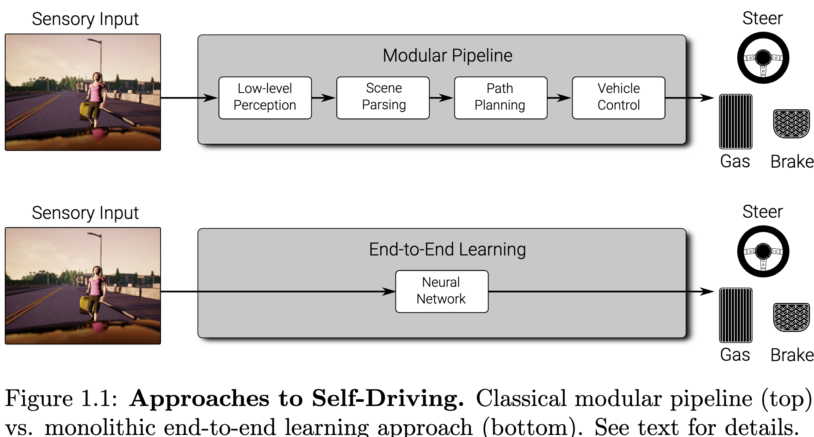
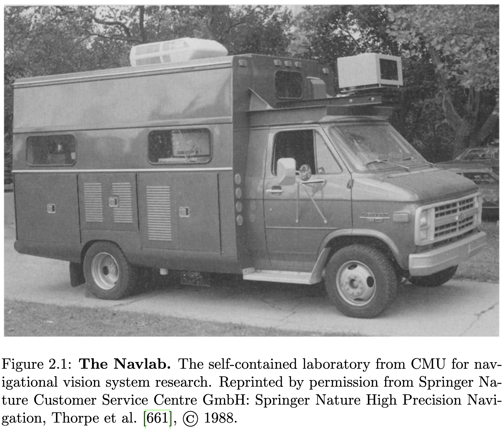
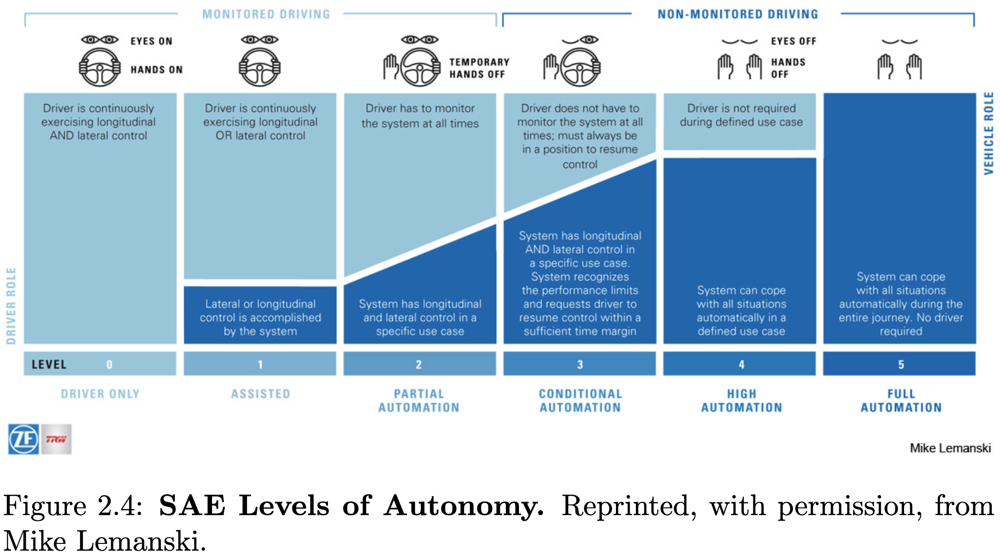
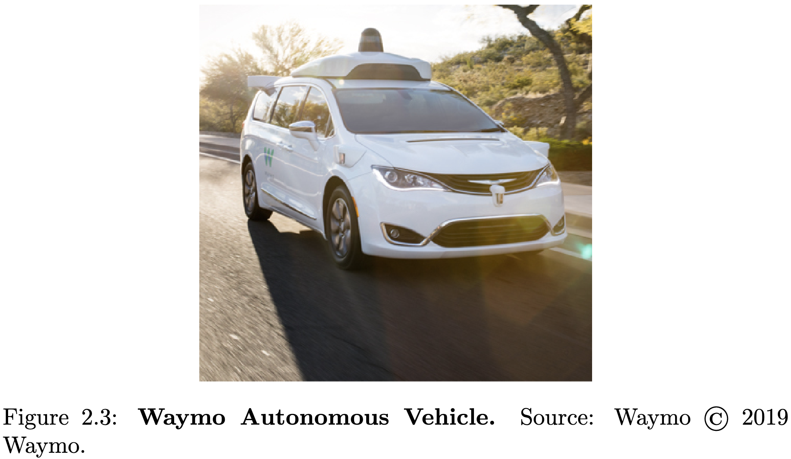

### Abstract 

Recent years have witnessed enormous progress in AI-related fields such as computer vision, machine learning, and autonomous vehicles. As with any rapidly growing field, it becomes increas- ingly difficult to stay up-to-date or enter the field as a begin- ner. While several survey papers on particular sub-problems have appeared, no comprehensive survey on problems, datasets, and methods in computer vision for autonomous vehicles has been published. This book attempts to narrow this gap by providing a survey on the state-of-the-art datasets and techniques. Our sur- vey includes both the historically most relevant literature as well as the current state of the art on several specific topics, includ- ing recognition, reconstruction, motion estimation, tracking, scene understanding, and end-to-end learning for autonomous driving. Towards this goal, we analyze the performance of the state of the art on several challenging benchmarking datasets, including KITTI, MOT, and Cityscapes. Besides, we discuss open prob- lems and current research challenges. To ease accessibility and accommodate missing references, we also provide a website that allows navigating topics as well as methods and provides addi- tional information.

최근 몇 년간 컴퓨터 비전, 머신러닝, 자율주행 등 인공지능 관련 분야에서 놀라운 발전이 있었습니다. 급격하게 성장하는 분야인 만큼, 최신 동향을 파악하거나 신규 입문자가 진입하는 것은 점점 더 어려워지고 있습니다. 특정 하위 문제에 대한 여러 조사 논문이 발표되었지만, 자율주행을 위한 컴퓨터 비전의 문제, 데이터셋, 방법론에 대한 포괄적인 조사 논문은 아직 발표되지 않았습니다. 본서는 이러한 격차를 해소하고자 최신 데이터셋 및 기술에 대한 조사를 제공합니다. 본 연구는 역사적으로 가장 관련성이 높은 문헌뿐만 아니라 여러 특정 주제의 최신 기술 동향을 포함합니다. 여기에는 인식, 재구성, 운동 추정, 추적, 장면 이해, 그리고 자율 주행을 위한 종단 간 학습 등이 포함됩니다. 이러한 목표를 달성하기 위해, KITTI, MOT, Cityscapes를 포함한 여러 도전적인 벤치마크 데이터셋에서 최신 기술의 성능을 분석합니다. 또한, 개방된 문제와 현재 연구 과제를 논의합니다. 접근성을 높이고 누락된 참고 자료를 보완하기 위해, 주제, 방법 및 추가 정보를 탐색할 수 있는 웹사이트를 제공합니다.

# Chapter 1 

## Introduction

Since the first successful demonstrations in the 1980s [168, 170, 661], great progress has been made in the field of autonomous vehicles. However, despite these advances and ambitious commercial goals, fully autonomous navigation in general environments has not been realized to date. The reason for this is two-fold: First, autonomous systems which operate in complex dynamic en- vironments require models which generalize to unpredictable situations and reason in a timely manner. Second, informed decisions require accurate per- ception, yet most of the existing computer vision models are still inferior to human perception and reasoning.

1980년대 초반의 성공적인 시연 이후, 자율 주행 기술 분야에서 괄목할 만한 발전이 있었습니다. 하지만 이러한 발전과 야심찬 상업적 목표에도 불구하고, 일반 환경에서의 완전 자율 주행은 아직까지 실현되지 못했습니다. 그 이유는 다음과 같습니다. 첫째, 복잡하고 역동적인 환경에서 작동하는 자율 시스템은 예측 불가능한 상황에 적응하고 신속하게 판단하는 모델을 필요로 합니다. 둘째, 정확한 의사 결정을 위해서는 정확한 인지 능력이 필수적이지만, 현재 대부분의 컴퓨터 비전 모델은 인간의 인지 능력과 판단 능력에 미치지 못하고 있습니다.

Existing approaches to self-driving can be roughly categorized into modu- lar pipelines and monolithic end-to-end learning approaches. Both approaches are contrasted at a conceptual level in Figure 1.1. The modular pipeline is the standard approach to autonomous driving, mostly followed in the industry. The key idea is to break down the complex mapping function from high- dimensional inputs to low-dimensional control variables into modules which can be independently developed, trained, and tested. In Figure 1.1 (top), these modules comprise low-level perception, scene parsing, path planning, and vehicle control. However, this is just one particular example of modular- izing a self-driving stack and other or more fine-grained modularizations are also possible. Existing approaches typically leverage machine learning (e.g., deep neural networks) to extract low-level features or to parse the scene into individual components. In contrast, path planning and vehicle control are dominated by classical state machines, search algorithms, and control mod- els.

기존의 자율 주행 방식은 모듈형 파이프라인과 엔드 투 엔드 학습 방식이라는 두 가지 주요 범주로 대략적으로 분류될 수 있습니다. 그림 1.1에서는 이러한 접근 방식들이 개념적으로 비교됩니다. 모듈형 파이프라인은 산업계에서 주로 채택되고 있는 표준적인 방식이며, 복잡한 맵핑 함수를 고차원 입력에서 저차원 제어 변수로 분해하는 핵심 아이디어를 기반으로 합니다. 그림 1.1(상단)에서 볼 수 있듯이, 이러한 모듈은 저수준 인식, 장면 파싱, 경로 계획, 차량 제어 등의 구성 요소로 이루어져 있습니다. 하지만 이는 자율 주행 스택을 모듈화하는 하나의 예시이며, 더욱 세분화된 모듈화 방식도 가능합니다. 기존 방식들은 일반적으로 딥 뉴럴 네트워크와 같은 머신러닝을 활용하여 저수준 특징을 추출하거나 장면을 개별 구성 요소로 파싱하는 데 중점을 둡니다. 반면, 경로 계획 및 차량 제어는 고전적인 상태 머신, 탐색 알고리즘, 제어 모델에 의해 주도됩니다.

The major advantage of modular pipelines is that they deploy human inter- pretable intermediate representations such as detected objects or free space information which allow gaining insights into failure modes of the system. Furthermore, the development of modular pipelines can be easily parallelized within companies where typically different teams work on different aspects of the driving problem simultaneously. Furthermore, it is comparably easy to integrate first principles and prior knowledge about the problem into the system. Examples include traffic laws that can be explicitly enforced in the planner or knowledge about the vehicle dynamics, which lead to improved vehicle control. Other aspects that are more difficult to specify by hand, such as the appearance of pedestrians, are learned from large annotated datasets.

모듈형 파이프라인의 가장 큰 장점은 검출된 객체나 자유 공간 정보와 같은 인간이 이해하기 쉬운 중간 표현을 활용하여 시스템의 오류 발생 원인을 파악할 수 있다는 점입니다. 또한, 모듈형 파이프라인 개발은 일반적으로 서로 다른 팀이 동시에 운전 문제의 다양한 측면에 대해 작업하는 기업 내에서 쉽게 병렬화될 수 있습니다. 게다가, 계획자 내에 교통 법규를 명시적으로 적용하거나 차량 동역학에 대한 기존 지식을 통합하는 것도 비교적 용이합니다. 예를 들어, 보행자의 외형과 같이 수동으로 명확하게 정의하기 어려운 요소들은 대규모의 주석 처리된 데이터 세트로부터 학습됩니다.

A major drawback of modular approaches is the fact that human-designed intermediate representations are not necessarily optimal for the driving task, which typically includes aspects like safety, comfort, and time for reaching the goal. Moreover, most modules are trained and validated independently from each other, making use of auxiliary loss functions. Consider the problem of object detection as an example. Most objects in the scene are not directly relevant for the driving task, yet the learning algorithm is not informed about the relevance of each object and therefore tasks a neural network to detect all objects with equal importance. Thus, the network is wasting capacity on irrelevant objects while not being able to detect the driving relevant objects with the necessary accuracy. This demonstrates the difficulty of defining appropriate intermediate representations and auxiliary loss functions.

모듈형 접근 방식의 주요 단점은 인간이 설계한 중간 표현이 운전 작업의 특성, 즉 안전, 편안함, 목표 달성에 필요한 시간 등을 고려했을 때 최적이라고 보장되지 않는다는 점입니다. 특히, 대부분의 모듈은 서로 독립적으로 훈련 및 검증되기 때문에 보조 손실 함수를 활용합니다. 예를 들어 객체 탐지 문제를 생각해 보겠습니다. 장면 내 대부분의 객체는 운전 작업에 직접적으로 관련이 없지만, 학습 알고리즘은 각 객체의 관련성에 대한 정보를 받지 못하여 신경망에 모든 객체를 동일한 중요도로 탐지하도록 지시합니다. 결과적으로, 신경망은 불필요한 객체에 용량을 낭비하는 동시에 운전과 관련된 객체를 충분한 정확도로 탐지하지 못하게 됩니다. 이는 적절한 중간 표현과 보조 손실 함수를 정의하는 데 어려움을 보여주는 사례입니다.

An alternative to modular pipelines is end-to-end learning-based mod- els which try to learn a policy, i.e., a function from observations to actions using a generic model such as a deep neural network. This approach is il- lustrated in Figure 1.1 (bottom) and discussed in detail in Chapter 15. The network parameters can be learned either via imitation learning by replicat- ing the behavior of a teacher or using reinforcement learning by exploring the world and taking actions that are likely to yield a high user-specified reward. However, reinforcement learning approaches suffer from the credit assignment and reward shaping problems, are typically slow and can only be applied in non-safety-critical simulation environments. Imitation learning, on the other hand, suffers from overfitting and does not easily generalize to novel scenar- ios. Furthermore, holistic neural network-based approaches are often hard to interpret as they present themselves as “black boxes” to the user which do not reveal why a certain error has occurred.

대안으로 모듈형 파이프라인 대신, 관찰로부터 행동을 학습하는 정책 기반의 모델을 사용할 수 있습니다. 이는 딥 뉴럴 네트워크와 같은 일반적인 모델을 사용하여 관찰을 행동으로 학습하는 것을 목표로 합니다. 이 접근 방식은 그림 1.1 (하단)에 나타내어 있으며, 15장에서는 상세히 논의됩니다. 네트워크 파라미터는 교사 모델의 행동을 모방하여 학습하거나, 세계를 탐색하고 사용자 지정 보상을 얻을 가능성이 높은 행동을 취함으로써 강화 학습을 통해 학습할 수 있습니다. 그러나 강화 학습 방식은 크레딧 할당 및 보상 형성 문제에 시달리며, 일반적으로 느리고 안전이 중요한 시뮬레이션 환경에서는 적용하기 어렵습니다. 반면, 모방 학습은 과적합 문제를 겪고 새로운 시나리오에 쉽게 일반화되지 않습니다. 게다가, 전체 신경망 기반 접근 방식은 사용자가 “블랙 박스”처럼 보이기 때문에 특정 오류가 발생한 이유를 설명하기 어렵다는 단점이 있습니다.

In this survey, we focus on perception for autonomous vehicles. In par- ticular, we discuss the perception-related modules of the modular pipeline as well as end-to-end learning-based approaches. Other aspects of the self- driving problem are discussed in related surveys: For example, Winner et al. [716] put emphasis on driver assistance systems, considering both their structure and their function. Similarly, Klette [356] provides an overview of vision-based driver assistance systems. They describe most aspects of the perception problem at a high level but do not provide an in-depth review of the state of the art in each task as we pursue in this survey. Complementary to our work, Zhu et al. [798] provide an overview of environment perception for intelligent vehicles, focusing on lane detection, traffic sign/light recogni- tion as well as vehicle tracking. In contrast, our goal is to bridge the gap between the robotics, intelligent vehicles, and computer vision communities by providing an extensive overview and comparison, including works from all three fields.

본 조사를 통해 자율 주행 차량의 인지 능력에 초점을 맞추었습니다. 특히, 모듈형 파이프라인의 인지 관련 모듈과 엔드 투 엔드 학습 기반 접근 방식에 대해 논의합니다. 또한, Winner et al. [716]은 운전자 보조 시스템의 구조와 기능을 고려하여 강조하고, Klette [356]은 비전 기반 운전자 보조 시스템에 대한 개괄적인 설명을 제공합니다. 이들은 인지 문제의 대부분을 고수준에서 설명하지만, 저희 조사와 달리 각 작업의 최신 기술 동향에 대한 심층적인 검토는 제공하지 않습니다. 저희 연구와는 대조적으로, Zhu et al. [798]은 지능형 차량을 위한 환경 인지 개관을 제공하며, 차선 탐지, 교통 표지판/신호 인식, 차량 추적 등에 중점을 두고 있습니다. 반면, 저희의 목표는 로봇 공학, 지능형 차량, 컴퓨터 비전 분야 간의 격차를 좁히기 위해, 이 세 분야의 모든 연구를 포함한 포괄적인 개요와 비교 분석을 제공하는 데 있습니다.

This survey is structured as follows: first, we provide a brief history of autonomous driving, followed by an introduction to camera models and cal- ibration techniques. We then provide an overview of autonomous driving- related datasets with a particular focus on perception before surveying the relevant perception tasks and the state-of-the-art algorithms for solving them. More specifically, we review object detection, tracking, semantic (instance) segmentation, reconstruction, motion estimation, and scene understanding techniques. Each chapter starts with the problem definition, an overview over the most important methods and main design choices, a qualitative and quantitative analysis of the top-performing techniques on the most popular datasets, as well as a discussion of the state of the art in this area. Finally, we provide an overview of state-of-the-art end-to-end models for autonomous driving before concluding this survey. To ease navigation, we also provide an interactive online tool1 which visualizes the surveyed papers with an inter- active graph and additional information in an easily accessible manner. We hope that our survey will become a useful tool for researchers in the field of autonomous vision and lowers the entry barrier for beginners by providing a thorough overview of the field.

본 설문은 다음과 같이 구성되어 있습니다. 먼저 자율 주행의 간략한 역사를 소개하고, 이어 카메라 모델과 보정 기술에 대한 소개를 제공합니다. 이후 자율 주행 관련 데이터셋에 대한 개괄적인 내용을 다루며, 특히 인지(perception)에 초점을 맞추어 관련 작업과 최신 알고리즘을 살펴봅니다. 구체적으로 객체 탐지, 추적, 의미론적(instance) 분할, 재구성, 운동 추정, 그리고 장면 이해 기술을 검토합니다. 각 장은 문제 정의, 가장 중요한 방법론 및 주요 설계 선택 사항에 대한 개요, 인기 있는 데이터셋에서 최고 성능을 보이는 기술에 대한 질적 및 정량적 분석, 그리고 이 분야의 최신 동향에 대한 논의로 시작합니다. 마지막으로, 본 설문 내용을 보다 쉽게 이해하실 수 있도록, 설문 내용에 대한 인터랙티브 온라인 도구1을 제공합니다. 이 도구는 설문 대상 논문들을 인터랙티브 그래프와 추가 정보를 포함하여 쉽게 시각화합니다. 본 설문이 자율 비전 분야 연구자분들께 유용한 도구로 활용되기를 바라며, 초보자분들의 진입 장벽을 낮추는 데 도움이 되기를 바랍니다.

# Chapter 2

## History of Autonomous Driving

Similar to the invention of the automobile by Carl Benz in 1886, self-driving technology promises to profoundly impact our mobility. In this chapter, we briefly review the history of driverless and self-driving vehicles from 1925 to 2019. 

1886년 칼 벤츠가 자동차를 발명한 것과 유사하게, 자율주행 기술은 우리의 이동성에 지대한 영향을 미칠 것으로 기대됩니다. 본 장에서는 1925년부터 2019년까지의 무인자동차 및 자율주행차의 역사에 대해 간략하게 살펴보겠습니다.

The first demonstration of a driverless vehicle was reported in 1925 when Houdina Radio Control demonstrated the “American Wonder”, a remote- controlled vehicle that traveled along Broadway in New York City trailed by an operator in another vehicle[665]. Several years later, General Motors ap- proached Norman Bel Geddes to sketch his vision about mobility 20 years into the future, culminating in Futurama, the most successful exhibition at the New York World Fair in 1939. Besides multi-lane highways, this vision sketched radio-controlled electric cars that navigated via electromagnetic cir- cuits installed in the roadway. This vision led to several prototypes such as the GM Firebird II [100] in 1956, and RCA Labs’ wire controlled car in 1960 as well as a demonstration of Citroen with its DS 19 and the Cabinentaxi1 of Demag/MBB in 1970. However, the idea of infrastructure-based autonomous navigation is largely restricted to specific use cases such as ground trans- portation at airports, park shuttles, or automated facilities due to its limited scalability and high cost.

1925년 Houdina Radio Control에서 브로드웨이에서 운영자를 태운 다른 차량을 따라 이동하는 원격 조종 차량 “American Wonder”를 선보인 최초의 시연이 보고되었습니다[665]. 몇 년 후, 제너럴 모터스(General Motors)는 노르만 벨 게데스(Norman Bel Geddes)에게 20년 후의 이동성에 대한 그의 비전을 스케치하도록 요청하여 1939년 뉴욕 월드페어(New York World Fair)에서 가장 성공적인 전시회인 푸티라마(Futurama)로 이어졌습니다. 다중 차선 고속도로 외에도, 이 비전은 도로에 설치된 자기장 회로를 통해 조종하는 무선 전동 자동차를 스케치했습니다. 이 비전은 1956년 GM Firebird II와 1960년 RCA Labs의 와이어 컨트롤드 카(wire controlled car)와 1970년 Demag/MBB의 Cabinentaxi1과 같은 여러 프로토타입으로 이어졌습니다. 그러나 제한된 확장성과 높은 비용으로 인해 항공 공항의 지상 운송, 공원 셔틀, 자동화 시설과 같은 특정 사용 사례에만 자율 항법 기반 인프라 아이디어가 제한되는 경우가 많습니다.

In 1986, the first self-driving car prototypes which did not rely on dedi- cated infrastructure hit the road. This pioneering effort was led by the Navlab team at CMU in the US as well as Ernst Dickmanns’s team at the Bundeswehr University Munich in Germany. Carnegie Mellon University’s Navlab team [661] (Figure 2.1) achieved another major milestone in 1995, by driving from Washington, D.C., to San Diego, CA, 98% autonomously with manual lon- gitudinal control in the ’No hands across America’ tour [535, 533]. With ALVINN [534], the Navlab team at CMU demonstrated an imitation learn- ing approach where a relatively small neural network was optimized in an end-to-end fashion to keep the vehicle on the road based on user demonstra- tions. On the contrary, Dickmanns presented a modular approach in which a vehicle and road model was used for continuously estimating the state and controlling the vehicle [169]. The project was conducted in the context of the European PROMETHEUS project, which involved more than 13 vehicle manufacturers and several research units from governments and universities of 19 European countries. In 1995, the PROMETHEUS team demonstrated the first autonomous long-distance drive from Munich, Germany, to Odense, Denmark, at velocities up to 175 km/h with about 95% autonomous driving [171, 210, 167].

1986년, 전용 인프라에 의존하지 않고 최초의 자율 주행차 프로토타입이 도로를 달리기 시작했습니다. 이 선구적인 노력은 미국 CMU의 Navlab 팀과 독일 Bundeswehr University Munich의 Ernst Dickmanns 팀이 주도했습니다. Carnegie Mellon University의 Navlab 팀은 1995년에 ‘No hands across America’ 투어를 통해 워싱턴 D.C.에서 샌디에이고, CA까지 98%의 자율성을 달성했습니다. ALVINN을 통해 CMU의 Navlab 팀은 사용자 시연을 기반으로 차량을 도로에 유지하도록 상대적으로 작은 신경망을 엔드 투 엔드 방식으로 최적화하는 학습 방법을 선보였습니다. 반면, Dickmanns는 차량 및 도로 모델을 사용하여 지속적으로 상태를 추정하고 차량을 제어하는 모듈형 접근 방식을 제시했습니다. 이 프로젝트는 19개 유럽 국가 정부 및 대학의 연구 단체와 함께 참여한 유럽 PROMETHEUS 프로젝트의 맥락에서 진행되었습니다. 1995년, PROMETHEUS 팀은 뮌헨, 독일에서 오덴스, 덴마크까지 최대 175km/h의 속도로 약 95%의 자율 주행을 통해 최초의 장거리 자율 주행을 선보였습니다.

Motivated by the success of the PROMETHEUS projects to drive au- tonomously on highways, Franke et al. [211] describe a real-time vision system for autonomous driving in complex urban traffic situations. While highway scenarios have been studied intensively, urban scenes have not been addressed before. Their system included depth-based obstacle detection and tracking from stereo as well as a framework for monocular detection and recognition of relevant objects such as traffic signs. Many approaches to the challenging task of autonomous driving developed during these projects are presented and dis- cussed in [48]. They concluded that sufficient computing power is becoming increasingly available, but difficulties like reflections, wet roads, direct sun- shine, tunnels, and shadows still make data interpretation challenging. Thus, they suggested the enhancement of sensor capabilities. They also pointed out that the legal aspects related to the responsibility and impact of automatic driving on human passengers need to be considered carefully. In summary, the automation will likely be restricted to special infrastructures and will be extended gradually.

프로메티우스 프로젝트의 성공에 힘입어 프랭크 등 [211]은 복잡한 도시 교통 환경에서 자율 주행을 위한 실시간 비전 시스템을 설명합니다. 고속도로 시나리오에 대한 연구가 활발하게 진행되었지만, 도시 환경에 대한 연구는 이전까지는 이루어지지 않았습니다. 이들의 시스템은 스테레오 기반의 깊이 정보를 이용한 장애물 탐지 및 추적, 그리고 교통 표지판과 같은 관련 객체의 단안 탐지 및 인식 프레임워크를 포함하고 있었습니다. 이러한 프로젝트를 통해 개발된 자율 주행의 어려운 과제에 대한 다양한 접근 방식은 [48]에서 제시되고 논의됩니다. 그들은 충분한 컴퓨팅 파워가 점점 더 많이 확보되고 있지만, 반사, 젖은 노면, 직사광선, 터널, 그림자 등과 같은 문제로 인해 데이터 해석이 여전히 어렵다고 결론지었습니다. 따라서 센서 기능 강화 방안을 제시했습니다. 또한 자동 주행이 탑승객에게 미치는 책임 및 영향과 관련된 법적 측면을 신중하게 고려해야 한다고 지적했습니다. 요약하면, 자동화는 특수 인프라에 제한될 가능성이 높으며 점진적으로 확장될 것입니다.

While full self-driving has remained unsolved to date, driver assistance sys- tems have reached commercial success, enriching driving comfort and safety. In 1995, Mitsubishi presented the first LiDAR-based distance control [137], and in 1999 Mercedes-Benz implemented the radar-assisted adaptive cruise control. In 2000, navigation systems and digital road maps became avail- able. Today, differential GPS in combination with inertial measurement units (IMU) allows for localization at an accuracy of 5cm in good conditions, en- abling the use of detailed lane-level road maps (HD maps) and providing redundancy for noisy vision-based localization.

현재 완전 자율 주행 기술은 아직 해결되지 않았지만, 운전자 보조 시스템은 고객 만족도를 높이고 안전성을 향상시켜 상업적으로 큰 성공을 거두었습니다. 1995년 미쓰비시는 최초의 LiDAR 기반 거리 제어 시스템을 선보였으며, 1999년 메르세데스-벤츠는 레이더 기반 어댑티브 크루즈 컨트롤을 구현했습니다. 2000년에는 내비게이션 시스템과 디지털 도로 지도가 보급되기 시작했습니다. 현재는 관성 측정 장치(IMU)와 함께 차등 GPS 기술을 통해 양호한 조건에서 5cm 수준의 정밀도로 위치를 파악할 수 있으며, 이는 상세한 차선 수준의 고해상도 도로 지도(HD 지도) 활용을 가능하게 하고, 노이즈가 있는 비전 기반 위치 파악의 중복성을 제공합니다.

In 2004, the Defense Advanced Research Projects Agency (DARPA) of the US Department of Defense started to organize and sponsor a series of 3 races to foster the development of self-driving technology [154]. The first race, the Darpa Grand Challenge 2004, was limited to US participants. DARPA offered a prize money of $1 million for the first team autonomously complet- ing a 240km long dirt route from California to Nevada through the Mojave desert, guided by GPS waypoints. However, none of the robot vehicles com- pleted the route. One year later, in 2005, DARPA announced a second edi- tion of its challenge with 5 vehicles successfully completing the route [89] and Stanford taking the lead, arriving 10 minutes before the CMU team which ranked second. In 2007, DARPA organized the last race of this series, the Darpa Urban Challenge [90], where also international participants were al- lowed (Figure 2.2). In contrast to the previous challenges, this competition required vehicles to drive a 96 km route through a mock-up town at George Air Force Base while obeying traffic laws, avoiding obstacles, negotiating with other vehicles, and merging into traffic. This time, the CMU team finished first, followed by the Stanford team, which ranked second. Notably, most of the successful teams relied heavily on the emerging multi-beam LiDAR tech- nology developed in a pioneering effort by Velodyne2. This spinning multi-beam LiDAR scanner allowed for obtaining precise depth measurements with a 360-degree field-of-view around the vehicle, which turned out crucial for navigating urban environments.

2004년, 미국 국방부의 DARPA(Defense Advanced Research Projects Agency)는 자율 주행 기술 발전을 장려하기 위해 3개의 레이스를 조직하고 후원하기 시작했습니다 [154]. 첫 번째 레이스인 2004년 DARPA Grand Challenge는 미국 참가자에게만 제한되었습니다. DARPA는 캘리포니아에서 네바다를 통해 모하비 사막을 거쳐 240km 길이의 오지 경로를 자율적으로 완료하는 첫 번째 팀에게 1백만 달러의 상금을 제공했습니다. 하지만 로봇 차량 중 어느 하나도 경로를 완료하지 못했습니다. 1년 뒤인 2005년, DARPA는 5대의 차량이 성공적으로 경로를 완료하면서 두 번째 에디션을 발표했으며, 스탠포드 대학이 10분 차로 2위를 기록했습니다. 2007년, DARPA는 마지막 레이스인 2004년 DARPA Urban Challenge를 개최했으며, 국제 참가자도 허용되었습니다 (Figure 2.2). 이전 챌린지와 달리, 이번 대회에서는 조지 에어 포스 베이스의 모형 도시를 통해 96km 길이의 경로를 운전하고 교통 법규를 준수하고, 장애물을 피하고, 다른 차량과 협상하며 교통 흐름에 합류해야 했습니다. 이번 대회에서 CMU 팀이 1위를 차지했으며, 스탠포드 팀이 2위를 기록했습니다. 특히, 성공적인 팀 대부분이 Velodyne에서 개발한 멀티빔 LiDAR 기술에 크게 의존했습니다. 이 회전형 멀티빔 LiDAR 스캐너는 차량 주변 360도 전방향 시야를 통해 정확한 깊이 측정을 가능하게 하여, 도시 환경에서 탐색하는 데 매우 중요하게 작용했습니다.

In 2009, Google took the lead and hired a range of star scientists who had participated in the Darpa Challenges (including Sebastian Thrun, Chris Urmson, and Mike Montemerlo). They started their own self-driving car program which included the development of a new driving platform and a custom, affordable multi-beam LiDAR scanner. According to accident reports [481], Google’s self-driving cars were involved in 14 collisions, while 13 were caused by others until 2016.

2009년, 구글이 주도권을 잡고 다르파 챌린지에 참여했던 스타 과학자들을 대거 영입했습니다. 세바스찬 썬, 크리스 어mson, 마이크 몬테메를로를 포함한 인물들이죠. 구글은 자체적으로 자율 주행차 프로그램을 시작했으며, 새로운 주행 플랫폼 개발과 함께 맞춤형, 경제적인 다중 레이더 이미징 스캐너를 개발했습니다. 사고 보고서 [481]에 따르면, 2016년까지 구글의 자율 주행차는 총 14건의 충돌에 연루되었으며, 그 중 13건은 다른 요인에 의해 발생했습니다.

In 2010, the VisLab team led by Alberto Broggi at the University of Parma in Italy conducted the VisLab Intercontinental Autonomous Challenge (VIAC)[79]. Based on the experience with various prototype vehicles [75, 67, 258], VIAC [47] was an effort to drive semi-autonomously from Parma in Italy to Shanghai in China. In this demonstration, a second vehicle automatically followed a route defined by a manually driven lead vehicle either visually or based on GPS waypoints sent by the lead vehicle. The onboard system allowed for detecting obstacles, lane marking, ditches, berms, and to identify the presence and position of the preceding vehicle.

2010년, 이탈리아 파르마 대학교 알베르토 브로기 교수님을 중심으로 VisLab 팀에서 VisLab Intercontinental Autonomous Challenge (VIAC)[79]를 진행했습니다. 다양한 프로토타입 차량[75, 67, 258] 경험을 바탕으로, VIAC[47]는 이탈리아 파르마에서 중국 상하이까지 반자율적으로 주행하는 것을 목표로 했습니다. 이 시연에서는, 선행 차량이 수동으로 주행하며 정의한 경로를 시각적으로 또는 선행 차량으로부터 GPS 좌표를 전송받아 자동으로 따라가는 두 번째 차량이 사용되었습니다. 해당 시스템은 장애물, 차선 표시, 도랑, 턱 등을 감지하고, 앞 차량의 존재와 위치를 식별할 수 있었습니다.

In the same year, Audi demonstrated a self-driven car ride to the summit of Pikes Peak at 4300 meters above sea level and the Technical University of Braunschweig showcased their Stadtpilot[70] which was able to navigate in a small geofenced innercity area based on LiDAR, cameras, and HD maps. In 2015, the VisLab team conducted the PROUD project [77], a demonstration of inner-city and freeway driving in Parma.

같은 해, 아우디는 해발 4300미터의 피크스피크 정상까지 자율 주행 차량 시승을 선보였으며, 브라운슈바이크 공과대학의  Städpilot[70] 또한 LiDAR, 카메라, HD 맵을 기반으로 소규모 지정 구역 내에서 항해하는 기능을 선보였습니다. 2015년, VisLab 팀은 파르마에서 도심 및 고속도로 주행을 시연하는 PROUD 프로젝트[77]를 진행했습니다.

In 2011, TNO organized the Grand Cooperative Driving Challenge [392], a competition focusing on autonomous cooperative driving behavior. It was held in Helmond, Netherlands in 2011 for the first time and in 2016 for the second edition. During the competition, the semi-autonomous vehicles had to negotiate convoys, join convoys, and lead convoys. While longitudinal control was autonomous, lateral control was provided by a human safety driver. The winner (team KIT in 2011 [240] and team Halmstad in 2016) was selected based on a system that assigned points to randomly mixed teams.

2011년 TNO는 자율 협력 주행 행동에 초점을 맞춘 대회인 Grand Cooperative Driving Challenge를 주최했습니다. 2011년 처음으로 헤لم홀츠, 네덜란드에서 개최되었으며, 2016년에 두 번째 에디션을 개최했습니다. 대회 기간 동안 반자율 차량들은 컨베이닝을 진행하고, 컨베이닝에 합류하며, 컨베이닝을 주도해야 했습니다. 전방 제어는 자율적으로 작동했지만, 측면 제어는 안전 운전사가 직접 수행했습니다. 우승팀(2011년 KIT 팀 [240] 및 2016년 Halmstad 팀)은 무작위로 섞인 팀들에게 점수를 할당하는 시스템을 기반으로 선정되었습니다.

In 2012, the KITTI Vision Benchmark3 [243, 242] was released. For the first time, researchers around the globe were able to evaluate their progress on various self-driving perception tasks (including reconstruction, motion es- timation, and object recognition) in a fair and objective manner. At the same time, deep learning started to revolutionize many fields, including computer vision and robotics, which laid the foundations for significant improvements in particular in terms of accuracy, robustness, and run-time of the perception components of self-driving vehicles.

2012년, KITTI Vision Benchmark3 [243, 242]가 발표되었습니다. 처음으로 전 세계 연구자들은 재구성, 운동 추정, 객체 인식 등 다양한 자율 주행 인지 작업의 진행 상황을 공정하고 객관적인 방식으로 평가할 수 있게 되었습니다. 동시에 딥러닝이 컴퓨터 비전 및 로봇 공학을 포함한 여러 분야를 혁신하기 시작하여, 특히 자율 주행 차량의 인지 구성 요소의 정확성, 견고성, 실행 시간 측면에서 상당한 개선의 기반을 마련했습니다.

In 2013, Mercedes Benz demonstrated the S500 Intelligent Drive, a 103 km autonomous ride on the historic Bertha Benz route from Mannheim to Pforzheim in Germany. The system was developed by Daimler research in collaboration with the Karlsruhe Institute of Technology (KIT) [810]. The Mercedes S500 vehicle was equipped with close-to-production sensor hard- ware. Object detection and free-space analysis were performed using radar and stereo vision. Monocular vision was used for traffic light detection and ob- ject classification. Two complementary vision algorithms, point-feature-based and lane-marking-based, allowed for centimeter-accurate localization relative to manually annotated HD maps. While focusing on a single route, the effort demonstrated that autonomous driving in complex inner-city environments based on close-to-production hardware and HD maps is feasible.

2013년 메르세데스-벤츠는 독일 마인하임에서 포르츠하임까지의 베르타 벤츠 역사 유적 경로에서 103km의 자율 주행 시연을 선보였습니다. 다임러 연구소에서 카를스루에 기술 대학(KIT)과의 협력을 통해 개발된 시스템입니다. 메르세데스-벤츠 S500 차량에는 실제 생산에 가까운 센서 하드웨어가 장착되었으며, 레이더와 스테레오 비전을 활용하여 객체 탐지 및 자유 공간 분석이 수행되었습니다. 단안 카메라를 이용한 교통 신호 감지 및 객체 분류 기능도 제공됩니다. 수동으로 제작된 HD 지도에 대해 센티미터 단위의 정확한 위치 정보를 제공하는 두 가지 보완적인 비전 알고리즘(점 기반 및 차선 기반)을 탑재하여 복잡한 도심 환경에서의 자율 주행 가능성을 입증했습니다.

The EU funded collaborative project V-Charge [219] conducted by Volk- swagen, Bosch, and several academic partners (ETHZ, Oxford, Parma, Braun- schweig) aimed for fully autonomous charging and parking of electric vehicles. In the context of this project, a fully operational system has been demon- strated which included vision-only localization, mapping, navigation and con- trol. The project supported many publications on different problems such as calibration [293, 292], stereo [271], reconstruction [269, 268, 267], SLAM [257] and free space detection [272].

유럽연합(EU)의 공동 연구 프로젝트 V-Charge [219]는 볼kswagen, Bosch, 그리고 여러 학술 파트너(ETHZ, Oxford, Parma, Braunschweig)의 협력을 통해, 완전 자율적인 전기차 충전 및 주차 시스템 개발을 목표로 진행되었습니다. 이 프로젝트의 맥락에서, 시각 정보만으로 작동하는 위치 인식, 지도 작성, 내비게이션, 그리고 제어 기능을 포함한 완전 작동 시스템이 시연되었습니다. 이 프로젝트는 또한 캘리브레이션 [293, 292], 스테레오 [271], 재구축 [269, 268, 267], SLAM [257], 그리고 자유 공간 탐지 [272] 등 다양한 문제에 대한 다수 논문을 지원했습니다.

In 2014, the society of automotive engineers released their classification of autonomous driving systems into 6 SAE levels of autonomy, ranging from level 0 (no autonomy) to level 5 (full autonomy), illustrated in Figure 2.4. In the same year, Mercedes released its S Class and Tesla its Autopilot [660] with level 2 autonomy (the driver has to monitor the system at all times), providing autonomous steering, lane keeping, acceleration, and braking on the highway. One year later, ride-hailing company Uber launched its own self-driving effort [673], hiring a large number of robotics researchers from CMU. From October 2016, all vehicles produced by Tesla are equipped with eight cameras, twelve ultrasonic sensors, and a forward-facing radar with the goal of enabling full self-driving in the future. However, both Uber and Tesla witnessed fatal accidents in which neither the driver was attentive, nor the self-driving system was functioning properly.

2014년, 자동차 엔지니어 협회는 0단계(자율 주행 없음)부터 5단계(완전 자율 주행)까지의 6단계 SAE 자율 주행 등급으로 자율 주행 시스템을 분류했습니다(그림 2.4 참조). 같은 해, 메르세데스는 S 클래스와 테슬라는 오토파일럿을 출시하며 2단계 자율 주행(운전자는 시스템을 항상 모니터링해야 함)을 제공하여 고속도로에서 자동 조향, 차선 유지, 가속, 제동 기능을 제공했습니다. 1년 후, 차량 호출 서비스 회사 우버는 CMU에서 많은 로봇 공학 연구원을 고용하여 자체 자율 주행 노력을 시작했습니다. 2016년 10월부터 테슬라에서 생산되는 모든 차량에는 미래의 완전 자율 주행을 가능하게 하기 위해 8개의 카메라, 12개의 초음파 센서, 그리고 전방향 레이더가 장착되었습니다. 그러나 우버와 테슬라는 운전자의 주의 부족 또는 자율 주행 시스템의 오작동으로 인해 치명적인 사고가 발생하기도 했습니다.

In 2016, after completing over 1,5 million miles, Google’s self-driving efforts became Waymo, a stand-alone subsidiary of Alphabet Inc. Today, Waymo offers 400 citizens of Phoenix access to its early rider program [706] which features full self-driving in several geo-fenced districts of Phoenix (Fig- ure 2.3) with a safety driver on the back seat.

2016년, 150만 마일을 넘게 주행한 후 구글의 자율주행 노력은 Alphabet Inc.의 자회사인 Waymo로 탄생했습니다. 현재 Waymo는 400명의 피닉스 시민들에게 안전 운전 기능을 갖춘 Waymo의 초기 라이더 프로그램을 제공하고 있습니다. 이 프로그램은 피닉스의 특정 구역(Fig- ure 2.3)에서 안전 운전 기사가 뒷좌석에 탑승한 상태로 운영되고 있습니다.

In the same year, NVIDIA [60] demonstrated a 98% autonomous ride from Holmdel to Atlantic Highlands in Monmouth County NJ using a single convolutional neural network. The network was trained via imitation learning to predict vehicle control directly from input images. In 2018, several last-mile delivery projects were launched, including Nuro [467], a project founded by two former Google self-driving car engineers and Scout [605], a fully-electric delivery system designed to safely get packages to Amazon customers using autonomous delivery devices. In 2019, Bosch and Daimler announced a fleet of autonomous cars, providing customers a shuttle service with automated vehicles on selected routes in California [151].

같은 해, NVIDIA는 뉴저지 주 몬태크 카운티 홀델에서 애틀랜틱 하인트라스까지 98%의 자율 주행을 시연했습니다. 단일 컨볼루션 신경망을 사용하여 차량 제어 예측을 직접 입력 이미지로부터 학습시켰습니다. 2018년에는 Nuro[467] (구글 자율 주행차 기술을 개발한 전직 엔지니어 2명이 설립한 프로젝트)와 Scout[605] (아마존 고객에게 자율 배송 장치를 사용하여 안전하게 패키지를 배송하도록 설계된 완전 전기 배송 시스템)를 포함한 마일리지 배송 프로젝트가 여러 건이 시작되었습니다. 2019년에는 보쉬(Bosch)와 다임러(Daimler)가 캘리포니아의 특정 노선에서 자동화된 차량을 이용한 셔틀 서비스를 제공한다고 발표했습니다.
