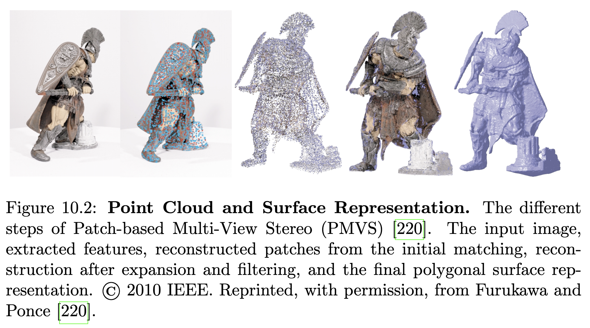

# 10장 다중 뷰 3D 재구성

## 10.1 문제 정의

다중 뷰 3D 재구성의 목표는 적절한 사전 가정을 사용하여 이미지 형성 과정을 역변환함으로써 2D 이미지 집합에서 3D 기하학을 추론하는 것입니다. 두 뷰 스테레오와 달리 다중 뷰 재구성 알고리즘은 많은 시점에서 형상을 추론하여 객체의 완전한 3D 형상을 복구합니다.

본 조사에서는 주로 도시 지역의 재구성에 관한 자율 주행 관점에서의 다중 뷰 재구성에 초점을 맞춥니다. 도시 재구성 알고리즘의 목표는 조명 조건, 가려짐, 외관 변화, 고해상도 입력 및 대규모 출력과 같은 내재된 문제를 해결하여 도시 지역의 완전 자동, 고품질, 밀집 재구성을 생성하는 것입니다. 자율 주행의 맥락에서 3D 재구성은 섹션 13.3에서 논의된 정적 장애물 감지(교통 신호등, 도로 표지판 등) 및 회피 또는 정밀 위치 파악에 사용될 수 있습니다.

Musialski et al. [490]은 건물 및 의미론, 정면 및 이미지, 마지막으로 도시 블록 및 도시를 고려하는 출력 기반 순서에 따라 도시 재구성 접근 방식에 대한 조사를 제공합니다. 그들은 지상, 항공 및 위성 이미지뿐만 아니라 LiDAR(Light Detection and Ranging) 스캔을 도시 재구성을 위한 가장 일반적으로 사용되는 센서 모달리티로 나열합니다. 지상 수준 이미지는 취득, 저장 및 교환이 용이하여 가장 널리 사용됩니다. 그러나 오늘날 점점 더 많은 항공 및 위성 이미지도 사용할 수 있습니다. 항공 또는 다중 뷰 이미지와 달리 위성 이미지는 저비용으로 전 세계를 커버하지만 해상도가 낮습니다. LiDAR는 고정밀로 반밀집 3D 포인트 클라우드를 제공하며, 지상 수준 및 항공 모두에서 가능하지만 센서가 비싸고 데이터가 희소합니다. 일부 접근 방식 [217, 58]은 상호 보완적인 강점을 활용하기 위해 이러한 데이터 유형을 결합하기도 합니다. 여러 방법 [693, 264]은 지구 표면을 캡처하는 디지털 표면 모델(DSM)과 같은 추가 정보를 활용하여 도전적인 실외 조건을 처리합니다. DSM은 각 표면 점에 대한 높이를 제공하는 도시 장면의 2.5D 표현입니다.

## 10.2 Structure from Motion

SfM(Structure from Motion)은 3D 구조와 함께 카메라 매개변수(내부 및 외부)를 공동으로 추정해야 하는 반면, MVS(Multi-View Stereo)는 카메라 매개변수가 알려져 있다고 가정합니다. 또한, MVS 접근 방식은 관심 객체 또는 장면의 밀집 3D 모델을 생성하는 반면, SfM 접근 방식은 일반적으로 장면의 희소 3D 포인트 클라우드를 복구합니다. 카메라 매개변수와 장면의 3D 기하학을 해결하는 것은 다른 시점 간의 일치를 측정하는 사진 일관성 함수를 기반으로 대응 문제를 해결하는 것과 동일합니다. 일반적으로 3D 재구성 파이프라인은 카메라 매개변수를 복구하면서 거친 3D 재구성을 추정하기 위한 SfM 방법과 더 미세한 재구성을 얻기 위한 MVS 방법으로 구성됩니다. 이는 COLMAP [599, 600]을 사용하여 그림 10.1에 나와 있습니다.

고전적인 SfM 파이프라인 [631, 630, 136, 482, 2, 729, 218, 650]은 먼저 희소 특징을 추출하고 매칭합니다. 일반적으로 RANSAC을 사용하여 카메라 쌍 간의 초기 변환(필수 행렬)이 추정됩니다. 초기 카메라 변환이 주어지면, 기하학적 검증 단계는 재투영된 희소 특징 간의 사진 일관성을 평가하고 이상치를 제외합니다. 초기 두 뷰 재구성에서 시작하여 최상의 뷰 선택, 삼각 측량 및 번들 조정에 기반한 증분 재구성이 수행됩니다. 이러한 증분 접근 방식 때문에 SfM 파이프라인은 일반적으로 매우 효율적이지 않으며 오프라인으로 적용해야 합니다. 섹션 13.4.3에서 논의된 동시 위치 추정 및 매핑(SLAM) 방법도 공동 카메라 추정(자체 움직임) 및 3D 장면 재구성 문제를 다룹니다. 그러나 SLAM 기술은 주로 정확한 자체 움직임 추정 및 실시간 성능에 중점을 두며, 일반적으로 이러한 목표를 위해 기하학적 정확도를 희생합니다.

웹은 관광객이 찍은 도시의 많은 공개 이미지를 제공하며, 이는 인기 있는 건물 또는 심지어 전체 도시를 재구성하는 데 사용될 수 있습니다. 이 작업은 많은 양의 이미지와 이미지를 촬영한 카메라의 알 수 없는 기하학적 특성 때문에 이전에 언급된 접근 방식과는 다른 접근 방식을 필요로 합니다. Agarwal et al. [2]은 Flickr의 로마 이미지를 고려하여 이 문제를 다룹니다. 그들은 효율적인 이미지 검색 접근 방식과 결합된 SIFT 특징 매칭을 사용하여 비교 횟수를 줄입니다. 그 후, 최소한의 이미지 하위 집합에 대한 빠른 번들 조정 방법은 장면의 기하학을 포착합니다. 마지막으로, 그들은 전체 파이프라인을 병렬로 최적화하여 500개의 컴퓨팅 노드를 사용하여 하루 만에 15만 개 이미지에서 도시를 재구성할 수 있도록 합니다. Frahm et al. [208, 209]은 그래픽 하드웨어의 높은 병렬 처리 기능을 활용하여 단일 컴퓨터에서 수백만 개의 이미지로부터 도시 규모 재구성을 위한 고효율 시스템을 제시합니다. 최근 Sch¨onberger와 Frahm [599]은 이전 방법 [631, 630, 2, 208, 209, 729, 218]에 비해 더 나은 완전성과 정확도를 가지면서 드리프트를 더 잘 줄이는 SfM 파이프라인을 제안했습니다. 그들은 또한 더 견고한 최상의 뷰 선택 및 삼각 측량 방법을 제안하여 더 완전한 구조를 생성합니다. 마지막으로, 새로운 반복 번들 조정, 재삼각 측량 및 이상치 필터링 단계는 훨씬 더 완전하고 정확한 3D 모델로 이어집니다.

## 10.3 다중 뷰 스테레오

다중 뷰 스테레오 접근 방식은 장면 표현에 따라 깊이 맵 기반, 포인트 클라우드 기반, 메시 기반 및 볼륨 기반 방법으로 분류할 수 있습니다. 먼저 장면 표현(깊이 맵, 포인트 클라우드, 볼륨) 및 재구성의 최종 표현(메시 또는 표면)을 기준으로 고전적인 접근 방식을 소개하고 논의합니다.

깊이 맵: 깊이 맵 표현은 각 입력 뷰에 대한 하나의 2.5D 깊이 맵을 사용하여 3D 장면을 요약합니다. 이 깊이 맵은 나중에 3D 융합 기술 [773, 142, 562]을 사용하여 단일 일관된 3D 재구성으로 융합될 수 있습니다. 도시 장면에서 깊이 맵을 복구하는 데 특히 효과적인 전략은 평면 스위핑 스테레오 알고리즘 [132]입니다. 이 알고리즘은 평행한 가상 평면 집합을 장면을 통해 "스위핑"하고, 이 평면들에 의해 유도된 호모그래피를 통해 이미지를 서로 투영하고, 사진 일관성을 평가합니다. 매우 큰 장면에서 주요 과제 중 하나는 많은 양의 데이터를 효율적으로 처리하는 것입니다. Pollefeys [532]는 최신 GPU의 병렬 처리 기능을 활용하여 깊이 맵 표현을 기반으로 하는 대규모 실시간 MVS 시스템을 제안합니다.

포인트 클라우드: 재구성 문제는 3D 포인트 클라우드 표현 [220, 599]으로도 다룰 수 있습니다. PMVS(Patch-based Multi-View Stereo) [220]는 특징 매칭 단계로 시작하여 희소한 패치 집합을 생성한 다음, 그리디 확장 단계와 필터링 단계를 반복하여 패치를 밀집하게 만들고 잘못된 매칭을 제거합니다. PMVS의 단계는 그림 10.2에 시각화되어 있습니다.

볼륨 표현: 볼륨 접근 방식은 기하학을 규칙적으로 샘플링된 3D 격자, 즉 볼륨으로 표현하며, 이는 이산 점유 함수 [380] 또는 가장 가까운 표면까지의 거리를 인코딩하는 함수(레벨 세트) [202]로 표현됩니다. 최근 접근 방식은 규칙적인 복셀 위치에 정의된 확률 맵을 사용하여 점유 확률을 인코딩합니다 [52, 531, 677]. 필요한 메모리 양은 볼륨 접근 방식의 주요 제한 사항입니다. 이 문제를 다루기 위한 다양한 제안이 존재합니다. 예를 들어, 복셀 해싱 [498], Delaunay 삼각 측량 형태의 데이터 적응형 공간 이산화 [382], 또는 옥트리 사용 [268, 563] 등이 있습니다.

메시 또는 표면: 3D 재구성 알고리즘의 최종 표현은 일반적으로 삼각형 메시 기반 표면입니다 (그림 10.2의 오른쪽 이미지). 볼륨 표면 추출 기술은 여러 2.5D 측정값 (MVS 깊이 맵 또는 레이저 스캔)을 단일하고 일관된 3D 메시 모델로 융합할 수 있습니다. Curless와 Levoy [142]의 선구적인 작업은 부호 있는 거리 함수를 사용하여 표면 증거를 복셀 그리드에 축적하는 알고리즘을 제안합니다. 표면은 집계된 부호 있는 거리 함수의 0 교차점으로 암시적으로 표현되며, Marching Cube 알고리즘 [434]을 사용하여 각 복셀을 내부 또는 외부로 레이블링하여 추출할 수 있습니다. 다른 접근 방식은 이미지 [133, 159, 158]에서 직접 시작하여 데이터 및 정규화 항으로 구성된 에너지 함수를 사용하여 메시 모델을 개선합니다.

### 10.3.1 평면성 및 기본 요소

인공 환경은 일반적으로 규칙적인 구조로 구성됩니다. 따라서 적절한 사전 지식의 도입은 더 정확하고 밀집된 재구성을 가능하게 합니다. Micusik과 Kosecka [468]는 이미지 분할 단서뿐만 아니라 지배적인 장면 방향과 조각별 평면 구조의 존재를 활용하는 방법을 제시합니다. 특히, 그들은 MRF 공식에서 맨해튼 세계 가정을 활용하는 슈퍼픽셀 기반 밀집 스테레오 재구성 방법을 채택합니다. 조각별 평면 구조와 반복적인 형상을 활용하는 또 다른 방법은 평면, 구, 원통, 원뿔 및 토러스와 같은 기본 요소를 감지하는 것입니다 [387, 389, 388]. 기본 요소 기반 접근 방식은 압축적이고 메모리 효율적인 표현으로 이어집니다. 그러나 그들의 표현은 종종 단순하고 미세한 세부 사항과 불규칙한 형상을 모델링하는 데 실패합니다. 따라서 Lafarge et al. [388]은 압축적이고 상세한 하이브리드 접근 방식을 제안합니다. 초기 메시 기반 재구성에서 시작하여 기둥과 벽과 같은 규칙적인 구조에는 기본 요소를 사용하고, 불규칙한 요소는 건축 세부 사항을 보존하기 위해 삼각형 메시를 사용하여 설명합니다(그림 10.3).

### 10.3.2 형상 사전

3D 형상 획득 센서의 발전과 객체 감지 알고리즘의 성능 향상은 다중 뷰 스테레오 접근 방식에서 3D 형상 사전 사용을 촉진했습니다. 차원 축소는 형상 지식을 표현하는 효과적이고 인기 있는 방법입니다. 초기 접근 방식 [670]은 주성분 분석(PCA)과 같은 선형 차원 축소를 사용하여 저차원 잠재 형상 공간에서 형상 분산을 캡처합니다. Dame et al. [153]과 같은 최근 접근 방식은 단안 SLAM 접근 방식에서 형상 사전의 중요성을 조사하며, 가우시안 프로세스 잠재 변수 모델(GP-LVM)과 같은 비선형 차원 축소 기술을 사용합니다. 깊이 추정과 병행하여 초기 분할 및 깊이 단서와 일치하도록 객체의 자세, 형상 및 스케일을 개선합니다. 그들의 실험은 투명 및 반사 표면, 심지어 관찰되지 않은 장면 부분에서도 개선을 보여줍니다.

평균 형상 외에도 Bao et al. [34]은 여러 인스턴스에 걸쳐 객체 형상을 나타내기 위한 앵커 포인트 집합을 학습할 것을 제안합니다. 그들은 먼저 2D 객체 감지기를 사용하여 SfM에서 얻은 포인트 클라우드에 평균 형상을 초기 정렬합니다. 마지막으로, 실제 형상을 근사화하기 위해 평균 형상을 워핑하고 개선합니다. 그들의 평가는 이 모델이 인스턴스에 걸쳐 큰 형상 변화를 처리함으로써 다른 객체 범주에 대한 의미론적 사전 지식을 학습할 수 있을 만큼 충분히 일반적이라는 것을 보여줍니다.

잠재 공간 표현을 사용하는 대안은 무료 3D 모델 저장소에서 제공되는 3D CAD 모델을 직접 활용하는 것입니다. G¨uney와 Geiger [262]는 도시 장면에서 불일치 맵과 3D 자동차 모델의 기하학, 자세 및 유형을 공동으로 추론하는 모델을 제안합니다. Ulusoy et al. [676]은 이 접근 방식을 볼륨 다중 뷰 사례로 확장합니다. 앞서 언급된 접근 방식 [153, 34]이 입력 데이터에 매개변수 형상 모델을 맞추는 반면, Haene et al. [268, 267]은 객체에 대한 노멀의 지역 분포를 모델링합니다. 그들은 또한 공간적으로 변화하는 이방성 평활 항의 형태로 객체 클래스별 형상 사전 지식을 제안합니다.

Zhou et al. [796]은 어안 카메라 시퀀스에서 거리 장면의 3D 재구성을 위한 볼륨 형상 모델을 공동으로 학습할 것을 제안합니다. 실외 장면에서 유사한 3D 형상의 반복되는 객체에 동기를 부여받아 그들은 먼저 3D 객체 감지기를 사용하여 건물과 차량을 지역화한 다음, 형상 볼륨 모델을 학습하면서 공동으로 재구성합니다. 이를 통해 유사한 형상의 객체가 해당 범주의 모든 관찰로부터 이점을 얻기 때문에 누락된 표면을 완성하면서 노이즈를 줄일 수 있습니다. 각 객체에 대한 의미론적 사전 지식을 명시적으로 모델링하는 대신 Wei et al. [713]은 SIFT 흐름 알고리즘을 사용하여 훈련 데이터베이스의 의미론적으로 일치하는 패치에서 형상 정보를 전송하는 데이터 기반 정규화를 제안합니다.

### 10.3.3 시맨틱스

스테레오와 유사하게 시맨틱 정보는 다중 뷰 스테레오 접근 방식이 불완전하고 모호한 이미지 정보(예: 반사, 질감 부족, 반복 구조 또는 강한 조명 변화)의 경우 사진 일관성의 잠재적 실패로부터 복구할 수 있도록 합니다. 시맨틱 레이블은 특정 위치에서 예상되는 표면 방향에 대한 기하학적 단서를 제공하고 Kundu et al. [376]의 공동 재구성 및 시맨틱 분할 접근 방식에 의해 그림 10.4에 나타난 바와 같이 내재된 모호성을 해결하는 데 도움이 됩니다.

볼륨 장면 재구성은 일반적으로 볼륨을 점유 및 자유 공간 영역으로 분할합니다. Haene et al. [268]은 이 접근 방식을 다중 레이블 볼륨 분할로 확장하여 객체 클래스 또는 자유 공간 레이블을 복셀에 할당하는 수학적 프레임워크를 제시합니다. 그들은 먼저 훈련 데이터에서 외관 가능성과 표면 방향에 대한 클래스별 기하학적 사전 지식을 학습합니다. 그 후, 이러한 데이터 기반 사전 지식은 볼륨 분할을 위한 연속 공식에서 단항 및 쌍별 잠재력을 정의하는 데 사용됩니다.

Haene et al. [268]은 밀집 깊이 측정을 요구하는데, 이는 질감 없는 영역과 낮은 시차로 인해 얻기 어려울 수 있습니다. 따라서 Kundu et al. [376]은 희소 3D 포인트 클라우드에서 작동하는 또 다른 접근 방식을 제안합니다. 그들은 3D에서 고차 조건부 랜덤 필드를 사용하여 문제를 모델링하며, 이는 3D 객체 지지대와 같은 현실적인 장면 제약 및 사전 지식을 부과할 수 있도록 합니다. 또한, 그들은 명시적으로 자유 공간을 모델링하는데, 이는 특히 약하게 지지되는 표면을 따라 모호성을 줄이는 데 도움이 되는 단서를 제공합니다. CamVid 및 Leuven 데이터셋에 대한 그들의 평가는 전통적인 SfM 및 최첨단 MVS 파이프라인과 비교하여 향상된 3D 구조뿐만 아니라 비디오 분할 방법에 비해 더 나은 분할 품질을 보여줍니다.

시맨틱 재구성에 대한 이전 연구 [268, 376]는 큰 메모리 사용량과 계산 비용으로 인해 작은 장면과 낮은 해상도로 제한됩니다. 더 큰 장면으로 확장하기 위해 Blaha et al. [55]은 자유 공간, 지면 아래 부분 또는 건물 내부와 같은 큰 영역에는 고해상도가 필요하지 않다고 지적합니다. 그들은 Haene et al. [268]의 확장을 제안하고 거친-미세 최적화를 가진 적응형 옥트리 데이터 구조를 사용하여 지상 및 항공 이미지에서 3D 도시 모델을 생성합니다. 거친 복셀 그리드에서 시작하여 그들은 예측된 표면 근처에서 솔루션이 점진적으로 개선되는 문제 시퀀스를 해결합니다. 적응형 개선은 메모리를 절약하고 훨씬 빠르게 실행되며, 기하학적 재구성 및 의미론적 레이블링 측면에서 가장 높은 목표 해상도에서 고정된 복셀 이산화만큼 정확합니다. 공간적 확장 외에도 다른 의미론적 레이블의 수는 증가하는 메모리 요구 사항으로 인해 확장성에 문제가 됩니다. Cherabier et al. [118]은 장면을 관련 레이블 집합만 활성화되는 블록으로 나누는 것을 제안합니다. 따라서 특정 블록에서 의미론적 클래스의 부재를 조기에 결정할 수 있습니다. 이에 따라 그들은 최적화 시작부터 레이블을 비활성화하여 더 효율적인 처리를 가능하게 합니다.

### 10.3.4 효율적인 재구성

비디오 스트림에서 상세한 3D 정보를 추출하는 것은 다중 뷰 스테레오 알고리즘에 높은 계산 비용을 초래합니다. Cornelis et al. [136]은 건물 정면을 위한 룰드 서페이스(ruled surfaces)와 같은 단순화된 기하학적 가정을 기반으로 고속 프레임으로 스테레오 쌍에서 압축되고 메모리 효율적인 3D 도시 모델을 생성하는 데 중점을 둡니다. 자동차와 같은 객체는 이러한 가정을 위반하므로 자동차 감지 및 위치 파악을 재구성에 통합합니다. 이와 대조적으로 Geiger et al. [246]은 정확한 조각별 평면 3D 재구성을 실시간으로 생성하기 위한 효율적인 스테레오 매칭 알고리즘을 제안합니다.

### 10.3.5 다중 뷰 스테레오를 위한 딥 러닝

다중 뷰 스테레오 문제를 해결하기 위해 여러 학습 기반 접근 방식이 제안되었습니다. 초기 연구에서는 주로 더 나은 대응 관계를 설정하기 위해 더 견고한 특징 표현을 얻는 데 학습이 사용되었습니다 [270, 775, 439]. 이러한 접근 방식에서 얻은 쌍별 유사성은 일반적으로 여러 이미지에서 특징을 매칭하기 위해 평균화됩니다. 이와 대조적으로 Hartmann et al. [279]는 여러 이미지를 입력으로 사용하여 매칭 함수를 직접 학습할 것을 제안합니다.

최근, 학습된 고수준 정보와 고전적 제약을 결합한 다중 뷰 재구성의 엔드투엔드 학습을 위한 여러 파이프라인 [339, 327, 510, 311]이 제시되었습니다. Kar et al. [339]와 Ji et al. [327]은 시야 광선을 따라 특징을 3D 특징 격자에 투영하여 매칭할 것을 제안합니다. 그 후, 두 접근 방식 모두 3D 컨볼루션 네트워크를 사용하여 3D 특징 격자를 평활화합니다. 이와 대조적으로 Huang et al. [311]은 평면 스위프 접근 방식과 특징 추출을 위한 엔드투엔드 훈련된 CNN을 결합하여 불일치를 학습할 것을 제안합니다. 참조 뷰를 고려하여 그들은 가상 깊이에 따라 워핑된 인접 뷰로 구성된 평면 스위프 볼륨을 생성합니다. 그 후, 패치 쌍(참조 뷰 및 평면 스위프 볼륨의 패치)에 대한 네트워크를 사용하여 특징을 추출합니다. 스킵 연결이 있는 인코더-디코더 네트워크는 더 큰 영역에 걸쳐 특징을 결합하는 데 사용되며, 결국 최대 풀링 레이어로 불일치 맵이 추정됩니다. 이전 접근 방식이 카메라 변환에 따라 특징을 투영하여 물리적 제약을 활용하는 반면, 그들은 가려짐 관계를 모델링하지 않습니다. Paschalidou et al. [510]은 학습 기반 특징 추출을 Markov Random Field와 결합합니다. 이 필드는 이미지 형성 과정과 가려짐을 모델링하기 위해 고차 광선-포텐셜 [677]을 사용합니다.

3D 특징 그리드 [339, 327], 복셀 그리드 [510] 또는 평면 스위프 볼륨 [311]을 사용한 추론은 계산 비용이 많이 듭니다. Yao et al. [760]이 제시한 더 효율적인 MVS 재구성 접근 방식은 그림 10.5에 나와 있습니다. Huang et al. [311]과 유사하게 그들은 MVS 재구성 문제를 각 뷰에 대한 깊이 예측 문제로 분리합니다. 미분 가능한 호모그래피 워핑 연산은 카메라 기하학을 인코딩하고 3D 비용 볼륨을 구축할 수 있도록 합니다. 3D 컨볼루션 네트워크는 3D 비용 볼륨에서 깊이를 예측하며, 최종 재구성은 깊이 가려짐과 시점 간의 차이를 최소화하는 깊이 맵 융합 접근 방식 [466]으로 얻어집니다.

### 10.3.6 전방향 카메라

섹션 3.1.1에서 논의된 전방향 카메라는 전통적인 원근 카메라에 비해 더 넓은 시야를 제공하지만, 3D 재구성 중에는 그들의 특수한 기하학적 특성을 다루어야 합니다. 중앙 카타디옵트릭 시스템의 에피폴라 기하학은 Svoboda와 Pajdla [649]에 의해 탐구되었는데, 그들은 대응점이 에피폴라 원뿔에 놓여 있음을 보여주었으며 이 설정에 대한 정류 절차를 제안했습니다. 이와 대조적으로 Bunschoten et al. [91]와 Gonz´alez-Barbosa와 Lacroix [255]는 전방향 이미지를 파노라마 뷰로 투영하고 표준 스테레오 매칭 방법을 사용하여 대응점을 찾을 것을 제안합니다. Bunschoten et al. [91]은 사인 곡선 모양의 에피폴라 곡선에서 검색하는 반면, Gonz´alez-Barbosa와 Lacroix [255]는 파노라마 뷰를 정류하여 직선 에피폴라 라인을 얻습니다. Sch¨onbein과 Geiger [597]는 평면 기반 사전 지식을 사용하여 통일된 전방향 공간에서 시간적으로 인접한 두 전방향 뷰와 공간적으로 인접한 두 전방향 뷰에서 얻은 불일치 추정치의 공동 최적화를 통해 3D 재구성 방법을 제안합니다.

## 10.4 데이터셋

다중 뷰 스테레오 알고리즘을 평가하기 위해 여러 데이터셋이 제안되었습니다. 인기 있는 데이터셋으로는 Middlebury [592]와 DTU MVS [325]가 있습니다. 그러나 이 데이터셋들은 도시 재구성을 위한 예시가 거의 없거나 전혀 없습니다. EPFL Multi-View [638], Restrepo et al. [556], ETH3D [602], Tanks and Temples [358]는 도시 장면을 제공하지만, 자율 주행 작업에 중점을 두지 않습니다.

대규모 재구성 방법 [2, 208, 209, 599]은 일반적으로 Cornell University의 소규모 데이터셋 컬렉션인 BigSFM 데이터셋 1을 사용합니다. 이 데이터셋은 Vienna [319], Dubrovnik [416], Rome 및 Quad 데이터셋 [140]으로 구성됩니다. 그러나 이 데이터셋들은 지상 진실 데이터가 없으므로 방법론에 대한 정량적 평가가 불가능합니다.

ETH3D와 Tanks and Temples는 자율 주행 시나리오에 가장 가까운 MVS 데이터셋이며 온라인 평가 서버도 제공하므로 이 두 데이터셋에 대한 논의에 집중합니다. ETH3D [602]와 달리 Tank and Temples [358]는 카메라 포즈를 제공하지 않으므로 카메라 포즈를 추정하기 위한 추가적인 SfM 파이프라인 [630, 729, 482, 218, 650, 599]이 필요합니다.

## 10.5 측정 지표

MVS에서 출력 재구성의 정확도와 완전성은 평가를 위한 표준 측정값입니다. 정확도는 사전 정의된 임계값보다 작은 거리를 가진 추정된 점의 비율과 가장 가까운 지상 진실 점에 대한 거리를 의미합니다. 완전성은 사전 정의된 임계값보다 작은 거리를 가진 지상 진실 점의 비율과 가장 가까운 추정된 점에 대한 거리를 의미합니다. 일부 벤치마크는 정확도와 완전성의 평균(Chamfer) 또는 조화 평균(F1-측정)도 보고합니다.

## 10.6 ETH3D 및 Tanks and Temples의 최첨단 기술

표 10.1, 표 10.2에서 ETH3D [602] 및 Tanks and Temples [358]의 중간 및 고급 장면에 대한 리더보드를 각각 보여줍니다. 두 벤치마크 모두 비교를 위해 F1-측정을 사용합니다.

COLMAP [600, 599]은 그래픽 모델을 사용하여 픽셀 수준 뷰 선택과 깊이 추정을 공동으로 모델링합니다. 그들은 향상된 뷰 선택을 위한 기하학적 및 시간적 사전 지식과 PatchMatch 샘플링 방식을 통한 동시 깊이/노멀 추정을 위한 기하학적 일관성을 통합합니다. COLMAP은 두 벤치마크 모두에서 경쟁력 있는 결과를 달성하며 오늘날 선도적인 오픈 MVS 방법 중 하나로 간주되며 여러 다른 기술의 기반으로 사용됩니다. COLMAP과 달리 섹션 10.3.5에서 논의된 MVSNet [760]은 엔드투엔드 딥러닝 아키텍처로 깊이 맵 추론을 학습합니다. Tanks and Temples와 같은 비정형 이미지 시퀀스의 경우 OpenMVG [482]를 사용하여 깊이 범위와 카메라 궤적을 얻습니다. Yao et al. [761]은 비용 볼륨에 적용된 3D 컨볼루션을 정규화를 위해 대체하는 R-MVSNet이라는 재귀적 버전으로 이 작업을 확장합니다. 두 방법 모두 ETH3D에서 평가되지 않았지만, R-MVSNet은 Tanks and Temples의 중간 및 고급 장면에서 개선된 성능을 보입니다. 최고의 성능을 보이는 재구성 방법인 ACMM [747]은 적응형 체커보드 샘플링 방식과 향상된 가설 전파 및 픽셀별 뷰 선택을 위한 다중 가설 공동 뷰 선택 접근 방식(ACMH)을 제안합니다. 또한, 저질감 영역에서 향상된 깊이 추정을 위한 다중 스케일 기하학적 일관성 안내 방식(ACMM)을 제안합니다. Yao et al. [760, 761]과 달리 그들은 COLMAP의 SfM(Structure-from-Motion) 방법 [599]을 사용하여 카메라 궤적을 얻습니다.

학습 기반 방법의 도입으로 방법의 런타임이 크게 향상되었습니다. MVSNet [760]은 현재 가장 빠른 접근 방식으로, DTU MVS 평가 세트 [325]에서 스캔당 230초를 기록합니다. 저자들은 DTU 데이터셋을 사용하여 런타임을 비교했으며, COLMAP [600, 599]과 비교하여 큰 속도 향상을 보고합니다. ACMM [747]은 Tanks and Temples에서 COLMAP과 런타임을 비교하며 3배의 속도 향상을 달성합니다.

## 10.7 논의

지난 10년간 다중 뷰 재구성 분야에서 정확도와 효율성 측면에서 큰 발전이 있었습니다. 이는 표 10.1과 표 10.2에서 확인할 수 있습니다. 현재의 최첨단 기술은 모든 벤치마크에서 PMVS [220] 및 CMP-MVS [323]와 같은 고전적인 접근 방식보다 크게 향상되었습니다. 그러나 ETH3D의 저해상도 이미지와 Tanks and Temples의 모든 장면에서의 성능은 아직 완벽과는 거리가 멉니다. 대규모 재구성에서도 큰 발전이 있었지만, 자율 주행/매핑 작업을 고려하는 통합 벤치마크는 여전히 부족합니다.

자율 주행 문제에 남아있는 미해결 질문은 안전한 매핑, 위치 파악 및 내비게이션을 실현하는 데 어떤 종류의 정확도와 완전성이 필요한가입니다. 위치 파악(섹션 13.3) 및 루프 클로저 감지(섹션 13.4.2)에는 높은 정확도가 필요합니다. 이와 대조적으로 장애물 회피에는 어떤 장애물도 놓치지 않기 위해 높은 완전성이 필요합니다.