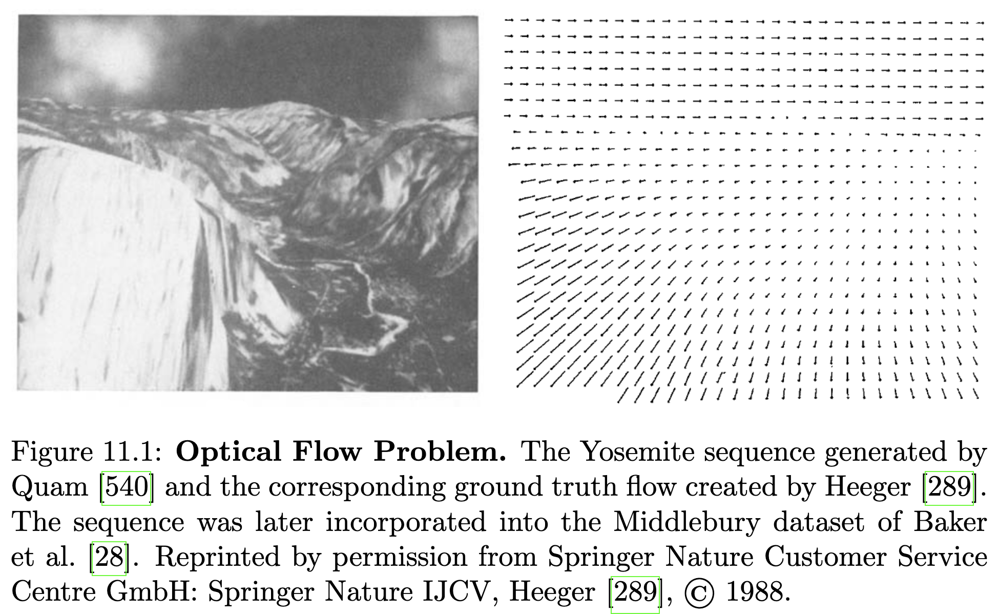
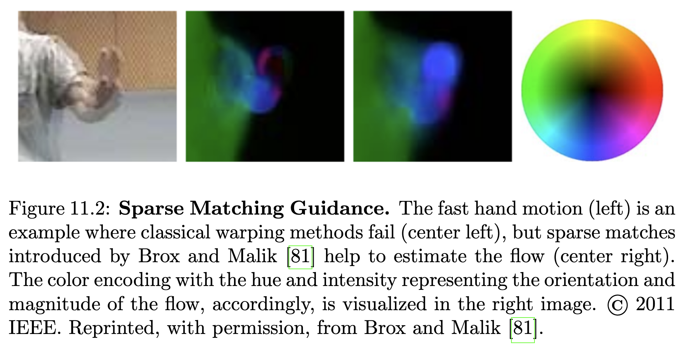
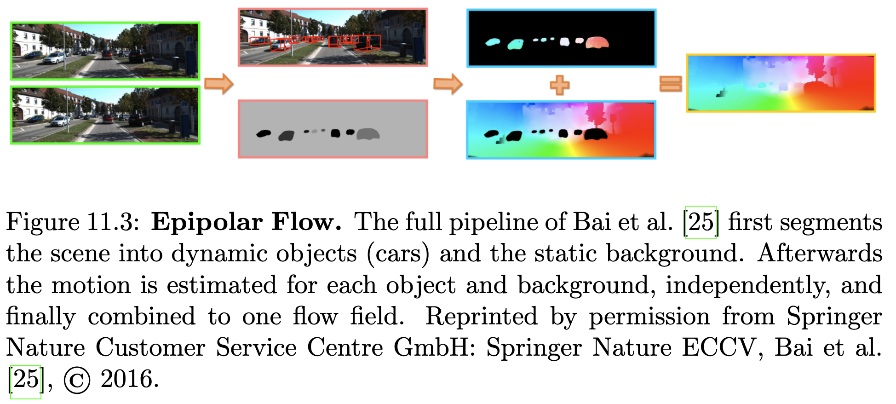
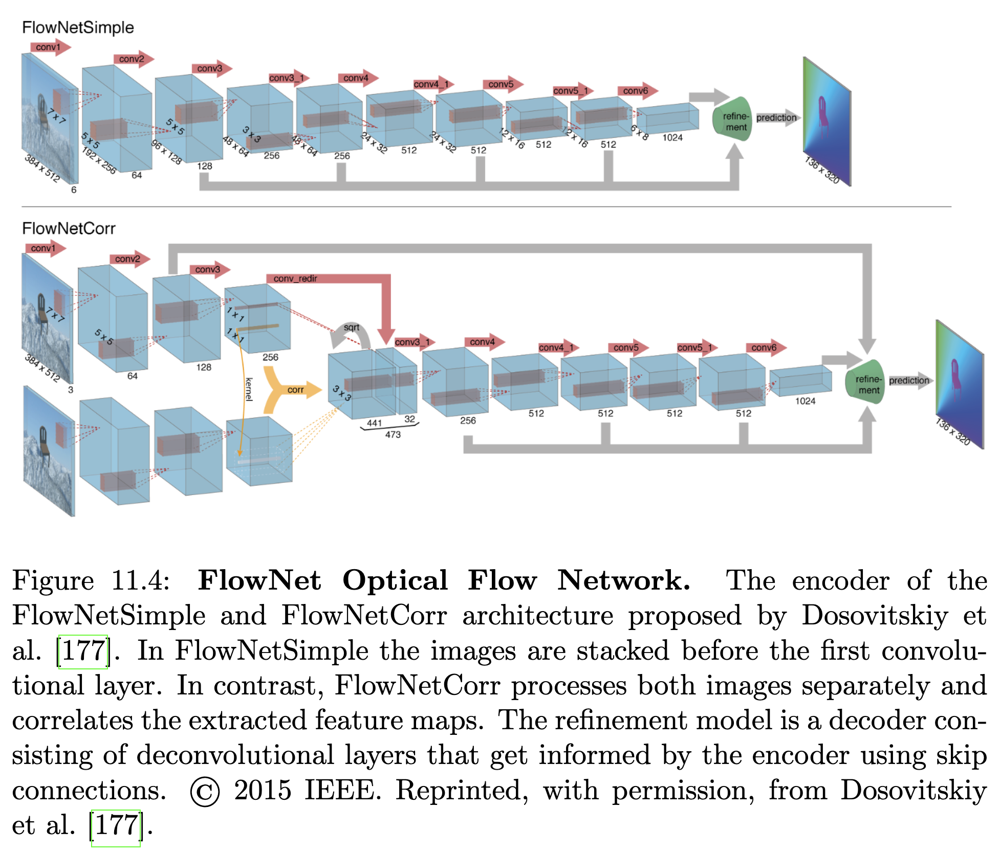
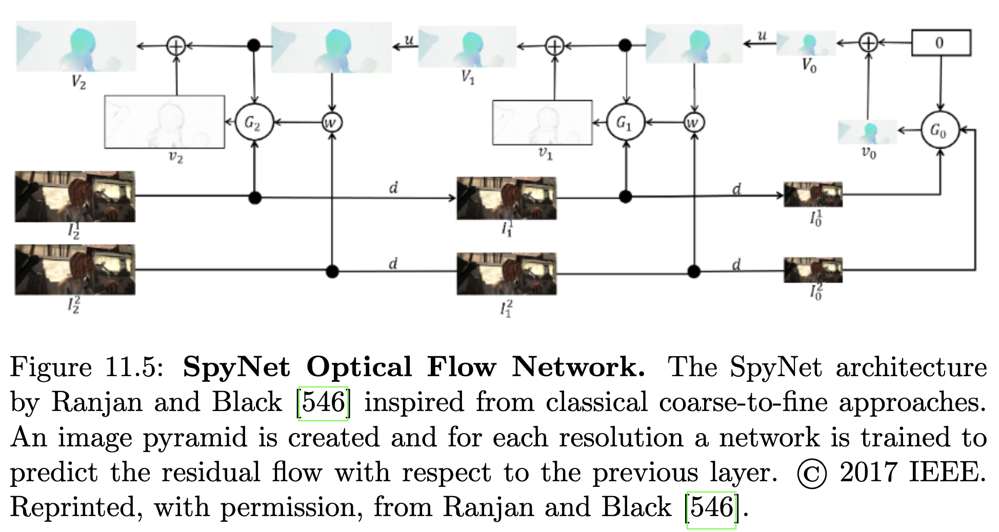
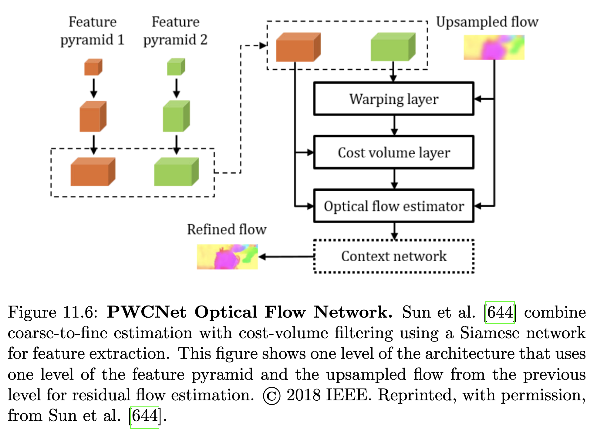
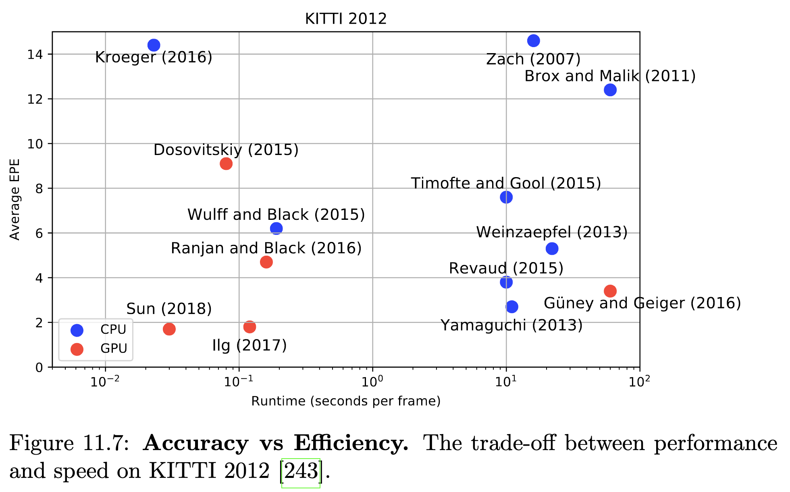
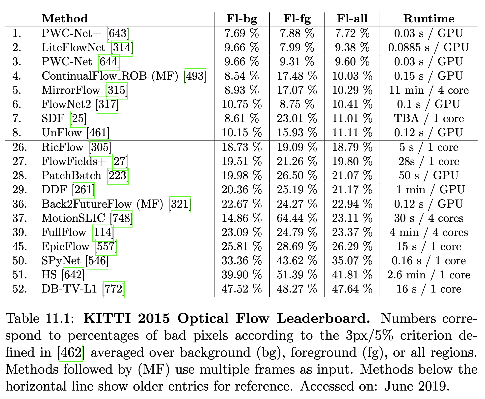
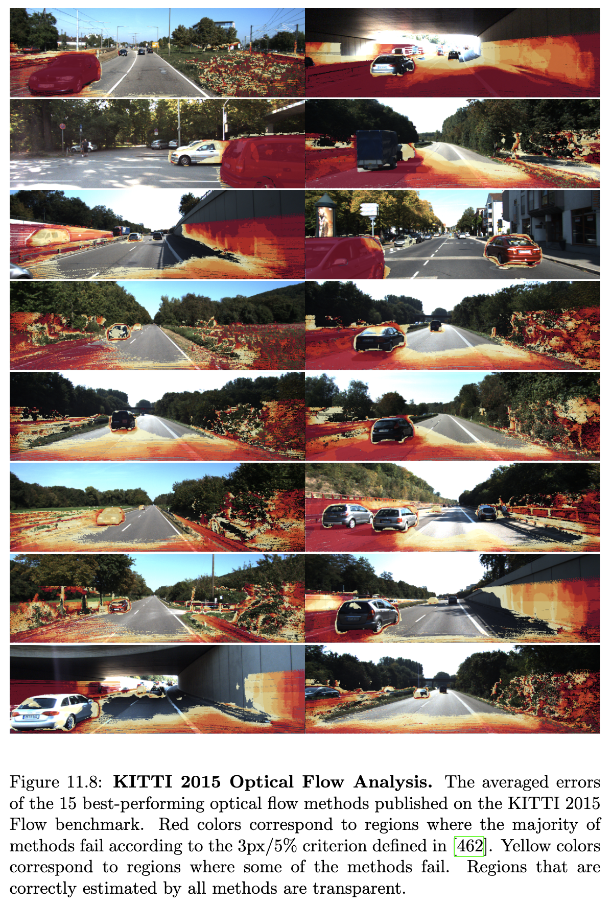

## 11.1 문제 정의

광학 흐름은 두 이미지 사이에서 밝기 패턴의 2차원 움직임으로 정의됩니다. 이 정의는 이미지 평면에서의 강도 패턴 움직임만을 나타내며, 장면 내 객체의 3D 움직임은 아닙니다. 3D 움직임 자체를 복구하는 것은 12장에서 논의되는 장면 흐름(Scene Flow)의 목표입니다. 그림 11.1은 요세미티 계곡의 항공 이미지를 근사 메시 모델에 텍스처 매핑하여 생성된 광학 흐름 지상 진실을 가진 합성 요세미티 시퀀스를 보여줍니다.

광학 흐름은 장면에 대한 필수 정보를 제공하며, 자체 움직임 추정(13장), 구조 기반 모션(13장), 추적(6장) 등 여러 작업의 입력으로 사용됩니다. 이 문제에 대한 연구는 Horn과 Schunck [301]의 변분 공식화로 수십 년 전에 시작되었으며, 픽셀의 밝기가 시간에 따라 일정하다고 가정합니다. 광학 흐름 문제의 오랜 역사에도 불구하고, 가려짐, 큰 변위 및 미세한 세부 사항은 현대 방법에서도 여전히 어려운 문제입니다. 광학 흐름 정의의 근본적인 문제는 관심 있는 실제 움직임 외에도 조명 변화, 반사 및 투명도도 강도 변화를 유발할 수 있다는 것입니다. 스테레오와 달리, 대응 관계를 찾는 검색 공간은 광학 흐름의 경우 2차원입니다.

## 11.2 방법론

전통적으로 광학 흐름 문제는 변분 공식화로 접근되었습니다. 변분 방법은 시간에 따라 외관 변화가 거의 없다고 가정한 데이터 항과 공간적 이웃 간의 유사성을 장려하는 평활도 항으로 구성된 에너지를 최소화합니다. Horn과 Schunck [301]은 픽셀의 강도 값을 시간에 따라 일정하다고 모델링하는 밝기 불변성 가설을 도입했습니다. 단일 픽셀을 독립적으로 고려하면 이 가설은 두 개의 미지수를 가진 하나의 방정식을 생성하며, 이는 고유한 해를 제공하지 않습니다(조리개 문제로 알려짐). 따라서 조리개 문제를 해결하고 광학 흐름을 추정하기 위해 추가 제약이 도입되어야 합니다. 변분 광학 흐름 추정을 정규화하는 일반적인 방법은 공간적으로 인접한 흐름 벡터의 유사성을 장려하는 것입니다. 이 사전 가정은 흐름 필드가 종종 부드럽고 불연속성은 일반적으로 객체 경계에서만 발생한다는 사실에 의해 동기 부여됩니다.

원래 공식 [301]은 데이터 및 평활도 항에 2차 페널티 함수를 사용합니다. 그러나 2차 페널티는 변화하는 조명 조건 등으로 인한 밝기 불변성 가정의 빈번한 위반을 처리할 수 없습니다. 이 문제를 완화하는 한 가지 방법은 Black과 Anandan [54]이 제안한 견고한 페널티 함수를 사용하는 것입니다. 또한, 조명 변화에 덜 영향을 받는 여러 가지 다른 데이터 항이 제안되었습니다. Vogel et al. [691]은 KITTI 데이터셋 [243]에서 픽셀 기반 및 패치 기반 데이터 비용을 체계적으로 평가합니다. 실제 데이터에서 그들은 패치 기반 항이 픽셀 기반 항보다 더 나은 성능을 보인다는 것을 발견했습니다.

움직임 경계 근처에서 흐름 불연속성이 빈번하게 발생하며, 이는 서로 앞서 움직이는 객체에 의해 발생합니다. Horn과 Schunck [301]의 원래 공식은 동질적이고 견고하지 않은 평활도 항 때문에 이러한 불연속성을 처리할 수 없습니다. Zach et al. [771]에서 사용된 Total Variation 정규화는 흐름 필드의 불연속성을 보존하기 위해 2차 페널티를 L1 norm으로 대체합니다. 그러나 Horn과 Schunck의 원래 공식과 마찬가지로 이 모델 또한 솔루션을 전면 평행 표면으로 편향시켜 추정 결과, 특히 강하게 기울어진 평면(예: 도로 표면)이 있는 경우 인공물을 생성합니다. 따라서 Total Generalized Variation (TGV) 모델과 같은 고차 정규화가 제안되었습니다 [71]. TGV 사전은 조각별 아핀 모션 모델을 활용하므로 실제 데이터를 더 잘 나타낼 수 있습니다. 비지역 Total Generalized Variation [544]은 이 모델의 확장으로, 지역 이웃에서 조각별 아핀 가설을 강제합니다. 이를 통해 직접 이웃만 고려하는 TGV에 비해 데이터 항이 모호한 영역에서 성능을 향상시킬 수 있습니다. Zimmer et al. [811]은 변분 공식화를 위한 이미지 및 흐름 기반 정규화에 대한 자세한 평가를 제공하고 다른 데이터 항의 품질을 논의합니다.

모델 사양 외에도 최적화 방법의 선택과 구현은 변분 광학 흐름 추정 알고리즘의 성능에 영향을 미치는 추가적인 요소입니다. 광학 흐름 방법에 대한 자세한 연구는 Sun et al. [642]에서 제공됩니다. 그들은 광학 흐름 방법의 성공에 가장 중요한 요소를 조사하고 현대 기술로 고전적인 공식을 최적화하는 접근 방식을 제안합니다.

### 11.2.1 희소 매칭

광학 흐름 방정식을 얻는 데 사용되는 선형 근사는 픽셀 움직임에만 유효합니다. 따라서 변분 방법은 추가 전략 없이는 큰 변위를 처리할 수 없습니다. 변분 공식화에서 이 문제는 일반적으로 coarse-to-fine 전략으로 해결되며, 더 거친 해상도에서 흐름을 추정하여 더 미세한 해상도에서 추정을 초기화합니다. 이 전략은 장면의 지배적인 움직임을 포착하여 복잡성이 거의 없는 큰 구조에 대해서는 작동하지만, 미세한 기하학적 세부 사항은 종종 이 과정에서 손실됩니다. 게다가 대응 관계 추정에 중요한 질감 세부 사항은 거친 해상도에서 손실되어 최적화 프로그램이 지역 최소점에 도달하게 됩니다. 미세한 세부 사항 손실의 한 예는 그림 11.2에 나와 있으며, 빠르게 움직이는 손의 광학 흐름 필드를 보여줍니다. 이러한 문제는 Brox와 Malik [81]이 제안한 바와 같이 희소 특징 대응 관계를 변분 공식화에 통합함으로써 완화될 수 있습니다. 거친 그리드에서 최근접 이웃 검색을 통해 얻은 특징 매칭은 coarse-to-fine 최적화에서 약한 제약으로 사용됩니다. 그림 11.2에서 고전적인 공식은 손에 대한 광학 흐름을 복구하는 데 실패하지만, 특징 매칭을 통합하면 최적화 프로그램이 더 나은 솔루션으로 안내됩니다.

큰 변위에 대한 또 다른 해결책은 Revaud et al. [557]이 제안합니다. 그들은 coarse-to-fine 전략을 희소 매칭 보간으로 대체하여 전체 해상도에서 밀집 최적화를 초기화합니다. 희소 매칭은 Weinzaepfel et al. [714]이 도입한 딥 신경망 매칭 접근 방식인 DeepMatching을 사용하여 얻습니다. DeepMatching과 달리 Menze et al. [463]은 근사 최근접 이웃 검색을 사용하여 이산 최적화 프레임워크에서 사용할 후보로 제안 세트를 생성합니다. 추론은 가장 가능성이 높은 매칭 수로 제한하고 쌍별 잠재력의 잘린 형태를 활용하여 가능해집니다. 스테레오에서 Siamese 네트워크의 성공 [775](https://www.google.com/search?q=9%EC%9E%A5)에 동기를 부여받아 G¨uney와 Geiger [261]는 이 작업을 2D 패치 매칭을 위한 특징 학습으로 확장합니다. 그들은 또한 시맨틱 분할을 위해 Yu와 Koltun [766]이 제안한 dilated convolution을 활용하여 수용장 크기의 중요성을 조사합니다. Chen과 Koltun [114]은 추론을 가능하게 하기 위해 사용된 휴리스틱 가지치기가 매핑 공간의 고도로 규칙적인 구조를 파괴한다고 주장하며 전체 공간에 대한 이산 최적화를 제안합니다. 최소 컨볼루션은 복잡성을 줄이고 수정된 트리-재가중 메시지 전달 [360] 버전을 사용하여 큰 레이블 공간을 효과적으로 최적화하는 데 사용됩니다.

Wulff와 Black [735]은 희소 매칭에서 밀집 광학 흐름을 얻는 다른 접근 방식을 제시합니다. 그들의 접근 방식에서 광학 흐름 필드는 할리우드 영화에서 추정된 참조 흐름 필드로부터 학습된 기저 흐름 필드의 가중 합으로 표현됩니다. 그들은 감지된 희소 특징 대응 관계에 대한 오류를 최소화하는 가중치를 찾아 광학 흐름을 추정합니다. 이로 인해 과도하게 부드러운 흐름 필드가 생성되지만, 소위 PCA Flow 접근 방식은 변분 및 이산 최적화 방법에 비해 매우 빠릅니다. 더 느리지만 더 정확한 버전도 계층화된 접근 방식을 사용하여 흐름 불연속성을 더 잘 처리하기 위해 제안됩니다.

### 11.2.2 에피폴라 흐름

자율 주행의 맥락에서 응용 분야별 가정을 통해 광학 흐름 추정을 단순화할 수 있습니다. 정적 장면 가정 또는 장면을 강체로 움직이는 객체로 분해하는 것은 광학 흐름을 팽창 중심에서 방사되는 에피폴라 선을 따라 매칭 문제로 처리할 수 있도록 합니다. Yamaguchi et al. [748]은 각 세그먼트의 에피폴라 흐름을 기울어진 평면으로 나타내는 기울어진 평면 마르코프 랜덤 필드를 제안합니다. 이 공식화는 시간 소모적인 최적화를 필요로 하는데, 이는 Yamaguchi et al. [750]의 공동 스테레오 및 흐름 공식으로 피할 수 있습니다. 그들은 장면이 정적이라고 가정하고 스테레오 및 비디오의 공동 증거를 사용하는 새로운 준 전역 블록 매칭 알고리즘을 제시합니다.

### 11.2.3 시맨틱 분할

자율 주행의 맥락에서 장면은 일반적으로 정적 배경과 동적으로 움직이는 교통 참가자로 구성됩니다. 이 관찰은 장면을 독립적으로 움직이는 객체로 분할함으로써 활용될 수 있습니다. Bai et al. [25]은 인스턴스 수준 분할을 사용하여 교통 참가자를 추출하고 다른 인스턴스에 대해 독립적으로 광학 흐름을 추정합니다. [748, 750]과 유사하게 그들은 기울어진 평면 모델을 사용하지만 배경 흐름 추정에서만 사용합니다. 각 움직이는 객체에 대해 그림 11.3에 나타난 바와 같이 독립적인 에피폴라 흐름 추정이 수행됩니다. Sevilla-Lara et al. [615]은 광학 흐름 추정을 위해 시맨틱 분할을 사용합니다. 첫째, 시맨틱스는 객체 경계 및 객체 간의 공간적 관계에 대한 정보를 제공하며, 이는 깊이 순서를 추론하는 데 활용될 수 있고, 이는 다시 광학 흐름에서 가려짐 관계를 결정합니다. 둘째, 장면을 시맨틱 단위로 분할함으로써 [25]와 유사하게 해당 객체 유형에 따라 다른 모션 모델을 활용할 수 있습니다. 평면 영역의 움직임은 호모그래피로 모델링되는 반면, 독립적으로 움직이는 객체(예: 자동차)는 아핀 움직임으로 모델링됩니다. 식물과 같은 복잡한 객체는 고전적인 공간적으로 변화하는 밀집 흐름 필드로 모델링됩니다. 마지막으로, 객체 ID의 시간적 일관성은 광학 흐름의 시간적 일관성을 장려하는 데 사용됩니다.

### 11.2.4 광학 흐름을 위한 딥 러닝

대부분의 광학 흐름 접근 방식은 고수준 정보를 통합하지 않아 더 넓은 이미지 영역에 대한 추론이 필요한 모호성을 극복하기 어렵게 만듭니다. 컨볼루션 신경망의 최근 성공은 광학 흐름 문제에 이를 사용하려는 시도로 이어졌습니다.

Dosovitskiy et al. [177]은 CNN을 사용하여 광학 흐름을 엔드투엔드 방식으로 학습하는 FlowNet을 발표했습니다. FlowNet은 중요한 특징을 추출하는 축소 부분과 고해상도 광학 흐름 필드를 출력으로 생성하는 확장 부분으로 구성됩니다. 그들은 그림 11.4에 나타난 두 가지 다른 아키텍처를 제안합니다: 이미지를 쌓는 간단한 네트워크(FlowNetSimple)와 별도로 처리된 이미지의 특징을 상관시키는 복잡한 네트워크(FlowNetCorr)입니다. 광학 흐름 학습의 한 가지 문제는 제한된 훈련 데이터 양입니다. KITTI 2012 [243] 및 KITTI 2015 [462]는 각각 약 200개의 훈련 예제만을 제공하는 반면, Sintel [92]은 1041개의 훈련 이미지 쌍을 가지고 있습니다. 이러한 데이터셋은 대규모 CNN을 훈련하기에는 너무 작기 때문에 Dosovitskiy et al. [177]은 Flickr 이미지 위에 3D 의자 모델을 렌더링하여 Flying Chairs 데이터셋을 만들었습니다. 엔드투엔드 광학 흐름 학습에 대한 첫 시도는 KITTI 또는 Sintel에서 최첨단 전통 방법의 성능에 아직 도달하지 못했음에도 불구하고 데이터로부터 광학 흐름 추정을 학습하는 것이 가능하다는 것을 보여주었습니다. 그러나 병렬 GPU 구현 덕분에 FlowNet은 대부분의 고전 알고리즘이 CPU에서 구현된 것과 달리 실시간으로 실행될 수 있었습니다.

Dosovitskiy et al. [177]의 축소 및 확장 네트워크와 달리 Ranjan과 Black [546]은 전통적인 광학 흐름 추정 기술에서 활용되는 coarse-to-fine 매칭 전략에서 영감을 받은 SpyNet 아키텍처를 제시합니다. 그림 11.5에 나타난 바와 같이, 네트워크의 각 레이어는 다른 스케일을 나타내고 이전 레이어의 흐름에 따라 워핑된 이미지에 대한 잔차 흐름만 추정합니다. 이 공식화는 FlowNet과 유사한 성능을 달성하면서도 더 빠르고 네트워크 가중치 측면에서 96% 더 작게 만들어 제한된 컴퓨팅 기능을 가진 임베디드 시스템에 매력적입니다. Ilg et al. [317]은 FlowNet2, 즉 FlowNet의 개선된 버전을 제시하며, 아키텍처를 쌓고 쌓인 네트워크를 작은 움직임에 특화된 서브 네트워크와 융합합니다. SpyNet과 유사하게, 그들은 워핑된 이미지를 쌓인 네트워크에 입력합니다. 각 쌓인 네트워크는 SpyNet에서와 같이 잔차 흐름 대신 원본 프레임 간의 흐름을 추정합니다. FlowNet과 SpyNet과 달리 그들은 ShapeNet 데이터셋 [585]의 움직이는 3D 모델이 있는 정적 3D 장면의 22k 렌더링으로 구성된 FlyingThings3D 데이터셋 [457]을 사용합니다. 최근 그림 11.6에 나타난 PWC-Net [644]이 제안되었는데, 이는 coarse-to-fine 워핑 [546] 및 비용 볼륨 필터링 [177]의 고전적인 아이디어를 풍부한 특징 표현을 학습하는 것으로 입증된 Siamese 네트워크 [775]와 결합합니다.

비지도 학습: 광학 흐름의 지도 학습을 위한 대규모 주석 데이터셋이 다소 제한적이기 때문에, 최근 여러 연구 [770, 461, 703, 321]가 광학 흐름의 비지도 학습 문제를 다룹니다. 일반적으로 이러한 접근 방식은 표준 네트워크 중 하나를 사진측정 손실 및 평활도 손실로 훈련합니다. 사진측정 손실은 예측된 흐름에 따라 워핑된 첫 번째 이미지와 두 번째 이미지를 비교합니다. 평활도 손실은 이웃 픽셀 간의 유사한 움직임을 장려합니다. 최근 여러 접근 방식 [461, 703, 321]은 가려진 영역이 사진측정 손실에 오류를 유발하여 훈련 중에 오해의 소지가 있는 기울기를 발생시킨다는 것을 발견했습니다. 그들은 이 문제를 피하기 위해 가려진 영역을 마스킹할 것을 제안합니다. Meister et al. [461]과 Wang et al. [703]은 모두 가려짐 추정을 위해 휴리스틱에 의존하는 반면, Janai et al. [321]은 3프레임 공식을 사용하여 비지도 방식으로 가려짐과 광학 흐름을 공동으로 학습합니다. 가려짐 처리가 큰 개선을 가져오고 최초의 완전 지도 접근 방식 [177, 546]과 비교할 수 있는 성능을 보이지만, 오늘날 리더보드를 지배하는 최첨단 지도 접근 방식 [317, 644]과 경쟁할 수는 없습니다.

### 11.2.5 고속 흐름

몇 가지 예외(Wulff와 Black [735], Timofte와 Gool [666], Wein-zaepfel et al. [714], Farneback [201], Zach et al. [771])를 제외하고, 대부분의 고전적인 광학 흐름 접근 방식은 매우 비효율적이어서 자율 주행 애플리케이션에 필요한 실시간으로 적용될 수 없습니다. KITTI 2012 벤치마크 [243]에서 다른 알고리즘의 정확도와 속도 간의 절충은 그림 11.7에 나타나 있습니다. 변분 접근 방식은 좋은 정밀도를 제공했지만, 움직임 추정을 위한 가장 느린 방법 중 하나였습니다. Zach et al. [771]이 제안한 전체 변동 광학 흐름을 위한 이중성 기반 접근 방식은 320x240 해상도에서 실시간(30Hz)으로 작동하는 효율적인 GPU 구현을 가능하게 합니다. 희소 매칭 접근 방식은 일반적으로 변분 공식보다 더 효율적이지만, 서브픽셀 정밀도를 달성하기 위해 종종 후처리 단계로 변분 개선이 필요합니다.

최근 광학 흐름 문제에 딥 러닝이 도입되면서 여러 준 실시간 접근 방식(Dosovitskiy et al. [177] 및 Ranjan과 Black [546])이 등장했으며, 이에는 인기 있는 데이터셋에서 최첨단 성능을 달성하는 (Ilg et al. [317] 및 Sun et al. [644])도 포함됩니다. Kroeger et al. [368]이 제안한 접근 방식은 정확도와 런타임 간의 절충을 허용합니다. 그들은 역검색을 통해 빠른 패치 대응을 얻으며, 여러 스케일에서 패치를 집계할 때 밀집 흐름 필드를 생성합니다. 이를 통해 최대 600Hz로 광학 흐름을 추정할 수 있지만, 정확도를 희생해야 합니다.

### 11.2.6 신뢰도

광학 흐름에서 남아 있는 과제를 고려할 때, 추정된 흐름의 품질을 평가하기 위한 신뢰도 측정이 바람직합니다. 예를 들어, 자율 주행 애플리케이션에서 광학 흐름 추정치의 중요성은 좋은 신뢰도 측정으로 조정될 수 있습니다. 낮은 신뢰도의 경우 시스템은 다른 정보원(예: 다른 센서)에 대한 주의를 높일 수 있습니다.

광학 흐름 추정의 불확실성을 정량화하기 위해 공간적 및 시간적 기울기를 기반으로 하는 여러 측정 지표가 제안되었습니다 [678, 8, 626]. 이와 대조적으로 알고리즘별 측정 지표는 특정 방법 그룹, 즉 변분 방법 [83] 및 픽셀 기반 최소화 문제 방법 [381]에 대한 신뢰도 추정치를 제안합니다. Bruhn과 Weickert [83]은 변분 방법에 의해 최적화된 에너지 함수를 기반으로 신뢰도 측정 지표를 제안하는 반면, Kybic와 Nieuwenhuis [381]는 부트스트랩 재샘플링을 사용합니다. 이는 에너지에 대한 일부 픽셀의 기여를 무작위로 대체하면서 광학 흐름 계산을 반복적으로 실행합니다.

학습 기반 측정 [362, 363, 444]은 흐름 알고리즘 성공과 시공간 이미지 데이터 또는 계산된 흐름 필드를 연결하는 모델을 학습합니다. Kondermann et al. [362]은 광학 흐름의 선형 부분 공간 투영을 사용하고 선형 기저를 사용한 재구성 오류를 기반으로 신뢰도를 정의합니다. 이와 대조적으로 Kondermann et al. [362]은 주석이 달린 훈련 데이터에서 확률적 모션 모델을 학습하고 파생된 모델을 기반으로 흐름 추정의 가설 검정을 사용하여 신뢰도를 계산합니다. Mac Aodha et al. [444]은 시간적 특징, 질감 또는 이미지 가장자리로부터의 거리와 같은 여러 특징 유형을 기반으로 광학 흐름 예측의 품질을 직접 측정하기 위한 분류기를 학습합니다. 또한, 그들은 다른 신뢰도 측정에 대한 자세한 평가를 제공합니다.

여러 접근 방식 [705, 316, 235, 762]은 광학 흐름과 신뢰도를 동시에 추정할 것을 제안했습니다. Wannenwetsch et al. [705]은 일반 에너지 공식화를 기반으로 확률적 방법을 공식화합니다. 광학 흐름은 사후 확률에 대한 예상 손실을 최소화하여 추정되는 반면, 신뢰도는 사후 확률의 한계 엔트로피를 사용하여 측정됩니다. 그들은 추론을 다루기 쉽게 만들기 위해 평균 필드 근사에 의존합니다. Gast와 Roth [235]는 경량 확률적 CNN을 제안합니다. 2차원 광학 흐름 필드를 학습하는 대신 가우시안 분포의 평균과 표준 편차를 학습합니다. 또한, 그들은 각 레이어에서 분포를 학습하고 확률적 활성화를 순방향 및 역방향으로 전파하는 방법을 설명합니다. 동시 연구에서 Ilg et al. [316]은 CNN을 사용하여 불확실성을 학습하는 두 가지 접근 방식을 제안합니다. 간단한 접근 방식에서 그들은 다른 모델 세트를 훈련하고 경험적으로 불확실성을 추정합니다. 여러 모델을 훈련하는 것은 비용이 많이 들기 때문에 그들은 [235]의 정신으로 FlowNet [177]의 확장을 제안합니다. 이는 일부 광학 흐름 레이어를 가우시안의 평균과 표준 편차로 대체합니다. 최근 Yin et al. [762]은 가능한 대응 관계에 대한 이산 분포를 기반으로 확률적 공식화를 제시했습니다. 매칭 확률을 나타내는 일반 모델을 통해 그들은 어떤 매개변수 분포 가설에도 의존할 필요가 없습니다. 그들은 계산을 가능하게 하기 위해 매칭 분포를 여러 스케일로 분해합니다.

## 11.3 데이터셋

4장에서 논의된 Sintel [92] 및 KITTI [243, 242]는 광학 흐름 알고리즘 평가를 위한 가장 인기 있는 데이터셋입니다. 그러나 본 조사에서는 자율 주행 애플리케이션에 초점을 맞춥니다. 따라서 방법을 비교할 때 KITTI 리더보드만 참조할 것입니다.

## 11.4 측정 지표

방법의 성능은 일반적으로 추정된 흐름 벡터와 지상 진실 간의 엔드포인트 오차(유클리드 거리)를 고려하여 평가됩니다. Sintel은 다른 속도, 가려진 및 가려지지 않은 영역에 대한 평균 엔드포인트 오차를 보고하는 반면, KITTI 데이터셋은 절대 엔드포인트 오차(EPE)가 3픽셀 및 실제 값의 5%를 초과하는 흐름 벡터의 백분율로 계산되는 이상치를 사용합니다. 이상치의 백분율은 배경(Fl-bg), 전경(Fl-fg) 및 모든 영역(Fl-all)에 대해 평균화되어 세 가지 다른 평가 지표를 생성합니다.

## 11.5 KITTI의 최첨단 기술

표 11.1에서 우리는 KITTI 2015 벤치마크의 리더보드를 보여줍니다. 추정 오류 외에도 출력 흐름 필드의 밀도와 런타임도 제공됩니다.

Bai et al. [25]는 시맨틱 분할과 에피폴라 기하학을 활용하여 배경 영역에서 높은 정확도를 달성합니다. 그러나 그들의 가정에 따르지 않는 동적 객체를 가진 전경 영역에서는 성능이 저하됩니다. Hur와 Roth [315]는 광학 흐름과 가려짐을 공동으로 추론하기 위해 대칭 최적화 문제를 공식화합니다. 순방향-역방향 흐름과 가려짐의 교대 최적화를 사용하여 배경 영역에서 유사한 결과를 얻으면서 전경 영역에서는 개선을 이룹니다.

최고 성능을 보이는 방법들은 광학 흐름을 엔드투엔드 방식으로 학습합니다 [644, 314, 493, 317, 461, 643]. FlowNet2 [317]는 8fps와 140fps 사이의 스펙트럼에 대한 다양한 네트워크 변형을 제공하여 정확도와 계산 간의 절충을 가능하게 합니다. 가장 정확한 네트워크는 최첨단 기술과 비교할 수 있는 결과를 달성합니다. Neoral et al. [493]은 3프레임 공식을 사용하여 광학 흐름과 가려짐을 공동으로 학습합니다. 이를 통해 전경 객체에 의해 자주 가려지는 배경 영역에서 잘 작동할 수 있습니다. Hui et al. [314]은 Siamese 네트워크, coarse-to-fine 워핑 및 상관 관계 계산을 사용하여 PWC-Net과 유사한 접근 방식을 따릅니다. Sun et al. [643]은 여러 중단(학습 속도의 강한 증가)으로 구성된 새로운 학습 속도 스케줄을 제안하고, 이것이 원래 PWC-Net의 훈련을 어떻게 개선하는지 보여줍니다. 적응된 훈련 프로토콜 [643]을 가진 PWC-Net [644]은 KITTI 2015(표 11.1) 및 Sintel에서 배경 및 전경 객체 모두에서 다른 모든 방법을 능가하며, 두 벤치마크에서 가장 빠른 방법 중 하나입니다.

## 11.6 논의

견고한 광학 흐름 방법은 실제 관심 있는 움직임이 아닌 조명 변화, 반사 및 투명도로 인해 발생하는 강도 변화를 처리해야 합니다. 실제 장면에서는 반복되는 패턴, 질감 없는 표면, 포화된 이미지 영역 및 가려짐이 빈번한 오류의 원인입니다. 조명 변화는 새로운 데이터 항 [54, 691]으로 해결되었지만, 반사, 투명도, 모호성 및 가려짐으로 인한 문제는 대부분 해결되지 않은 채 남아 있습니다. 그림 11.8에서 KITTI 2015 [462]에서 최고 성능을 보이는 15가지 방법의 누적 오류를 보여줍니다. 가장 큰 오류는 관찰을 사용할 수 없으므로 광학 흐름을 추측해야 하는 이미지 도메인 외부로 움직이는 영역에서 관찰될 수 있습니다. 질감 없는, 반사성 및 투명한 영역도 많은 경우에 큰 오류를 초래합니다. 이러한 문제를 해결하려면 세상에 대한 더 나은 이해가 필요합니다. 시맨틱스 [25]와 학습된 고용량 모델 [644, 314, 493, 317, 461, 643]은 이미 데이터의 모호성을 해결함으로써 광학 흐름 추정을 개선하는 것으로 입증되었습니다. 공동 광학 흐름 및 가려짐 공식화는 최적화 기반 [315] 및 학습 기반 [461, 703, 321] 방법 모두에서 이러한 문제를 완화할 큰 잠재력을 보여주었습니다.

