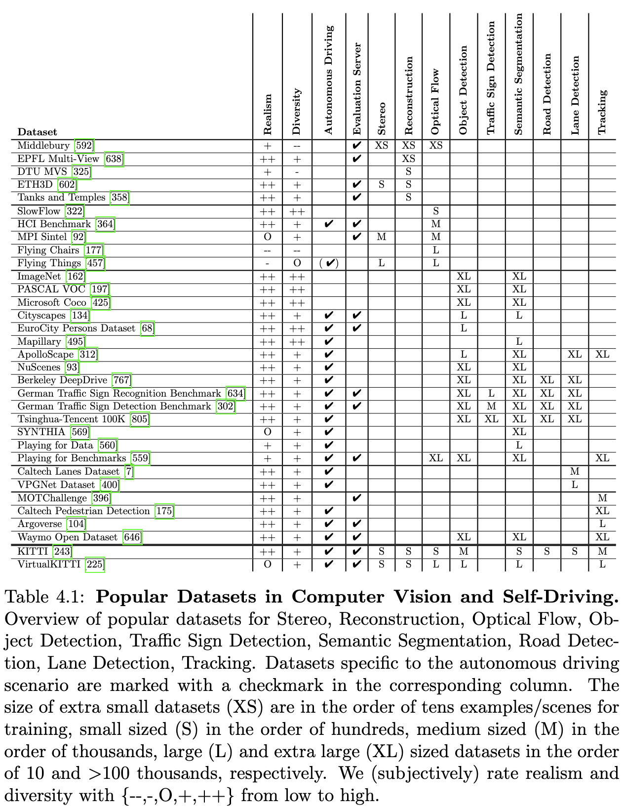
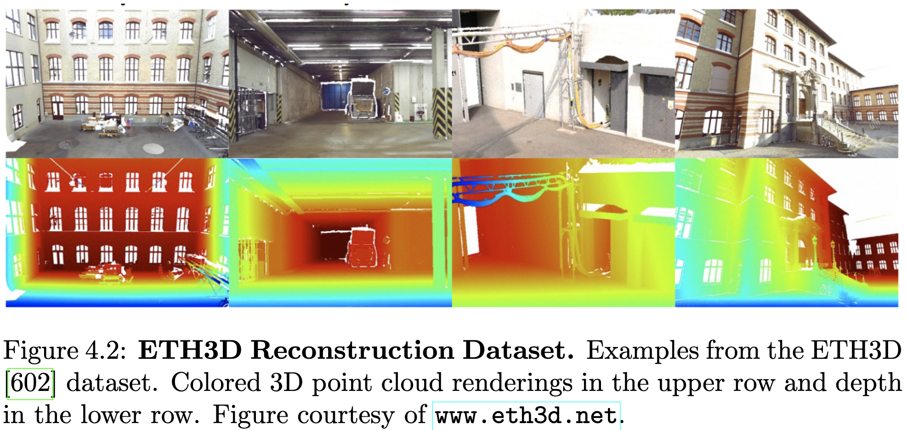
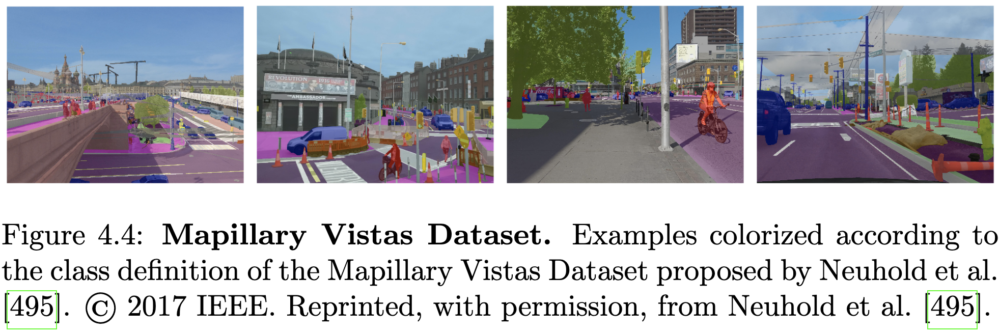
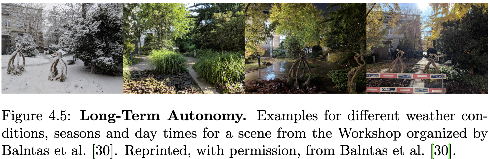

# Chapter 3 
## Sensors

The navigation of autonomous systems is usually addressed with a sensor suite which comprises various different types of sensors, including cameras, wheel odometry, and range sensors (SONAR, RADAR, and LiDAR). As an example, Tesla uses several cameras, RADAR, and ultrasonics for their advanced driver- assistance system Autopilot. Fusing information from several sensors allows exploiting their complementary characteristics and addressing the limitations of individual sensors, e.g., the loss of structure information in cameras or missing color information in range data.

자율 시스템의 항법은 다양한 센서들을 활용하여 해결됩니다. 여기에는 카메라, 바퀴 속도 측정, 그리고 레이더(RADAR), LiDAR 센서 등 여러 종류의 센서가 포함됩니다. 예를 들어 테슬라는 고급 운전자 보조 시스템인 오토파일럿에 여러 대의 카메라, 레이더, 초음파 센서를 사용합니다. 여러 센서로부터 정보를 융합함으로써 각 센서의 보완적인 특징을 활용하고, 개별 센서의 한계를 보완할 수 있습니다. 예를 들어 카메라에서는 구조 정보 손실이나 레이더 데이터에서 색상 정보가 누락되는 문제 등을 해결할 수 있습니다.

Wheel odometry measures the rotation of a wheel and can be used to esti- mate the distance covered by the autonomous vehicle. However, wheel odom- etry does not provide the full vehicle pose (i.e., all six degrees of freedom) and is thus typically combined with visual odometry or SLAM techniques discussed in Chapter 13. Range sensors, i.e., SONAR, RADAR, LiDAR, pro- vide additional information about the geometry and structure of the scene. Ultrasonic sensors (SONAR) emit high-frequency sound waves and measure the time for sound waves to travel to nearby objects. The distance to objects is computed from the travel time since the speed of sound waves is known. RADAR and LiDAR work with the same principle but use electromagnetic waves and laser light pulses instead of sound waves. Because of the larger wavelength, RADAR sensors benefit from a larger working distance than Li- DAR and SONAR but at the price of lower accuracy.

바퀴 오도메트리는 바퀴의 회전을 측정하여 자율 주행 차량이 이동한 거리를 추정하는 데 활용될 수 있습니다. 그러나 바퀴 오도메트리는 차량의 전체적인 자세(즉, 6도 자유도)를 제공하지 않으므로 일반적으로 13장에서 논의된 비전 오도메트리나 SLAM 기술과 함께 사용됩니다. 레이더 센서(예: SONAR, RADAR, LiDAR)는 장면의 기하학적 정보와 구조에 대한 추가 정보를 제공합니다. 초음파 센서(SONAR)는 고주파 음파를 방출하여 주변 물체로의 음파 이동 시간을 측정합니다. 음파 속이 알려진 상태에서 이동 시간을 통해 물체까지의 거리가 계산됩니다. RADAR 및 LiDAR는 동일한 원리를 사용하지만 음파 대신 전자기파와 레이저 펄스를 사용합니다. 더 큰 파장에 따라 RADAR 센서는 LiDAR 및 SONAR보다 더 긴 작동 거리를 제공하지만 정확도는 낮을 수 있습니다.

As cameras are cheap, passive, and easy to deploy, they are an attractive sensor choice for self-driving cars, and several existing driver assistance sys- tems rely on cameras for lane keeping or pedestrian detection. We now briefly discuss the most dominant camera types and give a short overview of popular calibration pipelines for estimating intrinsic and extrinsic sensor parameters.

카메라가 저렴하고, 간편하게 설치할 수 있으며, 성능도 뛰어나 자율주행차를 위한 매력적인 센서 선택이 되고 있습니다. 또한, 기존의 운전자 보조 시스템들은 차선 유지나 보행자 감지에 카메라를 활용하고 있습니다. 현재는 가장 널리 사용되는 카메라 종류를 간략하게 살펴보고, 내부 및 외부 센서 파라미터를 추정하기 위한 인기 있는 캘리브레이션 파이프라인에 대한 개요를 제공하고자 합니다.

### 3.1 Camera Models

Most conventional cameras comprise an aperture and one or multiple lenses and can be well approximated by the pinhole camera model (Figure 3.1). Omnidirectional cameras allow to significantly increase the field of view by exploiting mirrors or special lenses. Event cameras enable the acquisition of intensity changes at very high temporal resolutions. In the following, we provide a brief overview of omnidirectional and event cameras. We refer the reader to [652, 278] for an in-depth discussion of the pinhole camera model and projective geometry.

일반적인 카메라들은 조리개와 하나 이상의 렌즈로 구성되며, 피놀라 카메라 모델(그림 3.1)로 잘 근사할 수 있습니다. 오므니디렉셔널 카메라들은 거울이나 특수 렌즈를 활용하여 시야각을 크게 확장할 수 있도록 합니다. 이벤트 카메라들은 매우 높은 시간 해상도로 강도 변화를 획득할 수 있습니다. 다음에서는 오므니디렉셔널 카메라와 이벤트 카메라에 대한 간략한 개요를 제공합니다. 피놀라 카메라 모델 및 투영 기하에 대한 심층적인 논의는 [652, 278]를 참고해 주시기 바랍니다.

#### 3.1.1 Omnidirectional Cameras

A panoramic field of view is desirable in autonomous driving to gain maximum information about the surrounding area for safe navigation. Omnidirectional cameras with a 360-degree field of view (see Figure 3.2) provides enhanced coverage by eliminating the need for more cameras or mechanically turnable cameras. There are different types of omnidirectional cameras. Catadioptric cameras combine a standard camera with a shaped mirror, such as a parabolic, hyperbolic, or elliptical mirror, while dioptric cameras use purely dioptric fisheye lenses. Polydioptric cameras use multiple cameras with overlapping field of view to provide a full spherical field of view.

자율 주행 시스템에서 안전한 항해를 위해 주변 환경에 대한 최대한 많은 정보를 얻는 것이 중요합니다. 360도 시야각을 제공하는 오므라미 카메라(Omnidirectional cameras, Figure 3.2 참조)는 추가적인 카메라나 회전 가능한 카메라의 필요성을 없애면서 더욱 향상된 커버리지를 제공합니다. 오므라미 카메라는 다양한 종류가 있으며, 카타디옵트릭 카메라는 표준 카메라와 파라볼릭, 하이퍼볼릭 또는 elliptical 렌즈와 같은 특수 모양의 거울을 결합하는 방식입니다. 또한, 디옵트릭 카메라는 순수한 디옵트릭 핀홀렌즈를 사용합니다. 폴디옵트릭 카메라는 겹치는 시야각을 가진 여러 카메라를 사용하여 완전한 구형 시야각을 제공합니다.

Geyer and Daniilidis [248] provide a unifying theory for all central cata- dioptric systems which is known as unified projection model in the literature and widely used by different calibration toolboxes [460, 293, 292]. Scara- muzza and Martinelli [590] propose to model the imaging function using the Taylor series expansion. Mei and Rives [460] improve upon the unified projec-tion model of [248] to account for real-world errors by modeling distortions. Sch¨onbein et al. [598] propose a fast approximation to computationally ex- pensive non-central camera models.

게이저와 다니일리디스[248]는 문헌에서 널리 사용되는 통합 투사 모델로 알려진 모든 중앙 렌즈 굴절 시스템에 대한 통일된 이론을 제시합니다. 이 모델은 다양한 캘리브레이션 툴박스[460, 293, 292]에서 활용되고 있습니다. 스카라무자와 마르텔리[590]는 타일러 급 전개(Taylor series expansion)를 사용하여 이미지 함수를 모델링하는 방안을 제안합니다. 메이와 리브스[460]는 실제 환경에서의 오차를 고려하기 위해 게이저와 다니일리디스[248]의 통합 투사 모델을 개선하여 왜곡을 모델링합니다. 쇤베인 연구팀[598]은 계산 비용이 많이 드는 비중심 카메라 모델에 대한 빠른 근사 방법을 제안합니다.

Omnidirectional cameras are gaining popularity in autonomous driving re- search. For feature-based applications such as navigation, motion estimation, and mapping, a large field of view enables the extraction and matching of interest points from all around the car. Thus, omnidirectional cameras have been successfully used to improve ego-motion estimation of vehicles [587] and 3D reconstruction of static scenes [597, 271].

자율 주행 연구 분야에서 올리전방 카메라의 인기가 높아지고 있습니다. 특히 내비게이션, 움직임 추정, 맵핑과 같은 기능 기반 애플리케이션의 경우, 차량 전체를 촬영할 수 있는 넓은 화각을 통해 주변의 관심 지점을 추출하고 일치시키는 데 활용될 수 있습니다. 따라서 올리전방 카메라는 차량의 자가 운동 추정 정확도를 향상시키고, 정적인 장면의 3D 재구성을 개선하는 데 성공적으로 사용되고 있습니다.

#### 3.1.2 Event Cameras

Contrary to conventional frame-based cameras, event cameras produce a stream of asynchronous events of brightness changes surpassing a pre-defined threshold at microsecond resolution, as illustrated in Figure 3.3. An event comprises the location, sign, and timestamp of the change. As events are sparse in both space and time, this representation has the potential to reduce transmission and processing demands. The high temporal resolution enables the development of highly reactive systems. 

존재론적 프레임 기반 카메라와는 달리, 이벤트 카메라는 마이크로초 단위의 밝기 변화를 미리 설정된 임계값 이상으로 생성하여 비동기적인 이벤트 스트림을 제공합니다. 이러한 이벤트는 위치, 변화 방향, 그리고 시간 정보를 포함합니다. 이벤트는 공간 및 시간 모두에서 드물게 발생하므로, 이 표현 방식은 전송 및 처리 부담을 줄일 수 있는 잠재력을 가지고 있습니다. 높은 시간 해상도는 매우 반응성이 뛰어난 시스템 개발을 가능하게 합니다.

Dynamic and Active-Pixel Vision Sensors (DAVIS) output both CMOS images at fixed frame rates as well as asynchronous events, hence combining the benefits of both sensors. Mueggler et al. [485] provide a collection of real and synthetic datasets captured with DAVIS to push research on event- based methods. Binas et al. [53] present the DAVIS Driving Dataset and demonstrate end-to-end learning of steering angles. Recent work exploits DAVIS for feature tracking [237] and SLAM [686], improving accuracy and robustness over using only a single modality. 

저희 DAVIS 센서는 고정 프레임 속도로 CMOS 이미지를 출력하는 동시에 비동기 이벤트를 제공함으로써, 두 센서의 장점을 결합합니다. Mueggler et al. [485]은 DAVIS를 사용하여 획득한 실제 및 합성 데이터 세트를 제공하여 이벤트 기반 방법 연구를 발전시키는 데 기여하고 있습니다. Binas et al. [53]은 DAVIS Driving Dataset을 제시하고, 조향각의 종단 간 학습을 보여줍니다. 최근 연구에서는 DAVIS를 활용하여 특징 추적 [237] 및 SLAM [686]을 수행함으로써, 단일 모달리티만을 사용하는 것보다 정확성과 견고성을 향상시키고 있습니다.

Several methods have been developed which exploit the high temporal resolution and the asynchronous nature of event sensor for various problems. The majority of these methods focus on the application in unmanned aerial vehicles (UAVs) since very efficient methods are necessary to navigate these systems. In this context, event-based cameras have been used for ego-motion estimation [484], simultaneous localization and mapping (SLAM) [547] as well as for finding feature correspondences [226]. More recently, the benefits of event-based sensors have been exploited for autonomous vehicles by learning steering angles end-to-end [449].

여러 가지 방법이 개발되어 왔습니다. 이러한 방법들은 시간 해상도가 높고 이벤트 센서의 비동기적인 특성을 활용하여 다양한 문제 해결에 적용됩니다. 특히, 자율적으로 움직이는 무인 항공기(UAV) 시스템에서 매우 효율적인 방법이 필요하기 때문에 대부분의 방법이 UAV 분야에 초점을 맞추고 있습니다. 이와 관련하여, 이벤트 기반 카메라들은 자기 운동 추정[484], 동시 위치 추정 및 매핑(SLAM)[547] 뿐만 아니라 특징점 일치 탐색[226]에도 활용되고 있습니다. 최근에는 이벤트 기반 센서의 장점을 활용하여 자율 주행 차량에서 엔드-투-엔드 방식으로 조향 각도를 학습하는 데에도 적용되고 있습니다.

### 3.2 Calibration

Geometric calibration is the problem of estimating intrinsic and extrinsic parameters of one or multiple sensors in order to accurately relate 3D world points to 2D measurements. Fiducial markers and checkerboards are often used to facilitate parameter estimation [784, 62, 340, 9, 244].

정밀 기하 보정은 하나 이상의 센서의 내재적 및 외재적 파라미터를 추정하여 3차원 세계의 점들을 정확하게 2차원 측정값과 연결하는 문제입니다. 일반적으로 파라미터 추정을 돕기 위해 파사이드 마커와 체커보드가 활용됩니다 [784, 62, 340, 9, 244].

Various methods for camera calibration can be found since the beginning of the 1970s. Heikkila and Silven [290] were the first to consider the entire cal- ibration pipeline, including control point extraction, model fitting, and image correction. They proposed a four-step procedure to obtain the parameters of a physical camera model and address the problem of compensating image distortions.

1970년대 초부터 다양한 카메라 보정 방법이 개발되어 왔습니다. Heikkila와 Silven[290]은 제어점 추출, 모델 적합, 이미지 보정 등 전체 보정 파이프라인을 처음으로 고려했으며, 물리적 카메라 모델의 파라미터를 얻고 이미지 왜곡을 보정하는 문제를 해결하기 위한 네 단계의 절차를 제안했습니다.

Modern vehicles are typically equipped with multiple different sensors with the goal of increasing robustness and coverage. Several calibration procedures have been proposed to address the needs of such big sensor suites. While early approaches [784, 62] rely on manual extraction of interest points in laser scans, Kassir and Peynot [340] and Andreasson and Lilienthal [9] propose the first complete automatic camera-to-range calibration systems. Geiger et al. [244] demonstrate how to automatically calibrate a setup involving two cameras and a single range sensor such as Kinect or Velodyne laser scanner. Heng et al. [293] tackle the problem of estimating the intrinsic and extrinsic parameters of a multi-camera rig without overlapping field of view. Heng et al. [292] extend this work by removing the requirement to modify the environment by using a map and natural features instead of fiducial markings.

최신 차량은 내구성과 커버리지를 향상시키기 위해 다양한 센서들을 여러 개 장착하는 경우가 많습니다. 이러한 복잡한 센서 시스템의 요구사항을 충족하기 위해 여러 가지 보정 절차가 제안되었습니다. 초기 접근 방식 [784, 62]은 레이저 스캔에서 관심 지점을 수동으로 추출하는 데 의존했지만, Kassir와 Peynot [340] 및 Andreasson과 Lilienthal [9]은 최초의 완전 자동 카메라-범위 보정 시스템을 제안했습니다. Geiger et al. [244]은 Kinect 또는 Velodyne 레이저 스캐너와 같은 두 대의 카메라와 단일 범위 센서 설정을 자동으로 보정하는 방법을 보여주었습니다. Heng et al. [293]은 겹치는 시야를 갖지 않고 다중 카메라  Rig의 내부 및 외부 파라미터를 추정하는 문제를 해결했으며, Heng et al. [292]은 fiducial marking 수정의 필요성을 제거하고 지도와 자연적 특징을 사용하여 이를 확장했습니다.

# Chapter 4
## Datasets & Benchmarks

Datasets have played a key role in the progress of many research fields by providing problem-specific examples with ground truth. Quantitative eval- uations of different approaches provide key insights about their capacities and limitations. Landmark examples in the field of computer vision include the Middlebury benchmarks for stereo and optical flow [592] and the PAS- CAL VOC object recognition challenges [197]. In particular, many of these datasets [592, 197, 28, 243, 92, 396, 134, 364, 602] also provide online evalua- tion servers that allow for a fair comparison on held-out test sets and provide researchers in the field an up-to-date overview over the state of the art. This way, current progress and remaining challenges can be easily identified by the research community.

다양한 데이터셋은 문제 해결에 필요한 구체적인 예시와 정답 정보를 제공함으로써, 여러 연구 분야의 발전에 중요한 역할을 해왔습니다. 서로 다른 접근 방식에 대한 정량적 평가를 통해 그들의 능력과 한계를 파악하는 데 중요한 통찰력을 얻을 수 있습니다. 특히 컴퓨터 비전 분야에서는 Middlebury 스테레오 및 광학 흐름 벤치마크 [592]와 PASCAL VOC 객체 인식 챌린지 [197] 등이 대표적인 예시입니다. 또한, 이러한 데이터셋들 [592, 197, 28, 243, 92, 396, 134, 364, 602]은 별도의 평가 서버를 제공하여, 보관된 테스트 데이터 세트에서 공정한 비교를 가능하게 하고, 해당 분야 연구자들에게 최신 기술 동향을 파악할 수 있도록 돕습니다. 이를 통해 연구 커뮤니티는 현재의 발전 상황과 남아있는 과제를 쉽게 식별할 수 있습니다.

In the context of autonomous vehicles, [243, 134, 364, 495, 7, 175, 396] have introduced challenging benchmarks for reconstruction, motion estima- tion, recognition tasks, and tracking, and contributed to closing the gap be- tween laboratory settings and challenging real-world situations. Kang et al. [338] provide a detailed overview of different datasets and testing environ- ments in the context of autonomous driving.

자율 주행 차량 맥락에서 [243, 134, 364, 495, 7, 175, 396]는 재구성, 운동 추정, 인식, 추적 작업에 대한 어려운 벤치마크를 제시했으며, 실험실 환경과 실제 복잡한 상황 간의 격차를 좁히는 데 기여했습니다. 강 연구팀[338]은 자율 주행과 관련하여 다양한 데이터 세트와 테스트 환경에 대한 상세한 개요를 제공합니다.

Only a few years ago, datasets with a few hundred annotated examples were considered sufficient for many problems. The introduction of datasets with many hundred to thousands of labeled examples has led to spectacular breakthroughs in many computer vision disciplines by allowing to train high- capacity deep models in a supervised fashion. However, collecting a large amount of annotated data is not an easy endeavor, in particular for tasks such as optical flow or semantic segmentation where pixel-level annotations are required. For optical flow, Scharstein and Szeliski [592] and Baker et al. [28] acquire dense pixel-level annotations in a controlled lab environment using a time-consuming procedure whereas Geiger et al. [243] and Kondermann et al. [364] are only able to provide sparse pixel-level annotations of real street scenes using a LiDAR laser scanner. Janai et al. [322] pursued a different approach to obtain dense pixel-level annotations in arbitrary real scenes by using a high-speed camera to solve the optical flow problem in a simpler setting. Recently, crowdsourcing with Amazon’s Mechanical Turk platform1 has been popularized for annotating large scale datasets, e.g., [162, 425, 396, 470, 175]. However, the annotation quality obtained via Mechanical Turk is often not sufficient and significant efforts in post-processing and clean-up are typically required.

몇 년 전만 해도 수백 개의 주석 처리된 예시로 구성된 데이터 세트가 많은 문제에 충분하다고 여겨졌습니다. 수백에서 수천 개의 레이블된 예시로 구성된 데이터 세트의 도입은 고용량의 딥러닝 모델을 감독 방식으로 훈련할 수 있게 함으로써 컴퓨터 비전 분야에서 놀라운 발전을 이끌었습니다. 하지만 광학 흐름이나 의미론적 분할과 같이 픽셀 수준의 주석 처리가 필요한 작업과 같이 대량의 주석 데이터를 수집하는 것은 결코 쉬운 일이 아닙니다. 특히 Scharstein과 Szeliski [592]와 Baker et al. [28]는 시간 소모적인 절차를 사용하여 제어된 실험실 환경에서 밀집된 픽셀 수준의 주석을 얻는 반면, Geiger et al. [243]와 Kondermann et al. [364]는 LiDAR 레이저 스캐너를 사용하여 실제 도로 장면의 희소한 픽셀 수준의 주석만 제공할 수 있었습니다. Janai et al. [322]는 고속 카메라를 사용하여 더 간단한 환경에서 광학 흐름 문제를 해결함으로써 무작위 실제 장면에서 밀집된 픽셀 수준의 주석을 얻는 다른 접근 방식을 취했습니다. 최근에는 Amazon의 Mechanical Turk 플랫폼1을 활용하여 대규모 데이터 세트를 주석 처리하는 방식이 널리 보급되었지만, Mechanical Turk를 통해 얻은 주석 품질은 종종 충분하지 않으며, 상당한 수준의 후처리 및 정리 노력이 필요합니다.

An alternative to manual annotation is offered by modern computer graphic techniques which allow generating large-scale synthetic datasets with pixel- level ground truth. However, the creation of photorealistic virtual worlds is time-consuming and expensive. Nevertheless, the popularity of movies and video games has led to an industry creating very realistic 3D content which nourishes the hope to replace real data completely using synthetic datasets. Consequently, several synthetic datasets [92, 177, 457, 225, 569] have been proposed and are being used by AI researchers. It remains an open question, however, whether the realism and variety attained will be sufficient to replace real-world datasets and if models trained on synthetic data will be able to generalize to real-world inputs. Challenges include complex object shape and appearances as well as adversarial environmental conditions such as direct lighting, reflections from specular surfaces, fog, or rain.

최근의 컴퓨터 그래픽 기술을 통해 수치 데이터셋을 대규모로 생성할 수 있는 대안이 제공되고 있습니다. 이러한 기술은 픽셀 수준의 정확한 지침 정보(ground truth)를 포함한 데이터셋을 생성할 수 있게 합니다. 하지만, 사실적인 가상 세계를 만드는 데는 상당한 시간과 비용이 소요됩니다. 그럼에도 불구하고 영화 및 비디오 게임의 인기는 매우 현실적인 3D 콘텐츠를 제작하는 산업을 발전시켰으며, 이는 실제 데이터의 완전한 대체 가능성에 대한 희망을 불러일으키고 있습니다. 결과적으로, [92, 177, 457, 225, 569]와 같은 여러 수치 데이터셋이 AI 연구자들에 의해 제안되고 활용되고 있습니다. 하지만, 이러한 사실적인 수준과 다양성이 실제 데이터셋을 대체할 만큼 충분할지에 대한 질문은 여전히 해결되지 않았으며, 수치 데이터로 훈련된 모델이 실제 입력에 일반화될 수 있을지도 미지수입니다. 복잡한 객체의 형태와 외관, 직접 조명, 반사면에서 비롯되는 반사, 안개, 비와 같은 적대적인 환경 조건 또한 해결해야 할 과제입니다.

Studying the performance of a system over time, e.g., in case of environ- mental changes or rare situations, is another important aspect for autonomous vehicles. In Section 4.2.6 we discuss several recent datasets for long-term au- tonomy. While most of these datasets focus on environmental changes, it is more difficult to capture rare situations which can only be captured with a large fleet of vehicles that log these situations in real-world driving. A no- table exception is the Tesla Shadow Mode [659] of the Autopilot system which is a dormant logging-only mode that allows validating the Autopilot system running in the background in real and particularly rare situations.

자율 주행 시스템의 성능을 시간 경과에 따라 분석하는 것은 매우 중요한 부분입니다. 특히 환경 변화나 드물게 발생하는 상황과 같이, 저희는 시스템의 성능을 정확하게 평가하기 위해 이러한 요인들을 면밀히 고려하고 있습니다. 4.2.6절에서는 장기 자율 주행을 위한 최근 데이터셋들을 소개합니다. 대부분의 데이터셋은 환경 변화에 초점을 맞추고 있지만, 실제 주행 환경에서 발생하는 드물은 상황들을 포착하기 위해서는 대규모 차량  flota를 활용하여 실시간으로 기록하는 방식이 더 효과적입니다. 특히 테슬라의 오토파일럿 Shadow 모드 [659]는 백그라운드에서 오토파일럿 시스템이 작동하는 상황을 실시간으로 검증하는 방식으로, 매우 드물게 발생하는 상황에서도 시스템의 성능을 안정적으로 확인하는 데 기여하고 있습니다.

In the following, we will first introduce the most popular computer vision datasets and benchmarks addressing tasks relevant to autonomous vehicles. Thereafter, in Section 4.2, we will focus on datasets particularly dedicated to autonomous vehicles. We also provide a detailed overview of the most popular datasets in computer vision in Table 4.1 and discuss them in the following.

이어서, 저희는 자율주행차와 관련된 작업에 적합한 데이터셋과 벤치마크 중 가장 인기 있는 것들을 먼저 소개하고자 합니다. 이후 4.2절에서는 자율주행차에 특히 집중된 데이터셋들을 다룰 예정입니다. 또한, 4.1절 표에는 가장 인기 있는 컴퓨터 비전 데이터셋들을 상세하게 정리되어 있으며, 이 데이터셋들에 대해 자세히 논의할 것입니다.

### 4.1 Computer Vision Datasets

In this section, we introduce the most popular computer vision datasets and benchmarks relevant to autonomous driving tasks. In particular, we discuss datasets for object recognition and tracking, stereo and 3D reconstruction, and optical flow estimation.

이 섹션에서는 자율 주행 작업에 관련된 가장 인기 있는 컴퓨터 비전 데이터셋과 벤치마크를 소개합니다. 특히 객체 인식 및 추적, 스테레오 및 3D 재구성, 광학 흐름 추정 관련 데이터셋에 대해 자세히 논의하겠습니다.

#### 4.1.1 Object Recognition

The availability of large-scale, publicly available datasets such as ImageNet [162], PASCAL VOC [197] and Microsoft COCO [425] propelled the develop- ment of novel computer vision algorithms, in particular, deep learning tech- niques, for recognition tasks such as object classification, detection, and se- mantic segmentation.

대규모, 공개적으로 이용 가능한 데이터셋, 예를 들어 ImageNet [162], PASCAL VOC [197], Microsoft COCO [425]의 가용성 덕분에, 특히 객체 분류, 탐지, 의미 분할과 같은 인식 작업에 대한 새로운 컴퓨터 비전 알고리즘과 딥러닝 기술이 발전하게 되었습니다.

The EU funded PASCAL Visual Object Classes (VOC) challenge2 by Ev- eringham et al. [197] is a benchmark for object classification, object detection, object segmentation, and action recognition. It consists of challenging con- sumer photographs collected from Flickr with high-quality annotations and contains a large variability in pose, illumination, and occlusion. Since its in- troduction, the VOC challenge has become one of the most popular testbeds for benchmarking recognition algorithms. It has been regularly adapted to the needs of the community until the end of the PASCAL program in 2012. Over the years, the benchmark grew in size, reaching a total of 11,530 images with 27,450 annotated objects in 2012.

유럽연합(EU)에서 지원한 PASCAL 비주얼 객체 클래스(VOC) 챌린지 2는 객체 분류, 객체 탐지, 객체 분할, 동작 인식 분야의 벤치마크로 활용되고 있습니다. 이 챌린지는 에버링햄 등(197)의 연구진이 수집한 Flickr의 고품질 사진들을 기반으로 하며, 포즈, 조명, 가려짐 등 다양한 변동성을 가지고 있습니다. 챌린지 도입 이후, VOC 챌린지는 인식 알고리즘의 성능을 평가하는 데 가장 인기 있는 테스트베드 중 하나로 자리 잡았습니다. PASCAL 프로그램 종료 시점인 2012년까지 커뮤니티의 요구사항에 맞춰 꾸준히 업데이트되었습니다. 지난 수년간, 이 벤치마크는 총 11,530장의 이미지와 27,450개의 주석이 포함된 규모로 확장되었습니다.

In 2014, Lin et al. [425] introduced the Microsoft COCO dataset3 (Fig- ure 4.1) for object detection, instance segmentation, and contextual reason- ing. They provide images of complex everyday scenes containing common objects in their natural context. The dataset comprises 91 object classes, 2.5 million annotated instances, and 328k images in total. Microsoft COCO is significantly larger in the number of instances per class than the PASCAL VOC object segmentation benchmark. All objects have been annotated with per-instance segmentations.

2014년 Lin 연구팀[425]은 객체 탐지, 인스턴스 분할, 문맥 추론을 위해 Microsoft COCO 데이터셋3(그림 4.1)을 소개했습니다. 이 데이터셋은 흔히 볼 수 있는 객체들이 자연스러운 맥락 속에서 등장하는 복잡한 일상적인 장면 이미지를 포함하고 있습니다. 이 데이터셋은 91개의 객체 클래스, 250만 개의 주석 처리된 인스턴스, 총 32만 8천 개의 이미지를 포함합니다. Microsoft COCO는 PASCAL VOC 객체 분할 벤치마크보다 각 객체별 인스턴스에 대한 주석 처리 수가 훨씬 많습니다. 모든 객체는 인스턴스별 분할 주석이 적용되었습니다.

ImageNet [162], PASCAL VOC [197] and Microsoft COCO [425] are to date the largest and most diverse datasets for object classification, detection, and segmentation (Table 4.1).

현재까지 객체 분류, 탐지, 분할을 위한 가장 크고 다양한 데이터셋으로는 ImageNet [162], PASCAL VOC [197] 및 Microsoft COCO [425]가 있습니다 (표 4.1 참조).

#### 4.1.2 Object Tracking

For tracking multiple objects, the first centralized benchmark, MOTChal- lenge4, was introduced by Leal-Taix´e et al. [396] and Milan et al. [470]. The benchmark contains 14 challenging video sequences in unconstrained envi- ronments filmed with static and moving cameras. MOTChallenge combines several existing multi-object tracking benchmarks such as PETS [206] and KITTI [243]. Public detections provided by the benchmark allow analyzing the performance of tracking systems independent of the detector.

여러 대상을 추적하는 데 활용하기 위해, 리알-타이셰(Leal-Taix´e) 연구팀과 밀란(Milan) 연구팀이 주도하여 MOTChallenge-Challenge4라는 중앙 집중형 벤치마크를 소개했습니다. 이 벤치마크는 정지 및 이동 카메라로 촬영된 비디오 시퀀지 14개, 즉 어려운 환경의 비디오 시퀀스를 포함하고 있습니다. MOTChallenge는 PETS [206] 및 KITTI [243]와 같은 기존 다중 객체 추적 벤치마크를 통합하여 제공합니다. 이 벤치마크에서 제공되는 공개적인 탐지 결과는 추적 시스템의 성능을 탐지 시스템에 의존하지 않고 독립적으로 분석할 수 있도록 합니다.

#### 4.1.3 Stereo and 3D Reconstruction

For stereo vision and multi-view reconstruction, there are several publicly available datasets. The Middlebury stereo benchmark5 introduced by [592, 593, 591] was proposed with the goal of providing a unified testbed for a fair comparison of stereo matching algorithms. An evaluation server was created, allowing for a direct comparison of the latest approaches. The success of the Middlebury stereo benchmark in fostering research in binocular vision motivated Seitz et al. [607] to create the Middlebury multi-view stereo (MVS) benchmark6. The dataset consists of calibrated high-resolution multi-view images with registered 3D ground truth models and played a key role in advancing research in MVS.

스테레오 비전 및 다중 뷰 재구성을 위해 여러 공개 데이터셋이 있습니다. [592, 593, 591]에 소개된 Middlebury 스테레오 벤치마크는 스테레오 매칭 알고리즘의 공정한 비교를 위한 통합된 테스트 베이를 제공하는 것을 목표로 제안되었습니다. 평가 서버가 구축되어 최신 접근 방식의 직접적인 비교를 가능하게 합니다. Middlebury 스테레오 벤치마크가 이분성 시각 연구를 촉진하는 데 성공한 점을 계기로, Seitz et al. [607]은 Middlebury 멀티 뷰 스테레오 (MVS) 벤치마크6를 제작하게 되었습니다. 이 데이터셋은 등록된 3D Ground Truth 모델과 함께 고해상도 멀티 뷰 이미트로 구성되어 MVS 연구 발전에 중요한 역할을 수행하고 있습니다.

However, the Middlebury datasets lack in size and diversity in compar- ison to other datasets for stereo and reconstruction (Table 4.1). The DTU MVS dataset7 by Jensen et al. [325] provides 124 different scenes which were recorded in a controlled laboratory environment. Reference data is obtained by combining structured light scans from different camera positions. While the DTU MVS dataset is more diverse than Middlebury in terms of the num- ber of objects used as well as their complexity, neither of these two datasets exhibits the full spectrum of complexities of real-world scenes.

하지만 중빌리 데이터셋은 스테레오 및 복원 분야의 다른 데이터셋에 비해 크기와 다양성 면에서 부족한 점이 있습니다(표 4.1 참조). 젠슨 연구팀의 DTU MVS 데이터셋7은 제인스턴트 연구팀[325]에 의해 제공되며, 통제된 실험실 환경에서 촬영된 124개의 다양한 장면을 포함하고 있습니다. 참조 데이터는 다양한 카메라 위치에서 얻은 구조화된 광 스캔을 결합하여 얻습니다. DTU MVS 데이터셋은 중빌리 데이터셋보다 사용된 객체의 수와 복잡성 측면에서 더 다양하지만, 이 두 데이터셋 모두 실제 세계의 장면의 전체적인 복잡성을 보여주지는 못합니다.

With the goal of moving multi-view stereo out of the laboratory, Strecha et al. [638] presented the EPFL Multi-View dataset 8, which comprises images and LiDAR scans of 5 different buildings as well as a fountain.

다양한 시점 스테레오 기술을 실험실 밖으로 확장하기 위해, Strecha 연구팀 [638]은 8개의 멀티 뷰 데이터셋을 발표했습니다. 이 데이터셋은 5개의 건물을 포함한 이미지와 LiDAR 스캔 데이터를 담고 있으며, 분수도 포함되어 있습니다.

Recently, Sch¨ops et al. [602] published the ETH3D 9 dataset (Figure 4.2) providing high-resolution DSLR imagery as well as synchronized low-resolution stereo videos for a variety of indoor and outdoor scenes. They used a high- precision laser scanner as [638] and registered all images using a robust opti- mization technique.

최근 Schops 연구팀 등이 [602] 발표한 ETH3D 9 데이터셋(그림 4.2)를 통해 고해상도 DSLR 이미지와 함께 다양한 실내 및 실외 장면을 위한 동기화된 저해상도 스테레오 비디오를 제공하고 있습니다. 이들은 고정밀 레이저 스캐너를 사용하여 [638] 모든 이미지를 강력한 최적화 기법으로 등록했습니다.

Similarly, Tanks and Temples10 presented by Knapitsch et al. [358] used a high-precision laser scanner and two high-resolution cameras (one with global and the other with rolling shutter) to create a novel dataset of outdoor and indoor scenes. The dataset consists of 14 scenes comprising sculptures, large vehicles, house-scale buildings as well as large indoor and outdoor scenes.

저희는 또한 Knapitsch 연구팀의 Tanks and Temples10 [358] 연구에서도 사용된 고정밀 레이저 스캐너와 두 대의 고해상도 카메라(하나에는 글로벌 셔터, 다른 하나에는 롤링 셔터가 장착됨)를 통해 야외 및 실내 장면의 새로운 데이터 세트를 제작했습니다. 이 데이터 세트에는 조각상, 대형 차량, 주택 규모 건물뿐만 아니라 광대한 실내 및 야외 장면 14개 장면이 포함되어 있습니다.

For large-scale reconstruction, multiple Internet photo collections have been proposed over time. The most popular collections are combined in the BigSFM dataset 11 and comprise Vienna [319], Dubrovnik [416], and Rome [140]. While Dubrovnik and Rome were retrieved from Flickr, Vienna was recorded with a calibrated camera. Besides large-scale reconstruction, these datasets are also frequently used for evaluating loop-closure detection (Sec- tion 13.4.2) and localization methods (Section 13.3).

대규모 재구축을 위해 여러 인터넷 사진 모음이 시간의 흐름에 따라 제안되었습니다. 가장 인기 있는 모음들은 BigSFM 데이터셋 11에 통합되어 비엔나[319], 두브로브니크[416], 로마[140]를 포함합니다. 두브로브니크와 로마는 Flickr에서 수집되었으며, 비엔나는 교정된 카메라로 기록되었습니다. 이 데이터셋들은 대규모 재구축 외에도 루프 닫기 감지(13.4.2절) 및 위치 추정 방법(13.3절) 평가에도 널리 활용되고 있습니다.

#### 4.1.4 Optical Flow

Similar to stereo vision, the Middlebury flow benchmark12 by Baker et al. [28] provided the first unified test environment and evaluation server for optical flow approaches. The benchmark comprises sequences with non-rigid motion, synthetic sequences, and a subset of the Middlebury stereo benchmark (static scenes). For all non-rigid sequences, ground truth flow is obtained by tracking hidden fluorescent textures sprayed onto the objects. In comparison to other optical flow datasets (Table 4.1), the Middlebury flow dataset is limited in size and missing real-world challenges like complex structures, lighting variation, and shadows due to the laboratory conditions in which it has been recorded. In addition, Middlebury only contains small motions of up to twelve pixels which do not allow the investigation of challenges related to fast motions.

중편 시각과 유사하게, 베이커 연구팀[28]의 미들베리 플로우 벤치마크는 광학 흐름 접근 방식에 대한 최초의 통합 테스트 환경 및 평가 서버를 제공했습니다. 이 벤치마크는 비정형 운동을 가진 시퀀스, 합성 시퀀스, 그리고 미들베리 스테레오 벤치마크의 일부 정적인 장면으로 구성되어 있습니다. 모든 비정형 시퀀스에 대해서는 객체에 분사된 숨겨진 형광 텍스처를 추적하여 정확한 흐름 값을 얻었습니다. 다른 광학 흐름 데이터셋(표 4.1)에 비해 미들베리 플로우 데이터셋은 크기가 제한적이며, 복잡한 구조, 조명 변화, 그림자 등 실제 환경에서 발생하는 과제를 반영하지 못합니다. 또한, 미들베리 데이터셋은 최대 12 픽셀의 작은 움직임만 포함하고 있어 빠른 움직임과 관련된 과제를 조사하는 데 한계가 있습니다.

The acquisition of optical flow ground truth is very difficult since no sensor exists that can capture optical flow ground-truth in general natural scenes. While [243, 364] use a LiDAR laser scanner for this purpose, they only obtain sparse pixel-level annotations and are restricted to static scenes (only camera motion). Janai et al. [322] present a novel approach to obtain accurate refer- ence data from High-Speed video cameras by tracking pixels through densely sampled space-time volumes. This method allows the acquisition of optical flow ground truth in challenging everyday scenes and the data augmentation with realistic effects such as motion blur to compare methods in varying con- ditions. Janai et al. [322] provide 160 diverse real-world sequences of dynamic scenes with a significantly larger resolution (1280 × 1024 pixels) than previous optical datasets.

일반적인 자연 환경에서 광학 흐름 지상 실체 데이터를 획득하는 것은 매우 어렵습니다. [243, 364]에서는 이 목적으로 LiDAR 레이저 스캐너를 사용하지만, 제한적으로 픽셀 수준의 주석만 얻을 수 있으며 정지된 장면(카메라 움직임만)에만 적용됩니다. Janai et al. [322]은 고속 비디오 카메라를 통해 밀집 샘플링된 공간-시간 볼륨을 통해 픽셀을 추적하여 정확한 참조 데이터를 얻는 새로운 접근 방식을 제시합니다. 이 방법은 어려운 일상적인 장면에서 광학 흐름 지상 실체 데이터를 획득하고, 움직임 흐림과 같은 현실적인 효과를 사용하여 다양한 조건에서 방법을 비교할 수 있도록 합니다. Janai et al. [322]은 이전 광학 데이터 세트에 비해 훨씬 높은 해상도(1280 × 1024 픽셀)의 160개의 다양한 실시간 동영상 시퀀스를 제공합니다.

The problem of acquiring optical flow ground truth can also be resolved by creating synthetic datasets. Towards this goal, Butler et al. [92] take advantage of the open-source movie Sintel, a short animated film. They create the MPI Sintel optical flow benchmark13 by rendering scenes with optical flow ground truth. Sintel consists of 1,628 frames and provides three different datasets with varying complexity that are obtained using different passes of the rendering pipeline. Similar to Middlebury, they provide an evaluation server for comparison.

광학 흐름 정답 데이터를 획득하는 문제도 합성 데이터셋을 생성함으로써 해결할 수 있습니다. 이러한 목표를 위해 버틀러 연구팀[92]은 오픈 소스 영화인 Sintel를 활용하여 MPI Sintel 광학 흐름 벤치마크를 구축했습니다. Sintel는 1,628개의 프레임으로 구성되어 있으며, 렌더링 파이프라인의 다양한 패스를 통해 얻어진 복잡성이 다른 세 가지 데이터셋을 제공합니다. Middlebury와 마찬가지로, 비교를 위한 평가 서버를 제공합니다.

The limited size of optical flow datasets hampered the training of deep high-capacity models. Thus, Dosovitskiy et al. [177] introduced a simple syn- thetic 2D dataset of flying 3D chairs rendered on top of random background images from Flickr to train a convolutional neural network. As the limited realism of this dataset proved insufficient to learn highly accurate models, Mayer et al. [457] presented another large-scale dataset consisting of three synthetic stereo video datasets with optical flow ground truth: FlyingTh- ings3D, Monkaa, and Driving. FlyingThings3D provides everyday 3D objects flying along randomized 3D trajectories in a randomly created scene. Inspired by the KITTI dataset, a driving dataset has been created which uses car mod- els from the same pool as FlyingThings3D and additionally highly detailed tree and building models from 3D Warehouse. Monkaa is an animated short movie similar to Sintel used in the MPI Sintel benchmark.

제한된 광학 흐름 데이터의 크기로 인해 고용량의 딥러닝 모델 학습이 어려웠습니다. 이에 도소비츠키 연구팀[177]은 Flickr에서 생성된 무작위 배경 이미지 위에 3D 의자를 렌더링하여 간단한 합성 2D 데이터셋을 도입, 합성곱 신경망을 학습시켰습니다. 그러나 이 데이터셋의 제한된 현실감은 고도 정확한 모델 학습에 충분하지 않았기에, 메이어 연구팀[457]은 FlyingThings3D, Monkaa, Driving이라는 세 개의 합성 스테레오 비디오 데이터셋으로 구성된 대규모 데이터셋을 제시했습니다. FlyingThings3D는 무작위 3D 경로를 따라 무작위로 생성된 장면에서 3D 객체가 날아다니는 것을 제공하며, KITTI 데이터셋에서 영감을 받아 FlyingThings3D와 동일한 풀에서 자동차 모델을 사용하고 3D Warehouse에서 추가적으로 매우 상세한 나무 및 건물 모델을 활용한 주행 데이터셋을 구축했습니다. Monkaa는 MPI Sintel 벤치마크에 사용되는 Sintel과 유사한 애니메이션 단편 영화입니다.

While synthetic optical flow datasets provide numerous examples for train-ing deep neural networks, they lack realism and are limited in diversity, as indicated in Table 4.1. Therefore, large-scale synthetic datasets are typically used for pre-training, and, afterwards, the pre-trained models are fine-tuned on small, more realistic datasets.

인공적인 광학 흐름 데이터셋은 딥 뉴럴 네트워크 훈련을 위한 다양한 예시를 제공하지만, 표 4.1에 제시된 바와 같이 현실성이 부족하고 다양성이 제한적입니다. 따라서, 이러한 데이터셋은 주로 사전 훈련에 사용되며, 이후에는 사전 훈련된 모델을 보다 현실적인 소규모 데이터셋으로 미세 조정합니다.

### 4.2 Autonomous Driving Datasets

Several datasets have been proposed to specifically address the problem of autonomous driving. The KITTI Vision Benchmark14 introduced by Geiger et al. [243, 242] was the first publicly available benchmark for stereo, optical flow, visual odometry/SLAM, and 3D object detection (Figure 4.3) in the autonomous driving context. The dataset has been captured from an au- tonomous driving platform equipped with high-resolution color and grayscale stereo cameras, a Velodyne 3D laser scanner, and high-precision GPS/IMU inertial navigation system.

자율 주행 문제를 해결하기 위해 여러 데이터 세트가 제안되었습니다. Geiger et al. [243, 242]이 제시한 KITTI Vision Benchmark14는 스테레오, 광학 흐름, 시각적 오도메트리/SLAM, 3D 객체 검출 분야에서 최초로 공개된 벤치마크로, 자율 주행 맥락에서 활용되고 있습니다 (그림 4.3 참조). 이 데이터 세트는 고해상도 컬러 및 그레이스케일 스테레오 카메라, Velodyne 3D 레이저 스캐너, 그리고 고정밀 GPS/IMU 내비게이션 시스템을 탑재한 자율 주행 플랫폼에서 촬영되었습니다.

Due to the limitations of the rotating laser scanner used as reference sen- sor, the stereo and optical flow benchmark were restricted to static scenes with camera motion. In the 2015 version of the optical flow and stereo Benchmark, Menze and Geiger [462] provide ground truth for dynamic scenes by fitting 3D CAD models to all vehicles in motion. This new version of KITTI also combined the stereo and flow ground truth to form a novel 3D scene flow benchmark. For the KITTI object detection challenge, a special 3D label- ing tool has been developed to annotate all 3D objects with 3D bounding boxes in 7481 training and 7518 test images. The benchmark for object de- tection was separated into a vehicle, pedestrian and cyclist detection tasks, allowing to focus the analysis on the most important problems in the context of autonomous vehicles. The visual odometry / SLAM challenge consists of 22 stereo sequences, with a total length of 39.2 km. The ground truth pose is obtained by using GPS/IMU localization unit which was fed with RTK correction signals.

회전 레이저 스캐너의 한계로 인해 스테레오 및 광학 흐름 벤치마크는 카메라 움직임이 있는 정지된 장면에서만 수행되었습니다. 2015년 버전의 광학 흐름 및 스테레오 벤치마크에서는 Menze와 Geiger [462]가 모든 움직이는 차량에 3D CAD 모델을 맞추어 동적 장면의 Ground Truth를 제공했습니다. 이번 KITTI 버전 또한 스테레오 및 흐름 Ground Truth를 결합하여 새로운 3D 장면 흐름 벤치마크를 구성했습니다. KITTI 객체 탐지 챌린지에서는 7481개의 학습 이미지와 7518개의 테스트 이미지에 3D 바운딩 박스를 사용하여 모든 3D 객체를 주석 처리하기 위한 특별한 3D 레이블링 도구가 개발되었습니다. 객체 탐지 벤치마크는 자율 주행 차량의 관점에서 가장 중요한 문제에 집중할 수 있도록 차량, 보행자, 자전거 탐지 작업으로 분리되었습니다. 시각적 오도메트리/SLAM 챌린지는 총 39.2km의 길이를 가진 22개의 스테레오 시퀀스로 구성되어 있으며, GPS/IMU 위치화 단위를 통해 RTK 보정 신호를 제공받아 Ground Truth 자세를 얻습니다.

The KITTI dataset has established itself as one of the standard bench- marks in all of the aforementioned tasks, in particular in the context of au- tonomous driving applications. While KITTI provides annotated data and an evaluation server for all problems considered in this work (Table 4.1), it is still comparably limited in size. Therefore, the KITTI dataset is usually used mostly for evaluation and fine-tuning.

KITTI 데이터셋은 위에서 언급된 모든 작업에서 표준 평가 기준으로 자리매김했으며, 특히 자율 주행 애플리케이션의 맥락에서 그 중요성이 매우 큽니다. KITTI는 이 연구에서 다루어진 모든 문제에 대한 주석 처리된 데이터와 평가 서버를 제공하지만, 여전히 데이터 규모가 제한적입니다. 따라서 KITTI 데이터셋은 주로 평가 및 미세 조정 목적으로 활용됩니다.

Very recently, major companies working on autonomous driving solutions also started making their annotated data publicly available. The autonomous driving project Apollo from Baidu created the Data Open Platform15 consist- ing of simulation, annotation, and demonstration data for autonomous driv- ing. The ApolloScape dataset[312] provides annotated street view images for semantic (144K images) and instance segmentation (90K images), lane detec- tion (160K images), car detection (70K) and tracking of traffic participants (100K images). The dataset allows evaluating the performance of methods in various weather conditions and at different day times.

최근 주요 자회사는 자율 주행 솔루션 개발 과정에서 생성된 데이터셋을 공개하기 시작했습니다. 중국의 Baidu에서 개발한 자율 주행 프로젝트 Apollo는 시뮬레이션, 어노테이션, 데모 데이터를 포함하는 데이터 오픈 플랫폼15를 구축했습니다. ApolloScape 데이터셋[312]는 의미론적(144K 이미지) 및 인스턴스 분할(90K 이미지), 차선 탐지(160K 이미지), 차량 탐지(70K) 및 교통 참여자 추적(100K 이미지)을 위한 어노테이션된 스트리트 뷰 이미지를 제공합니다. 이 데이터셋을 통해 다양한 날씨 조건 및 시간대에 따라 방법의 성능을 평가할 수 있습니다.

The company Nutonomy released the NuScenes dataset16 [93], which pro- vides data for semantic segmentation and object detection. The dataset consists of over 1 million camera images. However, both ApolloScape and NuScenes have been recorded only in one or two cities, respectively, and are therefore still limited in diversity.

Nutonomy社에서 발표한 NuScenes 데이터셋[93]은 객체 탐지 및 셈포매틱 세그멘테이션을 위한 데이터를 제공합니다. 이 데이터셋은 100만 개 이상의 카메라 이미트로 구성되어 있습니다. 하지만 ApolloScape와 NuScenes 모두 각각 한두 개의 도시에서만 촬영되어 다양성 측면에서 아직 제한적인 부분도 있습니다.

ARGO AI [104] presented Argoverse17, a novel 3D object tracking dataset. A fleet of autonomous vehicles collected different sensor data, such as 360◦ images, forward-facing stereo imagery, LiDAR, and 6-DOF pose. They also provide 290km of lane markings and 10k human-annotated tracked objects.

ARGO AI [104]에서 Argoverse17이라는 새로운 3D 객체 추적 데이터셋을 발표했습니다. 자율 주행 차량 무리가 360도 이미지, 전방 스테레오 이미지, LiDAR, 6-DOF 자세 등 다양한 센서 데이터를 수집했습니다. 또한, 290km의 차선 마킹 정보와 10,000개의 인간이 레이블링한 추적 객체도 제공합니다.

Finally, Waymo Open Dataset18 [646] and Lyft Level 5 AV Dataset19 [347] were presented providing semantic annotations and object detections for many driving scenarios. Both companies started challenges to push the research in 2D and 3D object detection.

마지막으로, Waymo Open Dataset18 [646]과 Lyft Level 5 AV Dataset19 [347]이 제시되었으며, 다양한 주행 시나리오에 대한 의미론적 주석과 객체 탐지 정보를 제공했습니다. 두 회사는 2D 및 3D 객체 탐지 연구를 촉진하기 위한 경쟁을 시작했습니다.

#### 4.2.1 Object Detection and Semantic Segmentation

The Cityscapes Dataset20 by Cordts et al. [134] provides a benchmark and large-scale dataset for pixel-level and instance-level semantic labeling that captures the complexity of real-world urban scenes. High-quality pixel-level annotations are provided for 5,000 images, while 20,000 additional images have been annotated with coarse labels obtained using crowdsourcing. While Cityscapes provides an evaluation server for a fair comparison of methods, the dataset is limited in size and diversity. 

코르츠 연구팀의 Cityscapes Dataset20 [134]는 실질적인 도시 풍경의 복잡성을 포착하는 픽셀 수준 및 인스턴스 수준의 의미론적 레이블링을 위한 벤치마크 및 대규모 데이터셋을 제공합니다. 이 데이터셋은 5,000장의 이미지에 대해 고품질의 픽셀 수준 레이블을 제공하며, 20,000장의 추가 이미지에 대해서는 크라우드소싱을 통해 얻은 대략적인 레이블이 제공됩니다. Cityscapes는 방법 비교를 위한 평가 서버를 제공하지만, 데이터셋의 크기와 다양성은 제한적입니다.

For object detection, Braun et al. [68] presented a large-scale dataset recorded in 31 cities of 12 European countries. Similar to Cityscapes, an evaluation server allows a fair comparison of methods. However, they only provide bounding box, occlusion, and orientation annotations for pedestrians, cyclists, and other riders in urban traffic. 

브라운 연구팀 등 [68]은 객체 탐지 분야에서 12개 유럽 국가의 31개 도시를 촬영한 대규모 데이터셋을 제시했습니다. 시티스케이프와 유사하게, 방법론 간의 공정한 비교를 위한 평가 서버를 제공합니다. 다만, 이들은 도시 교통 환경에서 보행자, 자전거, 기타 오토바이 운전자에 대한 경계 상자, 가려짐, 방향 정보 등의 어노테이션만 제공합니다.

The crowdsourcing company Mapillary21 has collected 282 million street- level images covering 4.5 million road kilometers around the world. Based on this data, the Mapillary Vistas Dataset 22 [495] has been created and shared with the community, providing 25,000 high-resolution images with dense annotation for 66 object categories and instance-specific labels for 37 classes (Figure 4.4).

전 세계 45백만 킬로미터에 달하는 도로를 촬영한 2억 8천만 장의 스트리트 레벨 이미지를 수집한 크라우드 소싱 기업 Mapillary21에서, 이 데이터를 기반으로 Mapillary Vistas Dataset 22 [495]를 제작하여 커뮤니티와 공유하고 있습니다. 이 데이터셋은 66개의 객체 카테고리와 37개의 클래스에 대한 고해상도 이미지 2만 5천 장과 상세한 주석을 제공하며, (그림 4.4 참조) 고객 여러분께 최상의 서비스를 제공하기 위해 노력하고 있습니다.

The Berkeley DeepDrive dataset23 [767] for object detection, instance seg- mentation, road, and lane detection provides 100K partially annotated driv- ing videos from New York, Berkeley, San Francisco, and the Bay Area. The dataset is more diverse in scenes and weather conditions than Cityscapes, but it is still limited in the number of cities used for the recording. In this context, the Mapillary Vistas Dataset is the most diverse autonomous driving- related dataset for semantic segmentation and object recognition (Table 4.1). However, datasets like Mapillary Vistas Dataset, ImageNet, PASCAL VOC, and Microsoft Coco are less suited for training and testing temporal coher- ence of methods since they provide only single images in contrast to KITTI, Cityscapes, and Berkeley DeepDrive which provide image sequences.

베어클리 DeepDrive 데이터셋 23 [767]는 객체 탐지, 인스턴스 분할, 도로 및 차선 탐지를 위한 데이터셋으로, 뉴욕, 베어클리, 샌프란시스, 베이 에리어에서 촬영된 부분적으로 주석이 달린 10만 건의 운전 비디오를 제공합니다. Cityscapes 데이터셋보다 다양한 장면과 날씨 조건으로 구성되어 있지만, 촬영에 사용된 도시 수가 제한적이라는 점에 유의해주시기 바랍니다. 이러한 맥락에서 Mapillary Vistas 데이터셋은 셈티컬 세그멘테이션 및 객체 인식과 관련된 가장 다양한 자산 데이터셋입니다 (표 4.1 참조). 하지만 Mapillary Vistas 데이터셋, ImageNet, PASCAL VOC, Microsoft COCO와 같은 데이터셋은 단일 이미지만을 제공한다는 점에서, KITTI, Cityscapes, Berkeley DeepDrive와 같이 이미지 시퀀스를 제공하는 데이터셋에 비해 시간적 일관성을 학습하고 테스트하는 데에는 적합하지 않을 수 있습니다.

So far, datasets for 3D semantic segmentation have been limited in size [488, 40, 265, 785] and the number of classes [242] due to the large labeling effort required for annotating detailed object boundaries. Recently, Behley et al. [38] present a large dataset for 3D semantic segmentation based on the KITTI Visual Odometry Benchmark [242]. In contrast to previous annota- tions for KITTI, they provide dense point-wise annotations for the complete 360-degree field-of-view of the LiDAR. The dataset comprises over 20,000 scans with 25 different classes.

현재까지 3D 시각적 분할(semantic segmentation)을 위한 데이터셋은 크기가 [488, 40, 265, 785] 및 클래스 수 [242] 면에서 제한적이었던 점이 있었습니다. 이는 상세한 객체 경계를 표시하기 위한 상당한 레이블링 노력이 필요했기 때문입니다. 최근 Behley 연구팀 등이 KITTI 비전 오도미터 벤치마크 [242]를 기반으로 한 대규모 3D 시각적 분할 데이터셋을 제시했습니다. 이전 KITTI 데이터셋의 레이블링과는 달리, 이 데이터셋은 LiDAR의 전체 360도 시야에 대한 밀도 높은 포인트 단위 레이블링을 제공합니다. 이 데이터셋은 25가지 서로 다른 클래스를 포함하는 20,000건 이상의 스캔으로 구성되어 있습니다.

#### 4.2.2 Tracking

The Caltech Pedestrian Detection Benchmark24 proposed by Dollar et al. [175] provides 250,000 frames of sequences recorded while driving through regular traffic in an urban environment. 350,000 bounding boxes and 2,300 unique pedestrians were annotated, including temporal correspondence be- tween bounding boxes and detailed occlusion labels.

달러 연구팀 등이 제안한 Caltech Pedestrian Detection Benchmark24는 도시 환경에서 일반적인 교통 상황을 주행하는 동안 촬영된 25만 프레임의 영상을 제공합니다. 이 영상에는 35만 개의 바운딩 박스와 2,300명의 고유한 보행자로 구성되어 있으며, 바운딩 박스와 시간적 상관관계, 그리고 상세한 가려짐 레이블이 포함되어 있습니다.

#### 4.2.3 Traffic Sign Detection 

While all previously discussed detection datasets focus on the detection of generic objects or traffic participants, only a few datasets exist for the recog- nition and detection of traffic signs. The most popular datasets for this task are the German Traffic Sign Recognition Benchmark (GTSRB25) [634] and the German Traffic Sign Detection Benchmark (GTSDB26) [302]. GTSRB considers the task of classifying traffic signs into their corresponding category and consists of 50,000 images. In contrast, GTSDB provides 600 training and 300 test images for the task of detecting traffic signs. Reliable ground truth annotations for 40 different classes were created using a semi-automatic anno- tation tool. Recently, the limits of both datasets have been reached by state- of-the-art detection systems and Zhu et al. [805] presented Tsinghua-Tencent 100K27, a new traffic sign detection benchmark. In contrast to GTSDB, their benchmark consists of 100,000 images with 30,000 signs. They provide high resolution images with pixel mask annotations and bounding boxes for each traffic sign.

이전까지 논의된 모든 탐지 데이터셋은 일반적인 객체나 교통 참여자를 탐지하는 데 초점을 맞추고 있었으나, 교통 표지판을 인식하고 탐지하기 위한 데이터셋은 상대적으로 적습니다. 이와 관련하여 가장 널리 사용되는 데이터셋으로는 독일 교통 표지판 인식 벤치마크(GTSRB25) [634]와 독일 교통 표지판 탐지 벤치마크(GTSDB26) [302]가 있습니다. GTSRB는 교통 표지판을 해당 카테고리로 분류하는 작업을 수행하며, 50,000장의 이미트로 구성되어 있습니다. 반면, GTSDB는 교통 표지판 탐지 작업을 위해 600장의 학습 이미지와 300장의 테스트 이미지를 제공합니다. 40개의 서로 다른 클래스에 대한 신뢰할 수 있는 Ground Truth 어노테이션은 반자동 어노테이션 도구를 사용하여 생성되었습니다. 최근, 최신 탐지 시스템의 한계를 넘어, Zhu et al. [805]는 Tsinghua-Tencent 100K27라는 새로운 교통 표지판 탐지 벤치마크를 제시했습니다. GTSDB와는 달리, 이 벤치마크는 100,000장의 고해상도 이미지와 각 교통 표지판에 대한 픽셀 마스크 어노테이션 및 바운딩 박스를 제공합니다.

#### 4.2.4 Road and Lane Detection 

The KITTI benchmark was extended by Fritsch et al. [214] to the task of road/lane detection. In total, 600 diverse training and test images have been selected for manual annotation of road and lane areas. Mattyus et al. [455] used aerial images to enhance the KITTI dataset with fine-grained segmen- tation categories such as parking spots and sidewalk as well as the number and location of road lanes. 

KITTI 벤치마크는 프리츠 등 [214]에 의해 도로/차선 검출 작업으로 확장되었습니다. 총 600개의 다양한 학습 및 테스트 이미지를 수동으로 도로 및 차선 영역을 표시하기 위해 선정했습니다. 매티유스 등 [455]는 공중 사진을 사용하여 KITTI 데이터셋을 주차 공간 및 보도와 같은 세밀한 세분화 카테고리, 그리고 도로 차선의 수와 위치로 확장했습니다.

A larger dataset for lane detection, the Caltech Lane Detection dataset28, has been proposed by Aly [7]. The dataset was recorded in Pasadena in California at different day times and consists of over 1200 frames. The first large-scale lane detection dataset was presented by Lee et al. [400] and pro- vides over 20,000 images. In contrast to previous datasets, they also consider different weather conditions. The Berkeley DeepDrive dataset29 [767] with 100,000 images is so far the largest and most diverse lane/road detection dataset.

저희는 알리 연구팀의 Caltech Lane Detection 데이터셋(Caltech Lane Detection dataset)28을 소개하게 되어 매우 기쁩니다. 이 데이터셋은 캘리포니아주 패사데나에서 다양한 시간대에 촬영되었으며, 총 1,200개 이상의 프레임으로 구성되어 있습니다. 또한, 리 연구팀의 데이터셋(Lee et al. [400])이 최초의 대규모 차선 검출 데이터셋으로 발표되었으며, 20,000개 이상의 이미지를 제공합니다. 이전 데이터셋과 달리, 이 데이터셋은 다양한 기상 조건 또한 고려하고 있습니다. 현재까지 가장 크고 다양하게 구성된 차선/도로 검출 데이터셋은 베어클리 DeepDrive 데이터셋(Berkeley DeepDrive dataset)29 [767]입니다.

#### 4.2.5 Flow and Stereo 

Complementary to the datasets presented in Section 4.1.4 and KITTI, the HCI benchmark30 proposed by Kondermann et al. [364] includes realistic, systematically varied radiometric and geometric challenges for autonomous driving. Overall, a total of 28,504 stereo pairs with stereo and flow ground truth is provided. The major limitation of the HCI Benchmark is that all sequences were recorded in a single street section, and thus the dataset lacks diversity. However, the controlled environment allows for more easily simu- lating rare events such as accidents which are of great interest for validating autonomous driving systems.

제4.1.4절에 제시된 데이터셋을 보완하는 차원에서, 콘데르만 등[364]이 제안한 HCI 벤치마크는 자율 주행을 위한 현실적이고 체계적으로 변화된 광도 및 기하학적 도전을 포함합니다. 총 28,504개의 스테레오 쌍과 스테레오 및 플로우 지상 실 데이터를 제공합니다. HCI 벤치마크의 주요 한계는 모든 시퀀스가 단일 도로 구간에서 촬영되었기 때문에 데이터셋의 다양성이 부족하다는 점입니다. 하지만 통제된 환경을 통해 사고와 같이 중요한 관심사인 드문 사건을 보다 쉽게 시뮬레이션할 수 있습니다.

#### 4.2.6 Long-Term Autonomy 

Several datasets such as KITTI or Cityscapes focus on the development of al- gorithmic competences for autonomous driving but do not address challenges of long-term autonomy, as for example environmental changes over time. In order to address this problem, Carlevaris-Bianco et al. [96] presented a new long-term vision and LiDAR dataset comprising 27 sessions. However, the dataset was not recorded from a vehicle but instead using a Segway robot on the campus of the University of Michigan. A novel dataset for long-term autonomous driving has been presented by Maddern et al. [445]. They col- lected images, LiDAR, and GPS data while traversing 1,000 km in central Oxford, UK during an entire year. This allowed them to capture large varia- tions in scene appearance due to illumination, weather and seasonal changes, dynamic objects, and constructions. Such long-term datasets allow for an in-depth investigation of problems that detain the realization of autonomous vehicles such as localization at different times of the year, as illustrated in Figure 4.5.

자율 주행 기술 개발을 위한 여러 데이터 세트, 예를 들어 KITTI나 Cityscapes는 알고리즘 역량 개발에 초점을 맞추고 있지만, 시간 경과에 따른 환경 변화와 같은 장기적인 자율 주행의 어려움은 다루지 못하고 있습니다. 이러한 문제를 해결하기 위해 Carlevaris-Bianco et al. [96]은 27 세션으로 구성된 새로운 장기 비전 및 LiDAR 데이터 세트를 제시했습니다. 그러나 해당 데이터 세트는 차량에서 기록된 것이 아니라 미시간 대학교 캠퍼스에서 Segway 로봇을 사용하여 기록되었습니다. Maddern et al. [445]은 또한 장기적인 자율 주행을 위한 새로운 데이터 세트를 제시했습니다. 이들은 영국 옥스퍼드 시내에서 1,000km를 한 해 동안 이동하면서 이미지, LiDAR, GPS 데이터를 수집했습니다. 이를 통해 조명, 날씨, 계절 변화, 동적 객체, 건설 등의 다양한 장면 변화를 포착할 수 있었습니다. 이러한 장기 데이터 세트는 자율 주행 차량의 실현에 영향을 미치는 문제에 대한 심층적인 연구를 가능하게 합니다. 예를 들어, Figure 4.5에서와 같이, 연중 다양한 시간대에 나타나는 위치 추정 문제 등을 심층적으로 분석할 수 있습니다.

Several datasets have been proposed which address environmental changes for multi-view reconstruction. The structure-from-motion dataset BigSFM discussed in Section 4.1.3, for instance, consists of Internet photos taken with different cameras at different times. Recently, Sattler et al. [582] presented three datasets for visual localization (Aachen Day-Night, RobotCar Seasons and CMU Seasons) recorded under different weather conditions, seasons and during night and day. While the Aachen Day-Night dataset consists of images recorded using consumer cameras, RobotCar Seasons, and CMU Seasons were obtained using a car-mounted camera. More recently, Scape Technologies31 presented a long-term dataset captured around the Imperial College London campus using a low-end, consumer spherical camera [29]. The dataset was recorded over a period of one year and incorporates different weather condi- tions, day times, and seasons.

여러 데이터 세트가 다중 관점 재구성을 위한 환경 변화를 다루기 위해 제안되었습니다. 예를 들어, 4.1.3절에서 논의된 BigSFM 구조-이동 데이터 세트는 서로 다른 카메라와 시간대에 촬영된 인터넷 사진으로 구성되어 있습니다. 최근 Sattler et al. [582]은 악헨 데이-나잇, 로보카 시즌즈, CMU 시즌즈라는 세 개의 데이터 세트를 서로 다른 날씨 조건, 계절, 낮과 밤에 촬영하여 시각적 위치화에 사용하도록 제시했습니다. 악헨 데이-나잇 데이터 세트는 소비자 카메라를 사용하여 촬영된 이미지를 포함하고, 로보카 시즌즈와 CMU 시즌즈는 차량에 장착된 카메라를 사용하여 얻어졌습니다. 더욱 최근에는 Scape Technologies31에서 임페리얼 칼리지 런던 캠퍼스 주변을 촬영한 1년 동안의 장기 데이터 세트를 저가형 소비자 구형 카메라를 사용하여 기록했습니다. 이 데이터 세트는 다양한 날씨 조건, 시간대, 계절에 걸쳐 기록되었습니다.

### 4.3 Synthetic Data Generation using Game En- gines

Data from animated movies as used in [92, 457] is very limited since the content is hard to change, and such movies are rarely open-source. Moreover, rendering 3D models into random scenes as in [177, 457] lacks realism and diversity. In contrast, game engines allow for creating an infinite amount of more realistic and diverse data. 

애니메이션 영화에서 사용된 데이터는 [92, 457]에 언급된 것처럼 매우 제한적입니다. 콘텐츠를 변경하기 어렵고, 이러한 영화는 거의 오픈 소스 형태로 공개되지 않기 때문입니다. 또한 [177, 457]에서 3D 모델을 무작위 장면으로 렌더링하는 방식은 현실감과 다양성이 부족합니다. 반면에 게임 엔진은 무한한 양의 더욱 현실적이고 다양한 데이터를 생성할 수 있도록 지원합니다.

One of the first datasets exploring game engines is the Virtual KITTI dataset32 presented by Gaidon et al. [225]. They propose a real-to-virtual world cloning method to create realistic proxy worlds that resemble real sce- narios. A cloned virtual world allows varying conditions such as weather or illumination and using different camera settings. This way, the proxy world can be used for virtual data augmentation to train deep networks. Virtual KITTI contains 35 photo-realistic synthetic videos with a total of 17,000 high resolution frames. They provide ground truth for object detection, tracking, scene and instance segmentation, depth, and optical flow.

가이던 연구팀[225]이 발표한 Virtual KITTI 데이터셋32는 게임 엔진을 탐구한 초기 데이터셋 중 하나입니다. 이 연구진은 실제 시나리오와 유사한 현실적인 프록시 월드를 생성하기 위한 실사-가상 월드 클로닝 방법을 제안합니다. 클론된 가상 월드를 통해 날씨나 조명과 같은 다양한 조건, 그리고 카메라 설정 변화를 적용할 수 있습니다. 이를 통해 프록시 월드는 딥 네트워크 학습을 위한 가상 데이터 증강에 활용될 수 있습니다. Virtual KITTI 데이터셋은 총 17,000개의 고해상도 프레임으로 구성된 35개의 사진처럼 현실감 넘치는 합성 동영상들을 포함하고 있습니다. 또한, 객체 탐지, 추적, 장면 및 인스턴스 분할, 깊이, 광학 흐름에 대한 정확한 Ground Truth 데이터를 제공합니다.

In concurrent work, Ros et al. [569] created SYNTHIA33, a synthetic col-lection of imagery and annotations of urban scenarios for semantic segmen- tation. They rendered a virtual city using the Unity Engine. The dataset consists of 13,400 randomly taken virtual images from the city and four video sequences with 200,000 frames in total. Pixel-level semantic annotations are provided for 13 classes.

SYNTHIA33이라는 합성 이미지 및 도시 시나리오의 주석 데이터셋을 제작한 것은 로스 연구팀 [569]입니다. 이들은 Unity 엔진을 사용하여 가상 도시를 구현했습니다. 이 데이터셋은 도시에서 무작위로 촬영한 가상 이미지 13,400장과 총 200,000 프레임의 4개의 비디오 시퀀스를 포함하고 있습니다. 13개의 클래스에 대한 픽셀 단위의 의미론적 주석이 제공됩니다.

In the Playing for Data project34, Richter et al. [560] extracted pixel- accurate semantic label maps for images from the commercial video game Grand Theft Auto V. Towards this goal, they developed a tool that operates between the game and the graphics hardware to obtain pixel-accurate object signatures across time. Their algorithm allows them to produce dense seman- tic annotations for 25,000 images synthesized by the photorealistic open-world computer game with minimal human supervision. This work was extended in Playing for Benchmarks35 [559] to obtain dense correspondences and semantic instances from the game engine. The benchmark consists of about 250,000 images with dense annotations for semantic segmentation, instance segmenta- tion, object detection, tracking, 3D scene layout, visual odometry, and optical flow. They provide an online evaluation server for semantic segmentation, in- stance segmentation, visual odometry, and optical flow. Similarly, Qiu et al. [539] provide an open-source tool to create virtual worlds by accessing and modifying the internal data structure of Unreal Engine 4. They show how virtual worlds can be used to test deep learning algorithms by linking them with the deep learning framework Caffe [328].

플레이링 포 데이터 프로젝트34에서 리히터 연구팀 등 [560]은 그래픽 게임 ‘그랜드 튜 레이션 오토 5’의 이미지로부터 픽셀 단위의 의미론적 레이블 맵을 추출했습니다. 이러한 목표를 달성하기 위해, 그들은 게임과 그래픽 하드웨어 사이에서 작동하는 도구를 개발하여 시간 경과에 따른 픽셀 단위의 객체 서명을 얻을 수 있게 했습니다. 이 알고리즘을 통해 그들은 최소한의 인간 감독 하에 25,000장의 픽셀 수준의 실사 오픈 월드 컴퓨터 게임에 의해 합성된 이미지에 대한 밀집된 의미론적 주석을 생성할 수 있습니다. 이 연구는 플레이링 포 벤치마크35 [559]에서 엔진으로부터 밀집된 대응 관계 및 의미론적 인스턴스를 얻기 위해 확장되었습니다. 이 벤치마크는 의미론적 분할, 인스턴스 분할, 객체 탐지, 추적, 3D 장면 구성, 시각적 오도메트리, 광학 흐름에 대한 약 250,000장의 이미지로 구성됩니다. 또한, 그들은 의미론적 분할, 인스턴스 분할, 시각적 오도메트리, 광학 흐름에 대한 온라인 평가 서버를 제공합니다. 유사하게, 추이 연구팀 [539]은 언리얼 엔진 4의 내부 데이터 구조에 접근하고 수정하여 가상 세계를 생성하는 오픈 소스 도구를 제공합니다. 그들은 딥러닝 프레임워크 Caffe [328]와 연결하여 딥러닝 알고리즘을 테스트하는 데 가상 세계가 어떻게 사용될 수 있는지 보여줍니다.

Recently, Carla36, an open-source simulator for autonomous driving, was introduced by Dosovitskiy et al. [179]. Carla allows generating synthetic data for control and perception of an autonomous driving system in urban envi- ronments. Complete access to the engine and digital assets are provided for non-commercial usage. Based on the Unreal Engine 4, extensions for Carla can be easily integrated by the community.

최근 Dosovitskiy 연구팀의 Carla36는 자율 주행 시뮬레이터로 소개되었습니다. [179] Carla는 도시 환경에서 자율 주행 시스템의 제어 및 인식에 필요한 합성 데이터를 생성할 수 있도록 지원합니다. 비상업적 용도로 엔진 및 디지털 자산에 대한 완전한 접근 권한이 제공됩니다. Unreal Engine 4 기반으로 Carla 확장 기능은 커뮤니티의 용이한 통합을 지원합니다.

Modern game engines as used in Carla [179] and Playing for Data [560] allow creating impressively realistic data for training large models, as shown in Figure 4.6. While there is still a large gap between real and synthetic data and the creation of 3D content is costly and time-consuming, game engines enable the generation of large datasets and the investigation of dangerous situations that can only be rarely observed in real data.

최신 게임 엔진, 예를 들어 Carla [179]와 Playing for Data [560]에서 사용되는 엔진들은 Figure 4.6에 나타와 같이, 대규모 모델 훈련에 걸맞는 매우 사실적인 데이터를 생성할 수 있도록 합니다. 물론 실제 데이터와 합성 데이터 간에는 여전히 큰 격차가 존재하며, 3D 콘텐츠 제작에는 비용과 시간이 많이 소요되지만, 게임 엔진은 대규모 데이터셋 생성과 실제 데이터에서 드물게 관찰할 수 있는 위험한 상황을 조사하는 데 활용될 수 있습니다.

