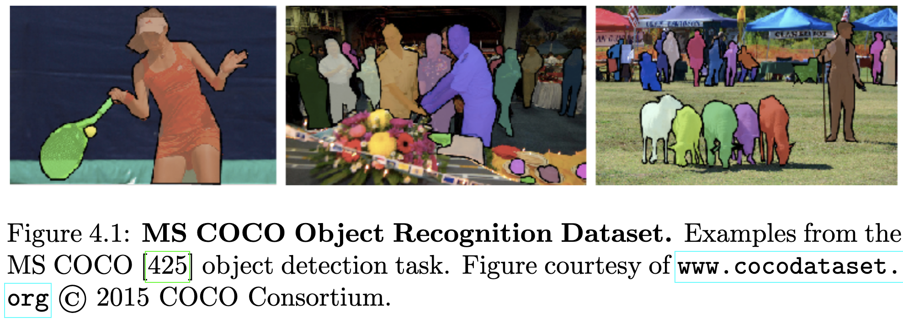
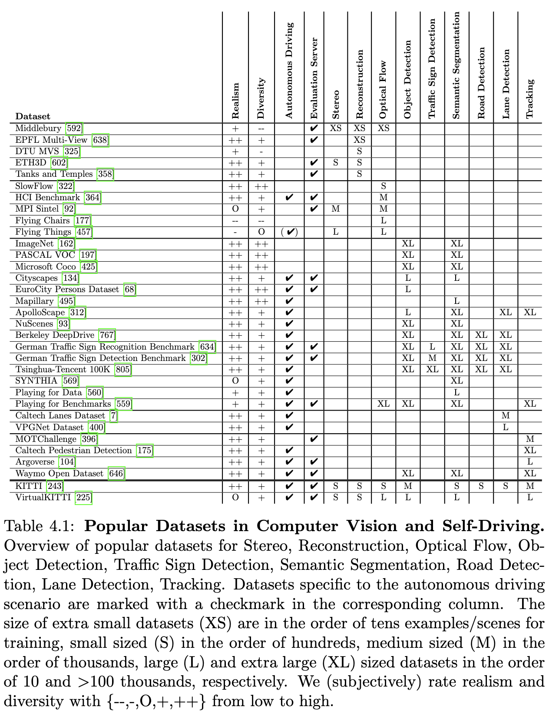
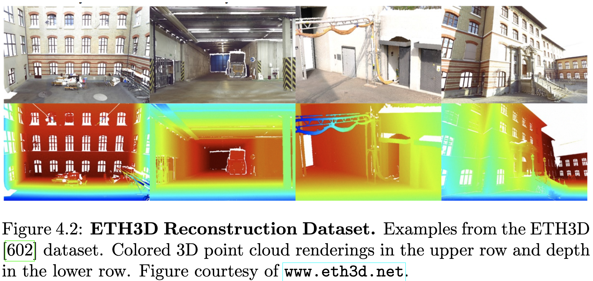
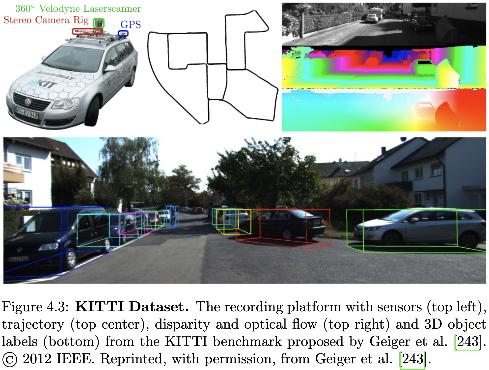
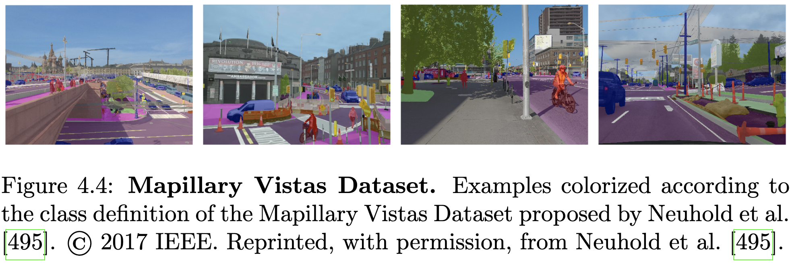
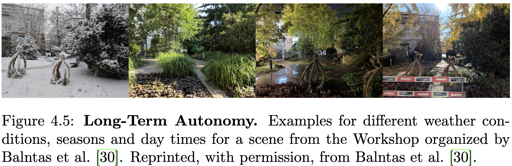
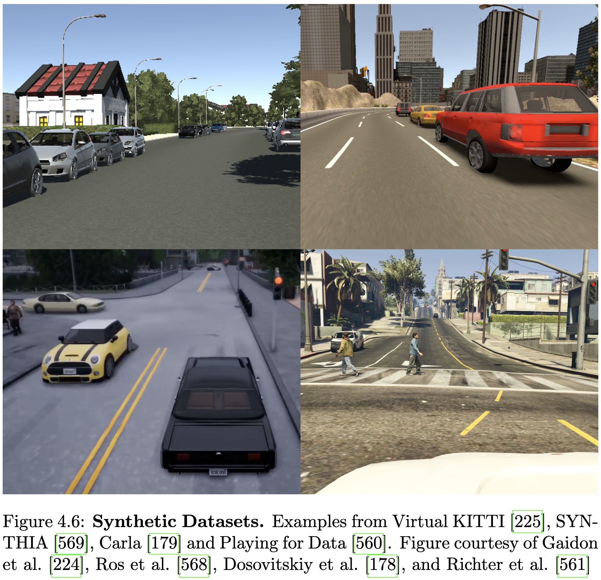

데이터셋은 문제별로 지상 진실(ground truth) 예제를 제공하여 많은 연구 분야의 발전에 핵심적인 역할을 해왔습니다. 다양한 접근 방식에 대한 정량적 평가는 해당 역량과 한계에 대한 중요한 통찰력을 제공합니다. 컴퓨터 비전 분야의 랜드마크 예시로는 스테레오 및 광학 흐름을 위한 Middlebury 벤치마크 [592]와 PASCAL VOC 객체 인식 챌린지 [197]가 있습니다. 특히, 이러한 데이터셋 중 다수 [592, 197, 28, 243, 92, 396, 134, 364, 602]는 홀드아웃된 테스트 세트에서 공정한 비교를 가능하게 하고 해당 분야의 연구자들에게 최신 기술에 대한 개요를 제공하는 온라인 평가 서버도 제공합니다. 이러한 방식으로 현재의 진행 상황과 남아있는 과제를 연구 커뮤니티에서 쉽게 식별할 수 있습니다.

자율주행차 분야에서는 [243, 134, 364, 495, 7, 175, 396]이 재구성, 모션 추정, 인식 작업 및 추적을 위한 도전적인 벤치마크를 도입하여 실험실 설정과 도전적인 실제 상황 간의 격차를 줄이는 데 기여했습니다. Kang et al. [338]은 자율주행과 관련된 다양한 데이터셋 및 테스트 환경에 대한 자세한 개요를 제공합니다.

불과 몇 년 전만 해도 수백 개의 주석이 달린 예제가 있는 데이터셋은 많은 문제에 충분하다고 여겨졌습니다. 수백에서 수천 개의 레이블이 지정된 예제가 있는 데이터셋의 도입은 감독 방식으로 고용량 딥 모델을 훈련할 수 있게 함으로써 많은 컴퓨터 비전 분야에서 놀라운 발전을 가져왔습니다. 그러나 특히 광학 흐름이나 픽셀 수준 주석이 필요한 의미론적 분할과 같은 작업의 경우 대량의 주석이 달린 데이터를 수집하는 것은 쉬운 일이 아닙니다. 광학 흐름의 경우, Scharstein과 Szeliski [592] 및 Baker et al. [28]은 시간이 많이 걸리는 절차를 사용하여 통제된 실험실 환경에서 밀집된 픽셀 수준 주석을 획득하는 반면, Geiger et al. [243] 및 Kondermann et al. [364]은 LiDAR 레이저 스캐너를 사용하여 실제 거리 장면의 희소한 픽셀 수준 주석만 제공할 수 있습니다. Janai et al. [322]은 더 간단한 설정에서 광학 흐름 문제를 해결하기 위해 고속 카메라를 사용하여 임의의 실제 장면에서 밀집된 픽셀 수준 주석을 얻는 다른 접근 방식을 추구했습니다. 최근에는 Amazon의 Mechanical Turk 플랫폼1을 사용한 크라우드소싱이 대규모 데이터셋 주석 작업에 인기를 얻고 있습니다(예: [162, 425, 396, 470, 175]). 그러나 Mechanical Turk를 통해 얻은 주석 품질은 종종 충분하지 않으며, 사후 처리 및 정리 작업에 상당한 노력이 필요합니다.

수동 주석의 대안은 현대 컴퓨터 그래픽 기술에서 제공됩니다. 이 기술은 픽셀 수준의 지상 진실을 가진 대규모 합성 데이터셋을 생성할 수 있습니다. 그러나 사진처럼 사실적인 가상 세계를 만드는 것은 시간과 비용이 많이 듭니다. 그럼에도 불구하고 영화와 비디오 게임의 인기는 매우 사실적인 3D 콘텐츠를 만드는 산업으로 이어졌으며, 이는 합성 데이터셋을 사용하여 실제 데이터를 완전히 대체할 수 있다는 희망을 줍니다. 결과적으로 여러 합성 데이터셋 [92, 177, 457, 225, 569]이 제안되었고 AI 연구자들에 의해 사용되고 있습니다. 그러나 달성된 현실성과 다양성이 실제 데이터셋을 대체하기에 충분할지, 그리고 합성 데이터로 훈련된 모델이 실제 입력에 일반화될 수 있을지는 여전히 미지수입니다. 여기에는 복잡한 객체 모양과 외형뿐만 아니라 직사광선, 반사 표면의 반사, 안개 또는 비와 같은 불리한 환경 조건과 같은 과제가 포함됩니다.

시간에 따른 시스템의 성능 연구는, 예를 들어 환경 변화 또는 드문 상황의 경우, 자율주행 차량에 있어서 또 다른 중요한 측면입니다. 섹션 4.2.6에서는 장기 자율성을 위한 몇 가지 최신 데이터셋을 논의합니다. 이러한 데이터셋의 대부분은 환경 변화에 초점을 맞추지만, 실제 주행에서 대규모 차량군이 기록해야만 포착할 수 있는 드문 상황을 포착하는 것은 더 어렵습니다. 주목할 만한 예외는 오토파일럿 시스템의 테슬라 섀도우 모드 [659]입니다. 이는 백그라운드에서 실행되는 오토파일럿 시스템을 실제 및 특히 드문 상황에서 검증할 수 있도록 하는 휴면 로깅 전용 모드입니다.

다음으로, 우리는 자율주행 차량과 관련된 작업들을 다루는 가장 인기 있는 컴퓨터 비전 데이터셋과 벤치마크를 먼저 소개할 것입니다. 그 다음으로, 섹션 4.2에서는 특히 자율주행 차량에 특화된 데이터셋에 중점을 둘 것입니다. 또한, 표 4.1에서 컴퓨터 비전에서 가장 인기 있는 데이터셋에 대한 자세한 개요를 제공하고, 다음에서 논의할 것입니다.

### 4.1 컴퓨터 비전 데이터셋

이 섹션에서는 자율주행 작업과 관련된 가장 인기 있는 컴퓨터 비전 데이터셋과 벤치마크를 소개합니다. 특히, 객체 인식 및 추적, 스테레오 및 3D 재구성, 광학 흐름 추정을 위한 데이터셋을 논의합니다.

#### 4.1.1 객체 인식

ImageNet [162], PASCAL VOC [197], Microsoft COCO [425]와 같은 대규모 공개 데이터셋의 가용성은 객체 분류, 감지 및 의미론적 분할과 같은 인식 작업을 위한 새로운 컴퓨터 비전 알고리즘, 특히 딥 러닝 기술의 발전을 촉진했습니다.

EU가 지원한 Everingham et al. [197]의 PASCAL Visual Object Classes (VOC) 챌린지2는 객체 분류, 객체 감지, 객체 분할 및 행동 인식을 위한 벤치마크입니다. Flickr에서 수집된 고품질 주석이 달린 도전적인 소비자 사진으로 구성되어 있으며, 자세, 조명 및 가려짐에서 큰 가변성을 포함합니다. VOC 챌린지는 도입 이후 인식 알고리즘 벤치마킹을 위한 가장 인기 있는 테스트베드 중 하나가 되었습니다. 2012년 PASCAL 프로그램이 종료될 때까지 커뮤니티의 요구에 따라 정기적으로 조정되었습니다. 수년에 걸쳐 벤치마크의 규모가 커져 2012년에는 총 11,530개의 이미지에 27,450개의 주석이 달린 객체에 도달했습니다.

2014년, Lin et al. [425]은 객체 감지, 인스턴스 분할 및 상황 추론을 위한 Microsoft COCO 데이터셋3(그림 4.1)을 도입했습니다. 그들은 자연스러운 맥락에서 일반적인 객체를 포함하는 복잡한 일상 장면의 이미지를 제공합니다. 이 데이터셋은 91개의 객체 클래스, 250만 개의 주석이 달린 인스턴스, 그리고 총 32만 8천 개의 이미지를 포함합니다. Microsoft COCO는 PASCAL VOC 객체 분할 벤치마크보다 클래스당 인스턴스 수가 훨씬 많습니다. 모든 객체는 인스턴스별 분할로 주석이 달렸습니다.

ImageNet [162], PASCAL VOC [197], Microsoft COCO [425]는 현재까지 객체 분류, 감지 및 분할을 위한 가장 크고 다양한 데이터셋입니다 (표 4.1).

#### 4.1.2 객체 추적

여러 객체를 추적하기 위해, Leal-Taixé et al. [396]과 Milan et al. [470]이 최초의 중앙 집중식 벤치마크인 MOTChallenge4를 도입했습니다. 이 벤치마크는 고정 및 이동 카메라로 촬영된 제약 없는 환경의 도전적인 비디오 시퀀스 14개를 포함합니다. MOTChallenge는 PETS [206] 및 KITTI [243]와 같은 기존의 여러 다중 객체 추적 벤치마크를 결합합니다. 벤치마크에서 제공하는 공개 감지 기능은 감지기와 무관하게 추적 시스템의 성능을 분석할 수 있도록 합니다.

#### 4.1.3 스테레오 및 3D 재구성

스테레오 비전 및 다중 뷰 재구성을 위해 여러 공개 데이터셋이 있습니다. [592, 593, 591]이 도입한 Middlebury 스테레오 벤치마크5는 스테레오 매칭 알고리즘의 공정한 비교를 위한 통합 테스트베드를 제공하는 것을 목표로 제안되었습니다. 최신 접근 방식의 직접적인 비교를 허용하는 평가 서버가 만들어졌습니다. Middlebury 스테레오 벤치마크가 양안 시야 연구를 촉진하는 데 성공함에 따라 Seitz et al. [607]은 Middlebury 다중 뷰 스테레오(MVS) 벤치마크6를 만들도록 동기 부여를 받았습니다. 이 데이터셋은 등록된 3D 지상 진실 모델과 함께 보정된 고해상도 다중 뷰 이미지로 구성되며 MVS 연구 발전에 핵심적인 역할을 했습니다.

그러나 Middlebury 데이터셋은 스테레오 및 재구성을 위한 다른 데이터셋에 비해 크기와 다양성이 부족합니다(표 4.1). Jensen et al. [325]의 DTU MVS 데이터셋7은 통제된 실험실 환경에서 기록된 124개의 다른 장면을 제공합니다. 참조 데이터는 다른 카메라 위치에서 구조화된 광 스캔을 결합하여 얻습니다. DTU MVS 데이터셋이 사용된 객체의 수와 복잡성 측면에서 Middlebury보다 다양하지만, 이 두 데이터셋 중 어느 것도 실제 장면의 복잡성을 완전히 보여주지는 않습니다.

다중 뷰 스테레오를 실험실 밖으로 옮기려는 목표로, Strecha et al. [638]은 EPFL 다중 뷰 데이터셋 8을 발표했습니다. 이 데이터셋은 5개의 다른 건물과 분수의 이미지 및 LiDAR 스캔으로 구성됩니다.

최근 Schöps et al. [602]은 ETH3D 9 데이터셋(그림 4.2)을 발표했습니다. 이 데이터셋은 다양한 실내 및 실외 장면에 대한 고해상도 DSLR 이미지뿐만 아니라 동기화된 저해상도 스테레오 비디오를 제공합니다. 그들은 [638]과 같이 고정밀 레이저 스캐너를 사용했으며, 강력한 최적화 기술을 사용하여 모든 이미지를 등록했습니다.

마찬가지로 Knapitsch et al. [358]이 발표한 Tanks and Temples10는 고정밀 레이저 스캐너와 두 대의 고해상도 카메라(하나는 글로벌 셔터, 다른 하나는 롤링 셔터)를 사용하여 실외 및 실내 장면에 대한 새로운 데이터셋을 만들었습니다. 이 데이터셋은 조각품, 대형 차량, 주택 규모 건물, 대형 실내 및 실외 장면을 포함하는 14개의 장면으로 구성됩니다.

대규모 재구성을 위해 시간이 지남에 따라 여러 인터넷 사진 컬렉션이 제안되었습니다. 가장 인기 있는 컬렉션은 BigSFM 데이터셋 11에 결합되어 있으며 비엔나 [319], 두브로브니크 [416], 로마 [140]를 포함합니다. 두브로브니크와 로마는 Flickr에서 가져왔지만 비엔나는 보정된 카메라로 기록되었습니다. 대규모 재구성 외에도 이러한 데이터셋은 루프 클로저 감지(섹션 13.4.2) 및 위치 파악 방법(섹션 13.3)을 평가하는 데도 자주 사용됩니다.

#### 4.1.4 광학 흐름

스테레오 비전과 유사하게, Baker et al. [28]의 Middlebury 흐름 벤치마크12는 광학 흐름 접근 방식을 위한 최초의 통합 테스트 환경 및 평가 서버를 제공했습니다. 이 벤치마크는 비강체 움직임이 있는 시퀀스, 합성 시퀀스, 그리고 Middlebury 스테레오 벤치마크의 하위 집합(정적 장면)으로 구성됩니다. 모든 비강체 시퀀스의 경우, 지상 진실 흐름은 객체에 분사된 숨겨진 형광 질감을 추적하여 얻습니다. 다른 광학 흐름 데이터셋(표 4.1)과 비교할 때, Middlebury 흐름 데이터셋은 크기가 제한적이며 기록된 실험실 조건으로 인해 복잡한 구조, 조명 변화, 그림자와 같은 실제적인 어려움이 부족합니다. 또한, Middlebury는 최대 12픽셀의 작은 움직임만 포함하므로 빠른 움직임과 관련된 어려움을 조사할 수 없습니다.

광학 흐름 지상 진실을 획득하는 것은 일반적인 자연 장면에서 광학 흐름 지상 진실을 캡처할 수 있는 센서가 존재하지 않기 때문에 매우 어렵습니다. [243, 364]는 이 목적을 위해 LiDAR 레이저 스캐너를 사용하지만, 희소한 픽셀 수준 주석만 얻고 정적 장면(카메라 움직임만)으로 제한됩니다. Janai et al. [322]은 고속 비디오 카메라에서 정확한 참조 데이터를 얻기 위한 새로운 접근 방식을 제시합니다. 이 방법은 밀집되게 샘플링된 시공간 볼륨을 통해 픽셀을 추적하여 이루어집니다. 이 방법은 도전적인 일상 장면에서 광학 흐름 지상 진실을 획득하고, 모션 블러와 같은 사실적인 효과로 데이터를 증강하여 다양한 조건에서 방법을 비교할 수 있도록 합니다. Janai et al. [322]은 이전 광학 데이터셋보다 훨씬 큰 해상도(1280 × 1024 픽셀)를 가진 동적 장면의 160가지 다양한 실제 시퀀스를 제공합니다.

광학 흐름 지상 진실 획득 문제는 합성 데이터셋을 생성함으로써 해결될 수도 있습니다. 이 목표를 위해 Butler et al. [92]은 오픈 소스 영화 신텔(Sintel), 즉 짧은 애니메이션 영화를 활용합니다. 그들은 광학 흐름 지상 진실과 함께 장면을 렌더링하여 MPI 신텔 광학 흐름 벤치마크13을 만듭니다. 신텔은 1,628프레임으로 구성되며 렌더링 파이프라인의 다른 패스를 사용하여 얻은 다양한 복잡성을 가진 세 가지 다른 데이터셋을 제공합니다. Middlebury와 유사하게, 그들은 비교를 위한 평가 서버를 제공합니다.

광학 흐름 데이터셋의 제한된 크기는 고용량 딥 모델의 훈련을 방해했습니다. 따라서 Dosovitskiy et al. [177]은 컨볼루션 신경망을 훈련하기 위해 Flickr의 무작위 배경 이미지 위에 렌더링된 날아다니는 3D 의자의 간단한 합성 2D 데이터셋을 도입했습니다. 이 데이터셋의 제한된 현실감이 매우 정확한 모델을 학습하는 데 불충분하다는 것이 입증됨에 따라 Mayer et al. [457]은 광학 흐름 지상 진실이 포함된 세 가지 합성 스테레오 비디오 데이터셋으로 구성된 또 다른 대규모 데이터셋을 발표했습니다. FlyingThings3D, Monkaa 및 Driving입니다. FlyingThings3D는 무작위로 생성된 장면에서 무작위 3D 궤적을 따라 날아다니는 일상적인 3D 객체를 제공합니다. KITTI 데이터셋에서 영감을 받아 FlyingThings3D와 동일한 풀의 자동차 모델과 3D Warehouse의 매우 상세한 나무 및 건물 모델을 추가로 사용하는 주행 데이터셋이 생성되었습니다. Monkaa는 MPI Sintel 벤치마크에 사용된 Sintel과 유사한 애니메이션 단편 영화입니다.

합성 광학 흐름 데이터셋은 딥 신경망 훈련을 위한 수많은 예제를 제공하지만, 표 4.1에 나와 있듯이 현실감이 부족하고 다양성이 제한적입니다. 따라서 대규모 합성 데이터셋은 일반적으로 사전 훈련에 사용되며, 그 후 사전 훈련된 모델은 작고 더 사실적인 데이터셋에 대해 미세 조정됩니다.

### 4.2 자율 주행 데이터셋

자율주행 문제를 특별히 해결하기 위해 여러 데이터셋이 제안되었습니다. Geiger et al. [243, 242]이 도입한 KITTI 비전 벤치마크14는 자율주행 환경에서 스테레오, 광학 흐름, 비주얼 오도메트리/SLAM, 3D 객체 감지(그림 4.3)를 위한 최초의 공개 벤치마크였습니다. 이 데이터셋은 고해상도 컬러 및 그레이스케일 스테레오 카메라, Velodyne 3D 레이저 스캐너, 고정밀 GPS/IMU 관성 내비게이션 시스템을 갖춘 자율주행 플랫폼에서 캡처되었습니다.

참조 센서로 사용된 회전식 레이저 스캐너의 한계로 인해 스테레오 및 광학 흐름 벤치마크는 카메라 움직임이 있는 정적 장면에 제한되었습니다. 2015년 버전의 광학 흐름 및 스테레오 벤치마크에서 Menze와 Geiger [462]는 움직이는 모든 차량에 3D CAD 모델을 피팅하여 동적 장면에 대한 지상 진실을 제공합니다. 이 새로운 KITTI 버전은 또한 스테레오와 흐름 지상 진실을 결합하여 새로운 3D 장면 흐름 벤치마크를 형성했습니다. KITTI 객체 감지 챌린지를 위해 특별한 3D 레이블링 도구가 개발되어 7481개의 훈련 이미지와 7518개의 테스트 이미지에서 모든 3D 객체를 3D 경계 상자로 주석 처리했습니다. 객체 감지 벤치마크는 차량, 보행자 및 자전거 운전자 감지 작업으로 분리되어 자율주행 차량과 관련된 가장 중요한 문제에 분석을 집중할 수 있도록 했습니다. 비주얼 오도메트리/SLAM 챌린지는 총 길이 39.2km의 22개의 스테레오 시퀀스로 구성됩니다. 지상 진실 자세는 RTK 보정 신호가 공급된 GPS/IMU 위치 파악 장치를 사용하여 얻습니다.

KITTI 데이터셋은 앞서 언급한 모든 작업, 특히 자율주행 애플리케이션의 맥락에서 표준 벤치마크 중 하나로 자리 잡았습니다. KITTI는 이 작업에서 고려되는 모든 문제에 대한 주석이 달린 데이터와 평가 서버를 제공하지만(표 4.1), 크기가 여전히 비교적 제한적입니다. 따라서 KITTI 데이터셋은 주로 평가 및 미세 조정에 사용됩니다.

최근 자율주행 솔루션 개발에 주력하는 주요 기업들도 주석이 달린 데이터를 공개하기 시작했습니다. 바이두의 자율주행 프로젝트 아폴로는 자율주행을 위한 시뮬레이션, 주석 및 시연 데이터로 구성된 데이터 오픈 플랫폼15를 만들었습니다. ApolloScape 데이터셋 [312]은 의미론적(144K 이미지) 및 인스턴스 분할(90K 이미지), 차선 감지(160K 이미지), 자동차 감지(70K) 및 교통 참가자 추적(100K 이미지)을 위한 주석이 달린 스트리트 뷰 이미지를 제공합니다. 이 데이터셋은 다양한 날씨 조건과 다른 시간대에 걸쳐 방법의 성능을 평가할 수 있도록 합니다.

Nutonomy는 NuScenes 데이터셋16 [93]을 출시했습니다. 이 데이터셋은 의미론적 분할 및 객체 감지를 위한 데이터를 제공합니다. 데이터셋은 1백만 개 이상의 카메라 이미지로 구성됩니다. 그러나 ApolloScape와 NuScenes는 각각 한두 도시에서만 기록되었으므로 다양성이 여전히 제한적입니다.

ARGO AI [104]는 새로운 3D 객체 추적 데이터셋인 Argoverse17를 발표했습니다. 자율주행차 대대가 360도 이미지, 전방 스테레오 이미지, LiDAR, 6-DOF 자세 등 다양한 센서 데이터를 수집했습니다. 또한 290km의 차선 표시와 1만 개의 사람이 주석을 단 추적 객체를 제공합니다.

마지막으로 Waymo Open Dataset18 [646]과 Lyft Level 5 AV Dataset19 [347]이 공개되었으며, 다양한 주행 시나리오에 대한 의미론적 주석 및 객체 감지를 제공합니다. 두 회사는 2D 및 3D 객체 감지 연구를 추진하기 위한 챌린지를 시작했습니다.

#### 4.2.1 객체 감지 및 의미론적 분할

Cordts et al. [134]의 Cityscapes 데이터셋20은 실제 도시 장면의 복잡성을 포착하는 픽셀 수준 및 인스턴스 수준 의미론적 레이블링을 위한 벤치마크 및 대규모 데이터셋을 제공합니다. 5,000개의 이미지에 대해 고품질 픽셀 수준 주석이 제공되며, 20,000개의 추가 이미지는 크라우드소싱을 통해 얻은 거친 레이블로 주석이 달렸습니다. Cityscapes는 방법의 공정한 비교를 위한 평가 서버를 제공하지만, 데이터셋은 크기와 다양성이 제한적입니다.

객체 감지의 경우, Braun et al. [68]은 유럽 12개국의 31개 도시에서 기록된 대규모 데이터셋을 발표했습니다. Cityscapes와 유사하게, 평가 서버는 방법의 공정한 비교를 가능하게 합니다. 그러나 그들은 도시 교통에서 보행자, 자전거 운전자 및 기타 탑승자에 대한 경계 상자, 가려짐 및 방향 주석만 제공합니다.

크라우드소싱 기업 Mapillary21은 전 세계 450만 도로 킬로미터를 커버하는 2억 8,200만 장의 거리 수준 이미지를 수집했습니다. 이 데이터를 기반으로 Mapillary Vistas Dataset 22 [495]가 생성되어 커뮤니티와 공유되었으며, 66개 객체 범주에 대한 밀집된 주석과 37개 클래스에 대한 인스턴스별 레이블이 포함된 25,000장의 고해상도 이미지를 제공합니다(그림 4.4).

객체 감지, 인스턴스 분할, 도로 및 차선 감지를 위한 Berkeley DeepDrive 데이터셋23 [767]은 뉴욕, 버클리, 샌프란시스코 및 베이 에어리어에서 부분적으로 주석이 달린 10만 개의 주행 비디오를 제공합니다. 이 데이터셋은 Cityscapes보다 장면 및 날씨 조건에서 더 다양하지만, 기록에 사용된 도시의 수는 여전히 제한적입니다. 이 맥락에서 Mapillary Vistas Dataset은 의미론적 분할 및 객체 인식을 위한 가장 다양한 자율주행 관련 데이터셋입니다(표 4.1). 그러나 Mapillary Vistas Dataset, ImageNet, PASCAL VOC 및 Microsoft Coco와 같은 데이터셋은 KITTI, Cityscapes 및 Berkeley DeepDrive와 달리 단일 이미지만 제공하므로 방법의 시간적 일관성을 훈련하고 테스트하는 데 덜 적합합니다.

현재까지 3D 의미론적 분할을 위한 데이터셋은 상세한 객체 경계를 주석 처리하는 데 필요한 많은 레이블링 노력으로 인해 크기 [488, 40, 265, 785] 및 클래스 수 [242]가 제한적이었습니다. 최근 Behley et al. [38]은 KITTI Visual Odometry Benchmark [242]를 기반으로 3D 의미론적 분할을 위한 대규모 데이터셋을 제시했습니다. 이전 KITTI 주석과 달리, 그들은 LiDAR의 전체 360도 시야에 대한 밀집된 점 단위 주석을 제공합니다. 이 데이터셋은 25개의 다른 클래스를 가진 20,000개 이상의 스캔으로 구성됩니다.

#### 4.2.2 추적

Dollar et al. [175]이 제안한 Caltech 보행자 감지 벤치마크24는 도시 환경의 일반적인 교통 흐름을 주행하면서 기록된 250,000프레임의 시퀀스를 제공합니다. 350,000개의 바운딩 박스와 2,300명의 고유한 보행자가 주석 처리되었으며, 바운딩 박스 간의 시간적 대응 및 상세한 가려짐 레이블이 포함됩니다.

#### 4.2.3 교통 표지 감지

이전에 논의된 모든 감지 데이터셋이 일반 객체 또는 교통 참가자의 감지에 초점을 맞추는 반면, 교통 표지 인식 및 감지를 위한 데이터셋은 소수에 불과합니다. 이 작업을 위한 가장 인기 있는 데이터셋은 독일 교통 표지 인식 벤치마크(GTSRB25) [634]와 독일 교통 표지 감지 벤치마크(GTSDB26) [302]입니다. GTSRB는 교통 표지를 해당 범주로 분류하는 작업을 고려하며 50,000개의 이미지로 구성됩니다. 이와 대조적으로 GTSDB는 교통 표지 감지 작업을 위해 600개의 훈련 이미지와 300개의 테스트 이미지를 제공합니다. 40가지 다른 클래스에 대한 신뢰할 수 있는 지상 진실 주석은 반자동 주석 도구를 사용하여 생성되었습니다. 최근 최첨단 감지 시스템에 의해 두 데이터셋의 한계에 도달했으며, Zhu et al. [805]은 새로운 교통 표지 감지 벤치마크인 Tsinghua-Tencent 100K27를 발표했습니다. GTSDB와 달리 그들의 벤치마크는 30,000개의 표지가 있는 100,000개의 이미지로 구성됩니다. 그들은 각 교통 표지에 대한 픽셀 마스크 주석 및 경계 상자와 함께 고해상도 이미지를 제공합니다.

#### 4.2.4 도로 및 차선 감지

KITTI 벤치마크는 Fritsch et al. [214]에 의해 도로/차선 감지 작업으로 확장되었습니다. 총 600개의 다양한 훈련 및 테스트 이미지가 도로 및 차선 영역의 수동 주석을 위해 선택되었습니다. Mattyus et al. [455]은 항공 이미지를 사용하여 주차 공간 및 인도와 같은 세분화된 세그먼트 범주와 도로 차선의 수 및 위치로 KITTI 데이터셋을 향상시켰습니다.

차선 감지를 위한 더 큰 데이터셋인 Caltech Lane Detection dataset28는 Aly [7]에 의해 제안되었습니다. 이 데이터셋은 캘리포니아 패서디나에서 다른 시간대에 기록되었으며 1200프레임 이상으로 구성됩니다. 첫 번째 대규모 차선 감지 데이터셋은 Lee et al. [400]에 의해 발표되었으며 20,000개 이상의 이미지를 제공합니다. 이전 데이터셋과 달리 그들은 다른 날씨 조건도 고려합니다. 100,000개의 이미지를 가진 Berkeley DeepDrive dataset29 [767]는 현재까지 가장 크고 다양한 차선/도로 감지 데이터셋입니다.

#### 4.2.5 플로우 및 스테레오

섹션 4.1.4 및 KITTI에서 제시된 데이터셋에 보완적으로, Kondermann et al. [364]이 제안한 HCI 벤치마크30는 자율 주행을 위한 현실적이고 체계적으로 변화하는 방사선 및 기하학적 문제를 포함합니다. 전체적으로 28,504개의 스테레오 쌍과 스테레오 및 흐름 지상 진실이 제공됩니다. HCI 벤치마크의 주요 한계는 모든 시퀀스가 단일 도로 구간에서 기록되었으므로 데이터셋의 다양성이 부족하다는 것입니다. 그러나 통제된 환경은 자율 주행 시스템을 검증하는 데 매우 중요한 사고와 같은 드문 이벤트를 더 쉽게 시뮬레이션할 수 있도록 합니다.

#### 4.2.6 장기 자율성

KITTI 또는 Cityscapes와 같은 여러 데이터셋은 자율주행을 위한 알고리즘 역량 개발에 중점을 두지만, 시간이 지남에 따른 환경 변화와 같은 장기 자율성의 과제를 다루지는 않습니다. 이 문제를 해결하기 위해 Carlevaris-Bianco et al. [96]은 27개의 세션으로 구성된 새로운 장기 비전 및 LiDAR 데이터셋을 발표했습니다. 그러나 이 데이터셋은 차량에서 기록된 것이 아니라 미시간 대학 캠퍼스에서 세그웨이 로봇을 사용하여 기록되었습니다. 장기 자율주행을 위한 새로운 데이터셋은 Maddern et al. [445]에 의해 발표되었습니다. 그들은 옥스포드 중심부에서 1년 동안 1,000km를 주행하면서 이미지, LiDAR 및 GPS 데이터를 수집했습니다. 이를 통해 조명, 날씨 및 계절 변화, 동적 객체 및 건설로 인한 장면 외관의 큰 변화를 포착할 수 있었습니다. 이러한 장기 데이터셋은 그림 4.5에서 보듯이 연중 다른 시간대의 위치 파악과 같은 자율주행 차량 실현을 지연시키는 문제에 대한 심층적인 조사를 가능하게 합니다.

다중 뷰 재구성을 위한 환경 변화를 다루는 여러 데이터셋이 제안되었습니다. 예를 들어, 섹션 4.1.3에서 논의된 구조 기반 모션 데이터셋 BigSFM은 다른 시간에 다른 카메라로 촬영된 인터넷 사진으로 구성됩니다. 최근 Sattler et al. [582]은 다른 날씨 조건, 계절, 밤낮으로 기록된 시각적 위치 파악을 위한 세 가지 데이터셋(Aachen Day-Night, RobotCar Seasons 및 CMU Seasons)을 발표했습니다. Aachen Day-Night 데이터셋은 소비자 카메라를 사용하여 기록된 이미지로 구성되는 반면, RobotCar Seasons 및 CMU Seasons는 차량 장착 카메라를 사용하여 얻어졌습니다. 더 최근에 Scape Technologies31는 저가형 소비자 구형 카메라 [29]를 사용하여 임페리얼 칼리지 런던 캠퍼스 주변에서 캡처한 장기 데이터셋을 발표했습니다. 이 데이터셋은 1년 동안 기록되었으며 다른 날씨 조건, 시간대 및 계절을 포함합니다.

### 4.3 게임 엔진을 이용한 합성 데이터 생성

[92, 457]에서 사용된 애니메이션 영화의 데이터는 콘텐츠 변경이 어렵고 그러한 영화가 오픈 소스인 경우가 거의 없기 때문에 매우 제한적입니다. 또한, [177, 457]에서처럼 3D 모델을 무작위 장면에 렌더링하는 것은 현실감이 부족하고 다양성이 떨어집니다. 이와 대조적으로 게임 엔진은 무한한 양의 더 현실적이고 다양한 데이터를 생성할 수 있습니다.

게임 엔진을 탐구한 최초의 데이터셋 중 하나는 Gaidon et al. [225]이 발표한 Virtual KITTI 데이터셋32입니다. 그들은 실제 시나리오와 유사한 사실적인 프록시 세계를 만들기 위한 실제-가상 세계 클로닝 방법을 제안합니다. 복제된 가상 세계는 날씨나 조명과 같은 조건을 다양하게 변경하고 다른 카메라 설정을 사용할 수 있도록 합니다. 이러한 방식으로 프록시 세계는 딥 네트워크를 훈련하기 위한 가상 데이터 증강에 사용될 수 있습니다. Virtual KITTI는 총 17,000프레임의 고해상도 이미지로 구성된 35개의 사진처럼 사실적인 합성 비디오를 포함합니다. 그들은 객체 감지, 추적, 장면 및 인스턴스 분할, 깊이 및 광학 흐름에 대한 지상 진실을 제공합니다.

동시 작업으로 Ros et al. [569]는 의미론적 분할을 위한 도시 시나리오의 이미지 및 주석의 합성 컬렉션인 SYNTHIA33를 만들었습니다. 그들은 Unity 엔진을 사용하여 가상 도시를 렌더링했습니다. 이 데이터셋은 도시에서 무작위로 촬영된 13,400개의 가상 이미지와 총 200,000프레임의 4개의 비디오 시퀀스로 구성됩니다. 13개 클래스에 대한 픽셀 수준 의미론적 주석이 제공됩니다.

Playing for Data 프로젝트34에서 Richter et al. [560]은 상업용 비디오 게임 Grand Theft Auto V의 이미지에서 픽셀 단위로 정확한 의미론적 레이블 맵을 추출했습니다. 이를 위해 그들은 게임과 그래픽 하드웨어 사이에서 작동하여 시간에 걸쳐 픽셀 단위로 정확한 객체 서명을 얻는 도구를 개발했습니다. 그들의 알고리즘은 사진처럼 사실적인 오픈 월드 컴퓨터 게임에 의해 합성된 25,000개의 이미지에 대해 최소한의 인간 감독으로 밀집된 의미론적 주석을 생성할 수 있도록 합니다. 이 작업은 Playing for Benchmarks35 [559]에서 게임 엔진에서 밀집된 대응점과 의미론적 인스턴스를 얻기 위해 확장되었습니다. 이 벤치마크는 의미론적 분할, 인스턴스 분할, 객체 감지, 추적, 3D 장면 레이아웃, 비주얼 오도메트리 및 광학 흐름에 대한 밀집된 주석이 포함된 약 250,000개의 이미지로 구성됩니다. 그들은 의미론적 분할, 인스턴스 분할, 비주얼 오도메트리 및 광학 흐름을 위한 온라인 평가 서버를 제공합니다. 마찬가지로 Qiu et al. [539]은 Unreal Engine 4의 내부 데이터 구조에 액세스하고 수정하여 가상 세계를 만드는 오픈 소스 도구를 제공합니다. 그들은 가상 세계가 딥 러닝 프레임워크 Caffe [328]와 연결함으로써 딥 러닝 알고리즘을 테스트하는 데 어떻게 사용될 수 있는지 보여줍니다.

최근, 자율주행을 위한 오픈 소스 시뮬레이터인 Carla36가 Dosovitskiy et al. [179]에 의해 소개되었습니다. Carla는 도시 환경에서 자율주행 시스템의 제어 및 인식을 위한 합성 데이터를 생성할 수 있습니다. 엔진 및 디지털 자산에 대한 완전한 액세스는 비상업적 용도로 제공됩니다. Unreal Engine 4를 기반으로 Carla용 확장은 커뮤니티에서 쉽게 통합할 수 있습니다.

Carla [179]와 Playing for Data [560]에서 사용되는 최신 게임 엔진은 그림 4.6에서 보듯이 대규모 모델 훈련을 위한 인상적으로 사실적인 데이터를 생성할 수 있습니다. 실제 데이터와 합성 데이터 사이에는 여전히 큰 격차가 있고 3D 콘텐츠 생성은 비용이 많이 들고 시간이 많이 걸리지만, 게임 엔진은 대규모 데이터셋 생성과 실제 데이터에서는 거의 관찰할 수 없는 위험한 상황 조사를 가능하게 합니다.

