## 5.1 문제 정의

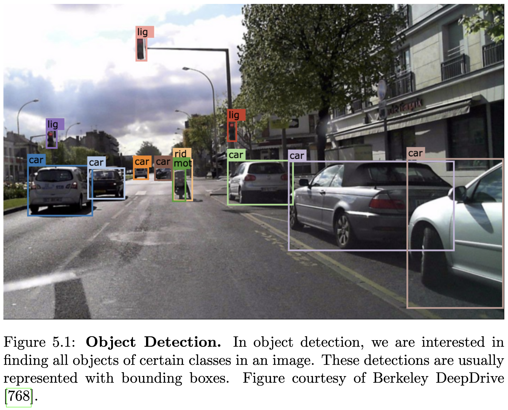

그림 5.1에 나타난 객체의 신뢰할 수 있는 감지는 자율 주행을 실현하는 데 필수적인 요구 사항입니다. 차량이 특히 도시 지역에서 많은 다른 교통 참가자와 도로를 공유하기 때문에 생명을 위협하는 사고를 피하기 위해서는 다른 교통 참가자나 장애물에 대한 인식이 필요합니다. 도시 지역에서의 감지는 객체 외관의 다양성과 다른 객체 또는 관심 객체 자체에 의해 발생하는 가려짐 때문에 어렵습니다. 또한, 객체들이 서로 또는 배경과 유사하게 보이거나 그림자나 반사와 같은 물리적 효과로 인해 객체 감지가 어려워질 수 있습니다.

신뢰할 수 있는 보행자 감지는 복잡하고 매우 다양한 움직임, 그리고 다양한 의복과 관절 자세로 인한 다양한 외관 때문에 특히 어렵습니다. 또한, 보행자들의 상호 작용은 종종 부분적인 가려짐을 유발합니다. 이 문제는 도로 안전을 높이기 위한 고급 운전자 보조 시스템 등에서 깊이 연구되어 왔습니다. 보행자 보호 시스템(PPS)은 움직이는 차량 주변의 정지 및 이동 중인 사람의 존재를 감지하여 운전자에게 위험한 상황에 대해 경고합니다. Geronimo et al. [247]은 고급 운전자 보조 시스템을 위한 보행자 감지에 대해 조사했습니다. 운전자는 PPS의 감지 누락을 여전히 처리할 수 있지만, 자율 주행차는 모든 기상 조건에 견고하고 실시간 감지에 효율적인 완벽한 보행자 감지 시스템이 필요합니다.

객체 감지 문제는 다양한 입력 모달리티를 사용하여 접근되었습니다. 비디오 카메라는 객체 감지를 위한 가장 저렴하고 일반적으로 사용되는 센서 유형입니다. 가시 스펙트럼(VS)은 일반적으로 주간 감지에 사용되며, 적외선 스펙트럼은 야간 감지에 더 많은 가시성을 제공합니다 [640]. 열적 적외선(TIR) 카메라는 상대 온도를 캡처하여 보행자와 같은 따뜻한 객체를 식물이나 도로와 같은 차가운 객체와 구별할 수 있습니다. 레이저 스캐너와 같이 신호를 방출하고 그 반사를 관찰하는 능동 센서는 객체를 감지하고 3D로 지역화하는 데 도움이 되는 거리 정보를 제공할 수 있습니다. 그러나 레이저 스캐너는 비디오 카메라에 비해 해상도가 작은 경우가 많습니다. 날씨 조건, 시간, 재료 특성에 따라 단일 센서 유형에만 의존하는 것은 문제가 될 수 있습니다. VS 카메라와 레이저 스캐너는 반사 또는 투명 표면에 영향을 받는 반면, 뜨거운 물체(엔진 등) 또는 따뜻한 온도는 TIR 카메라에 영향을 줄 수 있습니다. 센서 융합 [191, 116, 254]을 통해 다른 센서의 정보를 결합하면 이러한 상호 보완적인 정보를 견고하게 통합할 수 있습니다.

## 5.2 방법론

고전적인 객체 감지 시스템은 일반적으로 객체 감지 작업을 해결하기 위해 연속적으로 적용되는 여러 단계로 구성됩니다. 딥러닝 신경망의 성공으로 이러한 단계 [613, 252, 286, 251]의 대부분, 심지어 전체 파이프라인조차 학습된 모델 [612, 552, 548, 430, 549, 424]로 대체되었습니다. 우리는 고전적인 파이프라인부터 논의를 시작한 다음, 더 현대적인 접근 방식을 다룰 것입니다.

### 5.2.1 고전적 파이프라인

고전적인 감지 파이프라인은 일반적으로 전처리, 관심 영역 추출(ROI), 객체 분류 및 검증 또는 개선 단계를 포함합니다. 전처리 단계에서는 노출 및 게인 조정, 카메라 캘리브레이션 및 이미지 정류와 같은 작업이 일반적으로 수행됩니다. 일부 접근 방식은 공동 감지 및 추적 시스템과 함께 시간 정보를 활용합니다. 추적 접근 방식은 6장에서 심층적으로 논의합니다.

관심 영역은 다양한 스케일에서 이미지 위로 창을 이동시키는 슬라이딩 윈도우 접근 방식을 사용하여 추출할 수 있습니다. exhaustive search(전체 탐색)는 매우 비용이 많이 들기 때문에 탐색 공간을 줄이기 위한 여러 휴리스틱이 제안되었습니다. 일반적으로, 특정 비율, 크기 및 후보 바운딩 박스의 위치를 가정하여 평가 횟수를 줄입니다. 이 외에도 이미지 특징, 스테레오 또는 광학 흐름을 활용하여 관련 영역에 대한 탐색을 집중할 수 있습니다. 예를 들어 Broggi et al. [76]은 형태학적 특성(크기, 비율, 모양), 인간 형상의 수직 대칭성, 스테레오에서 얻은 거리 정보를 활용하여 관련 ROI를 추출합니다. Selective Search [675]는 관심 영역을 생성하는 대안적인 접근 방식입니다. 전체 이미지 도메인에 대한 exhaustive search 대신, 선택적 탐색은 이미지의 분할을 활용하여 근사 위치를 효율적으로 추출합니다. 더 자세한 논의는 슬라이딩 윈도우 접근 방식에 초점을 맞춰 단안 이미지에서 보행자 감지 시스템에 대한 광범위한 평가를 제시한 Dollar et al. [172]을 참조하시기 바랍니다.

다음 단계는 슬라이딩 윈도우에서 후보 이미지 영역을 처리하여 확인하고 객체를 분류하는 것입니다. 이미지의 모든 후보를 분류하는 것은 처리해야 할 이미지 영역의 방대한 양 때문에 상당히 비용이 많이 들 수 있습니다. 따라서 이미지의 배경 영역에 있는 후보를 빠르게 제거하는 빠른 결정이 필요합니다. Viola et al. [689]은 AdaBoost를 사용하여 학습된 간단하고 효율적인 분류기를 캐스케이드로 결합하여 유망한 영역에 더 많은 시간을 할애하면서 잘못된 후보를 빠르게 제거할 수 있도록 합니다. Dalal과 Triggs [152]의 작업과 함께 방향 히스토그램(HOG) 특징과 결합된 선형 서포트 벡터 머신(SVM)은 분류를 위한 인기 있는 도구가 되었습니다. Enzweiler와 Gavrila [189]는 단안 보행자 감지를 위한 고전적인 접근 방식에 대한 개요를 제공합니다. 그들은 HOG 특징을 사용한 SVM이 고해상도에서 잘 작동하지만, 저해상도에서 우수하고 실시간에 가까운 성능을 달성하는 캐스케이드 접근 방식보다 처리 시간이 더 길다는 것을 관찰합니다. Benenson et al. [43]은 그들의 감지 접근 방식에 대한 조사에서 특정 유형의 분류기(예: SVM 또는 의사 결정 트리)가 다른 어떤 것보다 더 적합하다는 명확한 증거를 찾지 못했습니다. 특히, Wojek와 Schiele [721]는 충분한 특징이 주어지면 AdaBoost와 선형 SVM이 대략 동일한 성능을 보인다는 것을 보여줍니다. Benenson et al. [43]은 분류 문제의 성능에 있어서 특징의 수와 다양성이 중요한 요소라고 결론지었습니다. 이는 고차원 표현으로 인해 분류 문제가 더 쉬워지기 때문입니다. 결과적으로 오늘날 모든 최첨단 객체 감지 시스템은 컨볼루션 신경망을 사용하여 대규모 데이터셋 [94, 739, 804, 755, 115, 552, 251]에서 표현력 있는 특징을 엔드투엔드 방식으로 학습합니다.

다중 큐 객체 감지: 대부분의 객체 감지 시스템이 단일 이미지를 입력으로 사용하는 반면, 시간 및 구조 정보와 같은 여러 큐를 사용하면 성능을 향상시킬 수 있음을 보여주는 몇 가지 접근 방식이 있습니다. 비디오 시퀀스의 시간 정보는 감지 작업을 더 잘 해결하기 위한 중요한 추가 제약을 제공할 수 있습니다. Shashua et al. [620]은 감지 시스템에 시간에 따라 측정된 추가 큐(동적 보행, 움직임 시차) 및 상황별 특징(특정 자세에서의 다리 위치 등)을 통합하여 더 신뢰할 수 있는 감지를 얻습니다. Wojek et al. [719]은 움직임 큐를 통합하고 다른 보완적인 특징 유형을 결합하여 감지 성능의 상당한 향상을 보여줍니다. 두 프레임 간의 밀집된 대응(광학 흐름) [695] 또는 6장에서 논의된 공동 추적은 동일한 객체에 대한 더 많은 정보를 시간에 걸쳐 통합할 수 있기 때문에 상당한 성능 향상을 가져옵니다. 구조 정보는 관심 영역을 생성하고 분류를 개선하기 위한 객체 모양에 대한 추가 정보를 제공하는 데 도움이 될 수 있습니다. 이 목표를 위해 Keller et al. [341]은 스테레오 이미지에서 객체를 공동으로 감지하고 밀집된 깊이 맵을 추정합니다.

훈련 데이터 증강을 위한 생성 모델: 객체 감지는 일반적으로 감독 학습 작업으로 공식화되므로 좋은 성능을 얻으려면 대량의 주석이 달린 훈련 데이터가 필요합니다. 불행히도 대상 클래스에 속하는 예제를 생성하는 것은 수동 레이블링 때문에 일반적으로 시간이 많이 걸리는 반면, 음성 예제는 더 쉽게 얻을 수 있습니다. Enzweiler와 Gavrila [190]는 학습된 생성 모델로 합성된 가상 샘플을 생성하여 이 병목 현상을 해결합니다. 생성 모델은 일련의 일반적인 자세에 대한 확률적 모양 및 텍스처 모델로 구성됩니다. 판별 모델로 그들은 신경망 [717]과 Haar 특징을 가진 SVM [509]을 고려하여 접근 방식의 일반성을 보여줍니다. 생성 모델은 보행자 클래스에 대한 사전 지식을 포착하고 분류 성능의 상당한 향상을 허용합니다.

### 5.2.2 부분 기반 접근 방식

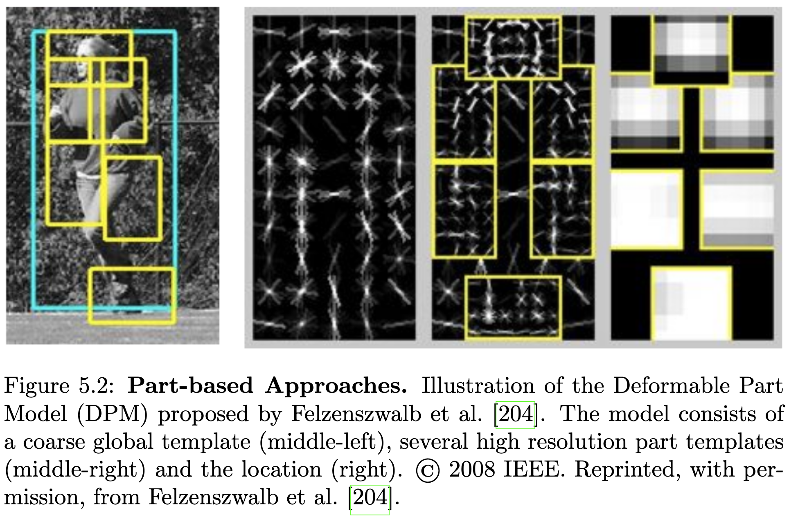

관절형 객체의 외형을 학습하는 것은 모든 가능한 관절을 고려해야 하므로 어렵습니다. 부분 기반 접근 방식의 아이디어는 그림 5.2에서 보듯이 인간과 같이 비강체적으로 움직이는 객체의 복잡한 외형을 더 간단한 부분으로 분할하고 이러한 부분을 사용하여 관절을 표현하는 것입니다. 이것은 더 큰 유연성을 제공하고 각 부분의 외형을 학습하는 데 필요한 훈련 예제의 수를 줄입니다.

Felzenszwalb et al. [204]의 변형 가능한 부분 모델(DPM)은 객체의 복잡한 외형을 더 쉬운 부분으로 분해하려고 시도합니다. 분류기로 그들은 모델 구성(부분 위치)을 나타내는 잠재 구조 변수를 가진 SVM을 훈련하며, 이는 훈련 시 추론되어야 합니다. 그들은 전체 객체를 덮는 거친 전역 템플릿과 각 부분의 외형을 모델링하기 위한 고해상도 부분 템플릿을 사용합니다. 이 표현의 대안은 Leibe et al. [402]이 제안한 암시적 형상 모델입니다. 이 모델은 객체 형상의 매우 유연한 표현을 학습합니다. 그들은 관심 지점 주변에서 로컬 특징을 추출하고 클러스터링을 수행하여 고려 중인 특정 객체 클래스에 특징적인 로컬 외형의 코드북을 구성합니다. 마지막으로, 그들은 각 객체에 대한 코드북 항목의 발생을 학습합니다. 그러나 Benenson et al. [43]은 그들의 감지 접근 방식에 대한 조사에서 [204, 402]와 같은 부분 기반 모델이 Dalal과 Triggs [152]의 훨씬 간단한 접근 방식에 비해 결과가 약간만 향상된다는 것을 관찰합니다.

논의된 부분 기반 모델은 서로 다른 객체, 그 부분 및 장면 간의 관계를 나타낼 수 없습니다. 예를 들어, 가려짐에 대해 추론하는 데 필요합니다. 일반적으로 탐지된 객체를 3D 장면에 컨텍스트화하는 별도의 컨텍스트 모델 [299, 671, 163, 759]이 학습됩니다. 이와 대조적으로 Wu et al. [731]은 재구성 가능한 계층에서 큰 구조적 및 외형적 변화를 나타내기 위한 문법을 포함하는 And-Or 모델을 학습할 것을 제안합니다. 학습된 모델은 컨텍스트와 가려짐을 모두 나타내기 위해 다중 차량, 단일 차량 및 부분 수준에서 구조적 및 외형적 변화를 공동으로 고려합니다.

### 5.2.3 감지를 위한 딥 러닝

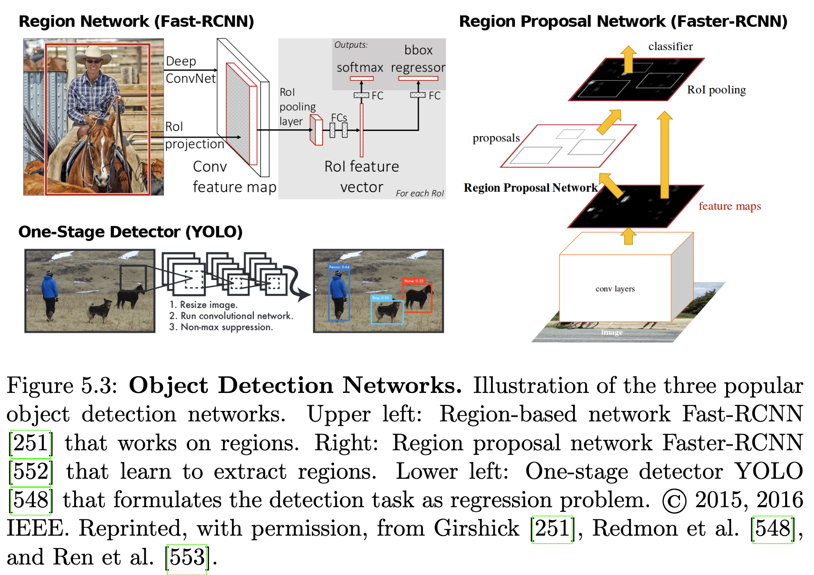

이전의 모든 방법은 설계하기 어렵고 표현 능력이 제한적인 수제 특징에 의존합니다. 딥 러닝 [367]의 부흥과 함께 컨볼루션 신경망이 객체 감지 문제에 적용되어 성능이 크게 향상되었습니다. 가장 인기 있는 세 가지 아키텍처의 예시는 그림 5.3에 나와 있습니다.

Sermanet et al. [613]은 컨볼루션 희소 오토인코더를 사용하여 비지도 방식으로 표현력 있는 특징 추출을 학습함으로써 CNN을 보행자 감지 문제에 도입했습니다. 결국, 그들은 슬라이딩 윈도우 방식으로 특징을 추출하고 오토인코더를 공동으로 미세 조정하면서 엔드투엔드 지도 방식으로 분류기를 훈련합니다. 그러나 그들은 작은 수용장을 가진 얕은 네트워크를 사용하는데, 이는 슬라이딩 윈도우 접근 방식을 사용하여 객체의 정밀한 위치를 가능하게 합니다. 이와 대조적으로, 더 큰 수용장을 가진 더 깊은 네트워크는 로컬 정보가 이전 계층에서 추출되고 고수준 정보가 더 깊은 계층에서 표현되기 때문에 정밀한 위치를 복잡하게 만듭니다. 따라서 Girshick et al. [252]은 "영역을 사용한 인식" 패러다임을 통해 CNN 위치 문제 해결을 위해 R-CNN을 제안합니다. 그들은 선택적 탐색 [675]을 사용하여 많은 영역 제안을 생성하고, CNN을 사용하여 각 제안에 대한 고정 길이 특징 벡터를 추출하고, 선형 SVM으로 각 영역을 분류합니다. 영역 기반 CNN은 계산 비용이 많이 들지만, 계산 부담을 줄이기 위한 여러 개선 사항이 제안되었습니다 [286, 251]. He et al. [286]은 공간 피라미드 풀링을 사용하여 전체 이미지에 대한 컨볼루션 특징 맵을 CNN을 한 번만 실행하여 계산할 수 있도록 합니다. 이는 많은 이미지 영역에 적용해야 하는 R-CNN과 대조됩니다. Girshick [251] (Fast-RCNN)은 객체 제안 분류 및 공간 위치 개선을 공동으로 학습하는 다중 작업 손실을 사용하는 단일 단계 훈련 알고리즘을 제안함으로써 이러한 결과를 더욱 향상시킵니다.

영역 기반 CNN에서 고전적인 영역 제안 알고리즘은 여전히 주요 계산 병목 현상이었고 성능을 제한하는 주요 요인이었습니다. 따라서 Ren et al. [552] (Faster-RCNN)는 탐지 네트워크와 전체 이미지 컨볼루션 특징을 공유하여 추가 계산 비용을 발생시키지 않는 영역 제안 네트워크(RPN)를 도입했습니다. RPN은 고품질 영역 제안을 생성하도록 엔드투엔드 방식으로 훈련되며, Fast R-CNN 탐지기 [251]를 사용하여 분류됩니다.

결국, 단일 단계 탐지기 [612, 548, 430, 549, 424]는 객체 탐지 작업을 회귀 문제로 공식화함으로써 영역 제안 단계를 완전히 제거했습니다. Sermanet et al. [612]의 첫 번째 단일 단계 탐지기는 슬라이딩 윈도우 접근 방식의 딥 컨볼루션 버전이었습니다. 그들은 CNN으로 특징을 추출하고 AlexNet [367] 기반의 분류기 네트워크를 추출된 특징 맵에 슬라이딩 윈도우 방식으로 적용합니다. Redmon et al. [548] (YOLO)은 대신 GoogLeNet [651] 기반 네트워크의 최상위 특징 맵에서 공간적으로 분리된 경계 상자와 클래스 확률을 공동으로 학습할 것을 제안합니다. 이를 통해 실시간 성능을 달성할 수 있었고, 결국 YOLO9000 [549]은 영역 제안 네트워크를 능가했습니다. Liu et al. [430]은 다른 스케일의 특징 맵을 통합하고 고정된 경계 상자 집합을 고려함으로써 정확도와 효율성을 더욱 향상시켰습니다. 그러나 단일 단계 탐지기 [612, 548, 430, 424]는 영역 제안 알고리즘과 경쟁할 수 없었습니다. 성능 격차의 한 가지 이유는 전경-배경 클래스 불균형 [424]입니다. 이 문제를 완화하고 훈련을 개선하기 위해 Lin et al. [424]은 쉬운 예제의 기여를 줄일 수 있는 동적으로 스케일링되는 교차 엔트로피 손실을 제안합니다.

이전의 모든 단일 단계 탐지기는 이미지 위에 밀집하게 배치되고 회귀를 사용하여 검증 및 개선되는 앵커 경계 상자를 사용합니다. 이와 대조적으로 Law와 Deng [393]은 모든 경계 상자의 왼쪽 상단 및 오른쪽 하단 모서리에 대한 히트맵을 직접 예측할 것을 제안합니다. 마지막으로, 그들은 동일한 경계 상자에 속하는 모서리를 식별해야 합니다. 이 목표를 위해 그들은 동일한 경계 상자의 모서리에 대해 유사한 임베딩 벡터를 예측하도록 네트워크를 훈련하여 임베딩 간의 거리에 따라 모서리를 그룹화할 수 있도록 합니다.

CNN 기반 접근 방식에도 부분 기반 모델이 도입되었습니다. Zhang et al. [783]은 선택적 탐색 알고리즘에서 얻은 하향식 제안으로부터 깊은 컨볼루션 특징을 추출하고 부분 외관 모델을 학습할 것을 제안합니다. 이를 통해 부분 간의 기하학적 제약을 적용하고 이전 방법보다 뛰어난 성능을 발휘할 수 있습니다.

### 5.2.4 실시간 보행자 감지

보행자와의 잠재적 충돌 시 빠른 감지 시스템은 자율 시스템의 조기 개입을 가능하게 합니다. 고전 문헌에서 Benenson et al. [42]은 스케일 처리를 개선하고 스테레오에서 추출한 깊이를 활용하여 빠른 보행자 감지를 제공합니다. 이미지 크기를 조정하는 대신, Viola와 Jones [690]와 유사하게 HOG 특징을 스케일링합니다. 그러나 최근 CNN 기반 접근 방식은 GPU에서의 강력한 병렬 처리 덕분에 실시간 효율성도 달성했습니다. Fast R-CNN [251]은 0.5Hz에서만 적용될 수 있었지만, 영역 제안 네트워크 Faster-RCNN [552]을 사용한 더 빠른 버전은 이미 17Hz를 달성합니다. 마지막으로 YOLO9000 [549]은 288 × 288 픽셀 해상도에서 최대 90Hz로 적용될 수 있으며 544 × 544 픽셀 해상도에서 40Hz를 달성합니다.

### 5.2.5 인간 자세 추정

사람의 자세는 자율주행차에게 해당 사람의 행동 및 의도에 대한 중요한 정보를 제공합니다. 그러나 자세 추정 문제는 자세 공간이 매우 넓고, 일반적으로 사람들은 크기와 차량과의 거리 때문에 낮은 해상도로만 관찰될 수 있기 때문에 어렵습니다. 사람의 자세와 신체 부위를 공동으로 추정하는 여러 접근 방식이 제안되었습니다. 전통적으로 [528, 253, 645]에서처럼 신체 부위를 먼저 감지한 다음 자세를 추정하는 두 단계 접근 방식이 사용되었습니다. 이는 사람들이 서로 가까이 있을 때 신체 부위가 다른 인스턴스에 잘못 할당될 수 있기 때문에 문제가 됩니다.

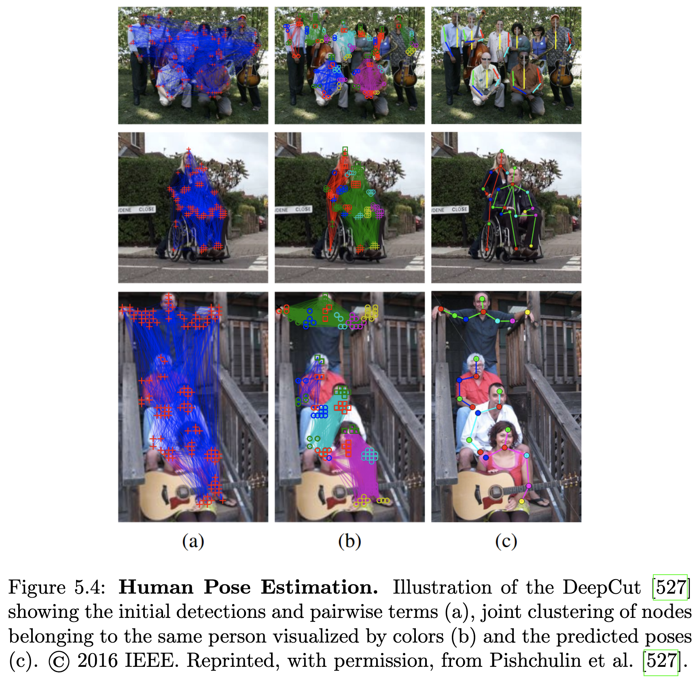

Pishchulin et al. [527]은 그림 5.4에 시각화된 DeepCut을 제시합니다. 이 모델은 이미지에 있는 모든 사람의 자세를 공동으로 추정합니다. 이 공식화는 CNN 기반 부분 감지기에서 얻은 신체 부분 가설 집합을 분할하고 레이블링하는 것을 기반으로 합니다. 이 모델은 사람의 수, 자세, 공간적 근접성 및 부분 수준 가려짐을 공동으로 추론합니다. Bogo et al. [59]은 DeepCut을 사용하여 단일 제약 없는 이미지에서 인체의 3D 자세 및 3D 모양을 추정합니다. 이 목표를 위해 Loper et al. [433]이 제안한 3D 신체 모양 모델인 SMPL은 DeepCut의 2D 신체 관절 위치 예측에 맞춰집니다. SMPL은 인구 전체의 인간 형상 상관 관계를 포착하여 약한 관찰이 있어도 인간 자세를 견고하게 맞출 수 있도록 합니다.

### 5.2.6 교통 표지 감지

교통 표지의 신뢰할 수 있는 감지 및 인식은 자율 주행 차량에 필수적입니다. Stallkamp et al. [634]의 독일 교통 표지 인식 벤치마크(GTSRB)와 Houben et al. [302]의 독일 교통 표지 감지 벤치마크(GTSDB)는 교통 표지 감지를 위한 가장 인기 있는 데이터셋입니다. 그러나 최근 CNN은 이미 100%의 재현율과 정밀도로 GTSRB 및 GTSDB의 한계에 도달했습니다. 따라서 Zhu et al. [805]은 최근 새로운 교통 표지 감지 벤치마크인 Tsinghua-Tencent 100K를 발표하여 커뮤니티에 새로운 도전 과제를 제시했습니다.

교통 표지 감지를 위해 SVM [446], 패턴 매칭 기술 [78], 방사형 대칭 감지기 [35] 및 적분 채널 특징 [174, 452]과 같은 투표 방식 등 여러 객체 감지기가 고려되었습니다. 그러나 딥 러닝의 최근 발전은 더 나은 교통 표지 분류기 [127, 614, 128, 330]로 이어졌습니다. Ciresan et al. [127]은 이미지를 훈련한 CNN과 HOG 특징 기술자를 훈련한 MLP로 구성된 위원회를 제안하여 교통 표지를 분류합니다. 이와 대조적으로 Sermanet과 LeCun [614]은 수제 특징(예: HOG) 대신 의미 있는 특징을 학습하기 위해 다중 스케일 CNN을 제안합니다. 더 빠른 훈련을 위해 Jin et al. [330]은 SVM의 목적 함수와 유사한 비용 함수를 가진 확률적 경사 하강법을 제시합니다. [613]과 유사하게 Aghdam et al. [3]은 CNN을 사용하여 특징을 추출하는 슬라이딩 윈도우 감지기를 제안합니다. 그러나 그들은 여러 해상도에서 확장된 컨볼루션을 사용하여 CNN을 적용하여 다른 스케일에서 교통 표지 감지를 학습합니다. 마지막으로, 그들은 추출된 특징을 분류하기 위해 완전 연결 계층을 가진 컨볼루션 네트워크를 훈련합니다.

García et al. [233]은 인기 있는 GTSDB 데이터셋에서 일반 객체 감지기를 비교합니다. 영역 기반 네트워크 [252, 286, 251]와 단일 스테이지 일반 감지기 [548, 549, 424]는 작은 스케일의 교통 표지에서 어려움을 겪습니다. 교통 표지는 크기, 거리 및 가려짐에 따라 이미지에서 매우 작게 나타날 수 있습니다. 영역 제안 네트워크 [552]는 일반 감지기 중 최고의 성능을 보이며, Inception V2 [318]와 결합하여 특징 추출 시 GTSDB에서 [3]과 유사한 결과를 달성합니다. Yang et al. [758]은 Faster-RCNN [552]을 교통 표지 감지 작업에 적응시켜 거친-미세 방식으로 영역 제안을 추출합니다. 더 미세한 영역 제안 네트워크를 사용하기 전에 RoI를 대략적으로 찾고 분류하기 위한 새로운 주의 네트워크가 제안됩니다. 이를 통해 GTSDB와 Tsinghua-Tencent 100K 데이터셋 모두에서 Faster-RCNN보다 성능을 향상시킬 수 있었습니다.

### 5.2.7 2D 이미지에서 3D 객체 감지

객체 클래스의 기하학적 3D 표현은 2D 또는 3D 경계 상자보다 훨씬 더 많은 세부 정보를 복구할 수 있지만, 오늘날 대부분의 객체 감지기는 견고한 2D 매칭에 초점을 맞추고 있습니다. 이와 대조적으로 Zia et al. [808]은 많은 중요한 클래스에 대해 고품질 3D CAD 모델을 사용할 수 있다는 사실을 활용합니다. 이 모델에서 그들은 주성분 분석을 사용하여 거친 3D 와이어프레임 모델을 얻고 와이어프레임 정점을 위한 감지기를 훈련합니다. 테스트 시에는 감지기를 밀집하게 적용하여 정점에 대한 증거를 생성합니다. Zia et al. [809]은 이 작업을 확장하여 상세한 3D CAD 모델을 그들의 공식에 직접 사용하고, 이를 가능한 가려짐 패턴의 명시적 표현과 결합합니다. 또한, 자세 추정 과정을 안정화하기 위해 지상면이 공동으로 추정됩니다. 이 확장은 의사 3D 모델 [808]보다 뛰어난 성능을 보이며 진정한 미터법 3D 공간에서 추론하는 이점을 보여줍니다.

이러한 3D 표현은 객체에 대한 더 표현력 있는 설명을 제공하지만, 2D 경계 상자를 사용하는 최첨단 감지기와는 아직 경쟁할 수 없습니다. 이 문제를 극복하기 위해 Pepik et al. [514]는 3D 기하학적 표현과 실제 이미지에 대한 견고한 매칭을 결합한 변형 가능한 부분 모델 [204]의 3D 확장을 제안합니다. 그들은 또한 관심 있는 객체 클래스의 3D CAD 정보를 기하학적 단서로 추가하여 외관 모델을 풍부하게 합니다.

쿤두 외 [377]는 2D 객체 제안을 완전한 3D 형상 및 자세로 매핑하기 위해 CNN을 훈련합니다. 그들은 Faster-RCNN/Network-on-Convolution [552, 554] 아키텍처에 3D 형상 및 3D 자세 예측을 위한 영역별 서브네트워크를 추가합니다. 문제를 용이하게 하기 위해 CAD 모델에서 저차원 형상 공간을 학습하고 이를 형상 사전으로 사용합니다. 3D 형상 추정은 일련의 저차원 형상 매개변수 예측 문제로 공식화됩니다. 미분 가능한 렌더링-비교 손실을 통해 2D 감독(인스턴스 분할 또는 깊이)에서 3D 형상 및 자세를 학습할 수 있습니다. 이와 대조적으로 쿠 외 [370]는 CAD 모델의 주석이 달린 데이터셋에 대한 의존성을 피하기 위해 LiDAR 포인트 클라우드를 감독으로 사용하는 더 유연한 접근 방식을 제안합니다. 그들은 MS-CNN [94]의 2D 감지를 사용하고 Faster-RCNN [552] 기반 모델을 학습하여 무달, 방향성 있는 3D 경계 상자를 회귀합니다. 만하트 외 [447]도 먼저 [552] 기반 아키텍처를 사용하여 2D 감지를 추출합니다. 그들은 단안 깊이 예측 [521]을 사용하여 거리 추론을 안내하면서 2D 감지, 방향 및 스케일 추정을 3D 공간으로 올리기 위한 완전히 미분 가능한 매핑을 제안합니다.

### 5.2.8 3D 포인트 클라우드에서 3D 객체 감지

카메라와 달리 레이저 거리 센서는 정확한 3D 정보를 직접 제공하여 객체 후보 추출을 단순화하고 3D 형상 정보를 제공하므로 분류 작업에 도움이 될 수 있습니다.

Li et al. [411]은 범위 데이터에서 차량을 감지하기 위해 완전 컨볼루션 신경망을 활용합니다. 그들은 점의 3D 위치를 인코딩하는 채널이 있는 원통형 이미지와 유사하게 3D 범위 데이터의 2D 표현을 사용합니다. 이 표현이 주어지면 단일 2D CNN을 사용하여 객체성 신뢰도와 경계 상자를 동시에 예측합니다. 이와 대조적으로 Wang과 Posner [697]는 일반적인 2D 슬라이딩 윈도우 감지 접근 방식을 3D 데이터에 적용하기 위한 효율적인 방식을 제안합니다. 더 구체적으로, 그들은 공간을 3D 복셀 그리드로 이산화하고 전체 3D 포인트 클라우드에 대한 컨볼루션과 동일한 것으로 나타난 선형 분류기 위에 투표 방식을 사용하여 문제의 희소한 특성을 활용합니다. Engelcke et al. [188]은 3D 포인트 클라우드 전반에 걸쳐 희소 컨볼루션을 적용하기 위한 새로운 컨볼루션 레이어를 구현하여 이 특징 중심 투표 방식을 확장합니다. 또한 그들은 ReLU 비선형성과 L1 페널티를 사용하여 중간 표현의 희소성을 장려합니다. [697, 188]이 복셀에서 수동으로 특징을 추출하는 반면, Zhou와 Tuzel [797]의 VoxelNet은 엔드투엔드 훈련 가능한 딥 네트워크에서 특징을 학습합니다. 그들은 복셀의 점에 대한 통합 특징 표현을 학습하는 복셀 특징 인코딩 레이어를 제안합니다. 결국, 영역 제안 네트워크는 이러한 특징 표현에서 감지를 생성합니다.

레이저 거리 데이터에만 의존하는 것은 레이저 스캔의 제한된 밀도와 외형 정보 부족으로 인해 감지 작업을 어렵게 만듭니다. 따라서 기존 LiDAR 기반 접근 방식은 KITTI의 2D 감지 문제에서 이미지 기반 접근 방식에 비해 성능이 떨어집니다. 그러나 최근 LiDAR와 카메라 정보의 융합이 격차를 줄이고 결국 최첨단 2D 감지기를 능가할 수 있음이 입증되었습니다 [117, 369, 139, 537, 181]. 이러한 방법은 섹션 5.5에서 자세히 논의할 것입니다.

## 5.3 데이터셋

객체 감지를 위한 가장 인기 있는 데이터셋은 ImageNet [162], PASCAL VOC [197], Microsoft COCO [425], KITTI [243], Caltech Pedestrian Detection [176]입니다. ImageNet, PASCAL VOC, Microsoft COCO는 일반적인 감지 문제를 고려하는 반면, KITTI 및 Caltech Pedestrian Detection 벤치마크는 자율 주행 맥락과 관련된 클래스에 초점을 맞춥니다. KITTI는 두 벤치마크 모두에 대해 2D 및 3D 입력 양식을 사용하여 자동차, 보행자 및 자전거 운전자의 2D 및 3D 감지를 위한 별도의 벤치마크를 제공합니다. 이와 대조적으로 Caltech Detection 벤치마크는 보행자 감지 문제에만 초점을 맞춥니다.

최근, 보행자 감지를 위한 새로운 대규모 벤치마크인 EuroCity Persons [68]가 발표되었습니다. 또한 ApolloScape [312], NuScenes [93], Berkeley DeepDrive [767] 등 여러 기업에서 거리 장면의 객체 감지를 위한 새로운 공개 데이터셋을 발표했습니다. KITTI와 유사하게 ApolloScape는 3D 자동차 감지에 대한 주석을 제공하지만 자동차 외의 클래스는 고려하지 않습니다. Berkeley DeepDrive 데이터셋은 도로 객체 감지 문제에 대해 추가 클래스(교통 신호등, 교통 표지판, 기차)까지 제공합니다. 그러나 이러한 데이터셋 및 벤치마크 [68, 312, 93, 767]는 아직 해당 분야에서 확립되지 않았습니다.

본 연구에서는 일반 객체 및 특정 보행자 감지 시스템을 동일한 데이터에서 비교할 수 있도록 KITTI 벤치마크에 중점을 둡니다. 관심 있는 독자는 Caltech-USA에서 보행자 감지 시스템에 대한 심층 비교를 위해 조사 논문 [43, 786]을 참조하시기 바랍니다.

## 5.4 측정 지표

객체 감지 시스템의 성능을 측정하는 가장 인기 있는 지표는 평균 정밀도(AP)와 평균 재현율(AR)입니다 [162, 197, 425, 134, 243]. 또한 정밀도-재현율 곡선은 일반적으로 방법론을 평가하는 데 사용됩니다 [197, 243]. 정밀도와 재현율을 계산하기 위해 감지 결과는 참 양성, 거짓 양성, 거짓 음성으로 분류됩니다. 이를 위해 감지된 경계 상자와 지상 진실 경계 상자 간의 교차 합집합(IOU)이 고려됩니다. 참 양성의 인기 있는 임계값은 최소 50%의 IOU입니다. IOU가 50%인 AP는 PASCAL VOC [197] 지표로 알려져 있으며 여러 벤치마크에서 사용됩니다 [243, 176, 162]. 표준 PASCAL VOC 지표 외에도 MS COCO [162]는 여러 추가 지표를 고려합니다: 최소 75%의 IOU를 가진 AP, 작고, 중간 및 큰 객체에 대한 AP, 그리고 여러 AR 지표.

여기서는 KITTI 벤치마크 [243]에 보고된 측정 지표를 고려합니다. 성능은 PASCAL VOC 교차-합집합(IOU) [197]을 사용하여 세 가지 난이도 수준(쉬움, 보통, 어려움)에 대해 평가됩니다. KITTI에서 보행자와 자전거 운전자에 대해서는 PASCAL VOC 측정 지표(IOU 50%)가 사용되지만, 자동차에 사용되는 측정 지표는 더 엄격하며 70%의 겹침을 요구합니다. 쉬운 예시는 최소 바운딩 박스 높이가 40px이고 완전히 가시적인 반면, 보통 예시는 최소 높이가 25px이고 부분적인 가려짐을 포함합니다. 어려운 예시는 동일한 최소 높이를 가지지만 큰 수준의 가려짐을 포함합니다. 표 5.2에서는 객체 방향 추정의 평가를 [243]에서 제안된 평균 방향 유사성(AOS)을 사용하여 평가합니다.

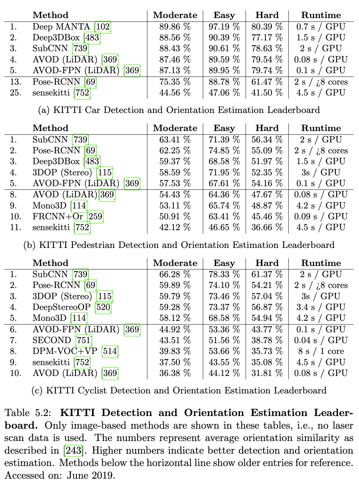

## 5.5 KITTI의 최첨단 기술

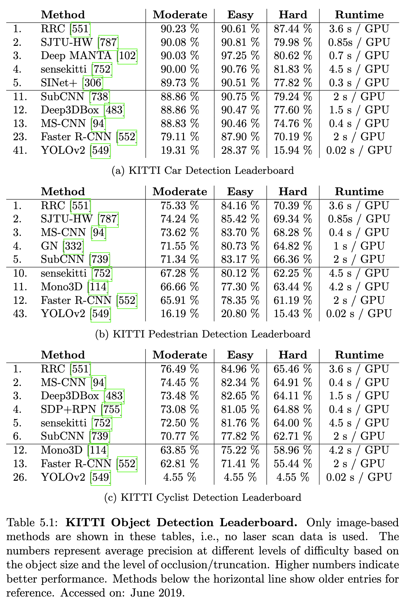

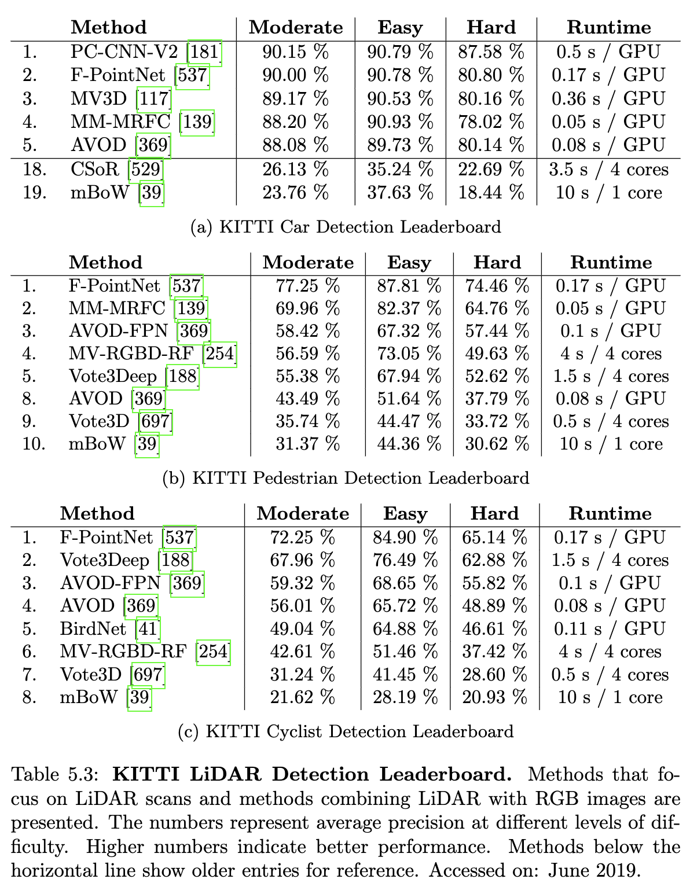

표 5.1과 5.3에서 우리는 이미지에서 객체, 보행자 및 자전거 감지를 위한 KITTI 벤치마크의 현재 최첨단 기술을 보여줍니다. 이 책의 모든 결과 표에서 우리는 방법의 세부 사항을 설명하는 기술 논문이 있는 공개 방법만 나열합니다.

영역 기반 네트워크 [252, 286, 251]는 PASCAL VOC 벤치마크에서 매우 성공적인 것으로 입증되었습니다. 그러나 KITTI 벤치마크에서는 비슷한 성능을 달성하지 못했습니다. 주요 원인은 객체가 다양한 스케일로 나타나고 객체가 종종 부분적으로 가려져 있기 때문입니다. 이러한 객체는 일반 영역 기반 네트워크를 사용하여 감지하기 어렵습니다.

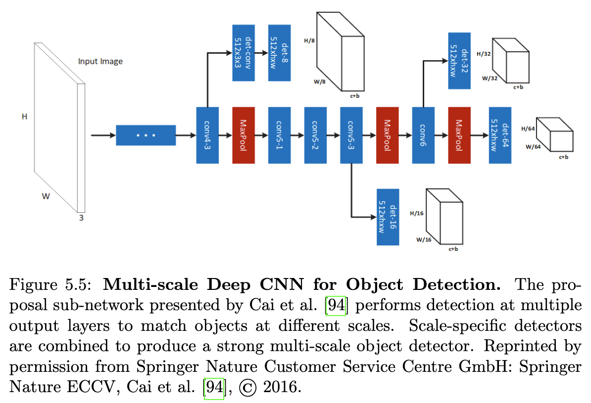

이와 대조적으로 영역 제안 네트워크 [552, 755, 94, 739]는 KITTI 데이터셋에서 더 성공적이었습니다. 작은 객체의 경우, 컨볼루션 뉴런의 강한 활성화가 이전 레이어에서 더 많이 발생할 가능성이 있습니다. 따라서 Yang et al. [755] (SDP+PRN)은 더 강력한 특징을 사용하여 음성 제안을 점진적으로 거부하는 계단식 거부 분류기를 제안합니다. 각 제안에 대해 해당 스케일에서 컨볼루션 특징을 제공하는 스케일 종속 풀링 접근 방식과 결합하여 KITTI 자전거 5.1c에서 경쟁력 있는 결과를 달성합니다. Xiang et al. [739] (SubCNN)은 3DVP [738]에서 얻은 하위 범주 정보를 사용하여 제안 생성 및 감지 네트워크를 안내함으로써 방향 추정 작업을 개선합니다. 객체 하위 범주는 외관, 자세 또는 모양과 같은 유사한 속성 또는 속성을 가진 객체에 대해 정의됩니다. 이 공식화는 보행자 방향 추정에서 최고의 성능을 달성할 수 있도록 합니다(표 5.2b). 최고의 성능을 보이는 영역 제안 네트워크는 Cai et al. [94] 및 Chabot et al. [102]에 의해 제시됩니다. MS-CNN [94]은 두 개의 서브네트워크, 즉 다중 스케일 제안 네트워크와 감지 네트워크로 구성됩니다. 그림 5.5에 나와 있는 제안 네트워크는 다른 스케일에 해당하는 여러 출력 레이어를 가집니다. 각 출력 레이어에는 다른 스케일에서 객체를 감지할 수 있는 감지 네트워크가 적용됩니다. 그들의 다중 스케일 CNN은 보행자와 자전거 운전자에게서 좋은 성능을 보입니다(표 5.1b, 5.1c). Deep MANTA [102]는 이미지에서 3D 차량 감지를 위해 3D 차량 모델 데이터셋을 활용합니다. 그들은 먼저 거친-미세 CNN(Deep MANTA 네트워크)을 사용하여 영역 제안을 반복적으로 개선하여 입력 이미지에서 영역 제안을 추출합니다. 그런 다음 네트워크를 사용하여 3D 데이터셋에서 가장 가까운 3D 모델을 선택하고 이미지의 2D 영역과 3D 모델 간의 매칭을 수행하여 차량 방향과 3D 위치를 복구합니다. 이를 통해 가려진 자동차 부품까지 감지하고 자동차 방향을 추정할 수 있습니다. 그들은 자동차 감지에서 경쟁력 있는 결과(표 5.1a)와 자동차 방향 추정 작업에서 최고의 성능(표 5.2a)을 달성합니다.

단일 단계 감지기 [548, 549, 424]는 KITTI 데이터셋에서 영역 기반 네트워크와 유사하게 다른 스케일의 객체 및 가려짐 문제로 어려움을 겪습니다. 그러나 [430]에서와 같이 특징 피라미드를 활용함으로써 단일 단계 감지기 [551, 787]는 최첨단 성능을 달성할 수 있습니다. Zhang et al. [787] (SJTU-HW)은 감지기에 위치 품질 추정을 포함하여 위치 파악을 개선할 것을 제안합니다. 그들은 분류 및 박스 회귀 서브네트워크의 특징을 융합하여 위치 품질을 추정합니다. 추론 시 그들은 위치 품질을 분류 신뢰도와 결합하여 더 정확한 감지를 얻습니다. 이 접근 방식은 보행자 및 자동차 감지 작업에서 모든 영역 제안 네트워크를 능가합니다. 그러나 모든 감지 작업(표 5.1)에서 최고의 성능은 Ren et al. [551]에 의해 달성됩니다. [430]에서 사용된 특징 피라미드에서 영감을 받아 그들은 여러 스케일에서 상황 정보를 통합하는 재귀적 회전 컨볼루션 아키텍처를 제안합니다. 이 풍부한 상황 정보를 분류기 및 박스 회귀기에 제공함으로써 모든 KITTI 감지 작업에서 최첨단 성능을 달성합니다.

3D 포인트 클라우드에서 3D 객체 감지: 표 5.3에서 우리는 객체, 보행자 및 자전거 감지를 위한 KITTI 벤치마크의 LiDAR 기반 최첨단 기술을 보여줍니다. 성능은 3D 경계 상자를 이미지 평면에 투영하여 교차 합집합을 사용하는 이미지 기반 접근 방식과 유사하게 평가됩니다.

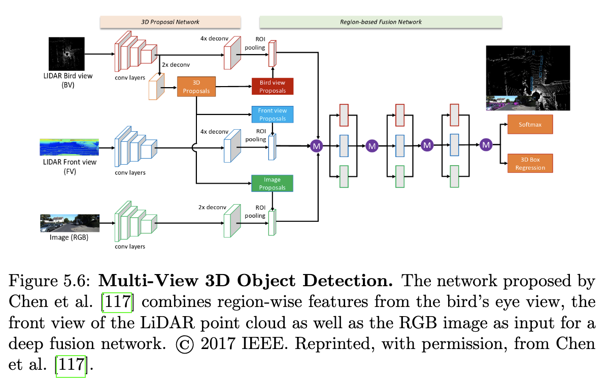

첸 외 [117]는 희소 포인트 클라우드를 압축된 다중 뷰 표현으로 인코딩합니다. 제안 생성 네트워크는 3D 후보를 생성하기 위해 조감도를 활용하지만, 그림 5.6에서 보듯이 최종 감지 및 상자 회귀 방식을 위해 딥 퓨전을 통해 여러 뷰에서 영역별 특징을 결합합니다. 중간 표현을 사용하는 대신 쿠 외 [369]는 LiDAR 포인트 클라우드와 RGB 이미지에서 추출된 특징을 영역 제안 네트워크(RPN) 및 감지 네트워크와 직접 공유할 것을 제안합니다. 코스테아 외 [139]는 밀집 광학 흐름을 추가 입력으로 고려하여 보행자 및 자동차 감지 작업을 개선합니다. 그들은 강도, 그라디언트 크기 및 방향의 다중 모달, 다중 해상도 필터링을 사용하여 감지를 위한 판별적 특징을 얻습니다. [117, 369, 537, 181]과 달리 그들은 부스팅 기반 슬라이딩 윈도우 접근 방식을 따르며 딥 러닝 기반 접근 방식보다 빠르면서도 경쟁력 있는 결과를 달성합니다.

Qi et al. [537]은 이미지 공간에서 2D 감지를 사용하여 검색 공간을 줄임으로써 3D 포인트 클라우드에서 직접 작업할 것을 제안합니다. 이를 통해 그들은 PointNet [234]의 두 가지 변형을 사용할 수 있습니다. 하나는 3D 객체 인스턴스 분할을 위한 것이고 다른 하나는 3D 상자 회귀를 위한 것입니다. 이 접근 방식으로 그들은 보행자 및 자전거 범주(표 5.3b, 5.3c)에서 다른 모든 3D 기반 감지기를 능가하며, 심지어 보행자에서는 모든 이미지 기반 감지기(표 5.1b)를 능가합니다. [537]과 유사하게 Du et al. [181]은 2D 감지를 활용하여 정확한 3D 감지를 얻습니다. PointNet을 사용하는 대신 그들은 일반화된 3D 자동차 모델을 2D 감지에 해당하는 점에 맞출 것을 제안합니다. 마지막으로 그들은 모델과 일치하는 점을 2단계 개선 CNN에서 사용하여 최종 3D 상자와 객체성 점수를 예측합니다. 2D 및 3D 감지의 조합은 그들이 자동차에서 모든 3D 기반 감지기를 능가하면서(표 5.3a) 보행자 범주에서 최고의 성능을 보이는 2D 기반 감지기 [551]와 동등한 성능을 달성할 수 있도록 합니다(표 5.1a).

## 5.6 논의

객체 감지는 가려짐이 거의 없는 고해상도 이미지의 경우 인상적인 성능을 보였습니다. 자동차 감지 작업의 쉬운 경우와 보통 경우(표 5.1a)의 경우, 많은 방법이 정확한 감지를 제공합니다. 보행자 및 자전거 감지 작업(표 5.1b, 5.1c)은 모든 방법의 전반적인 약한 성능에서 알 수 있듯이 더 어렵습니다. 그 이유 중 하나는 훈련 예제의 수가 제한적이고 컨텍스트와 의미론만으로 다른 자전거 운전자와 보행자를 혼동할 가능성이 있기 때문입니다. 작업 전반에 걸쳐 남아있는 주요 문제는 작은 객체와 심하게 가려진 객체의 감지입니다. 리더보드에서는 쉬운, 보통, 어려운 예시를 비교할 때 성능이 크게 떨어지는 것으로 나타납니다. 정성적으로 이는 그림 5.7, 5.8, 5.9에서 관찰할 수 있습니다. 여기서는 KITTI 데이터셋에서 최고의 성능을 보이는 방법의 일반적인 추정 오류를 보여줍니다. 주요 오류 원인은 보행자 무리, 자전거 운전자 그룹, 그리고 가려짐을 유발하고 모든 방법에서 감지 누락으로 이어지는 주차된 자동차입니다. 또한, 멀리 있는 객체는 이러한 객체에 제공되는 이미지 증거가 적기 때문에 여전히 현대적인 방법에는 어려운 것으로 입증되고 있습니다.

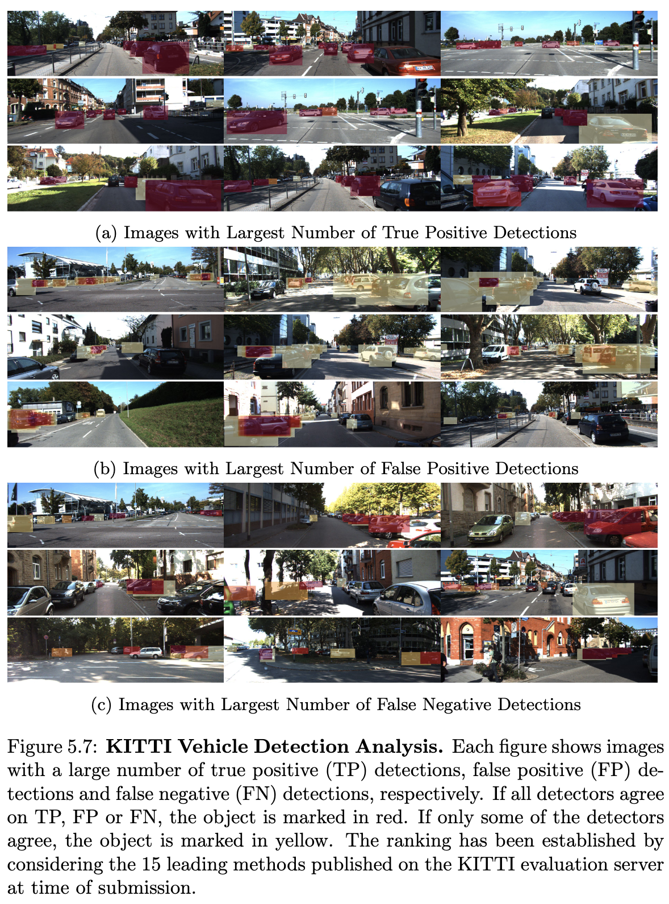

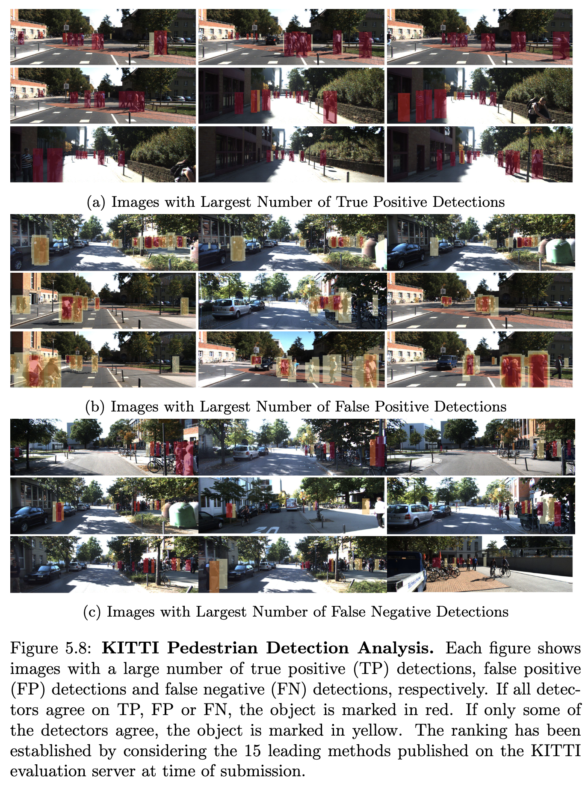

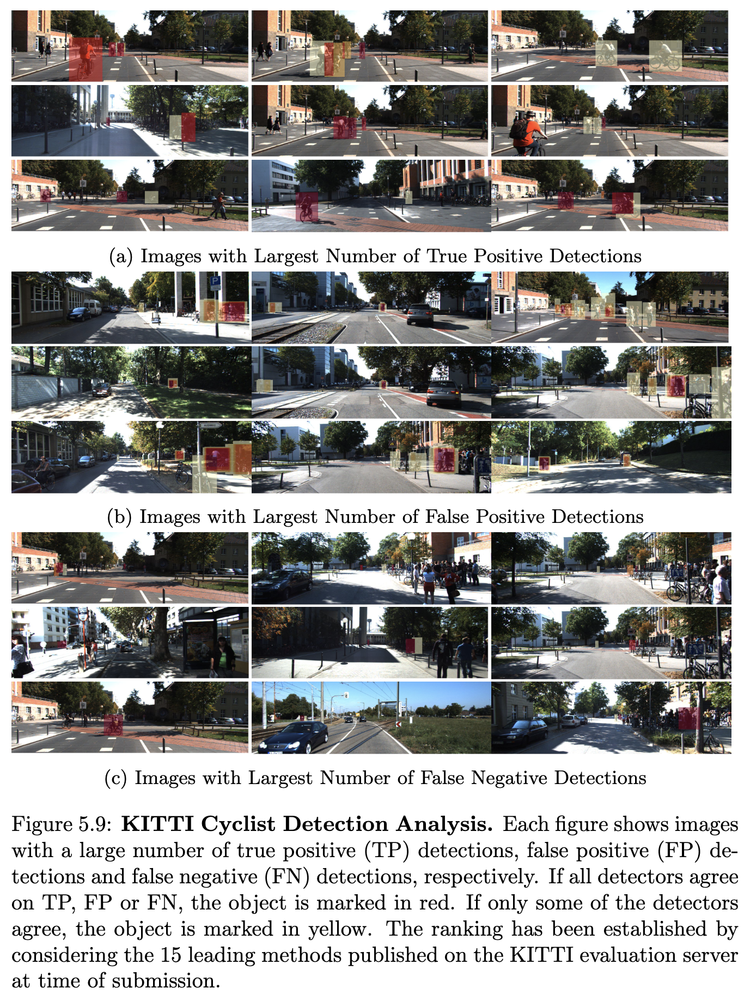