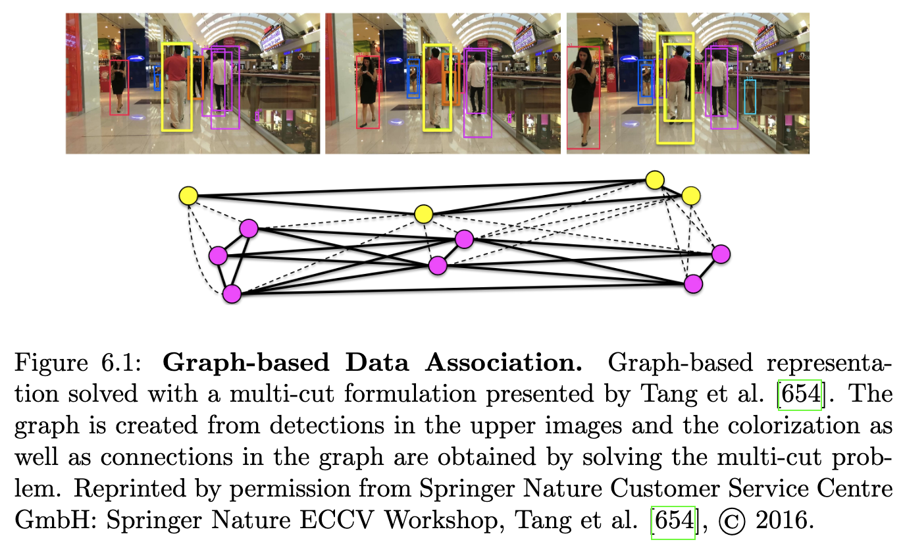
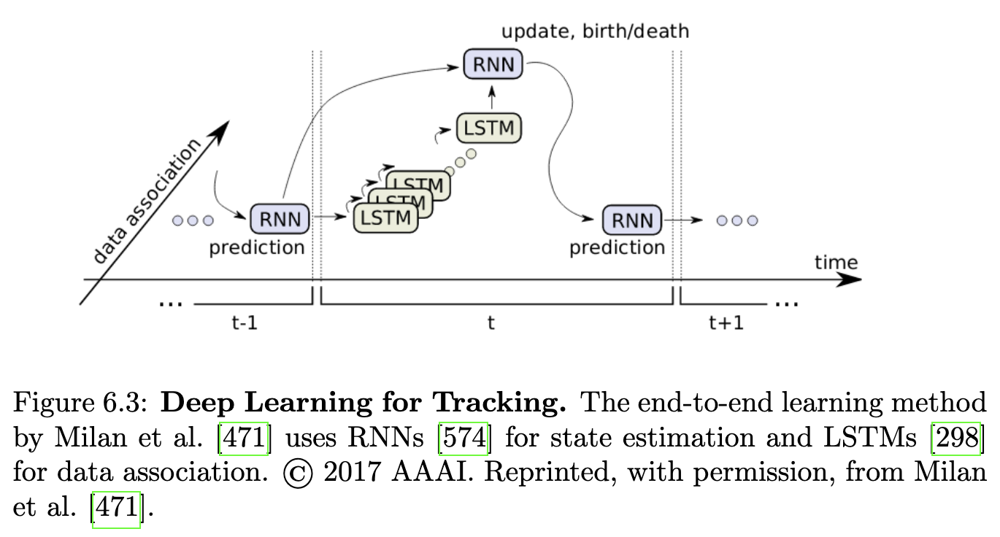
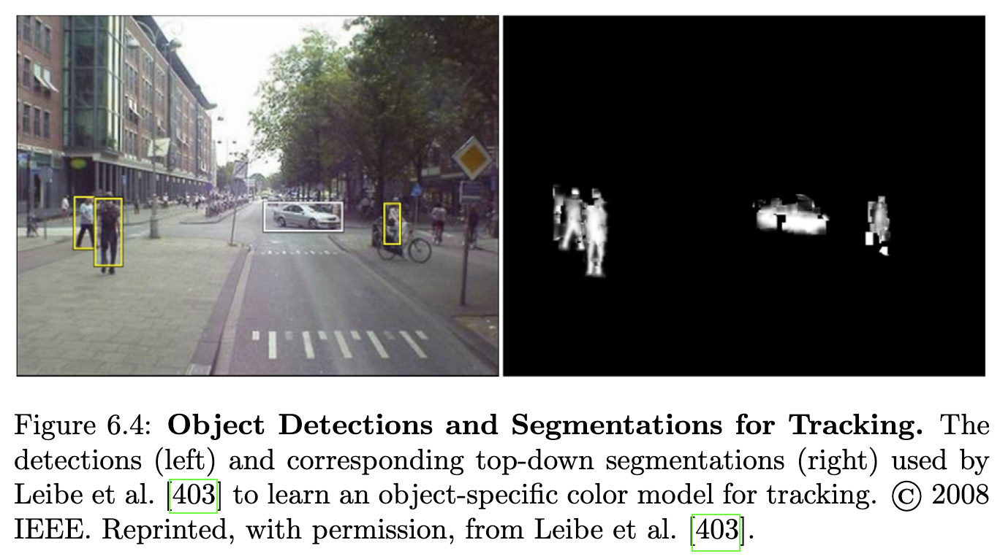
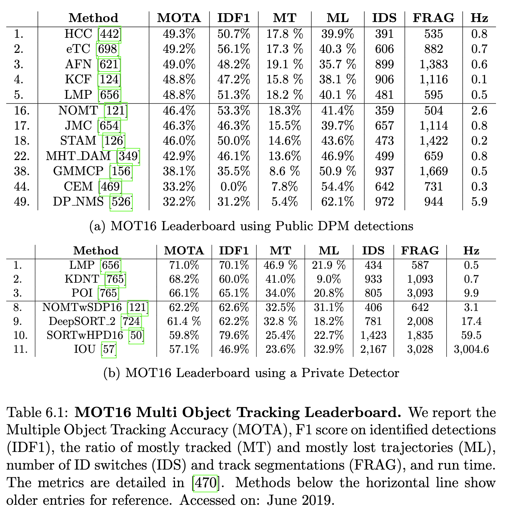
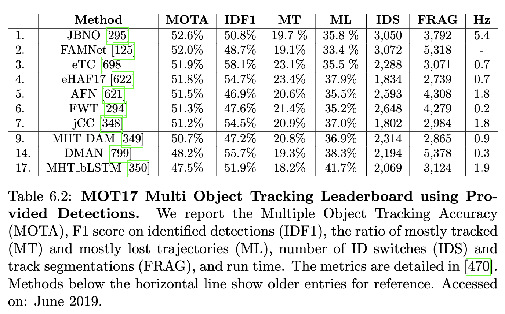

# 6장 객체 추적

## 6.1 문제 정의

추적에서 목표는 센서 측정값을 사용하여 시간에 따라 하나 이상의 객체 상태를 추정하는 것입니다. 이는 각 프레임이 일반적으로 독립적으로 처리되고 시간에 따른 연관성이 설정되지 않는 객체 감지와는 대조적입니다. 일반적으로 객체의 상태는 특정 시점의 위치, 속도 및 가속도로 표현됩니다. 다른 교통 참가자를 추적하는 것은 자율 주행에 매우 중요한 작업입니다. 예를 들어, 차량의 제동 거리는 속도에 따라 제곱에 비례하여 증가합니다. 제동 거리 때문에 다른 교통 참가자와의 가능한 충돌을 일찍 감지하는 것이 필요합니다. 이는 미래 궤적에 대한 좋은 예측이 있어야만 가능합니다. 보행자와 자전거 운전자의 경우 움직임 방향을 갑자기 바꿀 수 있기 때문에 미래 행동을 예측하는 것이 특히 어렵습니다. 따라서 인간은 보행자와 자전거 운전자 주변에서 더 조심스럽게 운전하는 경향이 있습니다. 마찬가지로, 교통 참가자의 분류와 결합된 추적은 차량의 속도를 적절하게 조절하는 데 사용될 수 있습니다. 또한, 다른 차량 추적은 자동 거리 제어에 사용될 수 있으며 다른 교통 참가자의 가능한 운전 조작(예: 추월)을 조기에 예측하는 데 사용될 수 있습니다.

추적 시스템은 어수선한 배경, 움직임의 다양성과 복잡성, 가려짐과 같은 다양한 문제에 대처해야 합니다. 특히 같은 클래스의 다른 객체들과의 유사성 때문에 동일한 객체의 인스턴스를 시간에 따라 연결하는 문제는 특히 어려워집니다. 다른 객체들과의 유사성으로 인한 판별 정보 부족 외에도, 동일한 객체의 인스턴스는 다른 시간 단계에서 연결하기에 충분히 유사하게 보이지 않을 수 있습니다. 종종 객체는 다른 객체나 자신에 의해 부분적으로 또는 완전히 가려집니다. 객체 간의 상호 작용, 특히 보행자의 경우, 가려짐의 양을 더욱 증가시키고 각 개별 객체를 추적하는 것을 어렵게 만듭니다. 어려운 조명 조건과 거울이나 창문의 반사는 추가적인 문제를 야기합니다.

## 6.2 방법론

역사적으로 추적은 베이즈 추론 문제 [662]로 공식화되었으며, 목표는 현재 관찰 및 이전 상태(들)가 주어졌을 때 상태의 사후 확률 밀도 함수를 추정하는 것입니다. 사후 확률은 일반적으로 모션 모델을 사용하는 예측 단계와 관찰 모델을 사용하는 보정 단계를 통해 재귀적으로 업데이트됩니다. 각 반복에서 새로운 관찰을 추적된 객체에 할당하기 위해 데이터 연관 문제가 해결됩니다. 확장 칼만 및 입자 필터링 알고리즘 [250, 72, 120]은 이 맥락에서 널리 사용되는 모델입니다. 불행히도 재귀적 접근 방식은 감지 오류에서 복구하고 관찰 누락으로 인해 가려짐을 통해 추적하기 어렵게 만듭니다. 따라서 시간 창의 모든 궤적에 대해 전역 에너지 함수를 최적화하는 비재귀적 접근 방식 [12, 13]이 인기를 얻었습니다. 그러나 객체당 가능한 대상 궤적의 수와 장면의 잠재적 객체 수가 많으면 매우 큰 검색 공간이 발생합니다.

### 6.2.1 감지를 통한 추적

정적 객체 감지기의 성공을 바탕으로 추적에서 흔히 사용되는 패러다임은 감지 기반 추적입니다. 이 접근 방식은 작업을 두 단계로 나눕니다. 첫째, 사람을 감지하고 둘째, 시간에 따라 동일한 사람의 감지를 연결합니다. 감지 기반 추적은 추적 문제가 데이터 연관 문제로 축소되기 때문에 매우 인기를 얻었습니다. 그러나 추적 시스템은 거짓 및 누락 감지와 같은 감지 시스템의 오류를 여전히 처리하고 복구해야 합니다.

그래프 상의 추적: 그림 6.1에 나타난 그래프 표현은 추적에서 연관성을 추론하는 데 널리 채택됩니다. 가장 간단한 경우, 궤적과 감지 간의 이분 매칭은 노드의 두 개의 분리된 집합을 가진 그래프 기반 접근 방식으로 간주될 수 있습니다. 두 집합 간의 할당은 그리디하게 [728, 73, 625] 수행되거나 다항 시간으로 실행되는 최적의 헝가리안 알고리즘 [516, 307, 743, 550, 538]을 적용하여 수행할 수 있습니다.

네트워크 흐름 접근 방식 [329, 782, 44, 732, 45, 526, 122, 733]에서는 먼저 노드를 감지로, 에지를 감지 간의 공간적 및 시간적 링크로 나타내는 그래프를 구성합니다. 그런 다음, 생성된 트랙이 시작 노드와 끝 노드 사이에서 유효하고 연속적임을 보장하기 위해 간단한 제약 조건 집합이 정의됩니다. 일반적으로 이러한 제약 조건은 정수 프로그램으로 공식화된 다음, 정수 프로그램의 NP-완전성을 피하기 위해 선형 프로그램으로 완화됩니다. 최적화를 위해 선형 프로그래밍 [329, 44], k-최단 경로 [45, 526, 122] 또는 집합 커버 [732]를 사용하여 네트워크 흐름을 해결하기 위한 다양한 동적 프로그래밍 접근 방식이 제안되었습니다.

그래프에 대한 또 다른 연구는 추적을 클러스터링 문제로 표현합니다. 최소 클리크 [774, 155] 및 최소 비용 다중 분할 접근 방식 [655, 654, 656, 18]은 최소 비용 합계를 갖는 그래프의 분할을 찾습니다. 최대 가중치 독립 집합 공식 [616, 74]은 먼저 쌍별 (두 프레임) 연관 문제를 독립적으로 해결하고 학습된 거리 측정을 사용하여 쌍별 솔루션을 연결합니다. 그래픽 모델 [753, 754, 472, 394]은 쌍별 및 고차 전위를 가진 노드에 정의된 전역 에너지 함수를 최소화합니다.

연속 최적화: 이산화에 대한 대안으로 연속 에너지 최소화 접근 방식이 제안되었습니다. 이 고도로 비볼록 문제에 대해 Andriyenko와 Schindler [12]는 불량한 국소 최소점을 방지하고 가변 차원 검색 공간을 더 잘 탐색하기 위해 반복적인 점프 이동을 사용하는 휴리스틱 에너지 최소화 방식을 사용합니다. 그들의 에너지 함수의 다른 구성 요소의 효과는 그림 6.2에 나와 있습니다. Milan et al. [469]은 [12]의 연속 에너지 함수를 확장하여 대상 역학, 상호 배제 및 트랙 지속성과 같은 물리적 제약을 고려합니다. 데이터 연관에서 각 관찰을 특정 대상에 할당하는 것은 본질적으로 이산 최적화 문제입니다. 따라서 Andriyenko et al. [13]은 공동 이산 및 연속 공식화가 추적 문제를 더 자연스럽게 설명한다고 주장합니다. 그들의 방법은 레이블 비용으로 이산 최적화를 사용하여 데이터 연관 문제를 해결하고 레이블 비용을 무시하면서 연속 궤적을 분석적으로 맞추는 것을 번갈아 수행합니다. Milan et al. [472]은 데이터 연관의 상호 배제 및 궤적 추정을 특별히 다루는 혼합 이산-연속 조건부 랜덤 필드 모델을 제안합니다. 데이터 연관 중에는 각 관찰이 최대 하나의 대상에 할당되어야 하는 반면, 궤적 추정에서는 두 궤적이 항상 공간적으로 분리되어야 합니다.

다중 단서: 데이터 연관을 위해 추적 시스템의 견고성을 향상시키기 위해 다양한 보완 단서가 함께 사용될 수 있습니다. Giebel et al. [250]은 고유한 선형 부분 공간 모델을 기반으로 시공간 형상 표현을 학습합니다. 그들은 입자 필터의 관찰 모델에서 스테레오에서 얻은 형상, 질감 및 깊이를 결합하여 외형 변화를 처리합니다. Gavrila와 Munder [236]는 ROI 생성, 형상 기반 감지, 질감 기반 분류 및 스테레오 기반 검증 등 감지 및 추적 시스템에서 모듈 캐스케이드를 사용하여 동일한 단서 세트를 사용합니다. 그들의 시스템은 스테레오 기반 ROI 접근 방식으로 추론된 관련 이미지 영역에 초점을 맞출 수 있습니다. 그들은 형상 매칭 결과에 따라 질감 기반 구성 요소 분류기의 가중치를 부여하여 전문가 혼합 아키텍처를 제안합니다. Choi et al. [120]은 외형 기반 접근 방식에서 보행자 및 상체, 얼굴, 피부색, 깊이 기반 형상 및 움직임과 같은 다른 작업에 전문화된 여러 감지 시스템의 조합을 사용합니다. 모든 감지 시스템의 응답은 매칭을 개선하기 위해 관찰 가능성에서 결합됩니다.

### 6.2.2 보행자 추적

앞서 언급했듯이 보행자 추적은 자율 주행에 특히 중요합니다. 그러나 보행자 식별은 특히 감지 시스템의 오탐지로 인해 여전히 어렵습니다. Andriluka et al. [10]은 공동 감지 및 관절형 인간 자세 추적 공식을 통해 이 문제를 해결합니다. 그들은 기존 사람 감지기를 사지 기반 구조 모델로 확장하고 계층적 가우시안 프로세스 잠재 변수 모델(hGPLVM)로 감지된 사지의 역학을 모델링합니다. 이를 통해 한 프레임만 고려하는 접근 방식보다 사람을 더 안정적으로 감지할 수 있습니다. Andriluka et al. [11]은 이 아이디어를 단안 이미지에서 3D 자세 추정으로 확장합니다. 첫 번째 단계에서 그들은 사람의 2D 관절 및 시점을 추정하고 소수의 프레임에 걸쳐 연결합니다. 이 누적된 2D 이미지 증거는 hGPLVM으로 3D 자세를 추정하는 데 사용됩니다. 이 접근 방식은 단안 이미지에서 여러 사람의 3D 자세를 정확하게 추정할 수 있도록 합니다. 은닉 마르코프 모델(HMM)과 결합하여 이러한 접근 방식은 매우 긴 시퀀스에 걸쳐 사람을 추적할 수 있습니다.

### 6.2.3 공동 감지 및 추적

전형적인 감지 기반 추적 접근 방식은 감지가 가능하다는 것을 가정하는 반면, Dehghan et al. [156] 및 Tian et al. [664]은 각 대상에 대한 모델을 학습하고 대상과 노드 간의 할당 확률을 인코딩하도록 그래프를 수정함으로써 네트워크 흐름 접근 방식으로 감지 및 연관을 공동으로 해결할 것을 제안합니다.

강 외 [337, 336]는 비디오 객체 감지를 위해 객체 감지 및 추적을 결합하는 튜블렛 제안 모듈을 도입합니다. 튜블렛은 연속적인 프레임에서 동일한 객체의 감지를 나타냅니다. 공간적 앵커(예: 영역 제안 네트워크에서)로 정적 객체 제안을 먼저 생성한 다음 앵커를 조정하기 위해 상대적인 움직임을 예측함으로써 성능이 향상됩니다. 경계 상자를 전파하는 대신 Tang et al. [653]은 동일한 프레임에서 객체를 연결하고 프레임 간에 상자 점수를 전파합니다. 또한 [337, 336]의 프레임당 제안은 비디오 세그먼트에 대해 직접 생성되는 시공간 제안으로 대체됩니다.

또 다른 연구는 비디오에서 특징 집계를 위해 광학 흐름을 사용합니다 [803, 802, 801]. 인접 프레임의 특징 맵은 추정된 광학 흐름에 따라 워핑되고 적응형 가중치를 학습하여 집계됩니다. 동기는 모션 블러로 인해 일부 프레임에서 감지하기 어려운 빠르게 움직이는 객체의 감지를 개선하는 것입니다. Zhu et al. [801]은 키 프레임 선택, 즉 집계할 프레임 또는 프레임의 일부를 선택하는 방식으로 더 효율적인 버전을 제안합니다. Wang et al. [701]은 또한 다른 수준에서 흐름을 사용합니다. 즉, 픽셀당 워핑으로 픽셀 수준에서, 인스턴스 움직임을 예측하여 인스턴스 수준에서 사용합니다. 그런 다음, 두 수준은 관찰된 모션 패턴에 따라 결합됩니다. 예를 들어, 비강체 움직임의 경우 픽셀 수준에 더 의존합니다. 비용이 많이 드는 광학 흐름 계산을 피하기 위해 Bertasius et al. [46]은 변형 가능한 컨볼루션 레이어를 기반으로 한 시공간 샘플링 메커니즘을 제안합니다.

### 6.2.4 다중 객체 추적을 위한 딥 러닝

추적은 5.2.3장에서 논의된 객체 감지에서 딥 러닝의 성공으로 큰 혜택을 받았습니다. 더욱이 딥 러닝은 동일한 사람에 속하는 감지를 확인하기 위한 표현 학습 [395, 654, 656] 또는 최근에는 순차 모델을 사용한 트랙 표현 학습 [576, 350, 18]에 사용되었습니다. 연관성을 위한 전통적인 모델과 결합된 학습된 순차 모델은 이전 모델에 비해 성능을 향상시키는 것으로 나타났습니다. 예를 들어, 외관, 움직임 및 상호 작용 LSTM 네트워크 [576]와 수동으로 설계된 특징을 사용한 마르코프 결정 프로세스 추적 [737]의 조합, CNN 특징을 사용한 다중 가설 추적 모델 [349]과 수정된 양방향 선형 LSTM [350]의 조합, 그리고 Siamese 네트워크를 사용한 리프트드 멀티컷 접근 방식 [656]과 대조되는 RNN을 사용한 트랙렛 유사성 기반 계층적 클러스터링 방법 [18]이 있습니다. 이러한 예시에서 공통적인 접근 방식은 좋은 트랙 표현을 학습한 다음 연관성을 위해 확립된 방법을 사용하는 것입니다.

최근 Schulter et al. [604], Milan et al. [471], Frossard and Urtasun [215] 등 여러 접근 방식이 다중 객체 추적의 엔드 투 엔드 학습을 제안했습니다. 주요 과제는 레이블링된 데이터의 희소성, 입력 및 출력 공간 모두에서 문제의 구조화된 특성, 그리고 조합 검색 공간입니다. Schulter et al. [604]은 경계 상자의 수동으로 설계된 표현을 기반으로 네트워크 흐름 비용 함수를 학습하기 위한 네트워크 레이어를 제안합니다. 그림 6.3에 나타난 추적을 위한 최초의 엔드 투 엔드 학습 방법인 Milan et al. [471]은 RNN을 사용하여 대상의 상태를 추정하고 LSTMs를 사용하여 연관을 추정합니다. 그러나 이 모델은 합성 데이터로 훈련되었고 외관 모델이 부족하여 이전 접근 방식의 성능과 일치할 수 없습니다. Frossard and Urtasun [215]은 연관 문제를 해결하는 선형 프로그램을 통해 역전파하기 위한 깊은 구조적 손실을 사용하여 3D 차량 감지 및 추적을 위한 엔드 투 엔드 학습 방법을 제안합니다. 이와 대조적으로 Feichtenhofer et al. [203]은 [149]에서 제안된 컨볼루션 객체 감지기를 프레임 간 객체 좌표를 회귀하는 추적 손실로 확장하여 감지 및 추적의 엔드 투 엔드 학습을 위한 더 일반적인 접근 방식을 제시합니다. 그러나 그들은 주로 비디오 중앙에 하나 또는 몇 개의 객체가 있는 시퀀스로 구성된 ImageNet VID 챌린지 [575]에서만 평가합니다.

### 6.2.5 3D 객체 추적

일부 연구는 장면의 객체 궤적을 추정하면서 장면의 구조를 얻기 위해 객체 추적 및 깊이 추정에 대한 공동 공식화를 조사했습니다. 장면의 구조는 추적 시스템이 더 그럴듯한 솔루션에 집중할 수 있도록 합니다. 깊이 정보를 추정하거나 얻기 위해 단안 [304] 및 스테레오 이미지 [250, 401, 403, 194, 476, 438]와 같은 다른 입력 양식이 고려되었습니다. 몇몇 접근 방식 [480, 165, 104]은 LiDAR 데이터만을 사용하여 추적 문제를 다룹니다. 그러나 외형 정보가 부족하고 거리가 증가함에 따라 레이저 범위 정보의 밀도가 감소하여 추적 문제가 복잡해집니다.

Leibe et al. [401, 403]은 장면 기하학 추정, 2D 객체 감지, 3D 위치 파악, 궤적 추정 및 추적을 통합하는 접근 방식을 제안합니다. 그들은 그림 6.4에 나타난 바와 같이 객체의 감지 및 상향식 분할을 사용하여 객체별 색상 모델을 학습합니다. 장면의 구조는 물리적으로 그럴듯한 시공간 궤적의 추출을 안내하며, 최종 전역 최적화 기준은 객체 간 상호 작용을 고려하여 3D 위치 파악 및 궤적 추정 결과를 개선합니다. Ess et al. [194]은 그래픽 모델을 사용하여 시간에 걸쳐 카메라 위치, 스테레오 깊이, 객체 감지 및 모든 객체의 자세를 공동으로 추정합니다. 이때 그래픽 모델은 다른 구성 요소 간의 상호 작용을 나타내고 객체 간 상호 작용을 통합합니다. Luiten et al. [438]은 이미지에서 단기 트랙을 먼저 추정하고 그 후에 깊이에서 3D 장면을 재구성하여 이러한 트랙을 융합하는 두 단계 접근 방식을 제안합니다. 단기 추적은 이미지 분할 및 광학 흐름 추정치를 사용한 시간적 연관을 통해 수행됩니다.

이전 접근 방식과 달리 Hu et al. [304]은 단안 이미지에서 3D 상자 추정을 위한 네트워크를 훈련합니다. 이 네트워크는 차량의 3D 위치, 방향 및 치수를 회귀하도록 학습합니다. 3D 상자는 추적 공식에서 관찰로 사용되며, 깊이 순서를 고려하여 가중 이분 매칭 알고리즘을 사용하여 트랙에 할당됩니다. 또한, 그들은 LSTMs를 사용하여 두 가지 모션 모델을 학습합니다. 하나는 새로운 위치를 예측하기 위한 것이고 다른 하나는 위치를 업데이트하기 위한 것입니다.

감지 전 추적: 추적 문제를 용이하게 하는 것 외에도 3D 정보는 클래스와 무관하게 장면을 다른 객체로 분할할 수 있도록 합니다. 감지 전 추적에서 이러한 분할된 클래스에 구애받지 않는 객체는 추적 공식에서 관찰로 직접 고려됩니다. 이러한 방식으로 추적 시스템은 분류기에 독립적이며, 따라서 이전에 본 적이 없거나 훈련 데이터가 거의 없는 알 수 없는 객체를 추적할 수 있습니다. 또한, 객체의 추정된 궤적에서 얻은 움직임 정보는 특정 클래스의 객체를 감지하는 또 다른 단서로 사용될 수 있습니다. Mitzel과 Leibe [476]는 스테레오 깊이를 사용하여 장면을 분할하여 객체 관찰을 추출합니다. 압축된 3D 표현을 사용하여 알려진 및 알 수 없는 객체 범주를 견고하게 추적할 수 있습니다. 이 표현은 또한 운반된 항목과 같은 비정상적인 형태를 감지할 수 있도록 합니다.

## 6.3 데이터셋

초기 다중 객체 추적 데이터셋에는 PETS [206], TUD [10], ETHZ [195]와 같은 독립적인 시퀀스가 포함됩니다. 이러한 시퀀스의 개별 평가는 일부 시퀀스에는 과적합하지만 다른 시퀀스에서는 성능이 떨어지는 추적 알고리즘으로 이어졌습니다. MOT 챌린지 [396, 470]는 중앙 집중식 평가 및 비교를 제공함으로써 이러한 시퀀스의 대부분을 하나의 프레임워크로 결합합니다. PETS 및 TUD와 같은 일부 시퀀스는 정적 관찰자로부터 캡처되지만, 자율 주행에 더 관련성이 높은 다른 시퀀스는 모바일 플랫폼에서 획득됩니다. KITTI 데이터셋 [243, 242]은 자동차 및 보행자 클래스 추적에 대한 개별 평가와 함께 자율 주행에 특화된 추적 데이터를 제공합니다. 최근 Chang et al. [104]은 자율 주행 차량군에 의해 수집된 새로운 3D 객체 추적 데이터셋을 발표했습니다. 이 데이터셋은 360도 이미지, 전방 스테레오 이미지, LiDAR 및 6-DOF 자세로 구성됩니다. 저자들은 290km의 차선 표시와 1만 개의 사람이 주석을 단 추적 객체를 제공합니다.

MOT 벤치마크는 3년 연속으로 MOT15 [396], MOT16, MOT17 [470]을 발표했으며, 추적 레이블이 있는 시퀀스 세트로 구성되어 CLEAR 지표 [635]를 기반으로 공식 평가 프로토콜을 제공합니다. 가장 초기인 MOT15는 집계 채널 특징(ACF) [173]을 기반으로 한 고전적인 객체 감지기를 사용합니다. MOT16에서는 변형 가능한 부분 모델(DPM) [204]을 사용하여 감지를 얻는 반면, MOT17에서는 DPM [204], Faster R-CNN [552], 스케일 종속 풀링(SDP) [755]을 사용하여 세 가지 다른 객체 감지 세트를 제공합니다. 감지 세트 제공은 다른 감지기로 인한 오류와 무관하게 객체를 추적하는 능력에 따라 접근 방식을 비교할 수 있도록 합니다. MOT16의 경우 공개 (DPM) 감지를 사용하는 방법의 리더보드는 표 6.1a에 제공되며, 개인 감지기를 사용하는 방법은 표 6.1b에 나와 있습니다. MOT17의 경우 표 6.2는 동일한 시퀀스 세트에서 제공된 세 가지 감지기에 대한 평균 결과를 보여줍니다.

자율주행 애플리케이션에 특화된 KITTI [243]는 표 6.3a의 자동차 추적(KITTI car)과 표 6.3b의 보행자 추적을 위한 두 가지 벤치마크를 제공합니다. 별표가 표시된 방법은 추적 성능의 독립적인 비교를 위해 Regionlet 감지 [702]를 사용합니다. 자동차 및 보행자를 위한 별도의 챌린지는 각 클래스에 개별적으로 집중하고 클래스에 특화된 문제를 깊이 조사할 수 있도록 합니다.

## 6.4 측정 지표

표 6.1a, 6.1b, 6.2, 6.3a, 6.3b에서 우리는 일반적으로 사용되는 추적 측정 지표인 [635]에 의해 도입된 다중 객체 추적 정확도(MOTA) 및 다중 객체 추적 정밀도(MOTP), 대부분 추적된(MT) 및 대부분 손실된 궤적(ML)의 비율, ID 전환(IDS) 수 및 트랙 분할(FRAG)을 고려합니다. MOT 리더보드의 경우, 벤치마크 페이지에 따라 MOTP 대신 [565]에 의해 도입된 IDF1 점수를 보여줍니다. IDF1 점수는 식별 정밀도 및 재현율의 F1 점수입니다. 즉, 올바르게 식별된 감지 수와 지상 진실 및 계산된 감지 수의 평균에 대한 비율입니다. 대부분 추적된 및 대부분 손실된 궤적은 각각 최소 80% 또는 최대 20%의 시간 동안 가설에 의해 커버되는 궤적의 백분율을 보여줍니다. 측정 지표 및 거짓 음성, 거짓 양성, ID 재현율 및 ID 정밀도와 같은 추가 측정 지표가 포함된 자세한 표에 대한 설명은 KITTI [243] 및 MOT 벤치마크 [396, 470]뿐만 아니라 [565]를 확인하십시오.

## 6.5 MOT 및 KITTI의 최첨단 기술

MOT16 벤치마크: near-online multi-target tracking approach [121], multiple hypothesis tracking approach [349] 및 Markov decision processes [737] 기반 추적과 같은 고전적인 접근 방식은 새로 제안된 방법과 비교하여 MOT 벤치마크에서 여전히 일관되게 좋은 성능을 보입니다. 섹션 6.2.4에서 설명했듯이 더 나은 외관 모델을 학습하는 딥 러닝 기반 접근 방식은 훨씬 더 나은 성능을 보입니다 [576, 350]. [576]과 [737]의 비교는 MOT16 및 MOT17 이전의 첫 번째 출판일로 인해 MOT151에서 찾을 수 있습니다. [350]에서 제안된 학습 기반 방법은 지상 진실 감지에서 훈련되었으며, [350]에서 설명된 것처럼 전반적인 성능에 영향을 미치는 노이즈가 많은 DPM 감지 때문에 MOT17에서 [349]보다 성능이 떨어집니다(표 6.2).

단일 객체 추적기(SOT)의 성공은 각 객체에 대한 추적기를 학습함으로써 MOT를 위해 여러 단일 객체 감지기를 결합하는 방법(표 6.1a, 6.2)을 촉발했습니다 [126, 124]. 이러한 접근 방식은 새로운 객체가 높은 신뢰도로 감지될 때마다 새로운 단일 객체 추적기를 초기화합니다. 그들은 모션 모델에 따라 검색 공간을 제한하고 이진 분류기를 사용하여 최상의 감지 후보를 선택함으로써 알려진 객체의 감지를 각 단일 객체 추적기에 할당합니다. Chu et al. [126]에서는 가려짐 및 대상 간의 상호 작용으로 인한 드리프트를 처리하기 위해 시공간 주의 메커니즘이 제안됩니다. Chu et al. [124]은 객체 모델 내 및 객체 모델 간 인식을 모두 인코딩하고 모델 초기화의 노이즈를 제거하기 위한 적응형 모델 새로 고침 전략을 제안합니다.

Ma et al. [442]이 제안한 맞춤형 추적기는 제공된 감지를 사용하여 MOT16에서 가장 잘 알려진 방법입니다(표 6.1a). 이 방법은 [655, 654, 656]과 유사하게 추적을 최소 비용 리프트 다중 절단 문제로 공식화한 것을 기반으로 합니다. 오프라인이며 따라서 자율 주행에 직접 적용할 수 없음에도 불구하고 이러한 유형의 그래프 기반 클러스터링 공식은 MOT에서 매우 잘 작동합니다. 이전 방법과 달리 Ma et al. [442]은 테스트 시퀀스를 사용하여 재식별 네트워크를 미세 조정함으로써 시퀀스별 추적기를 학습합니다. 그들은 겹치지 않는 트랙렛이 다른 개체를 나타낸다는 가정을 사용하여 일반 재식별 CNN을 테스트 시퀀스에 적용합니다.

MOT16에서 공개 및 비공개 감지기를 비교하면 (표 6.1a, 6.1b) 좋은 객체 감지기의 중요성을 알 수 있습니다. 추적 알고리즘은 공개 감지보다 비공개 (일반적으로 더 좋은) 객체 감지를 사용할 때 훨씬 더 나은 성능을 보입니다. 예를 들어, MOTA에서 LMP [656]는 71.0% 대 48.8%, NOMT [121]는 62.2% 대 46.4%입니다. 단순 추적기 IOU [57] 또는 SORT [50]와 같은 공개 감지를 사용하는 어떤 추적기보다 최근 객체 감지와 간단한 추적 알고리즘을 결합한 것이 훨씬 더 나은 성능을 보입니다. 이들은 칼만 필터링과 결합된 헝가리안 방법을 기반으로 합니다. Wojke et al. [724]는 외관 매칭을 위해 딥 특징을 파이프라인에 통합함으로써 SORT의 성능을 더욱 향상시킵니다. 마찬가지로 Yu et al. [765]도 외관 매칭을 위해 헝가리안 알고리즘과 칼만 필터링을 기반으로 한 추적 알고리즘을 딥 특징과 결합하여 사용합니다. 그러나 그들의 감지기는 자체 수집한 감시 데이터셋을 포함하여 추가 데이터로 훈련되었으며, 이는 공개되지 않았습니다.

MOT17 벤치마크: MOT17(표 6.2)에서 최고 성능을 보이는 방법들은 감지 대신 쉽게 그리고 신뢰할 수 있게 연관될 수 있는 짧은 감지 시퀀스인 트랙렛을 연관시킴으로써 그래프 클러스터링 방식을 따릅니다. Wang et al. [698]은 먼저 움직이는 카메라의 경우 IOU 및 에피폴라 기하학을 기반으로 트랙렛을 생성합니다. 트랙렛은 그래프의 노드를 나타내며, 그 다음 탐색 기반 클러스터링 방법을 기반으로 클러스터링됩니다. Shen et al. [621]은 [604]에서 제안된 학습 기반 네트워크 흐름 접근 방식에 트랙렛 점수를 통합합니다. 이러한 방법들이 트랙렛을 생성하기 위한 전처리 단계를 가지고 있는 반면, FAMNet [125]이라는 더 최근의 접근 방식은 특징 추출, 유사도 추정 및 할당 문제를 단일 네트워크로 결합합니다. 또한, 누락된 감지로부터 복구하기 위해 단일 객체 추적이 추적 시스템에 통합됩니다.

최근 여러 접근 방식 [348, 294, 295]은 추적 개선을 위해 머리 감지 및 모션 분할과 같은 추가 단서를 사용할 것을 제안합니다. MOT17에서 최고의 성능을 보이는 방법 중 두 가지는 머리, 몸체 및 관절 감지기를 추적 시스템에 융합합니다 [294, 295]. Keuper et al. [348]은 경계 상자의 상향식 클러스터링과 점 궤적 그룹화를 통한 하향식 모션 분할로 다중 객체 추적을 다룹니다.

KITTI 벤치마크: MOT 챌린지와 달리 KITTI 벤치마크는 교통 장면에서 보행자(표 6.3b)와 자동차(표 6.3a) 추적이라는 어려운 시나리오에 중점을 둡니다. MOT와 유사하게, 마르코프 결정 프로세스(IMMDP) [737], 개선된 최소 비용 네트워크 흐름 [405], 또는 거의 온라인 다중 대상 추적 알고리즘(NOMT) [121]을 기반으로 한 추적과 같은 고전적인 접근 방식은 합리적으로 잘 수행됩니다. IMMDP에서는 강화 학습을 사용하여 정책을 학습하는데, 이는 데이터 연관을 위한 유사성 함수를 학습하는 것과 일치합니다. 영역 제안 네트워크 [552]가 포함된 개선된 버전은 자동차 추적 작업에서 최고의 성능을 보이는 방법입니다. Lenz et al. [405]은 [782]에서 제시된 최소 비용 네트워크 흐름 공식의 계산 및 메모리 제한 버전을 제안합니다. 이 접근 방식은 KITTI 자동차에서 가장 빠른 접근 방식 중 하나이면서도 좋은 정확도와 정밀도를 달성합니다. NOMT [121]는 상대적인 움직임 패턴을 인코딩하는 집계된 지역 흐름 기술자(ALFD)를 제안합니다. 이러한 특징 덕분에 멀리 있는 감지를 견고하게 매칭할 수 있습니다. 여러 특징 단서를 사용하여 그들의 방법은 KITTI 자동차에서 모든 온라인 추적 접근 방식을 능가합니다.

최근 접근 방식들은 자동차의 움직임이나 장면의 구조와 같은 도메인별 정보를 활용합니다. Yoon et al. [764]은 객체 간의 상대적인 움직임을 설명하기 위한 네트워크를 구성하여 카메라 움직임을 제외합니다. 그들은 그림 6.5에 나타난 바와 같이 두 객체 간의 위치 및 속도 차이로 정의된 구조적 움직임 제약을 활용하여 [763]에서 더욱 개선합니다. 구조에 대해 공동으로 추론함으로써 그들은 2D 추적기에 공통적인 문제(예: 가려짐)를 완화하고, 특히 자동차 추적 작업에서 이를 능가합니다. Frossard와 Urtasun [215]은 3D 감지를 기반으로 네트워크 흐름 접근 방식에서 추적을 학습할 것을 제안합니다. 구조화된 힌지 손실은 정수 프로그램을 통해 역전파하도록 조정됩니다. 다른 최고의 성능을 보이는 3D 알고리즘은 새로운 2D-3D 칼만 필터를 사용하여 이미지 및 월드 공간 추정을 결합하는 [505]와 Poisson multi-Bernoulli mixture (PMBM) 추적기를 제안하는 [595]입니다. Sharma et al. [619]은 도시 도로 장면의 기하학을 활용하여 객체의 단일 뷰 재구성을 기반으로 3D 자세 및 형상과 같은 추적을 위한 3D 단서를 추론합니다. 이 접근 방식은 KITTI 자동차 리더보드에서 정확도(MOTA) 및 정밀도(MOTP)에서 다른 모든 것을 능가합니다.

## 6.6 논의

매우 정확한 객체 감지를 사용해야만 신뢰할 수 있는 감지 기반 추적을 달성할 수 있습니다. KITTI 리더보드(표 6.3a, 6.3b)에서 별표 유무에 따라 표시된 방법을 비교하면 감지 시스템의 영향을 관찰할 수 있습니다. MOT16 리더보드에서는 표 6.1a의 공개 감지를 사용하는 방법과 표 6.1b의 비공개 객체 감지기를 사용하는 방법을 비교할 때 이를 관찰할 수 있습니다. 그러나 우리는 섹션 5.6에서 객체 감지 문제를 자세히 논의하고 이 섹션에서는 추적 문제에 중점을 둡니다. 감지와 유사하게 보행자 추적은 일반적으로 자동차 추적보다 더 어렵습니다. 그 이유는 보행자의 복잡한 움직임은 예측하기 어렵지만, 도로 영역에 묶여 있고 큰 질량과 동적 제약으로 인해 덜 불규칙적인 행동을 따르는 자동차의 강체 움직임과는 대조적이기 때문입니다. 3D 추론은 기하학적 관계에 따라 그럴듯한 솔루션을 식별함으로써 특히 자동차의 경우 추적 성능을 향상시키는 데 도움이 될 수 있습니다.

교통 장면에서 감지기는 부분적으로 또는 완전히 가려진 객체에 대해 자주 실패합니다. 이러한 경우, 추적 시스템은 나중에 추적된 객체를 다시 식별해야 하지만, 조명 조건의 변화나 근처의 다른 객체와의 유사성으로 인해 어려울 수 있습니다. 이러한 문제는 궤적의 재초기화를 유발하며, 이는 MOT 및 KITTI 벤치마크에서 높은 단편화(FRAG) 및 ID 전환(IDS) 수로 관찰될 수 있습니다. 또한, 대부분의 추적 시스템은 복잡한 파이프라인을 포함하며, 문헌에서는 엔드투엔드 다중 대상 추적 알고리즘이 거의 제안되지 않았습니다. 일반적이고 엔드투엔드 훈련 가능한 모델을 목표로 감지에서 추적까지의 이 격차를 해소하는 것은 이 분야의 미래 연구에서 중요한 방향이 될 것입니다.