## 7.1 문제 정의

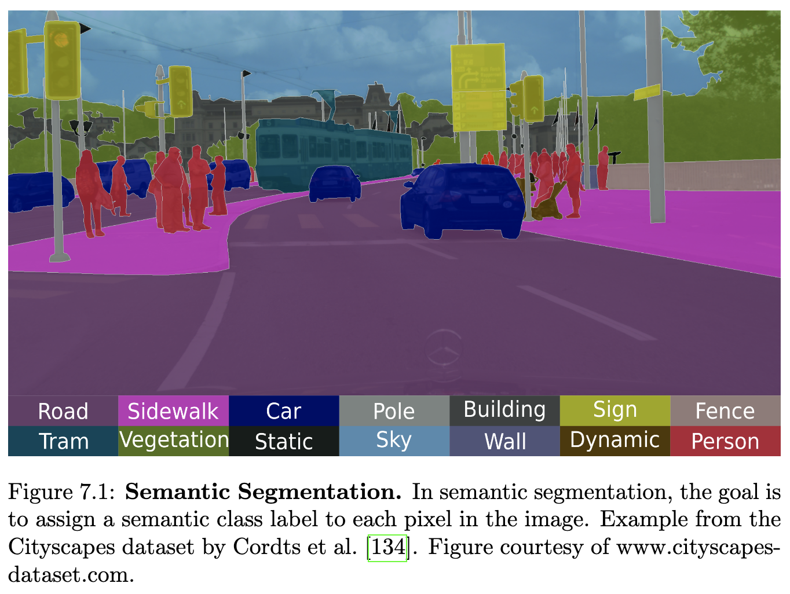

시맨틱 분할은 컴퓨터 비전의 근본적인 문제이며 장면 이해 또는 감각 운동 제어와 같은 고수준 작업을 해결하기 위한 중간 목표입니다. 시맨틱 분할의 목표는 이미지의 각 픽셀에 미리 정의된 범주 집합에서 레이블을 할당하는 것입니다. 이 작업은 Cordts et al. [134]의 Cityscapes 데이터셋1의 예시를 사용하여 그림 7.1에 나타나 있습니다. 자동차, 보행자, 도로와 같이 일반적으로 거리 장면에서 발견되는 시맨틱 영역으로 이미지를 분할하는 것은 자율 내비게이션에 필수적인 주변 환경에 대한 포괄적인 이해를 가능하게 합니다. 이 작업은 장면의 복잡성, 복잡한 객체 경계, 작은 객체 및 레이블 공간의 큰 크기로 인해 어렵습니다.

## 7.2 방법론

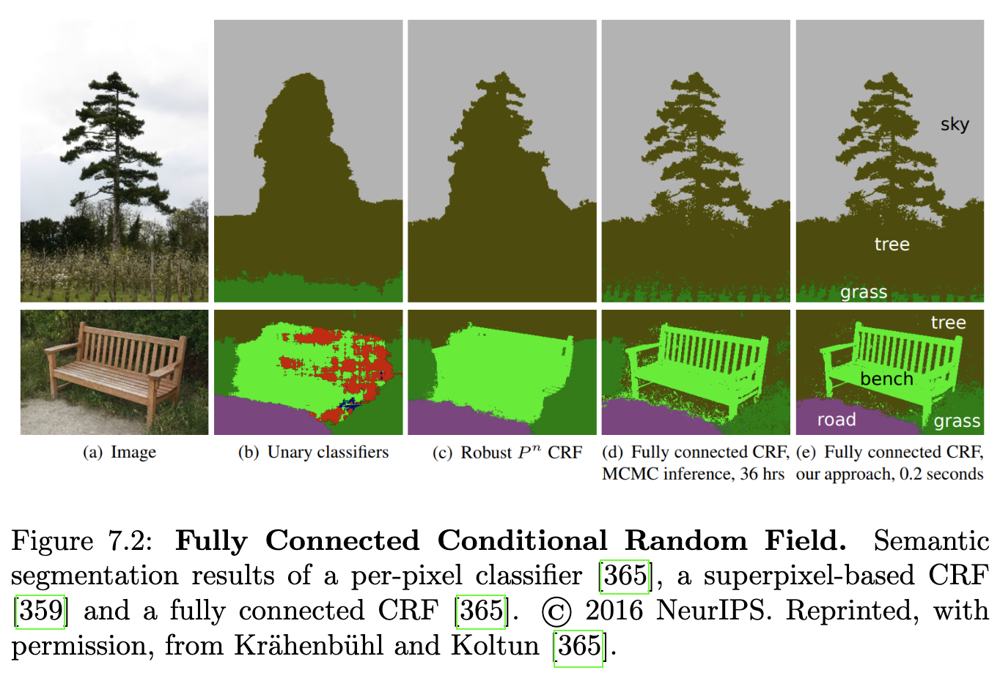

시맨틱 분할의 목표는 이미지의 각 픽셀에 의미론적으로 의미 있는 클래스 레이블(예: 도로, 인도, 보행자, 하늘)을 할당하는 것입니다. 전통적으로 이 문제는 픽셀 [287, 684, 623] 또는 슈퍼픽셀 [288, 359]에 정의된 조건부 랜덤 필드(CRF)에서 최대 사후 확률(MAP) 추론으로 제기되었습니다. 계층적 [287, 374, 384, 386] 및 장거리 연결뿐만 아니라 이미지 영역에 정의된 고차 전위 [288, 359]는 지역 연결을 가진 CRF의 한계를 보완하고 이미지 내의 장거리 상호 작용을 모델링하는 데 활용되었습니다. Kr¨ahenb¨uhl 및 Koltun [365]은 이미지의 모든 픽셀 쌍 간의 쌍별 전위를 모델링하는 완전히 연결된 CRF 모델에 대한 다루기 쉬운 추론 알고리즘을 제안합니다. 완전히 연결된 CRF [542, 227, 359]를 사용하는 이전 방법은 이러한 알고리즘의 계산 및 메모리 복잡성으로 인해 더 작은 이미지 영역에만 적용될 수 있었던 반면, [365]는 픽셀 수준에서 완전히 연결된 CRF 모델을 배포할 수 있도록 합니다. 그림 7.2는 [365]의 결과를 보여주며 픽셀별 분류 및 슈퍼픽셀에 대한 추론 [359]과 비교합니다.

시맨틱 분할 작업을 위한 그래픽 모델에서의 추론에 대한 대안은 Munoz et al. [487]에 의해 제시됩니다. 그들은 더 큰 이미지 영역에 걸쳐 컨텍스트를 캡처하는 계층적 절차에서 추론 모델 시퀀스를 훈련합니다. 이를 통해 정확한 추론이 불가능할 때 구조화된 예측 모델을 훈련하는 어려움을 우회할 수 있으며 매우 효율적이고 정확한 장면 레이블링 알고리즘을 얻을 수 있습니다.

대부분의 이전 접근 방식은 색상, 가장자리 및 질감 정보와 같은 매우 간단한 특징에 의존하지만, Shotton et al. [623]은 더 강력한 특징이 성능을 크게 향상시킬 잠재력이 있다는 것을 관찰했습니다. 그들은 객체의 질감 외관, 그 레이아웃 및 질감 컨텍스트를 활용하는 질감 레이아웃 필터라는 새로운 특징 유형을 기반으로 하는 접근 방식을 제안합니다. 그들은 픽셀 수준 분할을 얻기 위해 CRF에서 질감 레이아웃 필터와 하위 수준 이미지 특징을 결합합니다.

객체 클래스의 동시 발생: 지금까지의 방법은 각 객체 클래스를 독립적으로 고려합니다. 그러나 객체 클래스의 동시 발생은 일반적으로 무작위가 아니며 따라서 시맨틱 분할에 중요한 단서가 될 수 있습니다. 예를 들어, 자동차는 사무실 장면보다 거리 장면에서 발생할 가능성이 높으며 교통 표지판과 같은 다른 거리 장면 객체와 함께 발생합니다. Ladicky et al. [385]은 객체 클래스 동시 발생을 전역 특징으로 CRF에 명시적으로 통합할 것을 제안합니다. 그들은 그래프 컷을 사용하여 CRF를 최적화하고 쌍별 모델에 비해 더 나은 성능을 보여줍니다. Zhang와 Chen [788]은 다른 객체 범주의 공간적 배열을 인코딩하여 이 아이디어를 확장합니다. Myeong et al. [491]은 주석이 달린 영역 쌍에서 컨텍스트 관계를 추출하는 검색 기반 접근 방식을 제안합니다.

### 7.2.1 시맨틱 분할을 위한 딥 러닝

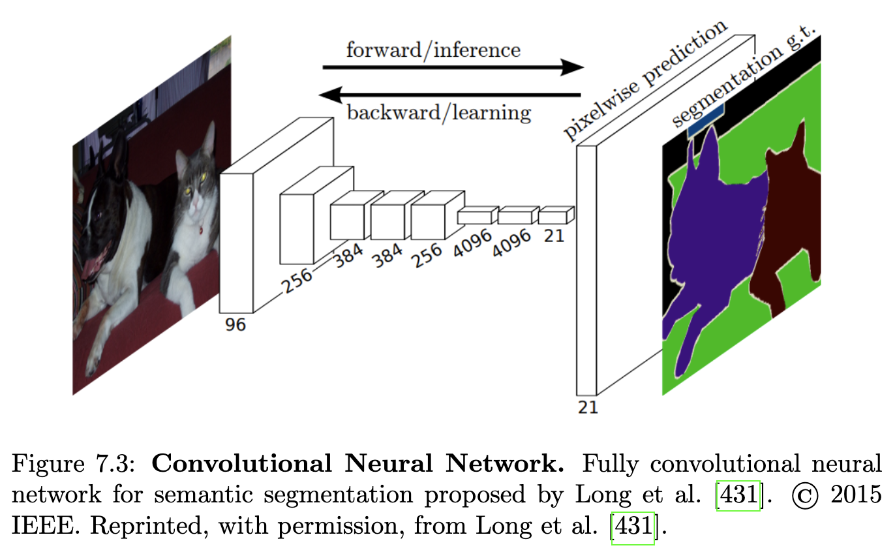

이미지 분류 및 객체 감지를 위한 딥 컨볼루션 신경망의 성공은 픽셀 수준 작업, 특히 시맨틱 분할 해결에 대한 잠재력을 활용하는 데 관심을 불러일으켰습니다. 그림 7.3에 나타난 완전 컨볼루션 신경망 [431]은 이미지 분할 문제에 CNN을 적용한 가장 초기 작업 중 하나입니다. 이미지 분류를 위한 최신 컨볼루션 신경망은 해상도를 낮추는 연속적인 풀링 및 서브샘플링 레이어를 통해 다중 스케일 컨텍스트 정보를 결합합니다. 그러나 시맨틱 분할은 완전 해상도 예측, 즉 밀집 예측과 함께 다중 스케일 컨텍스트 추론을 필요로 합니다.

따라서 다중 스케일 추론과 전체 해상도 출력이라는 상반된 요구 사항을 해결하기 위해 여러 방법 [111, 766, 249, 24]이 제안되었습니다. Dilated convolution(팽창 컨볼루션) [111, 766]은 해상도 손실 없이 신경망의 수용 영역을 확대합니다. Dilated convolution 연산은 필터를 적용하면서 픽셀을 건너뛰는 일반 컨볼루션에 해당합니다. 이를 통해 모델 매개변수 수를 늘리지 않고도 효율적인 다중 스케일 추론이 가능합니다. Chen et al. [110]은 병렬로 다른 샘플링 속도를 가진 여러 dilated convolution을 사용하여 이 아이디어를 확장합니다.

이와 대조적으로 Badrinarayanan et al. [24]은 스킵 연결을 가진 인코더-디코더 네트워크를 제안합니다. 각 디코더 레이어는 인코더(최대 풀링) 레이어의 낮은 해상도 특징 맵을 더 높은 해상도 특징 맵으로 매핑합니다. 특히, 그들의 모델에서 디코더는 해당하는 인코더의 최대 풀링(즉, 다운샘플링) 단계에서 계산된 풀링 인덱스를 활용하여 업샘플링 프로세스를 구현합니다. 이것은 업샘플링을 학습할 필요성을 없애고 따라서 더 적은 수의 매개변수를 생성합니다. 또한, 이 접근 방식을 사용하면 더 선명한 분할 경계를 얻을 수 있습니다.

CNN 계층 구조의 하위 수준에서 활성화 맵은 객체 범주에 특정한 정보가 부족하지만, 더 높은 공간 해상도의 정보를 제공합니다. Ghiasi와 Fowlkes [249]는 이 가정을 활용하여 완전 컨볼루션 네트워크를 기반으로 라플라시안 피라미드를 구성할 것을 제안합니다. 여러 스케일에서 정보를 집계함으로써 낮은 해상도 레이어에서 재구성된 경계를 점진적으로 개선할 수 있습니다. 그들은 더 높은 해상도 특징 맵에서 스킵 연결과 승법 신뢰도 게이팅을 사용하여 이를 달성하며, 이는 낮은 해상도 예측의 신뢰도가 높은 영역에서 노이즈가 많은 고해상도 출력에 불이익을 줍니다.

CNN과 CRF 결합: 다중 스케일 추론과 전체 해상도 예측의 요구 사항을 해결하는 또 다른 방법은 CNN과 CRF 모델의 결합입니다. Chen et al. [111]과 Chen et al. [110]은 완전 연결 CRF 모델 [365]을 사용하여 컨볼루션 신경망을 통해 얻은 레이블 맵을 개선할 것을 제안합니다. CRF는 CNN 모델의 제한된 공간 정확도로 인해 CNN 출력에서 누락된 원시 RGB 입력에 기반한 미세한 세부 사항을 캡처할 수 있도록 합니다. 유사한 방식으로 Jampani et al. [320]은 양방향 필터를 일반화하고 CRF 추론 [418]을 통해 역전파하여 데이터에서 (일반화된) 필터 매개변수를 엔드투엔드 훈련할 수 있도록 합니다. 이는 입력 특징을 안내 신호로 활용하여 하나의 컨볼루션 레이어 내에서 더 큰 공간 영역에 대한 추론을 효과적으로 가능하게 합니다.

시맨틱 분할을 위한 고차 CRF에서 영감을 받아 Gadde et al. [221]은 구조화된 CNN 및 CRF 기술의 대안으로 CNN 아키텍처를 위한 새로운 양방향 Inception 모듈을 제안합니다. 그들은 공간적으로나 광도적으로 유사한 픽셀이 동일한 레이블을 가질 가능성이 더 높다는 가정을 사용합니다. 이를 통해 장거리 상호 작용을 직접 학습할 수 있으며, CRF 모델을 사용한 후처리의 필요성을 제거합니다. 특히, 제안된 모듈은 공간 및 색상 유사성을 기반으로 원거리 픽셀 간에 가장자리 인식 정보를 전파하고, 슈퍼픽셀의 공간 레이아웃을 통합합니다. 정보 전파는 다양한 스케일에서 가우시안 커널이 있는 양방향 필터를 적용하여 달성됩니다.

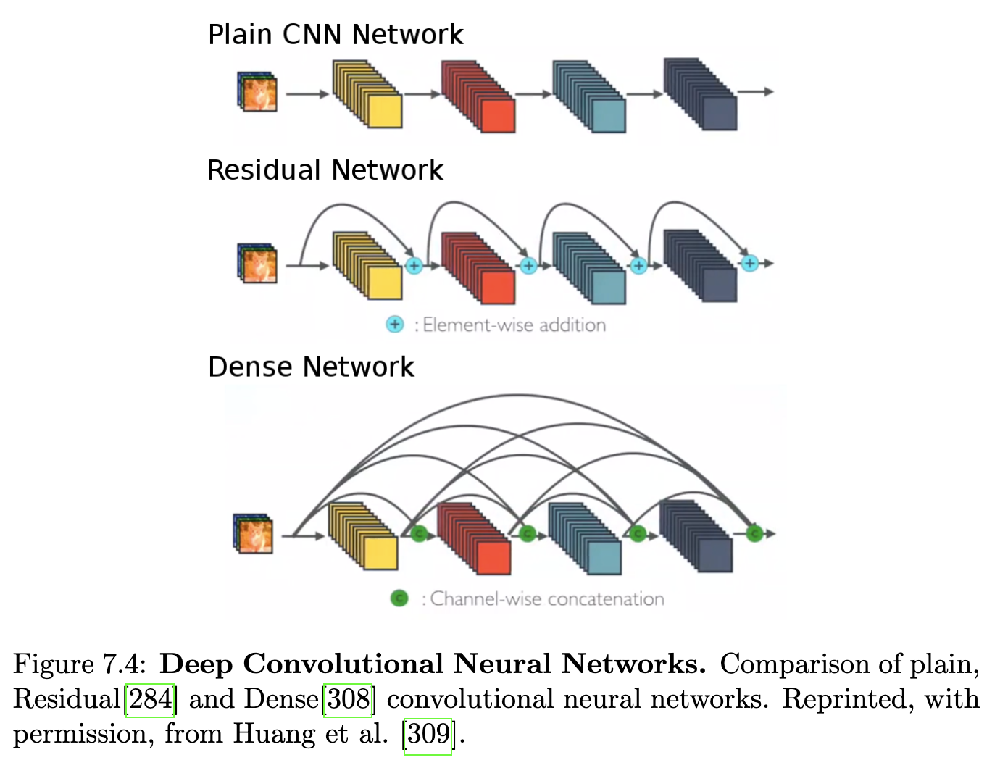

더 깊은 CNN: Simonyan과 Zisserman [627]과 Szegedy et al. [651]은 CNN의 깊이가 풍부한 특징을 표현하는 데 중요하다는 것을 보여주었습니다. 그러나 네트워크의 깊이를 늘리면 복잡성이 증가할 뿐만 아니라 정확도가 포화되고 저하됩니다. He et al. [284]는 이 문제를 해결하기 위해 그림 7.4에 나타난 딥 잔차 학습 프레임워크(ResNet)를 제안했습니다. 딥 잔차 네트워크에서 각 스택형 레이어는 원래 매핑 대신 잔차 매핑을 학습합니다. 이는 기울기 역전파를 용이하게 하고 따라서 훈련을 용이하게 하며 일반적인 딥 네트워크에 비해 더 높은 정확도를 얻습니다. Pohlen et al. [530]은 두 개의 다른 처리 스트림을 결합하여 전체 네트워크에서 고해상도 정보를 보존하는 ResNet과 유사한 아키텍처를 제시합니다. 한 스트림은 일련의 컨볼루션 및 풀링 레이어를 통과하는 반면, 다른 스트림은 다른 스트림에서 연속적인 잔차를 추가하여 전체 이미지 해상도에서 특징 맵을 처리합니다. 두 처리 스트림은 전체 해상도 잔차 단위를 사용하여 연결됩니다.

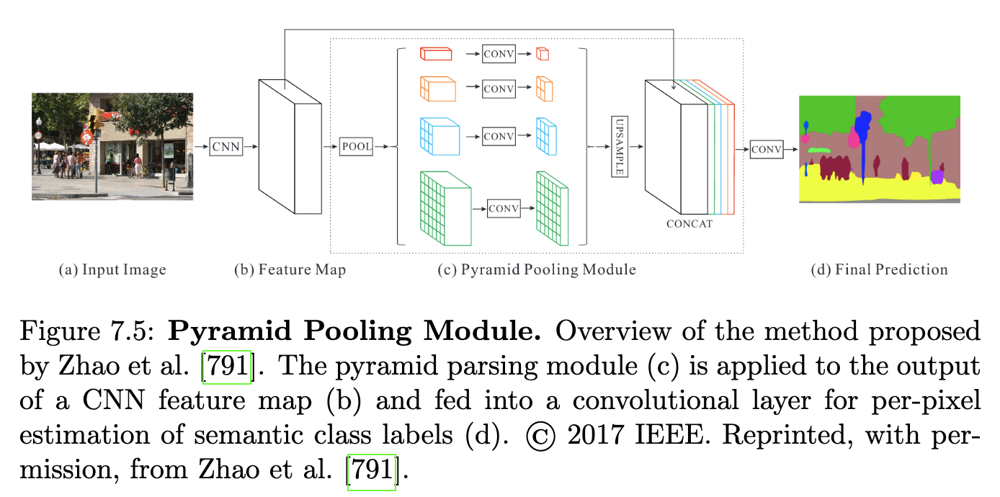

Wu et al. [734]은 잔여 단위의 유효 깊이를 분석하여 더 효율적인 ResNet 아키텍처를 제안합니다. 그들은 ResNets가 얕은 네트워크의 선형 앙상블처럼 작동한다고 지적합니다. 이러한 이해를 바탕으로 그들은 시맨틱 이미지 분할 작업을 위해 상대적으로 얕은 컨볼루션 네트워크 그룹을 설계했으며, 이는 더 나은 성능을 보입니다. 픽셀 수준 예측 작업에 전역 컨텍스트 정보를 더 잘 통합하기 위해 Zhao et al. [791]은 그림 7.5에 나타난 피라미드 장면 구문 분석 네트워크(PSPNet)를 제안합니다. 그들은 CNN의 마지막 컨볼루션 레이어에 피라미드 구문 분석 모듈을 적용하여 여러 피라미드 스케일의 특징을 융합하여 지역 및 전역 컨텍스트 정보를 결합합니다. 결과 표현은 최종 픽셀당 예측을 얻기 위해 컨볼루션 레이어에 공급됩니다. 이 작업에 영감을 받아 [112]는 확장된 컨볼루션의 캐스케이딩 및 병렬 적용을 실험하여 Atrous Spatial Pyramid Pooling (ASPP) [110]를 재방문했습니다. 이를 통해 이전 작업 [110]을 개선하면서 PSPNet [791]과 비교할 수 있는 결과를 달성합니다.

ResNet과 같은 더 깊은 아키텍처에서 영감을 받아 Huang et al. [308]은 연결을 통해 레이어를 모든 이전 레이어와 연결하는 밀집 컨볼루션 네트워크를 제안합니다. 이를 통해 하위 수준에서 상위 수준으로 최대 정보 처리량을 허용합니다. 그림 7.4에는 일반, 잔차 및 밀집 아키텍처가 나와 있습니다. J´egou et al. [324]은 밀집 모듈을 사용하여 다운샘플링 및 업샘플링 경로를 구성하고 스킵 연결 [567]로 연결하여 밀집 CNN을 시맨틱 분할 문제로 확장합니다.

### 7.2.2 비디오

자율 주행과 같은 로봇 애플리케이션에서는 일반적으로 단일 이미지 프레임이 아닌 비디오에 접근할 수 있습니다. 인접 프레임 간의 시간적 상관 관계를 활용하여 분할 정확도, 효율성 및 견고성을 향상시킬 수 있습니다. 장면은 일반적으로 인접한 두 프레임 사이에서 약간만 변합니다. 따라서 두 프레임 간의 대응 관계가 주어지면 시간 정보에 따라 시맨틱 레이블을 시간에 따라 전파하거나 수정할 수 있습니다.

Floros와 Leibe [207]는 프레임 간의 시간적 일관성을 강화하기 위해 비디오 시퀀스에서 작동하는 시맨틱 분할을 위한 그래픽 모델을 제안합니다. 특히, 그들은 구조-모션(SfM)에서 얻은 추론된 3D 장면 포인트에 해당하는 이미지 픽셀을 연결하여 연속적인 비디오 프레임 간의 시간적 일관성을 보장하는 CRF를 제시합니다. 이미지 전용 기준선과 비교하여 향상된 분할 성능을 달성하고 다양한 이미지 조건에 대한 더 나은 일반화를 관찰합니다. 3D 재구성은 정적 장면에서는 비교적 잘 작동하지만 동적 장면에서는 여전히 해결되지 않은 문제입니다. 카메라와 객체 움직임 모두의 존재는 비디오에서 시간적 연관성을 어려운 작업으로 만듭니다. 상당한 움직임이 있는 경우, 시공간 볼륨의 유클리드 거리는 대응 관계를 찾는 데 좋은 측정이 아닙니다. 이 문제를 해결하기 위해 Kundu et al. [378]은 시공간 정규화를 위한 밀집 CRF의 특징 공간을 최적화하는 방법을 제안합니다. 특히, 특징 공간은 광학 흐름에서 얻은 대응 관계를 사용하여 해당 지점과 관련된 특징 간의 거리가 최소화되도록 최적화됩니다. 결과 매핑은 CRF에 의해 활용되어 전체 시공간 볼륨에 걸쳐 장거리 정규화를 달성합니다.

레이블 전파: 시맨틱 분할을 위해 비디오에서 시간적 상관 관계를 탐색하는 또 다른 방법은 레이블 전파입니다. 매우 정확한 픽셀 수준 주석이 있는 대규모 이미지 데이터셋을 생성하는 것은 노동 집약적이며, 따라서 원하는 품질 수준을 얻는 데는 비용이 많이 듭니다. 비디오 시퀀스 주석을 위한 반지도 학습 방법은 이 비용을 줄이는 데 도움이 될 수 있습니다. 개별 이미지를 주석 처리하는 것과 비교하여 비디오 시퀀스는 연속적인 프레임 간의 시간적 일관성이라는 장점을 제공합니다. 레이블 전파 기술은 색상 및 모션 정보를 활용하여 주석이 달린 소수의 키프레임에서 비디오의 모든 주석이 없는 프레임으로 주석을 전파함으로써 이 사실을 활용합니다.

이를 위해 Badrinarayanan et al. [23]은 패치 기반 유사성 및 의미론적으로 일관된 영역에서 얻은 대응 관계를 기반으로 전파 스키마를 사용하는 결합된 베이즈 네트워크를 제안합니다. 이를 통해 레이블 정보를 주석이 없는 키프레임 간의 주석이 없는 프레임으로 전송할 수 있습니다. Budvytis et al. [88]은 [23]에서 도입된 생성적 전파의 하이브리드 모델과 가려짐 및 가려짐 해제에 대처하고 더 긴 시간 간격에 걸쳐 전파할 수 있는 판별적 분류 단계를 제안하여 이 접근 방식을 확장합니다. 잘못 전파된 레이블을 수정하기 위해 Badrinarayanan et al. [22]은 슈퍼픽셀 기반 트리 혼합 모델을 제안합니다. 여기서 혼합의 각 구성 요소는 다른 프레임의 슈퍼픽셀 간의 트리 구조 시간적 연결을 포함합니다. Vijayanarasimhan과 Grauman [687]은 예상 전파 오류를 최소화하도록 수동 레이블링을 위한 가장 유망한 키프레임을 선택하는 문제를 다룹니다.

앞서 언급된 방법들이 2D로 주석을 전송하는 반면, Chen et al. [108]과 Xie et al. [742]는 3D에서 직접 주석을 달고 이 주석을 이미지 도메인으로 전송할 것을 제안합니다. 3D 정보(예: 스테레오 또는 LiDAR에서 얻은 정보)가 주어지면 이러한 접근 방식은 제한된 주석 비용으로 시간적으로 일관된 시맨틱 레이블을 생성할 수 있습니다. 이를 위해 Chen et al. [108]은 KITTI [242]의 주석을 사용하고 자동차의 3D CAD 모델을 활용하여 이미지의 모든 자동차에 대한 별도의 배경-전경 분할을 추론합니다. 이와 대조적으로 Xie et al. [742]는 CAD 모델 또는 3D 포인트 측정이 불가능한 범주까지 처리함으로써 장면의 모든 객체에 대해 공동으로 추론합니다. 이를 위해 그들은 이미지의 모든 3D 포인트와 픽셀의 의미론적 및 인스턴스 레이블에 대해 공동으로 추론하는 비지역적 CRF 모델을 제안합니다.

장면 이해: 14장에서 논의된 [196, 241]과 같은 장면 이해 접근 방식은 도로 토폴로지 및 교통 참가자에 대한 추론을 위한 단서로 시맨틱 분할을 활용합니다. Ess et al. [196]은 짧은 비디오 시퀀스를 기반으로 장면을 다른 도로 토폴로지로 분류하기 위해 시맨틱 정보를 사용하는 반면, Geiger et al. [241]은 차량 궤적, 소실점, 장면 흐름 및 점유 정보와 함께 시맨틱 분할을 설명하는 확률 모델을 공식화합니다. 그러나 두 접근 방식 모두 시맨틱 분할 자체를 개선하기 위해 시간적 상관 관계를 활용하지 않습니다.

### 7.2.3 거리 측면 보기

자율 주행 차량에 중요한 응용 분야를 가진 시맨틱 분할의 한 특정 응용 시나리오는 거리 측면 이미지(즉, 건물 정면)를 구성 요소(벽, 문, 창문, 식물, 발코니, 상점, 우편함 등)로 분할하는 것입니다. 이러한 시맨틱 분할은 정확한 3D 재구성 [268, 267, 119], 메모리 효율적인 3D 매핑, 견고한 위치 파악 [601] 및 경로 계획에 유용합니다. 예를 들어, 3D 재구성 응용 분야에서 이러한 측면 정보는 모델링하기 어렵고 시간이 지남에 따라 변하는 식물을 무시할 수 있도록 합니다.

Xiao와 Quan [741]은 거리를 따라 주행하는 자동차에 장착된 카메라로 캡처한 이미지에 대한 다중 뷰 시맨틱 분할 프레임워크를 제안합니다. 특히, 그들은 여러 뷰의 슈퍼픽셀에 걸쳐 쌍별 MRF를 정의하며, 여기서 단항 항은 2D 및 3D 특징을 기반으로 합니다. 또한, 그들은 공간 평활화를 위해 색상 차이를 최소화하고 다른 뷰 간의 평활화를 강화하기 위해 밀집 대응을 사용합니다. Xiao et al. [740]은 한 걸음 더 나아가 지상 수준에서 캡처한 이미지에서 사진처럼 사실적인 3D 모델을 생성합니다. 특히, 그들은 각 이미지를 건물, 하늘, 지면, 식물 또는 자동차와 같이 의미론적으로 의미 있는 영역으로 분할합니다. 그런 다음 추론을 위한 건축학적 사전 지식을 활용하여 건물을 독립적인 블록으로 분할합니다. 이를 통해 노이즈가 많거나 누락된 3D 데이터를 처리하고 시각적으로 매력적인 결과를 생성할 수 있습니다. Xiao와 Quan [741]과 Xiao ets. [740]이 평면 또는 간단한 기하학적 기본 요소를 사용하여 정면을 나타내는 반면, Mathias et al. [451]은 건물 정면 분할을 위한 더 유연한 3계층 방법을 제안합니다. 첫째, 정면은 창문 및 문과 같은 건축 요소 감지기의 출력과 결합된 의미론적 클래스로 분할됩니다. 마지막으로, 정렬, 대칭 및 동시 발생과 같은 약한 건축학적 사전 지식이 재구성이 건축학적으로 일관되도록 장려하는 데 활용됩니다. 완전한 파이프라인은 그림 7.6에 나타나 있습니다.

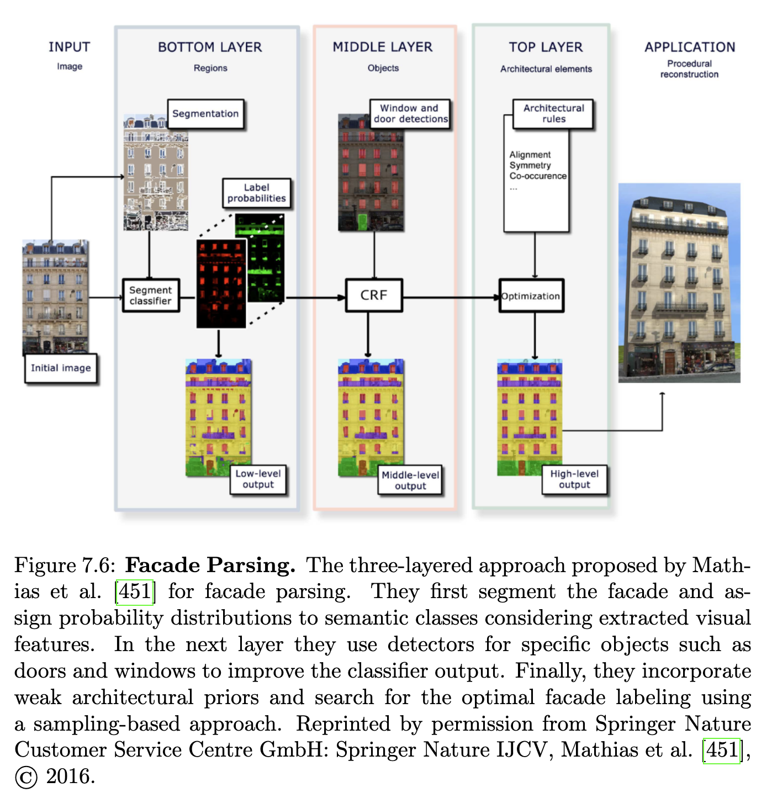

### 7.2.4 3D 데이터

시맨틱 객체 레이블링 문제는 광범위하게 연구되었지만, 이러한 알고리즘의 대부분은 2D 이미지 도메인에서 작동하며 이미지의 각 픽셀은 자동차, 도로 또는 포장 도로와 같은 의미론적 범주로 레이블이 지정됩니다. 그러나 2D 이미지는 객체의 3D 형상 및 스케일과 같은 중요한 정보가 부족하며, 이는 객체 클래스 분할에 강력한 단서가 되고 개별 객체 인스턴스의 감지 및 분리를 용이하게 합니다. 또한, 3D 데이터의 시맨틱 분할은 자율 시스템이 주변 환경을 인식하고 물리적 3D 공간에서 관심 객체를 식별하고 상호 작용할 수 있도록 합니다.

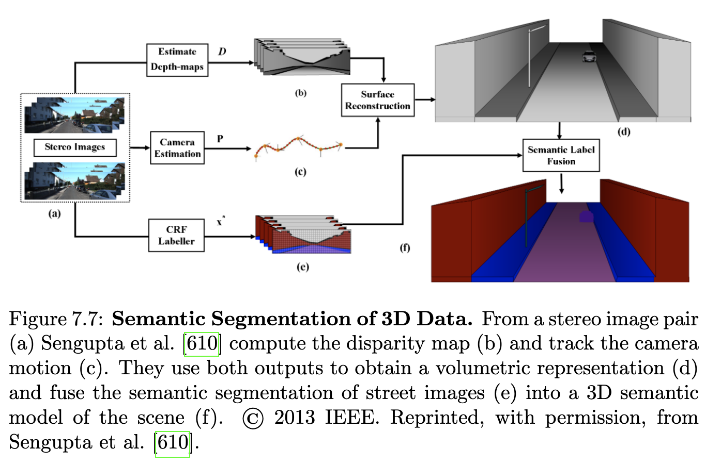

3D 시맨틱 분할 문제는 단안 이미지 시퀀스 [450], 스테레오 이미지 시퀀스 [682, 610] 또는 3D 포인트 클라우드 [744, 303, 266, 222]와 같은 다양한 입력 모달리티를 사용하여 다루어졌습니다. Martinovi´c et al. [450]과 Valentin et al. [682]은 10장에서 논의된 다중 뷰 재구성 접근 방식을 사용하여 단안 이미지 시퀀스에서 장면의 3D 구조를 추정하는 반면, Gadde et al. [222]와 Hackel et al. [266]은 LiDAR와 같은 3D 포인트 클라우드를 직접 사용합니다. Sengupta et al. [610]은 그림 7.7에 나타난 바와 같이 시각적 오도메트리에서 얻은 자체 움직임 추정을 사용하여 깊이 맵 융합에서 얻은 3D 모델에 2D 시맨틱 분할을 투영할 것을 제안합니다. 병렬로 입력 이미지는 CRF 모델을 사용하여 의미론적으로 레이블이 지정됩니다. 이 분할 결과는 최종 3D 시맨틱 모델을 생성하기 위해 시퀀스에 걸쳐 집계됩니다.

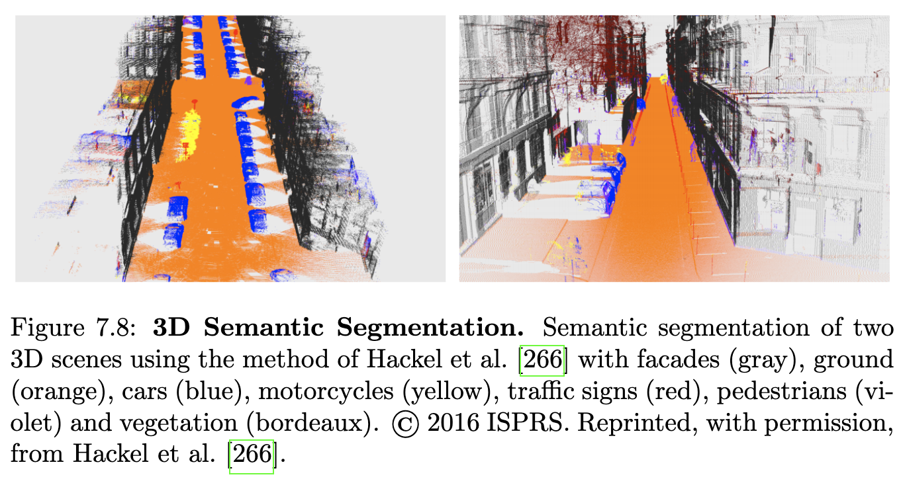

여러 접근 방식 [303, 682, 450, 222, 266]은 그림 7.8에 나타난 바와 같이 3D 공간에서 직접 시맨틱 장면 재구성 문제를 해결합니다. Valentin et al. [682]은 계단식 분류기를 적용하여 메시에서 기하학적 단서를 학습하고 이미지에서 외형 단서를 학습합니다. 이와 대조적으로 Martinovi´c et al. [450]은 3D 특징에 대한 랜덤 포레스트 분류기를 훈련함으로써 2D와 3D 표현 간의 시간 소모적인 변환을 피합니다. 그 후, 그들은 의미론적 구조를 기반으로 개별 정면을 분리하고 약한 건축학적 사전 지식을 적용합니다. 건축학적 사전 지식을 적용하는 대신 Gadde et al. [222]은 자동 컨텍스트 특징을 사용하여 쌓인 부스팅 결정 트리 분류기 시퀀스를 구현합니다. 그들은 이 시스템이 추론 시간에 빠르고 새로운 데이터셋에 쉽게 적응한다는 것을 보여줍니다. Hackel et al. [266]은 큰 3D 포인트 클라우드를 위한 빠른 시맨틱 분할 접근 방식을 제안하며, 이는 강하게 변화하는 밀도도 처리할 수 있습니다. 그들은 포인트 클라우드를 다운샘플링하여 밀도가 감소하는 피라미드를 생성함으로써 근사 다중 스케일 이웃을 구성합니다. 이 방식은 거칠기, 표면 방향 및 지상 높이와 같은 포인트의 지역 이웃에서 기하학을 포착하는 풍부한 특징 표현을 추출할 수 있도록 합니다. 랜덤 포레스트 분류기는 최종적으로 클래스 조건부 확률을 예측합니다.

[610]과 같은 이미지 기반 3D 시맨틱 분할 접근 방식은 3D 모델 재구성에 사용되는 이미지의 겹침으로 인해 중복 계산을 초래합니다. 따라서 3D 공간에서 직접 작동하는 접근 방식은 일반적으로 더 효율적입니다. Riemenschneider et al. [564]은 모든 겹치는 이미지 레이블링의 내재된 중복성을 활용하여 이미지 기반 3D 시맨틱 분할의 효율성을 더욱 높입니다. 그들은 다중 뷰 스테레오에서 얻은 3D 메시 모델의 기하학을 활용하여 시맨틱 클래스 레이블을 추론하기 전에 메시의 각 면에 대한 최상의 뷰를 예측하는 접근 방식을 제안합니다. 이를 통해 그들은 파이프라인을 두 자릿수까지 가속화할 수 있지만, Martinovi´c et al. [450]보다 정확도가 낮습니다.

온라인 방법: 앞서 언급된 모든 방법은 배치 모드, 즉 모든 데이터를 한 번에 처리하는 반면, 온라인 방법은 새로운 측정값을 유연하게 통합할 수 있도록 합니다. 이는 새로운 데이터가 지속적으로 도착하는 자율 주행의 맥락에서 특히 유용합니다. 온라인 3D 시맨틱 분할을 위해 Xiong et al. [744]은 분류기 시퀀스를 훈련하여 거친-미세 방식으로 다른 스케일에서 예측을 수행합니다(영역에서 포인트까지). 이전 스케일의 예측은 현재 스케일에 대한 추가 정보로 사용됩니다. 그들은 [303]에서 3D 데이터의 계층적 표현과 개선된 추론 절차로 이 작업을 확장합니다. Vineet et al. [688]은 실시간 밀집 스테레오 재구성 및 실외 환경의 시맨틱 분할을 수행하면서 데이터를 점진적으로 처리하는 엔드 투 엔드 시스템을 제안합니다. 그들은 이를 위해 복셀 해싱 [498], 즉 대상 환경에서 차지되지 않은 공간을 무시하는 해시 테이블 기반 3D 볼륨 표현을 사용합니다. 또한, 그들은 복셀 레이블링을 점진적으로 개선하고 최신 GPU의 처리 능력을 활용하여 실시간 속도를 달성하는 온라인 볼륨 평균 필드 추론 기술을 사용합니다. McCormac et al. [458]은 CNN의 시맨틱 예측과 SLAM 시스템(Whelan et al. [715]의 ElasticFusion)의 기하학적 정보를 융합하여 온라인으로 작동하도록 설계된 밀집 3D 시맨틱 매핑 파이프라인을 제시합니다. 특히, ElasticFusion은 2D 프레임과 표면 요소 또는 "서프셀"의 전역적으로 일관된 맵 간의 대응 관계를 제공합니다. 또한, 그들은 CNN의 예측을 기반으로 각 서프셀에 대한 클래스 확률을 계산하는 베이즈 업데이트 스키마를 사용합니다.

3D CNN: 컨볼루션 네트워크는 2D 이미지의 의미론적 분할에서 매우 성공적인 것으로 입증되었지만, 컨볼루션 네트워크를 사용하여 3D 데이터에 레이블을 지정하는 작업은 비교적 적습니다. Maturana와 Scherer [456]는 3D 컨볼루션 신경망(3D-CNN)을 부피 3D 데이터의 객체 인식에 적용한 최초의 연구자 중 한 명입니다. 그들의 VoxNet 접근 방식은 컨볼루션 신경망을 사용하여 323개의 복셀 볼륨을 분류합니다. 이와 대조적으로 Huang와 You [310]는 3D-CNN을 사용하여 3D 포인트 클라우드 데이터를 직접 레이블링하기 위한 프레임워크를 제안합니다. 특히, 그들은 무작위로 생성된 키포인트 집합을 중심으로 하는 203 크기의 3D 점유 그리드를 계산합니다. 점유와 레이블은 컨볼루션 레이어, 최대 풀링 레이어, 완전 연결 레이어 및 로지스틱 회귀 레이어로 구성된 3D CNN의 입력으로 사용됩니다. 더 큰 볼륨을 처리하기 위해 Riegler et al. [563]은 Oct-Nets, 즉 3D 컨볼루션 네트워크를 제안합니다. 이 네트워크는 훨씬 더 높은 해상도에서 딥 아키텍처를 훈련할 수 있도록 합니다. 그들은 3D 데이터(예: 포인트 클라우드, 메시)가 본질적으로 희소하다는 관찰에 기반합니다. OctNet은 3D 공간을 옥트리로 계층적으로 분할하고 데이터 적응 방식으로 풀링을 적용하여 이러한 희소성 속성을 활용합니다. 이는 컨볼루션 네트워크 연산이 이러한 트리의 구조에 정의되므로 계산 및 메모리 요구 사항을 줄여줍니다. 따라서 입력 구조에 따라 리소스를 동적으로 할당할 수 있습니다.

### 7.2.5 도로 분할

도로 장면의 분할은 자율 주행을 위한 컴퓨터 비전에서 중요한 문제입니다. 예를 들어, 자율 주행 차량은 내비게이션을 위해 앞의 주행 가능 영역을 결정하고 차선 표시와 관련하여 도로에서 자신의 위치를 결정해야 합니다. 그러나 이 문제는 자동차 및 사람과 같이 다양한 모양의 객체, 다른 도로 유형, 변화하는 조명 및 날씨 조건의 존재로 인해 어렵습니다. 전통적으로 자율 주행 문제는 차선 표시 감지 [61, 730, 400, 413]로 해결되었습니다. 그러나 차선 표시 특징은 종종 신뢰할 수 없으므로(악천후, 건설 현장, 차선 표시 누락) 최근에는 전체 도로 영역을 고려하는 보다 전체론적인 접근 방식이 탐구되었습니다.

알바레즈 외 [4]는 저수준 외관 단서와 지평선, 소실점, 3D 장면 레이아웃 및 3D 도로 모델과 같은 상황별 3D 도로 단서를 결합하여 도로 시퀀스를 분류하는 베이즈 프레임워크를 제안합니다. 또한, 그들은 결과를 시간적으로 평활화하기 위해 시간적 단서를 추출합니다. 후속 작업에서 알바레즈와 로페즈 [6]는 그림자에 대한 견고성을 위해 이미지를 조명 불변 특징 공간으로 변환합니다. 만싱카 외 [448]는 차량 장착 카메라로 촬영한 이미지에서 도로를 추론하기 위해 생성 확률 그래픽 프로그램(GPGP)을 사용하는 역그래픽 영감 방법론을 제안합니다. GPGP는 도로 장면 사전에서 무작위 샘플을 생성하기 위한 확률적 장면 생성기, 각 샘플의 이미지 분할을 렌더링하기 위한 그래픽 렌더러, 그리고 렌더러의 출력과 데이터를 연결하는 확률적 우도 모델로 구성됩니다. Kuehnl et al. [371]은 장면의 공간적 레이아웃을 통합하여 외관 기반 분류를 개선하는 방법을 제시합니다. 특히, 그들은 도로 분할을 위한 두 단계 접근 방식을 제안합니다. 첫째, 그들은 지역 시각적 특징을 기반으로 한 신뢰도 맵을 사용하여 도로 표면과 연석 및 차선 표시와 같은 경계 요소를 표현합니다. 이 신뢰도 맵에서 그들은 장면의 전역 속성을 통합하는 SPatial RAY(SPRAY) 특징을 추출하고 해당 특징에 대해 분류기를 훈련합니다. 그들의 평가는 공간적 레이아웃이 다른 공간 위치의 속성 간에 명확한 구조적 대응 관계가 있는 경우 특히 도움이 된다는 것을 보여줍니다.

딥러닝: 최근 도로 분할 문제는 컨볼루션 신경망 [477, 502]을 사용하여 다루어졌습니다. Mohan [477]은 특징 학습을 위한 전통적인 CNN과 결합된 디컨볼루션 네트워크 [776]를 사용하여 장면 분석 시스템을 제안합니다. 디컨볼루션 네트워크는 이미지 데이터에서 가장자리 교차점, 평행성 및 대칭성과 같은 중간 수준 단서를 포착하는 특징을 학습하여 보다 견고한 표현을 얻습니다. Oliveira et al. [502]는 U-Nets [567]을 사용하여 분할 품질과 런타임 간의 절충점을 조사합니다. 특히, 그들은 런타임을 줄이기 위해 네트워크의 업컨볼루션 부분에서 클래스와 필터 간의 새로운 매핑을 도입합니다. 그들은 또한 단일 전방향 패스로 전체 이미지를 분할하여 패치 기반 접근 방식 [477]보다 더 효율적인 접근 방식을 제공합니다. 그러나 도로 분할은 시맨틱 분할의 하위 문제이므로 오늘날 도로 분할에 대한 대부분의 최첨단 결과는 일반적인 상용 시맨틱 분할 네트워크를 사용하여 달성됩니다.

데이터 수집: 도로 장면 레이블링을 위한 모든 기존 알고리즘은 머신러닝을 기반으로 하며, 해당 모델의 매개변수는 대규모 주석이 달린 데이터셋에서 추정되어야 합니다. 대규모 데이터셋을 수동으로 주석 처리하는 부담을 덜기 위해 ´Alvarez et al. [5]은 일반 이미지 데이터베이스에서 훈련된 컨볼루션 신경망을 사용하여 도로 이미지에 대한 노이즈가 있는 훈련 레이블을 생성하는 도로 분할 방법을 제안합니다. Laddha et al. [383]은 다른 접근 방식을 따르며, GPS 센서에서 제공하는 차량 자세를 사용하여 이미지 도메인에 투영된 OpenStreetMap 정보를 활용하여 지상 진실 레이블을 얻습니다.

### 7.2.6 자유 공간 추정

자유 공간의 정확하고 신뢰할 수 있는 추정 및 장애물 감지는 자율 주행을 가능하게 하는 데 해결해야 할 핵심 문제입니다. 자유 공간은 차량의 충돌 없는 내비게이션이 보장되는 지면의 사용 가능한 공간으로 정의됩니다. 장애물은 지면에서 돌출되어 차량의 경로를 막는 구조를 나타냅니다. 도로 분할 접근 방식과 달리, 차량 앞 자유 공간을 추정하는 방법은 종종 스테레오 센서에서 계산된 깊이 맵에서 파생될 수 있는 기하학적 특징에 의존합니다. 그러나 두 보완적인 접근 방식은 유리하게 결합될 수 있습니다.

Badino et al. [19]는 스테레오 정보를 기반으로 확률적 점유 그리드를 계산하여 자유 공간 추정 방법을 제안합니다. 여기서 확률적 점유 그리드의 셀은 점유 가능성에 대한 정보를 가집니다. 깊이 불확실성을 줄이기 위해 스테레오 정보는 시간에 따라 통합됩니다. 자유 공간과 점유 공간 사이의 경계는 점유 그리드에 대한 동적 프로그래밍을 사용하여 견고하게 얻어집니다. 이 작업은 Stixel 표현의 기초를 놓았습니다. 자세한 내용은 섹션 7.2.7을 참조하십시오. Badino et al. [19]의 원래 방법은 평면 도로 표면을 가정하지만, 이 가정은 실제로는 종종 위반됩니다. 더 복잡한 도로 표면을 다루기 위해 Wedel et al. [708]은 B-스플라인을 사용하여 비평면 도로 표면을 모델링하는 알고리즘을 제안합니다. 표면 매개변수는 스테레오 측정값에서 추정되고 칼만 필터를 사용하여 시간에 따라 추적됩니다. 이와 대조적으로 Suleymanov et al. [641]은 변분 접근 방식을 사용하여 스테레오 정보를 기반으로 충돌 없는 통행 가능한 경로를 감지하고 주행하기 위한 완전한 파이프라인을 제안합니다. 자유 공간 감지 외에도 그들의 접근 방식은 장면의 의미론적 분할을 설정하며, 여기서 레이블에는 지면, 하늘, 장애물 및 식물이 포함됩니다.

섹션 3.1.1에서 논의된 어안 카메라는 일반 카메라에 비해 더 넓은 시야를 제공하며 자동차에 더 가까운 장애물을 감지할 수 있습니다. H¨ane et al. [272]은 단안 어안 카메라를 사용한 장애물 감지 방법을 제안합니다. 런타임을 줄이기 위해 그들은 정확한 차량 자세를 위해 시각적 오도메트리를 사용하지 않고 대신 휠 오도메트리의 덜 정확한 자세 추정치를 사용합니다. 그들은 객체 간 거리 추정에서 좋은 정확도를 보여주지만, 그들의 실험은 센서에 가까운 객체로 제한됩니다.

장거리 장애물 감지: 관찰자(즉, 자체 차량)가 고속으로 이동하는 경우(예: 고속도로에서) 시기적절한 장애물 위치 파악을 위해 장거리 장애물 감지의 정확도가 중요합니다. 불행히도 스테레오 비전 시스템의 오류는 레이저 거리 센서 또는 레이더 센서와 달리 깊이에 따라 제곱에 비례하여 증가합니다. 이 문제를 해결하기 위해 Pinggera et al. [522, 523]은 스테레오 비전을 사용한 장거리 장애물 감지 알고리즘을 제안합니다. 그들은 카메라 움직임 및 평면성에 대한 기하학적 제약을 활용하여 장애물 감지를 통계적 가설 검정으로 공식화합니다. 입력 이미지에 걸쳐 분포된 작은 로컬 패치에서 독립적인 가설 검정이 수행됩니다. 그들의 데이터셋에서 장면의 감지 결과는 그림 7.9에 나타나 있습니다.

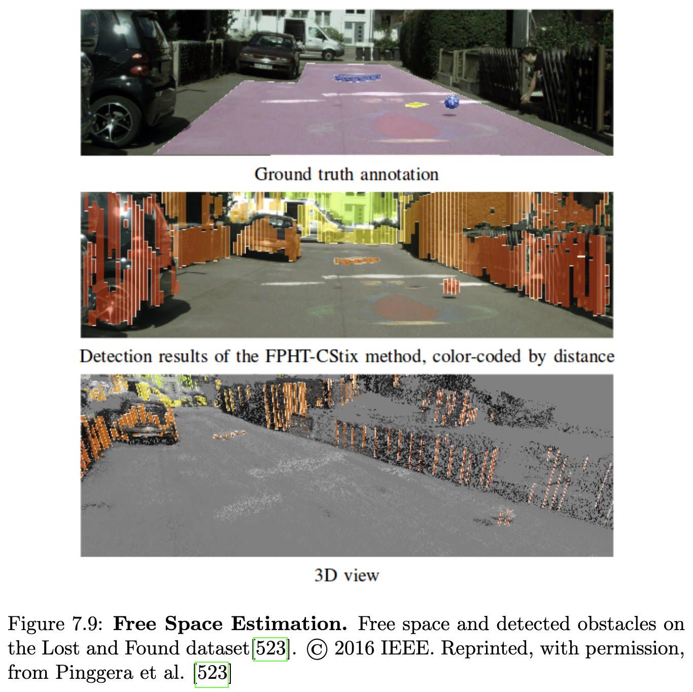

### 7.2.7 스틱셀

스틱셀은 픽셀과 객체 사이의 격차를 해소하기 위한 목표를 가진 3D 교통 장면의 압축된 중간 수준 표현입니다 [20]. "스틱셀 월드"라고 불리는 이 표현은 차량 앞의 자유 공간이 주로 수직 표면에 의해 제한된다는 관찰에서 비롯됩니다. 스틱셀은 이러한 표면을 근사화하기 위해 지면에 수직으로 서 있는 일련의 직사각형 막대로 표현됩니다. 일정한 너비를 가정하면 각 스틱셀은 높이와 카메라에 대한 3D 위치로 정의됩니다. 스틱셀의 주요 목표는 압축되고 완전하며 안정적이고 견고한 표현을 통해 효율성을 얻는 것입니다. 또한, 스틱셀 표현은 장면의 자유 공간 및 장애물에 대한 인코딩을 제공합니다.

SGM [297]에서 얻은 깊이 맵을 입력으로 사용하여 Badino et al. [20]은 점유 그리드를 기반으로 한 동적 프로그래밍을 사용하여 자유 공간을 계산하고 스틱셀의 하단 위치를 결정합니다. Pfeiffer와 Franke [519]는 [20]을 통일된 확률론적 스키마로 확장합니다. 그들은 또한 스틱셀이 지면에 닿아야 한다는 제약을 해제하고 각 이미지 열에 대해 여러 스틱셀을 허용하여 그림 7.10에 나타난 바와 같이 더 유연한 표현을 만듭니다.

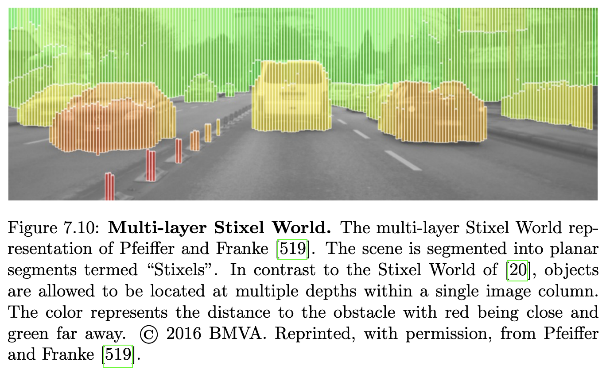

Pfeiffer와 Franke [518]가 도입한 동적 스틱셀 세계 표현에서 스틱셀 표현은 광학 흐름 기반 6D 칼만 필터를 사용하여 스틱셀을 추적함으로써 동적 장면에까지 확장되었습니다. 이와 대조적으로 Güncel et al. [263]은 스틱셀에 대한 모션 추정이 1D 문제로 축소될 수 있으며, 비용이 많이 드는 밀집 광학 흐름 계산을 피하면서 2D 동적 프로그래밍을 통해 효율적으로 해결할 수 있음을 보여줍니다. 동적 스틱셀 세계 표현을 기반으로 Erbs et al. [193, 192]은 교통 장면의 의미론적 분할을 위한 CRF 프레임워크를 제시합니다.

여러 접근 방식은 스틱셀 표현을 보다 견고하게 추론하기 위해 고수준 정보를 활용할 것을 제안했습니다. Cordts et al. [135]은 확률적 접근 방식을 사용하여 하향식 객체 수준 단서를 상향식 스틱셀 표현에 통합합니다. 딥러닝의 성공과 함께 Schneider et al. [596]은 밀집 불일치 맵과 픽셀 수준 의미론적 장면 레이블링에서 장면의 의미론적 및 기하학적 레이아웃을 공동으로 추론하기 위한 의미론적 스틱셀 표현을 제시합니다. 이 목표를 위해 그들은 딥러닝 기반 장면 레이블링 접근 방식을 사용했습니다. 이와 대조적으로 Levi et al. [407]은 입력 이미지에서 각 스틱셀의 발 지점을 직접 추론하기 위해 StixelNet을 제안합니다.

### 7.2.8 항공 이미지

항공 이미지 구문 분석의 목적은 항공 센서로 획득한 데이터에서 도시 객체를 자동으로 추출하는 것입니다. 도로와 같은 도시 객체에 대한 정확하고 상세한 정보의 필요성은 자율 주행 시스템의 내비게이션 응용 분야 때문에 빠르게 증가하고 있습니다. 예를 들어, 항공 이미지 구문 분석의 출력은 도로 지도를 자동으로 구축(심지어 원격 지역에서도)하고 최신 상태로 유지하는 데 사용될 수 있습니다. 또한, 항공 이미지의 정보는 위치 파악에 사용될 수 있습니다. 그러나 이 문제는 건물, 거리, 나무 및 자동차와 같은 객체의 이질적인 외관 때문에 어려우며, 이는 높은 클래스 내 분산과 낮은 클래스 간 분산을 초래합니다. 또한, 도로 네트워크의 복잡한 구조와 기하학 및 토폴로지를 정확하게 표현하기 어렵다는 점이 이 문제를 어렵게 만듭니다. 도로는 접합점에서 만나는 천천히 변하는 곡률을 가진 얇은 세그먼트의 연결된 네트워크를 형성해야 합니다. 이러한 유형의 사전 지식은 표준 평활화 가정보다 구조화된 예측 공식에 형식화하고 통합하기가 더 어렵습니다.

그래픽 모델: 그래픽 모델은 항공 이미지에서 시맨틱 분할 문제를 다루는 매우 인기 있는 방법이었습니다 [711, 712, 479, 685, 454, 455, 710]. Wegner et al. [711]은 도로 레이블링을 위한 CRF 공식을 제안합니다. 여기서 사전 지식은 직선 세그먼트를 따라 슈퍼픽셀 세트를 연결하는 클리크로 표현됩니다. 특히, 그들은 제약을 비대칭 PN-포텐셜을 가진 고차 클리크로 공식화하는데, 이는 구성 슈퍼픽셀 중 일부가 아닌 모든 슈퍼픽셀을 도로 클래스에 할당하는 것을 선호합니다. 이를 통해 도로 가능성이 얇은 체인에 대해 증폭되는 동시에 그래프 컷을 사용하여 효율적인 추론이 가능합니다. Wegner et al. [712]은 또한 장거리, 고차 클리크를 가진 CRF를 사용하여 도로 네트워크를 모델링합니다. 그러나 [711]과 달리 그들은 로컬 특징을 기반으로 최소 비용 경로로 추정 도로를 검색하여 더 복잡한 도로 모양에 적응하는 임의의 모양 세그먼트를 허용합니다. Montoya et al. [479]는 이 공식을 건물 및 도로에 대한 클래스별 사전 지식을 가진 항공 이미지의 다중 레이블 분류로 확장합니다. [712]의 도로 네트워크 사전 지식 외에도, 그들은 건물에 특화된 클리크에 대한 두 번째 고차 포텐셜을 도입합니다. 이와 대조적으로 Verdie와 Lafarge [685]는 도로 네트워크를 포함하여 이미지에서 특정 구조를 복구하기 위해 마르코프 점 프로세스 적용을 제안합니다. 마르코프 점 프로세스는 선 세그먼트와 같은 매개변수 엔티티를 직접 조작하여 객체 인식 문제를 해결할 수 있는 전통적인 MRF의 일반화입니다. 중요하게도, 그들은 모델 선택 문제를 암시적으로 해결합니다. 즉, 관심 객체의 매개변수와 연결될 수 있는 MRF에서 임의의 수의 변수를 허용합니다.

지도를 이용한 항공 이미지 구문 분석: 위상학적으로 올바른 도로 네트워크를 감지하는 문제를 시맨틱 분할 문제로 프레이밍하는 대신, Mattyus et al. [454]은 무료 커뮤니티 주도 매핑 프로젝트 OpenStreetMap (OSM)2의 지도 정보를 활용합니다. OSM에서 도로 지도를 받아 Mattyus et al. [454]은 OSM의 각 도로 세그먼트에 대한 도로 중심선의 위치와 너비에 대해 추론하는 MRF를 제안합니다. 또한, 그들은 너비가 유사하도록 장려함으로써 연속적인 선 세그먼트 간의 평활성을 통합합니다. 이 공식화는 도로 토폴로지를 입력 지도에 제한하기 때문에 추론 시간에 효율적이라는 장점이 있습니다. 그러나 원본 지도에서 오류나 누락된 정보를 복구할 수 없습니다. 최근 Facebook은 AI를 활용하여 OSM 커뮤니티가 지도를 더 효율적으로 구축하도록 돕는 새로운 도구3를 발표했습니다.

미세 grained 이미지 구문 분석: 항공 이미지는 세계의 상당 부분을 완전히 커버하지만, 지상 이미지보다 훨씬 낮은 해상도를 가집니다. 항공 이미지에서 해상도는 한 픽셀이 커버하는 지상 영역과 관련됩니다. 1미터 해상도는 위성 이미지에는 이미 고해상도이지만, 대부분의 공개 이미지 데이터베이스(예: Google Earth4)의 표준 해상도는 0.30미터입니다. 0.15에서 0.03미터 해상도는 항공 이미지에서 고해상도로 간주되며 일반적으로 공개되지 않습니다. 이로 인해 항공 이미지에서 미세 grained 분할은 어려운 문제가 됩니다. 이와 대조적으로 지상 이미지는 미세 grained 시맨틱 분할을 가능하게 하는 추가 정보를 제공합니다. 이러한 단서의 상호 보완적인 특성에서 동기를 부여받아, 공동으로 배치된 항공 및 지상 이미지 쌍에 대해 추론하는 미세 grained 분할을 위한 여러 방법 [455, 710]이 최근 제안되었습니다.

Mattyus et al. [455]은 차선과 보도와 같은 미세한 도로 의미론에 대해 추론하는 공식을 도입하여 그들의 접근 방식 [454]을 확장합니다. 이 정보를 추론하기 위해 그들은 단안 항공 이미지와 지상 차량에서 캡처한 고해상도 스테레오 이미지를 공동으로 고려합니다. 특히, 그들은 MRF에서 에너지 최소화 문제로 공식화하여 각 도로 구간의 차선 수와 위치, 모든 주차 공간과 보도, 그리고 지상 및 항공 이미지 간의 정렬을 추론합니다. 이 목표를 위해 그들은 항공 및 지상 이미지에서 의미론을 추정하기 위해 딥러닝을 활용하고 두 가지 단서를 모두 활용하는 포텐셜을 정의합니다. Wegner et al. [710]은 항공 이미지, 스트리트 뷰 이미지 및 의미론적 지도 데이터를 기반으로 도시 계획 응용 분야를 위한 나무 지도를 구축합니다. 그들은 사람이 주석을 단 데이터에 대한 CNN 기반 객체 감지 알고리즘을 훈련합니다.

## 7.3 데이터셋

4장에서 논의된 바와 같이 시맨틱 분할을 위한 대규모 현실적인 데이터셋이 많이 존재합니다. 가장 인기 있는 데이터셋은 PASCAL VOC [197], Microsoft COCO [425], Cityscapes [134]입니다. 최근 여러 회사에서도 Mapillary [495], ApolloScape [312], Berkeley DeepDrive [767]와 같은 자율 주행 시나리오에 초점을 맞춘 새로운 데이터셋을 만들었습니다. 또한 SYNTHIA [569] 및 Playing for data [560]와 같은 시맨틱 분할을 위한 여러 합성 데이터셋도 존재합니다. 여기서는 자율 주행 시나리오에 가장 관련성이 높은 Cordts et al. [134]의 인기 있는 Cityscapes 데이터셋5에 대한 다양한 시맨틱 분할 접근 방식의 비교에 중점을 둡니다. Cityscapes는 고품질 밀집 주석이 있는 5,000개의 이미지와 새로운 크라우드소싱 플랫폼을 사용하여 얻은 거친 레이블이 있는 20,000개의 추가 이미지를 제공합니다.

2D 시맨틱 분할과 달리 3D 시맨틱 분할 문제를 다루는 데이터셋은 거의 없습니다. 또한, 이러한 데이터셋은 크기 [488, 40, 265, 785] 또는 클래스 수 [242]가 매우 제한적입니다. 최근 Behley et al. [38]은 3D 시맨틱 분할을 위한 대규모 데이터셋을 발표했습니다.

## 7.4 측정 지표

시맨틱 분할 방법의 성능은 일반적으로 IOU(Intersection-over-Union) 지표를 사용하여 평가됩니다. IOU는 참 양성 픽셀 수를 참 양성, 거짓 양성 및 거짓 음성 픽셀의 합으로 나눈 값으로 정의됩니다. 더 큰 세그먼트를 가진 클래스가 IOU 점수에 더 큰 영향을 미치므로 Cityscapes [134]는 또한 인스턴스 수준 IOU(iIoU) 지표를 보고합니다. 이 지표는 각 참 양성 및 거짓 음성 픽셀의 기여도를 해당 클래스의 평균 인스턴스 크기와 해당 지상 진실 인스턴스 크리의 비율로 가중합니다. Cityscapes [134]는 클래스 및 범주라는 두 가지 의미론적 세분화에 대한 IOU 및 iIoU 지표를 보고합니다.

## 7.5 Cityscapes의 최첨단 기술

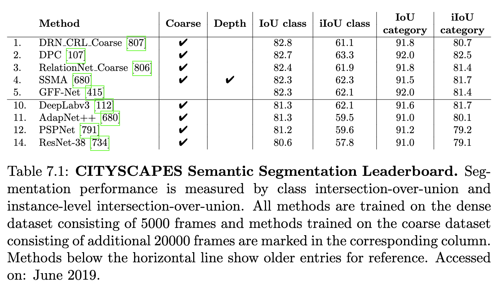

표 7.1은 픽셀 수준 시맨틱 레이블링 작업을 위한 Cityscapes 리더보드를 보여줍니다. 모든 방법은 5,000개의 밀집 주석 프레임으로 구성된 밀집 데이터셋에서 훈련됩니다. 20,000개의 추가 프레임이 있는 거친 데이터셋에서 추가로 훈련된 방법은 표에 표시되어 있습니다. 시맨틱 분할의 최첨단 기술은 IOU 및 iIoU 측면에서 매우 유사한 정확도를 보여줍니다. Li et al. [415]은 [791]의 피라미드 장면 구문 분석 네트워크(PSPNet)를 고급 융합 메커니즘으로 확장합니다. 그들은 모든 픽셀이 다른 특징 맵에서 관련 정보만 융합할 수 있도록 하는 Gated Fully Fusion 모듈을 제안합니다. 이는 PSPNet [791]보다 미세한 세부 사항에서 더 나은 정확도를 허용합니다. 이와 대조적으로 Valada et al. [680]은 이미지와 깊이에서 추출된 특징을 융합하는 다중 모달 융합 접근 방식을 제시합니다. 특징 추출 네트워크는 [681]에서 제안된 다중 스케일 잔차 단위를 가진 완전 사전 활성화 ResNet-50 [285]과 Atrous Spatial Pyramid Pooling (ASPP) [112]의 효율적인 변형을 기반으로 합니다. Zhuang et al. [806]은 다른 접근 방식을 따르며, 미리 정의된 오프셋을 사용하여 특징을 네 방향(좌우, 상하)으로 이동시키면서 게이트 순환 유닛을 통해 통과시켜 특징과 공간 이웃을 상관시키는 관계 모듈을 도입합니다. 특징은 확장 및 변형 가능한 컨볼루션 [150]으로 수정된 ResNet과 유사한 아키텍처 [734]를 사용하여 추출됩니다. Zhuang et al. [807]은 더 큰 이웃에 걸쳐 특징을 상관시키기 위해 추가 오프셋을 활용하여 이 아이디어를 확장합니다. 이를 통해 그들은 Cityscapes에서 다른 모든 방법을 능가합니다(표 7.1).

시맨틱 분할을 위한 기존 네트워크 아키텍처 대부분은 개발자에 의해 설계됩니다. 최근 새로운 연구는 적절하게 정의된 탐색 공간에서 새로운 아키텍처를 탐색할 것을 제안합니다. Chen et al. [107]은 아키텍처 탐색을 통해 세 가지 밀집 예측 문제, 즉 거리 장면 분석, 사람 부분 분할 및 시맨틱 이미지 분할을 다룹니다. 그들은 Xception [123, 150, 113]을 백본 네트워크로 사용하고 세 가지 인기 있는 연산자, 즉 1x1 컨볼루션, 3x3 atrous 컨볼루션 및 평균 공간 피라미드 풀링에서 재귀적 탐색 공간을 구축합니다. 마지막으로 그들은 재귀적 탐색 공간을 탐색하기 위해 무작위 탐색 알고리즘을 적용합니다. 370개의 GPU에서 28K 아키텍처를 평가함으로써 그들은 Cityscapes에서 최첨단 성능을 달성하는 아키텍처를 찾습니다.

## 7.6 논의

다중 스케일 추론에 대한 집중은 Cityscapes에서 픽셀 수준 시맨틱 분할에서 인상적인 결과를 가져왔습니다. 오늘날 Cityscapes의 최고 방법(표 8.1)은 클래스에서 거의 83%, 범주에서 92%라는 인상적인 IoU를 달성합니다. 이와 대조적으로 인스턴스 가중 IoU는 클래스에서 여전히 약 63%, 범주에서 82%에 이릅니다. 이는 시맨틱 분할이 넓은 이미지 영역을 차지하는 인스턴스에는 잘 작동하지만, 시맨틱 레이블에 대한 정보가 적고 컨텍스트 추론이 필요한 작은 영역을 차지하는 인스턴스에는 여전히 도전적임을 나타냅니다. 또한, 작고 잠재적으로 가려진 객체를 분할하는 것은 정확한 깊이 추정에서 이점을 얻을 수 있는 어려운 작업입니다. 최근 깊이 데이터를 활용하는 다중 모달 융합 접근 방식은 실내 [282, 145] 및 실외 [680] 시맨틱 분할에서 뛰어난 성능을 보여주었으며, 후자는 이전 섹션에서 논의된 바와 같이 Cityscapes에서 최첨단 성능을 달성했습니다. 또한, [378]에서와 같이 시간적 상관 관계를 활용하는 것은 시맨틱 분할 정확도와 시간적 일관성을 더욱 향상시킬 가능성을 가집니다.