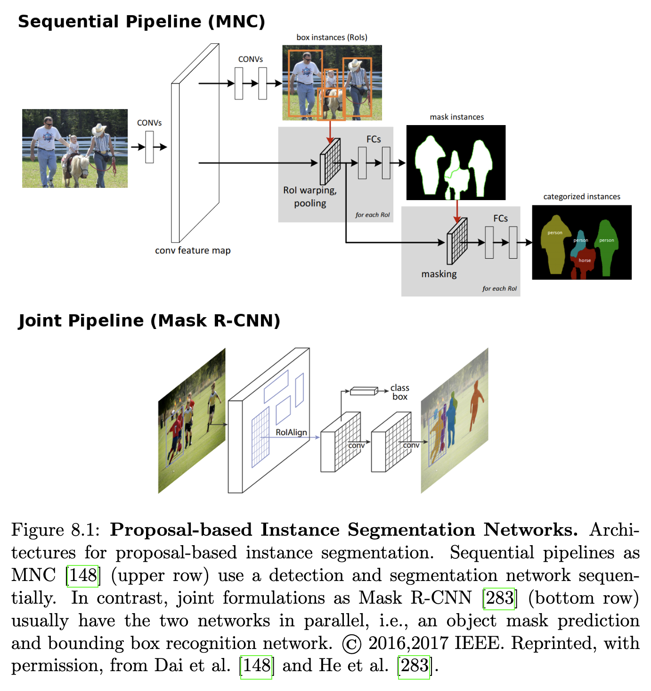
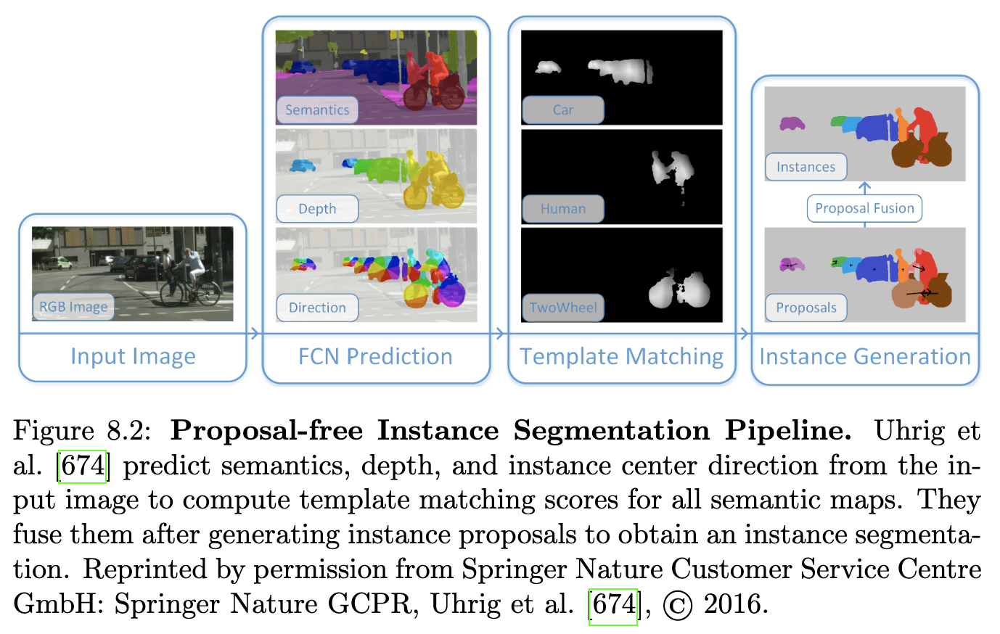
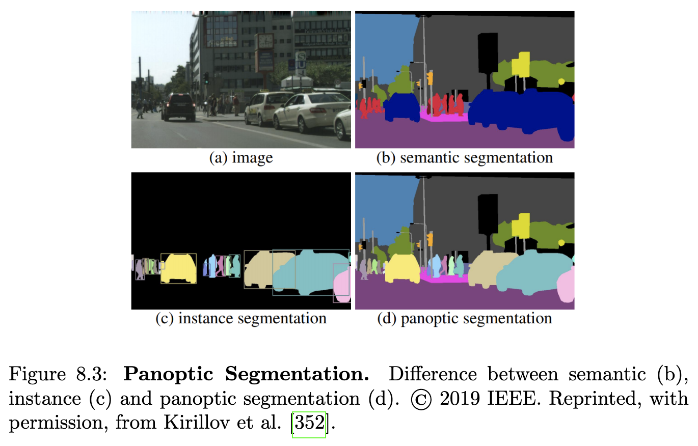
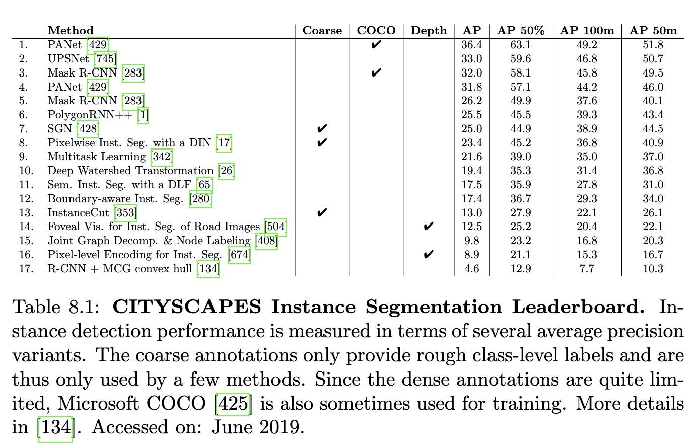

# 8장 시맨틱 인스턴스 분할

## 8.1 문제 정의

시맨틱 인스턴스 분할의 목표는 이미지 내의 모든 개별 객체를 동시에 감지, 분할 및 분류하는 것입니다. 시맨틱 분할과 달리 이 작업에 대한 솔루션은 개별 객체의 위치, 의미, 모양 및 개수에 대한 정보를 제공하므로 자율 주행에 많은 응용 분야를 가집니다.

## 8.2 방법론

시맨틱 인스턴스 분할 작업에는 크게 두 가지 연구 방향이 존재합니다: 제안 기반(Proposal-based) 인스턴스 분할과 제안 불필요(Proposal-free) 인스턴스 분할입니다. 제안 기반 접근 방식은 일반적으로 제안 추출 및 제안 분류의 두 단계로 구성되는 반면, 제안 불필요 방법은 이미지에서 직접 픽셀 레이블을 예측합니다.

### 8.2.1 제안 기반 접근 방식

제안 기반 인스턴스 분할 방법은 픽셀 수준 인스턴스를 얻기 위해 시맨틱 클래스의 인스턴스로 분류되는 클래스 불가지론적 제안을 추출합니다. CMPC(Constrained Parametric Min-Cut) [98], MCG(Multiscale Combinatorial Grouping) [16], DeepMask [524], SharpMask [525]와 같이 일반적인 클래스 불가지론적 영역 제안을 반환하여 인스턴스 세그먼트로 직접 사용할 수 있는 여러 영역 제안 방법이 존재합니다. 객체 감지 정확도를 향상시키기 위해 인스턴스 세그먼트의 영역 특징을 활용하여 객체 감지 및 시맨틱 분할을 동시에 처리하는 여러 객체 감지 분류기가 제안되었습니다. 즉, O2P [97], SDS(Simultaneous Detection, and Segmentation) [275], CFM(Convolutional Feature Masking) [147], HyperColumn [274] 등이 있습니다.

제안 기반 알고리즘은 계산 비용이 많이 드는 제안 생성 단계 때문에 추론 시간이 느립니다. 이러한 병목 현상을 피하기 위해 Dai et al. [148]은 그림 8.1에 나타난 세 단계의 완전 컨볼루션 네트워크인 Multi-task Network Cascade (MNC)를 제안합니다. 그들은 상자 제안을 추출하고, 공유 특징을 사용하여 이를 세그먼트로 개선한 다음, 최종적으로 시맨틱 범주로 분류합니다. 단계 출력 간의 인과 관계는 다중 작업 캐스케이드 훈련을 복잡하게 만듭니다. 이러한 어려움을 극복하기 위해 전체 모델을 엔드투엔드 방식으로 훈련하기 위한 완전히 미분 가능한 마스크 예측 레이어가 제시됩니다. 상자 제안은 잘못 스케일링되거나 이동된 경계 상자로 인해 제안 기반 인스턴스 분할 방법에 오류를 유발할 수도 있습니다. 이 문제를 해결하기 위해 Hayder et al. [280]은 각 경계 상자 제안에 대한 이진 마스크를 예측하는 형상 인식 객체 마스크 네트워크를 제시하며, 잠재적으로 상자 자체를 넘어 확장될 수 있습니다. 그들은 원래 마스크 예측 단계를 대체하여 객체 마스크 네트워크를 Dai et al. [148]의 Multi-task Network Cascade 프레임워크에 통합합니다.

초기 방법들이 두 개의 서브 네트워크로 감지 및 분할 문제를 순차적으로 다루는 반면, 최근 연구 [417, 283, 109]는 이러한 문제를 공동으로 다룰 것을 제안합니다. 그림 8.1에는 순차적 및 공동 공식화의 예시가 나와 있습니다. 모든 공동 공식화는 특징 추출을 위해 ResNet과 유사한 아키텍처 [284]를 사용합니다. Li et al. [417]은 엔드투엔드 인스턴스 시맨틱 분할을 위한 최초의 완전 컨볼루션 신경망인 FCIS를 제안합니다. 그들은 제안의 컨볼루션 표현을 감지 및 분할 서브 네트워크와 공유하여 완전 컨볼루션 마스크 제안 네트워크 [146]를 확장합니다. FCIS와 달리 Mask R-CNN [283]과 MaskLab [109]는 모두 Faster R-CNN [552]을 기반으로 합니다. He et al. [283]은 Faster R-CNN [552]을 분할 마스크 예측을 위한 추가 분기(branch)로 확장합니다. Chen et al. [109]은 Faster R-CNN의 상자 예측을 픽셀별 분류를 위한 시맨틱 분할 로짓과 인스턴스 중심 방향을 추정하는 방향 예측 로짓과 결합합니다. 인스턴스 중심 방향은 결국 동일한 클래스의 인스턴스를 분리할 수 있도록 합니다.

### 8.2.2 제안 불필요 접근 방식

제안 기반 접근 방식이 제안 생성 오류를 상속받는 문제 때문에 최근 여러 대체 방법이 제안되었습니다. 이러한 방법들은 인스턴스 분할을 직접 픽셀 레이블링 작업으로 캐스팅하여 개별 인스턴스의 분할 및 의미론적 범주를 공동으로 추론합니다.

여러 접근 방식 [790, 789, 674]은 깊이 정보가 다른 객체 인스턴스를 식별하는 데 어떻게 사용될 수 있는지 보여줍니다. Zhang et al. [790, 789]은 밀집하게 샘플링된 이미지 패치의 픽셀 수준 인스턴스 분할을 직접 예측하기 위해 완전 컨볼루션 신경망(FCN)을 훈련합니다. 이 때 인스턴스 ID는 깊이 순서를 인코딩합니다. 그들은 후속 마르코프 랜덤 필드를 사용하여 예측을 개선하고 일관성을 강화합니다. Uhrig et al. [674]은 시맨틱 분할뿐만 아니라 깊이 및 각 인스턴스의 중심점에 대한 인스턴스 기반 방향을 공동으로 예측하기 위한 FCN을 제안합니다. 이 상대적인 방향 단서는 픽셀을 개별 인스턴스로 클러스터링하는 데 사용됩니다. 인스턴스 분할 파이프라인은 그림 8.2에 나와 있습니다. 그러나 [790, 789, 674]의 모든 방법은 모델 훈련을 위해 지상 진실 깊이 데이터가 필요합니다.

깊이 정보에 의존하는 대신, 동시 연구 [353, 26, 17]는 초기 의미론적 분할을 기반으로 한 제안 불필요 접근 방식을 제시합니다. Kirillov et al. [353]은 의미론적 인스턴스 분할을 추론하기 위해 다중 분할 공식에서 전역 추론을 통해 의미론적 분할과 객체 경계 감지를 결합합니다. Bai와 Urtasun [26]은 고전적인 워터셰드 변환의 아이디어를 딥러닝과 결합하여 초기 의미론적 분할과 입력 이미지에서 에너지 맵을 생성하며, 여기서 분지는 객체 인스턴스에 해당합니다. 이를 통해 픽셀 수준 인스턴스 분할을 얻기 위해 단일 에너지 수준에서 자를 수 있습니다. Arnab와 Torr [17]는 인스턴스 서브네트워크를 사용하여 초기 의미론적 분할을 개선할 것을 제안합니다. 초기 범주 수준 분할은 픽셀 수준 인스턴스를 예측하기 위해 펼쳐진 조건부 랜덤 필드 [792] 내에서 객체 감지기의 출력에서 얻은 단서와 함께 사용됩니다.

Liu et al. [428]은 새로운 연구 분야를 제시합니다. 그들은 의미론적 복잡성이 증가하는 순차적 전략을 따릅니다. 여러 신경망이 순차적으로 적용되며, 각각 수직 및 수평 분할점 찾기, 이들을 수직 및 수평선에 연결하기, 이 선들 사이의 픽셀 그룹화, 마지막으로 그룹화된 픽셀에서 인스턴스 추출과 같은 다른 전략으로 픽셀을 그룹화합니다.

### 8.2.3 파놉틱 분할

인스턴스 분할은 객체 인스턴스에 초점을 맞추고 그림 8.3과 같이 하늘이나 도로와 같이 이 작업에 적합하지 않은 클래스는 일반적으로 무시합니다. 이와 대조적으로 Kirillov et al. [352]이 처음 도입한 파놉틱 분할은 의미론적 레이블과 인스턴스 ID의 밀집 추정을 다룹니다. 이 문제를 해결하기 위해 여러 접근 방식 [352, 414, 138, 745, 351]이 제안되었습니다.

[17, 26, 353]과 같은 제안 불필요 인스턴스 분할 접근 방식은 파놉틱 분할을 학습하는 데 직접 사용될 수 있습니다. 그러나 이 문제에 대해 이들을 훈련하기 위한 지상 진실 데이터는 매우 제한적입니다. 따라서 Li et al. [414]은 [17]을 반지도 방식으로 사용하여 파놉틱 분할을 학습합니다. 그들은 대화형 전경 추출(GrapCut) [571], 제안 분할 [536] 및 기울기 기반 클래스 위치 파악 [609]을 사용하여 네트워크를 반지도 방식으로 훈련합니다.

이와 대조적으로, 여러 접근 방식 [138, 745, 351]은 Mask R-CNN [283]을 기반으로 한 공동 의미론적 및 인스턴스 분할 공식으로 파놉틱 분할을 다룹니다. Costea et al. [138]은 객체 감지, 의미론적 및 인스턴스 분할을 융합할 것을 제안합니다. 그들은 의미론적 분할을 사용하여 전경 및 배경 영역을 구별합니다. 배경 영역의 의미론적 클래스는 의미론적 분할에서 직접 얻어지는 반면, 전경 영역의 클래스를 결정하기 위해 객체 감지, 인스턴스 및 의미론적 분할을 사용합니다. 이와 대조적으로 동시 연구 [745, 351]는 Mask R-CNN을 추가 의미론적 분할 분기로 확장하여 휴리스틱 융합 요구 사항을 제거합니다. Xiong et al. [745]은 변형 가능한 컨볼루션을 기반으로 한 의미론적 분할 네트워크를 Mask R-CNN과 결합합니다. 그들은 의미론적 및 인스턴스 분할 네트워크의 연결된 채널에 소프트맥스를 적용하여 밀집 클래스 레이블을 예측합니다. 이와 대조적으로 Kirillov et al. [351]은 채널을 연결하지 않고 의미론적 및 인스턴스 분할 네트워크를 동시에 훈련합니다. 그들은 겹치는 인스턴스를 피하기 위해 비최대 억제 [352]를 적용합니다.

## 8.3 데이터셋

인스턴스 분할을 위한 데이터셋은 몇 개 밖에 존재하지 않습니다. 328K 밀집 주석으로 구성된 Microsoft COCO [425]와 5K 밀집 주석 및 25K 희소 주석으로 구성된 Cityscapes [134]가 가장 인기 있는 데이터셋입니다. KITTI [243] 데이터셋도 인스턴스 수준 시맨틱 주석을 제공하지만, 이 데이터셋은 200개의 훈련 및 테스트 장면으로만 구성됩니다. 원래 PASCAL VOC [197]는 인스턴스 인식 주석을 제공하지 않지만, Hariharan et al. [276]은 인스턴스 인식 의미론적 윤곽으로 데이터셋을 확장했습니다. 그러나 PASCAL VOC의 확장은 거의 사용되지 않습니다. 새로운 데이터셋 Mapillary [495], ApolloScape [312], Berkeley DeepDrive [767]도 각각 25K, 90K, 10K 이미지에 대한 인스턴스 수준 주석을 제공하지만, 여전히 커뮤니티에서 지배적이지는 않습니다.

시맨틱 분할과 유사하게, 자율 주행 컨텍스트, 온라인 리더보드 및 커뮤니티에서의 수용도 때문에 Cordts et al. [134]의 Cityscapes 데이터셋1에서 다양한 방법을 비교합니다.

## 8.4 측정 지표

인스턴스 분할 방법의 성능은 일반적으로 지상 진실 영역과 특정 중첩을 달성하는 인스턴스 영역에 대한 평균 정밀도(AP)를 측정하여 평가됩니다. 일반적으로 중첩에 대해 다른 임계값이 고려되며, 이러한 임계값과 모든 클래스에 대한 평균에 따라 비교가 수행됩니다. Cityscapes [134]는 50%와 95% 사이의 10가지 임계값을 고려하는 Microsoft COCO [425]에서 보고된 동일한 측정 지표를 사용합니다. 또한, 50%의 중첩 값에 대한 AP(AP 50%)와 100m 및 50m 이내의 객체에 대한 AP(AP 100m, AP 50m)가 별도로 고려됩니다.

## 8.5 Cityscapes의 최첨단 기술

표 8.1에서 Cityscapes 데이터셋에 대한 시맨틱 인스턴스 분할 방법의 리더보드를 보여줍니다. 인스턴스 분할의 최첨단은 제안 기반 접근 방식 [1, 283, 745, 429]에 의해 지배됩니다. 그러나 제안 불필요 접근 방식 [26, 17, 428]이 그 뒤를 바짝 따르고 있으며, Liu et al. [428]의 순차적 접근 방식이 최고의 성능을 보이는 제안 불필요 접근 방식입니다. 제안 기반 접근 방식 [1, 283, 745]은 Faster R-CNN [552]을 기반으로 하는 반면, Liu et al. [429]는 모든 수준(예: 하위 레이어의 정확한 위치 신호)에서 특징을 제안 서브 네트워크로 전파하기 위한 새로운 특징 계층 구조를 제안합니다. Cityscapes의 밀집 주석이 다소 제한적이기 때문에 Microsoft COCO 데이터셋 [425]에 대한 추가 훈련을 통해 다른 모든 방법을 능가합니다. Xiong et al. [745]이 제시한 파놉틱 분할 접근 방식은 훈련이 Cityscapes의 밀집 주석으로 제한될 때 최고의 성능을 보이는 방법입니다.

## 8.6 논의

인스턴스 분할 작업은 시맨틱 분할 작업보다 훨씬 어렵습니다. 각 인스턴스는 별도로 신중하게 레이블링되어야 하는 반면, 시맨틱 분할에서는 동일한 의미론적 클래스의 그룹이 서로 인접할 때 함께 레이블링될 수 있습니다. 또한, 인스턴스의 수와 크기는 이미지마다 크게 다릅니다. 자율 주행 환경에서는 종종 넓은 시야가 존재합니다. 따라서 많은 수의 인스턴스가 이미지에서 상당히 작게 나타나 감지하기 어렵습니다. 5.6절에서 논의된 경계 상자 감지와 달리 이 작업에서는 각 객체 인스턴스의 정확한 형상을 추론해야 합니다. 따라서 최첨단 기술은 Cityscapes 데이터셋(표 8.1)에서 여전히 어려움을 겪고 있으며, 평균 정밀도가 36% 이하에 머물고 있습니다. 병렬 서브 네트워크를 사용하여 감지 및 분할을 공동으로 처리하는 제안 기반 접근 방식이 현재 가장 유망한 방향입니다. 공동 공식화는 작은 인스턴스 제안 생성을 개선할 수 있도록 하며, 이는 자율 주행 환경에서 인스턴스를 분할하는 데 중요합니다.