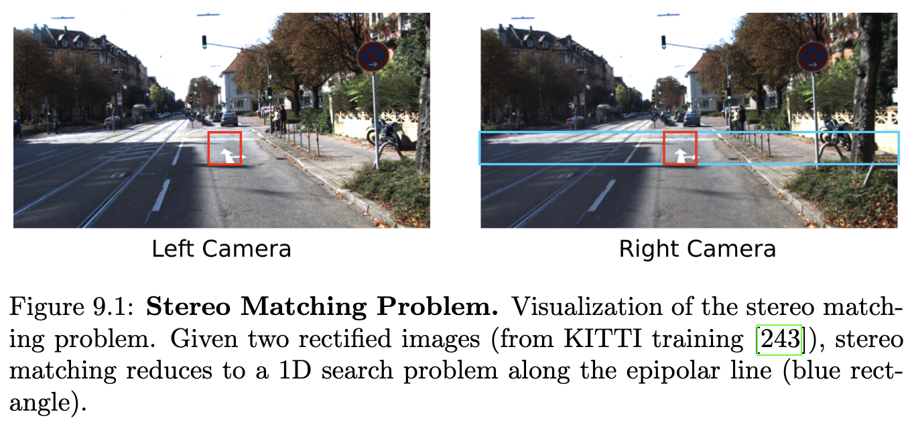
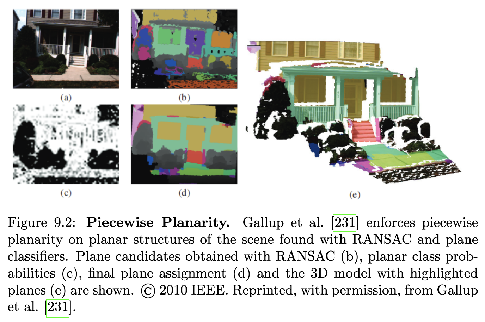
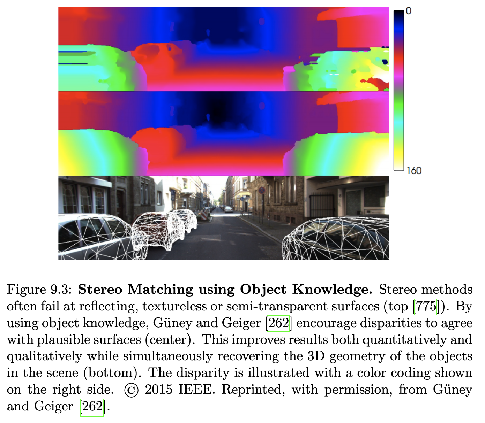
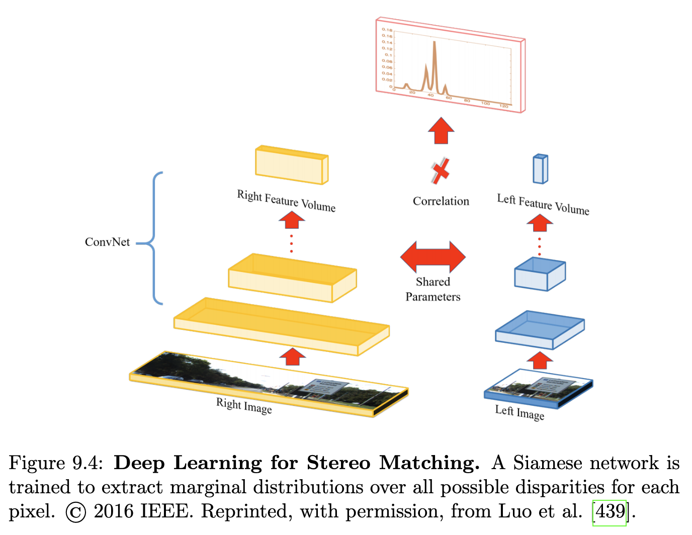
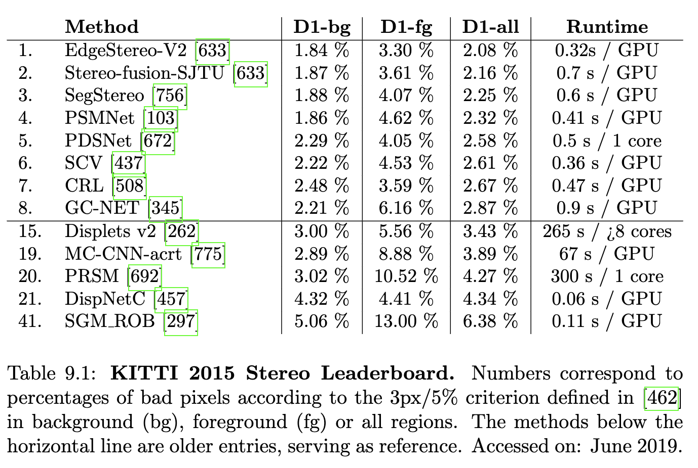
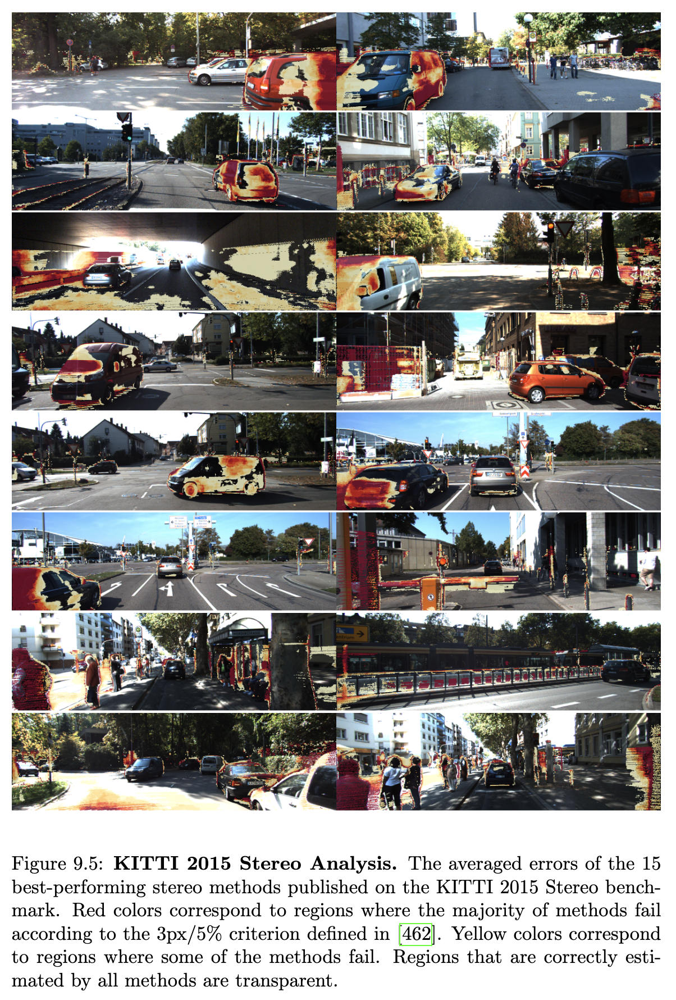

## 9.1 문제 정의

스테레오 추정은 전용 능동 발광 거리 측정 장치 없이 스테레오 카메라로 캡처된 수동 2D 이미지에서 3D 정보를 추출하는 과정입니다. 특히, 스테레오 알고리즘은 일반적으로 고정된 리그에 나란히 장착된 두 대의 카메라로 동시에 촬영된 두 이미지 간의 대응 관계를 찾아 깊이 정보를 추정합니다. 이러한 대응 관계는 3D 세계에서 동일한 물리적 표면의 투영입니다. 깊이 정보는 자율 주행 또는 운전자 보조 시스템 애플리케이션에 매우 중요합니다. 밀집 깊이 맵의 정확한 추정은 3D 재구성을 위한 필수 단계이며, 장애물 감지, 자유 공간 분석 및 추적과 같은 많은 다른 문제들이 정확한 깊이 추정의 가용성으로부터 이점을 얻습니다.

## 9.2 방법론

스테레오 매칭에서 두 카메라의 이미지는 일반적으로 정류 과정에서 공통의 평면에 투영됩니다. 이로 인해 매칭 문제는 그림 9.1에 나타난 것처럼 에피폴라 라인을 따라 1D 검색으로 축소되며, 이 라인상의 거리는 일반적으로 불일치(disparity)라고 합니다.

스테레오 문헌은 두 그룹으로 나눌 수 있습니다. 특징 기반 방법 [652, 594]은 희소 깊이 맵만을 제공하는 반면, 밀집 방법은 계산 시간은 더 걸리지만 밀집된 출력을 생성합니다. 본 조사에서는 밀집 방법에 중점을 둡니다. 이 방법들이 더 인기가 많고, 딥 러닝의 도입으로 훨씬 더 효율적이 되었기 때문입니다. 우리는 또한 지역(local) 방법과 전역(global) 방법을 구분합니다. 지역 방법은 단순히 가장 낮은 매칭 비용을 선택하여 불일치를 계산하는데, 이를 승자 독식(WTA) 솔루션이라고 합니다 [296, 652]. 그러나 이 방법은 모호성으로 인해 매우 노이즈가 많은 추정치를 생성하는 경향이 있습니다. 이와 대조적으로 전역 방법은 이웃 픽셀 또는 영역 간의 평활화 가정을 통합하여 불일치 계산을 에너지 최소화 문제로 공식화합니다 [297, 245, 231, 269, 71, 379, 545]. 최적화는 연속 도메인에서 변분 접근 방식을 사용하거나 이산 레이블 공간의 경우 그래프 컷 또는 믿음 전파와 같은 이산 접근 방식을 사용하여 수행할 수 있습니다.

### 9.2.1 매칭 비용

스테레오 매칭은 비용 함수를 기반으로 좌우 이미지 간의 매칭 포인트를 식별하는 것을 목표로 하는 대응 추정 문제입니다. 알고리즘은 일반적으로 정류된 이미지를 가정하며, 검색 공간은 수평선으로 축소됩니다(그림 9.1). 매칭 비용 계산은 모든 가능한 불일치에 대해 각 픽셀에서 비용 함수를 계산하는 과정이며, 이 비용 함수는 실제 불일치에서 최소화됩니다. 그러나 실제로 이러한 비용 함수를 설계하는 것은 어렵습니다. 따라서 스테레오 알고리즘은 일반적으로 매칭 포인트 간의 일정한 외관을 가정합니다. 이 가정은 노출 변화, 비네팅, 이미지 노이즈, 비램버시안 표면, 조명 변화 등을 유발하는 약간 다른 설정을 가진 카메라와 같은 실제 상황에서는 종종 위반됩니다. Hirschmüller와 Scharstein [296]은 이러한 방사 측정 변화가 일반적으로 사용되는 매칭 비용 함수, 즉 절대 차이, 필터 기반 비용(가우시안 라플라시안, 랭크 및 평균), 계층적 상호 정보(HMI) 및 정규화된 교차 상관에 미치는 영향을 체계적으로 조사합니다. 그들은 비용 함수의 성능이 이를 사용하는 스테레오 방법에 따라 달라진다는 것을 발견했습니다. 시뮬레이션 및 실제 방사 측정 차이가 있는 이미지에서 랭크 필터는 상관 기반 방법에서 가장 좋은 성능을 보였습니다. 전역 방법의 경우, 전역 방사 측정 변화 또는 노이즈 테스트에서 HMI가 가장 좋은 성능을 보인 반면, 지역 방사 측정 변화가 있는 경우에는 랭크 및 가우시안 라플라시안 필터가 HMI보다 더 나은 성능을 보였습니다. 정성적 결과는 필터 기반 비용이 전역 방법과 함께 사용될 때 객체 경계를 흐리게 한다는 것을 보여줍니다. 고려 중인 매칭 비용 중 어느 것도 강한 조명 변화를 처리하는 데 성공하지 못했습니다.

### 9.2.2 에너지 최적화

외관 기반 매칭 비용의 내재된 모호성은 정규화, 즉 예상 불일치 맵에 대한 사전 지식을 스테레오 추정 프로세스에 도입함으로써 극복할 수 있습니다. 따라서 매칭 비용에 대한 WTA와 달리 매칭 비용과 평활화 제약으로 구성된 에너지가 일반적으로 최적화됩니다. 가장 간단한 사전 지식은 이웃 픽셀이 동일한 불일치 값을 갖는 것을 선호합니다(지역 평활화).

이산 최적화: 이산 최적화 방법은 이산적인 불일치 집합에 대해 에너지를 최적화합니다. 결과적인 최소화 문제는 NP-hard이지만, 믿음 전파 [205]와 그래프 컷 [64]을 사용하여 좋은 근사치를 얻을 수 있습니다.

Hirschmüller [297]가 제안한 Semi-Global Matching (SGM)은 스테레오 매칭을 위한 가장 두드러진 이산 최적화 방법입니다. 그들은 상호 정보를 고려하여 매칭 비용을 계층적으로 계산합니다. 전역 평활 에너지는 동적 프로그래밍을 사용하여 여러 방향에서 각 픽셀로의 1D 경로를 따라 비용을 합산하여 비용 집계를 통해 근사화됩니다. SGM은 Middlebury [592] 및 KITTI [243]와 같은 다양한 벤치마크에서 입증된 속도와 높은 정확도로 인해 자율 주행을 위한 영향력 있는 스테레오 매칭 기술이 되었습니다.

SGM의 실용적이고 이론적인 측면을 조사하는 몇 가지 후속 연구가 있습니다. Gehrig et al. [238]은 재구성 가능한 하드웨어 플랫폼에서 자동차 애플리케이션을 위한 알고리즘 확장과 함께 SGM의 실시간, 저전력 구현을 제안합니다. Drory et al. [180]은 SGM과 믿음 전파 및 트리-재가중 메시지 전달 [360]과의 관계를 명확히 하여 SGM 성공에 대한 원리적인 설명을 제공합니다. 그들은 SGM이 특정 믿음 전파 변형에 대한 조기 종료와 동등하며, 솔루션을 효과적으로 근사화한다는 것을 보여줍니다.

SGM의 성능은 신뢰도 측정값을 통합함으로써 더욱 향상될 수 있습니다. Seki와 Pollefeys [608]는 CNN을 활용하여 스테레오 추정에 대한 신뢰도를 예측합니다. 기존 방법의 아이디어를 고려하여 그들은 CNN의 입력으로 사용되는 두 채널 불일치 패치를 설계합니다. 첫 번째 채널은 지역 평활화를 사용하고 두 번째 채널은 좌우 일관성을 강화합니다(다른 이미지를 사용한 불일치 추정은 해당하는 결과를 생성해야 합니다). 신뢰도는 추정된 신뢰도에 따라 각 픽셀에 가중치를 부여하여 SGM에 통합됩니다.

연속 최적화: 변분 접근 방식은 연속 불일치에 대해 에너지 함수를 최적화합니다. 이미지 강도를 사용하는 데이터 비용은 일반적으로 비볼록이므로 전역 최적값은 근사화만 가능합니다. coarse-to-fine 접근 방식은 매칭 문제의 저해상도에서 고해상도 솔루션으로 이동하여 큰 불일치를 처리하는 데 사용됩니다. 각 해상도에 대해 이전 저해상도 솔루션이 초기화로 사용됩니다. coarse-to-fine 접근 방식은 일반적으로 광학 흐름 추정에 사용되며 11장에서 자세히 논의됩니다.

일반적으로 사용되는 평활화 사전은 인접한 불일치 간의 절대 차이를 페널티화하는 전체 변동(TV) [573]입니다. 약하고 모호한 관찰이 있는 경우 TV는 조각별 일정한 불일치를 유도하여 계단 현상(stair-casing artifacts)을 유발하므로 설득력 있는 결과를 생성하지 않습니다.

### 9.2.3 고차 모델

쌍별 평활화 사전은 잘 질감이 없는 기울어진 표면을 재구성하는 데 실패합니다. 이는 전면 평행 평면을 선호하기 때문입니다. 임의의 평활화 사전를 처리하는 더 일반적인 접근 방식은 픽셀 간의 고차 상관 관계를 활용하는 것입니다. 고차 사전은 깊이 이미지에 대한 더 현실적인 가정을 표현할 수 있지만, 일반적으로 추가적인 계산 비용이 발생합니다.

Woodford et al. [726]은 그래프 컷 스테레오 공식에 2차 사전 지식을 도입합니다. 이산 최적화에서 고차 사전 지식을 통합하는 것은 오랫동안 계산적으로 불가능하다고 여겨졌지만, 그들은 트리플 클리크를 이용한 추론을 위한 효율적인 최적화 전략을 제안합니다. 또한, 그들은 2차 사전 지식과 결합된 비대칭 가려짐 모델을 제시합니다.

연속 TV 공식의 경우, Haene et al. [269]은 작고 조각별 평면적인 사전의 형태로 패치 기반 사전 지식을 도입합니다. Total Generalized Variation (TGV) [71]는 조각별 아핀 솔루션을 페널티화하지 않기 때문에 TV보다 더 나은 사전 지식으로 주장됩니다. 그러나 비볼록 데이터 항이 있는 경우에도 전역 솔루션을 계산할 수 있는 TV와 달리 TGV는 볼록 데이터 항으로 제한됩니다. Coarse-to-fine 접근 방식은 종종 세부 정보 손실로 끝납니다. 미세한 세부 정보를 보존하기 위해 Kuschk와 Cremers [379]는 가장자리 감지를 사용하여 TGV 프레임워크에 적응형 정규화 가중치를 통합하고 coarse-to-fine 접근 방식에 비해 향상된 결과를 보고합니다. Ranftl et al. [545]은 비볼록 함수를 두 개의 하위 문제로 분해하여 훨씬 더 나은 결과를 얻습니다.

### 9.2.4 조각별 평면 사전

문헌에서 기울어진 표면을 다루는 일반적인 방법 중 하나는 조각별 평면성(piecewise planarity)을 가정하는 것입니다. Geiger et al. [245]는 지지점(support points)이라고 불리는 견고하게 매칭된 대응점 집합에 대한 삼각 분할을 형성함으로써 불일치 공간에 대한 사전 지식을 구축합니다. 이는 매칭 모호성을 줄이고 그럴듯한 영역으로 검색을 제한함으로써 효율적인 알고리즘을 생성합니다. 그림 9.2에 나타난 Gallup et al. [231]은 먼저 이미지를 조각별 평면 및 비평면 영역으로 분할하는 분류기를 훈련합니다. 그 후, RANSAC에서 얻은 평면 가설을 사용하여 평면 영역에만 조각별 평면성 사전 지식을 적용합니다. 비평면 영역은 표준 다중 뷰 스테레오 알고리즘의 출력으로 모델링됩니다.

### 9.2.5 분할 기반 모델

조각별 평면성을 모델링하는 또 다른 방법은 이미지를 슈퍼픽셀(픽셀 그룹)로 명시적으로 분할하고 각 슈퍼픽셀의 표면을 기울어진 평면으로 모델링하는 것입니다 [749, 262]. 그러나 평면성에 대해 슈퍼픽셀화가 실제로 이미지의 과분할을 보장하도록 주의해야 합니다. 즉, 어떤 슈퍼픽셀도 동일 평면에 있지 않은 두 표면을 포함하지 않아야 합니다. Yamaguchi et al. [749]은 연속 및 이산 랜덤 변수로 구성된 하이브리드 MRF에서 가려짐 경계와 깊이를 공동으로 추론합니다. Güney와 Geiger [262]는 더 큰 거리에 걸쳐 정규화되는 객체 범주별 3D 형상 제안을 통합하기 위해 유사한 프레임워크를 사용합니다. 시맨틱 분할 및 3D CAD 모델을 활용하여 그림 9.3에 나타난 바와 같이 장면의 자동차의 반사율이 높은 표면에서 발생하는 반사 및 질감 없는 영역의 모호성을 해결합니다.

### 9.2.6 스테레오 매칭을 위한 딥 러닝

최근 몇 년 동안 딥러닝 접근 방식은 스테레오 추정에서 인기를 얻었습니다. 일부 방법은 더 풍부한 특징 표현을 학습하려고 시도하는 반면 [775, 439], 다른 방법은 입력 스테레오 이미지 쌍에서 직접 불일치 맵을 예측하는 것을 학습합니다 [457, 345, 103].

더 풍부한 특징 표현을 위해 ˇZbontar와 LeCun [775] 및 Luo et al. [439]은 공유 가중치와 최종 점수 계산 레이어를 가진 두 개의 서브 네트워크로 구성된 Siamese 네트워크를 사용합니다. 아이디어는 작은 이미지 패치에 대한 유사성 측정치를 학습하여 매칭 비용을 계산하기 위한 네트워크를 훈련하는 것입니다. ˇZbontar와 LeCun [775]은 매칭 및 비매칭 패치를 양성/음성 예제로 정의하고 마진 손실을 사용하여 끝에 간단한 점 곱 레이어를 가진 빠른 아키텍처 또는 일련의 완전 연결 레이어로 점수 계산을 학습하는 느리지만 더 정확한 아키텍처를 훈련합니다. Luo et al. [439]은 유사한 아키텍처를 사용하지만, 그림 9.4에서 시각화된 바와 같이 다른 불일치 간의 상관 관계를 암시적으로 포착하기 위해 모든 가능한 불일치에 대한 다중 클래스 분류로 문제를 공식화합니다. 두 접근 방식 모두 SGM [297]을 후처리 단계로 사용하여 이웃 픽셀에 정보를 전파하고 최종 밀집 불일치 맵을 추정합니다.

이와 대조적으로 Mayer et al. [457]은 Dosovitskiy et al. [177]이 광학 흐름 추정(11장)을 위해 제안한 인코더-디코더 아키텍처를 채택하여 추가 후처리 없이 전체 불일치 맵을 한 번에 예측하는 모델을 직접 학습합니다. 인코더는 추상적인 특징을 계산하고, 디코더는 상세 정보를 보존하기 위해 축소 및 확장 네트워크 부분 간의 추가 교차 연결을 통해 원래 해상도를 재구축합니다. 인코더-디코더 아키텍처는 전체 매핑을 엔드투엔드 방식으로 암시적으로 학습하기 때문에 후처리 및 정규화가 필요하지 않습니다. 그러나 이 아키텍처는 처음부터 매칭 개념을 학습해야 합니다. 따라서 [177]에서 영감을 받아 각 이미지를 독립적으로 처리하고 마지막으로 두 이미지에서 추출된 특징을 상관시키는 대체 네트워크(DispNetC)도 제안합니다. Kendall et al. [345]은 이전 방법의 아이디어, 즉 Siamese 특징 추출 및 비용 볼륨 형성을 결합합니다. 더 구체적으로, 그들은 Siamese 네트워크를 사용하여 깊은 특징 표현을 추출하고 이 특징들을 상관시켜 비용 볼륨을 생성할 것을 제안합니다. 비용 볼륨 후에 그들은 인코더-디코더 아키텍처를 사용하여 수용 영역을 확대하고 각 인코더 수준에 3D 컨볼루션을 적용합니다. 미분 가능한 소프트 아르그민 연산을 통해 네트워크를 엔드투엔드 방식으로 훈련할 수 있습니다. Chang과 Chen [103]은 더 많은 컨텍스트 정보를 활용하기 위해 공간 피라미드 풀링 및 3D CNN 모듈을 도입합니다. 공간 피라미드 풀링은 더 넓은 영역을 고려하여 더 풍부한 특징을 추출할 수 있도록 합니다. 여러 스택형 인코더-디코더 네트워크를 가진 3D CNN 모듈은 전역 컨텍스트 정보를 활용하고 최첨단 성능을 달성할 수 있도록 합니다.

최근 딥 러닝 기반 스테레오 추정에서 시맨틱 정보를 활용할 수 있음이 입증되었습니다. Yang et al. [756]은 하나의 프레임워크에서 시맨틱 분할과 스테레오 추정을 공동으로 공식화합니다. 이를 통해 시맨틱 단서를 학습하고 시맨틱 단서로 불일치를 정규화하는 시맨틱 소프트맥스 손실을 도입하여 불일치 추정에 통합할 수 있습니다. 그들은 비지도 및 지도 설정에서 공동 공식화의 이점을 보여줍니다.

### 9.2.7 가변 기준선

스테레오 추정치는 융합되어 3차원 장면의 정적 부분에 대한 더 완전한 재구성을 제공할 수 있습니다. 그러나 고정된 기준선, 초점 거리 및 시야를 가정하는 것이 항상 최선의 전략은 아닐 수 있습니다. Gallup et al. [229]은 전통적인 스테레오 방법의 두 가지 문제점을 지적합니다: 원거리에서의 정확도 저하와 근거리에서의 불필요한 계산 시간 소모. 따라서 그들은 다중 카메라 리그를 사용하고 정확한 추정을 위해 적절한 기준선을 가진 최적의 카메라를 동적으로 선택할 것을 제안합니다. 또한, 근거리에서의 계산 속도를 높이기 위해 해상도를 줄입니다. 전통적인 고정 기준선 스테레오와 달리 제안된 가변 기준선 스테레오 알고리즘은 재구성된 볼륨 전체에 계산을 고르게 분산하여 재구성된 볼륨 전체에서 일정한 정확도를 달성합니다.

### 9.2.8 전방향 카메라

3.1.1에서 논의된 전방향 센서는 스테레오 매칭을 위한 시야를 크게 확장할 수 있도록 합니다. 그러나 전방향 센서를 사용한 스테레오 추정에 대한 연구는 제한적입니다. H¨ane et al. [271]은 어안 카메라용 통합 투영 모델 [248]을 평면 스위핑 스테레오 매칭 알고리즘 [230]에 직접 통합하여 어안 카메라용 평면 스위핑 스테레오 매칭을 확장합니다. 이러한 종류의 접근 방식은 GPU를 사용하여 실시간으로 어안 이미지에서 직접 밀집 깊이 맵을 생성할 수 있도록 합니다. Sch¨onbein과 Geiger [597]는 카타디옵트릭 전방향 카메라에 대한 스테레오 매칭 문제를 고려합니다.

## 9.3 데이터셋

스테레오 추정을 위한 가장 인기 있는 데이터셋은 Middlebury [592, 593, 591] 및 KITTI [243] 데이터셋입니다. ETH3D [602]는 두 가지 뷰 벤치마크도 제공하지만 비교적 새롭고 자율 주행 시나리오에 초점을 맞추지 않습니다. KITTI 데이터셋만이 자율 주행 컨텍스트를 고려하므로 우리는 KITTI 벤치마크에 초점을 맞춥니다.

딥 모델 훈련을 위해서는 더 큰 데이터셋이 필요합니다. 이 경우 커뮤니티는 SYNTHIA [569], Virtual KITTI [225], Flying Things [457], Sintel [92]과 같은 합성 데이터셋에 의존합니다. 그러나 합성 데이터셋에서 훈련된 모델은 일반적으로 실제 데이터셋에 일반화되지 않으므로 실제 데이터셋에서 추가 미세 조정이 필요합니다.

## 9.4 측정 지표

스테레오 접근 방식의 성능을 측정하기 위해 여러 측정 지표가 제안되었습니다. 가장 인기 있는 측정 지표는 제곱 평균 제곱근 오차(RMS)와 이상치 비율, 즉 임계값보다 큰 오류를 가진 픽셀의 백분율입니다. 일반적으로 평균 RMS가 보고되며, 이상치 비율은 종종 여러 임계값을 사용하여 평가됩니다. Middlebury는 0.5, 1, 2, 4 픽셀 임계값에 대한 결과를 보고합니다. 이와 대조적으로 KITTI 벤치마크는 3픽셀 또는 5%보다 큰 오류를 가진 픽셀의 백분율을 보고합니다. 또한, 배경 및 전경 영역에 대한 불량 픽셀의 백분율을 별도로 평가합니다.

## 9.5 KITTI의 최첨단 기술

표 9.1에서 우리는 KITTI 스테레오 2015 벤치마크에서 스테레오 방법의 순위를 보여줍니다. Tulyakov et al. [672]은 [177, 345, 103]과 유사하게 특징 추출, 상관 관계 및 정규화 학습을 엔드투엔드 훈련 가능한 모델로 결합합니다. 그들은 일반적인 인코더-디코더 네트워크와 달리 병목 아키텍처로 깊은 특징을 추출하고, 최대 사후 확률을 가진 불일치 주변의 가중 평균을 기반으로 추론을 위한 새로운 서브픽셀 최대 사후(MAP) 근사를 제안합니다. 병목 아키텍처는 메모리 사용량을 줄일 수 있도록 하는 반면, 서브픽셀 MAP 근사는 훈련에 사용된 것과 다른 불일치 범위를 처리할 수 있도록 합니다. 그들은 KITTI에서 경쟁력 있는 결과를 달성합니다. 그러나 섹션 9.2.6에서 논의된 Chang과 Chen [103]이 제안한 공간 피라미드 풀링 및 3D CNN은 계산적으로 더 효율적이며 배경 영역에서 크게 개선됩니다. Yang et al. [756]은 섹션 9.2.3에서 논의된 바와 같이 더 많은 컨텍스트 정보를 통합하기 위해 시맨틱 분할 문제를 공동으로 다룹니다. 배경 영역에서 유사한 성능을 달성하지만, 공동 공식화는 전경 영역에서도 개선할 수 있도록 합니다. 전경 및 배경 영역에서 최고의 성능은 Song et al. [633]에 의해 달성됩니다. [756]과 유사하게 그들은 공동 공식을 사용하지만, 시맨틱 분할 대신 가장자리 인식 평활 손실을 사용하여 이미지 가장자리를 공동으로 학습합니다. 다중 스케일 특징을 추출하기 위한 컨텍스트 피라미드와 완전 크기 불일치 맵을 반환하는 단일 단계 잔차 피라미드와 결합하여 표 9.1에 나타난 바와 같이 다른 모든 방법을 능가합니다. 그러나 Mayer et al. [457]이 제시한 DispNetC는 전경에서 경쟁력 있는 결과를 달성하면서도 가장 빠른 접근 방식 중 하나로 남아 있습니다.

## 9.6 논의

스테레오 추정은 지난 몇 년간 정확도와 효율성 모두에서 큰 발전을 보였습니다. 그러나 몇 가지 내재된 문제로 인해 해결된 것으로 간주하기 어렵습니다. 스테레오 매칭은 일정한 외관을 가정하고 두 이미지에서 대응 관계를 찾는 것과 동일합니다. 그러나 외관은 비강성 또는 조명 변화로 인해 자주 변합니다. 또한, 포화된 픽셀, 가려진 영역 또는 프레임을 벗어나는 픽셀은 매칭될 수 없습니다. 따라서 기하학에 대한 다른 사전 가정 없이 외관 매칭에만 의존하는 방법의 경우 이러한 경우에 실패하는 것은 불가피합니다. 그림 9.5에서 KITTI 스테레오 벤치마크 [243]에서 상위 15개 방법의 누적 오류를 보여줍니다. 자율 주행 환경에서 가장 흔한 실패 사례는 번쩍거리고 반사되는 특성으로 인해 외관 변화를 일으키는 자동차 표면입니다. 이 문제는 공동 공식화 [756, 633]를 사용하여 더 많은 컨텍스트 정보를 활용함으로써 해결될 수 있습니다. 마찬가지로 반사되고 투명한 창문은 신뢰할 수 있게 매칭될 수 없습니다. 가려짐은 또 다른 오류 원인이며 매칭을 넘어선 기하학적 추론이 필요합니다. 문제 영역의 다른 예시로는 교통 표지판과 같은 얇은 구조물 또는 울타리로 인한 반복이 있습니다. 이러한 경우, 연속 불일치 추정 및 더 많은 컨텍스트 정보의 통합이 유망한 미래 방향이 될 수 있습니다.

