###### Abstract

Generative models offer a scalable and flexible paradigm for simulating complex environments, yet current approaches fall short in addressing the domain-specific requirements of autonomous driving—such as multi-agent interactions, fine-grained control, and multi-camera consistency. We introduce GAIA-2, Generative AI for Autonomy, a latent diffusion world model that unifies these capabilities within a single generative framework. GAIA-2 supports controllable video generation conditioned on a rich set of structured inputs: ego-vehicle dynamics, agent configurations, environmental factors, and road semantics. It generates high-resolution, spatiotemporally consistent multi-camera videos across geographically diverse driving environments (UK, US, Germany). The model integrates both structured conditioning and external latent embeddings (e.g., from a proprietary driving model) to facilitate flexible and semantically grounded scene synthesis. Through this integration, GAIA-2 enables scalable simulation of both common and rare driving scenarios, advancing the use of generative world models as a core tool in the development of autonomous systems. Videos are available at [https://wayve.ai/thinking/gaia-2](https://wayve.ai/thinking/gaia-2).

생성 모델은 복잡한 환경을 시뮬레이션하는 확장 가능하고 유연한 패러다임을 제공합니다. 하지만 현재 접근 방식은 자율 주행과 같이 특정 영역의 요구 사항을 충분히 충족하지 못하고 있습니다 – 다중 에이전트 상호 작용, 정밀한 제어, 다중 카메라 일관성 등이 그 예입니다. 저희는 GAIA-2, 자율 주행을 위한 생성형 AI를 소개합니다. GAIA-2는 이러한 기능을 단일 생성형 프레임워크 내에서 통합하는 잠재 확산 세계 모델입니다. GAIA-2는 자율 주행 차량 동역학, 에이전트 구성, 환경 요인, 도로 의미론과 같은 풍부한 구조화된 입력에 따라 제어 가능한 비디오 생성을 지원합니다. 이를 통해 영국, 미국, 독일 등 다양한 지리적 환경에서 고해상도, 공간-시간적으로 일관된 다중 카메라 비디오를 생성합니다. 또한, 자체 개발된 주행 모델의 잠재 확산 임베딩과 함께 구조화된 조건부 제어를 통합하여 유연하고 의미론적으로 기반된 장면 합성 기능을 제공합니다. 이러한 통합을 통해 GAIA-2는 일반적인 시나리오와 희귀한 시나리오 모두를 확장 가능하게 시뮬레이션할 수 있도록 지원하며, 자율 시스템 개발의 핵심 도구로서 생성형 세계 모델의 활용을 발전시킵니다. 관련 비디오는 다음 링크에서 확인하실 수 있습니다: [https://wayve.ai/thinking/gaia-2](https://wayve.ai/thinking/gaia-2).

## 1 Introduction

Realistic simulation of driving scenarios is a foundational requirement for the development, training, and evaluation of autonomous driving systems. Generative world models enable scalable and diverse synthetic data creation, reducing reliance on expensive real-world data collection and facilitating robust evaluation in safe and repeatable environments. Unlike general-purpose text-to-video or image-to-video models, which primarily focus on visual realism and temporal coherence, autonomous driving applications demand fine-grained control over domain-specific aspects of the scene.

자율 주행 시스템 개발, 교육, 평가에 있어서 현실적인 주행 시뮬레이션은 필수적인 요소입니다. 생성형 월드 모델은 확장 가능하고 다양한 합성 데이터 생성을 가능하게 하여, 고가의 실제 데이터 수집에 대한 의존도를 줄이고, 안전하고 반복적인 환경에서 강력한 평가를 용이하게 합니다. 일반적인 텍스트-투-비디오 또는 이미지-투-비디오 모델과 달리, 자율 주행 애플리케이션은 장면의 특정 영역에 대한 미세한 제어 기능을 요구합니다.

Generative models for autonomous driving must accurately simulate factors such as the actions of the ego-vehicle, the locations and movements of other agents (e.g., vehicles, pedestrians, cyclists), and their interactions. Moreover, these models must allow conditional generation based on contextual attributes, such as geographic location, weather, time of day, road configuration (e.g., speed limits, number of lanes, pedestrian crossings, traffic lights, intersections), and rare but critical edge-case scenarios. The ability to generate consistent multi-camera video streams is also essential, as autonomous vehicles rely on spatially and temporally coherent input from multiple perspectives for perception and decision-making. Meeting these domain-specific constraints presents unique challenges that are not adequately addressed by existing video generative models.

자율 주행을 위한 생성 모델은 다음과 같은 요소들을 정확하게 시뮬레이션해야 합니다. 즉, 본 차량의 행동, 다른 대상을(예: 차량, 보행자, 자전거)의 위치와 움직임, 그리고 이들의 상호작용을 정확하게 재현해야 합니다. 또한, 이러한 모델은 지리적 위치, 날씨, 시간대, 도로 구성(예: 속도 제한, 차선 수, 횡단보도, 신호등, 교차로)와 같이 맥락적인 속성을 기반으로 조건부 생성 기능을 제공해야 합니다. 드물지만 매우 중요한 예외적인 상황까지 고려해야 합니다. 또한, 자율 주행 차량은 인지 및 의사 결정에 필요한 공간적, 시간적으로 일관된 다중 카메라 영상 스트림을 생성할 수 있어야 합니다. 이러한 특정 영역의 제약 사항을 충족하는 것은 기존 비디오 생성 모델이 충분히 다루지 못하는 독특한 과제를 제시합니다.

While recent advancements in latent video generation, particularly those leveraging continuous [^1] or quantized [^2] latent spaces, have led to improvements in efficiency and visual quality, current approaches remain limited in scope. In the context of autonomous driving, several models have introduced task-specific conditioning mechanisms [^5], enabling some control over scenario elements. However, existing models typically support only a subset of the required capabilities, such as limited conditioning types, lack of multi-camera generation, or poor spatial-temporal coherence. As such, a comprehensive and unified generative framework remains an open challenge in the field.

최근 잠재 영상 생성 기술의 발전, 특히 연속적인 [^1] 또는 양자화된 [^2] 잠재 공간을 활용한 기술들은 효율성과 시각적 품질 향상에 기여했습니다. 하지만 현재의 접근 방식은 여전히 적용 범위에 제한이 있습니다. 자율 주행 분야에서는 여러 모델들이 작업별 조건화 메커니즘 [^5]을 도입하여 일부 시나리오 요소를 제어할 수 있도록 했습니다. 그러나 기존 모델들은 제한적인 조건화 유형, 다중 카메라 생성 부재, 또는 공간-시간적 일관성 부족 등 필요한 기능의 일부만을 지원하는 경우가 많습니다. 따라서, 해당 분야에서 포괄적이고 통합적인 생성 프레임워크를 구축하는 것은 여전히 해결해야 할 중요한 과제입니다.

To address this gap, we introduce GAIA-2, a domain-specialized latent diffusion model that represents a significant advancement in video-generative world modelling for autonomous driving. GAIA-2 advances prior work by supporting a conditional generation of high-resolution, multi-camera driving scenes, with fine-grained control over ego-vehicle actions, agent behavior, scene geometry, and environmental factors. The model can generate up to five temporally and spatially consistent camera streams at a resolution of $448\times 960$ , accommodating various multi-camera rig configurations used in real-world autonomous vehicle systems.

이 틈을 메우기 위해, 저희는 GAIA-2라는 영역별 전문화된 잠재 확산 모델을 소개하게 됩니다. 이는 자율 주행을 위한 비디오 생성 세계 모델링 분야에서 획기적인 발전을 의미합니다. GAIA-2는 이전 연구를 발전시켜 고해상도, 다카메라 주행 장면의 조건부 생성 기능을 지원하며, 자율 차량의 행동, 에이전트 행동, 장면 기하학, 환경 요인에 대한 정밀한 제어가 가능합니다. 이 모델은 448x960 해상도의 시간적, 공간적으로 일관된 5개 카메라 스트림을 생성할 수 있으며, 실제 자율 주행 시스템에서 사용되는 다양한 다카메라  Rig 구성에 적합합니다.

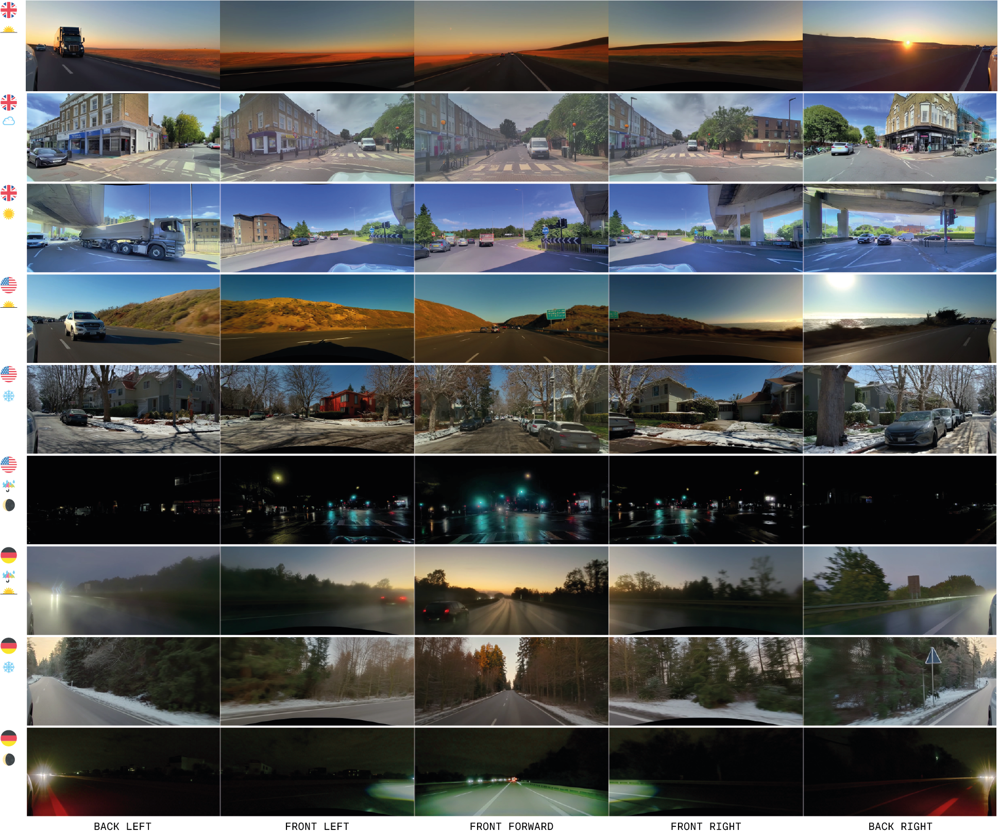

Figure 1: A selection of ‘ from scratch ’ generations demonstrating the diversity of synthetic scenarios possible with GAIA-2.

GAIA-2 supports conditioning on a wide range of scene attributes, including ego-vehicle kinematics (e.g., speed, curvature), geographic regions (UK, US, Germany), time of day, weather, and a rich taxonomy of road layout features—such as number and type of lanes (e.g., drivable, bus, cycle), presence of pedestrian crossings, traffic lights, and intersection topology (e.g., one-way roads, roundabouts). It also allows direct control over the locations, orientations, and dimensions of dynamic agents within the scene. This extensive set of conditioning parameters allows for precise control over the generated scenarios, enabling simulation of both typical driving conditions and edge cases critical for robust system evaluation.

GAIA-2는 다양한 장면 속성에서 훈련을 지원하며, 여기에는 자율 주행 차량의 운동학적 정보(예: 속도, 곡률), 지리적 지역(영국, 미국, 독일), 시간대, 날씨, 그리고 도로 구조 특징에 대한 풍부한 분류 체계(예: 차선 수와 종류, 보행자 횡단로나, 신호등, 교차로 구조, 단방향 도로, 원형 교차로 등)가 포함됩니다. 또한, 장면 내 동적 에이전트의 위치, 방향, 크기를 직접 제어할 수 있습니다. 이처럼 광범위한 훈련 매개변수를 통해 생성되는 시나리오에 대한 정밀한 제어가 가능하며, 일반적인 주행 조건뿐만 아니라 시스템의 견고성을 평가하는 데 중요한 특수 상황 시뮬레이션도 수행할 수 있습니다.

To ensure flexibility and interoperability, GAIA-2 enables conditioning on external latent spaces, including CLIP embeddings and a proprietary model trained to produce driving-specific latent representations. This capability allows semantic control over scene content and facilitates integration with downstream planning or perception modules. GAIA-2 further supports multiple video generation modes, including generation from scratch, prediction from past context, and selective content editing through inpainting.

GAIA-2를 통해 유연성과 상호 운용성을 확보할 수 있습니다. 외부 잠재 공간, 즉 CLIP 임베딩과 운전 특화 잠재 표현을 생성하도록 훈련된 자체 모델을 활용하여 장면 콘텐츠에 대한 의미론적 제어를 가능하게 하고, 다운스트림 계획 또는 인지 모듈과의 통합을 용이하게 합니다. 또한 GAIA-2는 처음부터 생성, 과거 맥락 예측, 인페인팅을 통한 선택적 콘텐츠 편집 등 다양한 비디오 생성 모드를 지원합니다.

By integrating these capabilities into a single framework, GAIA-2 sets a new benchmark in video-generative world models for autonomous driving. It enables detailed, controllable, and realistic simulation across diverse conditions, providing a powerful tool for scalable training and robust evaluation of autonomous driving systems.

저희 GAIA-2는 이러한 기능들을 하나의 프레임워크로 통합함으로써 자율 주행을 위한 비디오 생성형 월드 모델 분야에서 새로운 기준을 제시합니다. 다양한 환경에서 상세하고, 제어 가능하며, 현실적인 시뮬레이션을 제공하여 자율 주행 시스템의 확장 가능한 학습 및 견고한 평가를 위한 강력한 도구로 활용될 수 있습니다.

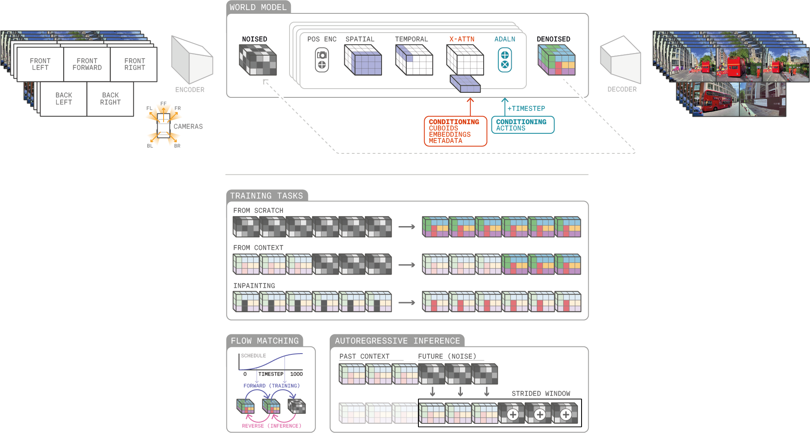

Figure 2:GAIA-2 world model. The architecture schematic shows full surround camera views independently encoded by a video tokenizer. The combined multi-camera latents are used as past context and linearly interpolated with sampled noise. We add camera parameters along with positional encodings before passing the latents through a space-time factorized transformer. Conditioning is implemented via cross-attention and adaptive layer norm. The latents are denoised into future latents, conditioned on various inputs, including actions, 3D bounding boxes, metadata, and scenario embeddings. The denoised latents are then decoded back to pixel space by the video tokenizer. Below, we depict the various tasks GAIA-2 is trained on, including from scratch generations, context rollouts, and spatial inpainting. At inference, we can generate beyond the window duration GAIA-2 was trained on by taking overlapping strides to generate new frames conditioned on previously generated frames.

## 2 Model

GAIA-2 is a surround-view video generative world model with structured conditioning, multi-camera coherence, and high spatial-temporal resolution. The architecture ([Figure 2](https://arxiv.org/html/2503.20523v1#S1.F2 "In 1 Introduction ‣ GAIA-2: A Controllable Multi-View Generative World Model for Autonomous Driving")) is composed of two primary components: a video tokenizer and a latent world model. Together, these modules enable GAIA-2 to generate realistic and semantically coherent video across multiple viewpoints with rich conditional control.

GAIA-2는 구조화된 조건부, 다중 카메라 일관성, 그리고 높은 공간-시간 해상도를 갖춘 서라운드 뷰 비디오 생성 세계 모델입니다. 이 모델의 아키텍처([Figure 2](https://arxiv.org/html/2503.20523v1#S1.F2 "In 1 Introduction ‣ GAIA-2: A Controllable Multi-View Generative World Model for Autonomous Driving"))는 두 가지 주요 구성 요소로 이루어져 있습니다: 비디오 토크나이저와 잠재 세계 모델입니다. 이 모듈들이 함께 작동하여 GAIA-2가 다중 관점에서 풍부한 조건부 제어와 함께 현실적이고 의미적으로 일관된 비디오를 생성할 수 있도록 합니다.

The video tokenizer compresses the raw high-resolution video into a compact, continuous latent space, preserving semantic and temporal structure. This compact representation enables efficient learning and generation at scale. The world model then learns to predict future latent states, conditioned on past latent states, actions, and a diverse set of domain-specific control signals. It can also be used to generate novel states completely from scratch and modify video content through inpainting. The predicted latent states are subsequently decoded back into pixel space using the video tokenizer decoder.

저희 영상 토크나이저는 고해상도 원본 영상을 압축된 연속적인 잠재 공간으로 변환하여, 의미와 시간적 구조를 보존합니다. 이 압축된 표현은 대규모 학습 및 생성에 효율성을 제공합니다. 세계 모델은 과거의 잠재 상태, 행동, 그리고 다양한 도메인별 제어 신호에 기반하여 미래의 잠재 상태를 예측하도록 학습합니다. 또한, 완전히 처음부터 새로운 상태를 생성하거나, 인페인팅을 통해 영상 콘텐츠를 수정하는 데에도 활용될 수 있습니다. 예측된 잠재 상태는 영상 토크나이저 디코더를 사용하여 픽셀 공간으로 다시 디코딩됩니다.

In contrast to most latent diffusion models, GAIA-2 employs a much higher spatial compression rate (e.g., $32\times$ vs. the more typical $8\times$ ), which is offset by increasing the channel dimension of the latent space (e.g., 64 channels instead of 16). This yields fewer but semantically richer latent tokens. The resulting advantages are twofold: (1) shorter latent sequences enable faster inference and better memory efficiency, and (2) the model demonstrates improved ability to capture video content and temporal dynamics. This parameterization strategy is inspired by prior work on compact latent representations [^10].

대부분의 잠재 확산 모델과 달리, GAIA-2는 훨씬 높은 공간 압축률(예: 32배 대 8배)를 사용합니다. 이는 잠재 공간 채널 차원을 늘림으로써 상쇄됩니다(예: 64개의 채널 대신 16개의 채널). 그 결과, 더 적지만 의미적으로 풍부한 잠재 토큰을 얻을 수 있습니다. 이러한 장점은 두 가지로 나눌 수 있습니다. 첫째, 짧은 잠재 시퀀스는 더 빠른 추론과 향상된 메모리 효율성을 가능하게 합니다. 둘째, 모델은 비디오 콘텐츠와 시간적 동역학을 포착하는 능력이 향상되었습니다. 이러한 파라미터화 전략은 압축된 잠재 표현에 대한 이전 연구에서 영감을 받았습니다.

Unlike its predecessor GAIA-1 [^5], which relied on discrete latent variables, GAIA-2 employs a continuous latent space, improving temporal smoothness and reconstruction fidelity. Furthermore, GAIA-2 introduces a flexible conditioning interface that supports ego-vehicle actions, dynamic agent states (e.g., 3D bounding boxes), structured metadata, CLIP and scenario embeddings, and camera geometry. This design enables robust control over scene semantics and agent behavior during generation, while ensuring cross-view consistency and temporal coherence.

GAIA-2는 이전 모델인 GAIA-1[^5]와 달리, 연속적인 잠재 공간을 활용하여 시간적 흐름을 더욱 부드럽게 하고 재구성 정확도를 향상시켰습니다. 또한, GAIA-2는 자율 주행 차량의 행동, 동적 에이전트 상태(예: 3D 바운딩 박스), 구조화된 메타데이터, CLIP 및 시나리오 임베딩, 카메라 기하학 등을 지원하는 유연한 조건화 인터페이스를 도입했습니다. 이러한 설계는 생성 과정에서 장면 의미와 에이전트 행동에 대한 강력한 제어 기능을 제공하며, 동시에 다중 뷰 일관성과 시간적 응집성을 보장합니다.

### 2.1 Video Tokenizer

The video tokenizer compresses pixel-space video into a compact latent space that is continuous and semantically structured. It is composed of a space-time factorized transformer with an asymmetric encoder-decoder architecture (with 85M and 200M parameters, respectively). The encoder extracts spatiotemporally downsampled latents that are temporally independent; the decoder reconstructs full-frame video from these latents using temporal context for temporal consistency.

저희 비디오 토크나이저 기술은 픽셀 공간의 비디오를 연속적이고 의미적으로 구조화된, 콤팩트한 잠재 공간으로 압축합니다. 이 기술은 각각 85백만, 200백만 파라미터를 가진 비대칭 인코더-디코더 아키텍처를 특징으로 하는 공간-시간 분해된 트랜스포머로 구성되어 있습니다. 인코더는 공간-시간적으로 다운샘플링된 잠재 데이터를 추출하며, 디코더는 시간적 일관성을 위해 이러한 잠재 데이터를 활용하여 전체 프레임 비디오를 재구성합니다.

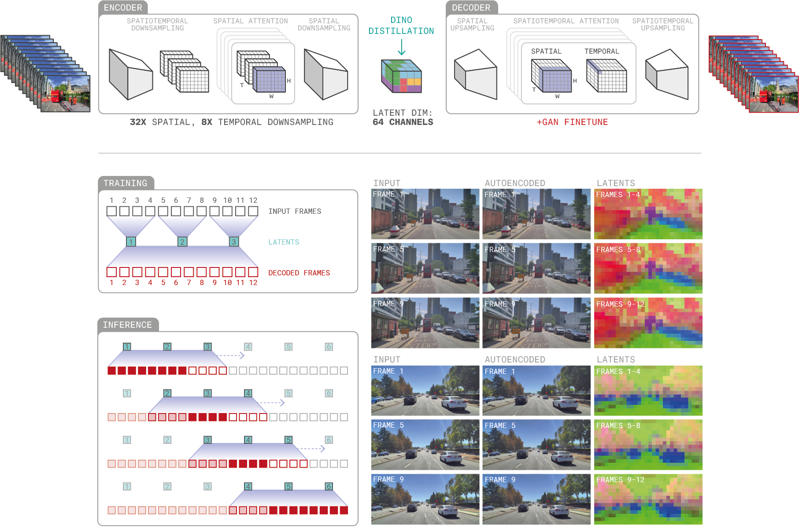

Figure 3:GAIA-2 video tokenizer. The architecture schematic depicts input frames spatiotemporally downsampled into temporally independent latents. A high spatial compression rate is compensated for by an increased latent channel dimension. Latents are decoded back to video frames, leveraging full spatiotemporal attention to ensure temporal consistency. To autoencode long sequences, we employ a rolling inference mechanism where current latents are decoded using past and future context in a sliding window fashion. The examples show input frames, decoded frames, and a visualization of the latent space. The first 3 principal components of the latent features are mapped to RGB values. Notably, the latent space is semantically stable across frames and across samples.

#### 2.1.1 Encoder

Given an input video $({\mathbf{i}}_{1},...,{\mathbf{i}}_{T_{v}})$ , the encoder $e_{\phi}$ computes latent tokens $({\mathbf{z}}_{1},...,{\mathbf{z}}_{T_{L}})=e_{\phi}({\mathbf{i}}_{1},...,{%
\mathbf{i}}_{T_{v}})$ , where $T_{v}$ corresponds to the number of video frames and $T_{L}$ the number of latents. Let us denote by $H_{v}\times W_{v}$ the spatial resolution of the video frames and $H\times W$ the spatial resolution of the latent tokens. The encoder downsamples spatially by a factor $\frac{H_{v}}{H}=32$ and temporally by a factor $\frac{T_{v}}{T_{L}}=8$ . The latent dimension is $L=64$ , which results in a total compression of ( $\frac{T_{v}\times H_{v}\times W_{v}\times 3}{T_{L}\times H\times W\times L}=384)$ with $(T_{v},H_{v},W_{v})=(24,448,960)$ and $(T_{L},H,W)=(3,14,30)$ .

입력 비디오 $({\mathbf{i}}_{1},...,{\mathbf{i}}_{T_{v}})$ 를 주시면, 인코더 $e_{\phi}$는 잠재 토큰 $({\mathbf{z}}_{1},...,{\mathbf{z}}_{T_{L}})=e_{\phi}({\mathbf{i}}_{1},...,{\mathbf{i}}_{T_{v}})$ 를 계산합니다. 여기서 $T_{v}$는 비디오 프레임의 개수를 나타내며, $T_{L}$은 잠재 토큰의 개수를 나타냅니다. 비디오 프레임의 공간 해상도는 $H_{v}\times W_{v}$로, 잠재 토큰의 공간 해상도는 $H\times W$로 표현됩니다. 인코더는 공간적으로 32배, 시간적으로 8배로 다운샘플링합니다. 잠재 차원은 $L=64$이며, 이는 총 압축률이 ($\frac{T_{v}\times H_{v}\times W_{v}\times 3}{T_{L}\times H\times W\times L}=384$)로 나타납니다.  ($T_{v},H_{v},W_{v}$)는 (24,448,960)이고, ($T_{L},H,W$)는 (3,14,30)입니다.

This downsampling is achieved by temporally striding the input frames by $2\times$ and the following modules:

1. A downsampling convolutional block with stride $2\times 8\times 8$ (time, height, width) followed by another downsampling convolutional block with stride $2\times 2\times 2$ (both operating at embedding dimension $512$ ).
2. A series of $24$ spatial transformer blocks with dimension $512$ and $16$ heads.
3. A final convolution with stride $1\times 2\times 2$ , followed by a linear projection to $2L$ channels to model a Gaussian distribution over latents. Note that the latent dimension is doubled as the encoder predicts the mean and standard deviation of a Gaussian distribution. During both training and inference, the latents are sampled from this resulting distribution.

저희는 입력 프레임을 시간 방향으로 2배씩 스트라이드하여, 그리고 다음 모듈들을 통해 다운샘플링을 수행합니다.

1. 시간(time), 높이(height), 너비(width) 각각 2x8x8 스트라이드를 갖는 다운샘플링 컨볼루션 블록과, 임베딩 차원 512에서 작동하는 또 다른 다운샘플링 컨볼루션 블록이 있습니다.
2. 임베딩 차원 512의 24개의 스페셜 트랜스포머 블록과 16개의 헤드가 포함됩니다.
3. 마지막으로 1x2x2 스트라이드를 갖는 컨볼루션 연산을 수행하고, 그리고 2L 채널로 선형 투영을 통해 잠재 분포(latent distribution)에 대한 가우시안 분포를 모델링합니다. 잠재 차원은 인코더가 가우시안 분포의 평균과 표준 편차를 예측하기 때문에 2배로 확장됩니다. 학습 과정과 추론 과정 모두에서 잠재 값은 이 결과로 생성된 분포에서 샘플링됩니다.

#### 2.1.2 Decoder

The decoder architecture is:

1. A linear projection from the latent dimension to the embedding dimension followed by a first upsampling convolutional block with stride $1\times 2\times 2$ (upsampling is achieved with a depth-to-space module [^12]).
2. A series of 16 space-time factorized transformer blocks with dimension $512$ and $16$ heads.
3. An upsampling convolutional block with stride $2\times 2\times 2$ followed by $8$ space-time factorized transformer blocks with dimension $512$ and $16$ heads.
4. A final upsampling convolutional block with stride $2\times 8\times 8$ and dimension $3$ corresponding to the pixel RGB channels.

디코더 아키텍처는 다음과 같습니다.

1. 잠재 차원(latent dimension)에서 임베딩 차원(embedding dimension)로 선형 투영(linear projection)을 수행한 후, 스트라이드(stride)가 $1\times 2\times 2$인 첫 번째 업샘플링(upsampling) 컨볼루션 블록(convolutional block)을 사용합니다. 업샘플링은 깊이-공간 모듈(depth-to-space module)을 통해 구현됩니다.
2. 512차원과 16개의 헤드(heads)를 가진 16개의 공간-시간 분해된 트랜스포머 블록(space-time factorized transformer blocks)으로 구성됩니다.
3. 스트라이드(stride)가 $2\times 2\times 2$인 업샘플링(upsampling) 컨볼루션 블록 다음에 스트라이드(stride)가 $2\times 2\times 2$인 업샘플링(upsampling) 컨볼루션 블록 다음에 512차원과 16개의 헤드(heads)를 가진 8개의 공간-시간 분해된 트랜스포머 블록(space-time factorized transformer blocks)이 이어집니다.
4. 마지막으로 스트라이드(stride)가 $2\times 8\times 8$이고 3차원으로, RGB 채널에 해당하는 차원을 나타냅니다.

A key difference between the encoder and decoder is that the encoder independently maps $8$ consecutive video frames to a single temporal latent, while the decoder jointly decodes the $T_{L}=3$ temporal latents to $T_{v}=24$ video frames for temporal consistency. During inference, the video frames are decoded with a sliding window. The logic is shown in diagrams ‘ Training ’ and ‘ Inference ’ of [Figure 3](https://arxiv.org/html/2503.20523v1#S2.F3 "In 2.1 Video Tokenizer ‣ 2 Model ‣ GAIA-2: A Controllable Multi-View Generative World Model for Autonomous Driving").

엔코더와 디코더의 핵심적인 차이점은, 엔코더가 8개의 연속된 비디오 프레임을 하나의 템포럴 잠런트(temporal latent)로 독립적으로 매핑한다는 점입니다. 반면, 디코더는 3개의 템포럴 잠런트(temporal latent)를 함께 디코딩하여 24개의 비디오 프레임을 생성함으로써 시간적 일관성을 유지합니다. 추론 과정에서는 슬라이딩 윈도우(sliding window) 방식으로 비디오 프레임을 디코딩합니다. 자세한 내용은 [Figure 3]의 ‘Training’ 및 ‘Inference’ 다이어그램을 참고해 주시기 바랍니다.

#### 2.1.3 Training Losses

The video tokenizer is trained with a combination of pixel reconstruction and latent space losses:

- Image reconstruction with $L_{1}$ , $L_{2}$ , and perceptual losses [^13].
- DINO [^14] distillation on the latent features through a cosine similarity loss, encouraging semantic alignment with pre-trained representations. The video frames are encoded with the DINO model and temporally downsampled with linear interpolation to match the dimensionality of the latent features.
- Kullback-Leibler divergence loss [^1] with respect to a standard Gaussian distribution to regularize the latent space.

저희 비디오 토크나이저(Video Tokenizer)는 픽셀 재구성과 잠재 공간 손실의 조합을 통해 학습되었습니다.

- $L_1$, $L_2$, 그리고 인지 손실[^13]을 활용한 이미지 재구성을 통해 학습되었습니다.
- DINO[^14] 증류를 통해 코사인 유사도 손실을 사용하여 잠재 특징과의 의미적 정렬을 장려합니다. 이는 사전 훈련된 표현과의 일관성을 높이는 데 목적이 있습니다. 비디오 프레임은 DINO 모델을 사용하여 인코딩되고, 선형 보간법을 통해 잠재 특징의 차원과 일치하도록 시간적으로 다운샘플링됩니다.
- 표준 가우시안 분포에 대한 쿨백-라이블러 다이버전스 손실[^1]을 사용하여 잠재 공간을 정규화합니다.

To improve visual quality, we further fine-tune the decoder with a GAN loss [^4] using a 3D convolutional discriminator and the image reconstruction losses, while keeping the encoder frozen. The discriminator is a series of residual 3D convolutional blocks with base channel 64, stride 2 in time and space with 3D blur pooling [^15], channel multipliers \[2, 4, 8, 8\], 3D instance normalization, and LeakyReLU with slope $0.2$ . It uses spectral normalization [^16] and the original GAN loss implemented with a softplus activation function.

시각적 품질을 더욱 향상시키기 위해, 저희는 3D 컨볼루션 디스크리미네이터와 이미지 재구성 손실을 활용하여 GAN 손실로 디코더를 추가적으로 미세 조정했으며, 인코더는 동결했습니다. 디스크리미네이터는 기본 채널 64, 시간 및 공간에서 스트라이드 2를 가지는 잔류 3D 컨볼루션 블록의 시리즈로 구성되어 있으며, 3D 블러 풀링[^15], 채널 곱셈[2, 4, 8, 8], 3D 인스턴스 정규화, 그리고 기울기 $0.2$의 LeakyReLU를 사용합니다. 또한, 스펙트럴 정규화[^16]를 적용하고, 소프트플러스 활성화 함수를 사용하여 원래 GAN 손실을 구현합니다.

### 2.2 World Model

The latent world model predicts future latent states conditioned on past latents, actions, and a rich set of conditioning inputs. It is implemented as a space-time factorized transformer with 8.4B parameters and is trained using flow matching [^17] for stability and sample efficiency.

잠재 세계 모델은 과거의 잠재 상태, 행동, 그리고 풍부한 조건 입력들을 바탕으로 미래의 잠재 상태를 예측합니다. 8.4B 파라미터로 구성된 공간-시간 분해된 트랜스포머 형태로 구현되었으며, 안정성과 샘플 효율성을 위해 플로우 매칭 [^17] 방식으로 훈련되었습니다.

Let ${\mathbf{x}}_{1:T}\in\mathbb{R}^{T\times N\times H\times W\times L}$ be the input latents, where $T$ is the temporal window and $N$ is the number of cameras. The input latents are obtained by independently encoding each camera view with the encoder $e_{\phi}$ . At each timestep $t$ , we also provide an action vector ${\mathbf{a}}_{t}$ and a conditioning vector ${\mathbf{c}}_{t}$ .

입력 잠재값 ${\mathbf{x}}_{1:T}$은 $\mathbb{R}^{T\times N\times H\times W\times L}$ 형태를 가지며, 여기서 $T$는 시간 창 크기, $N$은 카메라 수입니다. 입력 잠재값은 각 카메라 뷰를 독립적으로 인코더 $e_{\phi}$를 사용하여 획득합니다. 각 시간 단계 $t$에서, 액션 벡터 ${\mathbf{a}}_{t}$와 조건 벡터 ${\mathbf{c}}_{t}$도 함께 제공합니다.

#### 2.2.1 Architecture

The world model is a space-time factorized transformer with hidden dimension $C$ . Each action ${\mathbf{a}}_{t}$ is embedded to $\mathbb{R}^{C}$ , and the conditioning vector ${\mathbf{c}}_{t}$ embedded to $\mathbb{R}^{K\times C}$ , where $K$ corresponds to the number of conditioning variables. The flow matching time $\tau\in[0,1]$ is also mapped to $\mathbb{R}^{C}$ using a sinusoidal encoding [^18].

세계 모델은 $C$ 차원의 은폐된 공간-시간 분해된 트랜스포머입니다. 각 행동 ${\mathbf{a}}_{t}$은 $\mathbb{R}^{C}$ 공간으로 임베딩되며, 조건 벡터 ${\mathbf{c}}_{t}$은 $\mathbb{R}^{K\times C}$ 공간으로 임베딩됩니다. 여기서 $K$는 조건 변수의 개수를 나타냅니다. 또한, 흐름 일치 시간 $\tau[0,1]$은 시노스요idal 인코딩[^18]을 사용하여 $\mathbb{R}^{C}$ 공간으로 매핑됩니다.

Flow matching time $\tau$ and action ${\mathbf{a}}_{t}$ are injected into each transformer block through the adaptive layer norm [^19], while we use cross-attention for the other conditioning variables ${\mathbf{c}}_{t}$ . We have found that action conditioning was more accurate when using adaptive layer norm over cross-attention. As the action affects every spatial token, the adaptive layer norm provides an explicit information gateway instead of having to rely on a learnable attention mechanism.

각 트랜스포머 블록에는 적응형 레이어 정규화[^19]를 통해 흐름 일치 시간 $\tau$와 액션 ${\mathbf{a}}_{t}$가 주입되며, 다른 조건 변수 ${\mathbf{c}}_{t}$에는 교차 어텐션을 사용합니다. 액션 조건화가 교차 어텐션보다 적응형 레이어 정규화를 사용하는 경우 더 정확한 결과를 얻은 것을 확인했습니다. 액션은 모든 공간 토큰에 영향을 미치므로, 적응형 레이어 정규화는 학습 가능한 어텐션 메커니즘에 의존하는 대신 명시적인 정보 통로를 제공합니다.

Regarding positional encoding, we independently encode: (i) spatial token position with a sinusoidal embedding, (ii) camera timestamp with a sinusoidal embedding followed by a small MLP, and (iii) camera geometry (distortion, intrinsic, and extrinsics) with learnable linear layers. All these positional encodings are added to the input latents at the beginning of each transformer block, similar to [^20].

위치 인코딩에 대해, 저희는 다음과 같이 독립적으로 인코딩합니다. 첫째, 시공간 토큰의 위치를 사이нус 함수 기반 임베딩으로, 둘째, 카메라 타임스탬프를 사이нус 함수 기반 임베딩 후 작은 MLP로, 셋째, 카메라 기하학(왜곡, 내부, 외부)을 학습 가능한 선형 레이어로 인코딩합니다. 이러한 모든 위치 인코딩은 각 트랜스포머 블록의 시작 시점에 입력 잠재 벡터에 더해집니다. [^20]과 유사하게 말이죠.

The world model contains $22$ space-time factorized transformer blocks with hidden dimension $C=4096$ and $32$ heads. Each transformer block contains a spatial attention (over space and cameras), a temporal attention, a cross-attention, and an MLP layer with an adaptive layer norm. For increased training stability, we use query-key normalization [^21] before each attention layer.

세계 모델은 4096 차원의 은닉 변수(C)를 가진 22개의 공간-시간 분해된 트랜스포머 블록을 포함하고 있으며, 각 블록은 32개의 헤드를 가지고 있습니다. 각 트랜스포머 블록은 공간 및 카메라에 대한 공간 어텐션, 시간 어텐션, 교차 어텐션, 그리고 적응형 레이어 정규화를 갖는 MLP 레이어를 포함합니다. 훈련 안정성을 높이기 위해, 각 어텐션 레이어 전에 쿼리-키 정규화를 사용합니다.

#### 2.2.2 Losses

At training time, we randomly sample the number of context frames $t\in\{0,...,T-1\}$ where $t=0$ corresponds to from scratch generation. We also sample a flow matching time $\tau\in[0,1]$ according to a pre-defined distribution (see [Section 2.2.4](https://arxiv.org/html/2503.20523v1#S2.SS2.SSS4 "2.2.4 Flow matching Time Distribution ‣ 2.2 World Model ‣ 2 Model ‣ GAIA-2: A Controllable Multi-View Generative World Model for Autonomous Driving") for more details). The context latents ${\mathbf{x}}_{1:t}$ are unchanged, while the future latents ${\mathbf{x}}_{t+1:T}$ are linearly interpolated with random Gaussian noise ${\bm{\epsilon}}_{t+1:T}\sim\mathcal{N}({\bm{0}},{\bm{I}})$ .

훈련 과정에서, 컨텍스트 프레임 개수 $t$는 $\{0, ..., T-1\}$ 범위에서 무작위로 샘플링됩니다. 여기서 $t=0$은 처음부터 생성하는 것을 의미합니다. 또한, 미리 정의된 분포에 따라 흐름 일치 시간 $\tau$를 무작위로 샘플링합니다. (자세한 내용은 [Section 2.2.4](https://arxiv.org/html/2503.20523v1#S2.SS2.SSS4 "2.2.4 Flow matching Time Distribution ‣ 2.2 World Model ‣ 2 Model ‣ GAIA-2: A Controllable Multi-View Generative World Model for Autonomous Driving")를 참조해 주시기 바랍니다). 컨텍스트 잠재 벡터 ${\mathbf{x}}_{1:t}$는 변경되지 않으며, 미래 잠재 벡터 ${\mathbf{x}}_{t+1:T}$는 랜덤 가우시안 노이즈 ${\bm{\epsilon}}_{t+1:T}\sim\mathcal{N}({\bm{0}},{\bm{I}})$로 선형 보간됩니다.

<table><tbody><tr><td></td><td><math><semantics><mrow><msubsup><mi>𝐱</mi> <mrow><mrow><mi>t</mi> <mo>+</mo> <mn>1</mn></mrow><mo>:</mo><mi>T</mi></mrow> <mi>τ</mi></msubsup> <mo>=</mo> <mrow><mrow><mi>τ</mi> <mo>⁢</mo> <msub><mi>𝐱</mi> <mrow><mrow><mi>t</mi> <mo>+</mo> <mn>1</mn></mrow><mo>:</mo><mi>T</mi></mrow></msub></mrow> <mo>+</mo> <mrow><mrow><mo>(</mo><mrow><mn>1</mn> <mo>−</mo> <mi>τ</mi></mrow><mo>)</mo></mrow> <mo>⁢</mo> <msub><mi>ϵ</mi> <mrow><mrow><mi>t</mi> <mo>+</mo> <mn>1</mn></mrow><mo>:</mo><mi>T</mi></mrow></msub></mrow></mrow></mrow> <annotation-xml><apply><apply><csymbol>superscript</csymbol> <apply><csymbol>subscript</csymbol> <ci>𝐱</ci><apply><ci>:</ci><apply><ci>𝑡</ci> <cn>1</cn></apply> <ci>𝑇</ci></apply></apply> <ci>𝜏</ci></apply> <apply><apply><ci>𝜏</ci> <apply><csymbol>subscript</csymbol> <ci>𝐱</ci><apply><ci>:</ci><apply><ci>𝑡</ci> <cn>1</cn></apply> <ci>𝑇</ci></apply></apply></apply> <apply><apply><cn>1</cn> <ci>𝜏</ci></apply> <apply><csymbol>subscript</csymbol> <ci>bold-italic-ϵ</ci><apply><ci>:</ci><apply><ci>𝑡</ci> <cn>1</cn></apply> <ci>𝑇</ci></apply></apply></apply></apply></apply></annotation-xml> <annotation>{\mathbf{x}}_{t+1:T}^{\tau}=\tau{\mathbf{x}}_{t+1:T}+(1-\tau){\bm{\epsilon}}_{% t+1:T}</annotation> <annotation>bold_x start_POSTSUBSCRIPT italic_t + 1: italic_T end_POSTSUBSCRIPT start_POSTSUPERSCRIPT italic_τ end_POSTSUPERSCRIPT = italic_τ bold_x start_POSTSUBSCRIPT italic_t + 1: italic_T end_POSTSUBSCRIPT + ( 1 - italic_τ ) bold_italic_ϵ start_POSTSUBSCRIPT italic_t + 1: italic_T end_POSTSUBSCRIPT</annotation></semantics></math></td><td></td><td rowspan="1">(1)</td></tr></tbody></table>

The velocity target vector ${\mathbf{v}}_{t+1:T}$ is the difference between target latents and random noise:

<table><tbody><tr><td></td><td><math><semantics><mrow><msub><mi>𝐯</mi> <mrow><mrow><mi>t</mi> <mo>+</mo> <mn>1</mn></mrow><mo>:</mo><mi>T</mi></mrow></msub> <mo>=</mo> <mrow><msub><mi>𝐱</mi> <mrow><mrow><mi>t</mi> <mo>+</mo> <mn>1</mn></mrow><mo>:</mo><mi>T</mi></mrow></msub> <mo>−</mo> <msub><mi>ϵ</mi> <mrow><mrow><mi>t</mi> <mo>+</mo> <mn>1</mn></mrow><mo>:</mo><mi>T</mi></mrow></msub></mrow></mrow> <annotation-xml><apply><apply><csymbol>subscript</csymbol> <ci>𝐯</ci><apply><ci>:</ci><apply><ci>𝑡</ci> <cn>1</cn></apply> <ci>𝑇</ci></apply></apply> <apply><apply><csymbol>subscript</csymbol> <ci>𝐱</ci><apply><ci>:</ci><apply><ci>𝑡</ci> <cn>1</cn></apply> <ci>𝑇</ci></apply></apply> <apply><csymbol>subscript</csymbol> <ci>bold-italic-ϵ</ci><apply><ci>:</ci><apply><ci>𝑡</ci> <cn>1</cn></apply> <ci>𝑇</ci></apply></apply></apply></apply></annotation-xml> <annotation>{\mathbf{v}}_{t+1:T}={\mathbf{x}}_{t+1:T}-{\bm{\epsilon}}_{t+1:T}</annotation> <annotation>bold_v start_POSTSUBSCRIPT italic_t + 1: italic_T end_POSTSUBSCRIPT = bold_x start_POSTSUBSCRIPT italic_t + 1: italic_T end_POSTSUBSCRIPT - bold_italic_ϵ start_POSTSUBSCRIPT italic_t + 1: italic_T end_POSTSUBSCRIPT</annotation></semantics></math></td><td></td><td rowspan="1">(2)</td></tr></tbody></table>

The world model $f_{\theta}$ predicts the target velocity ${\mathbf{v}}_{t+1:T}$ conditioned on context latents ${\mathbf{x}}_{1:t}$ , actions ${\mathbf{a}}_{1:T}$ and conditioning variables ${\mathbf{c}}_{1:T}$ .

<table><tbody><tr><td></td><td><math><semantics><mrow><msub><mover><mi>𝐯</mi> <mo>^</mo></mover> <mrow><mrow><mi>t</mi> <mo>+</mo> <mn>1</mn></mrow><mo>:</mo><mi>T</mi></mrow></msub> <mo>=</mo> <mrow><msub><mi>f</mi> <mi>θ</mi></msub> <mo>⁢</mo> <mrow><mo>(</mo><mrow><msubsup><mi>𝐱</mi> <mrow><mrow><mi>t</mi> <mo>+</mo> <mn>1</mn></mrow><mo>:</mo><mi>T</mi></mrow> <mi>τ</mi></msubsup> <mo>|</mo> <mrow><msub><mi>𝐱</mi> <mrow><mn>1</mn><mo>:</mo><mi>t</mi></mrow></msub><mo>,</mo><msub><mi>𝐚</mi> <mrow><mn>1</mn><mo>:</mo><mi>T</mi></mrow></msub><mo>,</mo><msub><mi>𝐜</mi> <mrow><mn>1</mn><mo>:</mo><mi>T</mi></mrow></msub><mo>,</mo><mi>τ</mi></mrow></mrow><mo>)</mo></mrow></mrow></mrow> <annotation-xml><apply><apply><csymbol>subscript</csymbol> <apply><ci>^</ci> <ci>𝐯</ci></apply><apply><ci>:</ci><apply><ci>𝑡</ci> <cn>1</cn></apply> <ci>𝑇</ci></apply></apply> <apply><apply><csymbol>subscript</csymbol> <ci>𝑓</ci> <ci>𝜃</ci></apply> <apply><csymbol>conditional</csymbol> <apply><csymbol>superscript</csymbol> <apply><csymbol>subscript</csymbol> <ci>𝐱</ci><apply><ci>:</ci><apply><ci>𝑡</ci> <cn>1</cn></apply> <ci>𝑇</ci></apply></apply> <ci>𝜏</ci></apply> <list><apply><csymbol>subscript</csymbol> <ci>𝐱</ci><apply><ci>:</ci><cn>1</cn> <ci>𝑡</ci></apply></apply> <apply><csymbol>subscript</csymbol> <ci>𝐚</ci><apply><ci>:</ci><cn>1</cn> <ci>𝑇</ci></apply></apply> <apply><csymbol>subscript</csymbol> <ci>𝐜</ci><apply><ci>:</ci><cn>1</cn> <ci>𝑇</ci></apply></apply> <ci>𝜏</ci></list></apply></apply></apply></annotation-xml> <annotation>\hat{{\mathbf{v}}}_{t+1:T}=f_{\theta}({\mathbf{x}}_{t+1:T}^{\tau}|{\mathbf{x}}% _{1:t},{\mathbf{a}}_{1:T},{\mathbf{c}}_{1:T},\tau)</annotation> <annotation>over^ start_ARG bold_v end_ARG start_POSTSUBSCRIPT italic_t + 1: italic_T end_POSTSUBSCRIPT = italic_f start_POSTSUBSCRIPT italic_θ end_POSTSUBSCRIPT ( bold_x start_POSTSUBSCRIPT italic_t + 1: italic_T end_POSTSUBSCRIPT start_POSTSUPERSCRIPT italic_τ end_POSTSUPERSCRIPT | bold_x start_POSTSUBSCRIPT 1: italic_t end_POSTSUBSCRIPT, bold_a start_POSTSUBSCRIPT 1: italic_T end_POSTSUBSCRIPT, bold_c start_POSTSUBSCRIPT 1: italic_T end_POSTSUBSCRIPT, italic_τ )</annotation></semantics></math></td><td></td><td rowspan="1">(3)</td></tr></tbody></table>

The model is trained with an $L_{2}$ loss between the predicted and the target velocity.

<table><tbody><tr><td></td><td><math><semantics><mrow><msub><mi>ℒ</mi> <mtext>world-model</mtext></msub> <mo>=</mo> <mrow><msub><mi>𝔼</mi> <mrow><mrow><mi>t</mi> <mo>∼</mo> <mrow><mi>P</mi> <mo>⁢</mo> <mrow><mo>(</mo><mi>t</mi><mo>)</mo></mrow></mrow></mrow><mo>,</mo><mrow><mi>τ</mi> <mo>∼</mo> <mrow><mi>p</mi> <mo>⁢</mo> <mrow><mo>(</mo><mi>τ</mi><mo>)</mo></mrow></mrow></mrow></mrow></msub> <mo>⁢</mo> <mrow><mo>[</mo><msup><mrow><mo>‖</mo> <mrow><msub><mi>𝐯</mi> <mrow><mrow><mi>t</mi> <mo>+</mo> <mn>1</mn></mrow><mo>:</mo><mi>T</mi></mrow></msub> <mo>−</mo> <msub><mover><mi>𝐯</mi> <mo>^</mo></mover> <mrow><mrow><mi>t</mi> <mo>+</mo> <mn>1</mn></mrow><mo>:</mo><mi>T</mi></mrow></msub></mrow> <mo>‖</mo></mrow> <mn>2</mn></msup><mo>]</mo></mrow></mrow></mrow> <annotation-xml><apply><apply><csymbol>subscript</csymbol> <ci>ℒ</ci> <ci><mtext>world-model</mtext></ci></apply> <apply><apply><csymbol>subscript</csymbol> <ci>𝔼</ci> <apply><csymbol>formulae-sequence</csymbol> <apply><csymbol>similar-to</csymbol> <ci>𝑡</ci> <apply><ci>𝑃</ci> <ci>𝑡</ci></apply></apply> <apply><csymbol>similar-to</csymbol> <ci>𝜏</ci> <apply><ci>𝑝</ci> <ci>𝜏</ci></apply></apply></apply></apply> <apply><csymbol>delimited-[]</csymbol> <apply><csymbol>superscript</csymbol> <apply><csymbol>norm</csymbol> <apply><apply><csymbol>subscript</csymbol> <ci>𝐯</ci><apply><ci>:</ci><apply><ci>𝑡</ci> <cn>1</cn></apply> <ci>𝑇</ci></apply></apply> <apply><csymbol>subscript</csymbol> <apply><ci>^</ci> <ci>𝐯</ci></apply><apply><ci>:</ci><apply><ci>𝑡</ci> <cn>1</cn></apply> <ci>𝑇</ci></apply></apply></apply></apply> <cn>2</cn></apply></apply></apply></apply></annotation-xml> <annotation>\mathcal{L}_{\text{world-model}}=\mathbb{E}_{t\sim P(t),\tau\sim p(\tau)}[||{% \mathbf{v}}_{t+1:T}-\hat{{\mathbf{v}}}_{t+1:T}||^{2}]</annotation> <annotation>caligraphic_L start_POSTSUBSCRIPT world-model end_POSTSUBSCRIPT = blackboard_E start_POSTSUBSCRIPT italic_t ∼ italic_P ( italic_t ), italic_τ ∼ italic_p ( italic_τ ) end_POSTSUBSCRIPT [ | | bold_v start_POSTSUBSCRIPT italic_t + 1: italic_T end_POSTSUBSCRIPT - over^ start_ARG bold_v end_ARG start_POSTSUBSCRIPT italic_t + 1: italic_T end_POSTSUBSCRIPT | | start_POSTSUPERSCRIPT 2 end_POSTSUPERSCRIPT ]</annotation></semantics></math></td><td></td><td rowspan="1">(4)</td></tr></tbody></table>

where $t\sim P(t)$ denotes the distribution of context frames and $\tau\sim p(\tau)$ the distribution of flow matching time.

#### 2.2.3 Conditioning

GAIA-2 supports rich and structured conditioning inputs that enable fine-grained control over the generated scenes. These inputs include ego-vehicle actions, dynamic agent properties, scene-level metadata, camera configurations, timestamp embedding, and external latent representations such as CLIP or proprietary scenario embeddings. The conditioning mechanisms are integrated into the world model through a combination of adaptive layer normalization (for action), additive modules (for camera geometry and timestamp), and cross-attention (for all other variables).

저희 GAIA-2는 생성되는 장면을 정밀하게 제어할 수 있는 풍부하고 구조화된 조건부 입력들을 지원합니다. 이러한 입력에는 자율 주행 차량의 동작, 동적 에이전트 속성, 장면 수준 메타데이터, 카메라 설정, 타임스탬프 임베딩, CLIP 또는 자체적인 시나리오 임베딩과 같은 외부 잠재 표현 등이 포함됩니다. 이러한 조건부 메커니즘은 적응형 레이어 정규화(행동을 위한), 첨가 모듈(카메라 기하학 및 타임스탬프를 위한), 그리고 교차 어텐션(모든 다른 변수를 위한)을 통해 세계 모델에 통합됩니다.

##### Camera Parameters.

We compute separate embeddings for intrinsics, extrinsics, and distortion, which are then summed to form a unified camera encoding. For intrinsics, we extract focal lengths and principal point coordinates from the intrinsic matrix, normalize them, and project them into a shared latent space. Extrinsics and distortion coefficients are similarly processed through their respective encoders to yield compact representations. This configuration allows the model to effectively incorporate real-world camera variations. [Figure 5](https://arxiv.org/html/2503.20523v1#S5.F5 "In Classifier-Free Guidance. ‣ 5 Inference ‣ GAIA-2: A Controllable Multi-View Generative World Model for Autonomous Driving") illustrates the top three most common camera rig configurations in the training dataset.

저희는 내부(intrinsics), 외부(extrinsics), 왜곡(distortion)에 대해 각각 별도의 임베딩을 계산합니다. 이 임베딩들을 합쳐서 일관된 카메라 인코딩을 생성합니다. 내부 정보의 경우, 내부 행렬에서 초점 거리와 주점 좌표를 추출하여 정규화하고, 공유된 잠재 공간으로 투영합니다. 외부 정보와 왜곡 계수는 각각의 인코더를 통해 처리하여 압축된 표현을 얻습니다. 이러한 구성은 모델이 실제 카메라의 변동성을 효과적으로 통합할 수 있도록 합니다. [그림 5](https://arxiv.org/html/2503.20523v1#S5.F5 "In Classifier-Free Guidance. ‣ 5 Inference ‣ GAIA-2: A Controllable Multi-View Generative World Model for Autonomous Driving")는 학습 데이터셋에서 가장 흔하게 사용되는 세 가지 카메라  Rig 구성의 예시를 보여줍니다.

##### Video Frequency.

To account for variable video frame rates, GAIA-2 uses timestamp conditioning. Each timestamp is: (i) Normalized relative to the present time and scaled to the range $[-1,1]$ , (ii) Transformed using sinusoidal functions (Fourier feature encoding), and (iii) Passed through an MLP to produce a vector in the shared latent space. This encoding captures both low- and high-frequency temporal variation and enables the model to reason effectively over videos recorded at different rates.

다양한 비디오 프레임 속도를 고려하기 위해 GAIA-2는 타임스탬프 조건화를 사용합니다. 각 타임스탬프는 (i) 현재 시간 대비 정규화되어 [-1, 1] 범위로 조정되고, (ii) 정현파 함수(푸리에 특징 인코딩)를 사용하여 변환되며, (iii) 공유된 잠재 공간에 벡터를 생성하기 위해 MLP를 통과됩니다. 이 인코딩은 저주파 및 고주파 시간적 변동을 모두 포착하여 서로 다른 속도로 촬영된 비디오에 대해 모델이 효과적으로 추론할 수 있도록 합니다.

##### Action.

The ego-vehicle action is parameterized by speed and curvature. Since these quantities span multiple orders of magnitude, we use a symmetric logarithmic transformation symlog [^22] for normalization:

속도와 곡률에 따라 설정되는 ‘이고 차량 액션’은 여러 차례의 크기 변화를 고려합니다. 이러한 요소들은 상당히 큰 범위를 가지고 있기 때문에, 정규화를 위해 대칭 로그 변환(symlog)을 사용합니다.

<table><tbody><tr><td></td><td><math><semantics><mrow><mrow><mtext>symlog</mtext> <mo>⁢</mo> <mrow><mo>(</mo><mi>y</mi><mo>)</mo></mrow></mrow> <mo>=</mo> <mrow><mtext>sign</mtext> <mo>⁢</mo> <mrow><mo>(</mo><mi>y</mi><mo>)</mo></mrow> <mo>⁢</mo> <mfrac><mrow><mi>log</mi> <mo>⁡</mo> <mrow><mo>(</mo><mrow><mn>1</mn> <mo>+</mo> <mrow><mi>s</mi> <mo>⁢</mo> <mrow><mo>|</mo> <mi>y</mi> <mo>|</mo></mrow></mrow></mrow><mo>)</mo></mrow></mrow> <mrow><mi>log</mi> <mo>⁡</mo> <mrow><mo>(</mo><mrow><mn>1</mn> <mo>+</mo> <mrow><mi>s</mi> <mo>⁢</mo> <mrow><mo>|</mo> <msub><mi>y</mi> <mtext>max</mtext></msub> <mo>|</mo></mrow></mrow></mrow><mo>)</mo></mrow></mrow></mfrac></mrow></mrow> <annotation-xml><apply><apply><ci><mtext>symlog</mtext></ci> <ci>𝑦</ci></apply> <apply><ci><mtext>sign</mtext></ci> <ci>𝑦</ci> <apply><apply><apply><cn>1</cn> <apply><ci>𝑠</ci> <apply><ci>𝑦</ci></apply></apply></apply></apply> <apply><apply><cn>1</cn> <apply><ci>𝑠</ci> <apply><apply><csymbol>subscript</csymbol> <ci>𝑦</ci> <ci><mtext>max</mtext></ci></apply></apply></apply></apply></apply></apply></apply></apply></annotation-xml> <annotation>\text{symlog}(y)=\text{sign}(y)\frac{\log(1+s|y|)}{\log(1+s|y_{\text{max}}|)}</annotation> <annotation>symlog ( italic_y ) = sign ( italic_y ) divide start_ARG roman_log ( 1 + italic_s | italic_y | ) end_ARG start_ARG roman_log ( 1 + italic_s | italic_y start_POSTSUBSCRIPT max end_POSTSUBSCRIPT | ) end_ARG</annotation></semantics></math></td><td></td><td rowspan="1">(5)</td></tr></tbody></table>

Here, $y$ represents speed or curvature, and $s$ is a scale factor: For curvature (units: $m^{-1}$ , range: $0.0001$ to $0.1$ ), we use $s=1000$ to amplify low values. For speed (units: m/s, range: $00$ to $75$ ), we use $s=3.6$ to express values in km/h. The result is a compact representation scaled to $[-1,1]$ , improving training stability.

여기에서 $y$는 속도 또는 곡률을 나타내며, $s$는 척도 인자입니다. 곡률(단위: $m^{-1}$, 범위: 0.0001 ~ 0.1)의 경우, 낮은 값을 증폭하기 위해 $s=1000$을 사용합니다. 속도(단위: m/s, 범위: 0 ~ 75)의 경우, $s=3.6$을 사용하여 값을 km/h 단위로 표현합니다. 결과는 [-1, 1] 범위로 축소된 표현으로 나타내어 훈련 안정성을 향상시킵니다.

##### Dynamic Agents.

To represent surrounding agents, we use 3D bounding boxes predicted by a 3D object detector [^23] re-trained on our dataset. Each box encodes the 3D location, orientation, dimensions, and category of an agent. The 3D boxes are projected into the 2D image plane and normalized, yielding $f_{i}\in\mathbb{R}^{T\times N\times B\times 13}$ conditioning features where $T$ denotes the number of temporal latents, $N$ the number of cameras, and $B$ the maximum number of 3D bounding boxes (zero-padding as needed). Each feature dimension is embedded independently and aggregated via a single-layer MLP.

주변 객체를 표현하기 위해, 저희는 당사의 데이터셋으로 재학습된 3D 객체 탐지기를 사용하여 예측된 3D 바운딩 박스를 활용합니다. 각 박스는 객체의 3차원 위치, 방향, 크기, 그리고 객체 종류를 담고 있습니다. 이러한 3차원 박스는 2차원 이미지 평면으로 투영되고 정규화되어, $f_{i}\in\mathbb{R}^{T\times N\times B\times 13}$ 형태의 특징 벡터를 생성합니다. 여기서 $T$는 시간적 잠재 변수의 개수를, $N$은 카메라의 개수를, 그리고 $B$는 최대 3D 바운딩 박스 개수(필요에 따라 0으로 채움)를 나타냅니다. 각 특징 차원은 독립적으로 임베딩되고 단일 레이어 MLP를 통해 집계됩니다.

To enhance model robustness and generalizability, we implement dropout at both the feature dimension and instance levels during training. Specifically, feature dimensions are dropped out with a probability of $p=0.3$ , allowing the model to operate under incomplete information at inference. This setup allows, for example, conditioning on 2D projected boxes without specifying the 3D locations of instances, or omitting orientations to let the model predict the most plausible orientation based on other conditions.

모델의 강건성과 일반화 성능을 향상시키기 위해, 학습 과정에서 특징 차원 및 인스턴스 수준 모두에서 드롭아웃을 적용합니다. 구체적으로, 특징 차원에서는 $p=0.3$의 확률로 드롭아웃을 적용하여, 추론 시 불완전한 정보 하에서 모델이 작동하도록 합니다. 예를 들어, 인스턴스의 3D 위치를 명시하지 않고 2D 투영 상자를 조건으로 활용하거나, 방향 정보를 제거하여 모델이 다른 조건들을 바탕으로 가장 가능성 높은 방향을 예측하도록 할 수 있습니다.

At the instance level, for each camera, we sample a frame $t\in\{1,...,T\}$ and calculate the number of detected instances $N_{\text{instances}}$ . We then sample the number of instances to condition on $n\in\{0,...,\min(B,N_{\text{instances}})\}$ , and apply dropout to the instances exceeding this sample size. This allows the model to adapt to a variable number of dynamic agents during inference. Note that while keeping $n$ constant across time, we do not use instance tracking, allowing the model to independently determine whether the conditioning features across frames belong to the same or different instances.

각 카메라별로, 특정 시점 $t$ (1부터 $T$까지)를 샘플링하여 검출된 인스턴스 수 $N_{\text{instances}}$를 계산합니다. 이후, $n$ (0부터 $\min(B, N_{\text{instances}})$까지)을 샘플링하여 조건부 학습을 수행하고, 이 샘플 크기를 초과하는 인스턴스에 드롭아웃을 적용합니다. 이를 통해 추론 과정에서 동적 에이전트의 개수가 변함에 따라 모델이 적응할 수 있습니다. 시간 경과에 따라 $n$ 값을 일정하게 유지하면서도 인스턴스 추적을 사용하지 않기 때문에, 모델이 각 프레임의 조건부 특징이 동일한 인스턴스에 속하는지 또는 다른 인스턴스에 속하는지를 독립적으로 판단할 수 있습니다.

##### Metadata.

Metadata features are categorical and embedded using dedicated learnable embedding layers. These include: Country, weather, time of day; Speed limits; Number and types of lanes (e.g., bus, cycle); Pedestrian crossings, traffic lights and their states; One-way road indicators and intersection types. These embeddings allow GAIA-2 to learn nuanced relationships between scene-level features and their effects on behavior, enabling simulation of both typical and rare scenarios.

데이터 특징은 특화된 학습 가능한 임베딩 레이어를 사용하여 범주형으로 표현되며, 다음과 같은 내용을 포함합니다. 국가, 날씨, 시간대; 속도 제한; 차선 수와 종류(예: 버스, 자전거 차선); 보행자 횡단로나, 신호등 및 상태; 단방향 도로 표시 및 교차로 유형입니다. 이러한 임베딩을 통해 GAIA-2가 장면 수준의 특징과 행동에 미치는 미묘한 관계를 학습할 수 있도록 하여, 일반적인 시나리오와 드문 시나리오 모두를 시뮬레이션할 수 있습니다.

##### CLIP Embedding.

To enable semantic scene conditioning, GAIA-2 supports conditioning on CLIP embeddings [^24]. During training, we extract CLIP features using the image encoder on video frames. At inference, these can be replaced with CLIP text encoder outputs from natural language prompts. All CLIP embeddings are projected into the model’s latent space using a learnable linear projection. This enables zero-shot control over scene semantics through natural language or visual similarity.

시맨틱 장면 조건화를 활성화하기 위해 GAIA-2는 CLIP 임베딩에 대한 조건화를 지원합니다 [^24]. 학습 과정 중, 저희는 비디오 프레임에 대해 이미지 인코더를 사용하여 CLIP 특징을 추출합니다. 추론 단계에서는 이러한 특징을 자연어 프롬프트에서 생성된 CLIP 텍스트 인코더 출력으로 대체할 수 있습니다. 모든 CLIP 임베딩은 학습 가능한 선형 투영을 사용하여 모델의 잠재 공간으로 투영됩니다. 이를 통해 자연어 또는 시각적 유사성을 통해 장면의 의미에 대한 제어가 가능합니다.

##### Scenario Embedding.

GAIA-2 can also be conditioned on scenario embeddings obtained from an internal proprietary model trained to encode driving-specific information. These embeddings compactly capture ego-action and scene context, such as road layout and agent configurations. The scenario vectors are projected via a learnable linear layer into the latent space before integration into the transformer. This allows high-level scenario generation from a compact abstract representation.

GAIA-2는 내부적으로 개발된 특허 모델로부터 얻은, 운전 관련 정보를 압축적으로 담고 있는 시나리오 임베딩을 통해 조건 설정할 수 있습니다. 이러한 임베딩은 운전자의 행동과 주변 환경 맥락, 예를 들어 도로 구조 및 차량 구성과 같은 정보를 간결하게 포착합니다. 시나리오 벡터는 트랜스포머에 통합되기 전에 학습 가능한 선형 레이어를 통해 잠재 공간으로 투영됩니다. 이를 통해 간결한 추상 표현으로부터 고수준의 시나리오 생성이 가능합니다.

#### 2.2.4 Flow matching Time Distribution

A critical factor for training the world model under the flow matching framework is the distribution of the flow matching time $\tau$ . This distribution determines how frequently the model sees latent inputs that are close to real latents versus heavily perturbed.

세계 모델을 흐름 일치 프레임워크 하에서 훈련하는 데 있어 중요한 요소는 흐름 일치 시간 $\tau$의 분포입니다. 이 분포는 모델이 실제 잠재 데이터와 얼마나 자주 유사하거나 심하게 왜곡된 잠재 데이터에 노출되는지를 결정합니다.

We use a bimodal logit-normal distribution with two modes:

- A primary mode centered at $\mu=0.5$ , $\sigma=1.4$ , sampled with probability $p=0.8$ . This biases the model towards learning with low-to-moderate noise levels. Empirically, this encourages learning useful gradients, as even small amounts of noise can significantly perturb high-capacity latents.
- A secondary mode centered at $\mu=-3.0$ , $\sigma=1.0$ , sampled with probability $p=0.2$ . This concentrates training on nearly pure noise regions around $\tau=0$ , helping the model learn spatial structures and low-level dynamics, such as ego-motion or object trajectories.

저희는 이중 모드 로짓-정규 분포를 사용하며, 두 개의 중심 모드를 가지고 있습니다.

- 주 모드는 평균(μ)이 0.5, 표준편차(σ)가 1.4로 설정되어 있으며, 확률(p) 0.8로 샘플링됩니다. 이는 모델이 낮은 수준에서 중간 정도의 노이즈 수준으로 학습하도록 편향시키는 효과가 있습니다. 실제로, 심지어 아주 작은 양의 노이즈도 고용량의 잠재 변수(latent)를 상당 부분 변화시켜 유용한 기울기 학습을 유도합니다.

- 보조 모드는 평균(μ)이 -3.0, 표준편차(σ)가 1.0으로 설정되어 있으며, 확률(p) 0.2로 샘플링됩니다. 이는 τ=0 주변의 순수한 노이즈 영역에 대한 학습을 집중시켜, 모델이 공간적 구조와 저수준 동역학, 예를 들어 자기 동선 또는 객체 추적과 같은 것을 학습하도록 돕습니다.

This bimodal strategy ensures that training is effective across both low and high-noise regimes, improving generalization and sample quality.

저희의 이 이원 전략은 저잡음과 고잡음 환경 모두에서 훈련 효과를 보장하여 일반화 능력과 샘플 품질을 향상시킵니다.

In addition, the input latents ${\mathbf{x}}_{t}$ are normalized by their mean $\mu_{x}$ and standard deviation $\sigma_{x}$ , following [^25], to ensure their magnitude matches that of the added Gaussian noise. This avoids scale mismatch between the signal and the perturbation, which can otherwise degrade training dynamics.

또한, 입력 잠재 변수 ${\mathbf{x}}_{t}$는 평균 $\mu_{x}$와 표준 편차 $\sigma_{x}$를 사용하여 정규화하며, [^25]에 따라 진행됩니다. 이는 추가된 가우시안 노이즈의 크기와 일치하도록 보장하기 위함입니다. 이렇게 함으로써 신호와 변동 간의 크기 불일치 문제를 방지하고, 학습 동역학을 저해할 수 있는 상황을 막을 수 있습니다.

## 3 Data

GAIA-2 is trained on a large-scale internal dataset specifically curated to support the diverse demands of video generation for autonomous driving. The dataset comprises approximately 25 million video sequences, each spanning 2 seconds, collected between 2019 and 2024. Recordings were obtained across three countries—the United Kingdom, the United States, and Germany—to ensure coverage of geographically and environmentally diverse driving conditions.

GAIA-2는 자율주행을 위한 다양한 비디오 생성 요구사항을 지원하기 위해 특별히 구성된 대규모 내부 데이터셋으로 훈련되었습니다. 이 데이터셋은 2019년부터 2024년까지 수집된 약 2,500만 개의 비디오 시퀀스로 구성되어 있으며, 각 시퀀스는 2초의 길이를 가지고 있습니다. 영국, 미국, 독일 등 세 나라에서 촬영된 영상들을 통해 지리적 및 환경적으로 다양한 주행 환경을 포괄적으로 확보했습니다.

To capture the complexity of real-world autonomous driving, data collection involved multiple vehicle platforms, including three different car models and two van types. Each vehicle was outfitted with either five or six cameras, configured to provide comprehensive 360-degree surround-view coverage. The camera systems varied in their capture frequencies—20 Hz, 25 Hz, and 30 Hz—introducing a range of temporal resolutions. This variability reflects the heterogeneous nature of sensor setups deployed in actual autonomous vehicles and supports GAIA-2’s ability to generalize across different input rates and hardware specifications.

실제 자율 주행의 복잡성을 포착하기 위해 데이터 수집에는 세 가지 차종과 두 종류의 패러벌 차량을 포함한 다양한 차량 플랫폼이 사용되었습니다. 각 차량은 5대 또는 6대의 카메라로 장착되었으며, 360도 전방위 시야를 제공하도록 구성되었습니다. 카메라 시스템의 획득 주파수는 20Hz, 25Hz, 30Hz로 다양하게 설정되어 여러 가지 시간 해상도를 제공합니다. 이는 실제 자율 주행차에 배포된 센서 설정의 다양성을 반영하며, GAIA-2가 다양한 입력 속도와 하드웨어 사양에 대해 일반화될 수 있도록 지원합니다.

An important characteristic of the dataset is the variability in camera placement throughout the data collection period. Over time, the positions and calibrations of the cameras were adjusted across platforms, introducing a broad spectrum of spatial configurations. This diversity provides a strong training signal for generalizing across different camera rigs, a key requirement for scalable synthetic data generation in the autonomous driving domain.

데이터셋의 중요한 특징 중 하나는 데이터 수집 기간 동안 카메라 배치에 나타나는 다양성입니다. 시간 경과에 따라 다양한 플랫폼에서 카메라의 위치와 캘리브레이션이 조정되면서, 광범위한 공간 구성이 나타났습니다. 이러한 다양성은 다양한 카메라 구성을 활용하여 일반화하는 데 강력한 학습 신호를 제공하며, 자율 주행 분야의 확장 가능한 합성 데이터 생성에 있어 핵심적인 요구 사항을 충족합니다.

The dataset also encompasses a wide range of driving scenarios, including diverse weather conditions, times of day, road types, and traffic environments. To ensure coverage across this complexity, we explicitly balance the training data not just on individual features, but on their joint probability distribution. This approach enables a more representative learning signal by modeling realistic co-occurrences—e.g., specific lighting and weather conditions in certain geographies or behaviors unique to particular road types. To prevent redundant training samples, we enforce a minimum temporal stride between selected sequences, reducing the risk of duplication while maintaining a natural distribution.

저희 데이터셋은 다양한 주행 시나리오를 포괄하며, 다양한 기상 조건, 시간대, 도로 유형, 교통 환경 등을 포함하고 있습니다. 이러한 복잡성을 고려하여, 저희는 개별 특징뿐만 아니라, 이들의 공분산 분포를 통해 학습 데이터를 균형 있게 조정합니다. 이를 통해 더욱 대표적인 학습 신호를 생성하며, 특정 지리적 위치나 특정 도로 유형에 따른 고유한 행동과 같은 현실적인 동시 발생을 모델링합니다. 중복된 학습 샘플을 방지하기 위해, 선택된 시퀀스 간 최소 시간 간격을 적용하여, 중복 위험을 줄이면서도 자연스러운 분포를 유지합니다.

For evaluation, we implement a geographically held-out validation strategy. Specific validation geofences are defined to exclude certain regions from the training set entirely. This ensures that model evaluation is performed on unseen locations, providing a more rigorous assessment of generalization performance across different environments.

평가 목적으로, 저희는 지리적으로 분리된 검증 전략을 적용합니다. 특정 지역을 완전히 훈련 데이터 세트에서 제외하도록 구체적인 검증 영역(geofence)이 정의됩니다. 이를 통해 모델 평가가 보지 못한 지역에서 수행되므로, 다양한 환경에서의 일반화 성능을 보다 엄밀하게 평가할 수 있습니다.

In summary, this dataset provides a robust foundation for training GAIA-2. Its extensive temporal and spatial coverage, diversity in vehicle and camera configurations, and principled validation setup make it uniquely well-suited for developing generative world models capable of producing realistic and controllable driving video across varied real-world conditions.

요약하자면, 이 데이터셋은 GAIA-2 훈련을 위한 견고한 기반을 제공합니다. 광범위한 시간적 및 공간적 커버리지, 다양한 차량 및 카메라 구성, 그리고 체계적인 검증 설정은 실질적인 환경의 다양한 조건에서 현실적이고 제어 가능한 주행 비디오를 생성할 수 있는 생성형 월드 모델 개발에 매우 적합합니다.

## 4 Training Procedure

This section describes the training procedures for both components of GAIA-2: the video tokenizer and the world model. Each component is trained independently using large-scale compute infrastructure and tailored loss configurations to optimize their respective objectives.

본 섹션에서는 GAIA-2의 두 가지 구성 요소, 즉 비디오 토크나이저와 월드 모델에 대한 훈련 절차를 설명합니다. 각 구성 요소는 대규모 컴퓨팅 인프라와 맞춤형 손실 구성 설정을 사용하여 각각의 목표를 최적화하기 위해 독립적으로 훈련됩니다.

##### Video Tokenizer.

The video tokenizer was trained for $300{\scriptstyle,}000$ steps with a batch size of $128$ using 128 H100 GPUs. Input sequences consisted of $T_{v}=24$ video frames sampled at their native capture frequencies (20, 25, or 30 Hz). Random spatial crops of size $448\times 960$ were extracted from the frames. For each training sample, a camera view was randomly selected from the available $N=5$ perspectives. Notably, each camera stream was encoded independently.

비디오 토크나이저는 128개의 H100 GPU를 사용하여 30만 단계 동안 배치 크기를 128로 설정하여 훈련되었습니다. 입력 시퀀스는 원본 캡처 주파수(20Hz, 25Hz, 30Hz)에서 추출된 24개의 비디오 프레임을 사용했습니다. 프레임에서 448x960 크기의 무작위 공간 크롭을 추출했습니다. 각 훈련 샘플에 대해 사용 가능한 N=5개의 뷰 중에서 무작위로 카메라 뷰를 선택했습니다. 특히, 각 카메라 스트림은 독립적으로 인코딩되었습니다.

The tokenizer performs $8\times$ temporal and $32\times$ spatial downsampling, yielding a compressed representation with latent dimension $L=64$ , and an effective total compression rate of approximately 400 ( $\frac{24\times 448\times 960\times 3}{3\times 14\times 30\times 64}\simeq 400$ ).

토크나이저(Tokenizer)는 시간적(Temporal) 요인으로 8배, 공간적(Spatial) 요인으로 32배 다운샘플링(Downsampling)을 수행하여, 잠재 차원(Latent Dimension) L=64의 압축된 표현을 생성하며, 약 400의 효과적인 총 압축률(Compression Rate)을 제공합니다.

The tokenizer’s loss function is composed of a combination of image reconstruction, perceptual, and semantic alignment terms: (1) DINO v2 (Large) [^14] distillation in the latent space with a weight of $0.1$ . (2) KL divergence [^1] between the latent distribution and a unit Gaussian, with a low weight of $1\mathrm{e}{-6}$ to encourage smoothness. (3) Pixel-level losses: $L_{1}$ loss (weight $0.2$ ), $L_{2}$ loss (weight $2.0$ ), and LPIPS perceptual loss [^26] (weight $0.1$ ).

저희 토크나이저의 손실 함수는 이미지 재구성, 인지적, 의미적 정렬 항들의 조합으로 구성되어 있습니다. 구체적으로는 다음과 같은 요소들을 포함하고 있습니다.

(1) DINO v2 (Large) [^14]를 사용하여 잠재 공간에서 증류하는 방식으로, 가중치는 0.1입니다.

(2) 잠재 분포와 단위 가우시안 사이의 KL 다이버전스 [^1]를 사용하여, 부드러움을 유도하기 위해 가중치가 매우 낮은 1e-6을 적용합니다.

(3) 픽셀 레벨 손실: L1 손실 (가중치 0.2), L2 손실 (가중치 2.0), 그리고 LPIPS 인지적 손실 [^26] (가중치 0.1)을 활용합니다.

An exponential moving average (EMA) of the tokenizer parameters $\phi$ was maintained throughout training, with a decay factor of $0.9999$ and updates at every training step. The EMA weights were used at inference.

훈련 과정 전반에 걸쳐 토크나이저 파라미터 $\phi$의 지수 이동 평균(EMA)이 유지되었습니다. 감쇠 계수는 0.9999였으며, 훈련 단계마다 업데이트되었습니다. 추론 시에는 EMA 가중치를 사용했습니다.

Training was optimized using AdamW with: $2{\scriptstyle,}500$ warm-up steps to the base learning rate of $1\mathrm{e}{-4}$ , and $5{\scriptstyle,}000$ cooldown steps to a final learning rate of $1\mathrm{e}{-5}$ ; Adam betas $[0.9,0.95]$ , weight decay $0.1$ , and gradient clipping at $1.0$ . After initial training, the tokenizer decoder was fine-tuned for an additional $20{\scriptstyle,}000$ steps using a GAN loss (weight $0.1$ ) in combination with the previous reconstruction losses. The discriminator was optimized with a learning rate of $1\mathrm{e}{-5}$ .

훈련 과정은 AdamW 알고리즘을 사용하여 최적화되었으며, 다음과 같은 설정으로 진행되었습니다.

기본 학습률인 1e-4로 2,500단계의 워밍업 단계를 거쳤고, 최종 학습률인 1e-5로 5,000단계의 냉감 단계를 적용했습니다. Adam 베타 값은 [0.9, 0.95], 가중치 감쇠는 0.1, 그리고 기울기 클리핑은 1.0으로 설정했습니다. 초기 훈련 이후, GAN 손실(가중치 0.1)을 활용하여 추가 20,000단계 동안 토크나이저 디코더를 미세 조정했습니다. 또한, 이전에 사용되었던 재구축 손실과 함께 최적화되었습니다. 디스토크나이저는 학습률 1e-5로 최적화되었습니다.

##### World Model.

The latent world model was trained for $460{\scriptstyle,}000$ steps with a batch size of $256$ on 256 H100 GPUs. Inputs consisted of $48$ video frames at native capture frequencies (20, 25, or 30 Hz), spatial resolution $448\times 960$ and across $N=5$ cameras. After encoding these videos to the latent space, this corresponds to $T\times N\times H\times W=6\times 5\times 14\times 30=12{\scriptstyle,}600$ input tokens.

저희는 256개의 H100 GPU를 사용하여 잠재 세계 모델을 46만 단계 동안 훈련했습니다. 배치 크기는 256으로 설정했으며, 각 입력은 20Hz, 25Hz, 30Hz의 원본 캡처 주파수에서 촬영된 48개의 비디오 프레임으로 구성되었습니다. 공간 해상도는 448x960이며, 5개의 카메라를 통해 처리되었습니다. 이러한 비디오를 잠재 공간으로 인코딩하면, 총 입력 토큰 수는 6 x 5 x 14 x 30 = 12,600개로 계산됩니다.

To encourage generalization, we sampled different training tasks as follows: 70% from-scratch generation, 20% contextual prediction, and 10% spatial inpainting. To regularize the model and enable classifier-free guidance, conditioning variables were randomly dropped. Each individual conditioning variable was independently dropped with 80% probability, and all of them were simultaneously dropped with 10% probability.

저희는 일반화 능력을 향상시키기 위해 다음과 같은 다양한 학습 작업을 샘플링했습니다. 처음부터 생성하는 작업의 비중은 70%, 문맥 예측 작업의 비중은 20%, 그리고 공간 보수 작업의 비중은 10%입니다. 모델을 정규화하고 분류자-무료 지침을 활성화하기 위해, 조건 변수들을 무작위로 제거했습니다. 각 개별 조건 변수는 독립적으로 80% 확률로 제거되었으며, 모든 조건 변수들은 동시에 10% 확률로 제거되었습니다.

Input camera views were randomly dropped with 10% probability to enhance robustness to partial observability. Latent tokens were normalized using a fixed mean of $\mu_{x}=0.0$ and standard deviation $\sigma_{x}=0.32$ , as empirically determined during tokenizer training.

무선 카메라 영상이 무작위로 중단되는 현상을 통해 부분적인 시야 제한에 대한 안정성을 높이고 있습니다. 잠재 토큰은 토크나이저 훈련 과정에서 경험적으로 결정된 평균 값 μx=0.0과 표준 편차 σx=0.32를 사용하여 정규화됩니다.

As with the tokenizer, we maintained an EMA of the world model parameters $\theta$ with a decay factor of $0.9999$ and updates at every training step. EMA weights were used for inference. The optimizer was AdamW with: $2{\scriptstyle,}500$ warm-up steps to an initial learning rate of $5\mathrm{e}{-5}$ and cosine decay over the full training duration to a final learning rate of $6.5\mathrm{e}{-6}$ ; Adam betas $[0.9,0.99]$ , weight decay $0.1$ , and gradient clipping $1.0$ .

토크나이저와 마찬가지로, 세계 모델 파라미터 $\theta$에 대한 EMA(Exponential Moving Average)를 유지하며, 학습 단계마다 감쇠 계수 0.9999를 적용하여 업데이트했습니다. 추론 시에는 EMA 가중치를 사용했습니다. 옵티마이저는 AdamW를 사용했으며, 다음과 같은 설정으로 구성되었습니다: 2,500단계의 워밍업 단계를 초기 학습률 5e-5에서 시작하여 전체 학습 기간 동안 코사인 감쇠를 적용, 최종 학습률 6.5e-6까지, Adam 베타 값 [0.9, 0.99], 가중치 감쇠 0.1, 그리고 그래디언트 클리핑 1.0을 사용했습니다.

## 5 Inference

The GAIA-2 model supports a range of inference tasks that showcase its flexibility and controllability across video generation scenarios. These tasks are unified by a shared denoising process operating in the latent space, followed by decoding into pixel space via the video tokenizer.

GAIA-2 모델은 다양한 추론 작업을 지원하여 비디오 생성 시나리오에서 유연성과 제어 가능성을 보여줍니다. 이러한 작업들은 잠재 공간에서 작동하는 공유 노이즈 제거 과정을 거쳐 비디오 토크나이저를 통해 픽셀 공간으로 디코딩됩니다.

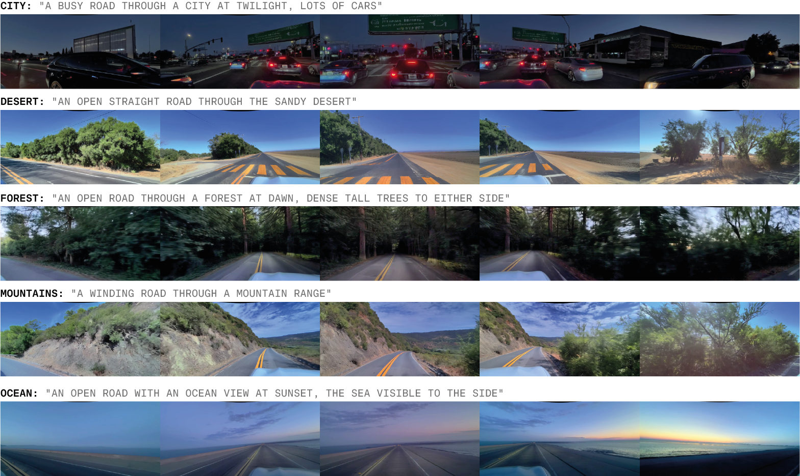

Figure 4: CLIP conditioning. Conditioning GAIA-2 generations with text prompts encoded through the CLIP text encoder provides nuanced control over environmental features.

##### Inference Tasks.

We consider four primary inference modes, each illustrating a distinct capability of the model:

- Generation from scratch involves sampling pure Gaussian noise and denoising them with guidance from conditioning variables defined in Section  [2.2.3](https://arxiv.org/html/2503.20523v1#S2.SS2.SSS3 "2.2.3 Conditioning ‣ 2.2 World Model ‣ 2 Model ‣ GAIA-2: A Controllable Multi-View Generative World Model for Autonomous Driving"). The resulting latents are then decoded to video frames using the video tokenizer decoder, with temporally consistent outputs produced via the rolling window decoding mechanism illustrated in Figure  [3](https://arxiv.org/html/2503.20523v1#S2.F3 "Figure 3 ‣ 2.1 Video Tokenizer ‣ 2 Model ‣ GAIA-2: A Controllable Multi-View Generative World Model for Autonomous Driving").
- Autoregressive prediction enables forecasting future latents from a sequence of past context latents. Given an initial context window of $k=3$ temporal latents, the model predicts the next set of latents, appends it to the context, and repeats the process using a sliding window. This approach allows for long-horizon rollouts while incorporating conditioning signals such as ego motion. An example is provided in Figure  [9](https://arxiv.org/html/2503.20523v1#S6.F9 "Figure 9 ‣ Generating Safety-Critical Scenarios. ‣ 6.1 Qualitative Examples ‣ 6 Results ‣ GAIA-2: A Controllable Multi-View Generative World Model for Autonomous Driving").
- Inpainting allows selective modification of video content. A spatial-temporal mask is applied to the latent input, and the masked regions are regenerated via conditional denoising. Optional guidance from dynamic agent conditioning (e.g., agent locations) can steer the generation within the masked area. An example is shown in  [Figure 12](https://arxiv.org/html/2503.20523v1#S6.F12 "In Inpainting. ‣ 6.1 Qualitative Examples ‣ 6 Results ‣ GAIA-2: A Controllable Multi-View Generative World Model for Autonomous Driving").
- Scene editing is achieved by partially noising latents extracted from real video, followed by denoising with altered conditioning. This enables targeted semantic or stylistic transformations—such as changing the weather, time of day, or road layout—without re-generating the full scene. [Figure 6](https://arxiv.org/html/2503.20523v1#S5.F6 "In Classifier-Free Guidance. ‣ 5 Inference ‣ GAIA-2: A Controllable Multi-View Generative World Model for Autonomous Driving") illustrates this capability.

저희는 모델의 주요 기능 네 가지를 고려했습니다. 각 기능은 모델의 고유한 능력을 보여줍니다.

- 무작위 생성(Generation from scratch)은 순수한 가우시안 노이즈를 샘플링하고, [2.2.3](https://arxiv.org/html/2503.20523v1#S2.SS2.SSS3 "2.2.3 Conditioning ‣ 2.1 Video Tokenizer ‣ 2 Model ‣ GAIA-2: A Controllable Multi-View Generative World Model for Autonomous Driving") 섹션에 정의된 조건 변수로부터 안내를 받아 노이즈를 제거합니다. 그 결과 생성된 잠재 벡터(latents)는 비디오 토크나이저 디코더를 사용하여 비디오 프레임으로 디코딩됩니다. 롤링 윈도우 디코딩 메커니즘(rolling window decoding mechanism) [3](https://arxiv.org/html/2503.20523v1#S2.F3 "Figure 3 ‣ 2.1 Video Tokenizer ‣ 2 Model ‣ GAIA-2: A Controllable Multi-View Generative World Model for Autonomous Driving")를 통해 시간적으로 일관된 출력이 생성됩니다.

- 자가 회귀적 예측(Autoregressive prediction)은 과거 컨텍스트 잠재 벡터(latent) 시퀀스로부터 미래 잠재 벡터를 예측합니다. 초기 컨텍스트 윈도우($k=3$)의 시간적 잠재 벡터 3개로 시작하여 모델은 다음 잠재 벡터 세트를 예측하고 컨텍스트에 추가하며 슬라이딩 윈도우(sliding window)를 사용하여 프로세스를 반복합니다. 이러한 접근 방식은 에고 모션(ego motion)과 같은 조건 변수로부터의 안내를 포함하면서 장기 롤아웃(rollout)을 가능하게 합니다. 예시는 [9](https://arxiv.org/html/2503.20523v1#S6.F9 "Figure 9 ‣ Generating Safety-Critical Scenarios. ‣ 6.1 Qualitative Examples ‣ 6 Results ‣ GAIA-2: A Controllable Multi-View Generative World Model for Autonomous Driving")에서 확인할 수 있습니다.

- 인페인팅(Inpainting)은 비디오 콘텐츠의 선택적 수정이 가능합니다. 잠재 벡터 입력에 공간-시간 마스크(spatial-temporal mask)를 적용하고 마스크된 영역은 조건적 노이즈 제거를 통해 재생성됩니다. 동적 에이전트 조건(dynamic agent conditioning, 예를 들어 에이전트 위치)로부터의 안내는 마스크된 영역 내에서의 생성 방향을 안내할 수 있습니다. 예시는 [12](https://arxiv.org/html/2503.20523v1#S6.F12 "In Inpainting. ‣ 6.1 Qualitative Examples ‣ 6 Results ‣ GAIA-2: A Controllable Multi-View Generative World Model for Autonomous Driving")에서 확인할 수 있습니다.

- 장면 편집(Scene editing)은 실제 비디오에서 추출한 잠재 벡터 부분적으로 노이즈를 적용한 다음 수정된 조건 변수를 사용하여 노이즈를 제거함으로써 달성됩니다. 이를 통해 날씨, 시간대 또는 도로 레이아웃을 변경하는 등 전체 장면을 재생성하지 않고도 표적 시맨틱(semantic) 또는 스타일(stylistic) 변환을 수행할 수 있습니다. [6](https://arxiv.org/html/2503.20523v1#S5.F6 "In Classifier-Free Guidance. ‣ 5 Inference ‣ GAIA-2: A Controllable Multi-View Generative World Model for Autonomous Driving")에서 이러한 기능이 설명되어 있습니다.

These modes demonstrate that GAIA-2 can serve as a general-purpose simulator for a wide variety of scene manipulation tasks, whether starting from noise, context, or existing video.

저희 GAIA-2는 다양한 장면 조작 작업에 활용될 수 있으며, 소음이나 맥락, 또는 기존 영상으로부터 시작하더라도 폭넓게 활용될 수 있습니다.

##### Inference Noise Schedule.

For all inference tasks, we adopt the linear-quadratic noise schedule introduced by [^20]. This schedule begins with linearly spaced noise levels, which are effective for capturing coarse scene layouts and motion patterns. In later stages, the schedule transitions to quadratically spaced steps that allow more efficient refinement of high-frequency visual details. This hybrid approach improves both generation quality and computational efficiency. In our experiments, we use a fixed number of 50 denoising steps.

모든 추론 작업에서 저희는 [^20]에서 제시된 선형-2차 노이즈 스케줄을 채택하고 있습니다. 이 스케줄은 대략적인 장면 구성과 움직임 패턴을 포착하는 데 효과적인 선형적으로 간격이 조정된 노이즈 레벨로 시작합니다. 이후 단계에서는 고주파 시각적 디테일을 보다 효율적으로 개선할 수 있도록 2차적으로 간격이 조정된 단계로 전환됩니다. 이러한 하이브리드 접근 방식은 생성 품질과 계산 효율성을 모두 향상시킵니다. 저희 실험에서는 고정된 50단계의 노이즈 제거 단계를 사용했습니다.

##### Classifier-Free Guidance.

Classifier-free guidance (CFG) is not used by default during inference. However, for challenging or out-of-distribution scenarios, such as those involving rare edge cases or unusual agent configurations (e.g., Figure [11](https://arxiv.org/html/2503.20523v1#S6.F11 "Figure 11 ‣ Generating Safety-Critical Scenarios. ‣ 6.1 Qualitative Examples ‣ 6 Results ‣ GAIA-2: A Controllable Multi-View Generative World Model for Autonomous Driving")), we activate CFG with a guidance scale ranging from 2 to 20, depending on the complexity of the scene.

기본적으로 추론 과정에서는 클래식-프리 가이드(Classifier-free guidance, CFG)가 활성화되어 있지 않습니다. 하지만, 드물거나 비정상적인 시나리오, 예를 들어 희귀한 특수한 경우나 특이한 에이전트 구성(예: Figure [11](https://arxiv.org/html/2503.20523v1#S6.F11 "Figure 11 ‣ Generating Safety-Critical Scenarios. ‣ 6.1 Qualitative Examples ‣ 6 Results ‣ GAIA-2: A Controllable Multi-View Generative World Model for Autonomous Driving"))와 같이 복잡한 장면의 경우, 장면의 복잡성에 따라 가이드 스케일(guidance scale)을 2에서 20 사이로 조정하여 CFG를 활성화합니다.

In scenarios involving dynamic agent conditioning, where the latent tokens associated with agent-specific regions are known a priori, we apply spatially selective CFG. In this case, guidance is applied only to the spatial locations influenced by the conditioning (e.g., 3D bounding boxes), which enhances generation quality in targeted regions without unnecessarily affecting the rest of the scene. This targeted approach enables more precise control over scene elements while preserving global coherence.

동적 에이전트 훈련 시나리오에서, 에이전트별 영역과 관련된 잠재 토큰이 사전에 알려져 있을 경우, 저희는 공간 선택적 CFG를 적용합니다. 구체적으로, 훈련된 영역에만 안내가 적용되어, 예를 들어 3D 바운딩 박스와 같이 특정 영역의 생성 품질을 향상시키고, 불필요하게 나머지 장면 전체에 영향을 주지 않습니다. 이러한 정밀한 접근 방식을 통해 장면의 구성 요소를 보다 정확하게 제어하면서 전반적인 일관성을 유지할 수 있습니다.

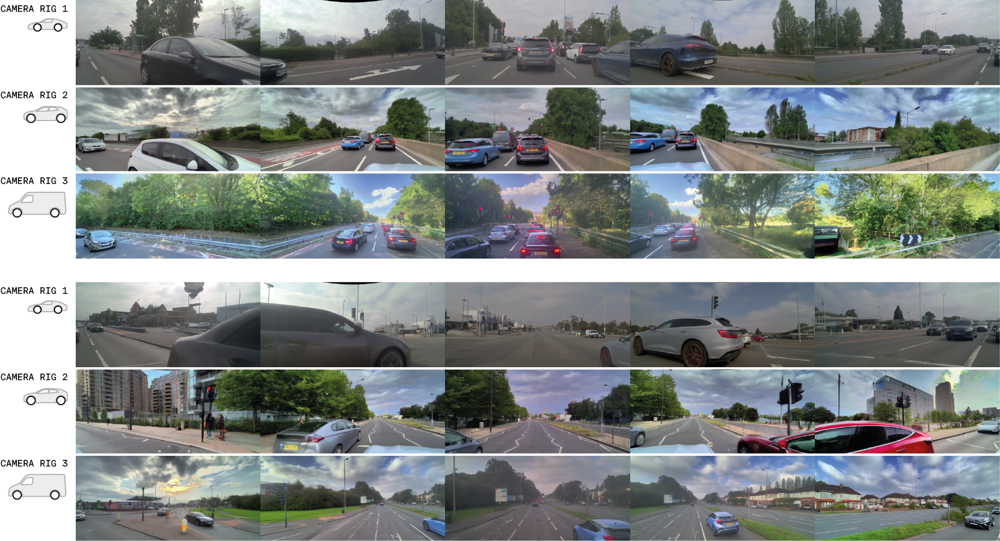

Figure 5: Multi-rig video generation. GAIA-2 supports various vehicle platforms and camera setups, maintaining spatial and temporal consistency. The two examples shown include camera arrangements from a sports car, an SUV, and a large van.

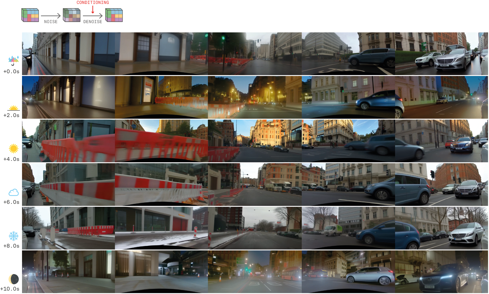

Figure 6: Augmentation through partial noising. By partially noising and denoising video frames, GAIA-2 transforms real video into diverse versions under different environmental settings, such as weather and time of day, while preserving semantic content and ego-actions.

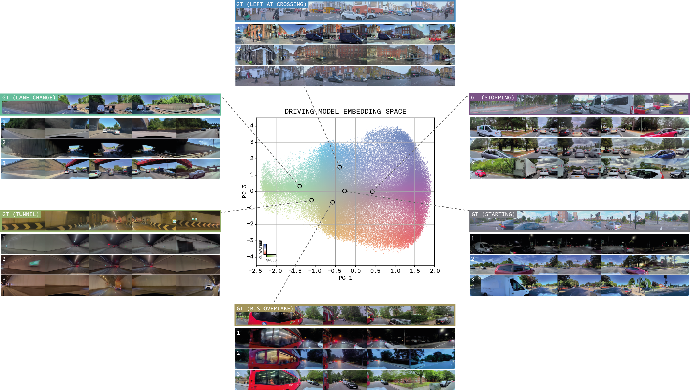
Figure 7:Scenario embedding conditioning. Scenario embeddings from a proprietary driving model enable GAIA-2 to generate diverse yet semantically consistent variations from real-world scenarios. For each scenario type the top row shows the real data the embedding is derived from, and the bottom three rows show synthetic variants of it, guided by the embedding as conditioning. We also optionally apply additional conditioning such as country, weather, time of day, or camera parameters to control diversity.

## 6 Results

We evaluate GAIA-2 through qualitative examples and quantitative metrics that highlight its generative fidelity, controllability, and suitability for synthetic data generation in autonomous driving. A comprehensive set of generated video examples is available at [https://wayve.ai/thinking/gaia-2](https://wayve.ai/thinking/gaia-2).

저희는 GAIA-2의 생성적 충실도, 제어 가능성, 그리고 자율 주행 분야의 합성 데이터 생성에 적합성을 강조하는 질적 예시와 정량적 지표를 통해 성능을 평가했습니다. 생성된 비디오 예시의 포괄적인 세트가 [https://wayve.ai/thinking/gaia-2](https://wayve.ai/thinking/gaia-2) 에서 이용해 보실 수 있습니다.

##### Augmenting Real-World Data.

GAIA-2 enables dataset augmentation through a range of techniques that allow for visual and contextual diversification of real-world sequences.

GAIA-2는 다양한 기술을 통해 실제 데이터 세트의 시각적 및 맥락적 다양성을 높여 데이터 증강을 가능하게 합니다.

### 6.1 Qualitative Examples

##### Diverse Scenario Generation.

GAIA-2 supports the generation of highly diverse driving scenarios, spanning multiple countries, weather conditions, times of day, and road layouts. In addition to structured conditioning via metadata, GAIA-2 can be guided by CLIP embeddings, allowing control over scene semantics not explicitly captured in labels. This includes geographic and environmental context such as urban, mountainous, or coastal scenes ([Figure 4](https://arxiv.org/html/2503.20523v1#S5.F4 "In 5 Inference ‣ GAIA-2: A Controllable Multi-View Generative World Model for Autonomous Driving")).

GAIA-2는 다수의 국가, 기상 조건, 시간대, 도로 레이아웃을 포괄하는 매우 다양한 주행 시나리오를 생성하는 데 활용될 수 있습니다. 메타데이터를 통한 구조화된 조건 설정 외에도, CLIP 임베딩을 통해 시나리오의 의미를 직접 레이블로 기록되지 않은 내용까지 제어할 수 있습니다. 예를 들어 도시, 산악, 해안 등 다양한 지리적 및 환경적 맥락을 포함한 시나리오를 제어할 수 있습니다 ([Figure 4](https://arxiv.org/html/2503.20523v1#S5.F4 "In 5 Inference ‣ GAIA-2: A Controllable Multi-View Generative World Model for Autonomous Driving")).

Furthermore, due to its exposure to varied camera configurations during training, GAIA-2 can simulate driving videos across different vehicle embodiments. By conditioning on camera parameters, it maintains spatial and temporal consistency across viewpoints for rigs mounted on sports cars, SUVs, and large vans ([Figure 5](https://arxiv.org/html/2503.20523v1#S5.F5 "In Classifier-Free Guidance. ‣ 5 Inference ‣ GAIA-2: A Controllable Multi-View Generative World Model for Autonomous Driving")).

- Partial noise and denoise: Latents derived from real videos are partially noised and then denoised under altered conditioning, such as different weather or lighting. This approach preserves semantics and ego motion while yielding diverse visual outputs (Figure [6](https://arxiv.org/html/2503.20523v1#S5.F6 "Figure 6 ‣ Classifier-Free Guidance. ‣ 5 Inference ‣ GAIA-2: A Controllable Multi-View Generative World Model for Autonomous Driving")). We demonstrate the ability to modify environmental aspects of the scene while leaving core semantic and functional components as per the original. Essentially turning a single real-world example into multiple new scenarios: the same ego trajectory but visually diversified to take place during sunshine, rain, at sunset, at night, and in the snow.
- Scenario embeddings: Scenario embeddings derived from our proprietary driving models give GAIA-2 the ability to generate multiple plausible variations from a single real-world example, providing many new examples of diverse yet contextually coherent synthetic data ([Figure 7](https://arxiv.org/html/2503.20523v1#S5.F7 "In Classifier-Free Guidance. ‣ 5 Inference ‣ GAIA-2: A Controllable Multi-View Generative World Model for Autonomous Driving")). Because the embedding space is meaningfully organized by the driving model, we are able to reliably generate scenarios that are semantically interpretable given their location in the embedding space, such as accelerating, decelerating, or overtaking other agents. By additionally conditioning on environmental factors, we can synthetically expand our dataset by increasing coverage across various conditions. By conditioning on different camera parameters, we can effectively replicate our corpus across any given vehicle platform.
- Action-based generation: GAIA-2 can synthesize new scenes purely from ego-vehicle action trajectories. Given the speed and curvature profiles, it generates plausible visual contexts aligned with those dynamics, such as traffic light changes, braking behavior, or turning maneuvers ([Figure 8](https://arxiv.org/html/2503.20523v1#S6.F8 "In Diverse Scenario Generation. ‣ 6.1 Qualitative Examples ‣ 6 Results ‣ GAIA-2: A Controllable Multi-View Generative World Model for Autonomous Driving")). We show three examples: (1) conditioning on a ‘ start from stopped ’ speed profile, GAIA-2 generates plausible visual observations to fit those actions, in this case, a UK traffic light turning from red and amber to green; (2) conditioning on a ‘ slow to a stop ’ speed trajectory, GAIA-2 generates a scenario where the ego agent is slowing down behind a London taxi; and (3) conditioned on a strong leftward curvature and slow ramping speed, GAIA-2 generates a U-turn at a US intersection.

저희 GAIA-2는 다양한 카메라 설정에 노출된 영상을 통해 여러 종류의 차량 시뮬레이션 영상을 생성할 수 있습니다. 카메라 파라미터에 따라 학습시키면, 스포츠카, SUV, 대형 트럭 등 다양한 차량 플랫폼에서 관점 간의 공간적, 시간적 일관성을 유지합니다 ([Figure 5](https://arxiv.org/html/2503.20523v1#S5.F5 "In Classifier-Free Guidance. ‣ 5 Inference ‣ GAIA-2: A Controllable Multi-View Generative World Model for Autonomous Driving")).

- 부분적인 소음 및 노이즈 제거: 실제 비디오에서 유도된 **레이턴트(Latent)**는 다양한 조건, 예를 들어 날씨나 조명 변화에 따라 부분적으로 소음이 추가된 후 노이즈 제거 과정을 거칩니다. 이 접근 방식은 핵심적인 의미 정보와 자율 주행을 위한 **에고 모션(Ego Motion)**을 보존하면서 다양한 시각적 결과물을 생성합니다 (**Figure 6** 참조: [https://arxiv.org/html/2503.20523v1#S5.F6](https://arxiv.org/html/2503.20523v1#S5.F6)). 실제 세계의 단일한 예시를 햇빛, 비, 석양, 밤, 눈 등 다양한 환경 조건에서 시각적으로 변화된 여러 새로운 시나리오로 변환하는 것을 보여드립니다. 핵심적인 의미와 기능적인 요소는 원본과 동일하게 유지하면서 말입니다.
- 저희의 독자적인 주행 모델로부터 파생된 시나리오 임베딩은 GAIA-2가 단일 실제 사례로부터 여러 개의 타당한 변형을 생성할 수 있도록 합니다. 이를 통해 다양한 맥락 속에서도 일관성 있는 합성 데이터를 다수 생성할 수 있습니다 ([Figure 7](https://arxiv.org/html/2503.20523v1#S5.F7 "In Classifier-Free Guidance. ‣ 5 Inference ‣ GAIA-2: A Controllable Multi-View Generative World Model for Autonomous Driving")). 특히, 주행 모델에 의해 의미 있게 구성된 임베딩 공간을 활용하여, 해당 위치에 따라 가속, 감속, 다른 차량을 추월하는 등 의미적으로 해석 가능한 시나리오를 신뢰성 있게 생성할 수 있습니다. 또한, 환경 요인을 추가적으로 고려함으로써, 다양한 조건에 대한 데이터 커버리지를 확장할 수 있습니다. 마지막으로, 카메라 파라미터를 조건화하여, 특정 차량 플랫폼에 대한 코퍼스를 효과적으로 재현할 수 있습니다.
- GAIA-2는 운전자의 행동 경로만을 기반으로 완전히 새로운 장면을 합성할 수 있습니다. 속도와 곡선 프로필을 고려하여, 해당 동역학에 부합하는 현실적이고 자연스러운 시각적 맥락을 생성합니다. 예를 들어, 신호등 변화, 브레이크 작동, 회전 조작 등의 상황을 만들어냅니다 ([Figure 8](https://arxiv.org/html/2503.20523v1#S6.F8 "In Diverse Scenario Generation. ‣ 6.1 Qualitative Examples ‣ 6 Results ‣ GAIA-2: A Controllable Multi-View Generative World Model for Autonomous Driving")). 다음 세 가지 예시를 보여드리겠습니다. 첫째, ‘정차 후 출발’ 속도 프로필을 조건으로 설정하면, GAIA-2는 해당 행동에 맞는 현실적인 시각적 관찰을 생성합니다. 이 경우, 영국 신호등이 빨주오색으로 바뀌는 장면을 보여줍니다. 둘째, ‘느리게 정차’ 속도 경로를 조건으로 설정하면, GAIA-2는 자율주행차가 런던 택시를 따라 느리게 감속하는 시나리오를 생성합니다. 셋째, 강한 왼쪽으로 향하는 곡률과 느린 가속 속도를 조건으로 설정하면, GAIA-2는 미국 교차로에서 U턴을 수행하는 장면을 생성합니다.

Figure 8: Action-based generation. GAIA-2 synthesizes diverse scenes from specified speed and curvature profiles. Each scenario is contextually plausible, despite the original video inputs being dropped out.

##### Generating Safety-Critical Scenarios.

GAIA-2 is able to generate rare but safety-critical scenarios that would otherwise occur infrequently in the real world. We consider two classes of safety-critical situations: those caused by the ego agent, and those caused by other agents.

- Ego-vehicle induced scenarios: By conditioning on extreme or unsafe ego-vehicle actions (e.g., abrupt steering into oncoming traffic), GAIA-2 generates realistic scenarios critical to testing autonomous system resilience under hazardous conditions ([Figure 9](https://arxiv.org/html/2503.20523v1#S6.F9 "In Generating Safety-Critical Scenarios. ‣ 6.1 Qualitative Examples ‣ 6 Results ‣ GAIA-2: A Controllable Multi-View Generative World Model for Autonomous Driving") and [Figure 10](https://arxiv.org/html/2503.20523v1#S6.F10 "In Generating Safety-Critical Scenarios. ‣ 6.1 Qualitative Examples ‣ 6 Results ‣ GAIA-2: A Controllable Multi-View Generative World Model for Autonomous Driving")).
- Other-agent induced scenarios: Using 3D bounding boxes conditioning, GAIA-2 precisely controls the placement and motion of other agents, creating scenarios involving aggressive driving behaviors, emergency braking, or hazardous crossings, crucial for testing reactive capabilities of autonomous systems ([Figure 11](https://arxiv.org/html/2503.20523v1#S6.F11 "In Generating Safety-Critical Scenarios. ‣ 6.1 Qualitative Examples ‣ 6 Results ‣ GAIA-2: A Controllable Multi-View Generative World Model for Autonomous Driving")).

GAIA-2는 실제 세계에서 드물게 발생하는, 하지만 매우 중요한 안전상 위기 상황을 생성할 수 있습니다. 저희는 크게 두 가지 유형의 안전상 위기 상황을 고려합니다. 첫째, 자율주행 차량의 극단적이거나 위험한 행동(예: 갑작스러운 차선 변경)을 기반으로 생성되는 상황이며, 둘째, 다른 차량과의 상호작용을 통해 발생하는 상황입니다.

- 자율주행 차량 유도 시나리오: GAIA-2는 극단적이거나 위험한 자율주행 차량의 행동(예: 마주 오는 차량으로 갑작스러운 차선 변경)을 조건으로 설정하여, 자율주행 시스템의 위험한 조건 하에서의 회복탄력성을 테스트하는 데 필수적인 현실적인 시나리오를 생성합니다 ([Figure 9](https://arxiv.org/html/2503.20523v1#S6.F9 "In Generating Safety-Critical Scenarios. ‣ 6.1 Qualitative Examples ‣ 6 Results ‣ GAIA-2: A Controllable Multi-View Generative World Model for Autonomous Driving")).
- 다른 차량 유도 시나리오: 3D 바운딩 박스 기반 조건 설정 방식을 통해 GAIA-2는 다른 차량의 위치와 움직임을 정밀하게 제어하여, 공격적인 운전 행동, 긴급 제동, 위험한 교차 등 반응성 테스트에 중요한 시나리오를 생성합니다 ([Figure 11](https://arxiv.org/html/2503.20523v1#S6.F11 "In Generating Safety-Critical Scenarios. ‣ 6.1 Qualitative Examples ‣ 6 Results ‣ GAIA-2: A Controllable Multi-View Generative World Model for Autonomous Driving")).

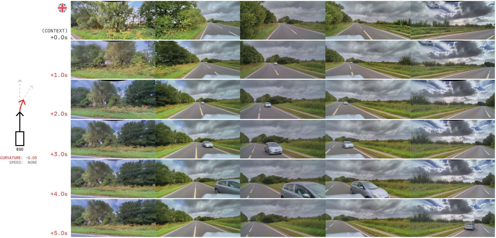

Figure 9: Ego-induced safety-critical scenarios. By applying unsafe action conditioning, GAIA-2 can generate hazardous situations, such as steering into oncoming traffic. We provide real video frames as context and GAIA-2 rolls out from these starting frames given some new action conditioning. In this example, we control the ego vehicle steering by conditioning on rightward curvature. We drop out speed so that GAIA-2 can generate multiple diverse outcomes. Note how the ego vehicle slows down while veering sharply into oncoming traffic. The oncoming vehicle swerves to avoid the ego vehicle.

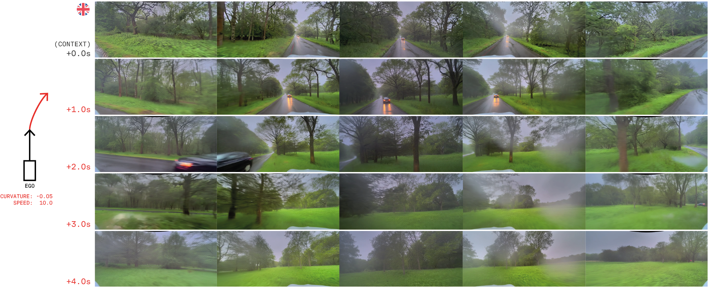
Figure 10:Extreme generalization behavior. When conditioned on high speed and strong curvature, GAIA-2 extrapolates off-road trajectories, capturing rare behaviors like driving into fields or forests.

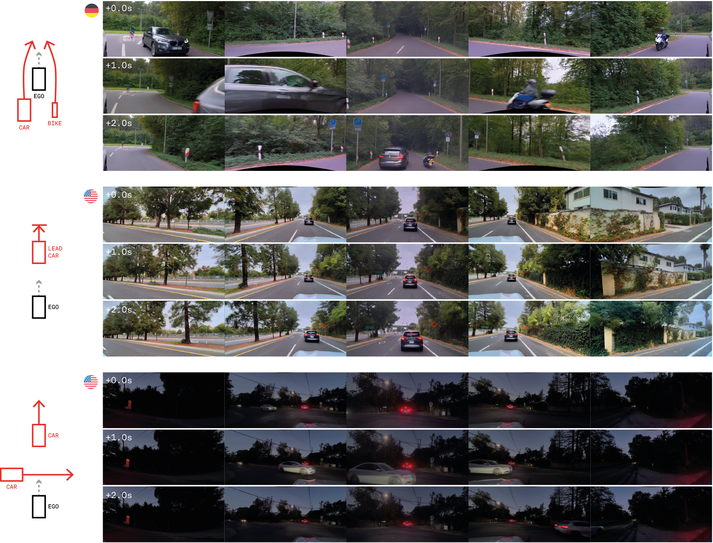

Figure 11: Other-agent induced safety-critical scenarios. 3D bounding box conditioning enables fine control over dynamic agents, allowing simulation of risky behaviors such as sudden braking, overtaking, or speeding through intersections.

##### Inpainting.

GAIA-2 supports spatial-temporal inpainting, enabling selective content editing. When provided with masked regions and corresponding agent-level conditioning, GAIA-2 inserts agents seamlessly into existing contexts without disrupting unrelated areas ([Figure 12](https://arxiv.org/html/2503.20523v1#S6.F12 "In Inpainting. ‣ 6.1 Qualitative Examples ‣ 6 Results ‣ GAIA-2: A Controllable Multi-View Generative World Model for Autonomous Driving")).

GAIA-2는 공간-시간 보간(spatial-temporal inpainting)을 지원하여 선택적인 콘텐츠 편집을 가능하게 합니다. 마스크 처리된 영역과 해당 에이전트 레벨의 조건부 정보를 제공받으면, GAIA-2는 기존 맥락에 에이전트를 원활하게 삽입하여 관련 없는 영역을 방해하지 않습니다 ([Figure 12](https://arxiv.org/html/2503.20523v1#S6.F12 "In Inpainting. ‣ 6.1 Qualitative Examples ‣ 6 Results ‣ GAIA-2: A Controllable Multi-View Generative World Model for Autonomous Driving")).

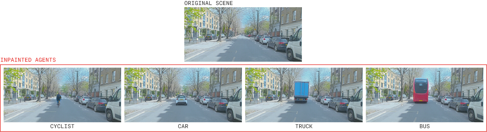

Figure 12: Agent inpainting. GAIA-2 can insert dynamic agents into masked regions of a video, guided by 3D bounding box conditioning. Background consistency and semantic realism are preserved.

These qualitative results highlight GAIA-2’s ability to perform fine-grained and controllable video generation, supporting its use in scalable simulation and diverse scenario creation for autonomous systems.

저희 GAIA-2는 미세한 수준에서 정교하고 제어 가능한 비디오 생성 능력을 보여주어, 확장 가능한 시뮬레이션과 다양한 시나리오 생성에 활용될 수 있음을 시사합니다.

### 6.2 Metrics

To quantitatively evaluate GAIA-2, we use a suite of metrics that assess visual fidelity, temporal consistency, and conditioning accuracy.

GAIA-2를 정량적으로 평가하기 위해, 시각적 충실도, 시간적 일관성, 그리고 조건부 정확성을 평가하는 다양한 지표들을 활용하고 있습니다.

##### Visual Fidelity.

Similarly to [^27], we use the Frechet DINO Distance (FDD) and Frechet Inception Distance (FID) [^28] to measure the distance between the distributions of generated and real videos. The feature encoder is DINOv2 [^14] ViT-L/14, and the input images are bilinearly rescaled to a higher resolution $448\times 952$ compared to $299\times 299$ for InceptionV3 [^29] in FID. We observe that FDD is less noisy than FID and saturates much later in training.

[^27]과 마찬가지로, 생성된 영상과 실제 영상의 분포 간의 거리를 측정하기 위해 프레케 DINO 거리(FDD)와 프레케 인ception 거리(FID)를 사용합니다. 특징 인코더는 DINOv2[^14] ViT-L/14이며, 입력 이미지는 FID에서 InceptionV3[^29]의 299x299보다 더 높은 해상도인 448x952로 이진 보간법을 통해 resized됩니다. FDD는 FID보다 노이즈가 덜하고 훈련이 훨씬 늦게 포화되는 현상을 관찰했습니다.

##### Temporal Consistency.

To evaluate the temporal consistency of the world model, we use the Frechet Video Motion Distance (FVMD) [^30]. This metric compares distributions of explicit key-point motion features for generated and ground-truth videos. We find this metric to be more aligned with human preferences for temporal consistency compared to FVD [^31].

세계 모델의 시간적 일관성을 평가하기 위해 Frechet Video Motion Distance (FVMD) [^30]를 사용합니다. 이 지표는 생성된 영상과 실제 영상의 명시적인 키포인트 움직임 특징 분포를 비교합니다. FVD [^31]에 비해 인간의 시간적 일관성 선호도와 더 일치하는 것을 확인했습니다.

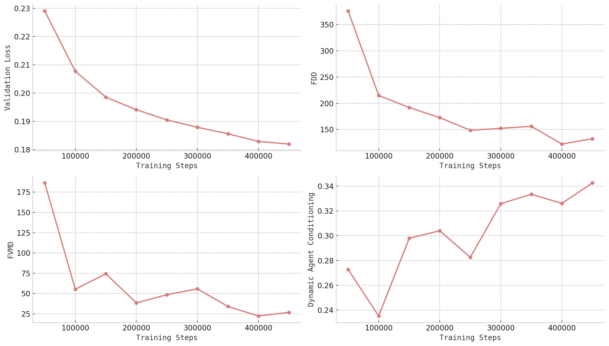

Figure 13: Validation loss and other metrics (evaluated on n = 1024 𝑛 n=1024 italic\_n = 1024 samples). We found that the validation loss correlates well with human perceptual preferences.

##### Dynamic Agent Conditioning.

We evaluate dynamic agent fidelity by comparing the projection of the 3D bounding boxes (our conditional signal) with segmentation masks obtained via OneFormer [^32] on the generated video. We then compute class-based Intersection-over-Union (IoU) to measure how well the model adheres to the spatial and categorical specifications of dynamic agents during generation.

저희는 생성된 비디오에서 OneFormer[^32]를 통해 얻은 세그멘테이션 마스크와 3D 바운딩 박스의 투영을 비교하여 동적 에이전트의 충실도를 평가합니다. 이를 통해 모델이 동적 에이전트의 공간적, 범주적 제약 조건에 얼마나 잘 부합하는지 클래스 기반 Intersection-over-Union (IoU)을 계산하여 측정합니다.

We report the metrics and the validation loss in [Figure 13](https://arxiv.org/html/2503.20523v1#S6.F13 "In Temporal Consistency. ‣ 6.2 Metrics ‣ 6 Results ‣ GAIA-2: A Controllable Multi-View Generative World Model for Autonomous Driving"). The validation loss and other metrics are evaluated on the generation from scratch task with $n=1024$ samples. Despite some noise from small sample size, all metrics exhibit a positive trend throughout training. Notably, the validation loss shows the strongest correlation with human preference, making it a valuable proxy for perceptual quality.

저희는 [Figure 13](https://arxiv.org/html/2503.20523v1#S6.F13 "In Temporal Consistency. ‣ 6.2 Metrics ‣ 6 Results ‣ GAIA-2: A Controllable Multi-View Generative World Model for Autonomous Driving")에 제시된 지표와 검증 손실을 보고드립니다. 검증 손실 및 기타 지표는 $n=1024$ 샘플을 사용하여 처음부터 생성하는 작업에서 평가되었습니다. 소규모 샘플로 인해 약간의 노이즈가 존재하지만, 모든 지표는 훈련 과정 전반에 걸쳐 긍정적인 추세를 보입니다. 특히, 검증 손실은 인간 선호도와 가장 강한 상관관계를 보여주어 인지 품질에 대한 유용한 지표로 활용될 수 있습니다.

## 7 Related Work

##### Video Generative Models.

Recent advancements in video generative models have mainly been driven by models that leverage latent representations derived through dimensionality reduction. These representations can be either continuous [^1] or quantized [^3], and the success of video generation heavily depends on how efficiently these representations capture spatiotemporal information. One of the key challenges lies in ensuring that the mappings to and from latent space preserve both visual fidelity and semantic coherence. While scaling to large datasets improves generalization [^2], challenges remain in preserving both visual realism and temporal consistency.

최근 비디오 생성 모델 분야의 발전은 차원 축소를 통해 얻은 잠재 표현(latent representation)을 활용하는 모델들에 의해 주도되고 있습니다. 이러한 표현은 연속적인 형태[^1] 또는 양자화된 형태[^3]일 수 있으며, 비디오 생성의 성공은 이러한 표현이 공간적-시간적 정보를 얼마나 효율적으로 포착하는지에 크게 의존합니다. 핵심적인 과제는 잠재 공간(latent space)으로의 매핑이 시각적 정확성과 의미적 일관성을 모두 보존하는지 확인하는 데 있습니다. 대규모 데이터셋으로 확장하여 일반화 성능을 향상시키는 것은 유용하지만, 시각적 현실감과 시간적 일관성을 모두 유지하는 데는 여전히 어려움이 남아있습니다.

Autoregressive and masked generative models using quantized tokens have demonstrated strong modeling of temporal dependencies and motion dynamics [^34]. However, their sequential generation processes lead to slow inference and error accumulation, which can limit their scalability for long sequences or complex multi-agent scenes. In contrast, latent diffusion models offer a more parallelizable alternative, using iterative denoising to generate full video sequences. These models, including Stable Video Diffusion [^43], DIAMOND [^44], Sora [^45], MovieGen [^20], Gen-3 [^46], and Cosmos [^2], have achieved impressive quality on text-to-video and image-to-video tasks, especially in open-domain settings.

양자화된 토큰을 사용하는 자가 회귀 모델 및 마스킹 생성 모델은 시간적 의존성과 운동 역학을 효과적으로 모델링하는 것으로 나타났습니다 [^34]. 그러나 이러한 순차적 생성 프로세스는 느린 추론 속도와 오류 누적을 초래하여 긴 시퀀스 또는 복잡한 다중 에이전트 장면의 확장성에 제한을 둡니다. 이에 반해 잠재 확산 모델은 반복적인 노이즈 제거를 통해 전체 비디오 시퀀스를 생성하는 보다 병렬화 가능한 대안을 제공합니다. 이러한 모델, 즉 Stable Video Diffusion [^43], DIAMOND [^44], Sora [^45], MovieGen [^20], Gen-3 [^46], 그리고 Cosmos [^2]는 특히 개방형 환경에서 텍스트-투-비디오 및 이미지-투-비디오 작업에서 뛰어난 품질을 달성했습니다.

However, most of these works prioritize visual aesthetics and domain-agnostic generation, offering limited support for structured control over scene elements or agent behavior. This makes them less suitable for applications (such as autonomous driving) that require precise, semantic, and multi-modal scene control across space and time. In this context, GAIA-2 aims to bridge the gap between high-fidelity generation and domain-specific controllability required for safety-critical systems.

하지만 이러한 대부분의 작업들은 시각적 미적 감각과 영역 무관한 생성에 우선순위를 두고 있어, 장면 요소나 에이전트 행동에 대한 구조화된 제어에 대한 제한적인 지원을 제공합니다. 따라서 자율 주행과 같이 공간과 시간에 걸쳐 정확하고, 의미 있고, 다중 모달 방식으로 장면을 정밀하게 제어해야 하는 애플리케이션에는 적합하지 않습니다. 이러한 맥락에서 GAIA-2는 안전 관련 시스템에 필요한 고품질 생성 능력과 영역별 제어 가능성 사이의 격차를 좁히는 데 목표를 두고 있습니다.

##### Generative World Models in Autonomous Driving.

Unlike general-purpose video generation, generative world models for autonomous driving must satisfy stricter requirements: multi-agent interaction, ego-motion control, environmental diversity, and multi-camera coherence. Early work in this space includes GAIA-1 [^5], which introduced text and ego action conditioning in a discrete world model with a video diffusion decoder to improve temporal consistency. CommaVQ [^47] similarly leveraged a causal transformer on discrete tokens for ego-motion control. Although these methods took important steps toward controllability, they often targeted single-camera settings and partial controllability via action or text conditioning, limiting their applicability to comprehensive driving simulations.

일반적인 영상 생성 모델과는 달리, 자율 주행을 위한 생성적 세계 모델은 더욱 엄격한 요구 사항을 충족해야 합니다. 즉, 다중 에이전트 상호 작용, 자율 주행 방향 제어, 환경 다양성, 그리고 다중 카메라 일관성을 만족해야 합니다. 이 분야의 초기 연구로는 GAIA-1[^5]가 있으며, 이 연구에서는 비디오 확산 디코더를 사용하여 이산적인 세계 모델에서 텍스트와 자율 주행 동작 제어 조건을 도입하여 시간적 일관성을 향상시켰습니다. CommaVQ[^47] 역시 이산 토큰에 대한 인과적 트랜스포머를 활용하여 자율 주행 방향 제어를 수행했습니다. 이러한 방법들은 제어 가능성을 향한 중요한 발걸음을 딛고섰지만, 종종 단일 카메라 환경이나 동작 또는 텍스트 조건화를 통해 부분적인 제어에만 초점을 맞추어, 포괄적인 주행 시뮬레이션에 적용하는 데 제한이 있었습니다.

Subsequent approaches adopted latent diffusion for higher fidelity generation and introduced more flexible control. DriveDreamer [^6] adopts a latent diffusion model conditioned on 3D bounding boxes, HD maps, and ego actions, and further incorporates an action decoder to predict future ego actions. Drive-WM [^7] extends this approach to a multi-camera setting (up to six cameras surrounding the ego vehicle) and introduces controllability over ego actions, dynamic agents, and environmental conditions, such as weather and lighting. UniMLVG [^48] similarly enables multi-view generation conditioned on text, camera parameters, 3D bounding boxes, and HD maps, while MaskGWM [^49] extends UniMLVG to support longer video generations. Vista [^8] employs latent diffusion for generating high-resolution, long-duration videos, and Delphi [^50] uses a data-driven approach to guide video generation toward failure cases in driving models, thereby improving the synthetic data’s training utility. More recently, GEM [^51] further generalizes scene control to include ego motion, object dynamics, and even human poses, suggesting broader applicability across domains such as human motion synthesis and drone navigation. A recent line of work has explored 4D geometry-aware generation. DriveDreamer4D [^9] uses video generative models to synthesize videos along novel trajectories and combines real and generated footage to optimize a 4D Gaussian Splatting model for closed-loop simulation. Similarly, DreamDrive [^52] leverages generative priors to construct high-quality 4D scenes from in-the-wild driving data.

이후 개발된 접근 방식들은 더욱 높은 수준의 품질을 위한 잠재 공간 확산 모델을 채택하고, 보다 유연한 제어 기능을 도입했습니다. DriveDreamer[^6]는 3D 바운딩 박스, HD 맵, 그리고 자율 주행 차량의 행동을 조건으로 잠재 공간 확산 모델을 활용하며, 미래 자율 주행 차량의 행동을 예측하기 위한 행동 디코더를 추가적으로 통합합니다. Drive-WM[^7]는 이 접근 방식을 다중 카메라 환경(자율 주행 차량 주위 최대 6대의 카메라)로 확장하고, 자율 주행 차량의 행동, 동적 에이전트, 그리고 날씨 및 조명과 같은 환경 조건에 대한 제어 가능성을 도입했습니다. UniMLVG[^48]는 텍스트, 카메라 파라미터, 3D 바운딩 박스, HD 맵을 조건으로 다중 뷰 생성 기능을 지원하는 동시에, MaskGWM[^49]은 UniMLVG를 확장하여 더 긴 영상 생성 기능을 지원합니다. Vista[^8]는 고해상도, 장시간 영상 생성을 위해 잠재 공간 확산 모델을 활용하며, Delphi[^50]은 운전 모델의 실패 사례를 중심으로 영상 생성 과정을 안내하기 위한 데이터 기반 접근 방식을 사용하여 합성 데이터의 학습 유용성을 향상시킵니다. 최근에는 GEM[^51]이 자율 주행 차량의 움직임, 객체의 동역학, 심지어 인간의 자세까지 포함하여 장면 제어 기능을 더욱 일반화하여 인간 움직임 합성 및 드론 내비게이션과 같은 다양한 분야에 적용될 수 있는 가능성을 제시했습니다. 최근 연구에서는 4D 기하학 정보를 활용한 생성 방식에 대한 연구가 진행되고 있습니다. DriveDreamer4D[^9]는 새로운 경로를 따라 영상을 합성하기 위해 영상 생성 모델을 사용하며, 실제 영상과 생성된 영상을 결합하여 폐쇄 루프 시뮬레이션을 위한 4D 가우시안 스플래트닝 모델을 최적화합니다. 유사하게, DreamDrive[^52]는 실제 주행 데이터로부터 고품질의 4D 장면을 구성하기 위해 생성적 우선 순위를 활용합니다.

Despite these advancements, most of these solutions only address subsets of the requirements for realistic driving simulation. Some are limited to single-camera settings, others lack structured agent-level control, and few integrate multi-view generation and agent-level semantics into a single framework. Additionally, many do not support fine-grained editing tasks such as inpainting or targeted scene modification, essential for data augmentation and scenario variation in simulation loops.

최근 이러한 기술 발전에도 불구하고, 대부분의 솔루션은 현실적인 운전 시뮬레이션에 필요한 요구 사항의 일부만을 해결합니다. 어떤 솔루션은 단일 카메라 설정에만 제한되는 경우가 있으며, 다른 솔루션은 에이전트 수준의 구조화된 제어 기능을 제공하지 않거나, 다중 뷰 생성 및 에이전트 수준의 의미론을 단일 프레임워크에 통합하지 못하는 경우가 많습니다. 게다가, 많은 솔루션은 인페인팅이나 특정 장면 수정과 같은 세밀한 편집 작업을 지원하지 않아도 되는데, 이는 시뮬레이션 루프 내에서 데이터 증강 및 시나리오 다양성을 위한 핵심적인 요소입니다.

Motivated by these limitations, GAIA-2 is designed as a unified latent diffusion framework that brings together:

- multi-camera generation (up to five views);
- structured and semantic conditioning over ego action, dynamic agents, and scene-level metadata;
- flexible inference modes, including generation from scratch, inpainting, scene editing, and long-horizon rollouts; and
- support for external latent spaces like CLIP and driving scenario embeddings.

이러한 한계점을 고려하여 GAIA-2는 다음과 같은 기능을 통합한 단일 잠재 확산 프레임워크로 설계되었습니다.

- 최대 다섯 개의 뷰를 생성하는 다중 카메라 기능
- 자아 행동, 동적 에이전트, 장면 수준 메타데이터에 대한 구조화 및 의미 기반 조건화
- 생성부터 시작, 인페인팅, 장면 편집, 장기 롤아웃 등 유연한 추론 모드 지원
- CLIP 및 드라이빙 시나리오 임베딩과 같은 외부 잠재 공간 지원

By combining continuous latent representations with large-scale training on a geographically and environmentally diverse dataset, GAIA-2 delivers both visual fidelity and scenario controllability. It fills a critical gap between general-purpose diffusion models and the domain-specific needs of autonomous driving, namely, the ability to simulate realistic, controllable, multi-view driving scenes for robust, scalable training and evaluation.

지리적, 환경적 다양성이 풍부한 데이터셋을 활용하여 지속적인 잠재 표현과 결합된 GAIA-2는 뛰어난 시각적 품질과 시나리오 제어 기능을 제공합니다. 이는 일반적인 확산 모델과 자율 주행의 특정 요구 사이의 중요한 격차를 메우는 역할을 합니다. 즉, 견고하고 확장 가능한 학습 및 평가를 위해 현실적이고 제어 가능한 다중 뷰 주행 장면을 시뮬레이션할 수 있는 능력을 제공합니다.

## 8 Conclusions and Future Work

We presented GAIA-2, a domain-specialized latent diffusion model for video generation, designed to meet the diverse and exacting requirements of simulation in autonomous driving. GAIA-2 sets a new benchmark in generative world modeling by unifying multi-camera coherence, structured semantic conditioning, and fine-grained control within a scalable architecture. The model supports controllable generation conditioned on ego-vehicle dynamics, environmental features, road layout, and dynamic agents, while maintaining spatial and temporal consistency across up to five camera views.

저희는 자율 주행 시뮬레이션의 다양한 요구사항과 까다로운 기준을 충족하도록 설계된, 비디오 생성에 특화된 잠재 확산 모델인 GAIA-2를 소개하게 되었습니다. GAIA-2는 다중 카메라 일관성, 구조화된 의미 조건부, 확장 가능한 아키텍처 내 미세한 제어 기능을 통합하여 생성 세계 모델링의 새로운 기준을 제시합니다. 이 모델은 자율 주행 차량의 동역학, 환경 특징, 도로 레이아웃, 그리고 동적 에이전트 등을 조건으로 하여, 최대 5개의 카메라 뷰를 통해 공간적, 시간적 일관성을 유지하면서 제어 가능한 생성을 지원합니다. 

The architecture combines a space-time factorized latent diffusion world model with a compact and semantically meaningful video tokenizer, enabling high-fidelity generation across diverse driving environments. GAIA-2 supports multiple inference modes—including generation from scratch, autoregressive rollouts, spatial inpainting, and real-scene editing—each empowering systematic exploration of the driving scene space. The model excels at producing typical as well as rare safety-critical scenarios, thus significantly enhancing data diversity, scenario coverage, and validation rigor in autonomous driving systems.

저희 GAIA-2는 공간-시간 요인 분해된 잠재 확산 세계 모델과, 간결하면서도 의미 있는 비디오 토크나이저를 결합하여, 다양한 주행 환경에서 고품질의 결과물을 생성할 수 있도록 설계되었습니다. GAIA-2는 생성부터 시작, 자가 회귀 롤아웃, 공간 인페인팅, 실시간 장면 편집 등 다양한 추론 모드를 지원하며, 각 모드는 주행 장면 공간에 대한 체계적인 탐색을 가능하게 합니다. 특히, 일반적인 상황뿐만 아니라 드물지만 안전에 중요한 상황까지 훌륭하게 생성할 수 있어, 자율 주행 시스템의 데이터 다양성, 시나리오 커버리지, 그리고 검증의 엄밀성을 크게 향상시킵니다. 

By scaling controllability and scene diversity in simulation, GAIA-2 bridges the gap between real-world data limitations and the increasing demands of training and evaluating robust AI-driving models. In doing so, it serves as a powerful tool for accelerating iteration cycles, improving generalization to out-of-distribution conditions, and stress-testing AI agents across complex, long-tail scenarios.

시뮬레이션에서 제어 가능성과 장면 다양성을 확장함으로써 GAIA-2는 실제 데이터의 한계와 강력한 AI 자율주행 모델을 훈련하고 평가하는 증가하는 요구 사이의 격차를 좁혀 드립니다. 이를 통해 복잡하고 긴 꼬리 분포 시나리오에서 AI 에이전트의 성능을 가속화하고, 일반화 능력을 향상시키며, 스트레스 테스트를 수행하는 데 강력한 도구로 활용될 수 있습니다.

##### Future Work.

While GAIA-2 represents a significant step forward, several research directions remain open and will guide future iterations of this work: (i) Like all generative models, GAIA-2 occasionally produces temporal or semantic inconsistencies, particularly in long-horizon or complex scenarios. Improving the reliability and consistency of video generation through better failure detection, refinement models, or constraint-aware sampling is a key challenge. (ii) Although GAIA-2 enables parallelized generation, real-time or near-real-time video synthesis remains computationally intensive. Future work will explore model distillation, efficient transformer variants, and inference-time acceleration techniques to improve deployment feasibility in real-world pipelines. (iii) Despite supporting a rich set of conditionings, new efforts will target richer agent behavior modeling, more nuanced environmental conditions, and open-ended natural language control. Further enrichment of the training dataset with rare and safety-critical events—especially those involving human agents, complex infrastructure, or social interactions—will push the boundaries of realistic simulation.

GAIA-2는 괄목할 만한 진전을 보여주지만, 여전히 해결해야 할 연구 방향들이 남아 있으며, 향후 이 연구의 발전 방향을 제시할 것입니다. 구체적으로는 다음과 같습니다.

(i) 모든 생성 모델과 마찬가지로, GAIA-2는 특히 장기적 또는 복잡한 시나리오에서 시간적 또는 의미적 일관성 부족 현상을 간혹 보일 수 있습니다. 더욱 신뢰할 수 있고 일관성 있는 비디오 생성 기술을 확보하기 위해, 오류 탐지 개선, 정제 모델 개발, 또는 제약 조건에 유의하는 샘플링 방법을 연구하는 것이 중요한 과제입니다.

(ii) GAIA-2는 병렬 생성 기능을 지원하지만, 실시간 또는 거의 실시간 비디오 합성에는 여전히 상당한 컴퓨팅 자원이 필요합니다. 향후 연구에서는 모델 압축, 효율적인 트랜스포머 변형, 그리고 추론 시간 가속화 기술 등을 탐구하여 실제 파이프라인에서의 배포 가능성을 높이는 데 주력할 것입니다.

(iii) 다양한 조건부 지원을 제공하는 것 외에도, 새로운 노력은 더욱 풍부한 에이전트 행동 모델링, 미묘한 환경 조건, 그리고 개방형 자연어 제어에 초점을 맞추어 진행될 것입니다. 특히, 인간 에이전트, 복잡한 인프라, 또는 사회적 상호 작용이 포함된 희귀하고 안전에 중요한 이벤트들을 학습 데이터에 추가함으로써, 더욱 현실적인 시뮬레이션의 한계를 확장할 수 있을 것입니다.

Together, these directions will ensure that GAIA-2 and its successors continue to advance the role of generative models as core infrastructure in the development of safe, robust, and generalizable autonomous systems.

저희는 이 지침들을 통해 GAIA-2와 그 후속 모델들이 안전하고, 견고하며, 일반화된 자율 시스템 개발의 핵심 인프라로서의 역할을 지속적으로 발전시킬 수 있도록 지원할 것입니다.

## Acknowledgments and Disclosure of Funding

The authors would like to thank and acknowledge the many individuals whose invaluable contributions made this work possible: Alex Persin, Ana-Maria Marcu, Aniruddha Kembhavi, Benoit Hanotte, Evgenii Kashin, Francesca Iovu, Giacomo Gallino, Giulio D’Ippolito, Jeremy Plassmann, Lorenzo von Ritter, Mohamed Nabil, Nikhil Mohan, Oleh Chernov, Pragya Kale, Remi Tachet, Rudi Rankin, Sahana Vankatesh, Sarah Belghiti, Sofía Dudas, Tilly Pielichaty, Vassia Simaiaki, Victor Delépine, Vincent Micheli, Zak Murez.

## References

[^1]: D. P. Kingma and M. Welling.Auto-encoding variational bayes.*Proceedings of the International Conference on Learning Representations (ICLR)*, 2014.

[^2]: N. Agarwal, A. Ali, M. Bala, Y. Balaji, E. Barker, T. Cai, P. Chattopadhyay, Y. Chen, Y. Cui, Y. Ding, et al.Cosmos world foundation model platform for physical ai.*arXiv preprint arXiv:2501.03575*, 2025.

[^3]: A. van den Oord, O. Vinyals, and K. Kavukcuoglu.Neural discrete representation learning.In *Advances in Neural Information Processing Systems (NeurIPS)*, 2017.

[^4]: P. Esser, R. Rombach, and B. Ommer.Taming transformers for high-resolution image synthesis.In *Proceedings of the IEEE Conference on Computer Vision and Pattern Recognition (CVPR)*, 2021.

[^5]: A. Hu, L. Russell, H. Yeo, Z. Murez, G. Fedoseev, A. Kendall, J. Shotton, and G. Corrado.Gaia-1: A generative world model for autonomous driving.*Technical Report arXiv:2309.17080*, 2023.

[^6]: X. Wang, Z. Zhu, G. Huang, X. Chen, J. Zhu, and J. Lu.Drivedreamer: Towards real-world-driven world models for autonomous driving.*Proceedings of the European Conference on Computer Vision (ECCV)*, 2024a.

[^7]: Y. Wang, J. He, L. Fan, H. Li, Y. Chen, and Z. Zhang.Driving into the future: Multiview visual forecasting and planning with world model for autonomous driving.In *Proceedings of the IEEE/CVF Conference on Computer Vision and Pattern Recognition*, pages 14749–14759, 2024b.

[^8]: S. Gao, J. Yang, L. Chen, K. Chitta, Y. Qiu, A. Geiger, J. Zhang, and H. Li.Vista: A generalizable driving world model with high fidelity and versatile controllability.*Advances in Neural Information Processing Systems (NeurIPS)*, 2024.

[^9]: G. Zhao, C. Ni, X. Wang, Z. Zhu, X. Zhang, Y. Wang, G. Huang, X. Chen, B. Wang, Y. Zhang, et al.Drivedreamer4d: World models are effective data machines for 4d driving scene representation.*arXiv preprint arXiv:2410.13571*, 2024.

[^10]: J. Chen, H. Cai, J. Chen, E. Xie, S. Yang, H. Tang, M. Li, Y. Lu, and S. Han.Deep compression autoencoder for efficient high-resolution diffusion models.*Proceedings of the International Conference on Learning Representations (ICLR)*, 2025.

[^11]: Y. HaCohen, N. Chiprut, B. Brazowski, D. Shalem, D. Moshe, E. Richardson, E. Levin, G. Shiran, N. Zabari, O. Gordon, P. Panet, S. Weissbuch, V. Kulikov, Y. Bitterman, Z. Melumian, and O. Bibi.Ltx-video: Realtime video latent diffusion.*arXiv preprint*, 2024.

[^12]: W. Shi, J. Caballero, F. Huszar, J. Totz, A. P. Aitken, R. Bishop, D. Rueckert, and Z. Wang.Real-time single image and video super-resolution using an efficient sub-pixel convolutional neural network.In *Proceedings of the IEEE Conference on Computer Vision and Pattern Recognition (CVPR)*, 2016.

[^13]: J. Johnson, A. Alahi, and L. Fei-Fei.Perceptual losses for real-time style transfer and super-resolution.In *Proceedings of the European Conference on Computer Vision (ECCV)*, 2016.

[^14]: M. Oquab, T. Darcet, T. Moutakanni, H. V. Vo, M. Szafraniec, V. Khalidov, P. Fernandez, D. Haziza, F. Massa, A. El-Nouby, R. Howes, P.-Y. Huang, H. Xu, V. Sharma, S.-W. Li, W. Galuba, M. Rabbat, M. Assran, N. Ballas, G. Synnaeve, I. Misra, H. Jegou, J. Mairal, P. Labatut, A. Joulin, and P. Bojanowski.DINOv2: Learning robust visual features without supervision.*Transactions on Machine Learning Research (TMLR)*, 2024.

[^15]: R. Zhang.Making convolutional networks shift-invariant again.In *Proceedings of the International Conference on Machine Learning (ICML)*, 2019.

[^16]: T. Miyato, T. Kataoka, M. Koyama, and Y. Yoshida.Spectral normalization for generative adversarial networks.In *Proceedings of the International Conference on Learning Representations (ICLR)*, 2018.

[^17]: Y. Lipman, R. T. Q. Chen, H. Ben-Hamu, M. Nickel, and M. Le.Flow matching for generative modeling.*Proceedings of the International Conference on Learning Representations (ICLR)*, 2023.

[^18]: J. Ho, A. Jain, and P. Abbeel.Denoising diffusion probabilistic models.In *Advances in Neural Information Processing Systems (NeurIPS)*, 2020.

[^19]: W. Peebles and S. Xie.Scalable diffusion models with transformers.In *Proceedings of the IEEE International Conference on Computer Vision (ICCV)*, 2023.

[^20]: A. Polyak, A. Zohar, A. Brown, A. Tjandra, A. Sinha, A. Lee, A. Vyas, B. Shi, C.-Y. Ma, C.-Y. Chuang, et al.Movie gen: A cast of media foundation models.*arXiv preprint*, 2024.

[^21]: M. Dehghani, J. Djolonga, B. Mustafa, P. Padlewski, J. Heek, J. Gilmer, A. Steiner, M. Caron, R. Geirhos, I. Alabdulmohsin, R. Jenatton, L. Beyer, M. Tschannen, A. Arnab, X. Wang, C. Riquelme, M. Minderer, J. Puigcerver, U. Evci, M. Kumar, S. van Steenkiste, G. F. Elsayed, A. Mahendran, F. Yu, A. Oliver, F. Huot, J. Bastings, M. P. Collier, A. Gritsenko, V. Birodkar, C. Vasconcelos, Y. Tay, T. Mensink, A. Kolesnikov, F. Pavetić, D. Tran, T. Kipf, M. Lučić, X. Zhai, D. Keysers, J. Harmsen, and N. Houlsby.Scaling vision transformers to 22 billion parameters.In *Proceedings of the International Conference on Machine Learning (ICML)*, 2023.

[^22]: J. B. W. Webber.A bi-symmetric log transformation for wide-range data.*Measurement Science and Technology*, 2012.

[^23]: S. Wang, Y. Liu, T. Wang, Y. Li, and X. Zhang.Exploring object-centric temporal modeling for efficient multi-view 3d object detection.In *Proceedings of the IEEE/CVF International Conference on Computer Vision*, pages 3621–3631, 2023.

[^24]: A. Radford, J. W. Kim, C. Hallacy, A. Ramesh, G. Goh, S. Agarwal, G. Sastry, A. Askell, P. Mishkin, J. Clark, G. Krueger, and I. Sutskever.Learning transferable visual models from natural language supervision.*Proceedings of the International Conference on Machine Learning (ICML)*, 2021.

[^25]: R. Rombach, A. Blattmann, D. Lorenz, P. Esser, and B. Ommer.High-resolution image synthesis with latent diffusion models.In *Proceedings of the IEEE Conference on Computer Vision and Pattern Recognition (CVPR)*, 2022.

[^26]: R. Zhang, P. Isola, A. A. Efros, E. Shechtman, and O. Wang.The unreasonable effectiveness of deep features as a perceptual metric.In *Proceedings of the IEEE Conference on Computer Vision and Pattern Recognition (CVPR)*, 2018.

[^27]: G. Stein, J. C. Cresswell, R. Hosseinzadeh, Y. Sui, B. L. Ross, V. Villecroze, Z. Liu, A. L. Caterini, J. E. T. Taylor, and G. Loaiza-Ganem.Exposing flaws of generative model evaluation metrics and their unfair treatment of diffusion models.In *Advances in Neural Information Processing Systems (NeurIPS)*, 2023.

[^28]: M. Heusel, H. Ramsauer, T. Unterthiner, B. Nessler, and S. Hochreiter.Gans trained by a two time-scale update rule converge to a local nash equilibrium.In *Advances in Neural Information Processing Systems (NeurIPS)*, 2017.

[^29]: C. Szegedy, V. Vanhoucke, S. Ioffe, J. Shlens, and Z. Wojna.Rethinking the inception architecture for computer vision.In *Proceedings of the IEEE Conference on Computer Vision and Pattern Recognition (CVPR)*, 2016.

[^30]: J. Liu, Y. Qu, Q. Yan, X. Zeng, L. Wang, and R. Liao.Fréchet video motion distance: A metric for evaluating motion consistency in videos.In *Proceedings of the International Conference on Machine Learning, workshop (ICMLw)*, 2024.

[^31]: T. Unterthiner, S. Steenkiste, K. Kurach, R. Marinier, M. Michalski, and S. Gelly.Towards accurate generative models of video: A new metric & challenges.*arXiv preprint*, 2018.

[^32]: J. Jain, J. Li, M. Chiu, A. Hassani, N. Orlov, and H. Shi.Oneformer: One transformer to rule universal image segmentation.In *Proceedings of the IEEE Conference on Computer Vision and Pattern Recognition (CVPR)*, 2023.

[^33]: NVIDIA.Cosmos tokenizer: A suite of image and video neural tokenizers.[https://research.nvidia.com/labs/dir/cosmos-tokenizer](https://research.nvidia.com/labs/dir/cosmos-tokenizer), 2024.

[^34]: W. Yan, Y. Zhang, P. Abbeel, and A. Srinivas.VideoGPT: Video generation using vq-vae and transformers.In *arXiv preprint*, 2021.

[^35]: G. L. Moing, J. Ponce, and C. Schmid.CCVS: Context-aware controllable video synthesis.In *Advances in Neural Information Processing Systems (NeurIPS)*, 2021.

[^36]: S. Ge, T. Hayes, H. Yang, X. Yin, G. Pang, D. Jacobs, J.-B. Huang, and D. Parikh.Long video generation with time-agnostic vqgan and time-sensitive transformer.*Proceedings of the European Conference on Computer Vision (ECCV)*, 2022.

[^37]: Y. Seo, K. Lee, F. Liu, S. James, and P. Abbeel.HARP: Autoregressive latent video prediction with high-fidelity image generator.In *Proceedings of the IEEE International Conference on Image Processing (ICIP)*, 2022.

[^38]: C. Hawthorne, A. Jaegle, C. Cangea, S. Borgeaud, C. Nash, M. Malinowski, S. Dieleman, O. Vinyals, M. Botvinick, I. Simon, H. Sheahan, N. Zeghidour, J.-B. Alayrac, J. Carreira, and J. Engel.General-purpose, long-context autoregressive modeling with Perceiver AR.In *Proceedings of the International Conference on Machine Learning (ICML)*, 2022.

[^39]: V. Micheli, E. Alonso, and F. Fleuret.Transformers are sample-efficient world models.*Proceedings of the International Conference on Learning Representations (ICLR)*, 2023.

[^40]: W. Yan, D. Hafner, S. James, and P. Abbeel.Temporally consistent transformers for video generation.In *Proceedings of the International Conference on Machine Learning (ICML)*, 2023.

[^41]: R. Villegas, M. Babaeizadeh, P.-J. Kindermans, H. Moraldo, H. Zhang, M. T. Saffar, S. Castro, J. Kunze, and D. Erhan.Phenaki: Variable length video generation from open domain textual description.In *Proceedings of the International Conference on Learning Representations (ICLR)*, 2023.

[^42]: L. Yu, Y. Cheng, K. Sohn, J. Lezama, H. Zhang, H. Chang, A. G. Hauptmann, M.-H. Yang, Y. Hao, I. Essa, and L. Jiang.MAGVIT: Masked Generative Video Transformer.In *Proceedings of the IEEE Conference on Computer Vision and Pattern Recognition (CVPR)*, 2023.

[^43]: A. Blattmann, T. Dockhorn, S. Kulal, D. Mendelevitch, M. Kilian, D. Lorenz, Y. Levi, Z. English, V. Voleti, A. Letts, et al.Stable video diffusion: Scaling latent video diffusion models to large datasets.*arXiv preprint*, 2023.

[^44]: E. Alonso, A. Jelley, V. Micheli, A. Kanervisto, A. Storkey, T. Pearce, and F. Fleuret.Diffusion for world modeling: Visual details matter in atari.In *Advances in Neural Information Processing Systems (NeurIPS)*, 2024.

[^45]: OpenAI.Video generation models as world simulators.[https://openai.com/index/video-generation-models-as-world-simulators](https://openai.com/index/video-generation-models-as-world-simulators), 2024.

[^46]: Runway.Introducing gen-3 alpha: A new frontier for video generation.[https://runwayml.com/research/introducing-gen-3-alpha](https://runwayml.com/research/introducing-gen-3-alpha), 2024.

[^47]: comma.ai.commavq.[https://github.com/commaai/commavq](https://github.com/commaai/commavq), 2023.

[^48]: R. Chen, Z. Wu, Y. Liu, Y. Guo, J. Ni, H. Xia, and S. Xia.Unimlvg: Unified framework for multi-view long video generation with comprehensive control capabilities for autonomous driving.*arXiv preprint arXiv:2412.04842*, 2024.

[^49]: J. Ni, Y. Guo, Y. Liu, R. Chen, L. Lu, and Z. Wu.Maskgwm: A generalizable driving world model with video mask reconstruction.*arXiv preprint arXiv:2502.11663*, 2025.

[^50]: E. Ma, L. Zhou, T. Tang, Z. Zhang, D. Han, J. Jiang, K. Zhan, P. Jia, X. Lang, H. Sun, et al.Unleashing generalization of end-to-end autonomous driving with controllable long video generation.*arXiv preprint arXiv:2406.01349*, 2024.

[^51]: M. Hassan, S. Stapf, A. Rahimi, P. Rezende, Y. Haghighi, D. Brüggemann, I. Katircioglu, L. Zhang, X. Chen, S. Saha, et al.Gem: A generalizable ego-vision multimodal world model for fine-grained ego-motion, object dynamics, and scene composition control.*arXiv preprint arXiv:2412.11198*, 2024.

[^52]: J. Mao, B. Li, B. Ivanovic, Y. Chen, Y. Wang, Y. You, C. Xiao, D. Xu, M. Pavone, and Y. Wang.Dreamdrive: Generative 4d scene modeling from street view images.*arXiv preprint arXiv:2501.00601*, 2024.
