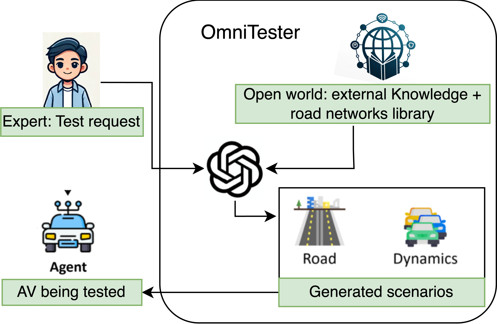
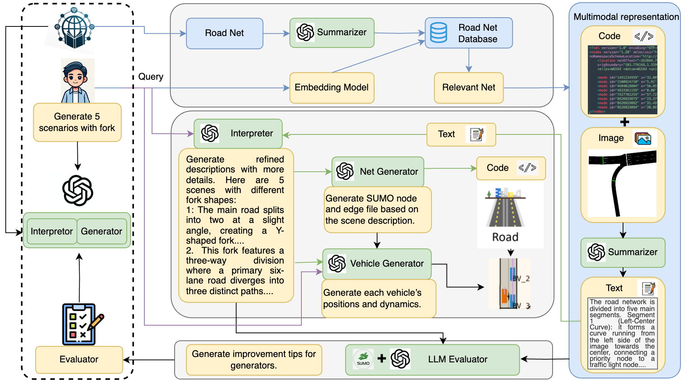
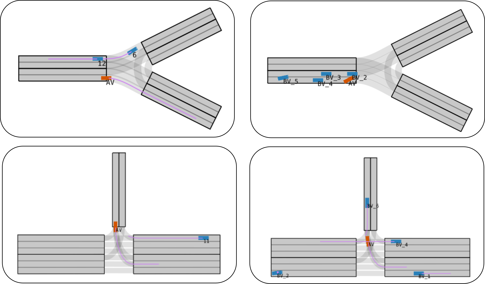
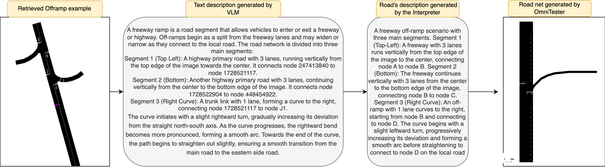
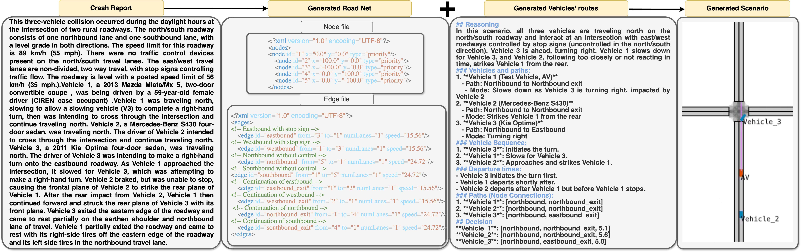
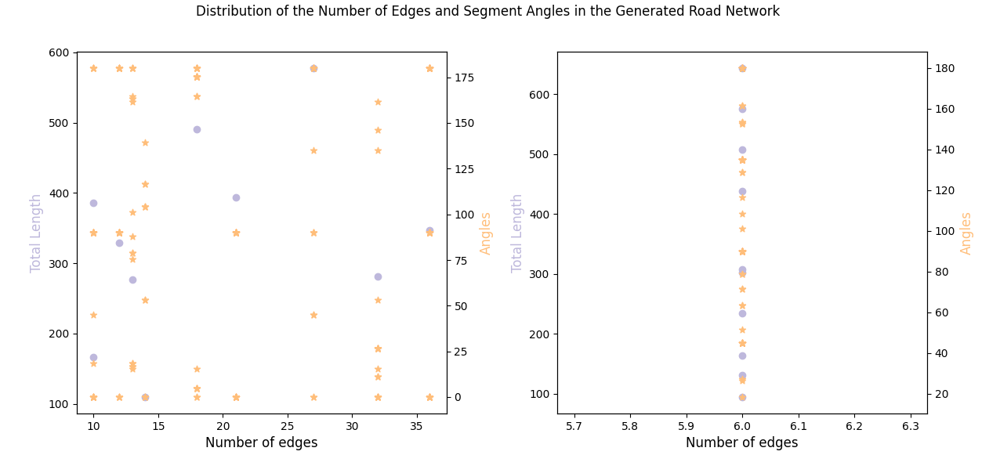
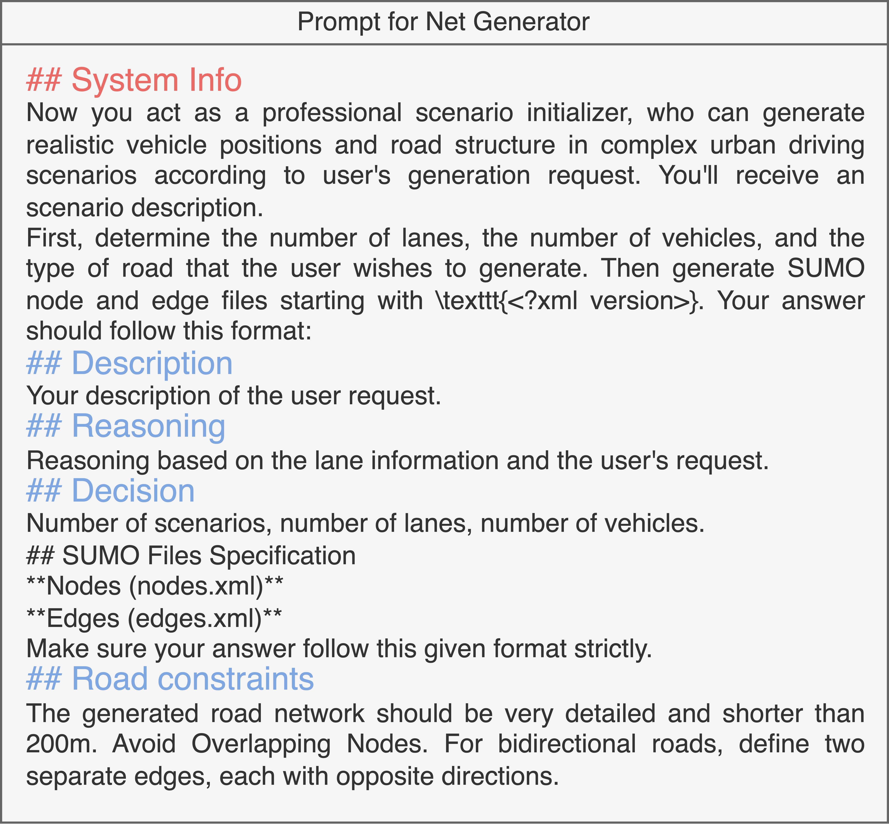
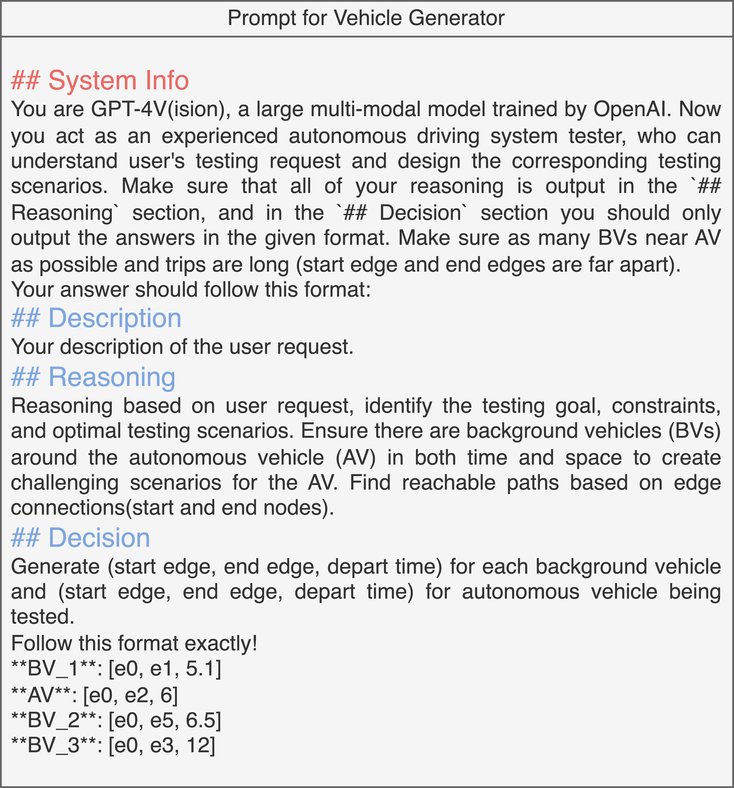

###### 요약

코너 케이스(corner cases)의 생성은 도로 배치 전에 자율 주행 차량을 효율적으로 테스트하는 데 점점 더 중요해지고 있습니다. 그러나 기존 방법은 다양한 테스트 요구 사항을 수용하는 데 어려움을 겪고 종종 미지의 상황에 일반화하는 능력이 부족하여 생성된 시나리오의 편리성과 유용성을 떨어뜨립니다. 현실적이고 도전적인 상황으로 효율적인 자율 주행 차량(AV) 테스트를 위한 쉽게 제어 가능한 시나리오 생성을 용이하게 하는 방법이 크게 필요합니다. 이를 해결하기 위해 우리는 LLM(대규모 언어 모델)의 광범위한 세계 지식과 추론 능력을 최대한 활용하는 멀티모달(multimodal) LLM 기반 프레임워크인 OmniTester를 제안했습니다. OmniTester는 시뮬레이션 환경 내에서 현실적이고 다양한 시나리오를 생성하도록 설계되어 AV 테스트 및 평가를 위한 강력한 솔루션을 제공합니다. 프롬프트 엔지니어링 외에도 LLM이 생성하는 코드의 복잡성을 단순화하기 위해 SUMO(Simulation of Urban Mobility)의 도구를 사용합니다. 또한, LLM의 시나리오 이해를 향상시켜 더욱 현실적인 장면을 생성할 수 있는 능력을 높이기 위해 검색 증강 생성(Retrieval-Augmented Generation) 및 자가 개선 메커니즘을 통합합니다. 실험에서 우리는 세 가지 유형의 도전적이고 복잡한 시나리오를 생성하는 우리 접근 방식의 제어 가능성과 현실성을 입증했습니다. 또한, LLM의 일반화 능력에 힘입어 충돌 보고서에 설명된 새로운 시나리오를 재구성하는 데 있어 그 효과를 보여주었습니다.

## I 서론

시나리오 기반 테스트는 자율 주행 개발에 필수적입니다. AV가 시뮬레이션 내부에서 특별히 제작된 시나리오에서 테스트될 수 있도록 하기 때문입니다. 이 방법은 성능 평가, 약점 식별, 안전 보장(AV 평가의 핵심 요소)에 필수적입니다. 그러나 현재 사용 중인 시나리오 라이브러리는 주로 실제 데이터에서 가져왔기 때문에 코너 케이스의 희소성으로 인해 부족합니다. 더 나쁜 것은 자율 주행의 지능 수준이 향상됨에 따라 중요한 이벤트의 희귀성이 점점 더 문제가 되어 "희귀성의 저주"라고 불리는 현상을 악화시킨다는 것입니다. 테스트 범위 부족과 테스트 프로세스 전반의 비효율성은 AV 안전 개선을 방해하고 있습니다. 따라서 테스트 시나리오의 효율적인 생성은 매우 중요합니다. 심층 강화 학습 및 적대적 프레임워크와 같은 다양한 기술이 탐구되었습니다. 그러나 AV 개발의 다양한 테스트 요구 사항과 다른 개발 단계를 고려할 때, 테스트 요구 사항을 충족하는 적절한 시나리오를 효과적으로 설계하고 생성하는 것은 미해결 과제로 남아 있습니다.

이 분야에서 많은 노력이 이루어졌으며, 주로 미리 정의된 기능이나 잘 정의된 검색 알고리즘을 기반으로 도전적인 시나리오를 생성하는 데 중점을 두었습니다. 그러나 요구 사항 설명에 따라 시나리오 생성을 유연하게 관리할 수 있는 효과적인 제어 메커니즘 개발에는 제한적인 탐구가 있었습니다. 이는 개발자가 시나리오를 추상적인 용어로 개념화하는 반면 시뮬레이션은 실행을 위해 정확한 구성을 요구하기 때문에 특히 중요합니다. 예를 들어, 개발자는 회전 시나리오를 구상할 수 있지만, 시뮬레이션은 각 회전에 대한 상세한 도로 기하학, 정확한 초기 차량 배치 및 동작을 요구합니다. 추상적인 설명을 기반으로 시나리오 생성 시스템의 제어 가능성을 향상시키면 개발자와 시나리오 기반 테스트 간의 격차를 해소하여 더 실행 가능한 도구가 되고 AV 시스템의 효율적인 성능 평가 경로를 가속화할 수 있습니다.

그러나 이러한 텍스트 기반 생성 메커니즘을 구축하는 것은 도로 구조의 정적 요소부터 에이전트 행동 및 내러티브 언어와 상세 구성 간의 매핑에 이르는 모델링 역량을 요구하기 때문에 어렵습니다. 또한 사용자 요청에 대한 순응도를 보장하고, 도로 네트워크의 다양성을 유지하며, 생성된 시나리오의 충실도를 보존해야 합니다. 이러한 생성 프로세스는 제어 신호를 이해하는 것뿐만 아니라 요청에서 추론하여 원하는 테스트 시나리오를 설계하고 생성하는 것을 포함하므로 높은 수준의 지능이 필요합니다. 인터넷에서 방대한 양의 데이터로 훈련된 LLM 및 VLM(Vision-Language Model)의 출현은 학습, 추론, 언어 능력, 인간과 유사한 의사소통 및 복잡한 사고 능력을 포함하는 놀라운 지능을 보여주었습니다. 의학, 교육, 금융, 공학 등 다양한 분야에서 LLM의 응용에 대한 광범위한 탐구가 있었습니다. 특히 OpenAI의 CodeX 및 DeepMind의 AlphaCode는 유망한 코딩 능력을 보여주었으며, MathPrompter는 수학적 추론에서 발전을 보여주었고, SceneCraft는 내러티브 경험을 생성하는 데 탁월했습니다.

대규모 언어 모델(LLM)의 이러한 인상적인 발전에 동기를 부여받아, 본 논문은 LLM의 코딩, 내러티브 및 추론 능력과 인터넷에서 얻은 광범위한 지식을 활용하여 개발자와 시뮬레이션 시스템 간의 격차를 해소하는 방법을 탐구하는 것을 목표로 합니다. 강력한 텍스트 기반 메커니즘을 갖춘 이러한 시뮬레이션 도구를 구축하는 데는 여러 가지 과제가 있습니다. 첫째, 텍스트로부터 도로 네트워크 및 차량 움직임을 현실적이고 정확하게 생성하는 것은 본질적으로 복잡하고 까다롭습니다. SORA 및 Kling에서 볼 수 있듯이 텍스트로부터 생생한 이미지 또는 비디오를 생성하는 것과 달리, 이 작업은 단순한 시각적 사실성을 넘어선 더 높은 수준의 정확성을 요구합니다. 이 과제는 정확한 공간 관계를 준수하는 도메인별, 복잡한 토폴로지 구조를 생성하는 데 있습니다. 둘째, LLM에 내재된 환각 및 오류는 특히 덜 흔한 테스트 시나리오에서 합리적인 도로 네트워크 또는 의미 있는 차량 역학을 생성하지 못하게 할 수 있습니다. 텍스트 입력을 기반으로 정확한 제어를 보장하는 것은 여전히 중요한 과제이며 추가 연구가 필요합니다. 셋째, LLM이 일반 코퍼스(corpus)로 훈련된다는 점을 고려할 때, LLM이 새로운 시나리오에 대한 생성 요청을 빠르게 이해하고 최소한의 정보만으로 특정 출력을 생성하면서 지속적으로 학습하도록 하는 방법은 중요한 과제입니다.

이러한 과제를 해결하고 LLM의 본질적인 지능적 역량을 최대한 활용하기 위해, 우리는 Fig.[1](https://arxiv.org/html/2409.06450v1#S1.F1)에 나타난 OmniTester를 도입했습니다. OmniTester는 사용자 요청에 응답하여 자율 주행 차량의 목표 기능을 테스트하기 위한 원하는 시나리오를 효과적으로 생성하는 완전 자동화된 파이프라인을 제안합니다. OmniTester는 프롬프트 엔지니어링과 오픈 소스 교통 시뮬레이션 패키지인 SUMO의 도구 통합을 통해 실제 환경과 매우 유사한 도로 지오메트리를 포함하는 현실적이고 다양한 시나리오를 생성합니다. 한편, OmniTester는 LLM 성능을 지속적으로 향상시키고 환각 및 내재된 오류를 줄이기 위해 설계된 자가 개선 메커니즘을 사용합니다. 또한 운영 설계 도메인 요구 사항에 적응하기 위해 외부 지식을 자동으로 쿼리하고 추출하는 RAG(Retrieval-Augmented Generation) 기반 생성 메커니즘을 사용합니다. 현재까지 알려진 바로는 OmniTester는 RAG 및 자가 개선 기술을 기반으로 뛰어난 제어 가능성과 유연성을 제공하며, 사용자 요청만으로 도로 구조 및 차량을 생성하는 최초의 시스템입니다.

본 논문의 나머지 부분은 다음과 같이 구성되어 있습니다. 섹션 [II](https://arxiv.org/html/2409.06450v1#S2)에서는 시나리오 생성에 대한 관련 연구와 자율 주행 도메인에서 LLM의 응용을 검토합니다. 섹션 [III](https://arxiv.org/html/2409.06450v1#S3)에서는 프롬프트 엔지니어링 기술 및 RAG 구현에 초점을 맞춰 OmniTester의 설계 및 구현을 자세히 설명합니다. 섹션 [IV](https://arxiv.org/html/2409.06450v1#S4)에서는 OmniTester가 생성한 다양한 시나리오를 선보이고, 시스템의 핵심 구성 요소의 효과를 평가합니다. 또한, 우리 시스템의 적용 사례로 충돌 보고서에서 시나리오를 재구성하는 사례 연구를 포함합니다. 마지막으로, 섹션 [V](https://arxiv.org/html/2409.06450v1#S5)에서 결론을 제시합니다.

그림 1: OmniTester의 LLM 생성 프레임워크

그림 2: OmniTester 내 데이터 흐름: 사용자 요청 시 Interpreter, RAG 모듈, Net Generator, Vehicle Generator 및 LLM Evaluator가 활성화됩니다.

## II 관련 연구

### II-A 시나리오 기반 테스트

안전은 자율 주행 차량의 광범위한 배포를 가로막는 주요 요인이며, 엄격한 테스트를 통해 안전하지 않은 구성 요소를 식별하고 해결하기 위해 광범위한 노력이 이루어졌습니다. 도로 테스트와 비교하여 시나리오 기반 테스트는 코너 케이스에 대한 더 나은 커버리지와 함께 더 효율적이고 목표 지향적인 평가를 제공하는 것을 목표로 합니다. 이 접근 방식은 안전 필수 상황을 강조하는 특별히 제작된 시나리오에서 자율 주행 차량을 테스트합니다. 그러나 이러한 시나리오를 설계하고 생성하는 것은 여전히 어렵고, 이를 해결하기 위해 다양한 방법이 개발되었습니다. 한 가지 간단한 방법은 장면의 모든 차량의 기록된 행동을 재생하는 것입니다. 이는 각 에이전트의 현실적인 행동을 보장합니다. 그럼에도 불구하고 이 방법은 전체 환경이 자율 주행 차량의 새로운 행동에 적응할 수 없고, 기존 수집된 시나리오에 국한되어 제한된 커버리지와 함께 신뢰할 수 없는 평가 결과가 발생한다는 한계가 있습니다.

새로운 도전적인 테스트 시나리오를 생성하기 위해 조합 기반, 최악의 경우, 적응형 시나리오 생성과 같은 다양한 방법이 탐구되었습니다. **조합 기반 시나리오 생성** 접근 방식은 시나리오를 여러 기본 시나리오 단위로 분해하고 이러한 기본 단위를 치환하고 결합하여 복잡한 시나리오를 구성합니다. **최악의 경우 시나리오 생성** 접근 방식은 인간의 조향 각도를 설계 변수로 사용하여 자율 주행 차량에 가장 도전적인 시나리오를 생성하도록 최적화합니다. **적응형 시나리오 생성** 접근 방식은 자율 주행 차량 대리 모델을 적응적으로 보정하여 모델의 성능 경계를 탐색하고 결정하며, 안전 평가를 위한 대표적인 시나리오를 생성합니다. 그러나 이러한 방법들은 제한된 범위의 시나리오만 제공할 수 있고 이러한 시나리오 내에서 에이전트를 현실적으로 모델링하지 못합니다. 결과적으로 실제 상황의 전체 복잡성을 포착하지 못합니다.

데이터 기반 모델도 시나리오 구축을 위해 탐구되었으며, 시뮬레이션 내에서 에이전트 행동부터 도로 네트워크에 이르는 시나리오의 핵심 구성 요소를 모델링하는 데 사용됩니다. 예를 들어, NeuralNDE는 안전 매핑을 가진 트랜스포머 기반 네트워크를 사용하여 현실적인 에이전트 행동을 제공하여 실제 분포와 분포 수준 유사성을 달성합니다. STRVE는 그래프 기반 조건부 VAE를 교통 사전으로 학습하여 규칙 기반 AV 플래너와 충돌을 유발하도록 각 에이전트의 행동을 최적화합니다. SLEDGE는 확산 트랜스포머를 사용하여 차선과 에이전트를 공동으로 생성하여 교통 시뮬레이션의 초기 상태 역할을 합니다. RealGen은 인코더-디코더 아키텍처와 검색 기반 컨텍스트 내 학습을 사용하여 현실적인 교통 시나리오를 합성합니다. 그러나 이러한 모델은 주로 제공된 데이터 세트를 기반으로 현실적인 시나리오를 생성하는 데 중점을 두므로, 새롭고 도전적인 상황을 합성하고 특정 테스트 목적을 위해 생성된 컨텍스트를 효과적으로 제어하는 문제는 해결되지 않은 채로 남아 있습니다.

### II-B LLM을 활용한 시나리오 생성

멀티모달 대규모 언어 모델은 자율 주행 시스템의 여러 측면에서 활용되었습니다.은 자율 주행 시스템에 대한 LLM(GPT3.5/4) 및 VLM(GPT4)의 적용을 탐구했습니다. 이러한 연구는 대규모 사전 훈련 모델의 추론, 해석 및 기억 능력을 활용하여 운전 환경을 인간과 유사한 방식으로 이해하고 복잡한 시나리오에 직면했을 때 정보에 입각한 운전 결정을 내리는 것을 목표로 합니다. 유사하게, 멀티모달 대규모 언어 모델은 시나리오 생성에도 활용되었습니다. **ChatScene**은 LLM을 사용하여 사용자 쿼리를 기반으로 시나리오를 생성하기 위해 Scenic 코드로 작성된 주어진 데이터베이스를 쿼리합니다. LLM의 추론 및 이해 능력을 활용하여 뛰어난 성능을 달성합니다. 그러나 주요 장면 설정을 구성하는 Scenic 코드 스니펫은 미리 정의된 라이브러리에서 가져온 것이므로, 새로운 도전적인 장면을 생성하는 데 있어 일반화 능력과 효과가 제한적입니다. **ChatSim**은 LLM을 활용하여 자연어 명령을 통해 포토리얼리스틱 3D 운전 장면 시뮬레이션을 공동으로 편집하고 생성하여 효율적이고 상호 작용적인 장면 수정을 가능하게 합니다. 그러나 기존 장면에 대한 수정에만 제한되어 처음부터 완전히 새로운 장면을 생성하는 기능이 부족합니다.

**LEADE**는 LLM 강화 적응형 진화 검색을 활용하여 자율 주행 시스템 테스트를 위한 안전 필수적이고 다양한 테스트 시나리오를 생성하는 시나리오 생성 접근 방식을 제안했습니다. 그러나 에이전트의 비정상적인 행동으로 인한 안전 위반 시나리오를 모델링하지 못합니다. **CTG++**는 LLM을 사용하여 안전 필수 시나리오에 대한 사용자 쿼리를 확산 모델의 해당 미분 가능한 손실 함수로 변환하여 쿼리 준수 궤적을 생성하는 것을 소개합니다. 그러나 지정된 초기 위치를 가진 주어진 도로 지도 내에서 에이전트 행동만 조작할 수 있습니다. **LLMScenario**는 LLM을 활용하여 최소한의 시나리오 설명을 기반으로 에이전트에 대한 짧은 궤적을 생성하여 시나리오 엔지니어링을 용이하게 합니다. 그러나 그 적용은 현재 고속도로 시나리오로 제한되며, 더 복잡한 환경으로의 확장을 위한 추가 탐구가 필요합니다.

중요하고 진화하는 연구 분야로서, 복잡한 상황을 생성하는 데 있어 제어 가능성 및 일반화 향상이라는 과제는 여전히 부적절하게 해결되지 않은 채로 남아 있습니다. 우리 연구는 멀티모달 LLM 기반, 텍스트 조건 파이프라인을 통해 도로 구조 및 차량을 처음부터 생성함으로써 이 과제를 해결하는 것을 목표로 합니다.

## III 방법

이 섹션에서는 텍스트 기반 시나리오 생성을 위해 설계된 멀티모달 LLM 기반 도구인 OmniTester 시스템을 설명합니다. 이 시스템 내에서 LLM의 시나리오 이해 및 생성 능력을 향상시키기 위한 여러 기술을 소개합니다. 전체 생성 프레임워크를 소개하는 것으로 시작하여 시나리오 생성을 위해 활용된 프롬프트 엔지니어링 기술에 대한 설명이 이어집니다. 그런 다음 Net Generator 및 Vehicle Generator 구성 요소에 대한 심층적인 설명을 제공합니다. 마지막으로 RAG 메커니즘을 소개합니다.

### III-A 파이프라인

그림 3: 두 단계 프로세스를 통해 도로 XML 파일을 생성합니다. 첫째, 적절하게 프롬프트된 LLM을 사용하여 노드 및 에지 파일을 직접 생성한 다음, SUMO를 사용하여 이를 해당 넷 파일로 변환합니다. 모두 XML 형식입니다.

생성 프레임워크는 Fig. [2](https://arxiv.org/html/2409.06450v1#S1.F2)에 설명되어 있습니다. 시나리오 세트를 생성하는 과정은 사용자가 "포크가 있는 시나리오 5개를 생성해 주세요."와 같은 특정 테스트 요청을 제출할 때 시작됩니다. 그런 다음 LLM이 호출되어 요청된 5가지 시나리오에 대해 "메인 도로가 약간의 각도로 두 갈래로 나뉩니다..."와 같은 서술적인 방식으로 시나리오 세부 사항을 설명합니다. 시나리오 설명이 완료되면 LLM을 기반으로 하는 Net Generator가 개요된 시나리오와 일치하는 도로 네트워크를 구성합니다. 도로 네트워크가 성공적으로 생성되면 다른 LLM 에이전트가 시나리오에 관련된 차량 역학을 구성하는 데 사용됩니다.

이후, LLM 기반 평가기가 배포되어 생성된 시나리오가 사용자 지정 테스트 의도, 특히 배경 차량(BV) 행동에 부합하는지 평가합니다. 동시에 RAG 모듈을 선택적으로 활성화하여 LLM의 의도된 도로 범주 이해를 정교화할 수 있습니다. AV 또는 BV의 행동이 원하는 기준을 충족하지 못하는 경우, 피드백이 직접 프롬프트에 통합됩니다. 이는 LLM이 평가기의 추론을 수정된 출력에 통합하여 시나리오를 다시 생성하도록 유도합니다. 이 반복적인 프로세스는 생성된 시나리오가 정확하고 사용자 초기 테스트 목표와 일치하도록 보장합니다.

### III-B 시나리오 프롬프트 엔지니어링

시나리오를 기하학적으로나 프로그래밍적으로 이해하는 LLM의 능력은 생성된 시나리오의 제어 가능성과 현실성에 큰 영향을 미칠 것입니다. 우리는 도메인 지식을 통합하고, 더 구조화된 출력을 생성하며, LLM의 추론 능력을 극대화하는 동시에 환각을 최소화하기 위해 다양한 프롬프트 기술을 활용했습니다. CoT(Chain-of-Thought) 프롬프팅은 LLM이 최종 답변을 제공하기 전에 추론 과정을 명확히 하도록 동기를 부여합니다. 우리는 생성 작업을 일련의 하위 문제로 분해하도록 특정 프롬프트를 설계하여, 모델이 궁극적인 해결책을 달성하기 위해 순차적으로 이러한 문제를 해결하도록 유도했습니다. 예를 들어, 네트워크 생성에서 우리는 모델이 사용자 요청을 이해하는 데 도움이 되는 다단계 프로세스를 활용합니다. 처음에 우리는 모델에게 "Description" 섹션에서 작업을 요약하도록 지시한 다음, "Reasoning" 섹션에서 "단계별로 추론 과정을 설명하세요"라고 안내합니다. 부록 1의 프롬프트 예시를 참조하십시오. 이 방법은 LLM이 테스트 요구 사항을 더 잘 이해하고 분석하는 데 도움이 될 뿐만 아니라 최소한의 환각으로 합리적인 사고를 장려합니다. 이 구성 요소의 중요성에 대한 추가 증거는 섹션 [IV-E](https://arxiv.org/html/2409.06450v1#S4.SS5)의 절제 연구를 참조하십시오.

둘째, LLM의 출력 요구사항을 명시합니다. LLM이 올바른 형식의 노드 및 에지 파일을 생성하도록 상세한 형식화 지침을 제공합니다. 또한, 출력 네트워크의 현실성을 높이기 위해 도로 길이 및 설계 규칙에 대한 추가 제약을 부과합니다.

출력의 복잡성, 차량 수의 변화, 그리고 이질적인 정보(예: 에지 및 시간 정보)를 고려하여, 우리는 퓨샷 프롬프트 기술을 사용하여 모델이 컨텍스트를 이해하고 더 높은 성공률로 원하는 형식의 응답을 생성하도록 돕습니다. 자세한 프롬프트 샘플은 부록 [A](https://arxiv.org/html/2409.06450v1#A1)를 참조하십시오.

### III-C LLM 기반 시나리오 생성

우리는 시나리오 생성을 도로 네트워크 생성과 에이전트 경로 생성의 두 단계로 분해합니다. 도로 구조는 정확하고 다양한 도로 구조에서 테스트하는 것이 AV가 도로 안전 규정을 준수하고 다양한 도로 조건에 적절하게 반응하도록 보장하므로 중요합니다. 도로 생성을 위한 구현에서 적절하게 프롬프트된 LLM 기반 Interpreter를 사용하여 전체 시나리오에 대한 상세한 설명을 생성한 다음, 설명에 따라 XML 형식으로 정의된 SUMO 호환 노드 및 에지 파일을 생성합니다. 마지막으로, SUMO 도구를 사용하여 이를 XML 형식으로 정의된 단일 넷 파일로 변환하여 전체 도로 네트워크를 나타냅니다. Fig. [3](https://arxiv.org/html/2409.06450v1#S3.F3)의 그림과 섹션 [IV](https://arxiv.org/html/2409.06450v1#S4)의 자세한 예시를 참조하십시오. 이 설계는 SUMO 또는 XML 형식에 국한되지 않습니다. 도로 네트워크는 자연스럽게 그래프 구조를 나타내므로 다른 구조화된 언어로 표현되고 그래프 도구로 처리되어 MATSim과 같은 다른 시뮬레이터와 호환될 수 있습니다.

다른 차량과의 긴밀한 상호 작용이 AV에 가장 어려운 시나리오 중 하나임을 고려하여, 우리는 LLM을 활용하여 관련된 차량에 대한 특정 경로를 생성함으로써 이러한 시나리오를 만듭니다. LLM의 지능은 주어진 시나리오 내에서 차량과 AV의 적절한 공간 및 시간적 위치를 설정하는 데 활용됩니다. 특히, LLM은 Interpreter에 의해 설명된 원하는 수의 차량에 대한 트립을 생성하기 위해 특별히 설계된 프롬프트로 호출됩니다. 이 제너레이터는 테스트 목표 및 도로 구조에 따라 AV 및 BV의 출발 및 도착 에지뿐만 아니라 출발 시간을 생성하도록 맞춤 제작되었습니다. 이러한 매개변수가 설정되면, 차량이 통과할 모든 에지를 포함한 상세한 경로는 도로 네트워크 및 교통 조건을 기반으로 경로를 최적화하는 duarouter 도구를 사용하여 계산됩니다.

초기에 차량 생성기가 생성한 도달 불가능한 경로를 효율적으로 수정하기 위해 추가 LLM이 사용됩니다. 네트워크 변환 도구 `netconvert`와 공동 디버깅을 통해 `netconvert`가 제공하는 오류 메시지는 무엇이 잘못되었고 무엇을 수정할 수 있는지에 대한 자세한 지침을 제공합니다. 이 상세한 피드백을 기반으로 LLM 기반 생성기는 차량에 대해 생성된 트립을 업데이트합니다. 적용된 상세 파이프라인은 Fig.[4](https://arxiv.org/html/2409.06450v1#S4.F4)를 참조하십시오. 이러한 자가 개선 메커니즘의 도움으로 모든 경로를 성공적으로 구성할 수 있습니다.

### III-D 시나리오를 위한 RAG

이 과정은 전 세계적으로 자유롭게 접근 가능하고 편집 가능한 지리적 데이터를 제공하는 협업 프로젝트인 OpenStreetMap에서 도로 지오메트리를 추출하는 것으로 시작됩니다. 이 플랫폼은 관심 지역의 상세하고 최신 도로 지오메트리를 얻는 데 활용되며, 도로 구조에 대한 공개 세계 지식을 제공하는 기본 데이터 세트 역할을 합니다. 추출된 도로 지오메트리는 `netconvert`를 사용하여 네트워크 모델로 변환됩니다. 이 모델은 SUMO와 호환되는 `net.xml` 형식으로 표현됩니다.

네트워크 모델 생성 후, SUMO의 그래픽 사용자 인터페이스(`sumo-gui`)를 사용하여 교통 시나리오의 조감도(BEV) 이미지가 생성됩니다. 이 이미지는 레이아웃 및 기타 관련 도로 네트워크 속성을 캡처합니다. BEV 이미지는 LLM의 입력으로 사용되며, LLM은 시각 정보를 처리하고 도로 지오메트리 및 네트워크 특성을 자세히 설명하는 텍스트를 생성합니다. 이 단계는 시각 데이터와 텍스트 표현 간의 격차를 해소하여 네트워크 특성을 텍스트 형식으로 더 쉽게 해석하고 추가 처리할 수 있도록 하는 데 중요합니다. LLM이 생성한 각 텍스트 설명은 OpenAI의 임베딩 도구인 `text-embedding-ada-002`를 사용하여 벡터 임베딩으로 변환됩니다. 이는 텍스트를 텍스트의 의미 특징을 수치적으로 포착하는 고차원 공간으로 변환합니다. 이러한 임베딩은 Chroma DB를 기반으로 하는 데이터베이스에 저장되어 의미론적 유사성을 기반으로 효율적인 검색 및 비교를 가능하게 합니다.

검색 단계에서는 대상 시나리오의 설명이 동일한 임베딩 도구를 사용하여 임베딩으로 변환됩니다. 이 임베딩은 임베딩 비교를 통해 데이터베이스에 저장된 가장 의미론적으로 유사한 도로 지오메트리를 식별하는 기반 역할을 합니다. 이 유사성 평가 방법은 선택된 도로 지오메트리가 대상 시나리오의 특정 요구 사항과 밀접하게 일치하도록 보장합니다. 자세한 내용은 섹션 [IV](https://arxiv.org/html/2409.06450v1#S4)를 참조하십시오.

적절한 도로 지오메트리가 식별되면 해당 노드 및 에지 파일이 시나리오 생성 프로세스에서 추가 입력(프롬프트)으로 활용됩니다. 이 접근 방식은 컨텍스트 내 학습을 활용합니다. 여기서 시나리오 생성기는 노드 및 에지 파일이 제공하는 특정 컨텍스트 세부 정보를 통합하여 출력을 조정하고 정교화합니다. 이 통합은 도로 네트워크의 특정 특성에 맞춰 생성된 교통 시나리오의 정확성과 관련성을 향상시킵니다.

## IV 실험

그림 4: 경로 생성을 위한 자가 개선 피드백 루프.

그림 5: OmniTester가 생성한 샘플링된 현실적인 교차로가 제시됩니다. 왼쪽: Interpreter가 생성한 설명; 가운데: 넷 XML 파일에서 SUMO가 시각화한 도로 구조; 오른쪽: 실제 세계에서 발견된 유사한 도로.

이 섹션에서는 시나리오 생성을 위한 우리의 멀티모달 LLM 프레임워크의 효과를 입증합니다. 첫째, 사용자 테스트 요청을 기반으로 시스템이 높은 현실성을 유지하면서 다양한 상황을 커버하기 위해 다양한 시나리오를 생성할 수 있음을 보여줍니다. 둘째, LLM 기반 AV를 사용하여 이러한 시나리오의 난이도를 강조합니다. 셋째, RAG 모듈의 효과를 보여줍니다. 더 상세한 설명으로 시나리오를 생성하는 우리 시스템의 제어 가능성 및 일반화 능력을 입증하기 위해, OmniTester가 충돌 보고서의 텍스트 설명만을 기반으로 유사한 위험 상황을 생성하는 사례 연구를 소개합니다. 마지막으로, 철저한 절제 연구를 통해 이 프레임워크의 핵심 설계 요소의 중요성을 검증합니다.

### IV-A 제어 가능한 현실적인 시나리오

제어 가능한 시나리오 생성은 사용자 요청에 대한 높은 순응도와 현실적인 출력을 요구합니다. 우리 실험에서, 적절한 프롬프팅을 통해 LLM이 이 작업에서 강력한 지능과 높은 성능을 보여주었음을 관찰했습니다. 포괄적인 설명을 포함한 생성된 도로 네트워크의 상세한 예시는 Fig.[3](https://arxiv.org/html/2409.06450v1#S3.F3)에서 볼 수 있습니다. Interpreter는 교차로 유형(T자형), 도로 레이아웃, 각 방향의 차선 수, 도로 이름 및 교통 조건과 같은 상세한 설명을 성공적으로 생성합니다. 이 설명을 기반으로 Net Generator는 세부 사항과 일치하도록 노드를 지능적으로 배치하고, 이 노드 위에 차선 및 연결이 설명과 일치하는 에지를 생성합니다. 그림에서 보듯이, 노드를 올바르게 연결하여 설명과 일치하는 레이아웃을 만들 뿐만 아니라 에지의 방향과 해당 이름을 설명하는 주석을 생성하여 사람이 읽을 수 있도록 합니다.

OmniTester의 성능을 체계적으로 평가하기 위해, 우리는 먼저 전체 시스템의 제어 가능성을 측정합니다. 이는 도로 구조 및 에이전트 관련 설명의 두 가지 논리적 수준으로 나눌 수 있습니다. 우리는 생성된 결과가 사용자 요청 및 인터프리터의 설명과 이 두 관점에서 얼마나 일치하는지 평가했습니다. 요청과 생성된 결과 간의 정렬을 정량적으로 평가하기 위해 여러 정확도 지표를 계산합니다.

장면 유형의 정확도는 생성된 네트워크의 장면 범주가 사용자 요청 또는 인터프리터가 제공한 상세 장면 설명과 일치하는지 평가합니다. 차선/차량 수는 설명에 지정된 개수가 생성된 결과와 일치하는지 측정합니다.

출력이 요구되는 출력 형식을 따르지 않거나 생성된 넷을 SUMO가 인식할 수 없는 경우, 우리는 엄격하게 한 번의 생성 시도를 실패로 간주합니다. 성공률은 시나리오 수로 평균화됩니다. 일반 도로 시나리오, 교차로, 포크 시나리오의 세 가지 다른 테스트 요청이 각각 10개의 생성 시나리오와 비교됩니다. Table [I](https://arxiv.org/html/2409.06450v1#S4.T1)에서 볼 수 있듯이 OmniTester는 정확한 유형의 도로 네트워크를 생성하는 데 높은 성공률을 보입니다. 또한 대부분의 경우 Interpreter의 설명에 따라 원하는 수의 차량을 생성하는 데 100%의 정확도를 달성합니다. 그러나 도로 네트워크를 생성할 때 지정된 도로의 정확한 차선 수에 대한 약간의 혼란이 나타났는데, 이는 언어 모델에 내재된 환각 때문일 수 있습니다. 게다가 생성 실패는 주로 키워드의 잘못된 형식(예: 추가 ”#” 태그 또는 추가 ”:”)으로 인해 발생하여 긴 텍스트 응답에서 노드 및 에지 파일을 구문 분석할 수 없게 됩니다. 이러한 파일 생성의 복잡성을 고려할 때, 단일 통과 생성의 성공률은 합리적으로 높으며, 올바른 출력은 종종 재생성을 통해 나타납니다.

다음으로, 생성된 시나리오의 복잡성을 측정하기 위해 총 차선 수, 에지 수, 경로 길이, 그리고 차량 수의 평균 및 표준 편차를 계산합니다. Table [II](https://arxiv.org/html/2409.06450v1#S4.T2)에서 볼 수 있듯이, 이러한 지표는 다양한 유형의 도로에 걸쳐 넓은 범위를 가지며, 다양한 시나리오 생성을 나타냅니다. 또한, 포크 시나리오에 비해 교차로는 경로 길이 및 차선 수에서 더 큰 변화를 보이며, 이는 교차로의 복잡성과 다양한 유형을 고려할 때 합리적입니다. 에지 및 총 길이에 대한 상세한 산점도는 Fig.[9](https://arxiv.org/html/2409.06450v1#S4.F9)의 왼쪽 그림에서 볼 수 있으며, 넓은 범위를 포괄하고 다양한 상황을 커버함을 보여줍니다.

일부 샘플 결과는 Fig.[5](https://arxiv.org/html/2409.06450v1#S4.F5)에 시각화되어 있습니다. 교차로 시나리오 생성 요청에 대해 LLM은 일반적인 Y자형(상단), 4방향(가운데), T자형(하단) 교차로를 생성합니다. 보시다시피 Interpreter는 일반적인 방향에서 주요 세그먼트에 이르기까지 레이아웃을 명확하게 생성할 뿐만 아니라 보행자 시설, 경사로, 시야 거리 등 매우 상세한 정보를 제공합니다. Y자형 교차로의 경우, 생성된 설명에는 "예각으로 분할"을 구체적으로 언급하고 회전 반경 정보를 제공하는 중요한 특징이 포함됩니다. 이러한 수준의 세부 정보는 물리적 레이아웃과 기능적 측면이 정확하게 표현되도록 보장합니다. 4방향 교차로의 경우, Interpreter는 교차하는 도로의 이동 방향을 정밀하게 설명하여 레이아웃이 실용적이고 일반적인 4방향 교차로 구성과 일치하도록 보장합니다. 여기에는 현실적인 시나리오 생성에 필수적인 차선 할당 및 가능한 교통 흐름에 대한 정보가 포함됩니다. T자형 교차로와 관련하여 Interpreter는 교통 상황 및 분할 방향을 포괄적으로 다룹니다. 메인 도로에서 측면 도로로, 그리고 그 반대로 교통이 어떻게 흐르는지, 신호 제어에 대한 세부 정보를 포함하여 설명합니다. 이러한 경우 SUMO에서 나온 최종 넷 XML 출력은 레이아웃에서 각 세그먼트의 차선 수에 이르기까지 설명과 일치합니다. 보시다시피 OmniTester는 높은 현실성을 가진 교차로에 대한 상세한 내러티브를 생성할 수 있으며, 요구 사항에 따라 도로 구조도 생성할 수 있습니다.

표 I: 명령의 순응도

|      Accuracy      | General Scenarios | Intersection | Fork |
| :----------------: | :---------------: | :----------: | :--: |
|     Scene Type     |         1         |     0.9      |  1   |
|  Number of lanes   |         1         |      1       | 0.9  |
| Number of vehicles |         1         |      1       | 0.9  |
|    Success rate    |        0.7        |     0.8      | 0.8  |

표 II: 생성된 시나리오의 다양성

|   Scenario   | General Scenarios | Intersection |    Fork    |
| :----------: | :---------------: | :----------: | :--------: |
|   # Lanes    |     19.3±8.93     |  23.50±8.91  | 10.50±5.25 |
|   # Edges    |    10.80±2.75     |  12.0±4.71   | 6.60±2.80  |
| Route Length |   335.98±132.22   | 386.98±162.2 | 297.03±142 |
|  # Vehicles  |     10.6±5.43     |   6.9±2.95   |  7.3±4.33  |

### IV-B 제어 가능한 도전적인 시나리오

SUMO 도구의 RandomTrip은 지정된 도착률로 나타나는 차량에 대해 소스 및 목적지 에지를 무작위로 선택하여 주어진 네트워크에 대한 무작위 트립 세트를 생성합니다. 가능한 시나리오를 충분히 커버하므로 이를 기준선으로 사용했습니다. LLM 생성 시나리오와의 공정한 비교를 보장하기 위해, 우리는 약간 더 높은 도착률을 사용한 다음 생성된 시나리오의 차량 수와 일치하도록 차량을 무작위로 삭제하여 일관된 혼잡 수준을 유지합니다.

생성된 시나리오의 도전 수준을 평가하기 위해, LLM 기반 자율 주행 차량이 이 시나리오 내에서 주행하는 데 사용됩니다. 그 성능이 나쁠수록 시나리오는 더 도전적인 것으로 간주됩니다. 우리는 Limism++의 성능 지표를 채택하여 AV의 성능을 정량화합니다. 운전 점수는 주행 편안함, 운전 효율성, 운전 안전에 대한 가중치 점수로 계산됩니다. 경로 완료 값은 운전자 에이전트가 완료한 경로 길이와 미리 설정된 경로의 총 경로 길이의 비율입니다. 자세한 내용은 Limism++를 참조하십시오.

표 III: 포크 시나리오에 대한 LLM 기반 차량 생성기의 도전 과제

|     Scenario     |    Ours     | RandomTrip  |
| :--------------: | :---------: | :---------: |
| Route completion |  0.42±0.50  |  0.72±0.46  |
|  Driving score   | 40.22±36.54 | 63.34±27.43 |
|   Total score    | 31.09±38.74 | 55.14±37.26 |
|     Use Time     | 67.90±36.33 | 89.71±76.56 |
|   Success rate   |  0.50±0.53  |  0.80±0.42  |

Table [III](https://arxiv.org/html/2409.06450v1#S4.T3)에 표시된 바와 같이, 우리 LLM 기반 차량 생성기는 더 도전적인 BV 경로를 생성하여 AV의 성공률 및 성능 점수를 현저히 낮춥니다.

그림 6: 왼쪽: RandomTrip으로 생성된 시나리오, AV와 BV가 무작위로 입구에서 무작위 시간에 나타납니다. 오른쪽: OmniTester가 생성한 도전적인 상황, AV와 BV 경로가 교차로 주변에서 밀도 높은 상호 작용을 생성하도록 면밀하게 설계되었습니다.

포킹(forking) 및 합류(merging) 상황에 대한 두 가지 샘플 테스트 사례가 Fig.[6](https://arxiv.org/html/2409.06450v1#S4.F6)에 나와 있습니다. 상단 시나리오에서 동일한 교차로 내에서 무작위로 분포된 차량들이 AV가 통과할 빈 차선을 남겨두고, 주변 차선에는 다른 차량이 없습니다. AV는 다른 차량과의 상호 작용 없이 교차로를 원활하게 통과하여, 이 테스트 시나리오는 상호 작용 능력을 테스트하는 데 덜 효과적입니다. 이와 대조적으로 OmniTester는 교차로 근처에서 혼잡한 교통 상황을 생성하여 AV가 통과하기 전에 차선 변경을 수행하도록 요구합니다. 이 도전적인 시나리오는 궁극적으로 BV2와의 충돌로 이어져 밀집 교통 조건에서 이 LLM 기반 AV의 차선 변경 전략에 내재된 결함을 드러냅니다. 하단 시나리오에서 T자형 교차로에서 좌회전하는 AV는 RandomTrip 설정에서 상호 작용할 마주오는 차량을 만나지 않습니다. 이와 대조적으로 OmniTester는 AV 뒤를 따르는 차량, AV를 이끄는 차량, 그리고 AV가 회전할 때 교차로를 향해 주행하는 또 다른 차량과 복잡한 상호 작용 상황을 생성합니다. 이러한 복잡성은 AV의 추론 및 의사 결정 과정을 시험하여 이 LLM 기반 AV의 내재된 결함을 더 쉽게 드러냅니다.

### IV-C RAG 모듈의 효과

그림 7: 왼쪽: 데이터베이스에서 검색된 고속도로 진출입로. 오른쪽: 유사한 레이아웃으로 생성된 도로 네트워크.

다양한 고속도로 램프 시나리오를 생성하기 위해 OpenStreetMap에서 여러 진입/진출 램프 지도를 가져와 데이터베이스에 추가했습니다. 사용자 요청 시, 이 데이터베이스에서 검색된 데이터의 도움을 받아 현실적인 램프 시나리오를 생성할 수 있습니다. 생성 지원을 위해 도로 네트워크의 코드, 텍스트 또는 그림 형식을 즉석에서 사용하는 대신, 증류된 정보를 제공하기 위해 도로 구조에 대한 상세한 설명이 준비됩니다. 생성된 설명은 Net Generator가 원본의 레이아웃, 세그먼트 세부 사항 및 방향 흐름과 일치하는 유사한 새 도로 구조를 구축하는 데 충분한 정보를 받도록 보장합니다.

Fig.[2](https://arxiv.org/html/2409.06450v1#S1.F2)에 나타난 바와 같이, 텍스트 설명은 VLM 기반 요약 도구를 사용하여 생성됩니다. VLM의 시각 및 공간 추론 능력에 힘입어 레이아웃 정보를 그림에서 추출할 수 있습니다. 노드 및 에지 파일은 길이, 차선 수, 각 곡선 에지의 모양을 포함한 도로 구조에 대한 상세한 정보를 제공합니다. 이 풍부한 정보를 바탕으로 요약 도구는 공개된 세계의 지식과 프롬프트에서 주입된 힌트를 기반으로 핵심 특징을 지능적으로 선택합니다. 그런 다음 모든 중요한 정보를 최종 설명으로 요약합니다. 이 설명에는 일반적인 레이아웃, 주요 세그먼트 위치, 이동 방향, 연결성, 심지어 곡선 모양에 대한 상세한 설명까지 포함됩니다. Fig.[7](https://arxiv.org/html/2409.06450v1#S4.F7)에는 검색된 예시의 설명이 고속도로 진출입로 도로 구조의 생성을 어떻게 안내했는지 보여주는 예시가 포함되어 있습니다. 보시다시피, 메인 고속도로와 고속도로를 빠져나가는 트렁크를 포함하여 세 가지 세그먼트로 구성된 고속도로 진출입로를 설명합니다. 레이아웃, 세그먼트, 각 에지의 차선 수를 자세히 설명할 뿐만 아니라 곡선 모양에 대한 철저한 설명도 제공합니다. 프롬프트에서 이 예시를 사용하면 Interpreter는 Net Generator에 대해 유사한 설명을 생성하여 상세한 곡선 정보를 보존할 수 있습니다. 최종 생성된 네트워크는 제공된 예시와 유사한 모양, 특히 진출입로의 곡률을 공유합니다.

그림 8: 충돌 보고서를 기반으로, 우리 프레임워크는 제공된 모든 정보를 사용하여 도로 네트워크를 생성할 수 있습니다. 또한 사고 전 차량의 주행 경로를 추론하여 전체 시나리오를 재구성할 수 있습니다.

그림 9: 왼쪽: 에지 수, 세그먼트 각도, 총 길이가 다양한 생성된 다양한 도로 네트워크. 오른쪽: 인터프리터 구성 요소 제거로 인해 에지 수가 동일한 유사 도로 네트워크.

### IV-D 충돌 보고서와 함께 OmniTester의 효과

우리 OmniTester 프레임워크의 직접적인 적용은 텍스트로 설명된 시나리오와 유사한 시나리오를 재구성하는 것입니다. 이를 통해 AV 시스템 스트레스 테스트에 사용될 수 있는 여러 도전적인 테스트 시나리오를 생성할 수 있습니다. 예를 들어, 각 차량의 출발 시간을 변경하거나 운전 전략을 변경함으로써 위험 상황 근처에서 광범위한 테스트 시나리오를 생성할 수 있습니다.

예를 들어, 우리는 충돌 보고서의 한 사례를 사용하여 차량의 반응을 테스트하기 위해 유사한 위험 상황을 재구성하는 방법을 시연합니다. 구체적으로, Interpreter를 사용하는 대신, Net Generator 및 Vehicle Generator에 대한 충돌 보고서의 시나리오 설명을 직접 사용합니다. Fig.[8](https://arxiv.org/html/2409.06450v1#S4.F8)에 표시된 바와 같이, 텍스트는 충돌 보고서에서 직접 추출되었으며, 교차로 근처에서 발생한 충돌 이벤트를 설명합니다. 도로의 이동 방향과 km/h 단위의 속도 제한이 포함됩니다. Net Generator는 보고서에 설명된 정확한 지오메트리를 생성할 뿐만 아니라 SUMO의 기본 속도 단위인 m/s로 속도 단위를 오류 없이 자동으로 변환합니다. Vehicle Generator의 경우, 추론 과정에 따라 각 차량의 속성(예: 브랜드 및 색상)을 추출하고 충돌 진화 과정에만 기반하여 상대적 위치를 추론할 수 있습니다. "차량 1이 교차로에 접근하자 우회전하려는 차량 3을 위해 속도를 늦췄습니다. 차량 2는 브레이크를 밟았지만 멈출 수 없어 차량 2의 전면이 차량 1의 후면을 충돌했습니다. 차량 2의 후방 충돌 후, 차량 1은 계속 전진하여 차량 3의 후면을 전면으로 충돌했습니다." 결국, 시스템은 상대적 위치가 일치하고 유사한 시나리오가 재구성될 수 있도록 해당하는 출발 시간과 함께 경로를 재구성할 수 있습니다.

### IV-E 절제 연구

표 IV: 절제 연구: 성공률 변화

|          Metrics          | Success rate* |
| :-----------------------: | :-----------: |
|           Ours            |       1       |
|    without netconvert     |       0       |
|    without interpreter    |       1       |
| without reasoning section |      0.4      |

Table [IV](https://arxiv.org/html/2409.06450v1#S4.T4)에 표시된 바와 같이, `netconvert` 구성 요소를 제거하면 생성 프로세스(장면당 최대 3회 시도)의 성공률이 1에서 0으로 떨어집니다. 여러 반복 오류가 발생하며, 네트워크를 직접 생성하는 근본적인 능력이 없음을 나타냅니다. 예를 들어, LLM의 응답에 `net` 파일에 `”limitedTurnSpeed=true”`와 같은 알 수 없는 키워드가 포함되어 SUMO로 구문 분석할 수 없게 됩니다. 또한, 생성된 넷 XML에는 연결이 누락되거나 잘못된 연결이 포함되어 `”An unknown lane”`과 같은 오류가 발생합니다.

각 시나리오에 대한 상세한 서술적 설명을 생성하는 역할을 하는 인터프리터를 제거한 후, LLM은 한 번에 다양한 네트워크 구조를 생성하지 못합니다. LLM은 일관되게 사소한 공간적 변화를 가진 4개의 노드와 동일한 노드에 의해 정의된 6개의 에지를 생성합니다. Fig.[9](https://arxiv.org/html/2409.06450v1#S4.F9)에 표시된 바와 같이, 왼쪽 그림에 비해 오른쪽 그림은 네트워크 구조의 다양성이 부족합니다. 이는 다양성이 다단계 생성 프로세스에 의해 크게 지원됨을 보여줍니다.

CoT(Chain-of-Thought) 메커니즘을 제거한 후, 관찰된 정확도 저하는 주로 세 가지 만연한 문제에 기인합니다. 첫 번째 문제는 요소 정의 내에서 중요한 속성이 누락되는 것입니다. 예를 들어, "차선" 요소 정의 내에 "형태" 속성이 없으면 SUMO가 차선 구성을 정확하게 로드하고 해석할 수 없습니다. 두 번째 문제는 지정된 열거형 외부에 있는 속성 값의 사용에서 비롯됩니다. 예를 들어, "에지" 요소의 "spreadType" 속성은 차선 지오메트리를 에지 지오메트리에서 계산하는 방법을 나타내는데, 허용 가능한 값은 "오른쪽", "중앙", "도로 중앙"으로 제한됨에도 불구하고 잘못 "왼쪽" 값이 할당되었습니다. 세 번째 문제는 요소 내에 선언되지 않은 속성을 활용하는 것입니다. 예를 들어, 생성된 XML 파일이 잘못된 XML 스키마를 참조하여 "에지" 요소 내의 "function" 속성이 선언되지 않았습니다.

## V 결론 및 향후 연구

우리는 LLM 및 VLM 모델을 기반으로 한 시나리오 생성 프레임워크를 제시합니다. 이는 RAG 및 자가 개선 기술을 기반으로 높은 제어 가능성과 유연성을 갖춘 사용자 요청에 따라 도로 구조 및 차량을 생성하는 최초의 시스템입니다. 우리는 교통 흐름 시뮬레이터가 적절하게 설계된 프롬프트로 LLM이 복잡하고 다양한 테스트 시나리오를 생성하는 효율적인 도구 역할을 할 수 있음을 보여줍니다. XML로 작성된 구조화된 정의는 이미지 기반 표현 및 서술적 설명과 결합되어 시나리오를 효과적으로 나타냅니다. 마지막으로, 효과적인 피드백을 통한 자가 개선은 시나리오 생성을 향상시킬 수 있습니다.

현재의 노력은 아직 초기 단계에 있으며, 멀티모달 대규모 언어 모델과 이러한 모델 내에서 학습된 방대한 지식을 활용하여 더 복잡한 시나리오를 만드는 것은 여전히 미해결 질문으로 남아 있습니다. 향후 연구 방향 중 하나는 심층 신경망(DNN) 또는 다른 LLM 모델에 의해 제어될 수 있는 더 현실적인 BV 행동을 생성하는 것입니다. 다른 방향은 상세한 설명을 기반으로 시나리오 내에서 더 많은 요소를 모델링하는 것입니다. 이 길을 추구함으로써, 우리는 시뮬레이션 환경의 현실성과 복잡성을 향상시켜 테스트를 더 목표 지향적이고 효율적으로 만드는 제어 가능한 세계 모델을 생성하는 것을 목표로 합니다.

## Appendix A Prompt Examples

LLM의 추론 및 생성 능력을 향상시키는 데 있어 프롬프트는 매우 중요합니다. 첨부 그림 [10](https://arxiv.org/html/2409.06450v1#A1.F10 "Figure 10 ‣ Appendix A Prompt Examples ‣ Multimodal Large Language Model Driven Scenario Testing for Autonomous Vehicles")은 OmniTester의 Net 생성기 및 Vehicle 생성기에 사용된 프롬프트를 보여줍니다. 각 프롬프트는 생성 작업에 대한 요약, 생성 프로세스 지침, 그리고 출력 형식에 대한 요구 사항을 포함합니다. Net 생성기 프롬프트는 생성된 노드 및 에지 파일이 잘 정의된 XML 형식인지 확인하기 위해 여러 도로 제약 조건을 추가로 포함합니다. Vehicle Generator 프롬프트는 어려운 상황에 대한 설명을 포함합니다.

Figure 10:  The system prompts for Net Generator and Vehicle Generator of OmniTester.